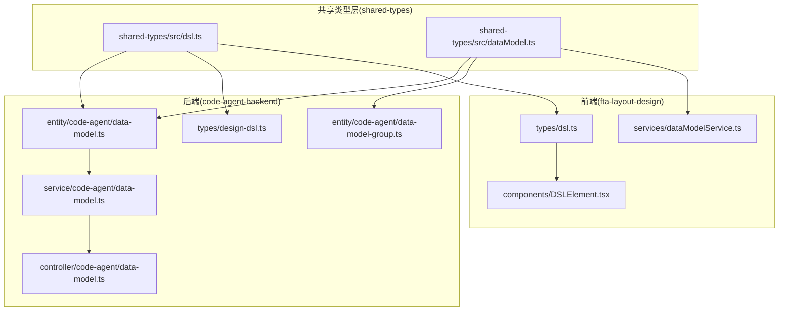
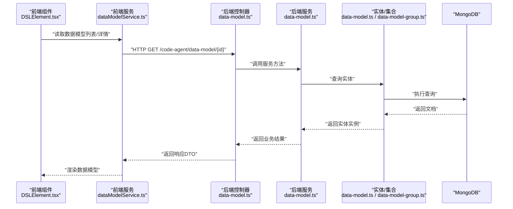
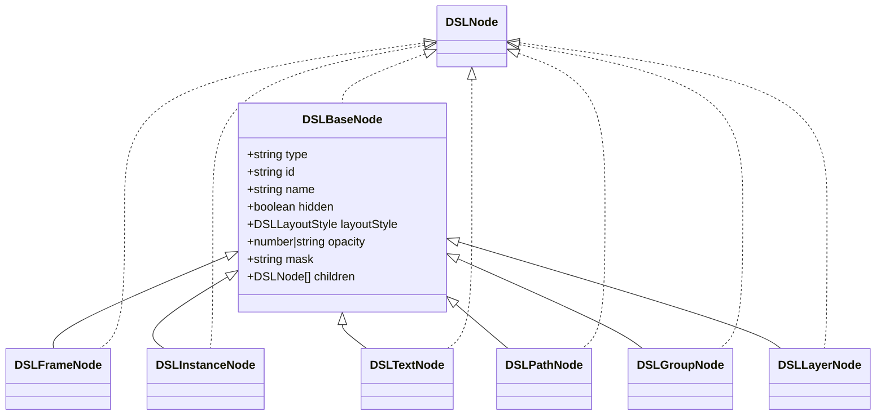
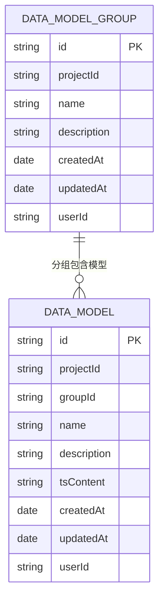
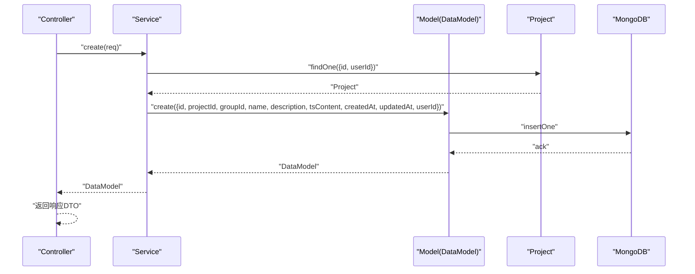
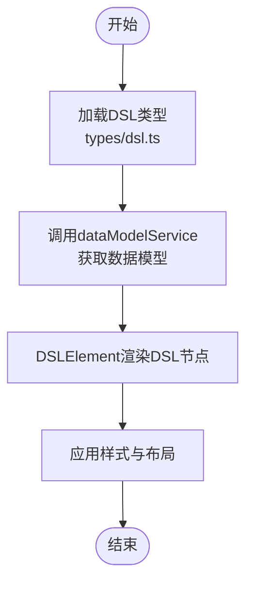
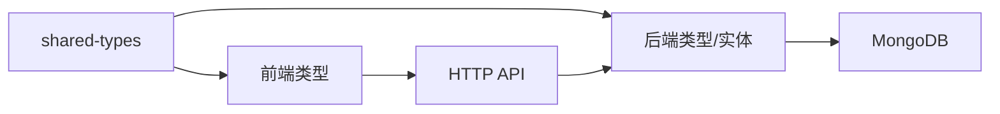

# 数据模型设计

<cite>
**本文引用的文件**
- [shared-types/src/dsl.ts](file://shared-types/src/dsl.ts)
- [shared-types/src/dataModel.ts](file://shared-types/src/dataModel.ts)
- [code-agent-backend/src/entity/code-agent/data-model.ts](file://code-agent-backend/src/entity/code-agent/data-model.ts)
- [code-agent-backend/src/entity/code-agent/data-model-group.ts](file://code-agent-backend/src/entity/code-agent/data-model-group.ts)
- [code-agent-backend/src/service/code-agent/data-model.ts](file://code-agent-backend/src/service/code-agent/data-model.ts)
- [code-agent-backend/src/controller/code-agent/data-model.ts](file://code-agent-backend/src/controller/code-agent/data-model.ts)
- [code-agent-backend/src/types/design-dsl.ts](file://code-agent-backend/src/types/design-dsl.ts)
- [fta-layout-design/src/types/dsl.ts](file://fta-layout-design/src/types/dsl.ts)
- [fta-layout-design/src/services/dataModelService.ts](file://fta-layout-design/src/services/dataModelService.ts)
- [docs/data_source_proposal.md](file://docs/data_source_proposal.md)
- [docs/implementation_plan.md](file://docs/implementation_plan.md)
- [fta-layout-design/src/components/DSLElement.tsx](file://fta-layout-design/src/components/DSLElement.tsx)
- [MasterGoDSL.md](file://MasterGoDSL.md)
</cite>

## 目录
1. [引言](#引言)
2. [项目结构](#项目结构)
3. [核心组件](#核心组件)
4. [架构总览](#架构总览)
5. [详细组件分析](#详细组件分析)
6. [依赖分析](#依赖分析)
7. [性能考虑](#性能考虑)
8. [故障排查指南](#故障排查指南)
9. [结论](#结论)
10. [附录](#附录)

## 引言
本文件聚焦于“设计DSL”和“数据模型”两大核心实体，系统化梳理其类型定义、数据结构、持久化方式、代码表示、业务规则与交互流程，并给出面向初学者的实体关系图（ERD）与面向开发者的数据访问与操作示例路径。同时，结合项目文档对数据模型的版本演进与迁移策略进行说明，帮助读者快速理解并高效使用。

## 项目结构
围绕DSL与数据模型，涉及三层：共享类型层（shared-types）、后端实体与服务层（code-agent-backend）、前端布局与服务层（fta-layout-design）。共享类型层统一了DSL与数据模型的类型定义，后端负责持久化与业务逻辑，前端负责调用与渲染。

图表来源
- [shared-types/src/dsl.ts](file://shared-types/src/dsl.ts#L1-L163)
- [shared-types/src/dataModel.ts](file://shared-types/src/dataModel.ts#L1-L54)
- [code-agent-backend/src/entity/code-agent/data-model.ts](file://code-agent-backend/src/entity/code-agent/data-model.ts#L1-L55)
- [code-agent-backend/src/entity/code-agent/data-model-group.ts](file://code-agent-backend/src/entity/code-agent/data-model-group.ts#L1-L48)
- [code-agent-backend/src/service/code-agent/data-model.ts](file://code-agent-backend/src/service/code-agent/data-model.ts#L1-L219)
- [code-agent-backend/src/controller/code-agent/data-model.ts](file://code-agent-backend/src/controller/code-agent/data-model.ts#L1-L125)
- [code-agent-backend/src/types/design-dsl.ts](file://code-agent-backend/src/types/design-dsl.ts#L1-L21)
- [fta-layout-design/src/services/dataModelService.ts](file://fta-layout-design/src/services/dataModelService.ts#L1-L132)
- [fta-layout-design/src/types/dsl.ts](file://fta-layout-design/src/types/dsl.ts#L1-L22)
- [fta-layout-design/src/components/DSLElement.tsx](file://fta-layout-design/src/components/DSLElement.tsx#L1-L63)

章节来源
- [shared-types/src/dsl.ts](file://shared-types/src/dsl.ts#L1-L163)
- [shared-types/src/dataModel.ts](file://shared-types/src/dataModel.ts#L1-L54)
- [code-agent-backend/src/entity/code-agent/data-model.ts](file://code-agent-backend/src/entity/code-agent/data-model.ts#L1-L55)
- [code-agent-backend/src/entity/code-agent/data-model-group.ts](file://code-agent-backend/src/entity/code-agent/data-model-group.ts#L1-L48)
- [code-agent-backend/src/service/code-agent/data-model.ts](file://code-agent-backend/src/service/code-agent/data-model.ts#L1-L219)
- [code-agent-backend/src/controller/code-agent/data-model.ts](file://code-agent-backend/src/controller/code-agent/data-model.ts#L1-L125)
- [code-agent-backend/src/types/design-dsl.ts](file://code-agent-backend/src/types/design-dsl.ts#L1-L21)
- [fta-layout-design/src/services/dataModelService.ts](file://fta-layout-design/src/services/dataModelService.ts#L1-L132)
- [fta-layout-design/src/types/dsl.ts](file://fta-layout-design/src/types/dsl.ts#L1-L22)
- [fta-layout-design/src/components/DSLElement.tsx](file://fta-layout-design/src/components/DSLElement.tsx#L1-L63)

## 核心组件
- 设计DSL（Design DSL）
  - 节点类型：FRAME、INSTANCE、TEXT、PATH、GROUP、LAYER
  - 基础属性：type、id、name、hidden、layoutStyle、opacity、mask、children
  - 样式与布局：DSLStyles、DSLLayoutStyle、StyleValue、ImageValue
  - 数据载体：DSLData、DesignData
- 数据模型（Data Model）
  - 字段：id、projectId、groupId（可选）、name、description、tsContent、createdAt、updatedAt、userId
  - 请求/响应：CreateDataModelRequest、UpdateDataModelRequest、DataModelDefinition
  - 分组：DataModelGroup（项目级分组）

章节来源
- [shared-types/src/dsl.ts](file://shared-types/src/dsl.ts#L1-L163)
- [shared-types/src/dataModel.ts](file://shared-types/src/dataModel.ts#L1-L54)
- [code-agent-backend/src/entity/code-agent/data-model.ts](file://code-agent-backend/src/entity/code-agent/data-model.ts#L1-L55)
- [code-agent-backend/src/entity/code-agent/data-model-group.ts](file://code-agent-backend/src/entity/code-agent/data-model-group.ts#L1-L48)

## 架构总览
后端通过Typegoose将数据模型实体映射到MongoDB集合，控制器暴露REST API，前端通过服务封装调用后端接口，并在布局编辑器中消费DSL类型进行渲染。

图表来源
- [fta-layout-design/src/components/DSLElement.tsx](file://fta-layout-design/src/components/DSLElement.tsx#L1-L63)
- [fta-layout-design/src/services/dataModelService.ts](file://fta-layout-design/src/services/dataModelService.ts#L1-L132)
- [code-agent-backend/src/controller/code-agent/data-model.ts](file://code-agent-backend/src/controller/code-agent/data-model.ts#L1-L125)
- [code-agent-backend/src/service/code-agent/data-model.ts](file://code-agent-backend/src/service/code-agent/data-model.ts#L1-L219)
- [code-agent-backend/src/entity/code-agent/data-model.ts](file://code-agent-backend/src/entity/code-agent/data-model.ts#L1-L55)
- [code-agent-backend/src/entity/code-agent/data-model-group.ts](file://code-agent-backend/src/entity/code-agent/data-model-group.ts#L1-L48)

## 详细组件分析

### 设计DSL（DSL）类型体系
- 节点类型与属性
  - DSLNodeType：'FRAME' | 'INSTANCE' | 'TEXT' | 'PATH' | 'GROUP' | 'LAYER'
  - DSLBaseNode：type、id、name、hidden、layoutStyle、opacity、mask、children
  - 各具体节点：
    - DSLFrameNode：填充、描边、flex容器信息、overflow、borderRadius等
    - DSLInstanceNode：componentId、componentInfo.properties
    - DSLTextNode：text、textColor、textAlign、textMode、flexGrow/flexShrink
    - DSLPathNode：path数组（包含fill、data）
    - DSLGroupNode：children
    - DSLLayerNode：fill、borderRadius、opacity、stroke系列、effect
- 样式与布局
  - DSLStyles：键值对，值为DSLStyle（value、token）
  - DSLLayoutStyle：width、height、relativeX、relativeY、left、top、rotate
  - StyleValue、ImageValue用于样式与图片资源
- 数据载体
  - DSLData：styles、nodes
  - DesignData：dsl（DSLData）

图表来源
- [shared-types/src/dsl.ts](file://shared-types/src/dsl.ts#L1-L163)

章节来源
- [shared-types/src/dsl.ts](file://shared-types/src/dsl.ts#L1-L163)
- [code-agent-backend/src/types/design-dsl.ts](file://code-agent-backend/src/types/design-dsl.ts#L1-L21)
- [fta-layout-design/src/types/dsl.ts](file://fta-layout-design/src/types/dsl.ts#L1-L22)
- [MasterGoDSL.md](file://MasterGoDSL.md#L70-L95)

### 数据模型（Data Model）类型与实体
- 类型定义
  - DataModelDefinition：id、projectId、groupId（可选）、name、description、tsContent、createdAt、updatedAt、userId
  - CreateDataModelRequest / UpdateDataModelRequest：用于创建/更新的请求载荷
- 实体映射
  - 集合：code_agent_data_model
  - 字段映射：与类型一致，支持时间戳自动维护
- 分组实体
  - 集合：code_agent_data_model_group
  - 字段：id、projectId、name、description、createdAt、updatedAt、userId

图表来源
- [code-agent-backend/src/entity/code-agent/data-model-group.ts](file://code-agent-backend/src/entity/code-agent/data-model-group.ts#L1-L48)
- [code-agent-backend/src/entity/code-agent/data-model.ts](file://code-agent-backend/src/entity/code-agent/data-model.ts#L1-L55)
- [shared-types/src/dataModel.ts](file://shared-types/src/dataModel.ts#L1-L54)

章节来源
- [shared-types/src/dataModel.ts](file://shared-types/src/dataModel.ts#L1-L54)
- [code-agent-backend/src/entity/code-agent/data-model.ts](file://code-agent-backend/src/entity/code-agent/data-model.ts#L1-L55)
- [code-agent-backend/src/entity/code-agent/data-model-group.ts](file://code-agent-backend/src/entity/code-agent/data-model-group.ts#L1-L48)

### 数据访问与操作（后端）
- 控制器
  - 提供创建、更新、删除、按项目/分组/未分组/ID查询等REST接口
- 服务
  - 身份校验与用户隔离：resolveUserId
  - 创建/更新/删除/查询：create/update/delete/getByProjectId/getByGroupId/getUngrouped/getById/getByIds
  - 事务/校验：findOneAndUpdate + runValidators
- 实体
  - Typegoose注解：@EntityModel、@modelOptions（collection、timestamps）、@prop

图表来源
- [code-agent-backend/src/controller/code-agent/data-model.ts](file://code-agent-backend/src/controller/code-agent/data-model.ts#L1-L125)
- [code-agent-backend/src/service/code-agent/data-model.ts](file://code-agent-backend/src/service/code-agent/data-model.ts#L1-L219)
- [code-agent-backend/src/entity/code-agent/data-model.ts](file://code-agent-backend/src/entity/code-agent/data-model.ts#L1-L55)

章节来源
- [code-agent-backend/src/controller/code-agent/data-model.ts](file://code-agent-backend/src/controller/code-agent/data-model.ts#L1-L125)
- [code-agent-backend/src/service/code-agent/data-model.ts](file://code-agent-backend/src/service/code-agent/data-model.ts#L1-L219)
- [code-agent-backend/src/entity/code-agent/data-model.ts](file://code-agent-backend/src/entity/code-agent/data-model.ts#L1-L55)

### 前端集成与DSL渲染
- 类型复用
  - 前端通过types/dsl.ts与shared-types对齐，确保DSL类型一致
- 服务封装
  - dataModelService.ts封装后端API调用，便于组件使用
- 渲染组件
  - DSLElement.tsx根据DSL节点类型渲染不同元素，应用样式与布局

图表来源
- [fta-layout-design/src/types/dsl.ts](file://fta-layout-design/src/types/dsl.ts#L1-L22)
- [fta-layout-design/src/services/dataModelService.ts](file://fta-layout-design/src/services/dataModelService.ts#L1-L132)
- [fta-layout-design/src/components/DSLElement.tsx](file://fta-layout-design/src/components/DSLElement.tsx#L1-L63)

章节来源
- [fta-layout-design/src/types/dsl.ts](file://fta-layout-design/src/types/dsl.ts#L1-L22)
- [fta-layout-design/src/services/dataModelService.ts](file://fta-layout-design/src/services/dataModelService.ts#L1-L132)
- [fta-layout-design/src/components/DSLElement.tsx](file://fta-layout-design/src/components/DSLElement.tsx#L1-L63)

### 版本控制与迁移策略
- 现状与目标
  - 从“JSON Schema”向“TypeScript Interfaces”迁移，新增tsContent字段，移除旧schema字段
- 迁移步骤
  - 后端：实体与DTO更新，服务方法适配tsContent
  - 前端：编辑器增加TS代码模式，提供模板与导入能力
  - 文档：实施计划与数据源提案明确迁移路径
- 验证与兼容
  - 通过ts-morph或TypeScript编译器API在保存时验证TS合法性
  - 保持DSL类型在shared-types中统一，前后端共享

章节来源
- [docs/implementation_plan.md](file://docs/implementation_plan.md#L1-L25)
- [docs/data_source_proposal.md](file://docs/data_source_proposal.md#L1-L85)
- [shared-types/src/dataModel.ts](file://shared-types/src/dataModel.ts#L1-L54)
- [code-agent-backend/src/service/code-agent/data-model.ts](file://code-agent-backend/src/service/code-agent/data-model.ts#L1-L219)

## 依赖分析
- 类型依赖
  - shared-types提供DSL与数据模型的统一类型定义，前后端均通过types/dsl.ts与types/dataModel.ts复用
- 运行时依赖
  - 后端：Typegoose（@typegoose/typegoose）、EntityModel、MongoDB
  - 前端：apiService封装HTTP调用，DSLElement消费DSL类型渲染
- 循环依赖
  - 当前结构清晰，类型通过共享包解耦，未见循环依赖迹象

图表来源
- [shared-types/src/dsl.ts](file://shared-types/src/dsl.ts#L1-L163)
- [shared-types/src/dataModel.ts](file://shared-types/src/dataModel.ts#L1-L54)
- [code-agent-backend/src/types/design-dsl.ts](file://code-agent-backend/src/types/design-dsl.ts#L1-L21)
- [fta-layout-design/src/types/dsl.ts](file://fta-layout-design/src/types/dsl.ts#L1-L22)

章节来源
- [shared-types/src/dsl.ts](file://shared-types/src/dsl.ts#L1-L163)
- [shared-types/src/dataModel.ts](file://shared-types/src/dataModel.ts#L1-L54)
- [code-agent-backend/src/types/design-dsl.ts](file://code-agent-backend/src/types/design-dsl.ts#L1-L21)
- [fta-layout-design/src/types/dsl.ts](file://fta-layout-design/src/types/dsl.ts#L1-L22)

## 性能考虑
- 查询优化
  - 按projectId、groupId、userId建立索引，提高筛选效率
  - 使用lean查询减少文档转换开销
- 写入优化
  - 批量ID查询使用$in，避免多次往返
- 渲染优化
  - DSL渲染按需选择/悬停状态，避免不必要的重绘
- 存储优化
  - tsContent为字符串，建议在前端侧做最小化与缓存策略（参考DSL最小化工具链思路）

## 故障排查指南
- 常见错误
  - 用户ID缺失：resolveUserId失败导致操作拒绝
  - 项目不存在：创建/更新前需校验项目归属
  - 数据模型不存在：更新/删除/详情查询时未找到记录
- 排查步骤
  - 检查请求头/上下文中的用户标识
  - 核对projectId、groupId、id是否匹配当前用户
  - 查看服务层日志与MongoDB集合状态
- 建议
  - 在控制器层统一捕获异常并设置合理HTTP状态码
  - 对敏感字段（如tsContent）在保存前进行语法校验

章节来源
- [code-agent-backend/src/service/code-agent/data-model.ts](file://code-agent-backend/src/service/code-agent/data-model.ts#L1-L219)
- [code-agent-backend/src/controller/code-agent/data-model.ts](file://code-agent-backend/src/controller/code-agent/data-model.ts#L1-L125)

## 结论
本设计以共享类型为核心，将DSL与数据模型的定义统一在shared-types中，后端通过Typegoose持久化至MongoDB，前端通过服务封装与组件渲染形成闭环。数据模型正从JSON Schema向TypeScript Interfaces演进，配合模板、导入与验证机制，提升可维护性与LLM友好度。建议在生产环境中完善索引、批量查询与前端渲染优化，确保性能与稳定性。

## 附录
- 代码示例路径（仅路径，不含代码内容）
  - DSL类型定义：[shared-types/src/dsl.ts](file://shared-types/src/dsl.ts#L1-L163)
  - 数据模型类型定义：[shared-types/src/dataModel.ts](file://shared-types/src/dataModel.ts#L1-L54)
  - 数据模型实体：[code-agent-backend/src/entity/code-agent/data-model.ts](file://code-agent-backend/src/entity/code-agent/data-model.ts#L1-L55)
  - 数据模型分组实体：[code-agent-backend/src/entity/code-agent/data-model-group.ts](file://code-agent-backend/src/entity/code-agent/data-model-group.ts#L1-L48)
  - 数据模型服务：[code-agent-backend/src/service/code-agent/data-model.ts](file://code-agent-backend/src/service/code-agent/data-model.ts#L1-L219)
  - 数据模型控制器：[code-agent-backend/src/controller/code-agent/data-model.ts](file://code-agent-backend/src/controller/code-agent/data-model.ts#L1-L125)
  - 后端DSL类型导出：[code-agent-backend/src/types/design-dsl.ts](file://code-agent-backend/src/types/design-dsl.ts#L1-L21)
  - 前端DSL类型导出：[fta-layout-design/src/types/dsl.ts](file://fta-layout-design/src/types/dsl.ts#L1-L22)
  - 前端数据模型服务：[fta-layout-design/src/services/dataModelService.ts](file://fta-layout-design/src/services/dataModelService.ts#L1-L132)
  - 前端DSL渲染组件：[fta-layout-design/src/components/DSLElement.tsx](file://fta-layout-design/src/components/DSLElement.tsx#L1-L63)
  - DSL最小化工具链思路：[MasterGoDSL.md](file://MasterGoDSL.md#L1-L296)
  - 数据模型迁移与重构计划：[docs/implementation_plan.md](file://docs/implementation_plan.md#L1-L25)
  - 数据源维护方案（TS接口优势与迁移）：[docs/data_source_proposal.md](file://docs/data_source_proposal.md#L1-L85)