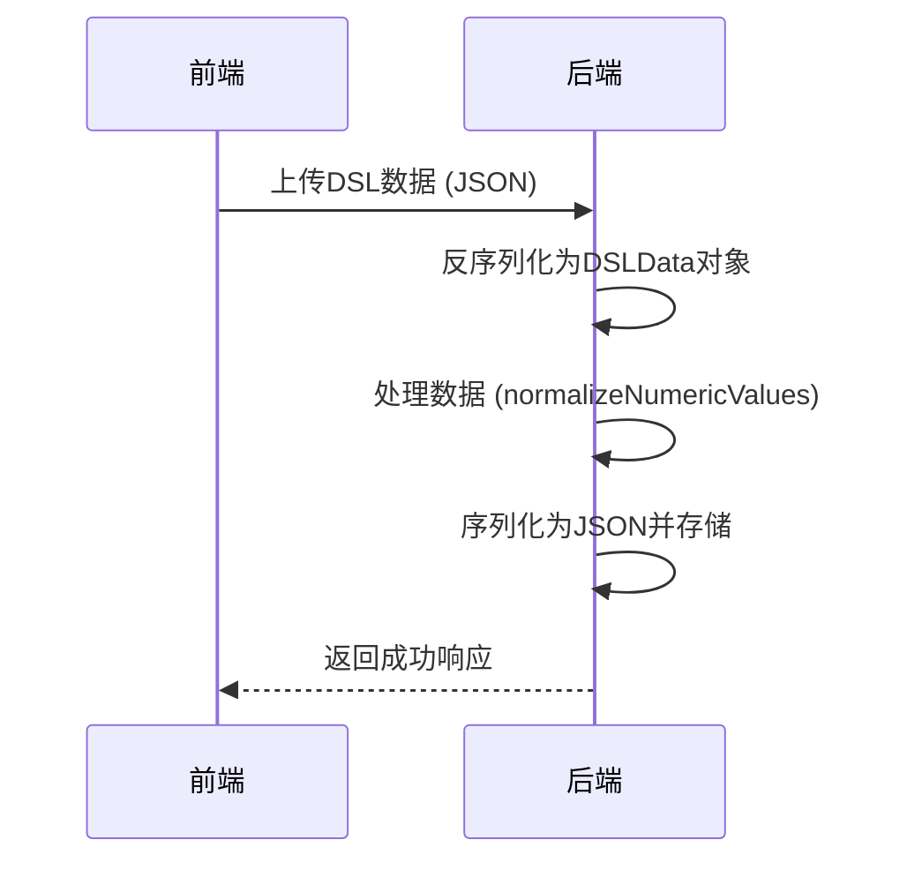

# 数据结构与元信息

<cite>
**本文档引用的文件**   
- [dsl.ts](file://shared-types/src/dsl.ts#L1-L162)
- [design-document.ts](file://code-agent-backend/src/entity/design/design-document.ts#L1-L108)
- [dsl.ts](file://code-agent-backend/src/types/design-dsl.ts#L1-L21)
- [dsl.ts](file://fta-layout-design/src/types/dsl.ts#L1-L21)
- [req.ts](file://code-agent-backend/src/dto/design-dsl/req.ts#L1-L74)
- [res.ts](file://code-agent-backend/src/dto/design-dsl/res.ts#L1-L86)
- [dsl.ts](file://code-agent-backend/src/utils/design/dsl.ts#L1-L45)
- [path-asset.ts](file://code-agent-backend/src/entity/code-agent/design-dsl/path-asset.ts#L1-L40)
</cite>

## 目录
1. [引言](#引言)
2. [DSLData整体数据结构](#dslData整体数据结构)
3. [元信息机制](#元信息机制)
4. [dslRevision版本控制](#dslRevision版本控制)
5. [dslDigest完整性校验](#dslDigest完整性校验)
6. [metadata扩展字段](#metadata扩展字段)
7. [DSL数据序列化与反序列化](#dsl数据序列化与反序列化)
8. [DSL数据校验](#dsl数据校验)
9. [开发者最佳实践](#开发者最佳实践)
10. [结论](#结论)

## 引言
DSLData是本系统中用于描述设计稿的核心数据结构，它通过整合节点树（nodes）和样式表（styles）来完整表达设计稿的视觉和布局信息。该数据结构在前端、后端和代理核心组件之间共享，确保了系统各部分对设计稿理解的一致性。本文档详细阐述DSLData的整体结构、元信息机制以及相关的版本控制、完整性校验等关键特性。

## DSLData整体数据结构
DSLData数据结构由两个核心部分组成：`styles`（样式表）和`nodes`（节点树）。`styles`是一个键值映射，存储了设计稿中使用的所有样式定义，每个样式通过唯一的ID进行引用。`nodes`是一个树形结构的节点数组，代表了设计稿的层次化组织，每个节点可以包含子节点，形成嵌套的布局结构。

节点类型（DSLNodeType）包括FRAME（框架）、INSTANCE（实例）、TEXT（文本）、PATH（路径）、GROUP（组）和LAYER（图层），每种类型都有特定的属性来描述其视觉和布局特征。例如，FRAME节点包含flexContainerInfo属性来描述弹性布局，TEXT节点包含text和textColor属性来描述文本内容和颜色渐变。

```mermaid
graph TD
A[DSLData] --> B[styles: DSLStyles]
A --> C[nodes: DSLNode[]]
B --> D[样式ID]
B --> E[样式值]
C --> F[DSLNode]
F --> G[DSLBaseNode]
G --> H[type]
G --> I[id]
G --> J[layoutStyle]
F --> K[DSLFrameNode]
F --> L[DSLInstanceNode]
F --> M[DSLTextNode]
F --> N[DSLPathNode]
F --> O[DSLGroupNode]
F --> P[DSLLayerNode]
```

**图源**
- [dsl.ts](file://shared-types/src/dsl.ts#L137-L140)

**本节来源**
- [dsl.ts](file://shared-types/src/dsl.ts#L137-L162)

## 元信息机制
DSLData的元信息机制通过在设计文档实体（DesignDocumentEntity）中添加专门的字段来实现。这些元信息字段独立于DSLData本身，但与之紧密关联，提供了关于设计稿的额外上下文和管理信息。元信息包括版本号（dslRevision）、完整性摘要（dslDigest）、状态（status）、创建者（createdBy）等，这些信息对于设计稿的生命周期管理至关重要。

元信息机制的设计使得DSLData可以保持纯净，专注于描述设计稿的内容，而管理信息则由专门的字段处理。这种分离提高了数据结构的清晰度和可维护性，同时也便于对元信息进行独立的查询和更新操作。

**本节来源**
- [design-document.ts](file://code-agent-backend/src/entity/design/design-document.ts#L49-L107)

## dslRevision版本控制
`dslRevision`字段是一个自增的数字，用于标识DSLData的版本。每当设计稿被更新时，该字段的值就会递增，从而形成一个清晰的版本历史。这个版本控制机制在设计稿的增量同步和冲突解决中发挥着关键作用。

在增量同步场景中，客户端可以通过比较本地和服务器上的`dslRevision`值来确定是否需要获取更新。如果服务器上的版本号更高，客户端就知道有新的更改需要同步。在冲突解决方面，系统可以使用`dslRevision`来检测并发编辑：如果两个用户同时编辑同一个设计稿，系统可以通过版本号来识别冲突，并采取适当的解决策略，如提示用户合并更改或选择保留最新版本。

**本节来源**
- [design-document.ts](file://code-agent-backend/src/entity/design/design-document.ts#L53-L55)

## dslDigest完整性校验
`dslDigest`字段存储了DSLData内容的哈希摘要，用于验证数据的完整性。该字段通常采用MD5或SHA-256等哈希算法生成，将整个DSLData对象序列化后计算出一个唯一的字符串标识。当需要验证数据是否被篡改或在传输过程中是否损坏时，系统可以重新计算DSLData的哈希值并与存储的`dslDigest`进行比较。

如果两个哈希值匹配，则说明数据是完整的且未被修改；如果不匹配，则表明数据可能已被篡改或损坏。这种完整性校验机制对于确保设计稿数据的可靠性和安全性至关重要，特别是在分布式系统中，数据可能在多个节点之间传输和存储。

**本节来源**
- [design-document.ts](file://code-agent-backend/src/entity/design/design-document.ts#L80-L82)

## metadata扩展字段
`metadata`字段是一个灵活的键值对对象，用于存储自定义的扩展信息。这个字段的设计意图是提供一个可扩展的机制，允许开发者根据具体需求添加额外的元数据，而无需修改核心数据结构。使用场景包括存储与设计稿相关的业务信息、用户注释、自动化测试配置等。

由于`metadata`字段的类型是`Record<string, unknown>`，它可以容纳各种类型的数据，从简单的字符串到复杂的嵌套对象。这种灵活性使得系统能够适应不断变化的需求，同时保持核心数据结构的稳定性。开发者在使用此字段时应注意命名规范，以避免键名冲突。

**本节来源**
- [design-document.ts](file://code-agent-backend/src/entity/design/design-document.ts#L96-L98)

## DSL数据序列化与反序列化
DSL数据的序列化和反序列化主要通过JSON格式进行。在序列化过程中，完整的DSLData对象被转换为JSON字符串，以便于存储或网络传输。反序列化则是将JSON字符串解析回DSLData对象的过程。为了确保数值的精度，系统提供了`normalizeNumericValues`工具函数，该函数递归地处理所有数值字段，将其保留两位小数，从而避免浮点数精度问题。

序列化和反序列化操作在系统各组件之间传递DSL数据时频繁发生，例如从前端上传设计稿到后端，或从后端返回处理结果到前端。这些操作的高效性和正确性对于系统的整体性能和用户体验至关重要。



**图源**
- [dsl.ts](file://code-agent-backend/src/utils/design/dsl.ts#L17-L43)
- [req.ts](file://code-agent-backend/src/dto/design-dsl/req.ts#L4-L27)

**本节来源**
- [dsl.ts](file://code-agent-backend/src/utils/design/dsl.ts#L6-L45)

## DSL数据校验
DSL数据的校验包括结构校验和语义校验两个层面。结构校验确保DSLData对象符合预定义的接口规范，例如所有必需的字段都存在且类型正确。这通常通过TypeScript的类型系统在编译时完成，或在运行时通过JSON Schema验证。

语义校验则关注数据的逻辑一致性，例如检查节点ID的唯一性、样式引用的有效性等。`dslDigest`字段提供了一种高效的完整性校验方法，通过比较哈希值来快速判断数据是否被修改。此外，系统还可能实现更复杂的校验规则，如布局约束检查、资源引用验证等，以确保设计稿的可用性和正确性。

**本节来源**
- [design-document.ts](file://code-agent-backend/src/entity/design/design-document.ts#L80-L82)
- [dsl.ts](file://code-agent-backend/src/utils/design/dsl.ts#L17-L43)

## 开发者最佳实践
开发者在操作DSL数据时应遵循以下最佳实践：首先，在合并数据时，应使用`dslRevision`来检测和解决冲突，避免覆盖他人的更改。其次，在计算差异时，可以利用`dslDigest`来快速比较两个版本的差异，而无需逐字段对比。对于版本管理，建议建立清晰的版本发布流程，每次重大更改都应递增`dslRevision`并更新`dslDigest`。

此外，开发者应充分利用`metadata`字段来存储与项目相关的上下文信息，但应避免将核心业务逻辑数据存储在其中。在序列化和反序列化过程中，应始终使用`normalizeNumericValues`等工具函数来确保数值精度的一致性。最后，建议定期验证DSL数据的完整性，特别是在关键操作前后。

**本节来源**
- [design-document.ts](file://code-agent-backend/src/entity/design/design-document.ts#L53-L55)
- [dsl.ts](file://code-agent-backend/src/utils/design/dsl.ts#L17-L43)

## 结论
DSLData作为一个核心数据结构，通过精心设计的节点树和样式表整合，有效地描述了复杂的设计稿信息。其元信息机制，包括版本控制、完整性校验和扩展字段，为设计稿的管理和协作提供了坚实的基础。开发者通过遵循最佳实践，可以充分利用这些特性，构建可靠且高效的设计工具。