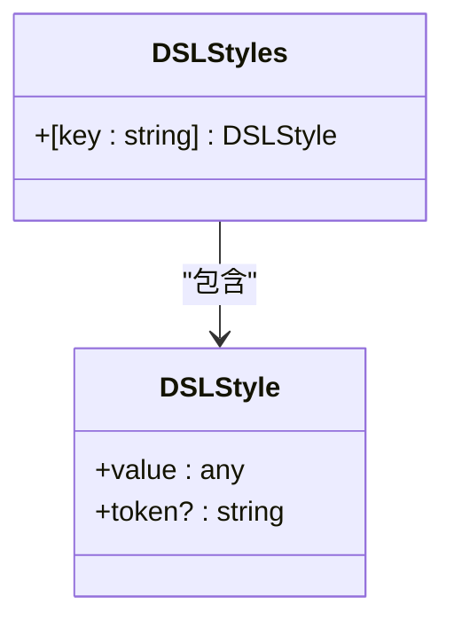
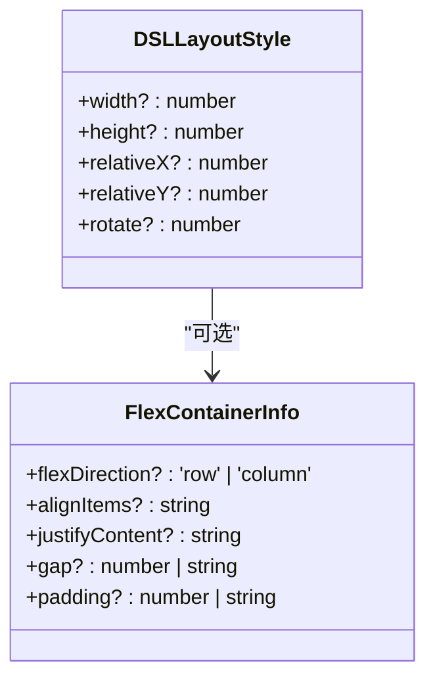
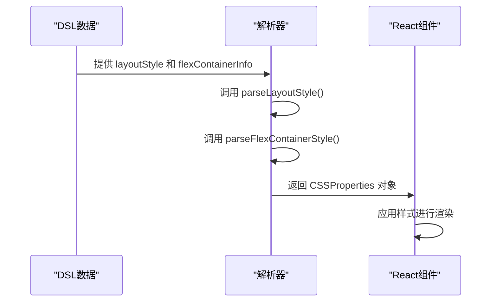
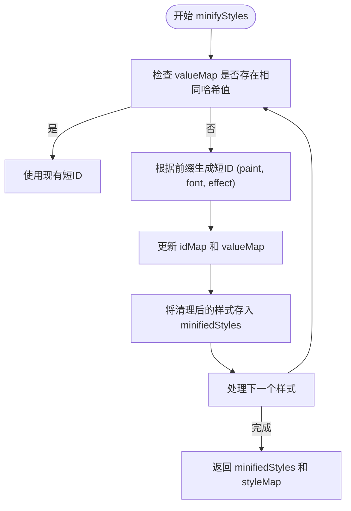

# 样式系统

<cite>
**本文档中引用的文件**  
- [dsl.ts](file://shared-types/src/dsl.ts)
- [styleUtils.ts](file://fta-layout-design/src/utils/styleUtils.ts)
- [layoutUtils.ts](file://fta-layout-design/src/utils/layoutUtils.ts)
- [DSLElement.tsx](file://fta-layout-design/src/components/DSLElement.tsx)
- [styles.ts](file://code-agent-backend/src/utils/minify/styles.ts)
- [design-dsl.ts](file://code-agent-backend/src/types/design-dsl.ts)
- [flex.md](file://code-agent-backend/src/service/code-agent/fta-components/flex.md)
</cite>

## 目录
1. [简介](#简介)
2. [核心类型定义](#核心类型定义)
3. [DSLStyle与DSLStyles详解](#dslstyle与dslstyles详解)
4. [DSLLayoutStyle与布局控制](#dsllayoutstyle与布局控制)
5. [样式继承、覆盖与优先级](#样式继承覆盖与优先级)
6. [样式定义、引用与合并](#样式定义引用与合并)
7. [样式性能优化建议](#样式性能优化建议)
8. [样式系统与渲染引擎对接](#样式系统与渲染引擎对接)

## 简介
本系统采用领域特定语言（DSL）来描述用户界面的视觉和布局属性。样式系统是DSL的核心组成部分，通过`DSLStyle`和`DSLStyles`等类型定义，实现了视觉属性的封装与组织。该系统支持颜色、字体、阴影、边框等视觉属性的定义，并通过键值映射的方式管理多个样式规则。布局控制通过`DSLLayoutStyle`实现，支持Flexbox和Grid等现代布局模式。样式系统还实现了继承、覆盖和优先级机制，确保样式的灵活性和可维护性。最终，样式信息被转换为React可识别的CSS属性，实现与前端渲染引擎的无缝对接。

## 核心类型定义

### DSLStyle与DSLStyles
`DSLStyle`是样式系统的基本单元，用于封装单个视觉属性。它包含一个`value`字段，用于存储具体的样式值，以及一个可选的`token`字段，用于关联设计系统中的设计令牌。`DSLStyles`是一个键值映射结构，通过字符串键（如`paint_1`、`font_2`）来组织和索引多个`DSLStyle`对象，实现了样式的集中管理和高效引用。

**图示来源**  
- [dsl.ts](file://shared-types/src/dsl.ts#L18-L25)

**本节来源**  
- [dsl.ts](file://shared-types/src/dsl.ts#L18-L25)

### DSLLayoutStyle与布局控制
`DSLLayoutStyle`接口定义了节点的布局属性，包括尺寸（`width`、`height`）、位置（`relativeX`、`relativeY`）和旋转（`rotate`）。对于容器节点，`flexContainerInfo`字段进一步定义了Flexbox布局的详细属性，如`flexDirection`、`alignItems`和`justifyContent`。这些属性共同构成了DSL中的布局控制系统，能够精确描述复杂的界面布局。

**图示来源**  
- [dsl.ts](file://shared-types/src/dsl.ts#L29-L65)

**本节来源**  
- [dsl.ts](file://shared-types/src/dsl.ts#L29-L65)

## DSLStyle与DSLStyles详解
`DSLStyle`对象通过其`value`字段封装了各种视觉属性。例如，一个代表颜色的`DSLStyle`可能包含一个`rgba`字符串或渐变定义；一个代表字体的`DSLStyle`则包含`family`、`size`、`style`等子属性。`DSLStyles`作为一个全局的样式字典，允许在DSL的任何节点中通过ID引用这些样式，从而实现样式的复用和统一管理。这种分离式设计使得样式定义与节点结构解耦，提高了系统的可维护性。

**本节来源**  
- [dsl.ts](file://shared-types/src/dsl.ts#L3-L25)

## DSLLayoutStyle与布局控制
`DSLLayoutStyle`在布局控制中扮演着核心角色。其属性直接映射到CSS样式，如`width`和`height`对应CSS的宽高，`relativeX`和`relativeY`结合`position: absolute`实现绝对定位。`flexContainerInfo`则完整表达了Flexbox布局的能力，支持行/列方向、对齐方式、间距和内边距的配置。该系统目前主要支持Flexbox布局，通过`parseFlexContainerStyle`等工具函数将DSL布局描述转换为React可识别的`CSSProperties`对象。

**图示来源**  
- [styleUtils.ts](file://fta-layout-design/src/utils/styleUtils.ts#L39-L92)
- [layoutUtils.ts](file://fta-layout-design/src/utils/layoutUtils.ts#L67-L92)

**本节来源**  
- [dsl.ts](file://shared-types/src/dsl.ts#L29-L65)
- [styleUtils.ts](file://fta-layout-design/src/utils/styleUtils.ts#L39-L92)

## 样式继承、覆盖与优先级
本系统中的样式继承和覆盖主要通过节点的属性合并来实现。当一个节点被渲染时，其最终样式是通过将`DSLStyles`中引用的样式与节点自身的内联样式进行深度合并而得到的。优先级规则如下：节点自身的内联样式优先级最高，其次是通过ID从`DSLStyles`中引用的样式。例如，在`DSLElement.tsx`中，`combinedStyle`对象通过扩展运算符（...）依次合并布局、背景、边框等样式，后合并的样式会覆盖先前的同名属性，从而实现覆盖机制。

**本节来源**  
- [DSLElement.tsx](file://fta-layout-design/src/components/DSLElement.tsx#L83-L123)

## 样式定义、引用与合并
样式在DSL中通过`styles`字段进行定义，并在节点中通过字符串ID进行引用。例如，一个`DSLFrameNode`可以通过`fill: "paint_1"`来引用ID为`paint_1`的颜色样式。样式合并发生在渲染阶段，由`styleUtils.ts`中的`parseColor`、`parseTextStyle`等函数负责将DSL样式转换为实际的CSS值，并由`DSLElement`组件将所有样式片段合并为最终的`style`对象。代码示例展示了如何在节点上应用样式：首先在`styles`对象中定义样式，然后在节点属性中引用其ID。

**本节来源**  
- [dsl.ts](file://shared-types/src/dsl.ts#L138-L139)
- [styleUtils.ts](file://fta-layout-design/src/utils/styleUtils.ts#L9-L112)
- [DSLElement.tsx](file://fta-layout-design/src/components/DSLElement.tsx#L83-L123)

## 样式性能优化建议
为优化样式性能，系统实现了样式压缩（minify）机制。`minifyStyles`函数通过两个关键步骤提升性能：一是**去重**，利用`valueMap`对具有相同`value`的样式进行合并，减少冗余；二是**ID缩短**，将长ID（如`SOLID_PAINT:123:456`）替换为短ID（如`paint0`），减小数据体积。此外，建议开发者在设计DSL时，尽可能复用样式ID，避免为每个节点创建独立的样式定义，这不仅能减小文件大小，还能提高渲染效率和维护性。

**图示来源**  
- [styles.ts](file://code-agent-backend/src/utils/minify/styles.ts#L11-L59)

**本节来源**  
- [styles.ts](file://code-agent-backend/src/utils/minify/styles.ts#L11-L59)

## 样式系统与渲染引擎对接
样式系统与前端渲染引擎的对接主要通过`fta-layout-design`项目中的工具函数和组件实现。`styleUtils.ts`和`layoutUtils.ts`提供了`parseColor`、`parseLayoutStyle`、`parseEffectStyle`等一系列解析函数，它们接收DSL中的样式ID和`DSLStyles`字典，输出标准的`React.CSSProperties`对象。`DSLElement`组件作为渲染的核心，负责调用这些解析函数，将DSL节点的`layoutStyle`、`fill`、`strokeColor`、`effect`等属性逐一转换，并合并成最终的`style`对象传递给React的`div`元素，完成从DSL到实际UI的转换。

**本节来源**  
- [styleUtils.ts](file://fta-layout-design/src/utils/styleUtils.ts)
- [layoutUtils.ts](file://fta-layout-design/src/utils/layoutUtils.ts)
- [DSLElement.tsx](file://fta-layout-design/src/components/DSLElement.tsx)