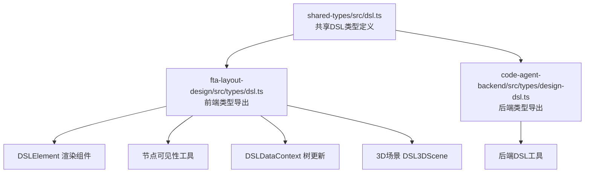
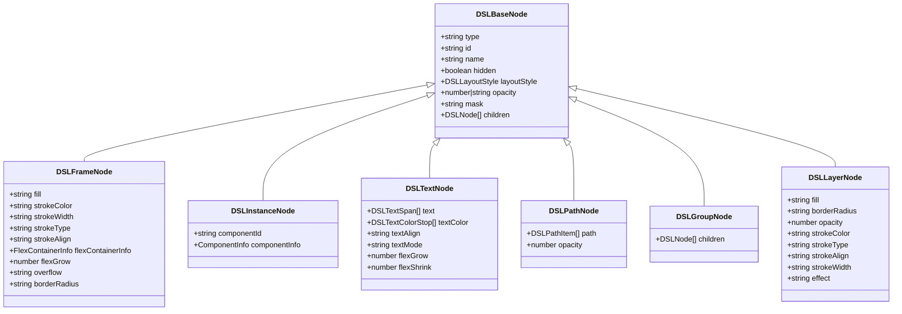
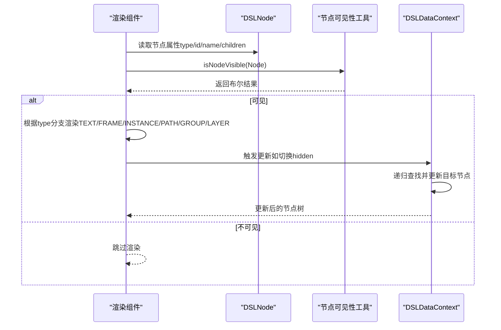
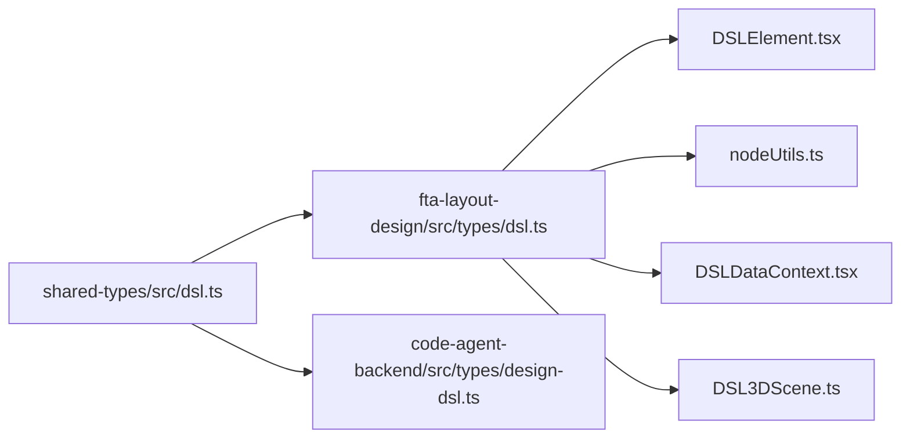

# 核心节点类型

<cite>
**本文引用的文件**
- [shared-types/src/dsl.ts](file://shared-types/src/dsl.ts)
- [code-agent-backend/src/types/design-dsl.ts](file://code-agent-backend/src/types/design-dsl.ts)
- [fta-layout-design/src/types/dsl.ts](file://fta-layout-design/src/types/dsl.ts)
- [fta-layout-design/src/components/DSLElement.tsx](file://fta-layout-design/src/components/DSLElement.tsx)
- [fta-layout-design/src/pages/EditorPage/utils/nodeUtils.ts](file://fta-layout-design/src/pages/EditorPage/utils/nodeUtils.ts)
- [fta-layout-design/src/pages/EditorPage/contexts/DSLDataContext.tsx](file://fta-layout-design/src/pages/EditorPage/contexts/DSLDataContext.tsx)
- [fta-layout-design/src/pages/EditorPage/components/DSL3DInspectModal/DSL3DScene.ts](file://fta-layout-design/src/pages/EditorPage/components/DSL3DInspectModal/DSL3DScene.ts)
- [code-agent-backend/src/utils/design/dsl.ts](file://code-agent-backend/src/utils/design/dsl.ts)
</cite>

## 目录
1. [引言](#引言)
2. [项目结构](#项目结构)
3. [核心组件](#核心组件)
4. [架构总览](#架构总览)
5. [详细组件分析](#详细组件分析)
6. [依赖分析](#依赖分析)
7. [性能考虑](#性能考虑)
8. [故障排查指南](#故障排查指南)
9. [结论](#结论)
10. [附录](#附录)

## 引言
本文件系统性解析设计DSL中的核心节点类型体系，围绕以下六类节点展开：画板节点（DSLFrameNode）、实例节点（DSLInstanceNode）、文本节点（DSLTextNode）、路径节点（DSLPathNode）、组节点（DSLGroupNode）与图层节点（DSLLayerNode）。我们将从结构定义与语义含义入手，梳理公共属性与特有属性，并结合前端渲染与编辑器交互的实际场景，给出节点层级关系在UI结构表达中的作用、节点树构建与遍历的最佳实践，以及类型判断与转换建议。文档同时提供可直接定位到源码位置的“章节来源”与“图表来源”，便于进一步查阅。

## 项目结构
DSL类型定义位于共享包中，前端与后端均通过统一接口消费；前端负责节点渲染与交互，后端负责数据处理与优化。关键文件分布如下：
- 共享类型定义：shared-types/src/dsl.ts
- 前端类型导出：fta-layout-design/src/types/dsl.ts
- 后端类型导出：code-agent-backend/src/types/design-dsl.ts
- 前端渲染组件：fta-layout-design/src/components/DSLElement.tsx
- 节点可见性工具：fta-layout-design/src/pages/EditorPage/utils/nodeUtils.ts
- 节点树更新逻辑：fta-layout-design/src/pages/EditorPage/contexts/DSLDataContext.tsx
- 3D可视化场景：fta-layout-design/src/pages/EditorPage/components/DSL3DInspectModal/DSL3DScene.ts
- 数值规范化工具：code-agent-backend/src/utils/design/dsl.ts

图表来源
- [shared-types/src/dsl.ts](file://shared-types/src/dsl.ts#L1-L163)
- [fta-layout-design/src/types/dsl.ts](file://fta-layout-design/src/types/dsl.ts#L1-L22)
- [code-agent-backend/src/types/design-dsl.ts](file://code-agent-backend/src/types/design-dsl.ts#L1-L21)
- [fta-layout-design/src/components/DSLElement.tsx](file://fta-layout-design/src/components/DSLElement.tsx#L1-L324)
- [fta-layout-design/src/pages/EditorPage/utils/nodeUtils.ts](file://fta-layout-design/src/pages/EditorPage/utils/nodeUtils.ts#L1-L20)
- [fta-layout-design/src/pages/EditorPage/contexts/DSLDataContext.tsx](file://fta-layout-design/src/pages/EditorPage/contexts/DSLDataContext.tsx#L1-L159)
- [fta-layout-design/src/pages/EditorPage/components/DSL3DInspectModal/DSL3DScene.ts](file://fta-layout-design/src/pages/EditorPage/components/DSL3DInspectModal/DSL3DScene.ts#L1-L586)

章节来源
- [shared-types/src/dsl.ts](file://shared-types/src/dsl.ts#L1-L163)
- [fta-layout-design/src/types/dsl.ts](file://fta-layout-design/src/types/dsl.ts#L1-L22)
- [code-agent-backend/src/types/design-dsl.ts](file://code-agent-backend/src/types/design-dsl.ts#L1-L21)

## 核心组件
本节聚焦六类核心节点的结构定义与语义含义，以及它们在UI结构表达中的角色。

- DSLBaseNode（基础节点）
  - 语义：所有节点的共同基类，承载通用元信息与布局样式。
  - 公共属性：type（节点类型枚举）、id（唯一标识）、name（显示名）、hidden（隐藏标记）、layoutStyle（布局样式）、opacity（透明度）、mask（遮罩策略）、children（子节点列表）。
  - 作用：作为多态根类型，统一节点树的层次结构与通用行为。

- DSLFrameNode（画板节点）
  - 语义：容器型节点，常用于页面或页面内区域的布局与视觉装饰。
  - 特有属性：fill（填充色/渐变）、strokeColor/strokeWidth/strokeType/strokeAlign（描边系列）、flexContainerInfo（弹性布局容器配置）、flexGrow/flexShrink（弹性伸缩）、overflow（溢出策略）、borderRadius（圆角）。
  - 作用：表达画板的几何尺寸、视觉样式与布局规则，支持嵌套子节点形成复杂UI结构。

- DSLInstanceNode（实例节点）
  - 语义：组件实例节点，指向某个组件模板，并可携带实例级属性。
  - 特有属性：componentId（组件标识）、componentInfo.properties（实例属性映射）。
  - 作用：在节点树中表示组件化复用，便于生成代码或进行组件级交互。

- DSLTextNode（文本节点）
  - 语义：文本内容节点，支持多段文本与颜色停靠。
  - 特有属性：text（DSLTextSpan数组，含文本与字体信息）、textColor（DSLTextColorStop数组，含颜色停靠区间）、textAlign（对齐方式）、textMode（文本模式，如单行/自动高度）、flexGrow/flexShrink（弹性参数）。
  - 作用：表达富文本与排版样式，支持多段文本与颜色变化。

- DSLPathNode（路径节点）
  - 语义：矢量图形节点，使用SVG路径数据绘制。
  - 特有属性：path（DSLPathItem数组，含fill与SVG路径数据）、opacity（整体透明度）。
  - 作用：表达矢量图标或图形元素，支持按容器尺寸自适应与旋转。

- DSLGroupNode（组节点）
  - 语义：分组容器，用于逻辑聚合与样式继承。
  - 特有属性：children（子节点列表）。
  - 作用：组织节点树，支持基于名称的裁剪（如蒙版）等行为。

- DSLLayerNode（图层节点）
  - 语义：位图/纹理层节点，支持填充、边框、阴影等效果。
  - 特有属性：fill（可为paint ID或颜色）、borderRadius、opacity、strokeColor/strokeType/strokeAlign/strokeWidth、effect（效果字符串）。
  - 作用：表达位图层与装饰效果，支持样式表解析与遮罩图像过滤。

章节来源
- [shared-types/src/dsl.ts](file://shared-types/src/dsl.ts#L27-L162)

## 架构总览
下图展示DSL节点类型在共享类型定义中的继承关系与组合关系，体现多态与层次化结构。

图表来源
- [shared-types/src/dsl.ts](file://shared-types/src/dsl.ts#L27-L162)

## 详细组件分析

### DSLFrameNode（画板节点）
- 结构要点
  - 继承自DSLBaseNode，具备通用布局与样式能力。
  - 支持弹性布局容器配置（flexContainerInfo），可控制主轴/交叉轴对齐、间距与内边距。
  - 支持边框、填充、圆角与溢出策略，适合表达页面或区域容器。
- 使用示例与最佳实践
  - 在渲染组件中，画板节点通常作为容器包裹子节点，通过样式解析函数应用边框、圆角与透明度。
  - 在树更新上下文中，画板节点的children变更会触发整棵子树的重绘与状态同步。
- 类型判断
  - 可通过节点的type字段判断是否为画板节点；在渲染分支中以switch-case匹配type为FRAME。
- 复杂度与性能
  - 子节点数量与样式计算复杂度呈线性关系；合理使用children的懒加载与可见性过滤可降低渲染压力。

章节来源
- [shared-types/src/dsl.ts](file://shared-types/src/dsl.ts#L50-L69)
- [fta-layout-design/src/components/DSLElement.tsx](file://fta-layout-design/src/components/DSLElement.tsx#L287-L294)
- [fta-layout-design/src/pages/EditorPage/contexts/DSLDataContext.tsx](file://fta-layout-design/src/pages/EditorPage/contexts/DSLDataContext.tsx#L16-L59)

### DSLInstanceNode（实例节点）
- 结构要点
  - 用于表达组件实例，包含componentId与实例属性映射。
  - 通常作为容器渲染其children，便于在UI中呈现组件化结构。
- 使用示例与最佳实践
  - 在渲染组件中，实例节点与画板节点类似，通过children进行递归渲染。
  - 在编辑器上下文中，可通过更新树逻辑修改实例的hidden或属性映射，从而影响组件表现。
- 类型判断
  - 通过type为INSTANCE进行分支处理；在渲染时同样以switch-case匹配。

章节来源
- [shared-types/src/dsl.ts](file://shared-types/src/dsl.ts#L71-L78)
- [fta-layout-design/src/components/DSLElement.tsx](file://fta-layout-design/src/components/DSLElement.tsx#L278-L285)
- [fta-layout-design/src/pages/EditorPage/contexts/DSLDataContext.tsx](file://fta-layout-design/src/pages/EditorPage/contexts/DSLDataContext.tsx#L16-L59)

### DSLTextNode（文本节点）
- 结构要点
  - 文本由DSLTextSpan数组组成，支持多段文本与字体信息。
  - 文本颜色通过DSLTextColorStop数组表达颜色停靠区间，支持多色文本。
  - textAlign与textMode控制对齐与换行策略，flexGrow/flexShrink支持弹性布局。
- 使用示例与最佳实践
  - 在渲染组件中，根据textMode决定whiteSpace策略；根据textColor与第一个字体项解析颜色与样式。
  - 对于单行文本，可设置whiteSpace为nowrap并隐藏溢出；对于自动高度，使用预换行策略。
- 类型判断
  - 通过type为TEXT进行分支处理；在渲染时将DSLTextNode断言为具体类型以访问text/textColor等字段。

章节来源
- [shared-types/src/dsl.ts](file://shared-types/src/dsl.ts#L89-L99)
- [fta-layout-design/src/components/DSLElement.tsx](file://fta-layout-design/src/components/DSLElement.tsx#L149-L176)

### DSLPathNode（路径节点）
- 结构要点
  - 使用DSLPathItem数组存储矢量数据，每个元素包含fill与SVG路径字符串。
  - 支持layoutStyle中的宽高与旋转，用于适配容器尺寸与方向。
- 使用示例与最佳实践
  - 在渲染组件中，先计算SVG路径的viewBox以保证正确显示；再根据fill解析颜色并绘制。
  - 若未提供路径数据，可降级为空容器，仅应用布局样式。
- 类型判断
  - 通过type为PATH进行分支处理；在渲染时将DSLPathNode断言为具体类型以访问path与layoutStyle。

章节来源
- [shared-types/src/dsl.ts](file://shared-types/src/dsl.ts#L100-L109)
- [fta-layout-design/src/components/DSLElement.tsx](file://fta-layout-design/src/components/DSLElement.tsx#L237-L276)

### DSLGroupNode（组节点）
- 结构要点
  - 作为容器节点，children为DSLNode数组。
  - 可通过名称关键字（如“蒙版”、“mask”、“Mask”）决定是否启用裁剪（overflow: hidden）。
- 使用示例与最佳实践
  - 在渲染组件中，组节点与画板/实例节点类似，通过children递归渲染；当命中裁剪条件时，覆盖样式以隐藏溢出内容。
- 类型判断
  - 通过type为GROUP进行分支处理；在渲染时将DSLGroupNode断言为具体类型以访问children。

章节来源
- [shared-types/src/dsl.ts](file://shared-types/src/dsl.ts#L111-L115)
- [fta-layout-design/src/components/DSLElement.tsx](file://fta-layout-design/src/components/DSLElement.tsx#L296-L309)

### DSLLayerNode（图层节点）
- 结构要点
  - 表达位图层或装饰层，fill可为paint ID或颜色；支持边框、圆角、透明度与效果字符串。
  - 在渲染组件中，若fill为paint ID且对应图像，将解析为背景图；若名称包含“蒙版”则跳过渲染。
- 使用示例与最佳实践
  - 在渲染组件中，优先检查fill是否为paint ID并解析图像URL；若为遮罩图像则返回null，避免重复渲染。
  - 对于渐变背景，需将backgroundColor替换为background以避免CSS限制。
- 类型判断
  - 通过type为LAYER进行分支处理；在渲染时将DSLLayerNode断言为具体类型以访问fill、effect等字段。

章节来源
- [shared-types/src/dsl.ts](file://shared-types/src/dsl.ts#L116-L126)
- [fta-layout-design/src/components/DSLElement.tsx](file://fta-layout-design/src/components/DSLElement.tsx#L178-L235)

### 节点层级关系与树表达
- 层级关系
  - 所有节点均继承自DSLBaseNode，具备children字段，天然构成树形结构。
  - 画板、实例、组节点作为容器，承载子节点；文本、路径、图层节点作为叶子或中间节点参与布局。
- UI结构表达
  - 通过children的嵌套，节点树完整描述UI的层级、布局与样式；渲染组件依据type分支选择不同渲染策略。
- 遍历与更新
  - 编辑器上下文提供树更新逻辑，支持按id查找并更新节点属性（如hidden），并在子树中递归传播变更。

图表来源
- [fta-layout-design/src/components/DSLElement.tsx](file://fta-layout-design/src/components/DSLElement.tsx#L1-L324)
- [fta-layout-design/src/pages/EditorPage/utils/nodeUtils.ts](file://fta-layout-design/src/pages/EditorPage/utils/nodeUtils.ts#L1-L20)
- [fta-layout-design/src/pages/EditorPage/contexts/DSLDataContext.tsx](file://fta-layout-design/src/pages/EditorPage/contexts/DSLDataContext.tsx#L1-L159)

章节来源
- [fta-layout-design/src/components/DSLElement.tsx](file://fta-layout-design/src/components/DSLElement.tsx#L125-L147)
- [fta-layout-design/src/pages/EditorPage/utils/nodeUtils.ts](file://fta-layout-design/src/pages/EditorPage/utils/nodeUtils.ts#L1-L20)
- [fta-layout-design/src/pages/EditorPage/contexts/DSLDataContext.tsx](file://fta-layout-design/src/pages/EditorPage/contexts/DSLDataContext.tsx#L16-L59)

### 类型判断与转换最佳实践
- 类型守卫
  - 在渲染组件中，通过switch-case匹配Node.type进行分支渲染，属于安全的类型守卫。
  - 在工具函数中，使用isNodeVisible对节点进行可见性判断，避免直接访问不存在的字段。
- 转换与断言
  - 当确定某节点为特定类型时，可在分支内部进行类型断言（如将Node断言为DSLTextNode），以便访问特有字段。
- 3D场景中的节点信息
  - 3D场景使用DSLNodeInfo（包含id、name、type、width、height、x、y、depth、rawNode）进行可视化，便于三维空间定位与动画更新。

章节来源
- [fta-layout-design/src/components/DSLElement.tsx](file://fta-layout-design/src/components/DSLElement.tsx#L149-L318)
- [fta-layout-design/src/pages/EditorPage/utils/nodeUtils.ts](file://fta-layout-design/src/pages/EditorPage/utils/nodeUtils.ts#L1-L20)
- [fta-layout-design/src/pages/EditorPage/components/DSL3DInspectModal/DSL3DScene.ts](file://fta-layout-design/src/pages/EditorPage/components/DSL3DInspectModal/DSL3DScene.ts#L1-L60)

## 依赖分析
- 类型依赖
  - 前端与后端均从共享包导入DSL类型，确保类型一致性与跨模块复用。
- 渲染依赖
  - DSLElement依赖样式解析工具与节点可见性工具，以实现布局、边框、圆角、文本样式与遮罩等效果。
- 上下文依赖
  - DSLDataContext依赖DSLNode类型进行树更新，提供按id更新节点属性的能力。
- 3D场景依赖
  - 3D场景依赖DSLNodeInfo结构，将二维布局信息映射到三维坐标系，支持动画与交互。

图表来源
- [shared-types/src/dsl.ts](file://shared-types/src/dsl.ts#L1-L163)
- [fta-layout-design/src/types/dsl.ts](file://fta-layout-design/src/types/dsl.ts#L1-L22)
- [code-agent-backend/src/types/design-dsl.ts](file://code-agent-backend/src/types/design-dsl.ts#L1-L21)
- [fta-layout-design/src/components/DSLElement.tsx](file://fta-layout-design/src/components/DSLElement.tsx#L1-L324)
- [fta-layout-design/src/pages/EditorPage/utils/nodeUtils.ts](file://fta-layout-design/src/pages/EditorPage/utils/nodeUtils.ts#L1-L20)
- [fta-layout-design/src/pages/EditorPage/contexts/DSLDataContext.tsx](file://fta-layout-design/src/pages/EditorPage/contexts/DSLDataContext.tsx#L1-L159)
- [fta-layout-design/src/pages/EditorPage/components/DSL3DInspectModal/DSL3DScene.ts](file://fta-layout-design/src/pages/EditorPage/components/DSL3DInspectModal/DSL3DScene.ts#L1-L586)

章节来源
- [shared-types/src/dsl.ts](file://shared-types/src/dsl.ts#L1-L163)
- [fta-layout-design/src/types/dsl.ts](file://fta-layout-design/src/types/dsl.ts#L1-L22)
- [code-agent-backend/src/types/design-dsl.ts](file://code-agent-backend/src/types/design-dsl.ts#L1-L21)

## 性能考虑
- 渲染性能
  - 通过isNodeVisible快速过滤不可见节点，减少DOM/Three.js节点数量。
  - 对文本节点采用白/预换行策略，避免频繁重排；对路径节点预先计算viewBox，减少重绘。
- 树更新性能
  - 树更新采用递归查找与浅拷贝策略，尽量减少不必要的对象重建；仅在属性发生变化时更新节点。
- 数值规范化
  - 对数值字段进行统一规范化（如保留两位小数），有助于稳定渲染与比较。

章节来源
- [fta-layout-design/src/pages/EditorPage/utils/nodeUtils.ts](file://fta-layout-design/src/pages/EditorPage/utils/nodeUtils.ts#L1-L20)
- [fta-layout-design/src/pages/EditorPage/contexts/DSLDataContext.tsx](file://fta-layout-design/src/pages/EditorPage/contexts/DSLDataContext.tsx#L1-L159)
- [code-agent-backend/src/utils/design/dsl.ts](file://code-agent-backend/src/utils/design/dsl.ts#L1-L45)

## 故障排查指南
- 常见问题
  - 文本节点渲染异常：检查textMode与whiteSpace设置是否匹配；确认textColor与第一个字体项是否存在。
  - 图层节点遮罩图像重复：确认节点名称是否包含“蒙版”相关关键字，导致被过滤。
  - 路径节点无内容：确认path数组是否为空；若为空，按容器尺寸渲染占位。
  - 组节点裁剪无效：确认组名称是否包含“蒙版”相关关键字，或样式是否被其他属性覆盖。
- 排查步骤
  - 使用isNodeVisible快速判断节点是否被隐藏。
  - 在树更新上下文中，按id定位节点并核对hidden与children是否符合预期。
  - 在3D场景中，核对DSLNodeInfo的x/y/width/height/depth映射是否正确。

章节来源
- [fta-layout-design/src/pages/EditorPage/utils/nodeUtils.ts](file://fta-layout-design/src/pages/EditorPage/utils/nodeUtils.ts#L1-L20)
- [fta-layout-design/src/pages/EditorPage/contexts/DSLDataContext.tsx](file://fta-layout-design/src/pages/EditorPage/contexts/DSLDataContext.tsx#L110-L159)
- [fta-layout-design/src/pages/EditorPage/components/DSL3DInspectModal/DSL3DScene.ts](file://fta-layout-design/src/pages/EditorPage/components/DSL3DInspectModal/DSL3DScene.ts#L382-L509)

## 结论
本文件系统梳理了设计DSL的核心节点类型，明确了公共属性与特有属性，结合前端渲染与编辑器交互场景，阐述了节点层级关系在UI结构表达中的作用，并提供了类型判断与树更新的最佳实践。通过共享类型定义与多端复用，确保了前后端的一致性与可维护性。建议在实际开发中遵循类型守卫与可见性过滤原则，配合树更新与数值规范化工具，提升渲染性能与稳定性。

## 附录
- 类型别名与兼容
  - 共享类型中提供兼容别名（如LayoutStyle/BaseNode/FrameNode/InstanceNode/TextNode/PathItem/PathNode/GroupNode/LayerNode/DesignNode），便于跨模块使用。
- 3D场景节点信息
  - DSLNodeInfo包含id、name、type、width、height、x、y、depth与rawNode，便于三维可视化与交互。

章节来源
- [shared-types/src/dsl.ts](file://shared-types/src/dsl.ts#L146-L162)
- [fta-layout-design/src/pages/EditorPage/components/DSL3DInspectModal/DSL3DScene.ts](file://fta-layout-design/src/pages/EditorPage/components/DSL3DInspectModal/DSL3DScene.ts#L1-L60)