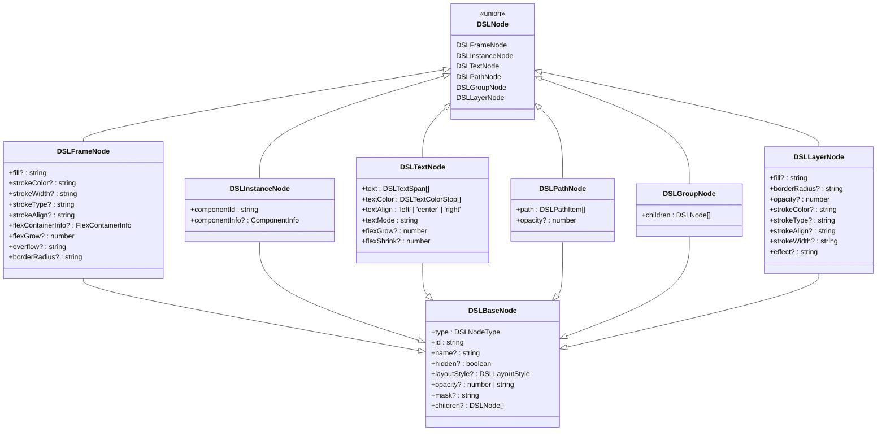
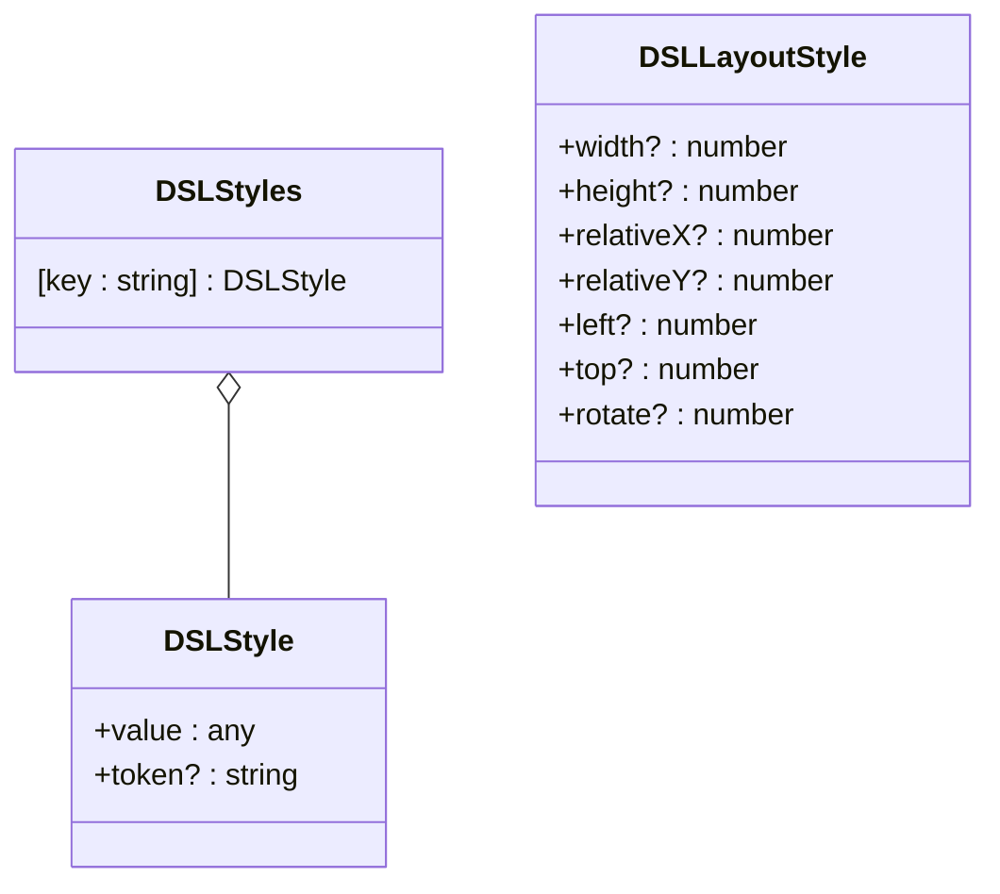
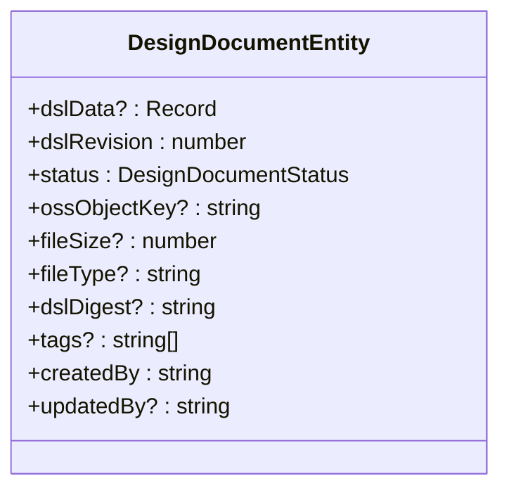

# 设计DSL模型

<cite>
**本文档引用的文件**   
- [dsl.ts](file://shared-types/src/dsl.ts)
- [design-dsl.ts](file://code-agent-backend/src/types/design-dsl.ts)
- [design-dsl.ts](file://fta-layout-design/src/types/dsl.ts)
- [design-dsl.service.ts](file://code-agent-backend/src/service/code-agent/design-dsl.ts)
- [dslService.ts](file://fta-layout-design/src/services/dslService.ts)
- [design-document.ts](file://code-agent-backend/src/entity/design/design-document.ts)
</cite>

## 目录
1. [简介](#简介)
2. [核心数据结构](#核心数据结构)
3. [DSL节点类型体系](#dsl节点类型体系)
4. [样式与布局管理](#样式与布局管理)
5. [DSL数据组织](#dsl数据组织)
6. [版本与完整性控制](#版本与完整性控制)
7. [开发者指南](#开发者指南)
8. [可视化示例](#可视化示例)

## 简介
本文档全面阐述了设计领域特定语言（DSL）的数据模型，该模型用于精确描述用户界面设计稿。DSL采用树状结构组织设计元素，通过`DSLNode`类型体系表示各种UI组件，并利用`DSLStyles`集中管理样式属性。模型支持`FRAME`、`INSTANCE`、`TEXT`、`PATH`、`GROUP`和`LAYER`等多种节点类型，能够灵活表达复杂的设计布局。此外，DSL通过`dslRevision`和`dslDigest`机制实现设计稿的版本控制与完整性校验，确保数据在同步和变更追踪过程中的可靠性。

## 核心数据结构

设计DSL的核心由`DSLData`和`DSLNode`两大类型构成。`DSLData`作为顶层容器，包含一个`styles`对象和一个`nodes`数组，分别用于存储全局样式和根节点集合。`DSLNode`是一个联合类型，代表了设计稿中的所有基本元素，如框架、实例、文本等。每个节点都继承自`DSLBaseNode`，具备`id`、`type`、`name`和`layoutStyle`等基础属性。节点通过`children`属性形成树状层级结构，从而构建出完整的设计稿。

**Section sources**
- [dsl.ts](file://shared-types/src/dsl.ts#L137-L135)

## DSL节点类型体系

DSL定义了一套丰富的节点类型，以精确映射设计工具中的各种元素。

### DSLFrameNode
`DSLFrameNode`代表一个容器框架，是构建布局的基础。它继承自`DSLBaseNode`，并扩展了`fill`（填充色）、`strokeColor`（描边色）、`borderRadius`（圆角半径）等视觉属性。其`flexContainerInfo`字段用于定义Flexbox布局，支持`flexDirection`、`justifyContent`等标准CSS属性，实现灵活的子元素排列。

### DSLInstanceNode
`DSLInstanceNode`表示一个组件实例，通过`componentId`引用一个预定义的组件。`componentInfo`字段允许为实例设置特定的属性值，例如一个按钮实例可以设置其“状态”为“禁用”。

### DSLTextNode
`DSLTextNode`用于表示文本元素。其`text`属性是一个`DSLTextSpan`数组，允许对文本的不同部分应用不同的字体样式。`textColor`属性通过`DSLTextColorStop`定义渐变色，`textAlign`控制文本对齐方式。

### DSLPathNode
`DSLPathNode`用于描述矢量路径图形。其`path`属性包含一个`DSLPathItem`数组，每个`DSLPathItem`定义了路径的`data`（SVG路径数据）和`fill`（填充样式ID）。在实际应用中，系统会将`PATH`节点转换为`LAYER`节点以优化渲染。

### DSLGroupNode
`DSLGroupNode`用于将多个节点逻辑分组，便于统一操作。它必须包含`children`属性，且其`type`固定为`'GROUP'`。

### DSLLayerNode
`DSLLayerNode`代表一个图层，通常由`PATH`节点转换而来。其`fill`属性直接引用一个`LayerStyle`，该样式包含一个图像URL，从而将矢量图形渲染为位图。



**Diagram sources**
- [dsl.ts](file://shared-types/src/dsl.ts#L39-L135)

**Section sources**
- [dsl.ts](file://shared-types/src/dsl.ts#L50-L135)

## 样式与布局管理

### DSLStyle与DSLStyles
`DSLStyle`是样式的基本单元，包含一个`value`（样式值）和一个可选的`token`（样式名称）。`DSLStyles`是一个以样式ID为键的映射对象，实现了样式的集中化管理。例如，一个颜色样式`"paint_1:0020"`的`value`可以是`["#FF7000"]`，`token`为`"品牌/5.默认 #FF7000"`。节点通过引用样式ID（如`fill: "paint_1:0020"`）来应用样式，实现了样式与结构的分离。

### DSLLayoutStyle
`DSLLayoutStyle`定义了节点的布局属性，包括`width`、`height`、`relativeX`、`relativeY`等。这些属性共同决定了节点在父容器中的位置和尺寸。`relativeX`和`relativeY`表示相对于父节点左上角的偏移量。



**Diagram sources**
- [dsl.ts](file://shared-types/src/dsl.ts#L18-L37)

**Section sources**
- [dsl.ts](file://shared-types/src/dsl.ts#L18-L37)

## DSL数据组织

`DSLData`是整个设计稿的根数据结构，其组织方式如下：
1.  **样式集中化**：所有样式定义在`styles`对象中，避免了重复定义。
2.  **节点树状化**：`nodes`数组包含所有根节点，每个节点通过`children`属性递归地组织其子节点，形成一棵或多棵树。
3.  **引用式关联**：节点通过ID引用样式，通过`children`数组引用子节点，确保了数据的一致性和可维护性。

这种组织方式使得设计稿数据结构清晰、易于解析和操作。

**Section sources**
- [dsl.ts](file://shared-types/src/dsl.ts#L137-L140)

## 版本与完整性控制

设计稿实体`DesignDocumentEntity`中包含了版本控制和完整性校验的关键字段。

### dslRevision
`dslRevision`是一个自增的整数，代表设计稿的版本号。每当设计稿被更新时，此版本号会递增。它为设计稿的变更追踪提供了明确的顺序依据，是实现乐观锁和防止数据覆盖冲突的基础。

### dslDigest
`dslDigest`是一个字符串，代表设计稿内容的摘要（如MD5或SHA256哈希值）。它通过计算`DSLData`的序列化内容生成。`dslDigest`用于快速校验设计稿的完整性，确保在传输或存储过程中数据未被篡改。当需要同步设计稿时，比较`dslDigest`可以高效地判断两个版本是否完全相同。



**Diagram sources**
- [design-document.ts](file://code-agent-backend/src/entity/design/design-document.ts#L49-L82)

**Section sources**
- [design-document.ts](file://code-agent-backend/src/entity/design/design-document.ts#L53-L82)

## 开发者指南

### 节点遍历
可以使用递归函数遍历整个DSL树。以下是一个示例：
```typescript
function traverseNodes(nodes: DSLNode[], callback: (node: DSLNode) => void) {
  nodes.forEach(node => {
    callback(node);
    if (node.children) {
      traverseNodes(node.children, callback);
    }
  });
}
```

### 类型判断
利用TypeScript的类型守卫可以安全地判断节点类型：
```typescript
function isFrameNode(node: DSLNode): node is DSLFrameNode {
  return node.type === 'FRAME';
}
```

### 数据操作
`DSLDataContext`提供了一套操作DSL数据的方法，如`updateNodeVisibility`用于更新节点的可见性，`resetAllNodeVisibility`用于重置所有节点的可见性。

**Section sources**
- [dslService.ts](file://fta-layout-design/src/services/dslService.ts#L37-L43)
- [DSLDataContext.tsx](file://fta-layout-design/src/pages/EditorPage/contexts/DSLDataContext.tsx#L114-L158)

## 可视化示例

以下是一个简化的DSL结构示例，展示了一个包含标题和搜索框的页面：

```json
{
  "dsl": {
    "styles": {
      "paint_1:0131": { "value": ["#F5F5F5"], "token": "背景色" },
      "font_1:976": { "value": { "family": "PingFang SC", "size": 36 }, "token": "标题字体" }
    },
    "nodes": [
      {
        "type": "FRAME",
        "id": "frame-1",
        "layoutStyle": { "width": 720, "height": 1560 },
        "fill": "paint_1:0131",
        "children": [
          {
            "type": "TEXT",
            "id": "text-title",
            "layoutStyle": { "width": 180, "height": 50, "relativeX": 270, "relativeY": 23 },
            "text": [{ "text": "我的运力池", "font": "font_1:976" }],
            "textColor": [{ "start": 0, "end": 5, "color": "paint_1:0131" }],
            "textAlign": "center"
          }
        ]
      }
    ]
  }
}
```