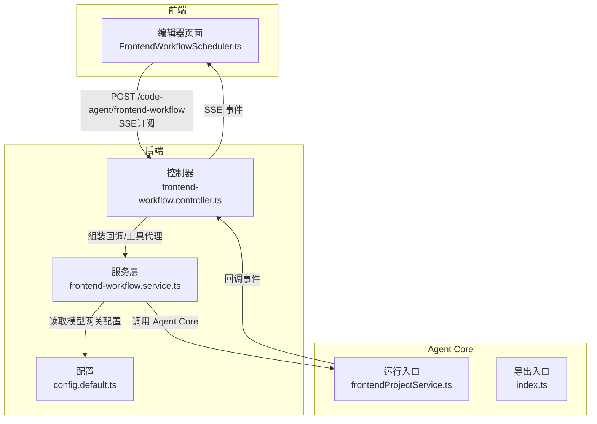
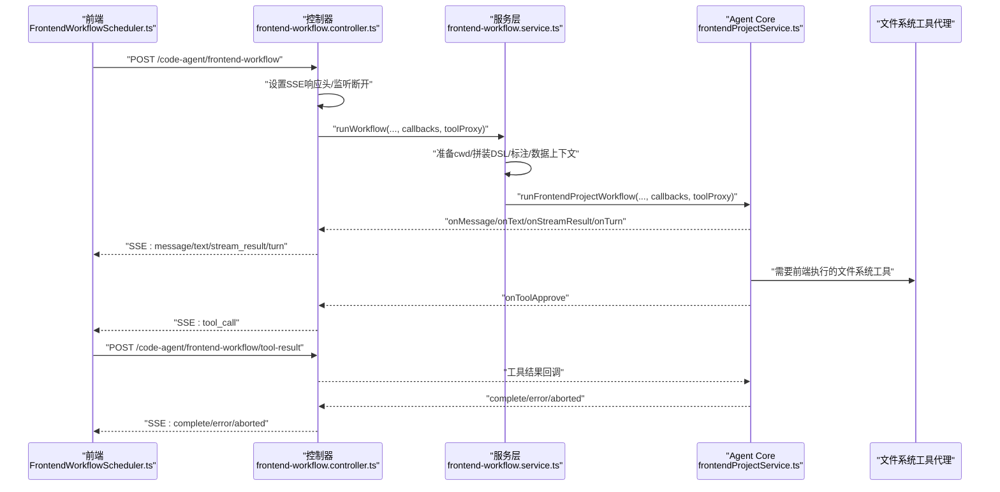
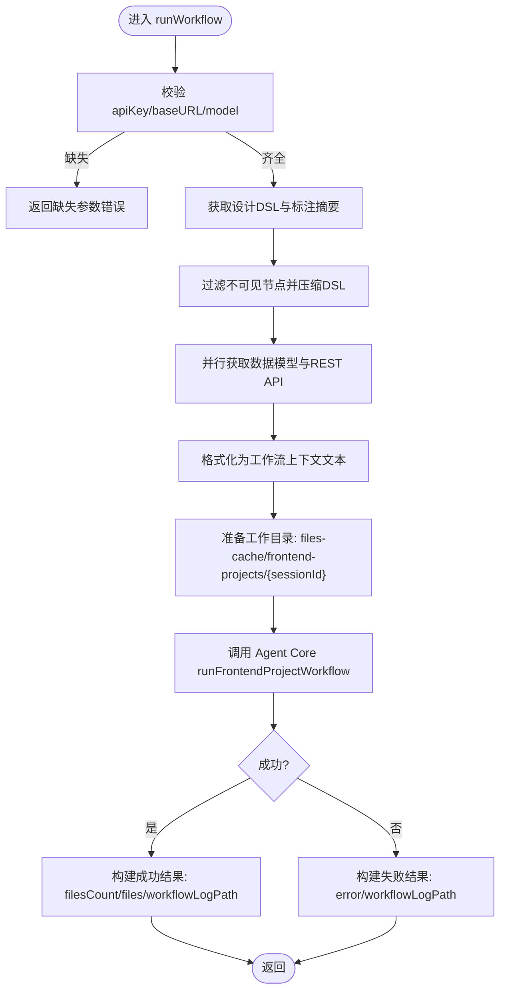
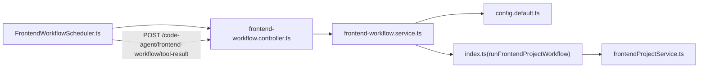

# 代码生成

<cite>
**本文引用的文件**
- [code-agent-backend/src/service/code-agent/frontend-workflow.ts](file://code-agent-backend/src/service/code-agent/frontend-workflow.ts)
- [code-agent-backend/src/controller/code-agent/frontend-workflow.ts](file://code-agent-backend/src/controller/code-agent/frontend-workflow.ts)
- [code-agent-backend/src/dto/code-agent/frontend-workflow.dto.ts](file://code-agent-backend/src/dto/code-agent/frontend-workflow.dto.ts)
- [code-agent-backend/docs/frontend-workflow-api.md](file://code-agent-backend/docs/frontend-workflow-api.md)
- [code-agent-backend/docs/frontend-workflow-service-usage.md](file://code-agent-backend/docs/frontend-workflow-service-usage.md)
- [code-agent-backend/src/config/config.default.ts](file://code-agent-backend/src/config/config.default.ts)
- [fta-agent-core/src/frontendProjectService.ts](file://fta-agent-core/src/frontendProjectService.ts)
- [fta-agent-core/src/index.ts](file://fta-agent-core/src/index.ts)
- [fta-layout-design/src/pages/EditorPage/services/FrontendWorkflowScheduler.ts](file://fta-layout-design/src/pages/EditorPage/services/FrontendWorkflowScheduler.ts)
- [code-agent-backend/tools/frontend-workflow-log-viewer.html](file://code-agent-backend/tools/frontend-workflow-log-viewer.html)
- [.gitignore](file://.gitignore)
</cite>

## 目录
1. [简介](#简介)
2. [项目结构](#项目结构)
3. [核心组件](#核心组件)
4. [架构总览](#架构总览)
5. [详细组件分析](#详细组件分析)
6. [依赖关系分析](#依赖关系分析)
7. [性能考量](#性能考量)
8. [故障排查指南](#故障排查指南)
9. [结论](#结论)
10. [附录](#附录)

## 简介
本文件围绕“从设计稿到前端代码”的自动化生成工作流，系统性梳理后端控制器、服务层与 Agent Core 的协作机制，重点解析前端工作流控制器如何通过 Server-Sent Events（SSE）将生成过程中的日志、进度与文件清单实时推送到前端；同时给出面向初学者的完整操作指南与面向高级开发者的状态管理、错误处理与性能监控建议，并覆盖生成文件的存储路径与清理策略。

## 项目结构
该功能由三层组成：
- 控制器层：负责接收请求、设置 SSE 响应头、注册回调并将 Agent Core 的事件转发给前端。
- 服务层：负责准备工作目录、拼装设计 DSL 与标注上下文、调用 Agent Core 执行工作流并返回标准化结果。
- Agent Core：封装前端项目生成的完整循环，包括工具集、提示词构建、消息与流式结果回调、日志与产物收集。

图表来源
- [code-agent-backend/src/controller/code-agent/frontend-workflow.ts](file://code-agent-backend/src/controller/code-agent/frontend-workflow.ts#L83-L367)
- [code-agent-backend/src/service/code-agent/frontend-workflow.ts](file://code-agent-backend/src/service/code-agent/frontend-workflow.ts#L74-L279)
- [code-agent-backend/src/config/config.default.ts](file://code-agent-backend/src/config/config.default.ts#L214-L228)
- [fta-agent-core/src/frontendProjectService.ts](file://fta-agent-core/src/frontendProjectService.ts#L139-L349)
- [fta-agent-core/src/index.ts](file://fta-agent-core/src/index.ts#L1-L12)

章节来源
- [code-agent-backend/src/controller/code-agent/frontend-workflow.ts](file://code-agent-backend/src/controller/code-agent/frontend-workflow.ts#L83-L367)
- [code-agent-backend/src/service/code-agent/frontend-workflow.ts](file://code-agent-backend/src/service/code-agent/frontend-workflow.ts#L74-L279)
- [code-agent-backend/src/config/config.default.ts](file://code-agent-backend/src/config/config.default.ts#L214-L228)
- [fta-agent-core/src/frontendProjectService.ts](file://fta-agent-core/src/frontendProjectService.ts#L139-L349)
- [fta-agent-core/src/index.ts](file://fta-agent-core/src/index.ts#L1-L12)

## 核心组件
- 前端工作流控制器（Controller）
  - 负责设置 SSE 响应头、监听客户端断开、注册各类回调（消息、文本增量、流式结果、对话轮次、工具调用审批）、向前端发送事件、处理异常与连接清理。
  - 通过工具代理（toolProxy）将需要前端执行的文件系统工具请求转化为 SSE 事件，等待前端提交工具结果。
- 前端工作流服务（Service）
  - 负责准备工作目录、拉取设计 DSL 与标注摘要、聚合数据模型与 REST API、调用 Agent Core 的 runFrontendProjectWorkflow、返回标准化结果。
  - 支持 AbortSignal 中断、回调包装以在每次回调时检查中断。
- Agent Core（fta-agent-core）
  - 封装前端项目生成的完整循环，包括上下文初始化、工具集加载、系统提示词生成、消息循环、日志与产物收集、最终结果汇总。
  - 通过回调将消息、文本增量、流式结果、对话轮次等事件回传给控制器。

章节来源
- [code-agent-backend/src/controller/code-agent/frontend-workflow.ts](file://code-agent-backend/src/controller/code-agent/frontend-workflow.ts#L83-L367)
- [code-agent-backend/src/service/code-agent/frontend-workflow.ts](file://code-agent-backend/src/service/code-agent/frontend-workflow.ts#L74-L279)
- [fta-agent-core/src/frontendProjectService.ts](file://fta-agent-core/src/frontendProjectService.ts#L139-L349)

## 架构总览
下面的序列图展示了从前端发起请求到生成完成的端到端流程，包括 SSE 事件推送与工具代理交互。

图表来源
- [code-agent-backend/src/controller/code-agent/frontend-workflow.ts](file://code-agent-backend/src/controller/code-agent/frontend-workflow.ts#L83-L367)
- [code-agent-backend/src/service/code-agent/frontend-workflow.ts](file://code-agent-backend/src/service/code-agent/frontend-workflow.ts#L74-L279)
- [fta-agent-core/src/frontendProjectService.ts](file://fta-agent-core/src/frontendProjectService.ts#L139-L349)

## 详细组件分析

### 控制器：SSE 事件与工具代理
- SSE 设置与事件发送
  - 设置 Content-Type 为 text/event-stream，禁用缓存，保持长连接。
  - 定义 sendSSE 与日志辅助函数，分别发送 message、text、stream_result、turn、complete、error、aborted 等事件。
- 断开连接处理
  - 监听 req/res 的 close/error 事件，使用 AbortController 传播中断信号。
- 工具代理（toolProxy）
  - 将需要前端执行的文件系统工具（如 read/write/ls/grep/glob/edit/rm/bash 等）通过 SSE 的 tool_call 事件下发给前端。
  - 前端收到 tool_call 后调用 callService 执行对应工具，再通过 POST /code-agent/frontend-workflow/tool-result 回传工具结果。
  - 控制器侧维护 pendingToolCalls 与 sessionCallIds，用于匹配 callId 并 resolve/reject 对应 Promise，支持超时清理。
- 回调事件
  - onMessage：将 Agent 的消息（含角色、内容、时间戳等）推送给前端。
  - onText：将文本增量推送给前端。
  - onStreamResult：将流式请求结果（含模型、错误标志等）推送给前端。
  - onTurn：将对话轮次的用量与起止时间推送给前端。
  - onToolApprove：当前端自动批准工具调用（返回 true）。

章节来源
- [code-agent-backend/src/controller/code-agent/frontend-workflow.ts](file://code-agent-backend/src/controller/code-agent/frontend-workflow.ts#L83-L367)
- [fta-layout-design/src/pages/EditorPage/services/FrontendWorkflowScheduler.ts](file://fta-layout-design/src/pages/EditorPage/services/FrontendWorkflowScheduler.ts#L130-L520)

### 服务层：runWorkflow 执行流程
- 参数与配置
  - 优先使用入参（apiKey/baseURL/model），否则回退到 modelGateway.default 配置。
  - 缺少必要参数时直接返回错误。
- 数据准备
  - 获取设计文档内容（DSL 与根标注），过滤不可见节点，压缩 DSL。
  - 从页面关联的项目中并行获取数据模型与 REST API，并格式化为工作流可用的文本上下文。
- 工作目录
  - 使用 getWorkflowCwd(sessionId) 生成 files-cache/frontend-projects/{sessionId} 目录作为 cwd。
- 调用 Agent Core
  - 组装 pageAnnotation 与 designData，设置 productName/version/specDirectories/componentDocDirectories/promptFilePath/rulesFilePath/configOverrides。
  - 通过 toolProxy 与 callbacks 与控制器对接。
  - 包装 callbacks，使每次回调均检查 AbortSignal，若中断则抛出 AbortError。
- 结果返回
  - 成功：返回 success、filesCount、files（仅路径与类型）、workflowLogPath。
  - 失败：返回 success=false、error（message/name）与 workflowLogPath。
  - 异常：捕获错误并返回标准化错误对象。

图表来源
- [code-agent-backend/src/service/code-agent/frontend-workflow.ts](file://code-agent-backend/src/service/code-agent/frontend-workflow.ts#L74-L279)

章节来源
- [code-agent-backend/src/service/code-agent/frontend-workflow.ts](file://code-agent-backend/src/service/code-agent/frontend-workflow.ts#L74-L279)

### Agent Core：runFrontendProjectWorkflow
- 初始化与上下文
  - 创建 Context、Session、FileDraftStore、JsonlLogger、RequestLogger。
  - 生成日志文件路径（按天与秒级命名）。
- 工具集与提示词
  - 加载基础工具集与组件文档工具。
  - 生成系统提示词，整合设计 DSL、页面标注与可选的 src 目录树。
- 循环执行
  - 构造初始消息并写入日志与回调。
  - runLoop 驱动消息循环，回调 onMessage/onTextDelta/onStreamResult/onChunk/onText/onTurn/onToolApprove。
  - 记录请求元数据与历史消息。
- 结果汇总
  - 写入工作流历史日志（JSON），包含上下文、初始消息、历史消息与文件草稿。
  - 返回 success 与 files（草稿列表）及 workflowLogPath。

章节来源
- [fta-agent-core/src/frontendProjectService.ts](file://fta-agent-core/src/frontendProjectService.ts#L139-L349)
- [fta-agent-core/src/index.ts](file://fta-agent-core/src/index.ts#L1-L12)

### 前端：SSE 事件消费与工具结果回传
- 自定义 SSE 解析
  - 通过 fetch 获取 text/event-stream，逐行解析 event 与 data，派发到 handleSSEEvent。
- 事件处理
  - message：提取 assistant 文本内容并回调 onTextChunk。
  - complete：回调 onSessionComplete。
  - error：回调 onError。
  - aborted：回调 onError。
  - tool_call：根据 toolName 分派到 callService 执行，再通过 POST /code-agent/frontend-workflow/tool-result 回传工具结果。
- 中断控制
  - 提供 AbortController，支持 abort() 中断。

章节来源
- [fta-layout-design/src/pages/EditorPage/services/FrontendWorkflowScheduler.ts](file://fta-layout-design/src/pages/EditorPage/services/FrontendWorkflowScheduler.ts#L130-L520)

## 依赖关系分析
- 控制器依赖服务层与 Agent Core 导出的 runFrontendProjectWorkflow。
- 服务层依赖模型网关配置（modelGateway.default）与设计 DSL 服务、项目/数据模型/REST API 服务。
- Agent Core 内部依赖上下文、会话、工具集、提示词生成与日志记录。
- 前端通过自定义 SSE 解析与工具代理回传，与后端形成闭环。

图表来源
- [code-agent-backend/src/controller/code-agent/frontend-workflow.ts](file://code-agent-backend/src/controller/code-agent/frontend-workflow.ts#L83-L367)
- [code-agent-backend/src/service/code-agent/frontend-workflow.ts](file://code-agent-backend/src/service/code-agent/frontend-workflow.ts#L74-L279)
- [code-agent-backend/src/config/config.default.ts](file://code-agent-backend/src/config/config.default.ts#L214-L228)
- [fta-agent-core/src/index.ts](file://fta-agent-core/src/index.ts#L1-L12)
- [fta-agent-core/src/frontendProjectService.ts](file://fta-agent-core/src/frontendProjectService.ts#L139-L349)
- [fta-layout-design/src/pages/EditorPage/services/FrontendWorkflowScheduler.ts](file://fta-layout-design/src/pages/EditorPage/services/FrontendWorkflowScheduler.ts#L130-L520)

章节来源
- [code-agent-backend/src/controller/code-agent/frontend-workflow.ts](file://code-agent-backend/src/controller/code-agent/frontend-workflow.ts#L83-L367)
- [code-agent-backend/src/service/code-agent/frontend-workflow.ts](file://code-agent-backend/src/service/code-agent/frontend-workflow.ts#L74-L279)
- [code-agent-backend/src/config/config.default.ts](file://code-agent-backend/src/config/config.default.ts#L214-L228)
- [fta-agent-core/src/index.ts](file://fta-agent-core/src/index.ts#L1-L12)
- [fta-agent-core/src/frontendProjectService.ts](file://fta-agent-core/src/frontendProjectService.ts#L139-L349)
- [fta-layout-design/src/pages/EditorPage/services/FrontendWorkflowScheduler.ts](file://fta-layout-design/src/pages/EditorPage/services/FrontendWorkflowScheduler.ts#L130-L520)

## 性能考量
- 并行获取数据模型与 REST API，减少等待时间。
- 压缩 DSL 与过滤不可见节点，降低上下文体积。
- 使用 AbortController 与回调包装，及时中断长时间运行的生成任务。
- SSE 事件粒度细，前端可渐进渲染，提升感知性能。
- 日志与产物写盘采用 JSON/JSONL，便于离线回放与分析。

[本节为通用指导，不直接分析具体文件]

## 故障排查指南
- 常见错误类型
  - 缺失模型配置参数（apiKey/baseURL）：返回缺失参数错误。
  - 设计文档不存在或 DSL 数据缺失：返回 DesignNotFoundError。
  - 工作流执行异常：返回标准化 WorkflowError。
  - 客户端中断：返回 aborted 事件并记录中断原因。
- 前端断开连接
  - 控制器监听 close/error 事件，设置 AbortController，中断 Agent Core 的回调链路。
- 工具代理超时
  - 控制器侧为每个 callId 设置 60 秒超时，超时后清理 pendingToolCalls 与 sessionCallIds。
- 日志与产物定位
  - 工作流历史日志：按天与秒级命名，位于 logs/api 下。
  - 生成产物：files-cache/frontend-projects/{sessionId}/ 下。
- 清理策略
  - .gitignore 中包含 files-cache/**/，需结合业务策略定期清理过期产物与日志，避免磁盘占用。

章节来源
- [code-agent-backend/src/controller/code-agent/frontend-workflow.ts](file://code-agent-backend/src/controller/code-agent/frontend-workflow.ts#L311-L366)
- [code-agent-backend/src/service/code-agent/frontend-workflow.ts](file://code-agent-backend/src/service/code-agent/frontend-workflow.ts#L258-L279)
- [code-agent-backend/tools/frontend-workflow-log-viewer.html](file://code-agent-backend/tools/frontend-workflow-log-viewer.html#L1-L120)
- [.gitignore](file://.gitignore#L16-L20)

## 结论
该工作流通过清晰的分层设计与 SSE 实时推送，实现了从设计稿到前端代码的高效自动化生成。控制器专注事件编排与工具代理，服务层负责数据准备与 Agent Core 调用，Agent Core 负责生成循环与产物收集。配合完善的日志与产物存储、断开连接处理与工具代理超时机制，既满足初学者快速上手，也为高级开发者提供了可观测、可扩展的实现基础。

[本节为总结性内容，不直接分析具体文件]

## 附录

### API 使用指南（初学者）
- 接口
  - POST /code-agent/frontend-workflow
  - Accept: text/event-stream
- 请求体字段
  - designDocId: 设计文档 ID（必填）
  - productName: 产品名称（可选，默认 "FTA-Frontend"）
  - srcTree: src 目录树结构（可选）
  - apiKey/baseURL/model: 模型配置（可选，优先使用入参）
- 前端 SSE 事件
  - message：Agent 消息（含角色、内容、时间戳）
  - text：文本增量
  - stream_result：流式请求结果（含模型、错误标志）
  - turn：对话轮次用量与起止时间
  - tool_call：需要前端执行的工具调用（callId/toolName/params）
  - complete：任务完成（success/filesCount/files）
  - error：错误事件（message/stack）
  - aborted：被中断（message）
- 工具结果回传
  - 前端收到 tool_call 后执行对应工具，然后 POST /code-agent/frontend-workflow/tool-result 回传工具结果。

章节来源
- [code-agent-backend/docs/frontend-workflow-api.md](file://code-agent-backend/docs/frontend-workflow-api.md#L1-L280)
- [code-agent-backend/src/dto/code-agent/frontend-workflow.dto.ts](file://code-agent-backend/src/dto/code-agent/frontend-workflow.dto.ts#L1-L60)
- [code-agent-backend/src/controller/code-agent/frontend-workflow.ts](file://code-agent-backend/src/controller/code-agent/frontend-workflow.ts#L83-L367)
- [fta-layout-design/src/pages/EditorPage/services/FrontendWorkflowScheduler.ts](file://fta-layout-design/src/pages/EditorPage/services/FrontendWorkflowScheduler.ts#L130-L520)

### 高级用法（开发者）
- 在服务层直接调用 runWorkflow
  - 适合后台任务、批量生成或与其他服务集成。
- 自定义回调
  - onMessage/onText/onStreamResult/onTurn/onToolApprove，按需记录与上报。
- 模型网关配置
  - 通过 modelGateway.default 提供 baseURL/apiKey/model，也可在请求中覆盖。
- 日志与产物
  - 历史日志：logs/api/frontend-workflow-*.json
  - 产物：files-cache/frontend-projects/{sessionId}/
- 清理策略
  - 结合 .gitignore 与业务策略定期清理过期产物与日志。

章节来源
- [code-agent-backend/docs/frontend-workflow-service-usage.md](file://code-agent-backend/docs/frontend-workflow-service-usage.md#L1-L286)
- [code-agent-backend/src/config/config.default.ts](file://code-agent-backend/src/config/config.default.ts#L214-L228)
- [code-agent-backend/tools/frontend-workflow-log-viewer.html](file://code-agent-backend/tools/frontend-workflow-log-viewer.html#L1-L120)
- [.gitignore](file://.gitignore#L16-L20)