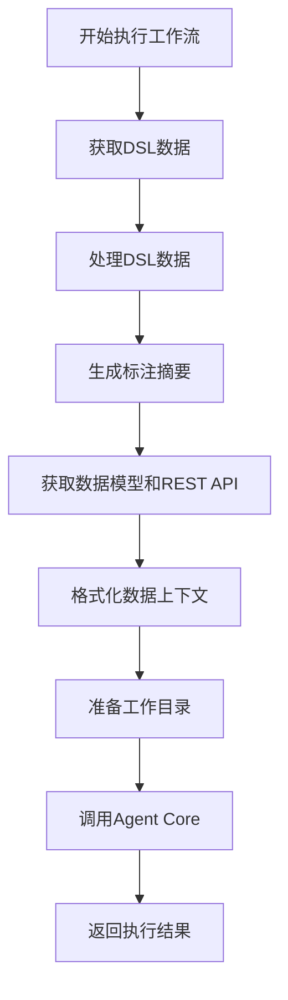
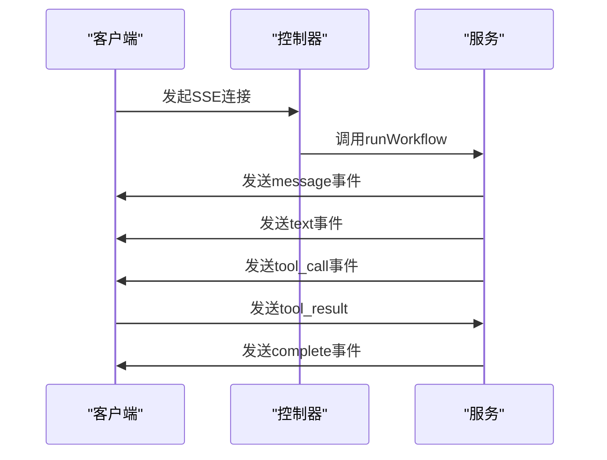
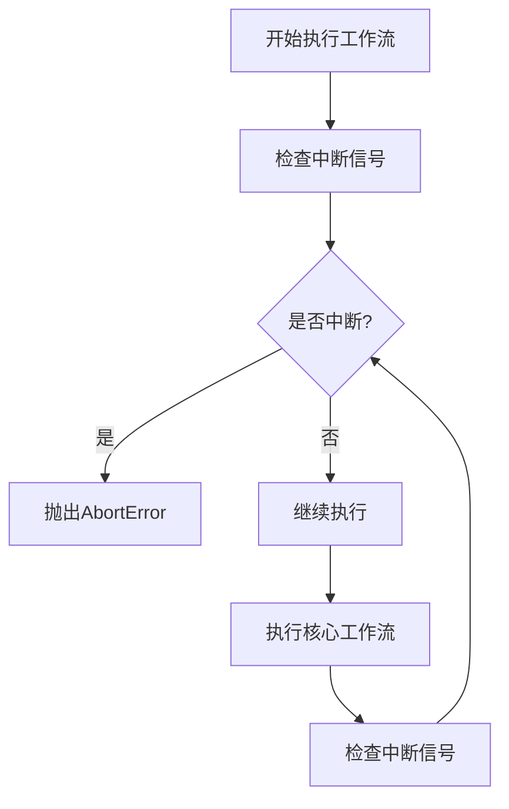
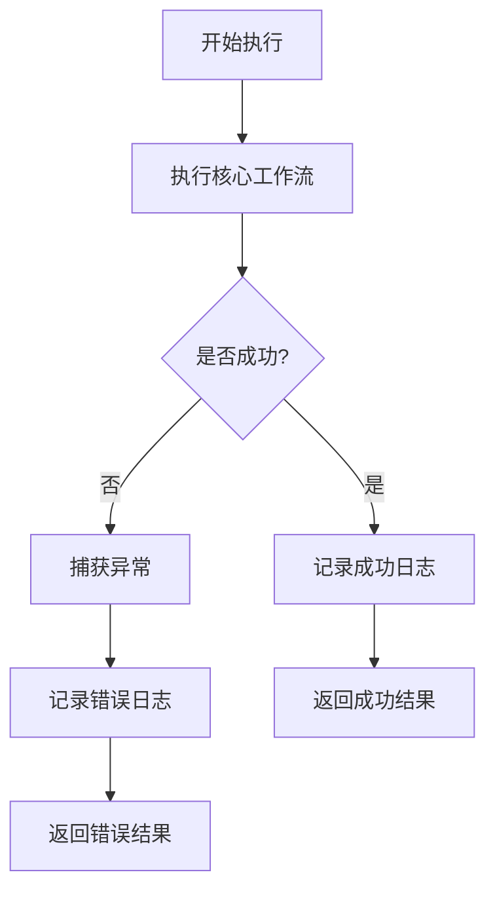

# 工作流执行

<cite>
**本文档引用的文件**   
- [frontend-workflow.ts](file://code-agent-backend/src/service/code-agent/frontend-workflow.ts)
- [frontend-workflow.dto.ts](file://code-agent-backend/src/dto/code-agent/frontend-workflow.dto.ts)
- [frontendProjectService.ts](file://fta-agent-core/src/frontendProjectService.ts)
- [project.ts](file://code-agent-backend/src/service/code-agent/project.ts)
- [data-model.ts](file://code-agent-backend/src/service/code-agent/data-model.ts)
- [rest-api.ts](file://code-agent-backend/src/service/code-agent/rest-api.ts)
- [design-dsl.ts](file://code-agent-backend/src/service/code-agent/design-dsl.ts)
- [minify/index.ts](file://code-agent-backend/src/utils/minify/index.ts)
- [frontend-workflow.controller.ts](file://code-agent-backend/src/controller/code-agent/frontend-workflow.ts)
</cite>

## 目录
1. [简介](#简介)
2. [核心执行流程](#核心执行流程)
3. [工作流状态管理](#工作流状态管理)
4. [SSE事件回调机制](#sse事件回调机制)
5. [客户端中断处理](#客户端中断处理)
6. [错误处理与性能监控](#错误处理与性能监控)
7. [配置与调用示例](#配置与调用示例)
8. [调试指南](#调试指南)
9. [结论](#结论)

## 简介

本文档详细解析前端工作流执行机制，重点阐述`FrontendWorkflowService.runWorkflow`方法的完整执行流程。文档涵盖从接收请求到调用Agent Core的全过程，包括设计DSL数据获取、组件标注摘要生成、项目关联数据模型与REST API的整合、工作目录准备等关键步骤。同时详细说明SSE事件回调机制的注册与触发逻辑，以及通过AbortController实现客户端中断的方法。分析工作流的状态管理、错误处理和性能监控策略，为开发者提供调试指南和实际代码示例。

**Section sources**
- [frontend-workflow.ts](file://code-agent-backend/src/service/code-agent/frontend-workflow.ts#L74-L278)
- [frontend-workflow.dto.ts](file://code-agent-backend/src/dto/code-agent/frontend-workflow.dto.ts#L11-L60)

## 核心执行流程

`FrontendWorkflowService.runWorkflow`方法是前端工作流的核心执行入口，负责协调整个工作流的执行过程。该方法接收`FrontendWorkflowOptions`参数，包含设计文档ID、产品名称、会话ID、信号控制器、回调函数等关键信息。

执行流程从获取DSL数据开始，通过`projectService.getDocumentContent`方法获取设计文档内容，包括DSL数据和标注数据。随后，通过`designDSLService.processDesignDSL`方法处理DSL数据，进行数值精度处理和PATH节点转换。接着，生成组件标注摘要，通过`formatAnnotationSummary`和`flattenAnnotation`方法将标注数据转换为文本摘要。

工作流还整合项目关联的数据模型和REST API，通过`dataModelService.getByProjectId`和`restApiService.getByProjectId`方法获取相关数据，并通过`formatDataContext`方法格式化为工作流可用的文本格式。最后，准备工作目录，通过`getWorkflowCwd`方法生成工作目录路径，并调用Agent Core执行工作流。



**Diagram sources **
- [frontend-workflow.ts](file://code-agent-backend/src/service/code-agent/frontend-workflow.ts#L100-L154)

**Section sources**
- [frontend-workflow.ts](file://code-agent-backend/src/service/code-agent/frontend-workflow.ts#L74-L278)
- [project.ts](file://code-agent-backend/src/service/code-agent/project.ts#L604-L621)
- [design-dsl.ts](file://code-agent-backend/src/service/code-agent/design-dsl.ts#L407-L420)

## 工作流状态管理

工作流通过`FrontendWorkflowResult`接口管理执行状态，包含`success`、`sessionId`、`filesCount`、`files`、`workflowLogPath`和`error`等属性。执行成功时，返回生成的文件数量和文件列表；执行失败时，返回错误信息。

工作流还通过`workflowStartTime`和`workflowEngineStart`等时间戳记录执行时间，用于性能监控。通过`console.log`输出执行日志，包括工作流启动、核心引擎执行、执行完成等关键事件。

```mermaid
classDiagram
class FrontendWorkflowResult {
+success : boolean
+sessionId : string
+filesCount? : number
+files? : Array<{ path : string; kind : string }>
+workflowLogPath? : string
+error? : { message : string; name : string }
}
class FrontendWorkflowOptions {
+designDocId : string
+productName? : string
+sessionId : string
+signal? : AbortSignal
+callbacks? : FrontendProjectWorkflowCallbacks
+srcTree? : TreeNode
+apiKey? : string
+baseURL? : string
+model? : string
+toolProxy? : (toolName : string, params : any) => Promise<any>
}
FrontendWorkflowResult <|-- FrontendWorkflowService
FrontendWorkflowOptions <|-- FrontendWorkflowService
```

**Diagram sources **
- [frontend-workflow.ts](file://code-agent-backend/src/service/code-agent/frontend-workflow.ts#L34-L44)
- [frontend-workflow.dto.ts](file://code-agent-backend/src/dto/code-agent/frontend-workflow.dto.ts#L11-L60)

**Section sources**
- [frontend-workflow.ts](file://code-agent-backend/src/service/code-agent/frontend-workflow.ts#L34-L278)

## SSE事件回调机制

工作流通过SSE（Server-Sent Events）机制实现事件回调，支持`onMessage`、`onTextDelta`、`onToolApprove`等回调函数。这些回调函数在工作流执行过程中被触发，用于通知客户端执行状态。

`onMessage`回调在收到消息时触发，`onTextDelta`回调在收到文本片段时触发，`onToolApprove`回调在工具调用需要审批时触发。这些回调函数通过`callbacks`参数传递给`runFrontendProjectWorkflow`方法，并在执行过程中被调用。



**Diagram sources **
- [frontend-workflow.controller.ts](file://code-agent-backend/src/controller/code-agent/frontend-workflow.ts#L108-L307)
- [frontend-workflow.ts](file://code-agent-backend/src/service/code-agent/frontend-workflow.ts#L191-L222)

**Section sources**
- [frontend-workflow.controller.ts](file://code-agent-backend/src/controller/code-agent/frontend-workflow.ts#L108-L307)
- [frontend-workflow.ts](file://code-agent-backend/src/service/code-agent/frontend-workflow.ts#L191-L222)

## 客户端中断处理

工作流通过`AbortController`实现客户端中断功能。`AbortController`的`signal`属性传递给`runWorkflow`方法，用于检测中断信号。当收到中断信号时，工作流会抛出`AbortError`异常，中断执行。

在`runWorkflow`方法中，通过检查`signal.aborted`属性来检测中断信号。如果检测到中断信号，会记录日志并抛出异常。在SSE连接中，通过监听`close`和`error`事件来处理客户端断开连接。



**Diagram sources **
- [frontend-workflow.ts](file://code-agent-backend/src/service/code-agent/frontend-workflow.ts#L159-L163)
- [frontend-workflow.controller.ts](file://code-agent-backend/src/controller/code-agent/frontend-workflow.ts#L118-L137)

**Section sources**
- [frontend-workflow.ts](file://code-agent-backend/src/service/code-agent/frontend-workflow.ts#L159-L163)
- [frontend-workflow.controller.ts](file://code-agent-backend/src/controller/code-agent/frontend-workflow.ts#L118-L137)

## 错误处理与性能监控

工作流通过try-catch块捕获执行过程中的异常，并记录详细的错误日志。错误信息包括错误名称、消息和堆栈跟踪，用于调试和问题排查。

性能监控通过记录执行时间实现，包括`workflowStartTime`、`workflowEngineStart`等时间戳。通过`console.log`输出执行耗时，包括核心引擎耗时和总耗时。



**Diagram sources **
- [frontend-workflow.ts](file://code-agent-backend/src/service/code-agent/frontend-workflow.ts#L258-L278)
- [frontend-workflow.controller.ts](file://code-agent-backend/src/controller/code-agent/frontend-workflow.ts#L310-L342)

**Section sources**
- [frontend-workflow.ts](file://code-agent-backend/src/service/code-agent/frontend-workflow.ts#L258-L278)
- [frontend-workflow.controller.ts](file://code-agent-backend/src/controller/code-agent/frontend-workflow.ts#L310-L342)

## 配置与调用示例

以下示例展示如何配置和调用前端工作流：

```typescript
const result = await this.frontendWorkflowService.runWorkflow({
  designDocId: '507f1f77bcf86cd799439011',
  productName: 'MyApp',
  model: 'claude-3-5-sonnet-20241022',
  planModel: 'claude-3-5-sonnet-20241022',
  rulesFilePath: '/path/to/custom/rules.md',
  sessionId: 'unique-session-id',
  callbacks: {
    onMessage: async (opts) => {
      console.log('Message:', opts.message);
    },
    onTextDelta: async (text) => {
      process.stdout.write(text);
    },
    onStreamResult: async (result) => {
      console.log('Stream result:', result.requestId);
    },
    onChunk: async (chunk, requestId) => {
      // 处理原始数据块
    },
    onTurn: async (turn) => {
      console.log('Turn completed:', turn.usage);
    },
    onToolApprove: async (opts) => {
      console.log('Tool:', opts.toolUse.name);
      return true; // 批准工具调用
    },
  },
});
```

**Section sources**
- [frontend-workflow-service-usage.md](file://code-agent-backend/docs/frontend-workflow-service-usage.md#L57-L107)

## 调试指南

调试工作流时，可以使用`workflowLogPath`参数指定日志路径。日志文件包含详细的执行信息，包括输入参数、执行步骤、输出结果等。

常见错误排查方法包括：
- 检查模型配置参数是否完整
- 检查设计文档是否存在
- 检查数据模型和REST API是否正确关联
- 检查工作目录权限

**Section sources**
- [frontend-workflow.ts](file://code-agent-backend/src/service/code-agent/frontend-workflow.ts#L83-L94)
- [frontend-workflow.controller.ts](file://code-agent-backend/src/controller/code-agent/frontend-workflow.ts#L310-L342)

## 结论

本文档详细解析了前端工作流执行机制，重点阐述了`FrontendWorkflowService.runWorkflow`方法的完整执行流程。通过SSE事件回调机制和AbortController，实现了高效的客户端通信和中断处理。工作流的状态管理、错误处理和性能监控策略为开发者提供了强大的调试和优化工具。