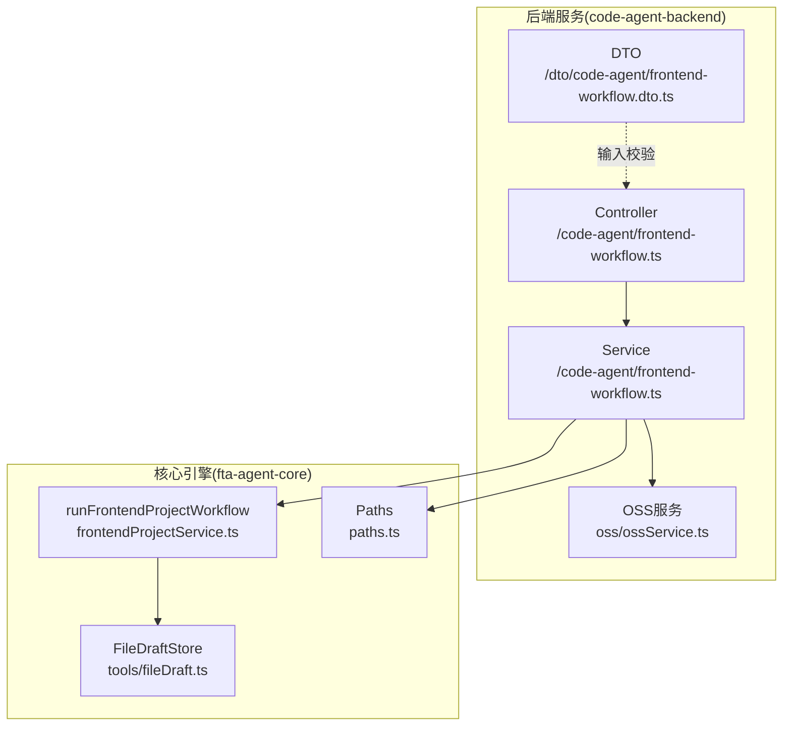
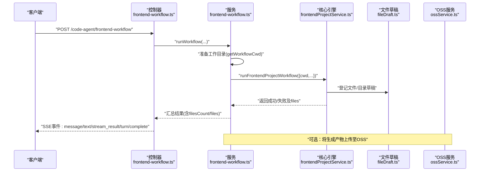
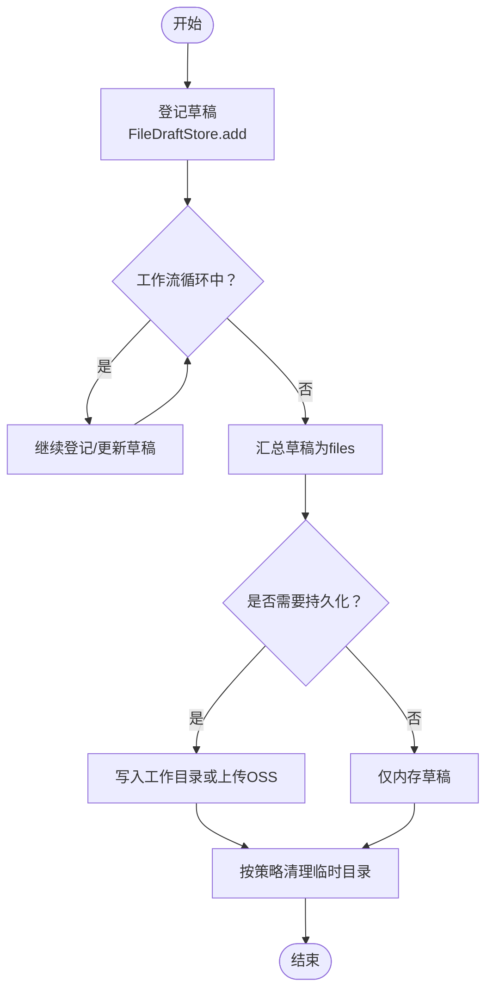
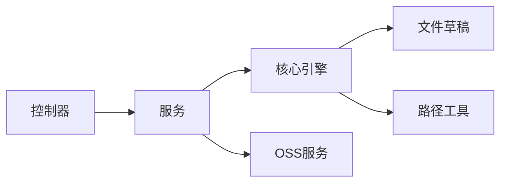

# 文件生成

<cite>
**本文引用的文件**
- [code-agent-backend/src/service/code-agent/frontend-workflow.ts](file://code-agent-backend/src/service/code-agent/frontend-workflow.ts)
- [code-agent-backend/src/controller/code-agent/frontend-workflow.ts](file://code-agent-backend/src/controller/code-agent/frontend-workflow.ts)
- [fta-agent-core/src/frontendProjectService.ts](file://fta-agent-core/src/frontendProjectService.ts)
- [fta-agent-core/src/tools/fileDraft.ts](file://fta-agent-core/src/tools/fileDraft.ts)
- [fta-agent-core/src/paths.ts](file://fta-agent-core/src/paths.ts)
- [code-agent-backend/src/dto/code-agent/frontend-workflow.dto.ts](file://code-agent-backend/src/dto/code-agent/frontend-workflow.dto.ts)
- [code-agent-backend/src/service/oss/ossService.ts](file://code-agent-backend/src/service/oss/ossService.ts)
- [code-agent-backend/src/service/oss/index.ts](file://code-agent-backend/src/service/oss/index.ts)
- [code-agent-backend/docs/frontend-workflow-api.md](file://code-agent-backend/docs/frontend-workflow-api.md)
- [code-agent-backend/docs/frontend-workflow-service-usage.md](file://code-agent-backend/docs/frontend-workflow-service-usage.md)
</cite>

## 目录
1. [简介](#简介)
2. [项目结构](#项目结构)
3. [核心组件](#核心组件)
4. [架构总览](#架构总览)
5. [详细组件分析](#详细组件分析)
6. [依赖关系分析](#依赖关系分析)
7. [性能考量](#性能考量)
8. [故障排查指南](#故障排查指南)
9. [结论](#结论)
10. [附录](#附录)

## 简介
本章节聚焦“代码生成文件处理”的实现与实践，围绕以下目标展开：
- 解析生成文件的存储路径、目录结构与文件管理策略
- 阐述 getWorkflowCwd 方法如何基于 sessionId 生成 files-cache/frontend-projects/{sessionId} 的工作目录，并说明其在代码生成过程中的作用
- 解释 FrontendWorkflowResult 中 files 数组的结构定义，包括 path 和 kind 字段的含义
- 描述生成文件的生命周期管理：临时文件的创建、持久化存储与清理机制
- 提供实际示例，展示如何访问与下载生成的代码文件，并说明文件缓存策略与 OSS 集成的关系
- 为开发者提供文件系统性能优化建议与安全访问控制指南

## 项目结构
本仓库采用多模块分层组织，前端工作流相关的核心代码分布在 backend 与 agent-core 两个子工程中：
- 后端服务层负责接收请求、组装工作流参数、调用核心引擎、并通过 SSE 实时推送事件
- 核心引擎层负责构建上下文、加载规则与组件文档、运行循环、收集文件草稿并生成历史日志
- 文件草稿工具负责登记将要生成的文件/目录，形成最终 files 列表
- OSS 服务层提供上传能力，便于将生成产物持久化至对象存储

图表来源
- [code-agent-backend/src/controller/code-agent/frontend-workflow.ts](file://code-agent-backend/src/controller/code-agent/frontend-workflow.ts#L83-L368)
- [code-agent-backend/src/service/code-agent/frontend-workflow.ts](file://code-agent-backend/src/service/code-agent/frontend-workflow.ts#L74-L279)
- [fta-agent-core/src/frontendProjectService.ts](file://fta-agent-core/src/frontendProjectService.ts#L139-L348)
- [fta-agent-core/src/tools/fileDraft.ts](file://fta-agent-core/src/tools/fileDraft.ts#L1-L65)
- [fta-agent-core/src/paths.ts](file://fta-agent-core/src/paths.ts#L24-L44)
- [code-agent-backend/src/service/oss/ossService.ts](file://code-agent-backend/src/service/oss/ossService.ts#L1-L138)

章节来源
- [code-agent-backend/src/controller/code-agent/frontend-workflow.ts](file://code-agent-backend/src/controller/code-agent/frontend-workflow.ts#L83-L368)
- [code-agent-backend/src/service/code-agent/frontend-workflow.ts](file://code-agent-backend/src/service/code-agent/frontend-workflow.ts#L74-L279)
- [fta-agent-core/src/frontendProjectService.ts](file://fta-agent-core/src/frontendProjectService.ts#L139-L348)
- [fta-agent-core/src/tools/fileDraft.ts](file://fta-agent-core/src/tools/fileDraft.ts#L1-L65)
- [fta-agent-core/src/paths.ts](file://fta-agent-core/src/paths.ts#L24-L44)
- [code-agent-backend/src/service/oss/ossService.ts](file://code-agent-backend/src/service/oss/ossService.ts#L1-L138)

## 核心组件
- 前端工作流服务：负责准备工作目录、拉取设计 DSL、拼装数据上下文、调用核心引擎、汇总结果并返回 files 列表
- 前端工作流控制器：负责 SSE 事件推送、工具调用代理、断线处理与清理
- 核心引擎：负责构建 Context、加载规则与组件文档、运行循环、收集文件草稿并生成历史日志
- 文件草稿存储：统一登记将要生成的文件/目录，形成 files 列表
- OSS 服务：封装上传流程，支持 STS 令牌获取与简单上传

章节来源
- [code-agent-backend/src/service/code-agent/frontend-workflow.ts](file://code-agent-backend/src/service/code-agent/frontend-workflow.ts#L74-L279)
- [code-agent-backend/src/controller/code-agent/frontend-workflow.ts](file://code-agent-backend/src/controller/code-agent/frontend-workflow.ts#L138-L368)
- [fta-agent-core/src/frontendProjectService.ts](file://fta-agent-core/src/frontendProjectService.ts#L139-L348)
- [fta-agent-core/src/tools/fileDraft.ts](file://fta-agent-core/src/tools/fileDraft.ts#L1-L65)
- [code-agent-backend/src/service/oss/ossService.ts](file://code-agent-backend/src/service/oss/ossService.ts#L1-L138)

## 架构总览
从前端工作流到文件落盘与持久化的整体流程如下：

图表来源
- [code-agent-backend/src/controller/code-agent/frontend-workflow.ts](file://code-agent-backend/src/controller/code-agent/frontend-workflow.ts#L138-L368)
- [code-agent-backend/src/service/code-agent/frontend-workflow.ts](file://code-agent-backend/src/service/code-agent/frontend-workflow.ts#L74-L279)
- [fta-agent-core/src/frontendProjectService.ts](file://fta-agent-core/src/frontendProjectService.ts#L139-L348)
- [fta-agent-core/src/tools/fileDraft.ts](file://fta-agent-core/src/tools/fileDraft.ts#L1-L65)
- [code-agent-backend/src/service/oss/ossService.ts](file://code-agent-backend/src/service/oss/ossService.ts#L1-L138)

## 详细组件分析

### getWorkflowCwd 与工作目录
- 作用：根据 sessionId 生成工作目录路径，作为本次工作流的临时工作区
- 路径构成：process.cwd() + "/files-cache/frontend-projects/{sessionId}"
- 使用场景：
  - 服务层在调用核心引擎前，先计算并传入 cwd 参数
  - 核心引擎内部 Context 会基于 cwd 构建全局日志与项目路径，但工作流产生的草稿文件由文件草稿存储统一登记，不强制写入该目录
- 生命周期：
  - 生成阶段：草稿登记在内存中，不立即落盘
  - 持久化阶段：可在业务侧决定是否将草稿写入该目录或上传至 OSS
  - 清理阶段：可按需删除该目录或保留一段时间用于审计

章节来源
- [code-agent-backend/src/service/code-agent/frontend-workflow.ts](file://code-agent-backend/src/service/code-agent/frontend-workflow.ts#L67-L69)
- [code-agent-backend/src/service/code-agent/frontend-workflow.ts](file://code-agent-backend/src/service/code-agent/frontend-workflow.ts#L155-L170)
- [fta-agent-core/src/frontendProjectService.ts](file://fta-agent-core/src/frontendProjectService.ts#L139-L170)

### FrontendWorkflowResult 与 files 数组
- 结构定义：
  - success: 布尔值
  - sessionId: 会话标识
  - filesCount?: 文件数量
  - files?: 数组，元素为 { path: string; kind: string }
  - workflowLogPath?: 工作流历史日志路径
  - error?: 错误信息
- files 数组元素说明：
  - path: 相对于项目根目录的路径
  - kind: "file" 或 "directory"
- 来源：
  - 核心引擎在工作流结束后，将 FileDraftStore.drafts 作为 files 返回
  - 服务层对 files 进行裁剪，仅保留 path 与 kind 字段

章节来源
- [code-agent-backend/src/service/code-agent/frontend-workflow.ts](file://code-agent-backend/src/service/code-agent/frontend-workflow.ts#L34-L44)
- [code-agent-backend/src/service/code-agent/frontend-workflow.ts](file://code-agent-backend/src/service/code-agent/frontend-workflow.ts#L233-L244)
- [fta-agent-core/src/frontendProjectService.ts](file://fta-agent-core/src/frontendProjectService.ts#L331-L344)
- [fta-agent-core/src/tools/fileDraft.ts](file://fta-agent-core/src/tools/fileDraft.ts#L1-L26)

### 文件草稿与生命周期管理
- 草稿登记：
  - 文件草稿工具登记将要生成的文件/目录，包含 path、kind、content（文件）、description、tags 等
  - FileDraftStore 保证同一路径与类型的草稿不会重复登记，后者会覆盖前者
- 生成阶段：
  - 核心引擎在运行循环中调用工具，登记草稿
  - 草稿保存在内存中，不强制写入工作目录
- 持久化阶段：
  - 服务层返回 files 列表给前端
  - 可选地将草稿写入工作目录或上传至 OSS
- 清理阶段：
  - 可按业务策略定期清理 files-cache 下的历史会话目录
  - 历史日志文件位于 logs/api 下，可用于审计

图表来源
- [fta-agent-core/src/tools/fileDraft.ts](file://fta-agent-core/src/tools/fileDraft.ts#L1-L65)
- [fta-agent-core/src/frontendProjectService.ts](file://fta-agent-core/src/frontendProjectService.ts#L304-L344)
- [code-agent-backend/src/service/code-agent/frontend-workflow.ts](file://code-agent-backend/src/service/code-agent/frontend-workflow.ts#L233-L244)

章节来源
- [fta-agent-core/src/tools/fileDraft.ts](file://fta-agent-core/src/tools/fileDraft.ts#L1-L65)
- [fta-agent-core/src/frontendProjectService.ts](file://fta-agent-core/src/frontendProjectService.ts#L304-L344)
- [code-agent-backend/src/service/code-agent/frontend-workflow.ts](file://code-agent-backend/src/service/code-agent/frontend-workflow.ts#L233-L244)

### 目录结构与路径策略
- 工作目录：files-cache/frontend-projects/{sessionId}
- 全局日志路径：由 Paths 类根据 cwd 与 productName 计算，用于会话日志与项目日志
- 历史日志：logs/api 下按天与秒数命名的 JSON 文件，记录工作流上下文、历史消息与草稿

章节来源
- [code-agent-backend/src/service/code-agent/frontend-workflow.ts](file://code-agent-backend/src/service/code-agent/frontend-workflow.ts#L67-L69)
- [fta-agent-core/src/paths.ts](file://fta-agent-core/src/paths.ts#L24-L44)
- [fta-agent-core/src/frontendProjectService.ts](file://fta-agent-core/src/frontendProjectService.ts#L120-L137)

### 访问与下载生成文件
- SSE 完成事件：控制器在工作流完成后通过 SSE 发送 complete 事件，其中包含 filesCount 与 files 列表
- 前端可据此展示生成文件清单，结合业务侧的下载/导出逻辑进行访问
- OSS 集成：服务层可调用 OSS 服务将生成产物上传至对象存储，返回 CDN URL 供下载

章节来源
- [code-agent-backend/src/controller/code-agent/frontend-workflow.ts](file://code-agent-backend/src/controller/code-agent/frontend-workflow.ts#L290-L310)
- [code-agent-backend/docs/frontend-workflow-api.md](file://code-agent-backend/docs/frontend-workflow-api.md#L116-L130)
- [code-agent-backend/src/service/oss/ossService.ts](file://code-agent-backend/src/service/oss/ossService.ts#L102-L138)

### 文件缓存策略与 OSS 集成
- 缓存策略：仓库内存在通用缓存与 Redis 缓存示例，可用于图片地址等资源的缓存
- OSS 集成：OSS 服务封装了 STS 令牌预取与上传流程，支持简单上传并返回 CDN URL
- 与工作流的关系：工作流结束后，可选择将 files 中的产物上传至 OSS，以便外部访问与持久化

章节来源
- [code-agent-backend/src/service/oss/ossService.ts](file://code-agent-backend/src/service/oss/ossService.ts#L1-L138)
- [code-agent-backend/src/service/oss/index.ts](file://code-agent-backend/src/service/oss/index.ts#L1-L21)

## 依赖关系分析
- 控制器依赖服务层提供的 runWorkflow 能力
- 服务层依赖核心引擎 runFrontendProjectWorkflow
- 核心引擎依赖文件草稿存储与路径工具
- 服务层可选依赖 OSS 服务

图表来源
- [code-agent-backend/src/controller/code-agent/frontend-workflow.ts](file://code-agent-backend/src/controller/code-agent/frontend-workflow.ts#L83-L368)
- [code-agent-backend/src/service/code-agent/frontend-workflow.ts](file://code-agent-backend/src/service/code-agent/frontend-workflow.ts#L74-L279)
- [fta-agent-core/src/frontendProjectService.ts](file://fta-agent-core/src/frontendProjectService.ts#L139-L348)
- [fta-agent-core/src/tools/fileDraft.ts](file://fta-agent-core/src/tools/fileDraft.ts#L1-L65)
- [fta-agent-core/src/paths.ts](file://fta-agent-core/src/paths.ts#L24-L44)
- [code-agent-backend/src/service/oss/ossService.ts](file://code-agent-backend/src/service/oss/ossService.ts#L1-L138)

章节来源
- [code-agent-backend/src/controller/code-agent/frontend-workflow.ts](file://code-agent-backend/src/controller/code-agent/frontend-workflow.ts#L83-L368)
- [code-agent-backend/src/service/code-agent/frontend-workflow.ts](file://code-agent-backend/src/service/code-agent/frontend-workflow.ts#L74-L279)
- [fta-agent-core/src/frontendProjectService.ts](file://fta-agent-core/src/frontendProjectService.ts#L139-L348)
- [fta-agent-core/src/tools/fileDraft.ts](file://fta-agent-core/src/tools/fileDraft.ts#L1-L65)
- [fta-agent-core/src/paths.ts](file://fta-agent-core/src/paths.ts#L24-L44)
- [code-agent-backend/src/service/oss/ossService.ts](file://code-agent-backend/src/service/oss/ossService.ts#L1-L138)

## 性能考量
- 文件草稿登记为内存操作，避免频繁磁盘 IO
- SSE 事件推送采用增量方式，减少前端渲染压力
- 历史日志按天与秒数命名，便于按需检索与清理
- 可选的 OSS 上传适合大文件或需要跨域访问的场景，避免本地磁盘压力

[本节为通用指导，不直接分析具体文件]

## 故障排查指南
- 断线与中止：
  - 控制器监听客户端断开事件，触发 AbortController，服务层捕获 AbortError 并返回 aborted 事件
- 工具调用超时：
  - 控制器为每个工具调用设置超时，超时后清理 pending 状态，避免内存泄漏
- 日志定位：
  - 历史日志位于 logs/api 下，可据此回溯工作流上下文与草稿
- 文件未落盘：
  - 若期望本地落盘，可在业务侧将草稿写入工作目录；否则仅保留内存草稿

章节来源
- [code-agent-backend/src/controller/code-agent/frontend-workflow.ts](file://code-agent-backend/src/controller/code-agent/frontend-workflow.ts#L117-L137)
- [code-agent-backend/src/controller/code-agent/frontend-workflow.ts](file://code-agent-backend/src/controller/code-agent/frontend-workflow.ts#L176-L194)
- [code-agent-backend/src/controller/code-agent/frontend-workflow.ts](file://code-agent-backend/src/controller/code-agent/frontend-workflow.ts#L311-L365)
- [fta-agent-core/src/frontendProjectService.ts](file://fta-agent-core/src/frontendProjectService.ts#L120-L137)

## 结论
- getWorkflowCwd 为工作流提供了标准化的工作目录，便于后续持久化与审计
- files 数组承载了生成文件的元信息，path 与 kind 是前端与业务侧识别与处理的基础
- 生命周期管理以“草稿内存登记 + 可选持久化”为核心，兼顾性能与灵活性
- 通过 SSE 与可选 OSS 集成，实现了可观测、可访问、可持久化的文件生成链路

[本节为总结性内容，不直接分析具体文件]

## 附录

### 示例：访问与下载生成文件
- 观察完成事件：complete 事件包含 filesCount 与 files 列表
- 下载策略：
  - 若使用本地工作目录：前端可基于 files 列表逐个请求下载
  - 若使用 OSS：服务层上传后返回 CDN URL，前端直接访问

章节来源
- [code-agent-backend/docs/frontend-workflow-api.md](file://code-agent-backend/docs/frontend-workflow-api.md#L116-L130)
- [code-agent-backend/docs/frontend-workflow-service-usage.md](file://code-agent-backend/docs/frontend-workflow-service-usage.md#L57-L109)
- [code-agent-backend/src/service/oss/ossService.ts](file://code-agent-backend/src/service/oss/ossService.ts#L102-L138)

### 安全访问控制指南
- 工具调用审批：控制器默认自动批准工具调用，但可扩展为基于角色的审批策略
- 访问鉴权：对外暴露的 API 应增加鉴权与限流
- 数据脱敏：生成代码应进行安全扫描与脱敏处理
- 存储加密：上传至 OSS 的文件建议启用加密与私有访问控制

章节来源
- [code-agent-backend/src/controller/code-agent/frontend-workflow.ts](file://code-agent-backend/src/controller/code-agent/frontend-workflow.ts#L278-L286)