# REST API管理

<cite>
**本文档引用文件**   
- [rest-api.ts](file://code-agent-backend/src/entity/code-agent/rest-api.ts)
- [rest-api-group.ts](file://code-agent-backend/src/entity/code-agent/rest-api-group.ts)
- [rest-api.service.ts](file://code-agent-backend/src/service/code-agent/rest-api.ts)
- [rest-api-group.service.ts](file://code-agent-backend/src/service/code-agent/rest-api-group.ts)
- [rest-api.controller.ts](file://code-agent-backend/src/controller/code-agent/rest-api.ts)
- [rest-api-group.controller.ts](file://code-agent-backend/src/controller/code-agent/rest-api-group.ts)
- [restApiService.ts](file://fta-layout-design/src/services/restApiService.ts)
- [RestApiCreateModal.tsx](file://fta-layout-design/src/pages/EditorPage/components/RestApiCreateModal/index.tsx)
- [RestApiDetailModal.tsx](file://fta-layout-design/src/pages/EditorPage/components/RestApiDetailModal/index.tsx)
- [restApi.ts](file://fta-layout-design/src/types/restApi.ts)
- [req.ts](file://code-agent-backend/src/dto/code-agent/req.ts)
- [res.ts](file://code-agent-backend/src/dto/code-agent/res.ts)
- [apiService.ts](file://fta-layout-design/src/utils/apiService.ts)
</cite>

## 目录
1. [REST API管理概述](#rest-api管理概述)
2. [核心数据模型解析](#核心数据模型解析)
3. [前端工作台操作指南](#前端工作台操作指南)
4. [后端服务实现分析](#后端服务实现分析)
5. [接口版本与分组管理](#接口版本与分组管理)
6. [实际应用场景](#实际应用场景)

## REST API管理概述

本系统提供完整的REST API管理功能，支持API的定义、配置、分组和版本管理。REST API实体用于存储接口定义，关联数据模型，支持通过OpenAPI规范进行远程同步。系统通过前后端分离架构实现，前端提供可视化操作界面，后端提供完整的CRUD操作和业务逻辑处理。

REST API管理功能主要包含以下核心组件：
- **RestApi实体**：定义API的基本属性，包括名称、描述、URL、HTTP方法等
- **RestApiGroup实体**：对API进行分组管理，支持从远程URL同步OpenAPI文档
- **服务层**：提供创建、更新、删除、查询等核心业务逻辑
- **控制器层**：暴露RESTful API接口供前端调用
- **前端组件**：提供可视化界面用于创建和编辑API

系统通过DTO（Data Transfer Object）模式定义请求和响应结构，确保前后端数据交互的一致性和类型安全。同时，系统支持通过syncUrl字段从远程OpenAPI/Swagger文档自动同步接口定义，提高开发效率。

**Section sources**
- [rest-api.ts](file://code-agent-backend/src/entity/code-agent/rest-api.ts#L5-L69)
- [rest-api-group.ts](file://code-agent-backend/src/entity/code-agent/rest-api-group.ts#L4-L64)
- [restApi.ts](file://fta-layout-design/src/types/restApi.ts#L2-L139)

## 核心数据模型解析

### RestApi实体设计

RestApi实体是REST API管理的核心数据模型，定义了API接口的基本属性和关联关系。该实体采用Typegoose进行MongoDB映射，确保数据持久化的一致性和完整性。

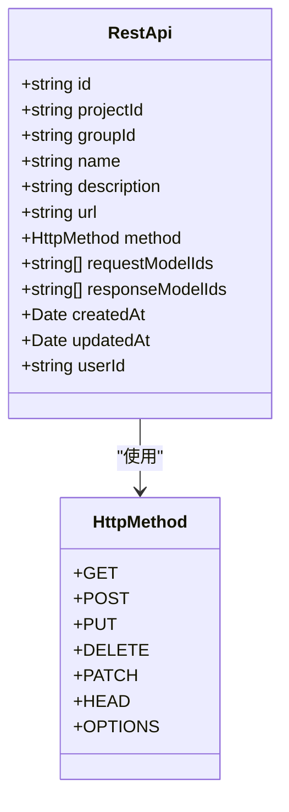

**Diagram sources**
- [rest-api.ts](file://code-agent-backend/src/entity/code-agent/rest-api.ts#L17-L67)
- [restApi.ts](file://fta-layout-design/src/types/restApi.ts#L9)

**Section sources**
- [rest-api.ts](file://code-agent-backend/src/entity/code-agent/rest-api.ts#L17-L67)
- [restApi.ts](file://fta-layout-design/src/types/restApi.ts#L9)

### RestApiGroup实体设计

RestApiGroup实体用于对REST API进行分组管理，支持从远程OpenAPI文档同步接口定义。该实体不仅提供基本的分组功能，还包含同步状态管理，便于跟踪远程文档的同步情况。

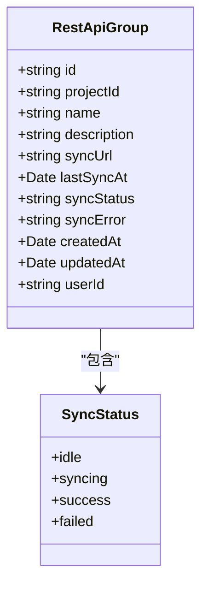

**Diagram sources**
- [rest-api-group.ts](file://code-agent-backend/src/entity/code-agent/rest-api-group.ts#L16-L63)
- [restApi.ts](file://fta-layout-design/src/types/restApi.ts#L12-L35)

**Section sources**
- [rest-api-group.ts](file://code-agent-backend/src/entity/code-agent/rest-api-group.ts#L16-L63)
- [restApi.ts](file://fta-layout-design/src/types/restApi.ts#L12-L35)

### 请求与响应结构设计

系统通过DTO模式定义了清晰的请求和响应结构，确保前后端数据交互的类型安全和一致性。请求DTO用于验证和解析客户端输入，响应DTO用于格式化服务端输出。

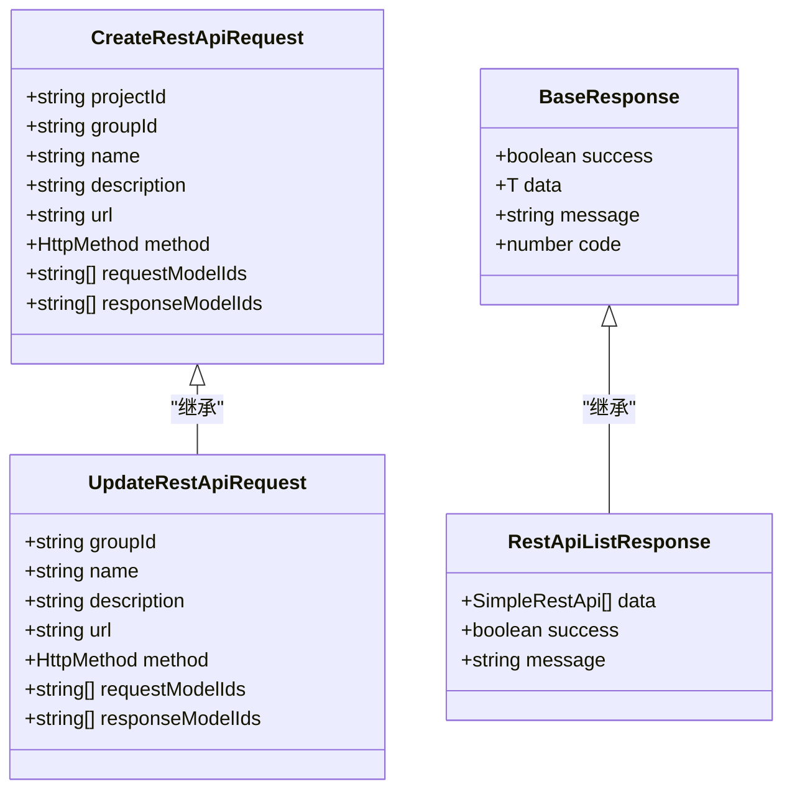

**Diagram sources**
- [req.ts](file://code-agent-backend/src/dto/code-agent/req.ts#L523-L578)
- [res.ts](file://code-agent-backend/src/dto/code-agent/res.ts#L390-L410)

**Section sources**
- [req.ts](file://code-agent-backend/src/dto/code-agent/req.ts#L523-L578)
- [res.ts](file://code-agent-backend/src/dto/code-agent/res.ts#L390-L410)

## 前端工作台操作指南

### 创建REST API接口

在前端工作台中创建REST API接口非常简单，用户可以通过"新建接口"弹窗完成整个创建过程。以下是详细的操作步骤：

1. 在接口列表页面点击"新建接口"按钮
2. 在弹窗中填写接口基本信息：
   - **接口名称**：必填项，描述接口用途
   - **描述**：可选项，提供接口的详细说明
   - **所属接口组**：可选项，选择接口所属的分组
   - **HTTP方法**：选择请求方法（GET、POST、PUT、DELETE等）
   - **API地址**：可选项，定义接口的URL路径

3. 点击"创建"按钮完成接口创建

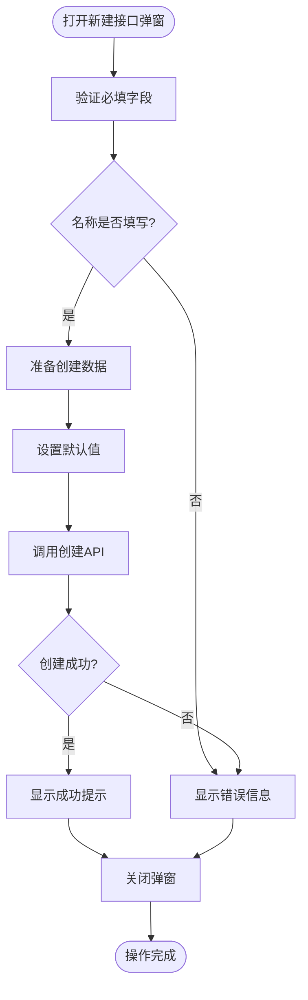

**Section sources**
- [RestApiCreateModal.tsx](file://fta-layout-design/src/pages/EditorPage/components/RestApiCreateModal/index.tsx#L15-L125)

### 编辑REST API接口

编辑REST API接口提供了更丰富的配置选项，用户可以在多个标签页中配置接口的不同方面：

1. **基本信息**：修改接口名称、描述、HTTP方法和URL
2. **请求参数**：关联请求时需要传递的数据模型
3. **响应数据**：关联接口返回的数据模型

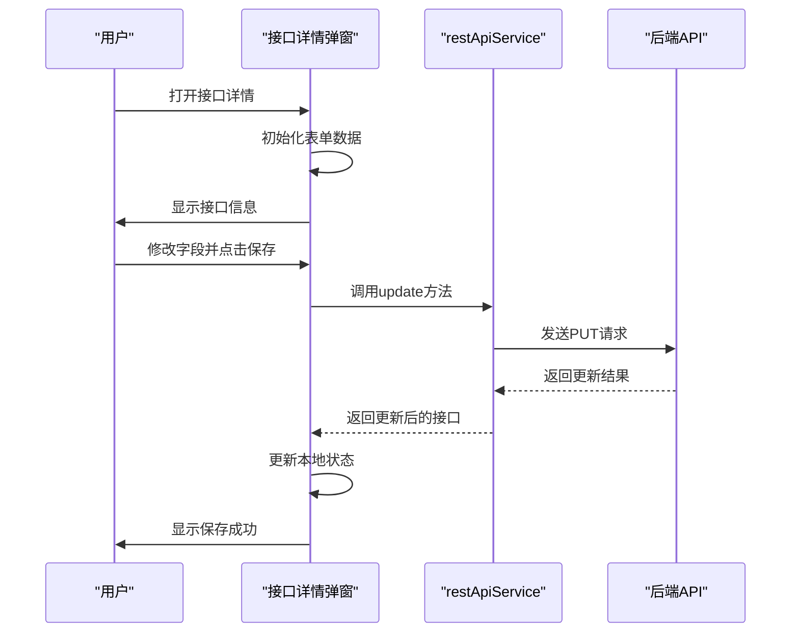

**Section sources**
- [RestApiDetailModal.tsx](file://fta-layout-design/src/pages/EditorPage/components/RestApiDetailModal/index.tsx#L20-L302)

## 后端服务实现分析

### rest-api.service.ts核心实现

rest-api.service.ts文件包含了REST API管理的核心业务逻辑，实现了创建、更新、删除和查询等操作。服务层采用依赖注入模式，通过@Provide装饰器注册为可注入的服务。

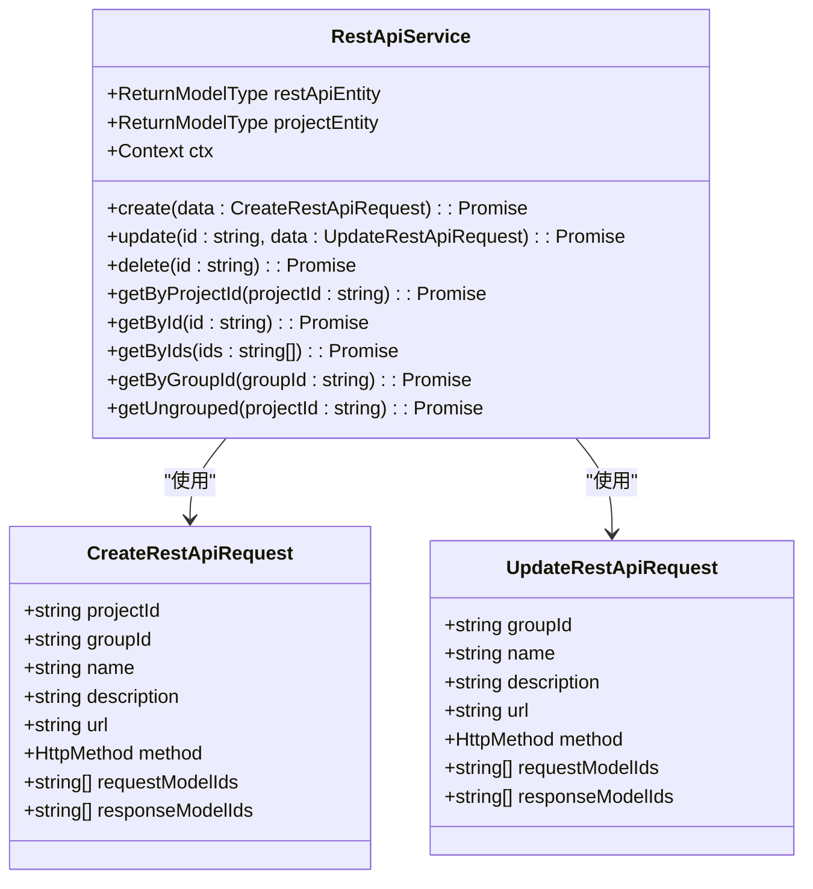

**Diagram sources**
- [rest-api.service.ts](file://code-agent-backend/src/service/code-agent/rest-api.ts#L37-L238)

**Section sources**
- [rest-api.service.ts](file://code-agent-backend/src/service/code-agent/rest-api.ts#L37-L238)

### OpenAPI规范解析逻辑

系统支持从远程OpenAPI/Swagger文档同步接口定义，这一功能在rest-api-group.service.ts中实现。同步过程包含以下关键步骤：

1. 验证用户权限和组存在性
2. 发起HTTP请求获取远程OpenAPI文档
3. 解析文档中的paths和operations
4. 检查是否存在相同URL和方法的接口
5. 更新现有接口或创建新接口
6. 更新同步状态

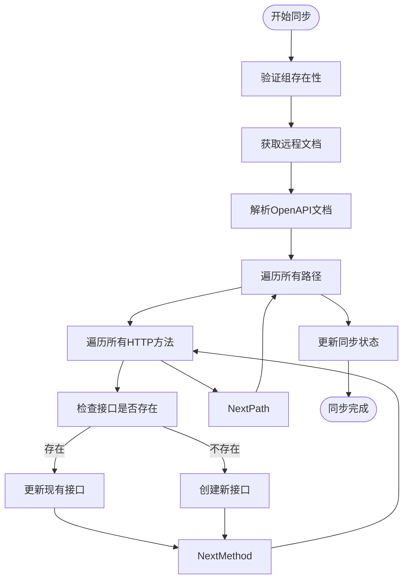

**Section sources**
- [rest-api-group.service.ts](file://code-agent-backend/src/service/code-agent/rest-api-group.ts#L197-L260)

### 接口冲突检测机制

系统在创建和更新API时实现了完善的冲突检测机制，确保数据的一致性和完整性。冲突检测主要体现在以下几个方面：

1. **项目存在性验证**：在创建API时，首先验证关联的项目是否存在
2. **用户权限验证**：确保操作用户是项目的所有者
3. **唯一性约束**：通过ID字段保证API的唯一性
4. **数据完整性**：确保必填字段不为空

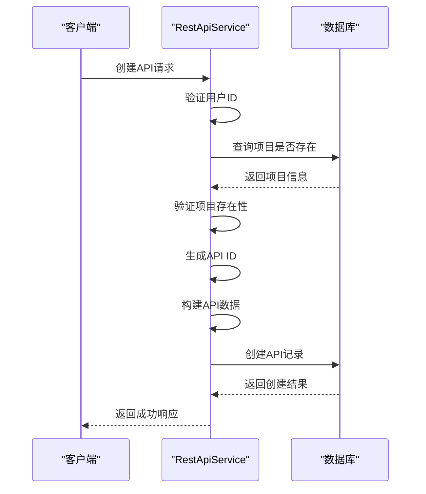

**Section sources**
- [rest-api.service.ts](file://code-agent-backend/src/service/code-agent/rest-api.ts#L66-L96)

### 自动化文档生成策略

系统通过DTO和Swagger装饰器实现了自动化文档生成。每个请求和响应DTO都使用@ApiProperty装饰器标注，这些标注信息会被Swagger自动收集并生成API文档。

```mermaid
classDiagram
class CreateRestApiRequest {
+@ApiProperty({ description : '项目 ID', example : 'project_123', required : true })
+projectId : string
+@ApiProperty({ description : '接口组 ID', example : 'rag_123' })
+groupId? : string
+@ApiProperty({ description : '接口名称', example : '获取用户信息', required : true })
+name : string
+@ApiProperty({ description : '接口描述', example : '获取当前登录用户的详细信息' })
+description? : string
+@ApiProperty({ description : 'API 地址', example : '/api/v1/users/me' })
+url? : string
+@ApiProperty({ description : 'HTTP 方法', example : 'GET', enum : ['GET', 'POST', 'PUT', 'DELETE', 'PATCH', 'HEAD', 'OPTIONS'] })
+method? : 'GET' | 'POST' | 'PUT' | 'DELETE' | 'PATCH' | 'HEAD' | 'OPTIONS'
+@ApiProperty({ description : '请求参数关联的数据模型 ID 列表', type : [String] })
+requestModelIds? : string[]
+@ApiProperty({ description : '响应数据关联的数据模型 ID 列表', type : [String] })
+responseModelIds? : string[]
}
class RestApiDetailResponse {
+@ApiProperty({ description : '是否成功' })
+success : boolean
+@ApiProperty({ description : '响应数据' })
+data? : SimpleRestApi
+@ApiProperty({ description : '响应消息' })
+message? : string
+@ApiProperty({ description : '响应代码' })
+code? : number
}
CreateRestApiRequest --> RestApiDetailResponse : "对应"
```

**Section sources**
- [req.ts](file://code-agent-backend/src/dto/code-agent/req.ts#L523-L578)
- [res.ts](file://code-agent-backend/src/dto/code-agent/res.ts#L412-L415)

## 接口版本与分组管理

### 接口分组管理机制

接口分组管理通过RestApiGroup实体实现，允许用户将相关的API组织在一起。分组不仅提供了逻辑上的组织结构，还支持从远程OpenAPI文档批量同步接口。

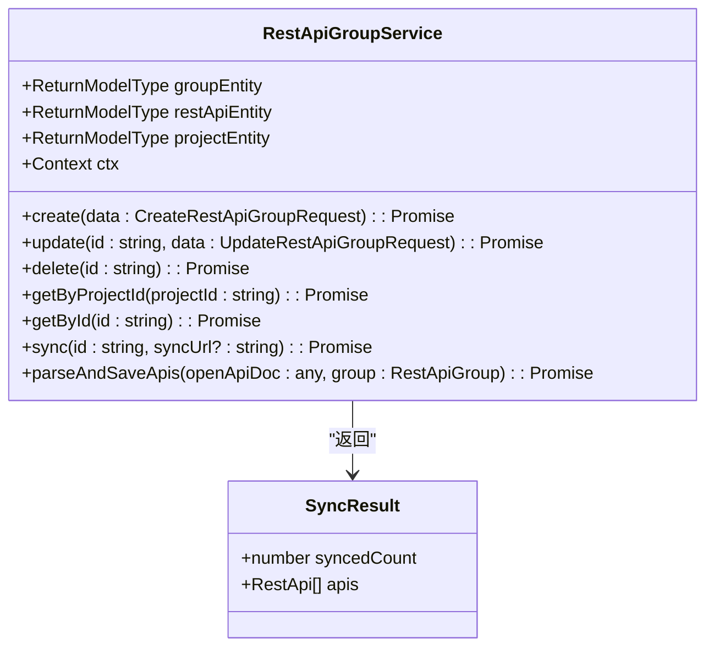

**Section sources**
- [rest-api-group.service.ts](file://code-agent-backend/src/service/code-agent/rest-api-group.ts#L52-L331)

### 版本管理策略

虽然系统目前没有显式的版本管理字段，但通过createdAt和updatedAt时间戳实现了隐式的版本控制。每次更新API时，updatedAt字段都会更新，可以用于追踪API的变更历史。

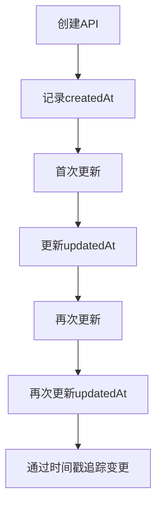

**Section sources**
- [rest-api.ts](file://code-agent-backend/src/entity/code-agent/rest-api.ts#L56-L62)

## 实际应用场景

### 定义复杂JSON响应结构

在实际开发中，经常需要定义嵌套复杂的JSON响应结构。系统通过关联数据模型的方式支持这一需求。用户可以先定义复杂的数据模型，然后在API的响应数据中关联这些模型。

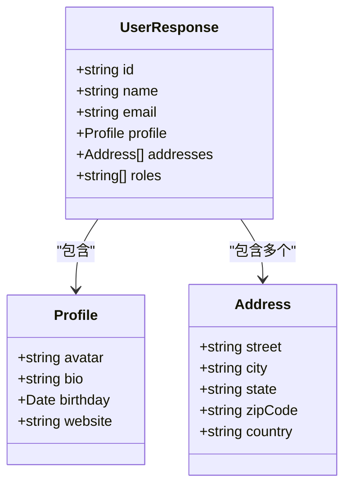

**Section sources**
- [restApi.ts](file://fta-layout-design/src/types/restApi.ts#L40-L65)

### 使用API模板提高效率

系统支持通过API模板提高定义效率。用户可以创建常用的API模式作为模板，在创建新API时直接应用模板，然后根据具体需求进行微调。

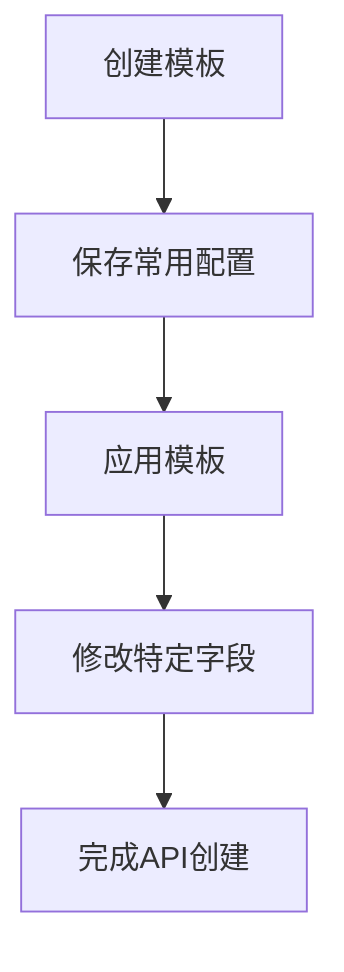

**Section sources**
- [rest-api.service.ts](file://code-agent-backend/src/service/code-agent/rest-api.ts#L66-L96)
- [RestApiCreateModal.tsx](file://fta-layout-design/src/pages/EditorPage/components/RestApiCreateModal/index.tsx#L37-L67)