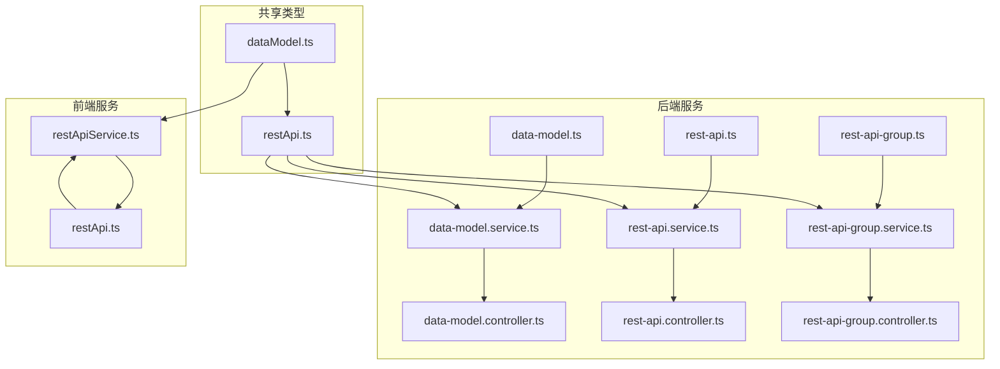
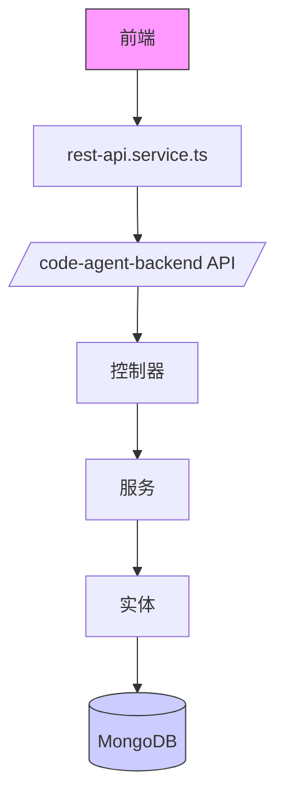
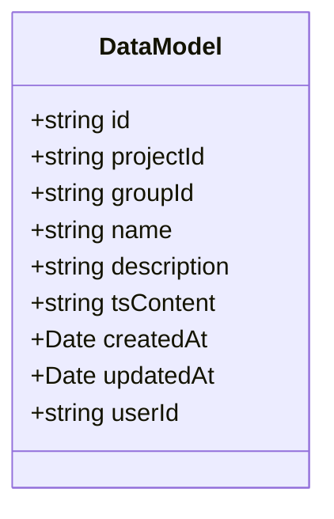
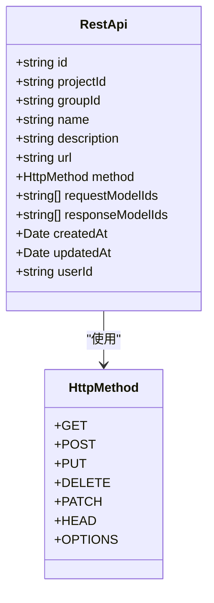
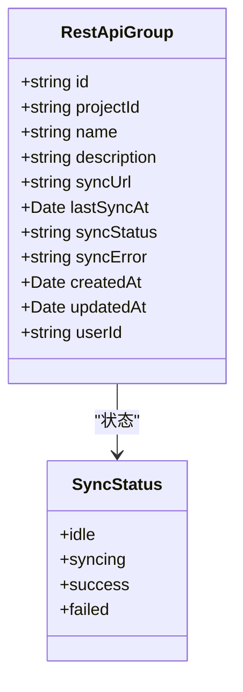
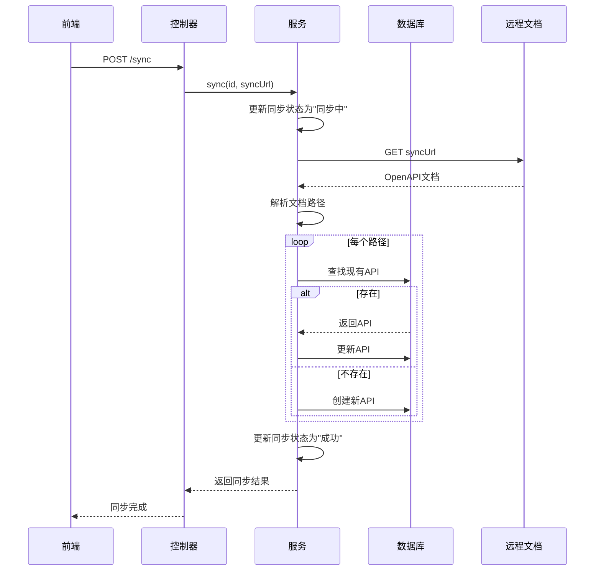
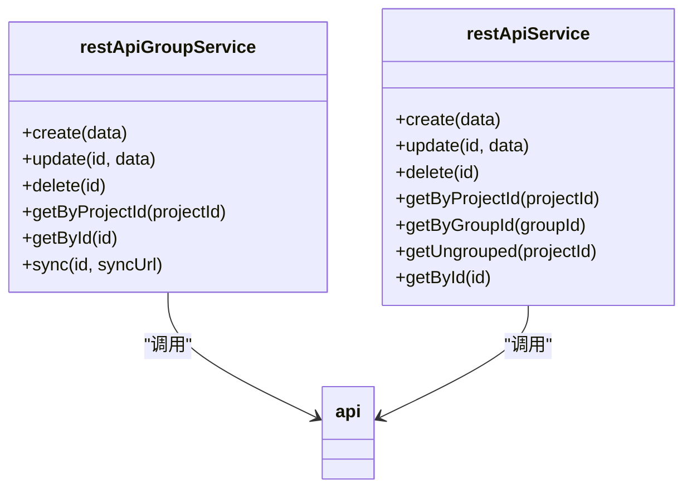
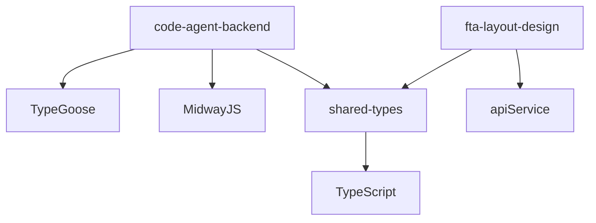

# 数据模型管理

<cite>
**本文档引用的文件**
- [data-model.ts](file://code-agent-backend/src/entity/code-agent/data-model.ts)
- [rest-api.ts](file://code-agent-backend/src/entity/code-agent/rest-api.ts)
- [data-model.controller.ts](file://code-agent-backend/src/controller/code-agent/data-model.ts)
- [rest-api.controller.ts](file://code-agent-backend/src/controller/code-agent/rest-api.ts)
- [data-model.service.ts](file://code-agent-backend/src/service/code-agent/data-model.ts)
- [rest-api.service.ts](file://code-agent-backend/src/service/code-agent/rest-api.ts)
- [rest-api-group.ts](file://code-agent-backend/src/entity/code-agent/rest-api-group.ts)
- [rest-api-group.controller.ts](file://code-agent-backend/src/controller/code-agent/rest-api-group.ts)
- [rest-api-group.service.ts](file://code-agent-backend/src/service/code-agent/rest-api-group.ts)
- [restApi.ts](file://shared-types/src/restApi.ts)
- [dataModel.ts](file://shared-types/src/dataModel.ts)
- [restApiService.ts](file://fta-layout-design/src/services/restApiService.ts)
- [restApi.ts](file://fta-layout-design/src/types/restApi.ts)
</cite>

## 目录
1. [简介](#简介)
2. [项目结构](#项目结构)
3. [核心组件](#核心组件)
4. [架构概述](#架构概述)
5. [详细组件分析](#详细组件分析)
6. [依赖分析](#依赖分析)
7. [性能考虑](#性能考虑)
8. [故障排除指南](#故障排除指南)
9. [结论](#结论)

## 简介
本文档全面介绍了数据模型管理功能，涵盖REST API和数据模型的定义、分组和同步机制。文档详细解析了DataModel和RestApi实体的数据结构，以及如何通过OpenAPI规范进行远程文档同步。为初学者提供在前端工作台创建数据模型组和定义API接口的操作指南，为高级开发者深入分析rest-api.service.ts中API同步和数据验证的实现逻辑。

## 项目结构
数据模型管理功能分布在多个模块中，主要包括后端服务、共享类型定义和前端服务。后端服务位于code-agent-backend模块中，包含实体、控制器和服务。共享类型定义位于shared-types模块中，确保前后端类型一致性。前端服务位于fta-layout-design模块中，提供用户界面和API调用封装。

**图示来源**
- [data-model.ts](file://code-agent-backend/src/entity/code-agent/data-model.ts)
- [rest-api.ts](file://code-agent-backend/src/entity/code-agent/rest-api.ts)
- [rest-api-group.ts](file://code-agent-backend/src/entity/code-agent/rest-api-group.ts)
- [dataModel.ts](file://shared-types/src/dataModel.ts)
- [restApi.ts](file://shared-types/src/restApi.ts)
- [restApiService.ts](file://fta-layout-design/src/services/restApiService.ts)

**本节来源**
- [data-model.ts](file://code-agent-backend/src/entity/code-agent/data-model.ts)
- [rest-api.ts](file://code-agent-backend/src/entity/code-agent/rest-api.ts)
- [rest-api-group.ts](file://code-agent-backend/src/entity/code-agent/rest-api-group.ts)

## 核心组件
数据模型管理功能的核心组件包括数据模型实体、REST API实体和REST API组实体。这些实体通过TypeGoose进行MongoDB持久化，使用MidwayJS框架提供RESTful API服务。共享类型确保了前后端之间的类型一致性，rest-api.service.ts封装了前端对后端API的调用。

**本节来源**
- [data-model.ts](file://code-agent-backend/src/entity/code-agent/data-model.ts)
- [rest-api.ts](file://code-agent-backend/src/entity/code-agent/rest-api.ts)
- [rest-api-group.ts](file://code-agent-backend/src/entity/code-agent/rest-api-group.ts)
- [restApiService.ts](file://fta-layout-design/src/services/restApiService.ts)

## 架构概述
数据模型管理功能采用分层架构，包括数据访问层、业务逻辑层和API层。数据访问层使用TypeGoose与MongoDB交互，业务逻辑层实现核心业务规则，API层提供RESTful接口。前端通过rest-api.service.ts调用后端API，实现数据模型和REST API的创建、更新、删除和查询。

**图示来源**
- [data-model.controller.ts](file://code-agent-backend/src/controller/code-agent/data-model.ts)
- [rest-api.controller.ts](file://code-agent-backend/src/controller/code-agent/rest-api.ts)
- [rest-api-group.controller.ts](file://code-agent-backend/src/controller/code-agent/rest-api-group.ts)
- [data-model.service.ts](file://code-agent-backend/src/service/code-agent/data-model.ts)
- [rest-api.service.ts](file://code-agent-backend/src/service/code-agent/rest-api.ts)
- [rest-api-group.service.ts](file://code-agent-backend/src/service/code-agent/rest-api-group.ts)
- [data-model.ts](file://code-agent-backend/src/entity/code-agent/data-model.ts)
- [rest-api.ts](file://code-agent-backend/src/entity/code-agent/rest-api.ts)
- [rest-api-group.ts](file://code-agent-backend/src/entity/code-agent/rest-api-group.ts)

## 详细组件分析

### 数据模型实体分析
数据模型实体定义了数据模型的核心属性，包括唯一标识、项目ID、分组ID、名称、描述和TypeScript接口定义内容。实体使用TypeGoose装饰器进行MongoDB映射，确保数据持久化的一致性。

**图示来源**
- [data-model.ts](file://code-agent-backend/src/entity/code-agent/data-model.ts)

**本节来源**
- [data-model.ts](file://code-agent-backend/src/entity/code-agent/data-model.ts)

### REST API实体分析
REST API实体定义了API接口的核心属性，包括唯一标识、项目ID、分组ID、名称、描述、URL、HTTP方法以及请求和响应数据模型ID列表。实体通过TypeGoose与MongoDB交互，支持完整的CRUD操作。

**图示来源**
- [rest-api.ts](file://code-agent-backend/src/entity/code-agent/rest-api.ts)
- [restApi.ts](file://shared-types/src/restApi.ts)

**本节来源**
- [rest-api.ts](file://code-agent-backend/src/entity/code-agent/rest-api.ts)

### REST API组实体分析
REST API组实体用于对REST API接口进行分组管理，支持从远程URL同步接口。实体包含同步URL、最后同步时间、同步状态和同步错误信息等属性，实现了完整的远程文档同步功能。

**图示来源**
- [rest-api-group.ts](file://code-agent-backend/src/entity/code-agent/rest-api-group.ts)

**本节来源**
- [rest-api-group.ts](file://code-agent-backend/src/entity/code-agent/rest-api-group.ts)

### REST API同步流程分析
REST API组的同步功能通过调用远程OpenAPI/Swagger文档URL，解析文档内容并创建或更新本地API接口。同步过程包括状态更新、错误处理和批量操作，确保数据一致性。

**图示来源**
- [rest-api-group.service.ts](file://code-agent-backend/src/service/code-agent/rest-api-group.ts)
- [rest-api-group.controller.ts](file://code-agent-backend/src/controller/code-agent/rest-api-group.ts)

**本节来源**
- [rest-api-group.service.ts](file://code-agent-backend/src/service/code-agent/rest-api-group.ts)

### 前端服务分析
前端rest-api.service.ts文件封装了对后端API的调用，提供了创建、更新、删除和查询REST API及组的便捷方法。服务使用apiService进行HTTP请求，返回Promise类型的结果。

**图示来源**
- [restApiService.ts](file://fta-layout-design/src/services/restApiService.ts)

**本节来源**
- [restApiService.ts](file://fta-layout-design/src/services/restApiService.ts)

## 依赖分析
数据模型管理功能的依赖关系清晰，后端服务依赖于TypeGoose和MidwayJS框架，共享类型模块被前后端共同依赖，前端服务依赖于共享类型和API调用工具。

**图示来源**
- [package.json](file://code-agent-backend/package.json)
- [package.json](file://shared-types/package.json)
- [package.json](file://fta-layout-design/package.json)

**本节来源**
- [data-model.ts](file://code-agent-backend/src/entity/code-agent/data-model.ts)
- [rest-api.ts](file://code-agent-backend/src/entity/code-agent/rest-api.ts)
- [rest-api-group.ts](file://code-agent-backend/src/entity/code-agent/rest-api-group.ts)

## 性能考虑
数据模型管理功能在设计时考虑了性能优化，包括使用索引提高查询效率、批量操作减少数据库交互、缓存常用数据和异步处理耗时操作。同步功能采用流式处理，避免内存溢出。

## 故障排除指南
常见问题包括同步URL无效、权限不足和网络超时。解决方案包括验证URL可访问性、检查用户权限和增加超时时间。同步失败时，系统会记录错误信息，便于排查问题。

**本节来源**
- [rest-api-group.service.ts](file://code-agent-backend/src/service/code-agent/rest-api-group.ts)
- [rest-api.service.ts](file://code-agent-backend/src/service/code-agent/rest-api.ts)

## 结论
数据模型管理功能提供了完整的REST API和数据模型定义、分组和同步机制。通过清晰的分层架构和类型安全的设计，确保了系统的可维护性和扩展性。前端工作台和后端服务的紧密集成，为开发者提供了高效的工作流程。