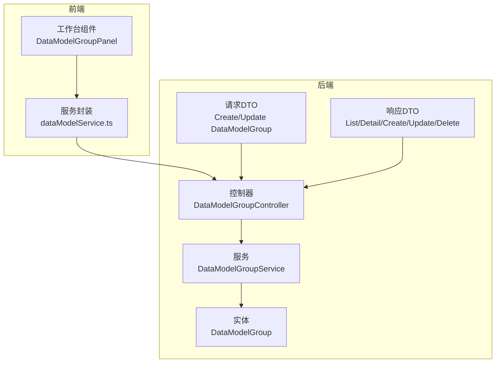
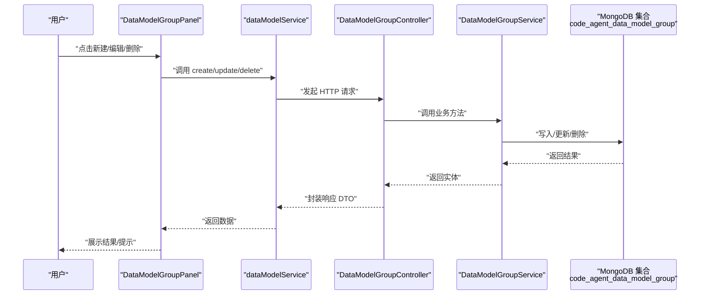
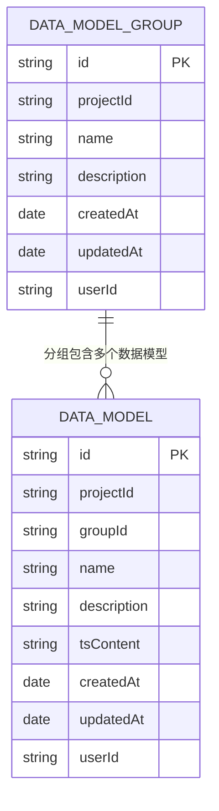
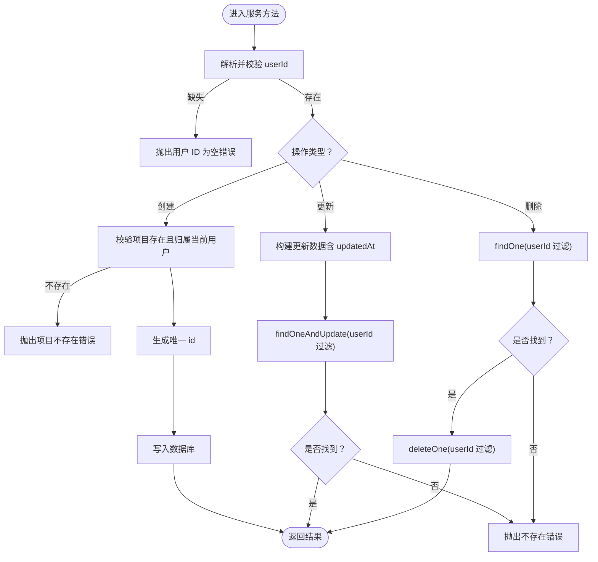
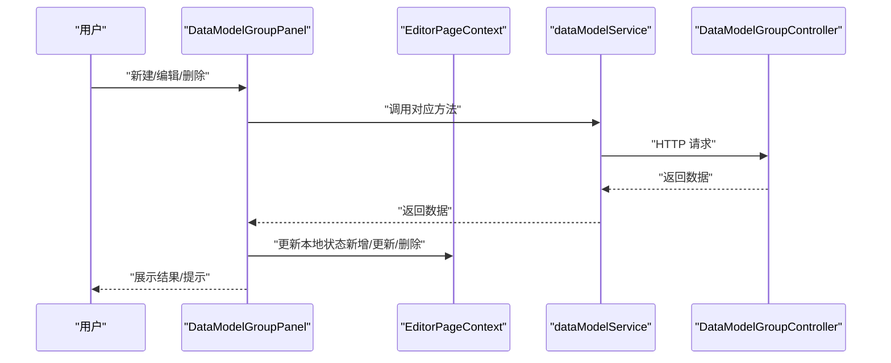
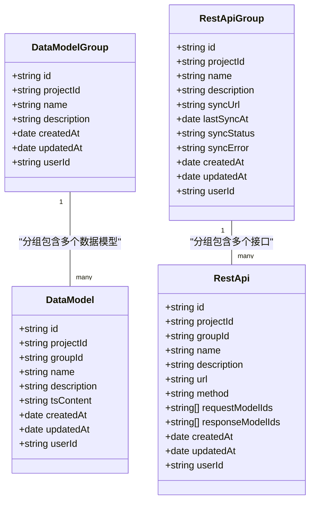
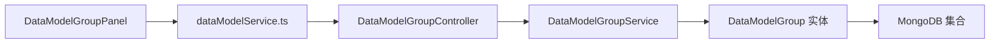

# 数据模型组管理

<cite>
**本文引用的文件**
- [data-model-group.ts（实体）](file://code-agent-backend/src/entity/code-agent/data-model-group.ts)
- [data-model-group.ts（服务）](file://code-agent-backend/src/service/code-agent/data-model-group.ts)
- [data-model-group.ts（控制器）](file://code-agent-backend/src/controller/code-agent/data-model-group.ts)
- [req.ts（请求DTO）](file://code-agent-backend/src/dto/code-agent/req.ts)
- [res.ts（响应DTO）](file://code-agent-backend/src/dto/code-agent/res.ts)
- [dataModelService.ts（前端服务封装）](file://fta-layout-design/src/services/dataModelService.ts)
- [DataModelGroupPanel（前端组件）](file://fta-layout-design/src/pages/EditorPage/components/DataModelGroupPanel/index.tsx)
- [rest-api-group.ts（实体）](file://code-agent-backend/src/entity/code-agent/rest-api-group.ts)
- [rest-api-group.ts（服务）](file://code-agent-backend/src/service/code-agent/rest-api-group.ts)
- [rest-api.ts（服务）](file://code-agent-backend/src/service/code-agent/rest-api.ts)
- [restApi.ts（共享类型）](file://fta-layout-design/src/types/restApi.ts)
- [dataModel.ts（共享类型）](file://shared-types/src/dataModel.ts)
</cite>

## 目录
1. [简介](#简介)
2. [项目结构](#项目结构)
3. [核心组件](#核心组件)
4. [架构总览](#架构总览)
5. [详细组件分析](#详细组件分析)
6. [依赖关系分析](#依赖关系分析)
7. [性能考量](#性能考量)
8. [故障排查指南](#故障排查指南)
9. [结论](#结论)
10. [附录](#附录)

## 简介
本文件围绕“数据模型组”管理功能展开，系统性介绍数据模型组的创建、更新、删除与查询流程；解析 DataModelGroup 实体的数据结构与数据库持久化方式；说明其与 REST API 组的映射关系；为初学者提供前端工作台中创建与管理数据模型组的操作指南；为高级开发者深入分析 data-model-group.ts 中服务层的实现逻辑（权限控制、命名冲突检测、级联删除等）；并给出实际应用场景与最佳实践，包括通过 API 批量导入多个数据模型组以及在大型项目中如何组织与分类数据模型以提升可维护性。

## 项目结构
数据模型组管理涉及后端实体、服务、控制器与前端工作台的协同：
- 后端
  - 实体：DataModelGroup（MongoDB 持久化）
  - 服务：DataModelGroupService（业务逻辑与权限校验）
  - 控制器：DataModelGroupController（REST API 入口）
  - DTO：请求/响应对象定义
- 前端
  - 服务封装：dataModelService.ts（统一调用后端 API）
  - 工作台组件：DataModelGroupPanel（分组面板与 CRUD 操作）

图表来源
- [data-model-group.ts（实体）](file://code-agent-backend/src/entity/code-agent/data-model-group.ts#L1-L48)
- [data-model-group.ts（服务）](file://code-agent-backend/src/service/code-agent/data-model-group.ts#L1-L156)
- [data-model-group.ts（控制器）](file://code-agent-backend/src/controller/code-agent/data-model-group.ts#L1-L104)
- [req.ts（请求DTO）](file://code-agent-backend/src/dto/code-agent/req.ts#L439-L458)
- [res.ts（响应DTO）](file://code-agent-backend/src/dto/code-agent/res.ts#L255-L294)
- [dataModelService.ts（前端服务封装）](file://fta-layout-design/src/services/dataModelService.ts#L1-L131)
- [DataModelGroupPanel（前端组件）](file://fta-layout-design/src/pages/EditorPage/components/DataModelGroupPanel/index.tsx#L1-L314)

章节来源
- [data-model-group.ts（实体）](file://code-agent-backend/src/entity/code-agent/data-model-group.ts#L1-L48)
- [data-model-group.ts（服务）](file://code-agent-backend/src/service/code-agent/data-model-group.ts#L1-L156)
- [data-model-group.ts（控制器）](file://code-agent-backend/src/controller/code-agent/data-model-group.ts#L1-L104)
- [req.ts（请求DTO）](file://code-agent-backend/src/dto/code-agent/req.ts#L439-L458)
- [res.ts（响应DTO）](file://code-agent-backend/src/dto/code-agent/res.ts#L255-L294)
- [dataModelService.ts（前端服务封装）](file://fta-layout-design/src/services/dataModelService.ts#L1-L131)
- [DataModelGroupPanel（前端组件）](file://fta-layout-design/src/pages/EditorPage/components/DataModelGroupPanel/index.tsx#L1-L314)

## 核心组件
- DataModelGroup 实体
  - 字段：id、projectId、name、description、createdAt、updatedAt、userId
  - 持久化集合：code_agent_data_model_group
  - 时间戳：自动维护 createdAt/updatedAt
- DataModelGroupService
  - 权限控制：从上下文解析 userId 并强制按 userId 查询/更新/删除
  - 项目存在性校验：创建前校验项目归属
  - ID 生成：随机+时间戳组合
  - 查询：按 projectId 列表、按 id 详情
- DataModelGroupController
  - REST API：POST / PUT / DELETE / GET /project/:projectId / GET /:id
  - 错误处理：根据场景设置 400/404/500
- 前端 dataModelService
  - 统一封装 create/update/delete/list/detail
- 前端 DataModelGroupPanel
  - 提供新建/编辑/删除/切换分组的 UI 交互
  - 删除前检查分组内数据模型数量，避免误删

章节来源
- [data-model-group.ts（实体）](file://code-agent-backend/src/entity/code-agent/data-model-group.ts#L1-L48)
- [data-model-group.ts（服务）](file://code-agent-backend/src/service/code-agent/data-model-group.ts#L1-L156)
- [data-model-group.ts（控制器）](file://code-agent-backend/src/controller/code-agent/data-model-group.ts#L1-L104)
- [dataModelService.ts（前端服务封装）](file://fta-layout-design/src/services/dataModelService.ts#L1-L131)
- [DataModelGroupPanel（前端组件）](file://fta-layout-design/src/pages/EditorPage/components/DataModelGroupPanel/index.tsx#L1-L314)

## 架构总览
后端采用 MVC 分层：控制器负责路由与错误码，服务层负责业务与权限校验，实体层负责 MongoDB 映射。前端通过 dataModelService 统一调用后端 API，并在工作台组件中完成用户交互。

图表来源
- [DataModelGroupPanel（前端组件）](file://fta-layout-design/src/pages/EditorPage/components/DataModelGroupPanel/index.tsx#L1-L314)
- [dataModelService.ts（前端服务封装）](file://fta-layout-design/src/services/dataModelService.ts#L1-L131)
- [data-model-group.ts（控制器）](file://code-agent-backend/src/controller/code-agent/data-model-group.ts#L1-L104)
- [data-model-group.ts（服务）](file://code-agent-backend/src/service/code-agent/data-model-group.ts#L1-L156)
- [data-model-group.ts（实体）](file://code-agent-backend/src/entity/code-agent/data-model-group.ts#L1-L48)

## 详细组件分析

### 数据模型组实体与持久化
- 字段说明
  - id：全局唯一标识，服务层生成
  - projectId：所属项目 ID
  - name/description：分组名称与描述
  - createdAt/updatedAt：时间戳
  - userId：用户维度隔离
- 集合与选项
  - 集合名：code_agent_data_model_group
  - timestamps：启用 createdAt/updatedAt 自动维护
  - 允许混合类型：options.allowMixed=ALLOW
- 关系与约束
  - 与项目的关系：通过 projectId 关联
  - 与数据模型的关系：数据模型通过 groupId 关联到分组（见共享类型）

图表来源
- [data-model-group.ts（实体）](file://code-agent-backend/src/entity/code-agent/data-model-group.ts#L1-L48)
- [dataModel.ts（共享类型）](file://shared-types/src/dataModel.ts#L1-L54)

章节来源
- [data-model-group.ts（实体）](file://code-agent-backend/src/entity/code-agent/data-model-group.ts#L1-L48)
- [dataModel.ts（共享类型）](file://shared-types/src/dataModel.ts#L1-L54)

### 服务层实现要点（权限、ID 生成、查询）
- 权限控制
  - 从上下文解析 userId，所有读写均按 userId 过滤
  - 创建前校验项目存在且归属当前用户
- ID 生成
  - 前缀 dmg + 随机字符串 + 时间戳
- 查询策略
  - 按 projectId 列表：按创建时间倒序
  - 按 id 详情：返回单条记录
- 错误处理
  - 未找到时抛出明确错误信息
  - 控制器根据场景设置 400/404/500

图表来源
- [data-model-group.ts（服务）](file://code-agent-backend/src/service/code-agent/data-model-group.ts#L1-L156)

章节来源
- [data-model-group.ts（服务）](file://code-agent-backend/src/service/code-agent/data-model-group.ts#L1-L156)

### 控制器与 API 定义
- 路由与方法
  - POST /code-agent/data-model-group/：创建
  - PUT /code-agent/data-model-group/:id：更新
  - DEL /code-agent/data-model-group/:id：删除
  - GET /code-agent/data-model-group/project/:projectId：按项目列出
  - GET /code-agent/data-model-group/:id：按 id 获取详情
- 错误码
  - 400：参数错误或业务异常
  - 404：资源不存在
  - 500：服务器内部错误

章节来源
- [data-model-group.ts（控制器）](file://code-agent-backend/src/controller/code-agent/data-model-group.ts#L1-L104)
- [req.ts（请求DTO）](file://code-agent-backend/src/dto/code-agent/req.ts#L439-L458)
- [res.ts（响应DTO）](file://code-agent-backend/src/dto/code-agent/res.ts#L255-L294)

### 前端工作台：创建与管理数据模型组
- 主要能力
  - 新建分组：表单校验、提交后刷新列表
  - 编辑分组：弹窗表单、保存后更新本地状态
  - 删除分组：前置校验（若分组内有数据模型则阻止删除），删除成功后移除本地缓存
  - 切换分组：支持“全部”“未分组”“具体分组”
- 与后端交互
  - 通过 dataModelService 调用后端 API
  - 使用 EditorPageContext 的 actions 更新本地状态

图表来源
- [DataModelGroupPanel（前端组件）](file://fta-layout-design/src/pages/EditorPage/components/DataModelGroupPanel/index.tsx#L1-L314)
- [dataModelService.ts（前端服务封装）](file://fta-layout-design/src/services/dataModelService.ts#L1-L131)

章节来源
- [DataModelGroupPanel（前端组件）](file://fta-layout-design/src/pages/EditorPage/components/DataModelGroupPanel/index.tsx#L1-L314)
- [dataModelService.ts（前端服务封装）](file://fta-layout-design/src/services/dataModelService.ts#L1-L131)

### 与 REST API 组的映射关系
- 数据模型组与 REST API 组分别管理不同类型的实体，但都遵循“项目维度 + 用户维度”的隔离策略
- 数据模型组（DataModelGroup）与数据模型（DataModel）是一对多关系
- REST API 组（RestApiGroup）与 REST API（RestApi）是一对多关系
- 两者在数据库中分别存储于独立集合，服务层实现也相互独立

图表来源
- [data-model-group.ts（实体）](file://code-agent-backend/src/entity/code-agent/data-model-group.ts#L1-L48)
- [rest-api-group.ts（实体）](file://code-agent-backend/src/entity/code-agent/rest-api-group.ts#L1-L64)
- [rest-api-group.ts（服务）](file://code-agent-backend/src/service/code-agent/rest-api-group.ts#L109-L161)
- [rest-api.ts（服务）](file://code-agent-backend/src/service/code-agent/rest-api.ts#L210-L238)
- [restApi.ts（共享类型）](file://fta-layout-design/src/types/restApi.ts#L1-L65)
- [dataModel.ts（共享类型）](file://shared-types/src/dataModel.ts#L1-L54)

章节来源
- [rest-api-group.ts（实体）](file://code-agent-backend/src/entity/code-agent/rest-api-group.ts#L1-L64)
- [rest-api-group.ts（服务）](file://code-agent-backend/src/service/code-agent/rest-api-group.ts#L109-L161)
- [rest-api.ts（服务）](file://code-agent-backend/src/service/code-agent/rest-api.ts#L210-L238)
- [restApi.ts（共享类型）](file://fta-layout-design/src/types/restApi.ts#L1-L65)
- [dataModel.ts（共享类型）](file://shared-types/src/dataModel.ts#L1-L54)

## 依赖关系分析
- 后端依赖链
  - 控制器依赖服务
  - 服务依赖实体模型与上下文
  - 实体依赖 Typegoose/MongoDB
- 前端依赖链
  - 组件依赖服务封装
  - 服务封装依赖通用 API 工具
  - 类型来自共享类型包

图表来源
- [DataModelGroupPanel（前端组件）](file://fta-layout-design/src/pages/EditorPage/components/DataModelGroupPanel/index.tsx#L1-L314)
- [dataModelService.ts（前端服务封装）](file://fta-layout-design/src/services/dataModelService.ts#L1-L131)
- [data-model-group.ts（控制器）](file://code-agent-backend/src/controller/code-agent/data-model-group.ts#L1-L104)
- [data-model-group.ts（服务）](file://code-agent-backend/src/service/code-agent/data-model-group.ts#L1-L156)
- [data-model-group.ts（实体）](file://code-agent-backend/src/entity/code-agent/data-model-group.ts#L1-L48)

章节来源
- [data-model-group.ts（控制器）](file://code-agent-backend/src/controller/code-agent/data-model-group.ts#L1-L104)
- [data-model-group.ts（服务）](file://code-agent-backend/src/service/code-agent/data-model-group.ts#L1-L156)
- [data-model-group.ts（实体）](file://code-agent-backend/src/entity/code-agent/data-model-group.ts#L1-L48)
- [dataModelService.ts（前端服务封装）](file://fta-layout-design/src/services/dataModelService.ts#L1-L131)
- [DataModelGroupPanel（前端组件）](file://fta-layout-design/src/pages/EditorPage/components/DataModelGroupPanel/index.tsx#L1-L314)

## 性能考量
- 查询排序与索引
  - 按项目查询默认按 createdAt 倒序，建议在数据库层面为 projectId/createdAt 建立复合索引以优化排序与过滤
- 写入与幂等
  - 服务层生成唯一 id，避免重复键冲突
  - 更新时仅更新必要字段并设置 updatedAt，减少写放大
- 前端渲染
  - 列表渲染时尽量使用稳定 key，避免不必要的重渲染
  - 删除前进行本地计数校验，减少无效网络请求

[本节为通用指导，无需源码引用]

## 故障排查指南
- 常见错误与定位
  - 400 参数错误：检查请求 DTO 字段是否完整（如 projectId/name）
  - 404 资源不存在：确认 id 是否正确，或是否被其他用户删除
  - 500 服务器错误：查看后端日志，关注服务层抛出的异常
- 前端交互问题
  - 删除按钮不可用：确认分组内是否仍有数据模型
  - 列表不刷新：确认调用 create/update/delete 后是否更新了本地状态
- 服务层关键断点
  - 解析 userId 失败：检查鉴权中间件是否正确注入用户上下文
  - 项目不存在：确认 projectId 与 userId 的匹配关系

章节来源
- [data-model-group.ts（控制器）](file://code-agent-backend/src/controller/code-agent/data-model-group.ts#L1-L104)
- [data-model-group.ts（服务）](file://code-agent-backend/src/service/code-agent/data-model-group.ts#L1-L156)
- [DataModelGroupPanel（前端组件）](file://fta-layout-design/src/pages/EditorPage/components/DataModelGroupPanel/index.tsx#L1-L314)

## 结论
数据模型组管理在后端通过清晰的 MVC 分层实现，具备完善的权限控制与查询能力；在前端通过工作台组件提供直观的 CRUD 体验。与 REST API 组并行存在，分别服务于不同领域实体，共同支撑项目的模型与接口组织。建议在生产环境中为关键字段建立索引，并在前端做好本地校验与状态管理，以获得更佳的用户体验与系统稳定性。

[本节为总结，无需源码引用]

## 附录

### API 规范与最佳实践
- 创建数据模型组
  - 路径：POST /code-agent/data-model-group/
  - 请求体：CreateDataModelGroupRequest（projectId、name、description）
  - 响应：CreateDataModelGroupResponse
- 更新数据模型组
  - 路径：PUT /code-agent/data-model-group/:id
  - 请求体：UpdateDataModelGroupRequest（name、description）
  - 响应：UpdateDataModelGroupResponse
- 删除数据模型组
  - 路径：DEL /code-agent/data-model-group/:id
  - 响应：DeleteDataModelGroupResponse
- 查询数据模型组
  - 路径：GET /code-agent/data-model-group/project/:projectId
  - 响应：DataModelGroupListResponse
  - 路径：GET /code-agent/data-model-group/:id
  - 响应：DataModelGroupDetailResponse

章节来源
- [data-model-group.ts（控制器）](file://code-agent-backend/src/controller/code-agent/data-model-group.ts#L1-L104)
- [req.ts（请求DTO）](file://code-agent-backend/src/dto/code-agent/req.ts#L439-L458)
- [res.ts（响应DTO）](file://code-agent-backend/src/dto/code-agent/res.ts#L255-L294)

### 批量导入与大型项目组织建议
- 批量导入
  - 建议在后端提供批量创建接口（当前仓库未内置），可在服务层循环调用 create 并捕获异常，结合事务或幂等键确保一致性
- 组织与分类
  - 按业务域划分分组（如用户、订单、支付）
  - 为每个分组添加描述，便于检索与协作
  - 对于大型项目，建议引入分层命名规范与标签体系，配合前端搜索与筛选功能

[本节为通用指导，无需源码引用]