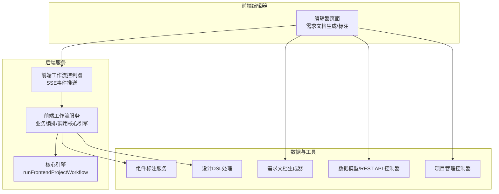
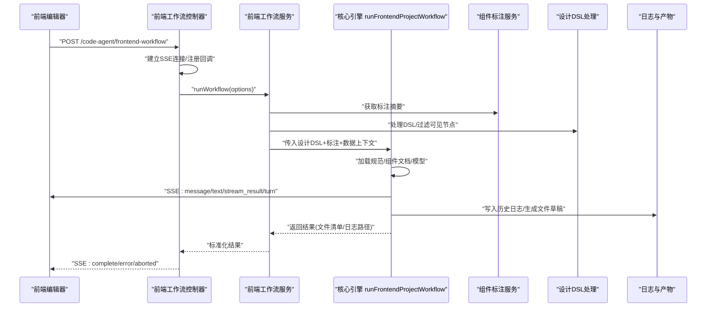
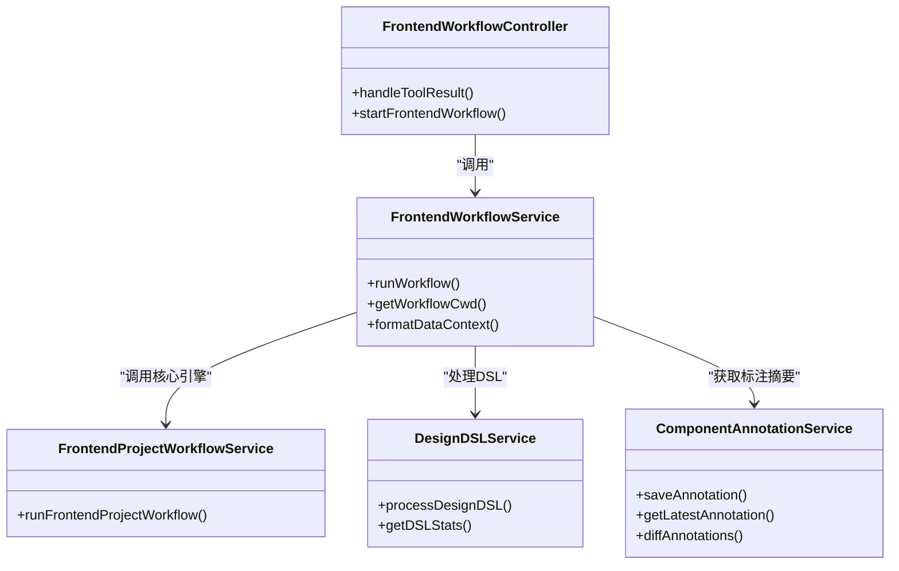
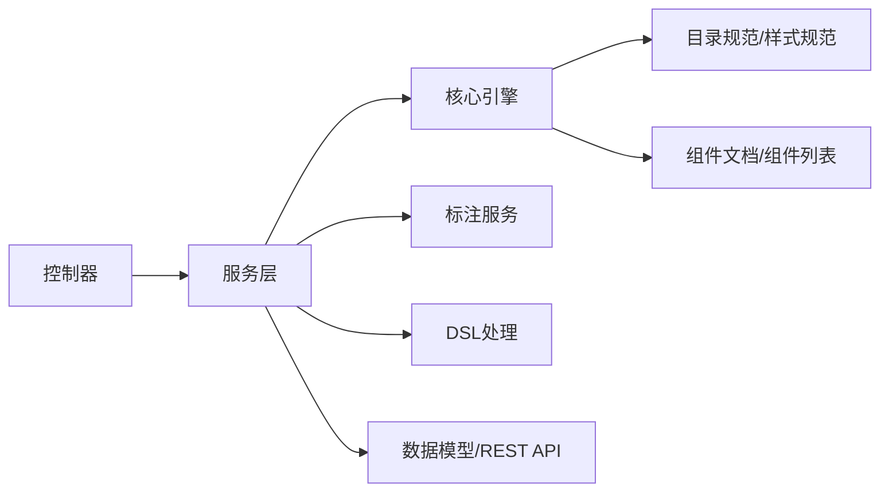
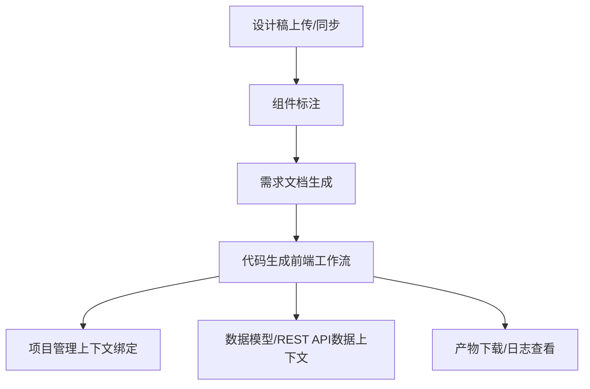

# 核心功能详解

<cite>
**本文引用的文件**
- [frontend-workflow.ts（控制器）](file://code-agent-backend/src/controller/code-agent/frontend-workflow.ts)
- [frontend-workflow.ts（服务）](file://code-agent-backend/src/service/code-agent/frontend-workflow.ts)
- [frontend-workflow.dto.ts](file://code-agent-backend/src/dto/code-agent/frontend-workflow.dto.ts)
- [frontend-workflow-api.md](file://code-agent-backend/docs/frontend-workflow-api.md)
- [frontend-workflow-service-usage.md](file://code-agent-backend/docs/frontend-workflow-service-usage.md)
- [frontendProjectService.ts](file://fta-agent-core/src/frontendProjectService.ts)
- [agentService.ts](file://fta-agent-core/src/agentService.ts)
- [requirement-builder.ts](file://code-agent-backend/src/utils/design/requirement-builder.ts)
- [requirementDoc.ts](file://fta-layout-design/src/pages/EditorPage/utils/requirementDoc.ts)
- [component-annotation.service.ts](file://code-agent-backend/src/service/design/component-annotation.service.ts)
- [project.ts（控制器）](file://code-agent-backend/src/controller/code-agent/project.ts)
- [data-model.ts（控制器）](file://code-agent-backend/src/controller/code-agent/data-model.ts)
- [rest-api.ts（控制器）](file://code-agent-backend/src/controller/code-agent/rest-api.ts)
- [design-dsl.ts](file://code-agent-backend/src/service/code-agent/design-dsl.ts)
- [dsl.ts（数值规范化）](file://code-agent-backend/src/utils/design/dsl.ts)
- [component-list.json](file://code-agent-backend/src/service/code-agent/fta-components/component-list.json)
- [frontend-project-new.md](file://code-agent-backend/src/service/code-agent/fta-prompts/frontend-project-new.md)
- [directory.md](file://code-agent-backend/src/service/code-agent/fta-specs/directory.md)
- [style.md](file://code-agent-backend/src/service/code-agent/fta-specs/style.md)
</cite>

## 目录
1. [引言](#引言)
2. [项目结构](#项目结构)
3. [核心组件](#核心组件)
4. [架构总览](#架构总览)
5. [详细组件分析](#详细组件分析)
6. [依赖关系分析](#依赖关系分析)
7. [性能考量](#性能考量)
8. [故障排查指南](#故障排查指南)
9. [结论](#结论)
10. [附录](#附录)

## 引言
本文件面向不同层次的读者，系统性阐述本项目的六大核心功能模块：设计稿管理、组件标注、需求文档生成、代码生成、项目管理、数据模型管理。我们将从用户价值出发，解释各模块在系统中的定位与协作方式，并给出从“上传设计稿”到“下载生成代码”的完整用户旅程示例，帮助初学者快速上手，同时为高级用户提供关键服务的实现细节与最佳实践。

## 项目结构
后端采用分层架构：Controller 负责 HTTP/SSE 交互与事件推送；Service 负责业务编排与调用核心引擎；核心引擎位于 fta-agent-core，负责前端项目工作流的执行与文件生成。前端编辑器通过 API 与后端交互，完成标注、需求文档生成与代码生成的全流程。

图表来源
- [frontend-workflow.ts（控制器）](file://code-agent-backend/src/controller/code-agent/frontend-workflow.ts#L1-L368)
- [frontend-workflow.ts（服务）](file://code-agent-backend/src/service/code-agent/frontend-workflow.ts#L1-L373)
- [frontendProjectService.ts](file://fta-agent-core/src/frontendProjectService.ts#L1-L349)
- [component-annotation.service.ts](file://code-agent-backend/src/service/design/component-annotation.service.ts#L1-L264)
- [design-dsl.ts](file://code-agent-backend/src/service/code-agent/design-dsl.ts#L1-L474)
- [requirement-builder.ts](file://code-agent-backend/src/utils/design/requirement-builder.ts#L1-L121)
- [project.ts（控制器）](file://code-agent-backend/src/controller/code-agent/project.ts#L1-L256)
- [data-model.ts（控制器）](file://code-agent-backend/src/controller/code-agent/data-model.ts#L1-L125)
- [rest-api.ts（控制器）](file://code-agent-backend/src/controller/code-agent/rest-api.ts#L1-L132)

章节来源
- [frontend-workflow.ts（控制器）](file://code-agent-backend/src/controller/code-agent/frontend-workflow.ts#L1-L368)
- [frontend-workflow.ts（服务）](file://code-agent-backend/src/service/code-agent/frontend-workflow.ts#L1-L373)

## 核心组件
- 设计稿管理：负责项目与页面的增删改查、文档同步与状态更新，支撑后续工作流的上下文绑定与数据检索。
- 组件标注：提供标注的保存、查询、差异对比与缓存，为代码生成提供结构化语义。
- 需求文档生成：基于设计稿与标注，生成结构化的需求文档，沉淀设计意图与约束。
- 代码生成：通过前端工作流控制器与服务，将设计DSL与标注结合，调用核心引擎生成前端项目文件。
- 项目管理：提供项目生命周期管理与上下文绑定，确保工作流在正确的工程环境中执行。
- 数据模型管理：提供数据模型与 REST API 的增删改查与分组查询，作为工作流的数据上下文输入。

章节来源
- [project.ts（控制器）](file://code-agent-backend/src/controller/code-agent/project.ts#L1-L256)
- [data-model.ts（控制器）](file://code-agent-backend/src/controller/code-agent/data-model.ts#L1-L125)
- [rest-api.ts（控制器）](file://code-agent-backend/src/controller/code-agent/rest-api.ts#L1-L132)
- [component-annotation.service.ts](file://code-agent-backend/src/service/design/component-annotation.service.ts#L1-L264)
- [requirement-builder.ts](file://code-agent-backend/src/utils/design/requirement-builder.ts#L1-L121)
- [frontend-workflow.ts（控制器）](file://code-agent-backend/src/controller/code-agent/frontend-workflow.ts#L1-L368)
- [frontend-workflow.ts（服务）](file://code-agent-backend/src/service/code-agent/frontend-workflow.ts#L1-L373)

## 架构总览
前端工作流的端到端架构如下：前端发起请求，后端控制器建立 SSE 连接并转发工具调用；服务层准备 DSL、标注与数据上下文，调用核心引擎执行工作流；核心引擎加载规范与组件文档，运行循环生成文件并记录日志；最终通过 SSE 推送完成事件，前端下载产物。

图表来源
- [frontend-workflow.ts（控制器）](file://code-agent-backend/src/controller/code-agent/frontend-workflow.ts#L83-L309)
- [frontend-workflow.ts（服务）](file://code-agent-backend/src/service/code-agent/frontend-workflow.ts#L74-L279)
- [frontendProjectService.ts](file://fta-agent-core/src/frontendProjectService.ts#L139-L348)
- [frontend-workflow-api.md](file://code-agent-backend/docs/frontend-workflow-api.md#L1-L280)

章节来源
- [frontend-workflow-api.md](file://code-agent-backend/docs/frontend-workflow-api.md#L1-L280)
- [frontend-workflow-service-usage.md](file://code-agent-backend/docs/frontend-workflow-service-usage.md#L1-L286)

## 详细组件分析

### 设计稿管理（Project/Document）
- 职责：提供项目与页面的 CRUD、文档状态更新、文档内容获取与同步。
- 用户价值：为工作流提供稳定的工程上下文，确保生成的代码与项目结构一致。
- 关键接口：项目列表、创建/更新/删除、页面管理、文档状态与内容接口。
- 与工作流的关系：工作流在执行前通过项目服务获取文档内容与页面信息，用于构建 DSL 与数据上下文。

章节来源
- [project.ts（控制器）](file://code-agent-backend/src/controller/code-agent/project.ts#L1-L256)

### 组件标注（Component Annotation）
- 职责：保存/获取/对比标注，支持版本控制与缓存；提供标注摘要供工作流使用。
- 用户价值：将设计稿中的组件语义结构化，指导代码生成的组件选择与层级关系。
- 关键能力：版本冲突处理、差异对比、缓存命中与降级。
- 与工作流的关系：服务层将标注扁平化并格式化为摘要，拼接到页面上下文中，作为“结构权威”。

章节来源
- [component-annotation.service.ts](file://code-agent-backend/src/service/design/component-annotation.service.ts#L1-L264)

### 需求文档生成（Requirement Doc）
- 职责：根据设计稿与标注生成结构化需求文档，包含组件表格、交互与状态、数据接口需求等。
- 用户价值：沉淀设计意图，便于评审与研发对接，减少沟通成本。
- 关键流程：前端通过流式 API 生成文档，后端服务层将设计与标注信息整合为 Markdown。
- 与工作流的关系：需求文档可作为工作流的前置产物，用于明确约束与边界。

章节来源
- [requirement-builder.ts](file://code-agent-backend/src/utils/design/requirement-builder.ts#L1-L121)
- [requirementDoc.ts](file://fta-layout-design/src/pages/EditorPage/utils/requirementDoc.ts#L1-L178)

### 代码生成（Frontend Workflow）
- 职责：接收设计 DSL 与标注，准备工作目录与数据上下文，调用核心引擎生成前端项目文件。
- 用户价值：一键从设计稿生成高质量前端代码，覆盖页面入口、样式、组件、服务与类型。
- 关键实现：
  - 控制器：SSE 事件推送（message/text/stream_result/turn/tool_approve/complete/error/aborted），工具调用代理与超时处理。
  - 服务：获取 DSL 与标注摘要，格式化数据上下文（数据模型+REST API），调用核心引擎并返回结果。
  - 核心引擎：加载规范与组件文档，构造系统提示，运行循环生成文件并记录日志。
- 与前端编辑器的集成：前端通过 fetch-event-source 或 EventSource 接收流式事件，实时展示生成进度。

图表来源
- [frontend-workflow.ts（控制器）](file://code-agent-backend/src/controller/code-agent/frontend-workflow.ts#L1-L368)
- [frontend-workflow.ts（服务）](file://code-agent-backend/src/service/code-agent/frontend-workflow.ts#L1-L373)
- [frontendProjectService.ts](file://fta-agent-core/src/frontendProjectService.ts#L1-L349)
- [design-dsl.ts](file://code-agent-backend/src/service/code-agent/design-dsl.ts#L1-L474)
- [component-annotation.service.ts](file://code-agent-backend/src/service/design/component-annotation.service.ts#L1-L264)

章节来源
- [frontend-workflow.ts（控制器）](file://code-agent-backend/src/controller/code-agent/frontend-workflow.ts#L1-L368)
- [frontend-workflow.ts（服务）](file://code-agent-backend/src/service/code-agent/frontend-workflow.ts#L1-L373)
- [frontendProjectService.ts](file://fta-agent-core/src/frontendProjectService.ts#L1-L349)
- [frontend-workflow-api.md](file://code-agent-backend/docs/frontend-workflow-api.md#L1-L280)
- [frontend-workflow-service-usage.md](file://code-agent-backend/docs/frontend-workflow-service-usage.md#L1-L286)

### 项目管理（Project）
- 职责：项目与页面的全生命周期管理，文档状态与内容的同步与更新。
- 用户价值：统一工程上下文，确保工作流在正确的项目与页面范围内执行。
- 与工作流的关系：工作流通过项目服务获取页面与文档信息，作为 DSL 与数据上下文的来源之一。

章节来源
- [project.ts（控制器）](file://code-agent-backend/src/controller/code-agent/project.ts#L1-L256)

### 数据模型管理（Data Model / REST API）
- 职责：数据模型与 REST API 的增删改查与分组查询，支持按项目维度聚合。
- 用户价值：为工作流提供类型定义与接口契约，保证生成代码的数据一致性与可调用性。
- 与工作流的关系：服务层将数据模型与 API 格式化为文本上下文，拼接到页面标注中，作为“数据权威”。

章节来源
- [data-model.ts（控制器）](file://code-agent-backend/src/controller/code-agent/data-model.ts#L1-L125)
- [rest-api.ts（控制器）](file://code-agent-backend/src/controller/code-agent/rest-api.ts#L1-L132)
- [frontend-workflow.ts（服务）](file://code-agent-backend/src/service/code-agent/frontend-workflow.ts#L295-L371)

## 依赖关系分析
- 控制器依赖服务：控制器仅负责 HTTP/SSE 与工具调用代理，业务逻辑集中在服务层，提升可测试性与复用性。
- 服务层依赖核心引擎：服务层通过 runFrontendProjectWorkflow 调用核心引擎，核心引擎负责工具集、系统提示与循环执行。
- 数据依赖：服务层从项目服务获取文档内容，从标注服务获取标注摘要，从数据模型与 REST API 服务获取数据上下文。
- 规范与组件：服务层加载目录规范与样式规范，组件列表来自组件文档目录，确保生成代码符合约定。

图表来源
- [frontend-workflow.ts（控制器）](file://code-agent-backend/src/controller/code-agent/frontend-workflow.ts#L1-L368)
- [frontend-workflow.ts（服务）](file://code-agent-backend/src/service/code-agent/frontend-workflow.ts#L1-L373)
- [frontendProjectService.ts](file://fta-agent-core/src/frontendProjectService.ts#L1-L349)
- [directory.md](file://code-agent-backend/src/service/code-agent/fta-specs/directory.md#L1-L64)
- [style.md](file://code-agent-backend/src/service/code-agent/fta-specs/style.md#L1-L64)
- [component-list.json](file://code-agent-backend/src/service/code-agent/fta-components/component-list.json#L1-L80)

章节来源
- [frontend-workflow.ts（服务）](file://code-agent-backend/src/service/code-agent/frontend-workflow.ts#L1-L373)
- [frontendProjectService.ts](file://fta-agent-core/src/frontendProjectService.ts#L1-L349)

## 性能考量
- SSE 连接与事件推送：控制器通过 keep-alive 与事件流推送，建议前端使用 fetch-event-source 或 EventSource 以降低连接开销。
- 工具调用代理：控制器维护 pendingToolCalls 与 sessionCallIds，超时与中断清理避免内存泄漏。
- DSL 处理：服务层对 DSL 数值进行规范化，减少渲染误差；对可见节点进行过滤，缩小处理规模。
- 缓存策略：标注服务使用 Redis 缓存最新版本标注，降低数据库压力；DSL 路径转图片使用缓存与持久化，避免重复转换。
- 并发控制：批量生成时建议限制并发，避免模型与 IO 资源争抢。

章节来源
- [frontend-workflow.ts（控制器）](file://code-agent-backend/src/controller/code-agent/frontend-workflow.ts#L1-L368)
- [frontend-workflow.ts（服务）](file://code-agent-backend/src/service/code-agent/frontend-workflow.ts#L1-L373)
- [design-dsl.ts](file://code-agent-backend/src/service/code-agent/design-dsl.ts#L1-L474)
- [component-annotation.service.ts](file://code-agent-backend/src/service/design/component-annotation.service.ts#L1-L264)

## 故障排查指南
- 工作流中断：客户端断开或 AbortSignal 触发时，控制器会发送 aborted 事件；服务层在回调中检查信号并抛出 AbortError。
- 工具调用超时：控制器为每个 callId 设置 60 秒超时，超时后清理 pendingToolCalls 与 sessionCallIds。
- 模型配置缺失：服务层在缺少 apiKey/baseURL 时返回标准化错误，需通过请求参数或配置提供。
- 标注版本冲突：标注服务在版本冲突或非法版本时抛出 HTTP 错误，需检查版本号与强制覆盖策略。
- DSL 转换失败：DSL 处理器在转换 SVG 到 PNG 失败时回退为原节点，建议检查网络与 OSS 配置。

章节来源
- [frontend-workflow.ts（控制器）](file://code-agent-backend/src/controller/code-agent/frontend-workflow.ts#L1-L368)
- [frontend-workflow.ts（服务）](file://code-agent-backend/src/service/code-agent/frontend-workflow.ts#L1-L373)
- [component-annotation.service.ts](file://code-agent-backend/src/service/design/component-annotation.service.ts#L1-L264)
- [design-dsl.ts](file://code-agent-backend/src/service/code-agent/design-dsl.ts#L1-L474)

## 结论
本系统围绕“设计稿→标注→需求→代码”的闭环，通过清晰的分层与规范化的工具链，实现了从设计到代码的高效自动化。前端工作流控制器与服务承担了编排与事件推送的关键角色，核心引擎负责生成与日志记录，配套的标注、DSL 处理与数据上下文服务确保生成质量与一致性。建议在生产环境中配合缓存、并发控制与监控告警，持续优化用户体验与稳定性。

## 附录

### 功能全景图（概念示意）

[此图为概念示意，不对应具体源码结构]

### 用户旅程示例：从上传设计稿到下载生成代码
- 步骤1：在前端编辑器上传设计稿并同步至后端，获取设计文档 ID。
- 步骤2：在编辑器中进行组件标注，保存标注版本。
- 步骤3：生成需求文档，核对组件结构与接口需求。
- 步骤4：点击“生成代码”，后端控制器建立 SSE 连接，服务层准备 DSL 与标注摘要，调用核心引擎生成文件。
- 步骤5：前端通过 SSE 实时查看生成进度，完成后下载产物并查看日志。

章节来源
- [frontend-workflow-api.md](file://code-agent-backend/docs/frontend-workflow-api.md#L1-L280)
- [frontend-workflow-service-usage.md](file://code-agent-backend/docs/frontend-workflow-service-usage.md#L1-L286)
- [requirementDoc.ts](file://fta-layout-design/src/pages/EditorPage/utils/requirementDoc.ts#L1-L178)