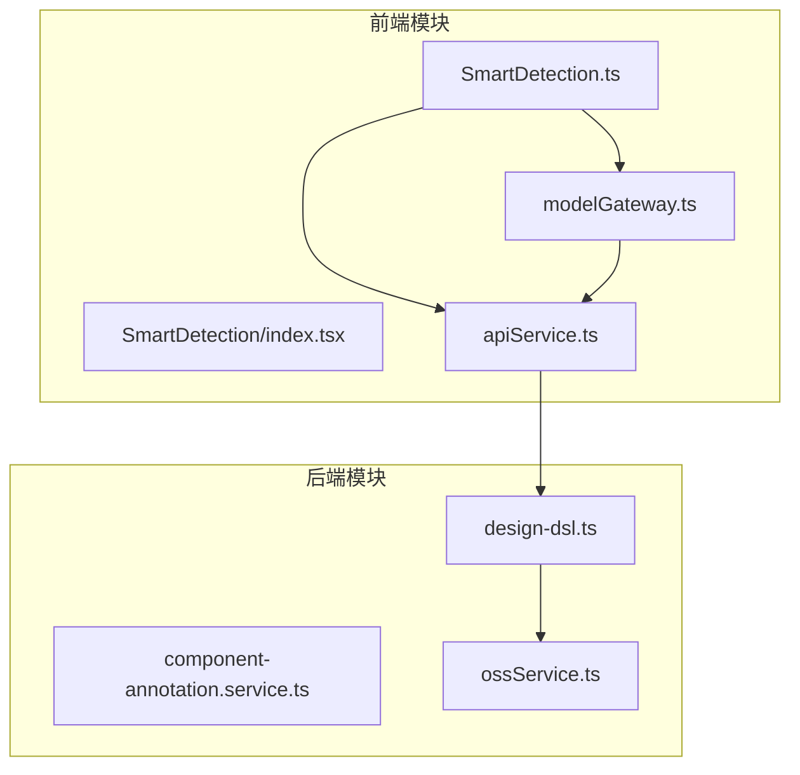
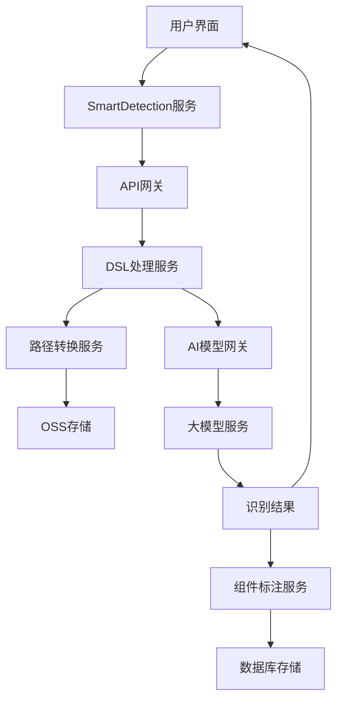
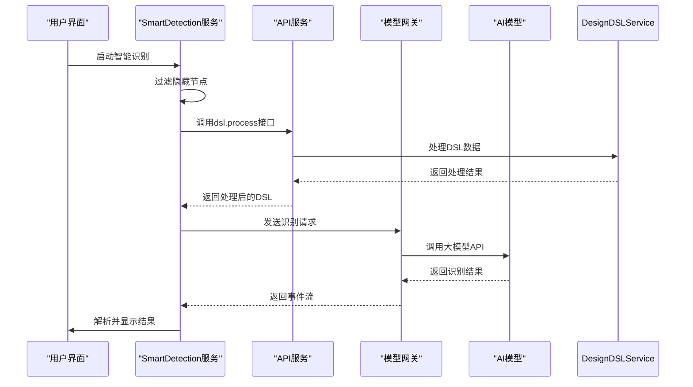
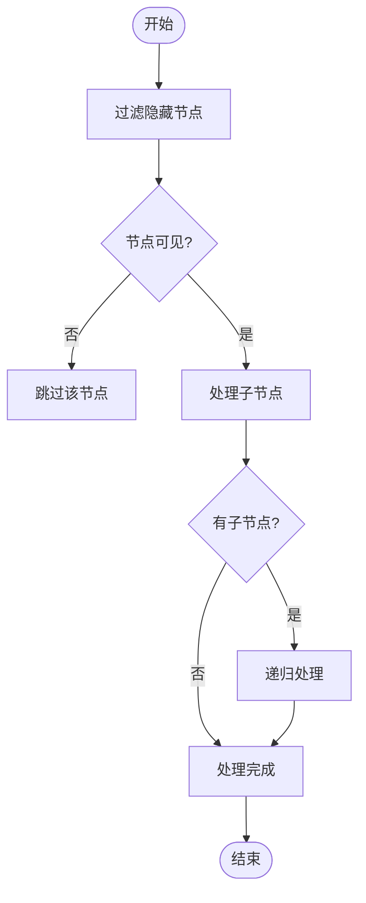
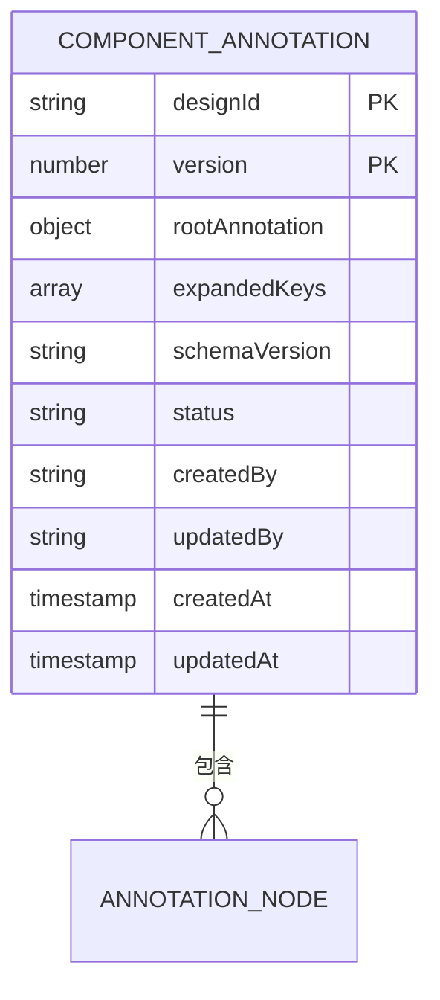
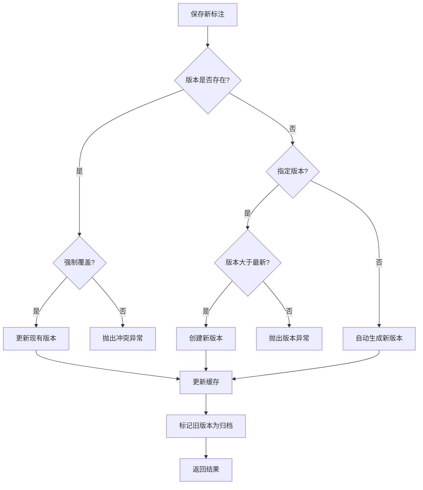
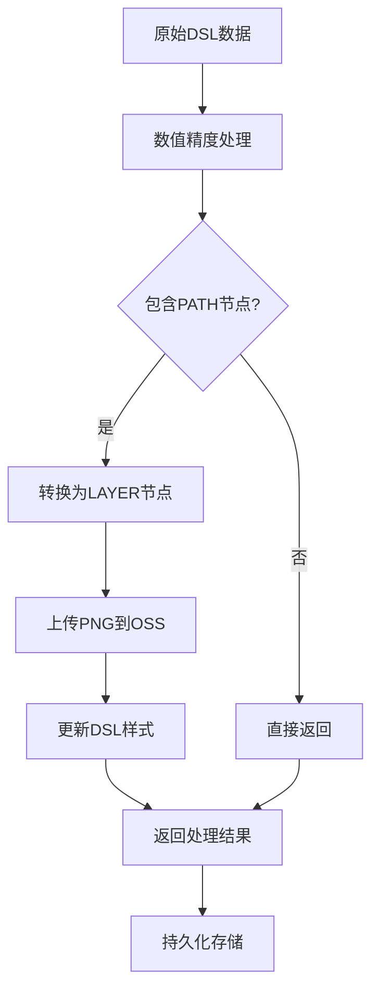
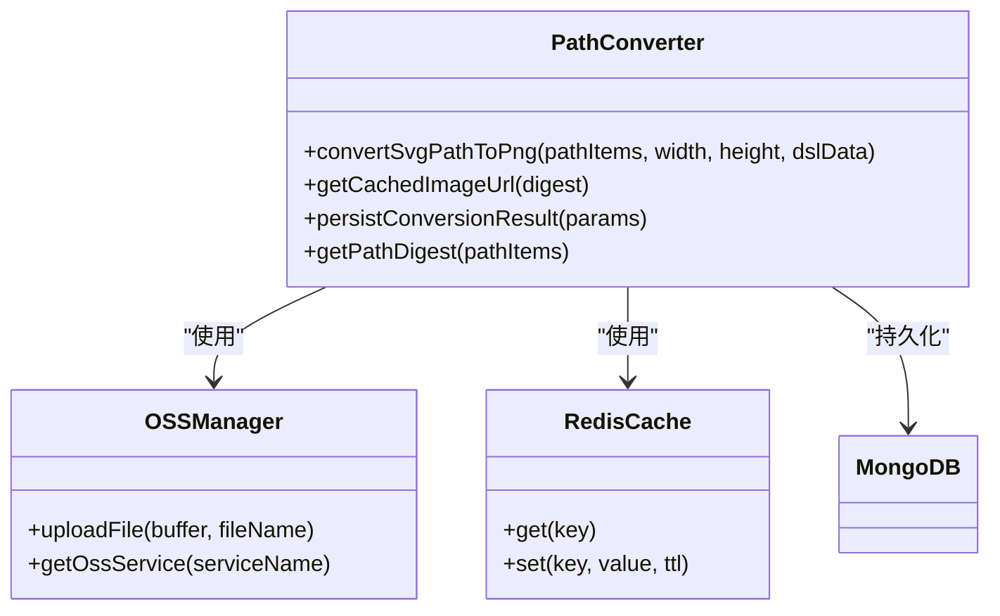
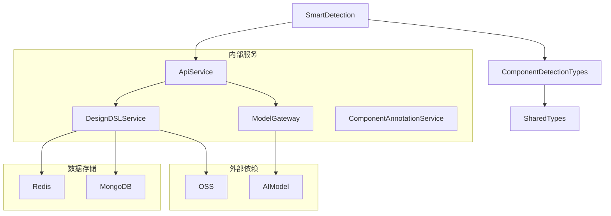

# 智能识别

<cite>
**本文档引用的文件**  
- [SmartDetection.ts](file://fta-layout-design/src/pages/EditorPage/services/SmartDetection.ts)
- [component-annotation.service.ts](file://code-agent-backend/src/service/design/component-annotation.service.ts)
- [design-dsl.ts](file://code-agent-backend/src/service/code-agent/design-dsl.ts)
- [apiService.ts](file://fta-layout-design/src/utils/apiService.ts)
- [componentDetection.ts](file://fta-layout-design/src/pages/EditorPage/types/componentDetection.ts)
- [annotation.ts](file://shared-types/src/annotation.ts)
- [dsl.ts](file://shared-types/src/dsl.ts)
- [index.tsx](file://fta-layout-design/src/pages/EditorPage/components/SmartDetection/index.tsx)
</cite>

## 目录
1. [简介](#简介)
2. [项目结构](#项目结构)
3. [核心组件](#核心组件)
4. [架构概述](#架构概述)
5. [详细组件分析](#详细组件分析)
6. [依赖分析](#依赖分析)
7. [性能考虑](#性能考虑)
8. [故障排除指南](#故障排除指南)
9. [结论](#结论)

## 简介
本文档详细阐述了智能组件识别功能的实现机制，重点介绍SmartDetection服务如何通过AI算法分析设计稿DSL并自动识别UI组件。文档将深入解析检测流程的三个阶段：预处理、特征提取和分类匹配，并说明识别结果如何转换为标准的AnnotationNode结构，以及与原始DSL节点的映射关系。同时为初学者提供识别准确率优化建议，为高级开发者解析组件特征向量的计算方式和模型训练数据来源。

## 项目结构
智能组件识别功能主要分布在前端和后端两个模块中。前端部分位于`fta-layout-design`项目中，负责用户交互和调用后端服务；后端部分位于`code-agent-backend`项目中，负责核心的DSL处理和AI模型调用。

**图表来源**  
- [SmartDetection.ts](file://fta-layout-design/src/pages/EditorPage/services/SmartDetection.ts)
- [design-dsl.ts](file://code-agent-backend/src/service/code-agent/design-dsl.ts)
- [apiService.ts](file://fta-layout-design/src/utils/apiService.ts)

**章节来源**  
- [SmartDetection.ts](file://fta-layout-design/src/pages/EditorPage/services/SmartDetection.ts)
- [design-dsl.ts](file://code-agent-backend/src/service/code-agent/design-dsl.ts)

## 核心组件
智能识别功能的核心组件包括SmartDetection服务、组件标注服务和DSL处理服务。这些组件协同工作，完成从设计稿到可识别组件的转换过程。

**章节来源**  
- [SmartDetection.ts](file://fta-layout-design/src/pages/EditorPage/services/SmartDetection.ts)
- [component-annotation.service.ts](file://code-agent-backend/src/service/design/component-annotation.service.ts)
- [design-dsl.ts](file://code-agent-backend/src/service/code-agent/design-dsl.ts)

## 架构概述
智能识别系统的架构分为前端交互层、API网关层和后端处理层。前端负责用户操作和结果显示，API网关负责请求转发和流式响应处理，后端负责DSL解析、路径转换和AI模型调用。

**图表来源**  
- [SmartDetection.ts](file://fta-layout-design/src/pages/EditorPage/services/SmartDetection.ts)
- [design-dsl.ts](file://code-agent-backend/src/service/code-agent/design-dsl.ts)
- [component-annotation.service.ts](file://code-agent-backend/src/service/design/component-annotation.service.ts)

## 详细组件分析

### SmartDetection服务分析
SmartDetection服务是智能识别功能的核心，负责协调整个识别流程。该服务首先对DSL数据进行预处理，过滤隐藏节点，然后通过API网关调用AI模型进行组件识别。

#### 服务调用流程

**图表来源**  
- [SmartDetection.ts](file://fta-layout-design/src/pages/EditorPage/services/SmartDetection.ts)
- [apiService.ts](file://fta-layout-design/src/utils/apiService.ts)

#### 预处理逻辑

**图表来源**  
- [SmartDetection.ts](file://fta-layout-design/src/pages/EditorPage/services/SmartDetection.ts)
- [nodeUtils.ts](file://fta-layout-design/src/pages/EditorPage/utils/nodeUtils.ts)

**章节来源**  
- [SmartDetection.ts](file://fta-layout-design/src/pages/EditorPage/services/SmartDetection.ts)

### 组件标注服务分析
组件标注服务负责管理识别结果的持久化存储和版本控制。该服务使用MongoDB存储标注数据，并通过Redis进行缓存以提高访问性能。

#### 标注数据结构

**图表来源**  
- [component-annotation.service.ts](file://code-agent-backend/src/service/design/component-annotation.service.ts)
- [component-annotation.ts](file://code-agent-backend/src/entity/design/component-annotation.ts)

#### 版本控制流程

**图表来源**  
- [component-annotation.service.ts](file://code-agent-backend/src/service/design/component-annotation.service.ts)

**章节来源**  
- [component-annotation.service.ts](file://code-agent-backend/src/service/design/component-annotation.service.ts)

### DSL处理服务分析
DSL处理服务负责将设计稿的DSL数据转换为适合AI模型处理的格式，并处理路径节点到图层的转换。

#### DSL处理流程

**图表来源**  
- [design-dsl.ts](file://code-agent-backend/src/service/code-agent/design-dsl.ts)

#### 路径转换机制

**图表来源**  
- [design-dsl.ts](file://code-agent-backend/src/service/code-agent/design-dsl.ts)
- [ossService.ts](file://code-agent-backend/src/service/oss/ossService.ts)

**章节来源**  
- [design-dsl.ts](file://code-agent-backend/src/service/code-agent/design-dsl.ts)

## 依赖分析
智能识别功能依赖多个核心服务和外部系统，这些依赖关系确保了功能的完整性和可靠性。

**图表来源**  
- [package.json](file://code-agent-backend/package.json)
- [package.json](file://fta-layout-design/package.json)

**章节来源**  
- [SmartDetection.ts](file://fta-layout-design/src/pages/EditorPage/services/SmartDetection.ts)
- [design-dsl.ts](file://code-agent-backend/src/service/code-agent/design-dsl.ts)

## 性能考虑
智能识别功能在设计时考虑了多个性能优化点，包括缓存策略、异步处理和资源优化。

1. **缓存策略**：使用Redis缓存频繁访问的DSL转换结果和组件标注数据，减少数据库查询和重复计算。
2. **异步处理**：采用流式响应处理AI模型的识别结果，避免长时间等待和内存占用。
3. **资源优化**：将复杂的SVG路径转换为PNG图片并存储在OSS中，减少前端渲染负担。
4. **批量操作**：对数据库操作进行批量处理，减少网络往返次数。

**章节来源**  
- [design-dsl.ts](file://code-agent-backend/src/service/code-agent/design-dsl.ts)
- [component-annotation.service.ts](file://code-agent-backend/src/service/design/component-annotation.service.ts)

## 故障排除指南
当智能识别功能出现问题时，可以按照以下步骤进行排查：

1. **检查网络连接**：确保前端能够正常访问后端API服务。
2. **验证DSL数据**：确认上传的设计稿DSL数据格式正确且不为空。
3. **检查AI模型状态**：确认AI模型服务正常运行且能够响应请求。
4. **查看日志信息**：检查后端服务日志，查找可能的错误信息。
5. **验证缓存状态**：检查Redis缓存是否正常工作，必要时可以清除相关缓存。

**章节来源**  
- [SmartDetection.ts](file://fta-layout-design/src/pages/EditorPage/services/SmartDetection.ts)
- [apiService.ts](file://fta-layout-design/src/utils/apiService.ts)

## 结论
智能组件识别功能通过整合前端交互、后端处理和AI模型调用，实现了从设计稿到可识别UI组件的自动化转换。该功能采用模块化设计，各组件职责清晰，便于维护和扩展。通过合理的缓存策略和异步处理机制，确保了系统的高性能和可靠性。未来可以进一步优化AI模型的识别准确率，并增加更多类型的组件识别支持。