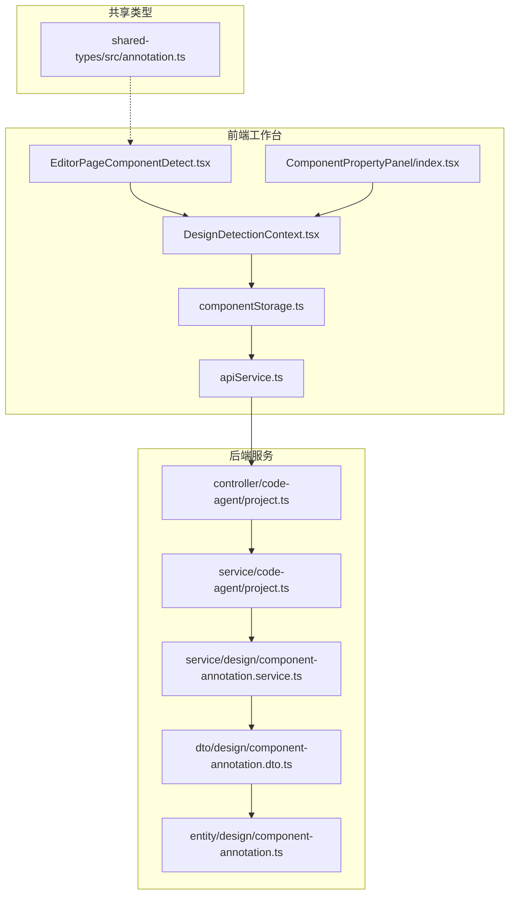
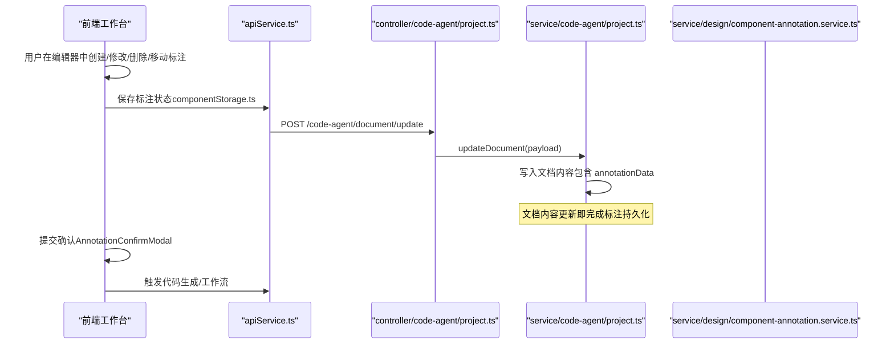
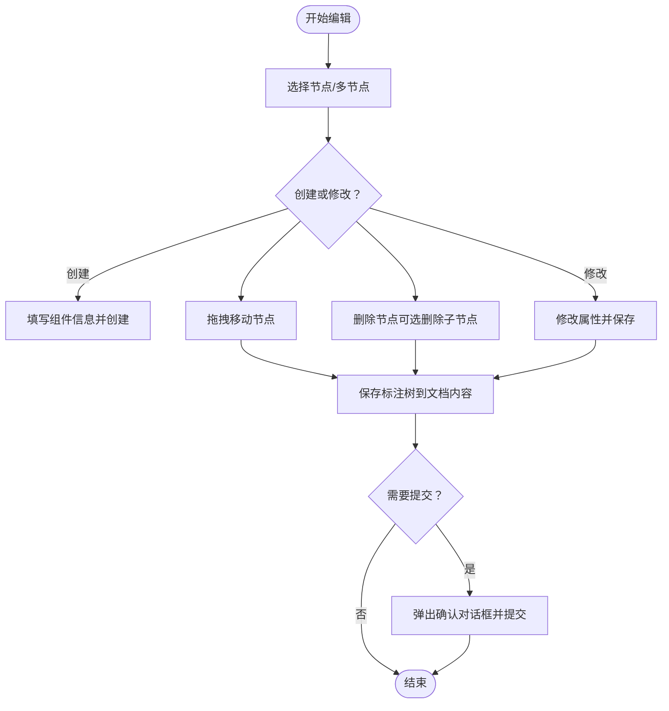
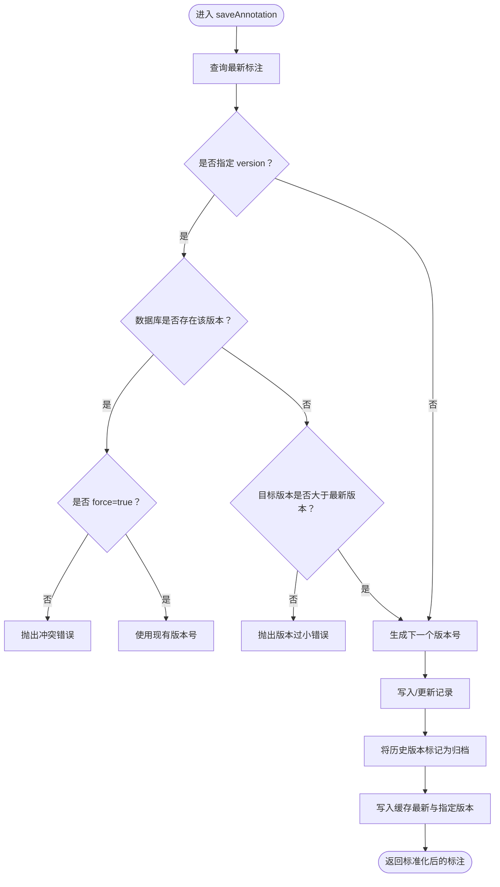
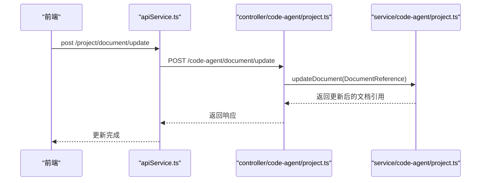
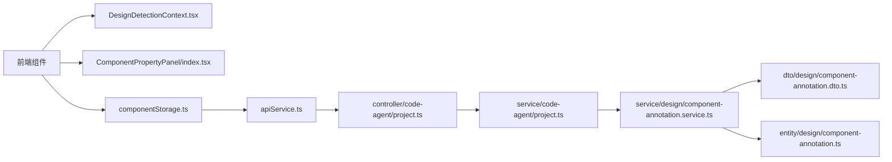

# 标注编辑

<cite>
**本文引用的文件**
- [component-annotation.service.ts](file://code-agent-backend/src/service/design/component-annotation.service.ts)
- [component-annotation.dto.ts](file://code-agent-backend/src/dto/design/component-annotation.dto.ts)
- [component-annotation.entity.ts](file://code-agent-backend/src/entity/design/component-annotation.ts)
- [design-dsl.ts](file://code-agent-backend/src/types/design-dsl.ts)
- [annotation.ts](file://shared-types/src/annotation.ts)
- [EditorPageComponentDetect.tsx](file://fta-layout-design/src/pages/EditorPage/EditorPageComponentDetect.tsx)
- [DesignDetectionContext.tsx](file://fta-layout-design/src/pages/EditorPage/contexts/DesignDetectionContext.tsx)
- [ComponentPropertyPanel/index.tsx](file://fta-layout-design/src/pages/EditorPage/components/ComponentPropertyPanel/index.tsx)
- [componentStorage.ts](file://fta-layout-design/src/pages/EditorPage/utils/componentStorage.ts)
- [apiService.ts](file://fta-layout-design/src/utils/apiService.ts)
- [project.ts](file://code-agent-backend/src/controller/code-agent/project.ts)
- [project.service.ts](file://code-agent-backend/src/service/code-agent/project.ts)
</cite>

## 目录
1. [简介](#简介)
2. [项目结构](#项目结构)
3. [核心组件](#核心组件)
4. [架构总览](#架构总览)
5. [详细组件分析](#详细组件分析)
6. [依赖关系分析](#依赖关系分析)
7. [性能考量](#性能考量)
8. [故障排查指南](#故障排查指南)
9. [结论](#结论)
10. [附录](#附录)

## 简介
本文件围绕“标注编辑”能力，系统性阐述前端工作台的标注交互界面与后端服务的数据处理逻辑。重点覆盖以下方面：
- 前端工作台的标注编辑交互（创建、修改、删除、移动、确认等），以及与后端的协同流程
- 后端服务中 ComponentAnnotationService 的事务处理流程，包括版本冲突检测与数据一致性校验
- DTO 层对标注数据的验证规则（如 expandedKeys 格式要求）与安全过滤机制
- 面向初学者的分步操作指南与面向高级用户的批量编辑 API 使用示例及性能优化建议
- 实际应用场景下的分页加载策略与实时协作编辑的冲突解决机制

## 项目结构
标注编辑涉及前后端多模块协作：
- 前端工作台（fta-layout-design）：负责可视化标注编辑、节点属性编辑、保存与提交确认
- 后端服务（code-agent-backend）：负责标注数据的持久化、版本控制、差异计算与缓存
- 共享类型（shared-types）：定义标注节点与快照的数据结构
- 文档内容接口（project.ts 控制器与 project.service.ts 服务）：承载文档内容的读写，标注数据作为文档内容的一部分被更新

图表来源
- [EditorPageComponentDetect.tsx](file://fta-layout-design/src/pages/EditorPage/EditorPageComponentDetect.tsx#L1-L645)
- [DesignDetectionContext.tsx](file://fta-layout-design/src/pages/EditorPage/contexts/DesignDetectionContext.tsx#L1-L200)
- [ComponentPropertyPanel/index.tsx](file://fta-layout-design/src/pages/EditorPage/components/ComponentPropertyPanel/index.tsx#L116-L200)
- [componentStorage.ts](file://fta-layout-design/src/pages/EditorPage/utils/componentStorage.ts#L1-L30)
- [apiService.ts](file://fta-layout-design/src/utils/apiService.ts#L522-L565)
- [project.ts](file://code-agent-backend/src/controller/code-agent/project.ts#L200-L255)
- [project.service.ts](file://code-agent-backend/src/service/code-agent/project.ts#L627-L645)
- [component-annotation.service.ts](file://code-agent-backend/src/service/design/component-annotation.service.ts#L1-L264)
- [component-annotation.dto.ts](file://code-agent-backend/src/dto/design/component-annotation.dto.ts#L1-L93)
- [component-annotation.entity.ts](file://code-agent-backend/src/entity/design/component-annotation.ts#L1-L73)
- [annotation.ts](file://shared-types/src/annotation.ts#L1-L25)

章节来源
- [EditorPageComponentDetect.tsx](file://fta-layout-design/src/pages/EditorPage/EditorPageComponentDetect.tsx#L1-L645)
- [DesignDetectionContext.tsx](file://fta-layout-design/src/pages/EditorPage/contexts/DesignDetectionContext.tsx#L1-L200)
- [component-annotation.service.ts](file://code-agent-backend/src/service/design/component-annotation.service.ts#L1-L264)
- [component-annotation.dto.ts](file://code-agent-backend/src/dto/design/component-annotation.dto.ts#L1-L93)
- [component-annotation.entity.ts](file://code-agent-backend/src/entity/design/component-annotation.ts#L1-L73)
- [annotation.ts](file://shared-types/src/annotation.ts#L1-L25)

## 核心组件
- 前端标注编辑器
  - 编辑器页面与工具栏：提供智能识别、3D 检视、缩放、边框显示等能力
  - 标注树与属性面板：支持创建、修改、删除、移动标注节点，并即时保存
  - 确认提交：在提交前弹出确认对话框，确保标注数据稳定后再触发后续流程
- 后端标注服务
  - 版本控制与一致性：基于版本号与最新状态的约束，避免并发覆盖
  - 缓存与归档：最新版本写入缓存，历史版本标记归档
  - 差异计算：按节点 ID 对比两版本标注树，输出新增/更新/删除的变更集
- 数据模型与类型
  - AnnotationNode：标注节点结构（含 id、ftaComponent、props、children 等）
  - AnnotationSnapshot：标注快照（包含 rootAnnotation、savedAt、version）

章节来源
- [EditorPageComponentDetect.tsx](file://fta-layout-design/src/pages/EditorPage/EditorPageComponentDetect.tsx#L440-L520)
- [ComponentPropertyPanel/index.tsx](file://fta-layout-design/src/pages/EditorPage/components/ComponentPropertyPanel/index.tsx#L116-L200)
- [DesignDetectionContext.tsx](file://fta-layout-design/src/pages/EditorPage/contexts/DesignDetectionContext.tsx#L593-L1231)
- [component-annotation.service.ts](file://code-agent-backend/src/service/design/component-annotation.service.ts#L108-L186)
- [component-annotation.dto.ts](file://code-agent-backend/src/dto/design/component-annotation.dto.ts#L1-L93)
- [annotation.ts](file://shared-types/src/annotation.ts#L1-L25)

## 架构总览
从前端到后端的标注编辑主流程如下：

图表来源
- [componentStorage.ts](file://fta-layout-design/src/pages/EditorPage/utils/componentStorage.ts#L1-L30)
- [apiService.ts](file://fta-layout-design/src/utils/apiService.ts#L522-L565)
- [project.ts](file://code-agent-backend/src/controller/code-agent/project.ts#L231-L239)
- [project.service.ts](file://code-agent-backend/src/service/code-agent/project.ts#L627-L645)

## 详细组件分析

### 前端标注编辑交互
- 创建标注
  - 单节点：在属性面板填写组件类型、名称、注释、属性等，点击创建，服务端保存
  - 多节点：合并选择的 DSL 节点为组合标注
- 修改标注
  - 在属性面板修改组件类型、名称、注释、属性（支持 JSON 校验与数据模型绑定）
- 删除标注
  - 支持删除当前节点或同时删除所有子节点，删除后自动提升子节点层级
- 移动标注
  - 支持拖拽到目标节点前/内/后三种位置，内部实现通过克隆树、移除原位置节点、插入到目标位置
- 保存与提交
  - 保存：将当前标注树写入文档内容
  - 提交：弹出确认对话框，确认后触发后续流程（如代码生成）

图表来源
- [ComponentPropertyPanel/index.tsx](file://fta-layout-design/src/pages/EditorPage/components/ComponentPropertyPanel/index.tsx#L116-L200)
- [DesignDetectionContext.tsx](file://fta-layout-design/src/pages/EditorPage/contexts/DesignDetectionContext.tsx#L1142-L1231)
- [EditorPageComponentDetect.tsx](file://fta-layout-design/src/pages/EditorPage/EditorPageComponentDetect.tsx#L130-L148)

章节来源
- [ComponentPropertyPanel/index.tsx](file://fta-layout-design/src/pages/EditorPage/components/ComponentPropertyPanel/index.tsx#L116-L200)
- [DesignDetectionContext.tsx](file://fta-layout-design/src/pages/EditorPage/contexts/DesignDetectionContext.tsx#L1142-L1231)
- [EditorPageComponentDetect.tsx](file://fta-layout-design/src/pages/EditorPage/EditorPageComponentDetect.tsx#L130-L148)

### 后端服务：ComponentAnnotationService 事务处理与一致性
- 版本冲突检测与数据一致性
  - 若显式传入 version：
    - 若数据库中已存在该版本且未开启强制覆盖，则返回冲突错误
    - 若目标版本小于等于当前最新版本且未开启强制覆盖，则返回版本过小错误
  - 若未传入 version：
    - 自动生成下一个递增版本号
  - 无论新建还是更新，均以“最新版本”为基准进行一致性判断
- 数据写入与归档
  - 新建记录时，将其他历史版本标记为归档状态，确保同一设计稿只保留一个 active 状态的版本
- 缓存策略
  - 最新版本与指定版本均写入缓存，提高读取性能
- 差异计算
  - 将两版本的 rootAnnotation 展平为 Map，按节点 id 对比，输出新增/更新/删除的变更集

图表来源
- [component-annotation.service.ts](file://code-agent-backend/src/service/design/component-annotation.service.ts#L108-L186)

章节来源
- [component-annotation.service.ts](file://code-agent-backend/src/service/design/component-annotation.service.ts#L108-L186)

### DTO 层验证规则与安全过滤
- SaveDesignAnnotationBody
  - version：可选，自增版本号；缺省时由服务端生成
  - rootAnnotation：必填，标注根节点数据结构（对象）
  - expandedKeys：可选，展开的节点 ID 列表（字符串数组）
  - schemaVersion：可选，标注协议版本
  - force：可选，是否覆盖现有版本
- GetDesignAnnotationQuery
  - version：可选，指定版本号
- DiffDesignAnnotationQuery
  - fromVersion、toVersion：必填，旧/新版本号
- 安全与过滤
  - expandedKeys 必须为字符串数组，否则会被标准化为空数组
  - 时间戳 createdAt/updatedAt 统一序列化为 ISO 字符串
  - MongoDB ObjectId 转换为字符串，保证前端可直接消费

章节来源
- [component-annotation.dto.ts](file://code-agent-backend/src/dto/design/component-annotation.dto.ts#L1-L93)
- [component-annotation.entity.ts](file://code-agent-backend/src/entity/design/component-annotation.ts#L1-L73)
- [component-annotation.service.ts](file://code-agent-backend/src/service/design/component-annotation.service.ts#L38-L56)

### 数据模型与类型
- AnnotationNode
  - 关键字段：id、ftaComponent、isRoot、isMainPage、isContainer、children、props、createdAt、updatedAt 等
- AnnotationSnapshot
  - 关键字段：rootAnnotation、savedAt、version

章节来源
- [annotation.ts](file://shared-types/src/annotation.ts#L1-L25)

### API 与文档内容集成
- 前端通过 apiService 的 document.update 接口更新文档内容，其中包含 annotationData 字段
- 后端控制器 project.ts 的 /document/update 接口接收并调用 project.service.ts 的 updateDocument 方法
- 该方法更新文档内容并返回最新文档引用，标注数据随文档内容持久化

图表来源
- [apiService.ts](file://fta-layout-design/src/utils/apiService.ts#L558-L564)
- [project.ts](file://code-agent-backend/src/controller/code-agent/project.ts#L231-L239)
- [project.service.ts](file://code-agent-backend/src/service/code-agent/project.ts#L627-L645)

章节来源
- [apiService.ts](file://fta-layout-design/src/utils/apiService.ts#L558-L564)
- [project.ts](file://code-agent-backend/src/controller/code-agent/project.ts#L231-L239)
- [project.service.ts](file://code-agent-backend/src/service/code-agent/project.ts#L627-L645)

## 依赖关系分析
- 前端依赖
  - DesignDetectionContext.tsx 维护标注树与 DSL 节点映射，提供创建、修改、删除、移动等动作
  - ComponentPropertyPanel/index.tsx 负责属性表单校验与保存
  - componentStorage.ts 将标注树封装为 AnnotationSnapshot 并通过 apiService 更新文档
- 后端依赖
  - controller/code-agent/project.ts 作为入口，调用 service 层更新文档内容
  - service/code-agent/project.ts 负责文档内容的更新与返回
  - service/design/component-annotation.service.ts 提供版本控制、缓存与差异计算能力
  - entity/design/component-annotation.ts 定义标注实体结构
  - dto/design/component-annotation.dto.ts 定义输入/输出 DTO

图表来源
- [DesignDetectionContext.tsx](file://fta-layout-design/src/pages/EditorPage/contexts/DesignDetectionContext.tsx#L1-L200)
- [ComponentPropertyPanel/index.tsx](file://fta-layout-design/src/pages/EditorPage/components/ComponentPropertyPanel/index.tsx#L116-L200)
- [componentStorage.ts](file://fta-layout-design/src/pages/EditorPage/utils/componentStorage.ts#L1-L30)
- [apiService.ts](file://fta-layout-design/src/utils/apiService.ts#L522-L565)
- [project.ts](file://code-agent-backend/src/controller/code-agent/project.ts#L200-L255)
- [project.service.ts](file://code-agent-backend/src/service/code-agent/project.ts#L627-L645)
- [component-annotation.service.ts](file://code-agent-backend/src/service/design/component-annotation.service.ts#L1-L264)
- [component-annotation.dto.ts](file://code-agent-backend/src/dto/design/component-annotation.dto.ts#L1-L93)
- [component-annotation.entity.ts](file://code-agent-backend/src/entity/design/component-annotation.ts#L1-L73)

## 性能考量
- 缓存命中与 TTL
  - 最新版本与指定版本均写入缓存，降低重复查询成本
  - TTL 可配置，默认值为 30 分钟
- 版本归档
  - 新版本写入后，历史版本标记为归档，减少查询范围
- 差异计算
  - 通过展平标注树（DFS）构建 Map，对比 O(n) 级别，适合大体量标注树
- 前端渲染
  - 展开节点 expandedKeys 作为字符串数组，便于快速序列化与传输
- 批量编辑建议
  - 前端：尽量合并多次变更，减少多次保存请求
  - 后端：在高并发场景下，合理设置 force 与版本号，避免频繁冲突

章节来源
- [component-annotation.service.ts](file://code-agent-backend/src/service/design/component-annotation.service.ts#L58-L75)
- [component-annotation.service.ts](file://code-agent-backend/src/service/design/component-annotation.service.ts#L174-L186)
- [component-annotation.service.ts](file://code-agent-backend/src/service/design/component-annotation.service.ts#L218-L262)

## 故障排查指南
- 常见错误与定位
  - 版本冲突：当目标版本已存在且未开启强制覆盖时，服务端抛出冲突错误
  - 版本过小：当目标版本不大于当前最新版本且未开启强制覆盖时，服务端抛出版本过小错误
  - 版本无效：当 version 缺失或小于等于 0，服务端抛出无效版本错误
  - 版本不存在：差异计算时若旧/新版本缺失，服务端抛出未找到错误
- 前端常见问题
  - 属性 JSON 格式错误：属性面板在保存前对 props 进行 JSON 校验，格式不合法会提示错误
  - 删除根节点：根节点不可删除，删除操作会给出提示
  - 智能识别覆盖：重复识别会覆盖现有标注，注意确认提示
- 排查步骤
  - 检查 expandedKeys 是否为字符串数组
  - 检查 version 与 force 参数是否符合预期
  - 查看差异计算结果，定位具体节点变更
  - 核对缓存键与 TTL 配置，确认缓存是否生效

章节来源
- [component-annotation.service.ts](file://code-agent-backend/src/service/design/component-annotation.service.ts#L125-L143)
- [component-annotation.service.ts](file://code-agent-backend/src/service/design/component-annotation.service.ts#L218-L226)
- [ComponentPropertyPanel/index.tsx](file://fta-layout-design/src/pages/EditorPage/components/ComponentPropertyPanel/index.tsx#L120-L140)
- [EditorPageComponentDetect.tsx](file://fta-layout-design/src/pages/EditorPage/EditorPageComponentDetect.tsx#L320-L372)

## 结论
本方案通过“前端可视化编辑 + 后端版本控制与缓存”的组合，实现了高效、可靠的标注编辑能力。前端提供直观的创建、修改、删除与移动操作，后端通过严格的版本冲突检测与归档策略保障数据一致性，并通过缓存与差异计算提升性能。对于大规模标注数据与实时协作场景，建议结合分页加载与版本合并策略，进一步优化用户体验与系统稳定性。

## 附录

### 初学者操作指南（分步）
- 打开编辑器页面，选择设计文档
- 在左侧图层树中选择目标 DSL 节点
- 在右侧属性面板填写组件类型、名称、注释与属性（支持 JSON）
- 点击“保存”，确认保存成功
- 如需批量创建，可在多选状态下合并为组合标注
- 如需删除，选择节点后点击删除（可选同时删除子节点）
- 如需移动，拖拽节点到目标位置（前/内/后）
- 确认无误后，点击“提交”，进入后续流程

章节来源
- [EditorPageComponentDetect.tsx](file://fta-layout-design/src/pages/EditorPage/EditorPageComponentDetect.tsx#L440-L520)
- [ComponentPropertyPanel/index.tsx](file://fta-layout-design/src/pages/EditorPage/components/ComponentPropertyPanel/index.tsx#L294-L333)
- [DesignDetectionContext.tsx](file://fta-layout-design/src/pages/EditorPage/contexts/DesignDetectionContext.tsx#L1142-L1231)

### 高级用户：批量编辑 API 与优化建议
- 批量编辑 API
  - 前端通过 apiService 的 document.update 接口批量更新文档内容（包含 annotationData）
  - 后端控制器 project.ts 的 /document/update 接口统一处理
- 性能优化建议
  - 合并多次变更，减少请求次数
  - 合理使用 force 与 version，避免频繁冲突
  - 利用缓存与归档策略，降低查询与写入压力
  - 对差异计算进行节流与去抖，避免高频对比

章节来源
- [apiService.ts](file://fta-layout-design/src/utils/apiService.ts#L558-L564)
- [project.ts](file://code-agent-backend/src/controller/code-agent/project.ts#L231-L239)
- [project.service.ts](file://code-agent-backend/src/service/code-agent/project.ts#L627-L645)
- [component-annotation.service.ts](file://code-agent-backend/src/service/design/component-annotation.service.ts#L174-L186)

### 实际应用场景与策略
- 大规模标注数据的分页加载策略
  - 前端：按需加载标注树节点，仅在展开时请求对应子树
  - 后端：提供分页查询接口（如按节点 ID 范围或层级深度），避免一次性返回整棵大树
- 实时协作编辑的冲突解决机制
  - 前端：在保存前进行本地校验（如 expandedKeys 格式、属性 JSON 校验）
  - 后端：严格版本控制与冲突检测，必要时提示用户合并或回滚
  - 缓存：利用最新版本缓存减少读取延迟，归档历史版本降低写入竞争

章节来源
- [component-annotation.dto.ts](file://code-agent-backend/src/dto/design/component-annotation.dto.ts#L1-L93)
- [component-annotation.service.ts](file://code-agent-backend/src/service/design/component-annotation.service.ts#L58-L75)
- [component-annotation.service.ts](file://code-agent-backend/src/service/design/component-annotation.service.ts#L174-L186)