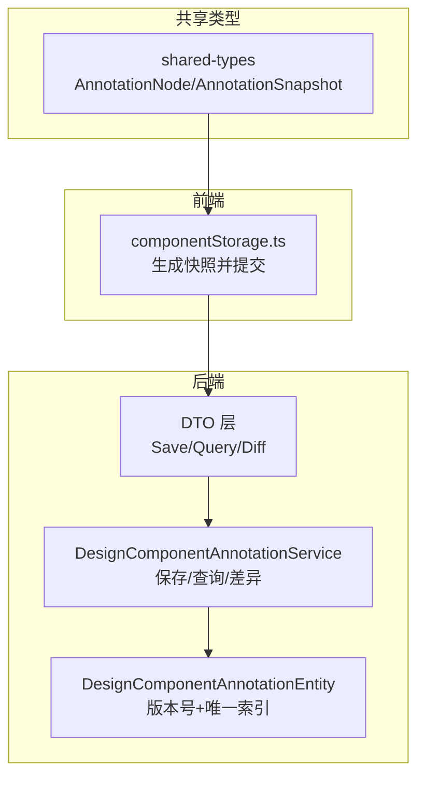
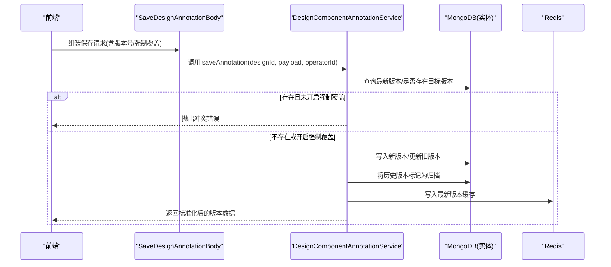
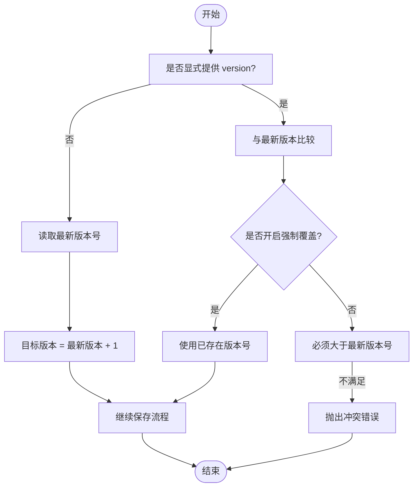
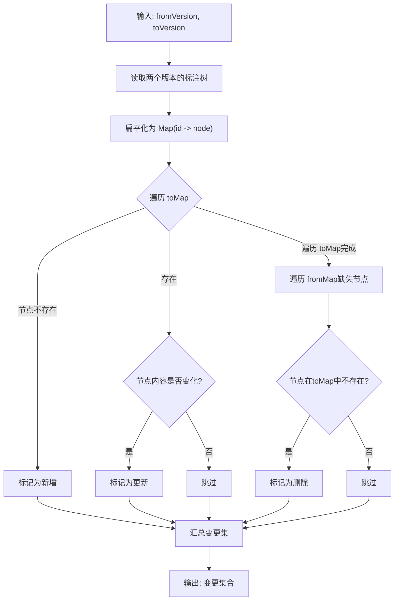
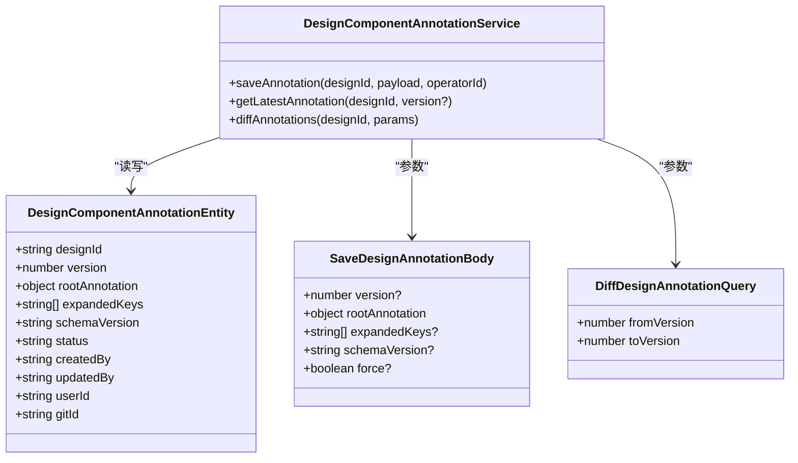

# 版本管理

<cite>
**本文引用的文件**
- [component-annotation.service.ts](file://code-agent-backend/src/service/design/component-annotation.service.ts)
- [component-annotation.ts](file://code-agent-backend/src/entity/design/component-annotation.ts)
- [component-annotation.dto.ts](file://code-agent-backend/src/dto/design/component-annotation.dto.ts)
- [annotation.ts](file://shared-types/src/annotation.ts)
- [componentStorage.ts](file://fta-layout-design/src/pages/EditorPage/utils/componentStorage.ts)
</cite>

## 目录
1. [简介](#简介)
2. [项目结构](#项目结构)
3. [核心组件](#核心组件)
4. [架构总览](#架构总览)
5. [详细组件分析](#详细组件分析)
6. [依赖关系分析](#依赖关系分析)
7. [性能与可扩展性](#性能与可扩展性)
8. [故障排查指南](#故障排查指南)
9. [结论](#结论)
10. [附录](#附录)

## 简介
本篇文档围绕“基于版本号的标注数据管理”进行系统化说明，重点解析以下方面：
- DesignComponentAnnotationEntity 实体类中 version 字段的自增策略与唯一索引设计原理
- saveAnnotation 方法在 force 覆盖与版本冲突场景下的处理逻辑
- 版本历史的存储结构与查询接口的实现思路
- 面向初学者的版本回滚操作指南
- 高级开发者的版本差异比较算法与增量更新机制
- 实际应用场景：版本快照支持 A/B 测试、版本数据的归档与清理策略

## 项目结构
与版本管理直接相关的核心模块位于后端服务层与实体层：
- 服务层：DesignComponentAnnotationService 提供保存、查询、差异比较等能力
- 实体层：DesignComponentAnnotationEntity 定义版本号字段与唯一索引
- DTO 层：SaveDesignAnnotationBody、DiffDesignAnnotationQuery 等定义请求与响应结构
- 类型层：shared-types 中的 AnnotationNode、AnnotationSnapshot 描述标注树与快照结构
- 前端集成：fta-layout-design 的 componentStorage.ts 将前端标注树转换为快照并提交到后端

图表来源
- [component-annotation.service.ts](file://code-agent-backend/src/service/design/component-annotation.service.ts#L108-L262)
- [component-annotation.ts](file://code-agent-backend/src/entity/design/component-annotation.ts#L16-L16)
- [component-annotation.dto.ts](file://code-agent-backend/src/dto/design/component-annotation.dto.ts#L6-L41)
- [annotation.ts](file://shared-types/src/annotation.ts#L1-L24)
- [componentStorage.ts](file://fta-layout-design/src/pages/EditorPage/utils/componentStorage.ts#L1-L30)

章节来源
- [component-annotation.service.ts](file://code-agent-backend/src/service/design/component-annotation.service.ts#L108-L262)
- [component-annotation.ts](file://code-agent-backend/src/entity/design/component-annotation.ts#L16-L16)
- [component-annotation.dto.ts](file://code-agent-backend/src/dto/design/component-annotation.dto.ts#L6-L41)
- [annotation.ts](file://shared-types/src/annotation.ts#L1-L24)
- [componentStorage.ts](file://fta-layout-design/src/pages/EditorPage/utils/componentStorage.ts#L1-L30)

## 核心组件
- DesignComponentAnnotationEntity
  - version 字段用于标识版本号，配合唯一索引保证 designId+version 的全局唯一性
  - status 字段用于区分“活跃版本”与“归档版本”，便于查询最新版本与历史版本
- DesignComponentAnnotationService
  - saveAnnotation：负责版本号生成、冲突校验、强制覆盖、历史归档与缓存写入
  - getLatestAnnotation：从数据库或缓存读取指定版本或最新活跃版本
  - diffAnnotations：对两个版本的标注树进行差异比较
- DTO
  - SaveDesignAnnotationBody：定义版本号、标注树、展开节点、协议版本、强制覆盖等字段
  - DiffDesignAnnotationQuery：定义差异比较的起止版本号
- 类型
  - AnnotationNode：标注树节点结构
  - AnnotationSnapshot：标注快照结构（含版本字符串）

章节来源
- [component-annotation.ts](file://code-agent-backend/src/entity/design/component-annotation.ts#L16-L72)
- [component-annotation.service.ts](file://code-agent-backend/src/service/design/component-annotation.service.ts#L108-L262)
- [component-annotation.dto.ts](file://code-agent-backend/src/dto/design/component-annotation.dto.ts#L6-L41)
- [annotation.ts](file://shared-types/src/annotation.ts#L1-L24)

## 架构总览
版本管理采用“数据库+Redis 缓存”的双层结构：
- 数据库存储所有版本记录，并通过唯一索引约束 designId+version
- Redis 缓存最近一次活跃版本与指定版本，提升读取性能
- 服务层在保存新版本时，将历史版本标记为归档，确保同一 designId 下仅有一个活跃版本

图表来源
- [component-annotation.service.ts](file://code-agent-backend/src/service/design/component-annotation.service.ts#L108-L186)
- [component-annotation.ts](file://code-agent-backend/src/entity/design/component-annotation.ts#L16-L72)

## 详细组件分析

### 1) 版本号自增策略与唯一索引设计
- 自增策略
  - 当未显式提供 version 时，服务端以“最新版本号+1”作为目标版本号
  - 若显式提供 version，则需满足“大于等于最新版本号”（除非开启强制覆盖）
- 唯一索引
  - 在 designId 与 version 上建立复合唯一索引，确保每个设计稿的版本号全局唯一
- 状态归档
  - 新版本激活后，历史版本统一标记为 archived，避免并发读取到过期数据

图表来源
- [component-annotation.service.ts](file://code-agent-backend/src/service/design/component-annotation.service.ts#L115-L143)
- [component-annotation.ts](file://code-agent-backend/src/entity/design/component-annotation.ts#L16-L16)

章节来源
- [component-annotation.service.ts](file://code-agent-backend/src/service/design/component-annotation.service.ts#L115-L143)
- [component-annotation.ts](file://code-agent-backend/src/entity/design/component-annotation.ts#L16-L16)

### 2) saveAnnotation 的冲突处理与强制覆盖
- 冲突判定
  - 显式版本已存在且未开启强制覆盖：返回冲突错误
  - 显式版本小于等于最新版本且未开启强制覆盖：返回冲突错误
- 强制覆盖
  - 开启 force=true 时，允许覆盖已存在版本或低于最新版本的目标版本
- 保存与归档
  - 新建版本：写入数据库并标记历史版本为归档
  - 更新版本：直接更新旧记录并重置状态为活跃
- 缓存写入
  - 将最新版本与指定版本写入 Redis 缓存，提升后续读取性能

章节来源
- [component-annotation.service.ts](file://code-agent-backend/src/service/design/component-annotation.service.ts#L115-L186)

### 3) 版本历史存储结构与查询
- 存储结构
  - 每个 designId 对应多条版本记录；通过 status 区分活跃与归档
  - version 字段为递增整数，配合唯一索引保证全局唯一
- 查询策略
  - getLatestAnnotation 支持两种模式：
    - 指定 version：直接按 designId+version 查询
    - 不指定 version：优先查询 status='active' 的最高版本，否则退回到最高版本
  - 缓存命中优先：先查 Redis，未命中再查数据库

章节来源
- [component-annotation.service.ts](file://code-agent-backend/src/service/design/component-annotation.service.ts#L188-L216)
- [component-annotation.ts](file://code-agent-backend/src/entity/design/component-annotation.ts#L43-L49)

### 4) 版本差异比较算法与增量更新机制
- 差异比较
  - 使用扁平化映射对比两版本的标注树，基于节点 id 进行比对
  - 变更类型包括新增、删除、更新（通过 JSON 序列化比较节点对象）
- 增量更新
  - 前端编辑器在本地维护标注树，保存时将完整快照提交至后端
  - 后端以“全量替换”方式写入新版本，同时归档历史版本
  - 如需更细粒度的增量更新，可在前端层面计算变更集并在后端应用

图表来源
- [component-annotation.service.ts](file://code-agent-backend/src/service/design/component-annotation.service.ts#L218-L262)

章节来源
- [component-annotation.service.ts](file://code-agent-backend/src/service/design/component-annotation.service.ts#L218-L262)

### 5) 版本回滚操作指南（面向初学者）
- 回滚步骤
  - 确认目标回滚版本号（fromVersion）
  - 读取该版本的标注树
  - 将该版本作为新版本提交（设置 version=目标版本号，force=true）
  - 提交成功后，历史版本被归档，目标版本成为新的活跃版本
- 注意事项
  - 回滚会创建一条新的版本记录，不会删除历史数据
  - 建议在回滚前备份当前活跃版本，以便二次恢复

章节来源
- [component-annotation.service.ts](file://code-agent-backend/src/service/design/component-annotation.service.ts#L115-L186)
- [component-annotation.dto.ts](file://code-agent-backend/src/dto/design/component-annotation.dto.ts#L6-L41)

### 6) 高级主题：版本差异比较与增量更新
- 差异比较
  - 基于节点 id 的全量对比，适合标注树规模适中的场景
  - 对于大规模树，可考虑分层对比或差分算法优化
- 增量更新
  - 前端计算变更集（新增/删除/更新），后端按变更集原子化更新
  - 与当前“全量替换”策略相比，增量更新能减少数据冗余与网络传输

章节来源
- [component-annotation.service.ts](file://code-agent-backend/src/service/design/component-annotation.service.ts#L218-L262)

### 7) 实际应用场景：版本快照与 A/B 测试
- 版本快照
  - 前端将标注树序列化为快照（包含版本字符串），提交到后端
  - 后端以版本号驱动的全量记录保存，便于后续回溯与对比
- A/B 测试
  - 通过不同版本号承载不同的标注策略，结合差异比较快速评估效果
  - 建议在测试期间保留多个活跃版本，便于快速切换与回滚

章节来源
- [componentStorage.ts](file://fta-layout-design/src/pages/EditorPage/utils/componentStorage.ts#L1-L30)
- [annotation.ts](file://shared-types/src/annotation.ts#L1-L24)

### 8) 版本数据的归档与清理策略
- 归档策略
  - 新版本激活后，历史版本统一标记为 archived，避免并发读取到过期数据
- 清理策略（建议）
  - 基于时间窗口：超过 N 天的历史版本自动归档或清理
  - 基于版本数量：保留最近 M 个版本，其余归档或清理
  - 基于业务规则：当某设计稿长期无更新时，自动归档或清理
- 执行方式
  - 定时任务扫描数据库，批量更新 status 或删除历史记录
  - 结合日志审计，确保清理操作可追溯

章节来源
- [component-annotation.service.ts](file://code-agent-backend/src/service/design/component-annotation.service.ts#L174-L176)
- [component-annotation.ts](file://code-agent-backend/src/entity/design/component-annotation.ts#L43-L49)

## 依赖关系分析
- 服务层依赖
  - Typegoose 实体模型：用于定义 schema、索引与属性
  - Redis 服务：用于缓存最新版本与指定版本
  - Midway HttpError：用于统一错误响应
- DTO 与类型
  - SaveDesignAnnotationBody 定义保存请求结构
  - DiffDesignAnnotationQuery 定义差异比较请求结构
  - AnnotationNode/AnnotationSnapshot 描述标注树与快照

图表来源
- [component-annotation.ts](file://code-agent-backend/src/entity/design/component-annotation.ts#L16-L72)
- [component-annotation.service.ts](file://code-agent-backend/src/service/design/component-annotation.service.ts#L108-L262)
- [component-annotation.dto.ts](file://code-agent-backend/src/dto/design/component-annotation.dto.ts#L6-L41)

章节来源
- [component-annotation.ts](file://code-agent-backend/src/entity/design/component-annotation.ts#L16-L72)
- [component-annotation.service.ts](file://code-agent-backend/src/service/design/component-annotation.service.ts#L108-L262)
- [component-annotation.dto.ts](file://code-agent-backend/src/dto/design/component-annotation.dto.ts#L6-L41)

## 性能与可扩展性
- 缓存命中率
  - getLatestAnnotation 优先从 Redis 读取，降低数据库压力
  - 缓存 TTL 可配置，默认 30 分钟
- 查询优化
  - 通过 designId+version 唯一索引，确保查询与插入高效
  - 读取最新版本时，优先查询 status='active'，减少排序成本
- 扩展建议
  - 对于超大标注树，可引入分页查询或增量对比
  - 增加版本压缩策略（如只保留关键版本）以节省存储空间

章节来源
- [component-annotation.service.ts](file://code-agent-backend/src/service/design/component-annotation.service.ts#L25-L36)
- [component-annotation.ts](file://code-agent-backend/src/entity/design/component-annotation.ts#L16-L16)

## 故障排查指南
- 常见错误
  - 版本冲突：显式版本已存在或小于等于最新版本且未开启强制覆盖
  - 版本无效：version 缺失或非正数
  - 版本不存在：差异比较或指定版本查询时找不到对应版本
- 排查步骤
  - 检查 saveAnnotation 请求中的 version 与 force 参数
  - 确认数据库中是否存在目标版本或最新版本
  - 查看 Redis 缓存键是否存在与 TTL 是否正确
- 建议
  - 在调用前先调用 getLatestAnnotation 获取最新版本，避免冲突
  - 对于批量回滚，建议先在测试环境验证差异比较结果

章节来源
- [component-annotation.service.ts](file://code-agent-backend/src/service/design/component-annotation.service.ts#L115-L143)
- [component-annotation.service.ts](file://code-agent-backend/src/service/design/component-annotation.service.ts#L218-L262)

## 结论
本方案通过“数据库唯一索引+Redis 缓存+状态归档”的组合，实现了稳定高效的版本化标注数据管理。服务层在保存时严格控制版本号生成与冲突处理，在查询时兼顾性能与一致性。对于高级场景，可进一步引入增量更新与版本压缩策略，以满足更大规模与更高性能的需求。

## 附录
- 关键路径参考
  - 保存版本：[saveAnnotation](file://code-agent-backend/src/service/design/component-annotation.service.ts#L108-L186)
  - 查询最新版本：[getLatestAnnotation](file://code-agent-backend/src/service/design/component-annotation.service.ts#L188-L216)
  - 差异比较：[diffAnnotations](file://code-agent-backend/src/service/design/component-annotation.service.ts#L218-L262)
  - 实体定义与唯一索引：[DesignComponentAnnotationEntity](file://code-agent-backend/src/entity/design/component-annotation.ts#L16-L16)
  - 请求/响应 DTO：[SaveDesignAnnotationBody](file://code-agent-backend/src/dto/design/component-annotation.dto.ts#L6-L41)，[DiffDesignAnnotationQuery](file://code-agent-backend/src/dto/design/component-annotation.dto.ts#L61-L67)
  - 前端快照生成：[componentStorage.ts](file://fta-layout-design/src/pages/EditorPage/utils/componentStorage.ts#L1-L30)
  - 标注树类型：[annotation.ts](file://shared-types/src/annotation.ts#L1-L24)