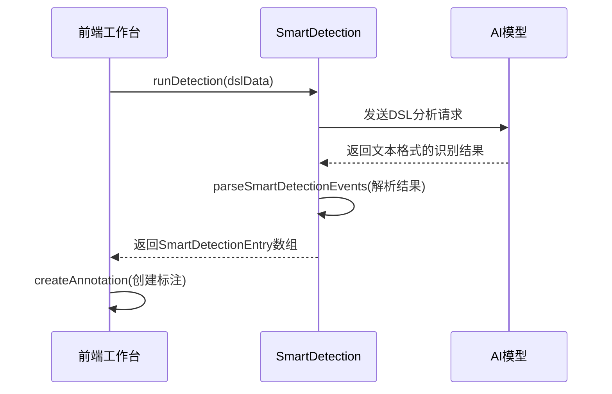
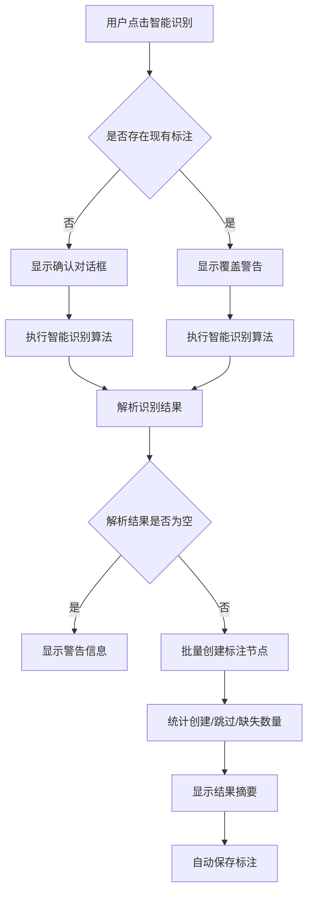
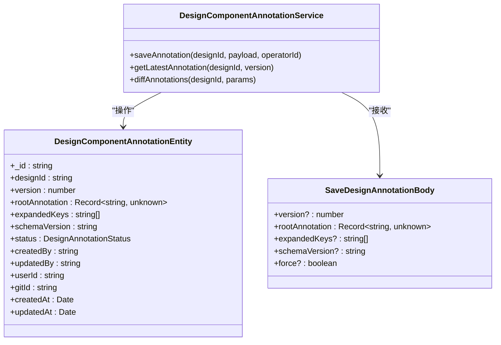
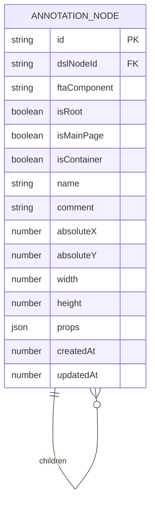
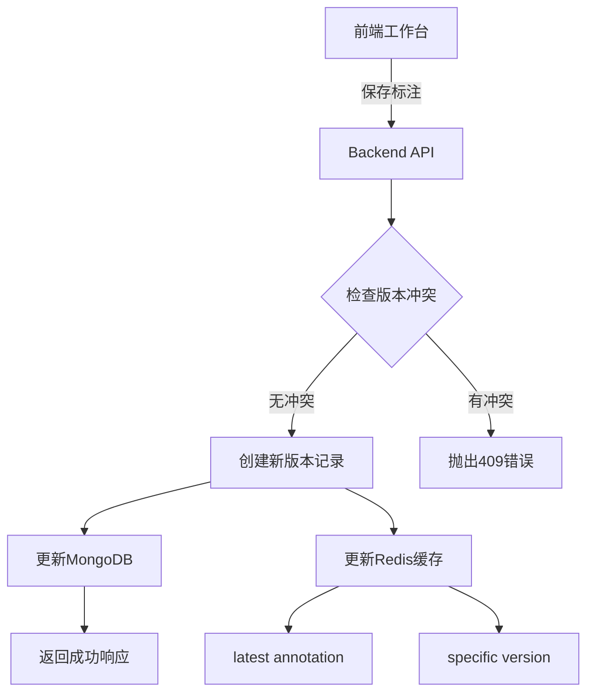
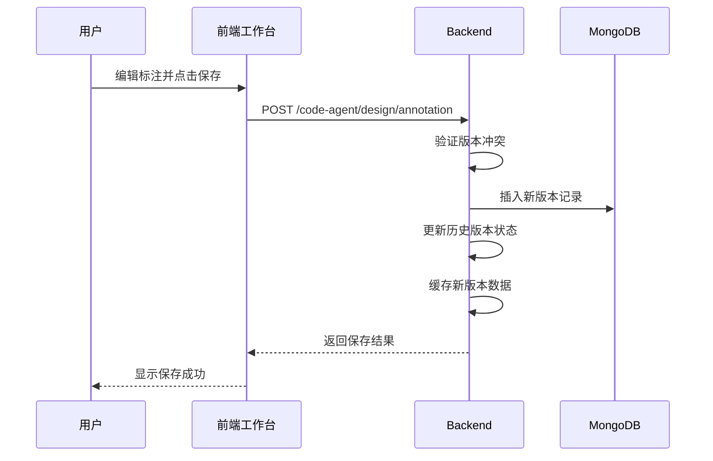
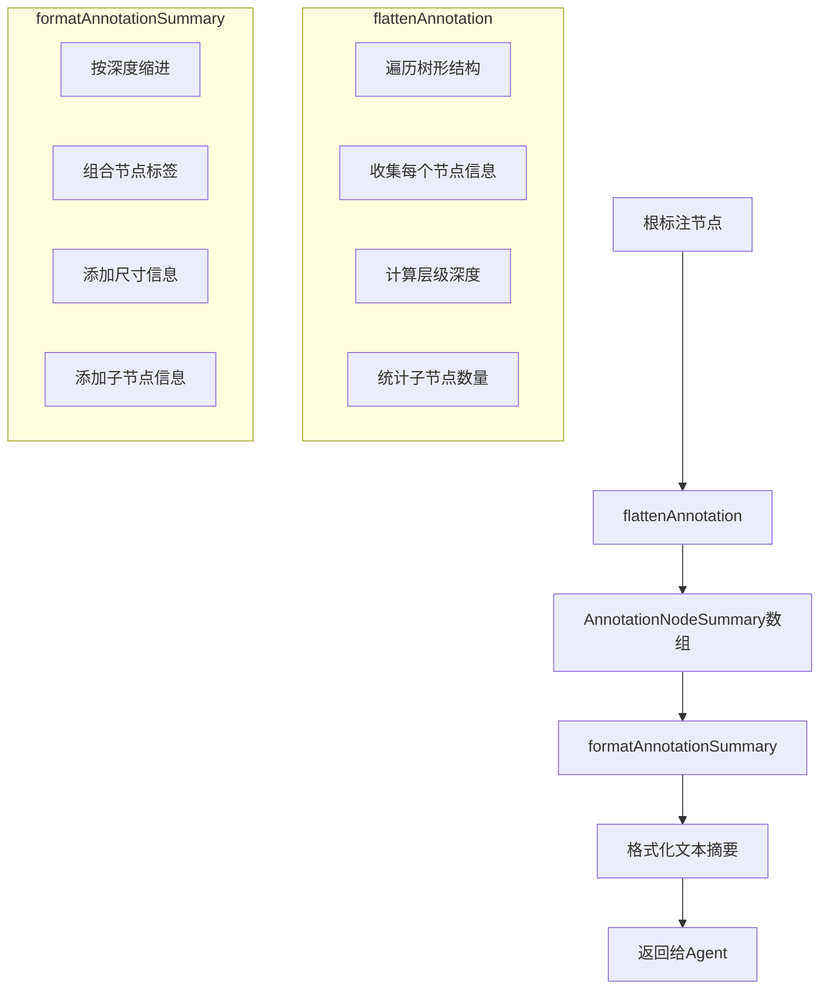

# 组件标注

<cite>
**本文档引用文件**   
- [component-annotation.service.ts](file://code-agent-backend/src/service/design/component-annotation.service.ts)
- [component-annotation.ts](file://code-agent-backend/src/entity/design/component-annotation.ts)
- [component-annotation.dto.ts](file://code-agent-backend/src/dto/design/component-annotation.dto.ts)
- [annotation.ts](file://shared-types/src/annotation.ts)
- [SmartDetection.ts](file://fta-layout-design/src/pages/EditorPage/services/SmartDetection.ts)
- [SmartDetection/index.tsx](file://fta-layout-design/src/pages/EditorPage/components/SmartDetection/index.tsx)
- [EditorPageComponentDetect.tsx](file://fta-layout-design/src/pages/EditorPage/EditorPageComponentDetect.tsx)
- [requirement-builder.ts](file://code-agent-backend/src/utils/design/requirement-builder.ts)
</cite>

## 目录
1. [简介](#简介)
2. [核心特性](#核心特性)
3. [智能组件识别](#智能组件识别)
4. [手动标注编辑](#手动标注编辑)
5. [标注版本管理](#标注版本管理)
6. [标注数据结构](#标注数据结构)
7. [存储与一致性](#存储与一致性)
8. [API接口与应用场景](#api接口与应用场景)
9. [技术细节](#技术细节)
10. [总结](#总结)

## 简介
组件标注功能是设计稿到代码生成流程中的核心环节，通过智能检测、手动编辑和版本管理三大特性，实现设计元素到可编程组件的精准映射。系统基于设计稿DSL（领域特定语言）数据，通过智能算法自动识别UI组件，并提供交互式工作台供用户进行精细化标注。标注数据作为Agent生成代码的关键输入，直接影响最终代码的质量和准确性。

## 核心特性
组件标注系统提供三大核心功能：通过SmartDetection算法实现智能组件识别，提供前端工作台支持手动标注编辑，以及基于MongoDB的标注版本管理机制。这三者协同工作，形成从自动识别到人工确认再到版本追溯的完整闭环。

## 智能组件识别
系统通过SmartDetection服务实现设计稿的智能解析。该服务接收设计稿的DSL数据，通过AI模型分析节点结构、样式和布局特征，自动推断出最可能的FTA组件类型。识别过程以事件流形式返回结果，前端组件通过`parseSmartDetectionEvents`函数解析这些事件，提取出节点ID、组件类型和业务名称等关键信息。

**Diagram sources**
- [SmartDetection.ts](file://fta-layout-design/src/pages/EditorPage/services/SmartDetection.ts)
- [SmartDetection/index.tsx](file://fta-layout-design/src/pages/EditorPage/components/SmartDetection/index.tsx)

**Section sources**
- [SmartDetection/index.tsx](file://fta-layout-design/src/pages/EditorPage/components/SmartDetection/index.tsx#L207-L209)

## 手动标注编辑
前端工作台提供了直观的交互界面，用户可以在智能识别的基础上进行手动调整。通过"智能识别"按钮触发自动标注，系统会显示加载动画和识别进度。用户可以查看识别结果，对错误的组件映射进行修改，添加组件名称和备注信息。所有编辑操作实时反映在标注树结构中，并可通过"保存"按钮持久化到后端。

**Diagram sources**
- [EditorPageComponentDetect.tsx](file://fta-layout-design/src/pages/EditorPage/EditorPageComponentDetect.tsx#L321-L372)
- [SmartDetection/index.tsx](file://fta-layout-design/src/pages/EditorPage/components/SmartDetection/index.tsx#L207-L255)

**Section sources**
- [EditorPageComponentDetect.tsx](file://fta-layout-design/src/pages/EditorPage/EditorPageComponentDetect.tsx#L320-L372)

## 标注版本管理
系统实现了完整的标注版本控制机制，确保标注数据的可追溯性和安全性。每次保存标注时，系统会自动生成递增的版本号，并将历史版本标记为"归档"状态。通过`saveAnnotation`方法，用户可以指定版本号进行保存，或由系统自动生成下一个版本。版本管理支持强制覆盖和冲突检测，防止意外的数据覆盖。

**Diagram sources**
- [component-annotation.service.ts](file://code-agent-backend/src/service/design/component-annotation.service.ts#L108-L185)
- [component-annotation.ts](file://code-agent-backend/src/entity/design/component-annotation.ts#L19-L72)

**Section sources**
- [component-annotation.service.ts](file://code-agent-backend/src/service/design/component-annotation.service.ts#L108-L185)

## 标注数据结构
标注数据采用树形结构组织，核心是`AnnotationNode`接口。每个节点包含组件ID、FTA组件类型、是否为根节点、容器属性、位置尺寸信息以及子节点列表。该结构定义在`shared-types`包中，确保前后端对数据结构的一致理解。

**Diagram sources**
- [annotation.ts](file://shared-types/src/annotation.ts#L1-L18)

**Section sources**
- [annotation.ts](file://shared-types/src/annotation.ts#L1-L18)

## 存储与一致性
标注数据持久化存储于MongoDB数据库的`design_component_annotations`集合中。系统通过Redis缓存最新版本的标注数据，缓存键为`design:annotations:{designId}`，默认TTL为30分钟。每次保存新版本时，系统会自动更新缓存，并将历史版本标记为"archived"状态，确保任何时候查询最新标注都能获得一致的结果。

**Diagram sources**
- [component-annotation.service.ts](file://code-agent-backend/src/service/design/component-annotation.service.ts#L58-L75)
- [component-annotation.ts](file://code-agent-backend/src/entity/design/component-annotation.ts#L7-L18)

**Section sources**
- [component-annotation.service.ts](file://code-agent-backend/src/service/design/component-annotation.service.ts#L58-L87)

## API接口与应用场景
系统提供了RESTful API用于标注数据的存取操作。通过`POST /code-agent/design/annotation`接口保存标注，`GET /code-agent/design/annotation`接口获取特定版本的标注数据。实际应用中，用户在前端工作台完成标注编辑后，调用保存接口将数据持久化；Agent在生成代码前，调用获取接口取得最新标注作为上下文输入。

**Diagram sources**
- [component-annotation.service.ts](file://code-agent-backend/src/service/design/component-annotation.service.ts#L108-L185)
- [component-annotation.dto.ts](file://code-agent-backend/src/dto/design/component-annotation.dto.ts#L6-L41)

**Section sources**
- [component-annotation.service.ts](file://code-agent-backend/src/service/design/component-annotation.service.ts#L108-L185)

## 技术细节
### getAnnotationSummary方法
`getAnnotationSummary`方法将复杂的标注树结构转换为Agent可读的文本摘要。通过`flattenAnnotation`函数将树形结构拍平为包含层级信息的节点列表，再通过`formatAnnotationSummary`函数格式化为易读的多行文本。摘要包含节点ID、名称、组件类型、尺寸和子节点数量等关键信息，帮助Agent理解页面结构。

**Diagram sources**
- [annotation.ts](file://fta-agent-core/src/utils/annotation.ts#L55-L83)
- [requirement-builder.ts](file://code-agent-backend/src/utils/design/requirement-builder.ts#L25-L49)

**Section sources**
- [annotation.ts](file://fta-agent-core/src/utils/annotation.ts#L55-L83)

## 总结
组件标注功能通过智能识别、手动编辑和版本管理的有机结合，构建了从设计到代码的可靠桥梁。系统采用清晰的数据结构和稳健的存储机制，确保标注数据的准确性和一致性。通过API接口和摘要生成技术，为Agent提供了高质量的上下文信息，显著提升了代码生成的准确率和效率。该功能不仅提高了开发效率，也为设计与开发的协同工作提供了标准化的交互范式。