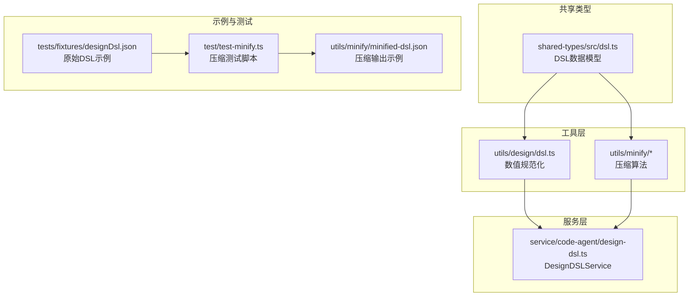
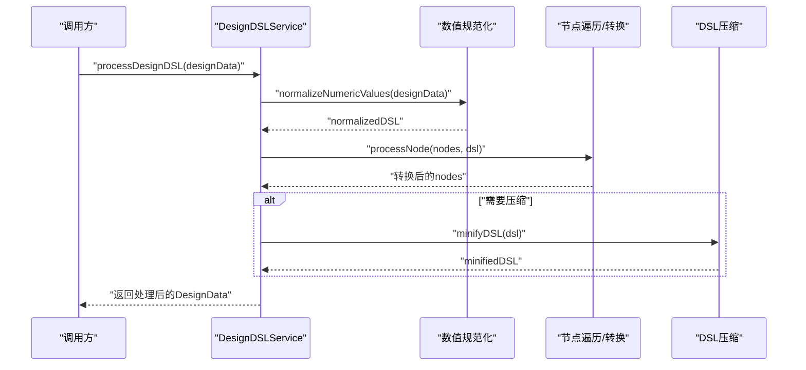
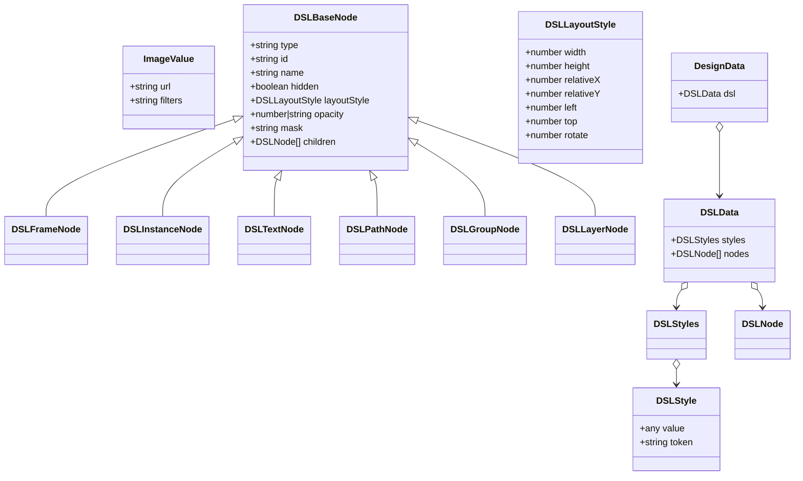
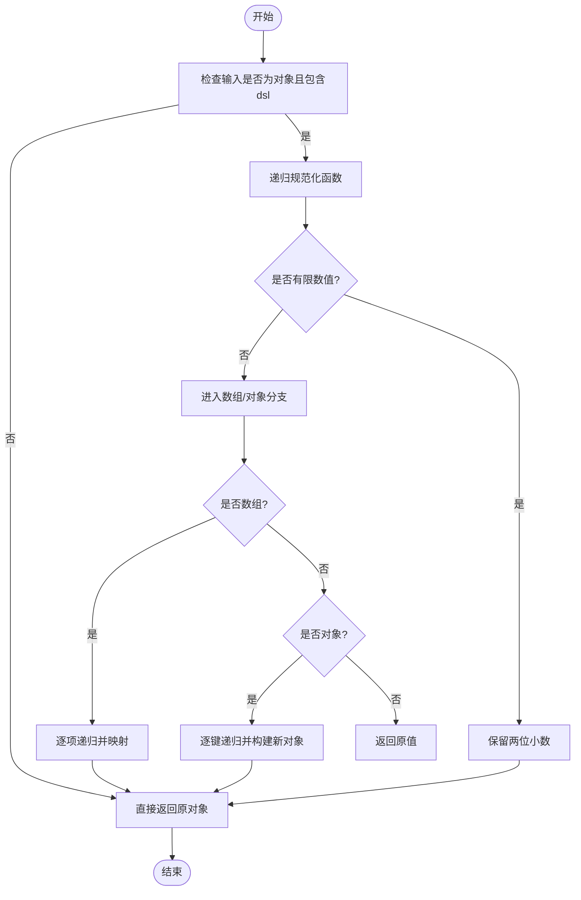
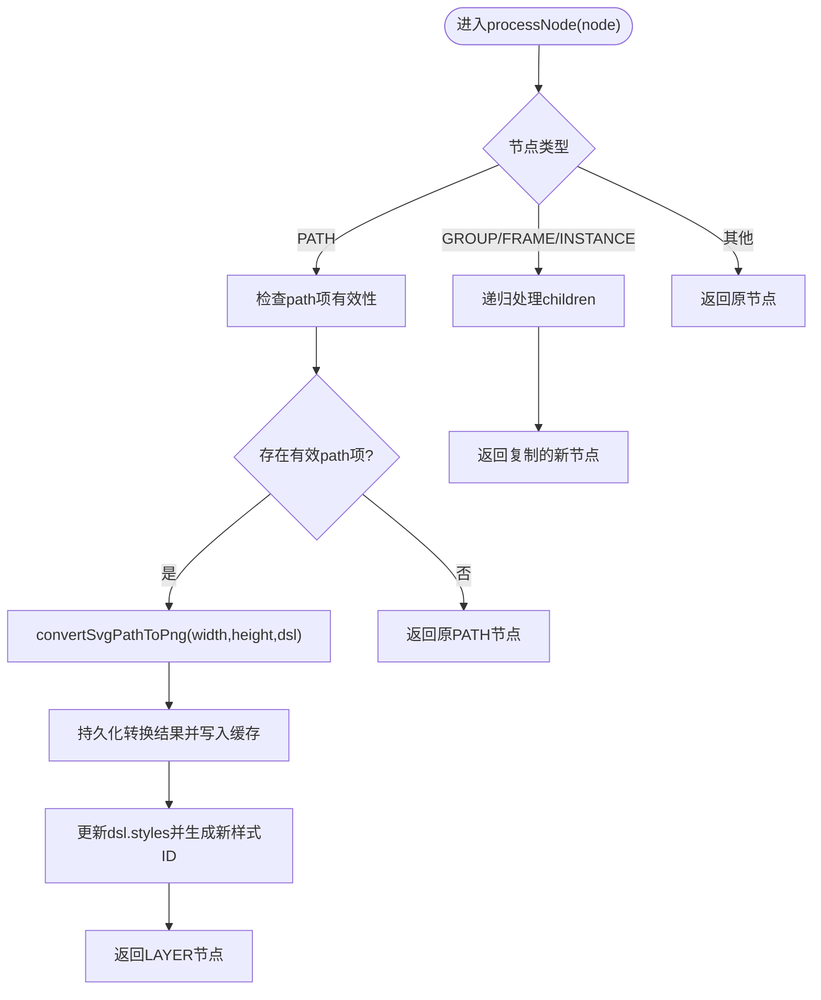
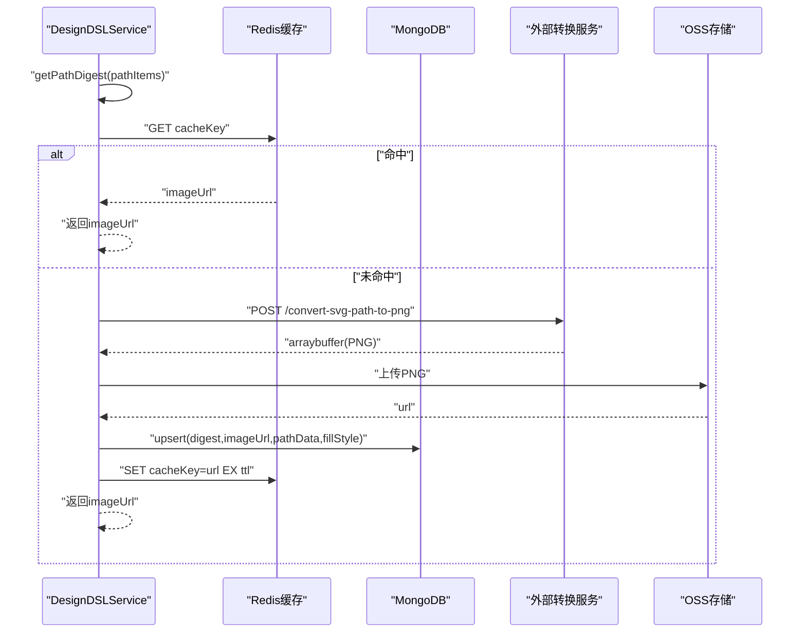
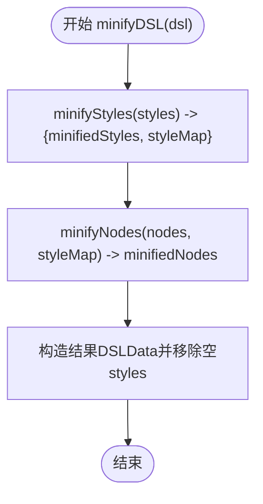
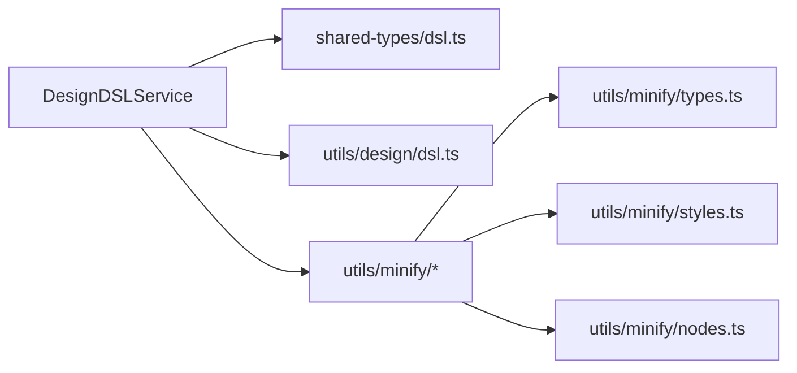

# DSL处理

<cite>
**本文引用的文件列表**
- [design-dsl.service.ts](file://code-agent-backend/src/service/code-agent/design-dsl.ts)
- [shared-types/dsl.ts](file://shared-types/src/dsl.ts)
- [design-dsl.ts（工具函数）](file://code-agent-backend/src/utils/design/dsl.ts)
- [design-dsl.ts（类型别名）](file://code-agent-backend/src/types/design-dsl.ts)
- [minify/index.ts](file://code-agent-backend/src/utils/minify/index.ts)
- [minify/nodes.ts](file://code-agent-backend/src/utils/minify/nodes.ts)
- [minify/styles.ts](file://code-agent-backend/src/utils/minify/styles.ts)
- [minify/types.ts](file://code-agent-backend/src/utils/minify/types.ts)
- [dsl-minify.md](file://docs/dsl-minify.md)
- [test-minify.ts](file://code-agent-backend/test/test-minify.ts)
- [designDsl.json（示例）](file://fta-agent-core/src/tests/fixtures/designDsl.json)
- [minified-dsl.json（示例）](file://code-agent-backend/src/utils/minify/minified-dsl.json)
</cite>

## 目录
1. [简介](#简介)
2. [项目结构](#项目结构)
3. [核心组件](#核心组件)
4. [架构总览](#架构总览)
5. [详细组件分析](#详细组件分析)
6. [依赖关系分析](#依赖关系分析)
7. [性能与优化](#性能与优化)
8. [故障排查指南](#故障排查指南)
9. [结论](#结论)
10. [附录](#附录)

## 简介
本文件围绕设计稿DSL的解析、转换与验证机制展开，重点覆盖：
- 设计稿DSL的数据模型定义（基于shared-types/src/dsl.ts）
- 后端服务对DSL的处理流程（design-dsl.service.ts中的processDesignDSL方法）
- 节点遍历、属性映射与兼容性处理
- DSL压缩（minify）算法与性能优化策略
- 异常DSL处理与向后兼容的设计考量
- 初学者与高级开发者的可视化示例与实践建议

## 项目结构
DSL处理相关代码主要分布在以下模块：
- 类型与共享定义：shared-types/src/dsl.ts
- 工具函数：code-agent-backend/src/utils/design/dsl.ts（数值规范化）、code-agent-backend/src/utils/minify/*（压缩）
- 业务服务：code-agent-backend/src/service/code-agent/design-dsl.ts（核心处理流程）
- 示例与测试：fta-agent-core/src/tests/fixtures/designDsl.json、code-agent-backend/test/test-minify.ts、code-agent-backend/src/utils/minify/minified-dsl.json

图表来源
- [shared-types/dsl.ts](file://shared-types/src/dsl.ts#L1-L163)
- [design-dsl.ts（工具函数）](file://code-agent-backend/src/utils/design/dsl.ts#L1-L45)
- [minify/index.ts](file://code-agent-backend/src/utils/minify/index.ts#L1-L47)
- [design-dsl.service.ts](file://code-agent-backend/src/service/code-agent/design-dsl.ts#L1-L474)
- [test-minify.ts](file://code-agent-backend/test/test-minify.ts#L1-L25)
- [designDsl.json（示例）](file://fta-agent-core/src/tests/fixtures/designDsl.json#L1-L200)
- [minified-dsl.json（示例）](file://code-agent-backend/src/utils/minify/minified-dsl.json#L1-L200)

章节来源
- [shared-types/dsl.ts](file://shared-types/src/dsl.ts#L1-L163)
- [design-dsl.ts（工具函数）](file://code-agent-backend/src/utils/design/dsl.ts#L1-L45)
- [minify/index.ts](file://code-agent-backend/src/utils/minify/index.ts#L1-L47)
- [design-dsl.service.ts](file://code-agent-backend/src/service/code-agent/design-dsl.ts#L1-L474)
- [test-minify.ts](file://code-agent-backend/test/test-minify.ts#L1-L25)
- [designDsl.json（示例）](file://fta-agent-core/src/tests/fixtures/designDsl.json#L1-L200)
- [minified-dsl.json（示例）](file://code-agent-backend/src/utils/minify/minified-dsl.json#L1-L200)

## 核心组件
- DSL数据模型：统一定义了画板、图层、样式、布局等核心概念，确保前后端一致。
- 数值规范化：对DSL中的数值进行统一精度处理，提升稳定性与一致性。
- 路径转图层：将PATH节点转换为LAYER节点，同时将SVG路径转换为图片并缓存。
- DSL压缩：对styles字典与nodes树进行去重、清洗与短ID映射，降低Token占用与体积。
- 统计与诊断：提供节点统计能力，便于评估转换效果与性能。

章节来源
- [shared-types/dsl.ts](file://shared-types/src/dsl.ts#L1-L163)
- [design-dsl.ts（工具函数）](file://code-agent-backend/src/utils/design/dsl.ts#L1-L45)
- [design-dsl.service.ts](file://code-agent-backend/src/service/code-agent/design-dsl.ts#L333-L420)
- [minify/index.ts](file://code-agent-backend/src/utils/minify/index.ts#L1-L47)

## 架构总览
DSL处理的整体流程如下：
- 输入：DesignData（包含dsl.styles与dsl.nodes）
- 步骤1：数值规范化（normalizeNumericValues）
- 步骤2：节点遍历与转换（processNode）
- 步骤3：可选：DSL压缩（minifyDSL）
- 输出：标准化后的DesignData

图表来源
- [design-dsl.service.ts](file://code-agent-backend/src/service/code-agent/design-dsl.ts#L407-L420)
- [design-dsl.ts（工具函数）](file://code-agent-backend/src/utils/design/dsl.ts#L1-L45)
- [minify/index.ts](file://code-agent-backend/src/utils/minify/index.ts#L1-L47)

## 详细组件分析

### 1) DSL数据结构与核心概念
- 样式系统
  - DSLStyle：包含value与token，用于承载颜色、字体、渐变等视觉属性
  - ImageValue：图片样式，包含url与filters
  - DSLStyles：以字符串ID为键的样式字典
- 节点类型
  - FRAME/INSTANCE/TEXT/PATH/GROUP/LAYER：覆盖画板容器、实例、文本、路径、分组与图层
  - DSLBaseNode：统一的节点基类，包含type/id/name/hidden/layoutStyle/opacity/mask/children等
- 布局样式
  - DSLLayoutStyle：包含width/height/left/top/rotate等布局信息
- DSLData与DesignData
  - DSLData：包含styles与nodes
  - DesignData：顶层包装对象，dsl字段承载DSLData

图表来源
- [shared-types/dsl.ts](file://shared-types/src/dsl.ts#L1-L163)

章节来源
- [shared-types/dsl.ts](file://shared-types/src/dsl.ts#L1-L163)

### 2) 数值规范化（normalizeNumericValues）
- 功能：递归遍历DesignData的dsl部分，将数值字段保留两位小数，避免浮点误差导致的不一致
- 处理范围：仅作用于dsl对象，保证不影响其他顶层字段
- 复杂度：时间复杂度O(N)，N为DSL中所有可遍历节点数量；空间复杂度与递归深度相关

图表来源
- [design-dsl.ts（工具函数）](file://code-agent-backend/src/utils/design/dsl.ts#L1-L45)

章节来源
- [design-dsl.ts（工具函数）](file://code-agent-backend/src/utils/design/dsl.ts#L1-L45)

### 3) 节点遍历与转换（processNode）
- 入口：DesignDSLService.processDesignDSL
- 流程：
  1) 对dsl.nodes进行并行遍历
  2) 针对每个节点执行processNode
  3) PATH节点：若存在有效path项，则调用convertSvgPathToPng生成图片，更新dsl.styles并返回LAYER节点
  4) GROUP/FRAME/INSTANCE：递归处理子节点
  5) 其他节点：保持不变
- 异常处理：转换失败时记录错误并回退为原节点，保证整体流程稳定

图表来源
- [design-dsl.service.ts](file://code-agent-backend/src/service/code-agent/design-dsl.ts#L333-L420)

章节来源
- [design-dsl.service.ts](file://code-agent-backend/src/service/code-agent/design-dsl.ts#L333-L420)

### 4) 图片转换与缓存（convertSvgPathToPng）
- 输入：pathItems、width、height、dslData.styles
- 流程：
  1) 计算路径摘要（digest），查询Redis缓存
  2) 若命中缓存，直接返回URL
  3) 若未命中，调用外部服务将SVG路径转换为PNG
  4) 上传至OSS并记录URL
  5) 持久化到MongoDB并写入Redis缓存
  6) 返回图片URL
- 缓存策略：Redis为主，Mongodb为辅；支持自定义TTL

图表来源
- [design-dsl.service.ts](file://code-agent-backend/src/service/code-agent/design-dsl.ts#L258-L331)

章节来源
- [design-dsl.service.ts](file://code-agent-backend/src/service/code-agent/design-dsl.ts#L258-L331)

### 5) DSL压缩（minifyDSL）
- 总体流程：
  1) minifyStyles：对styles进行去重与短ID映射，保留token字段
  2) minifyNodes：对nodes进行属性清洗、样式映射与默认值剔除
  3) 构造结果DSLData并返回
- 关键优化点：
  - 样式去重：按value哈希去重，同一值只保留一份
  - 样式分类：paint/font/effect/style分别生成短ID序列
  - 属性清洗：去除默认值（如opacity=1、rotation=0等）
  - 文本扁平化：单段文本直接打平为对象而非数组
  - 空集合剔除：children为空数组等键直接移除

图表来源
- [minify/index.ts](file://code-agent-backend/src/utils/minify/index.ts#L1-L47)
- [minify/styles.ts](file://code-agent-backend/src/utils/minify/styles.ts#L1-L122)
- [minify/nodes.ts](file://code-agent-backend/src/utils/minify/nodes.ts#L1-L152)
- [minify/types.ts](file://code-agent-backend/src/utils/minify/types.ts#L1-L5)

章节来源
- [minify/index.ts](file://code-agent-backend/src/utils/minify/index.ts#L1-L47)
- [minify/styles.ts](file://code-agent-backend/src/utils/minify/styles.ts#L1-L122)
- [minify/nodes.ts](file://code-agent-backend/src/utils/minify/nodes.ts#L1-L152)
- [minify/types.ts](file://code-agent-backend/src/utils/minify/types.ts#L1-L5)
- [dsl-minify.md](file://docs/dsl-minify.md#L1-L71)

### 6) 统计与诊断（getDSLStats）
- 统计指标：
  - totalNodes：总节点数
  - pathNodes：PATH节点数
  - convertedNodes：已转换为LAYER的节点数（存在有效path项）
  - styleCount：样式总数
- 用途：评估转换效果、定位性能瓶颈与异常节点

章节来源
- [design-dsl.service.ts](file://code-agent-backend/src/service/code-agent/design-dsl.ts#L435-L472)

## 依赖关系分析
- DesignDSLService依赖：
  - shared-types/dsl.ts：类型定义
  - utils/design/dsl.ts：数值规范化
  - utils/minify/*：压缩算法
  - Redis/MongoDB/OSS：外部存储与服务
- 压缩算法依赖：
  - minify/index.ts：入口
  - minify/styles.ts：样式去重与短ID映射
  - minify/nodes.ts：节点属性清洗与样式映射
  - minify/types.ts：映射结构定义

图表来源
- [design-dsl.service.ts](file://code-agent-backend/src/service/code-agent/design-dsl.ts#L1-L474)
- [shared-types/dsl.ts](file://shared-types/src/dsl.ts#L1-L163)
- [design-dsl.ts（工具函数）](file://code-agent-backend/src/utils/design/dsl.ts#L1-L45)
- [minify/index.ts](file://code-agent-backend/src/utils/minify/index.ts#L1-L47)
- [minify/styles.ts](file://code-agent-backend/src/utils/minify/styles.ts#L1-L122)
- [minify/nodes.ts](file://code-agent-backend/src/utils/minify/nodes.ts#L1-L152)
- [minify/types.ts](file://code-agent-backend/src/utils/minify/types.ts#L1-L5)

章节来源
- [design-dsl.service.ts](file://code-agent-backend/src/service/code-agent/design-dsl.ts#L1-L474)
- [shared-types/dsl.ts](file://shared-types/src/dsl.ts#L1-L163)
- [design-dsl.ts（工具函数）](file://code-agent-backend/src/utils/design/dsl.ts#L1-L45)
- [minify/index.ts](file://code-agent-backend/src/utils/minify/index.ts#L1-L47)
- [minify/styles.ts](file://code-agent-backend/src/utils/minify/styles.ts#L1-L122)
- [minify/nodes.ts](file://code-agent-backend/src/utils/minify/nodes.ts#L1-L152)
- [minify/types.ts](file://code-agent-backend/src/utils/minify/types.ts#L1-L5)

## 性能与优化
- 路径转换性能
  - 使用摘要（digest）避免重复转换
  - Redis缓存命中优先，减少外部服务调用
  - 并行处理多path项，提高吞吐
- 压缩策略
  - 样式去重显著降低styles体积，减少Token消耗
  - 属性清洗与默认值剔除减少冗余字段
  - 文本扁平化与children空集合剔除降低JSON体积
- 实践建议
  - 在大规模DSL上运行minify前先做备份
  - 结合getDSLStats监控转换与压缩效果
  - 对异常节点（如无效path项）进行隔离处理，避免影响整体流程

章节来源
- [design-dsl.service.ts](file://code-agent-backend/src/service/code-agent/design-dsl.ts#L258-L331)
- [minify/index.ts](file://code-agent-backend/src/utils/minify/index.ts#L1-L47)
- [minify/styles.ts](file://code-agent-backend/src/utils/minify/styles.ts#L1-L122)
- [minify/nodes.ts](file://code-agent-backend/src/utils/minify/nodes.ts#L1-L152)
- [dsl-minify.md](file://docs/dsl-minify.md#L1-L71)

## 故障排查指南
- 路径转换失败
  - 现象：PATH节点未被转换，仍保持原状
  - 排查：检查convertSvgPathToPng的错误日志；确认外部服务可用与OSS配置正确
  - 回退：转换失败会回退为原节点，不影响其他节点
- 缓存问题
  - 现象：Redis报MOVED/ASK重定向
  - 处理：DesignDSLService内置重定向处理逻辑，自动切换客户端并重试
- 压缩异常
  - 现象：minify后节点样式映射错误
  - 排查：核对styleMap与节点属性映射逻辑；确认去重策略未误删必要样式
- 数值异常
  - 现象：布局数值不一致
  - 处理：确认normalizeNumericValues已执行；检查输入数据是否包含非法数值

章节来源
- [design-dsl.service.ts](file://code-agent-backend/src/service/code-agent/design-dsl.ts#L168-L201)
- [design-dsl.service.ts](file://code-agent-backend/src/service/code-agent/design-dsl.ts#L258-L331)
- [design-dsl.ts（工具函数）](file://code-agent-backend/src/utils/design/dsl.ts#L1-L45)
- [minify/nodes.ts](file://code-agent-backend/src/utils/minify/nodes.ts#L1-L152)
- [minify/styles.ts](file://code-agent-backend/src/utils/minify/styles.ts#L1-L122)

## 结论
本方案通过统一的DSL数据模型、数值规范化、节点遍历与转换以及DSL压缩，实现了对设计稿DSL的高效处理与优化。其核心优势在于：
- 明确的数据结构与类型约束，便于前后端协作
- 路径到图层的自动化转换与缓存机制，兼顾准确性与性能
- 压缩算法在样式去重与属性清洗方面的系统性优化，显著降低Token与体积
- 完善的异常处理与重定向机制，保障生产环境稳定性

## 附录

### A. 初学者入门：DSL数据结构可视化与基本访问
- 可视化要点
  - 画板（FRAME）：容器节点，可包含子节点
  - 图层（LAYER）：最终渲染节点，通常绑定样式ID
  - 路径（PATH）：包含多个path项，每项由SVG路径与填充组成
  - 文本（TEXT）：包含文本片段与颜色停靠
  - 分组（GROUP）：逻辑分组，不直接渲染
- 基本访问方法
  - 遍历节点：从dsl.nodes开始，递归访问children
  - 访问样式：通过节点的fill/stroke等属性引用dsl.styles中的ID
  - 获取尺寸：通过layoutStyle.width/height获取

章节来源
- [shared-types/dsl.ts](file://shared-types/src/dsl.ts#L1-L163)

### B. 高级实践：遍历DSL节点树的实现思路
- 递归遍历
  - 入口：processDesignDSL深拷贝并规范化
  - 子过程：processNode按类型分支处理
  - PATH：提取有效path项，调用convertSvgPathToPng，更新dsl.styles并返回LAYER
  - GROUP/FRAME/INSTANCE：递归处理children
- 并行优化
  - 对顶层nodes使用Promise.all并行处理
  - 对PATH项合并转换，减少外部调用次数

章节来源
- [design-dsl.service.ts](file://code-agent-backend/src/service/code-agent/design-dsl.ts#L407-L420)
- [design-dsl.service.ts](file://code-agent-backend/src/service/code-agent/design-dsl.ts#L333-L402)

### C. 实际示例与对比
- 原始DSL示例：fta-agent-core/src/tests/fixtures/designDsl.json
- 压缩输出示例：code-agent-backend/src/utils/minify/minified-dsl.json
- 压缩测试脚本：code-agent-backend/test/test-minify.ts

章节来源
- [designDsl.json（示例）](file://fta-agent-core/src/tests/fixtures/designDsl.json#L1-L200)
- [minified-dsl.json（示例）](file://code-agent-backend/src/utils/minify/minified-dsl.json#L1-L200)
- [test-minify.ts](file://code-agent-backend/test/test-minify.ts#L1-L25)