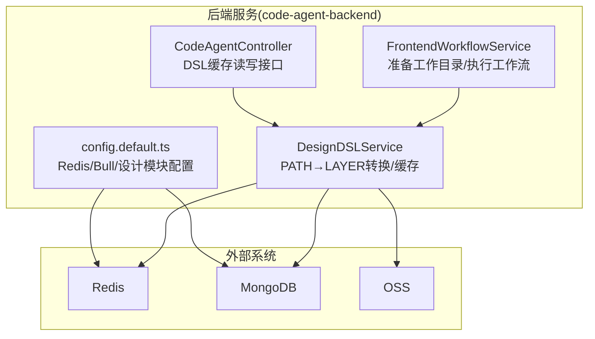
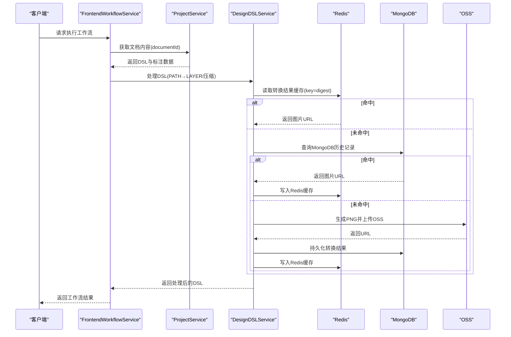
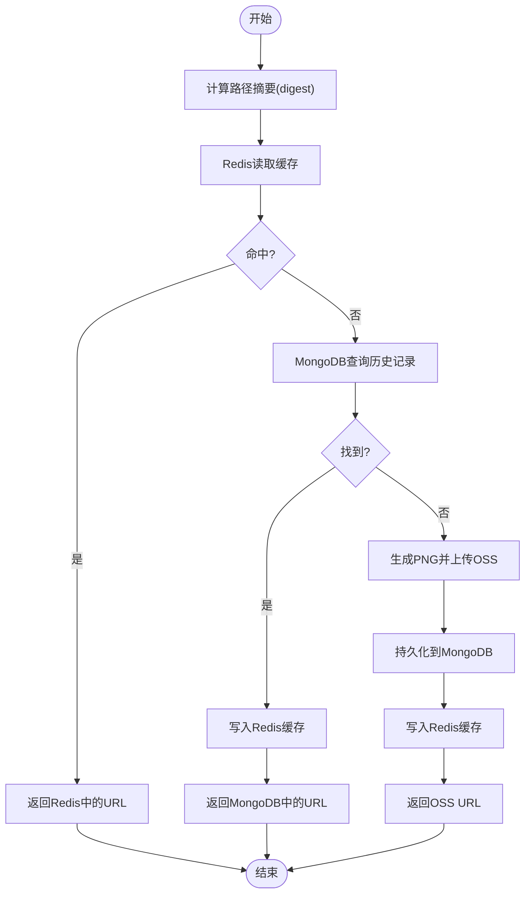
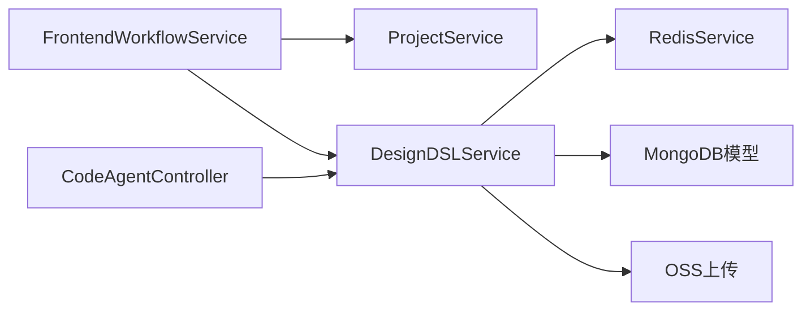

# 缓存管理

<cite>
**本文引用的文件**
- [frontend-workflow.ts](file://code-agent-backend/src/service/code-agent/frontend-workflow.ts)
- [design-dsl.ts](file://code-agent-backend/src/service/code-agent/design-dsl.ts)
- [code-agent.ts](file://code-agent-backend/src/controller/code-agent/code-agent.ts)
- [frontend-workflow-service-usage.md](file://code-agent-backend/docs/frontend-workflow-service-usage.md)
- [config.default.ts](file://code-agent-backend/src/config/config.default.ts)
- [.cursorrules](file://.cursorrules)
- [CLAUDE.md](file://CLAUDE.md)
- [component-annotation.service.ts](file://code-agent-backend/src/service/design/component-annotation.service.ts)
- [frontendProjectService.ts](file://fta-agent-core/src/frontendProjectService.ts)
- [paths.ts](file://fta-agent-core/src/paths.ts)
- [frontend-workflow-log-viewer.html](file://code-agent-backend/tools/frontend-workflow-log-viewer.html)
- [.gitignore](file://.gitignore)
</cite>

## 目录
1. [简介](#简介)
2. [项目结构与缓存相关位置](#项目结构与缓存相关位置)
3. [核心组件与职责](#核心组件与职责)
4. [架构总览](#架构总览)
5. [详细组件分析](#详细组件分析)
6. [依赖关系分析](#依赖关系分析)
7. [性能与缓存策略](#性能与缓存策略)
8. [故障排查与最佳实践](#故障排查与最佳实践)
9. [结论](#结论)

## 简介
本文件围绕“缓存管理”主题，系统梳理后端代码中与缓存相关的实现与策略，重点覆盖：
- 前端工作流服务如何利用Redis缓存频繁访问的DSL数据以提升性能
- 缓存键设计、过期策略与缓存穿透防护
- 文件缓存目录(files-cache)的组织结构，尤其是frontend-projects/{sessionId}工作目录管理
- 面向初学者的缓存命中/失效基本概念，以及面向高级开发者的多级缓存与分布式一致性问题
- 实际代码示例定位（以文件路径与行号标注），并给出监控与清理的最佳实践

## 项目结构与缓存相关位置
- 前端工作流服务负责准备工作目录与执行工作流，工作目录位于files-cache/frontend-projects/{sessionId}，便于隔离与清理。
- 设计DSL服务负责将PATH节点转换为LAYER并缓存转换结果（Redis + MongoDB），同时提供Redis读写接口。
- 控制器提供DSL缓存的调试接口（读取/设置Redis键），便于运维与开发验证。
- 配置文件定义Redis连接、Bull队列与设计模块缓存TTL等全局参数。

图表来源
- [frontend-workflow.ts](file://code-agent-backend/src/service/code-agent/frontend-workflow.ts#L64-L70)
- [design-dsl.ts](file://code-agent-backend/src/service/code-agent/design-dsl.ts#L171-L201)
- [code-agent.ts](file://code-agent-backend/src/controller/code-agent/code-agent.ts#L57-L81)
- [config.default.ts](file://code-agent-backend/src/config/config.default.ts#L150-L204)

章节来源
- [frontend-workflow.ts](file://code-agent-backend/src/service/code-agent/frontend-workflow.ts#L64-L70)
- [config.default.ts](file://code-agent-backend/src/config/config.default.ts#L150-L204)
- [.cursorrules](file://.cursorrules#L42-L66)
- [CLAUDE.md](file://CLAUDE.md#L61-L63)

## 核心组件与职责
- FrontendWorkflowService
  - 负责准备files-cache/frontend-projects/{sessionId}工作目录，供工作流引擎落盘与输出。
  - 在工作流执行前拉取设计文档内容，调用DesignDSLService进行DSL处理与压缩，再驱动核心工作流引擎。
- DesignDSLService
  - 提供redisGet/redisSet接口，支持Redis集群MOVED/ASK重定向。
  - 对PATH节点进行转换，生成LAYER样式并上传OSS；将转换结果的URL写入Redis与MongoDB，形成“Redis + MongoDB”的两级缓存。
  - 提供路径摘要计算与缓存键前缀，支持通过环境变量覆盖缓存TTL。
- CodeAgentController
  - 提供DSL缓存读取/设置接口，便于调试与运维验证Redis缓存状态。
- 配置中心
  - 定义Redis连接、Bull队列、设计模块缓存TTL等参数，影响缓存行为与资源占用。

章节来源
- [frontend-workflow.ts](file://code-agent-backend/src/service/code-agent/frontend-workflow.ts#L64-L70)
- [design-dsl.ts](file://code-agent-backend/src/service/code-agent/design-dsl.ts#L171-L201)
- [code-agent.ts](file://code-agent-backend/src/controller/code-agent/code-agent.ts#L57-L81)
- [config.default.ts](file://code-agent-backend/src/config/config.default.ts#L150-L204)

## 架构总览
下面的序列图展示了前端工作流在执行过程中对DSL数据的获取与缓存交互流程，以及文件缓存目录的使用方式。

图表来源
- [frontend-workflow.ts](file://code-agent-backend/src/service/code-agent/frontend-workflow.ts#L99-L124)
- [design-dsl.ts](file://code-agent-backend/src/service/code-agent/design-dsl.ts#L206-L256)
- [design-dsl.ts](file://code-agent-backend/src/service/code-agent/design-dsl.ts#L258-L331)

章节来源
- [frontend-workflow.ts](file://code-agent-backend/src/service/code-agent/frontend-workflow.ts#L99-L124)
- [design-dsl.ts](file://code-agent-backend/src/service/code-agent/design-dsl.ts#L206-L331)

## 详细组件分析

### 前端工作流服务：工作目录与DSL处理
- 工作目录
  - 通过getWorkflowCwd(sessionId)拼接files-cache/frontend-projects/{sessionId}，用于隔离不同会话的工作产物。
- DSL处理链路
  - 从ProjectService获取文档内容，若DSL为空则直接返回错误。
  - 调用DesignDSLService.processDesignDSL进行数值规范化与PATH→LAYER转换，并对可见节点进行过滤与压缩。
  - 将处理后的DSL与标注摘要、数据模型/REST API上下文组合后交给核心工作流引擎。

章节来源
- [frontend-workflow.ts](file://code-agent-backend/src/service/code-agent/frontend-workflow.ts#L64-L70)
- [frontend-workflow.ts](file://code-agent-backend/src/service/code-agent/frontend-workflow.ts#L99-L124)

### 设计DSL服务：Redis与MongoDB两级缓存
- 缓存键设计
  - 采用固定前缀与摘要组合的方式生成缓存键，确保相同输入得到一致的缓存键，降低冲突概率。
- 过期策略
  - 默认TTL为12小时；可通过环境变量覆盖。
- 缓存穿透防护
  - 通过先读Redis，再回退到MongoDB，最后在生成新结果后写回Redis与MongoDB，避免热点缺失导致的后端压力。
- Redis集群重定向
  - 自动解析MOVED/ASK错误，动态建立重定向客户端并重试，保证在Redis集群场景下的稳定性。
- 转换流程
  - 计算路径摘要，尝试从缓存读取；未命中则调用OSS服务生成PNG并上传，随后持久化到MongoDB并写入Redis。

图表来源
- [design-dsl.ts](file://code-agent-backend/src/service/code-agent/design-dsl.ts#L206-L256)
- [design-dsl.ts](file://code-agent-backend/src/service/code-agent/design-dsl.ts#L258-L331)

章节来源
- [design-dsl.ts](file://code-agent-backend/src/service/code-agent/design-dsl.ts#L206-L331)

### 控制器：DSL缓存读写接口
- 提供基于查询参数的Redis读取接口与基于请求体的Redis写入接口，便于快速验证缓存状态与进行运维操作。

章节来源
- [code-agent.ts](file://code-agent-backend/src/controller/code-agent/code-agent.ts#L57-L81)

### 配置中心：Redis/Bull/设计模块缓存TTL
- Redis连接、Bull队列前缀与默认TTL等参数集中配置，影响缓存生命周期与资源占用。

章节来源
- [config.default.ts](file://code-agent-backend/src/config/config.default.ts#L150-L204)

### 文件缓存目录(files-cache)组织结构
- 目录位置
  - 前端项目工作目录：files-cache/frontend-projects/{sessionId}
  - 临时目录：temp
- 目录清理
  - .gitignore中排除了files-cache的清理规则，仅保留特定子目录，便于在提交前清理无用产物。

章节来源
- [frontend-workflow.ts](file://code-agent-backend/src/service/code-agent/frontend-workflow.ts#L64-L70)
- [.gitignore](file://.gitignore#L19-L23)

## 依赖关系分析
- FrontendWorkflowService依赖ProjectService获取DSL与标注数据，再委托DesignDSLService进行处理。
- DesignDSLService依赖Redis、MongoDB与OSS，形成“内存/磁盘/对象存储”的多层持久化与加速。
- 控制器通过DesignDSLService暴露DSL缓存读写能力，便于调试与运维。

图表来源
- [frontend-workflow.ts](file://code-agent-backend/src/service/code-agent/frontend-workflow.ts#L99-L124)
- [design-dsl.ts](file://code-agent-backend/src/service/code-agent/design-dsl.ts#L171-L201)
- [code-agent.ts](file://code-agent-backend/src/controller/code-agent/code-agent.ts#L57-L81)

章节来源
- [frontend-workflow.ts](file://code-agent-backend/src/service/code-agent/frontend-workflow.ts#L99-L124)
- [design-dsl.ts](file://code-agent-backend/src/service/code-agent/design-dsl.ts#L171-L201)
- [code-agent.ts](file://code-agent-backend/src/controller/code-agent/code-agent.ts#L57-L81)

## 性能与缓存策略
- 缓存命中与失效
  - 命中：Redis直接返回URL，避免重复生成与网络开销。
  - 失效：通过TTL到期或显式更新触发重新生成与写入。
- 缓存键设计
  - 以路径摘要(digest)作为缓存键核心，结合固定前缀，确保可预测性与可维护性。
- 过期策略
  - 默认12小时，可通过环境变量覆盖；对于热点数据建议缩短TTL以平衡新鲜度与命中率。
- 缓存穿透防护
  - 先Redis后MongoDB，再回写双层缓存，避免热点缺失导致的后端压力。
- 分布式一致性
  - Redis集群通过MOVED/ASK重定向处理，保障跨节点一致性与可用性。
- 多级缓存架构
  - Redis作为热缓存，MongoDB作为冷缓存与持久化备份，OSS作为最终静态资源存储。

章节来源
- [design-dsl.ts](file://code-agent-backend/src/service/code-agent/design-dsl.ts#L206-L331)
- [config.default.ts](file://code-agent-backend/src/config/config.default.ts#L150-L204)

## 故障排查与最佳实践
- 缓存监控
  - 使用控制器提供的DSL缓存读取接口验证Redis状态，确认键是否存在、TTL是否正确。
  - 结合日志与工作流日志查看转换流程与缓存命中情况。
- 缓存清理
  - 对于files-cache目录，遵循.gitignore规则进行清理，避免提交无关产物。
  - 对于Redis缓存，建议定期巡检热点键的TTL与命中率，必要时调整TTL或重建缓存。
- 一致性与重定向
  - 若出现Redis集群重定向错误，检查MOVED/ASK解析与重定向客户端建立逻辑。
- 日志与可观测性
  - 工作流日志查看器可用于筛选特定sessionId的执行记录，辅助定位缓存相关问题。

章节来源
- [code-agent.ts](file://code-agent-backend/src/controller/code-agent/code-agent.ts#L57-L81)
- [frontend-workflow-log-viewer.html](file://code-agent-backend/tools/frontend-workflow-log-viewer.html#L1212-L1246)
- [.gitignore](file://.gitignore#L19-L23)

## 结论
本项目的缓存管理以“Redis + MongoDB + OSS”三层架构为核心，结合明确的缓存键设计、可配置的TTL与完善的重定向处理，有效提升了DSL转换与工作流执行的性能与稳定性。文件缓存目录采用按会话隔离的组织方式，便于清理与审计。建议在生产环境中持续监控缓存命中率与延迟，根据业务热点动态调整TTL与清理策略，并完善告警与日志体系以支撑分布式环境下的缓存一致性与可观测性。