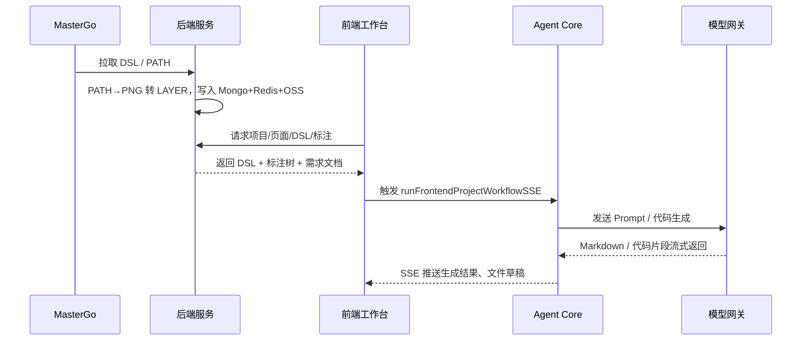
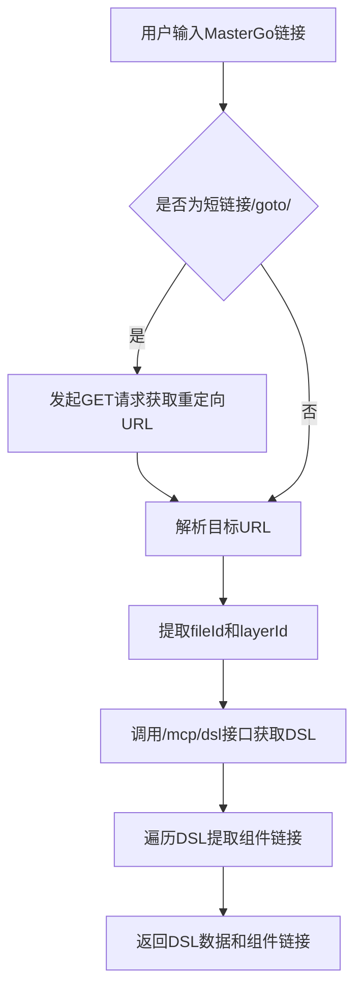
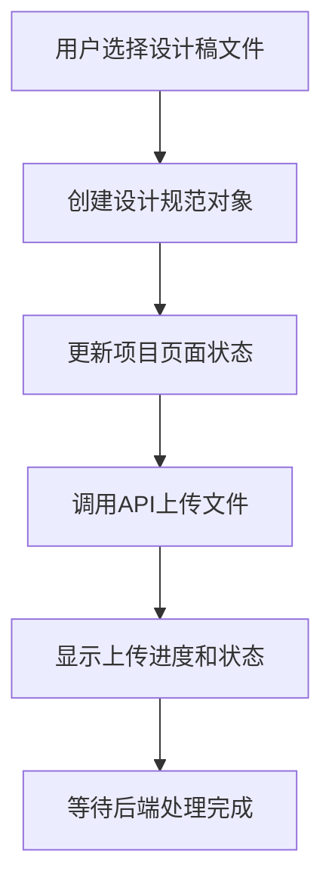

# 设计稿接入

<cite>
**本文档引用文件**  
- [mastergo.service.ts](file://code-agent-backend/src/service/design/mastergo.service.ts)
- [layoutService.ts](file://fta-layout-design/src/services/layoutService.ts)
- [frontend-workflow.ts](file://code-agent-backend/src/service/code-agent/frontend-workflow.ts)
- [frontend-workflow.controller.ts](file://code-agent-backend/src/controller/code-agent/frontend-workflow.ts)
- [apiService.ts](file://fta-layout-design/src/utils/apiService.ts)
- [ProjectContext.tsx](file://fta-layout-design/src/contexts/ProjectContext.tsx)
- [config.default.ts](file://code-agent-backend/src/config/config.default.ts)
</cite>

## 目录
1. [简介](#简介)
2. [系统架构与工作流](#系统架构与工作流)
3. [MasterGo API 集成实现](#mastergo-api-集成实现)
4. [前端工作台交互流程](#前端工作台交互流程)
5. [操作指南：从复制链接到解析完成](#操作指南从复制链接到解析完成)
6. [高级开发者指南](#高级开发者指南)
7. [性能优化与错误处理](#性能优化与错误处理)
8. [结论](#结论)

## 简介

本系统实现了与MasterGo设计工具的深度集成，支持通过设计稿链接无缝接入前端项目开发流程。用户只需复制MasterGo中的设计稿链接，系统即可自动获取设计稿元数据和原始DSL（Design Specification Language），并将其转换为可编程的前端代码结构。该功能是连接设计与开发的关键桥梁，极大提升了开发效率和准确性。

系统采用前后端分离架构，后端通过MasterGo API获取设计数据，前端工作台提供直观的用户界面进行设计稿上传、导入和管理。整个流程支持SSE（Server-Sent Events）实时通信，确保用户能够及时了解处理进度。

**Section sources**
- [mastergo.service.ts](file://code-agent-backend/src/service/design/mastergo.service.ts#L1-L137)
- [README.md](file://README.md#L32-L66)

## 系统架构与工作流

系统整体架构遵循“设计-解析-生成”的核心流程，通过多个服务组件协同工作完成设计稿的接入与代码生成。



**Diagram sources**  
- [README.md](file://README.md#L35-L51)

如上图所示，当用户在MasterGo中复制设计稿链接后，前端工作台将该链接发送至后端服务。后端服务通过MasterGo API获取DSL数据，并进行预处理和存储。随后，前端工作台请求相关数据并展示给用户。用户确认后，触发前端项目工作流，由Agent Core调用模型网关生成代码，并通过SSE实时推送结果。

**Section sources**
- [README.md](file://README.md#L32-L66)
- [frontend-workflow.controller.ts](file://code-agent-backend/src/controller/code-agent/frontend-workflow.ts#L83-L368)

## MasterGo API 集成实现

### 认证与配置

系统通过配置文件中的`mastergo`配置项进行API认证，包含`baseUrl`和`token`两个关键参数。这些配置在`config.default.ts`中定义，并通过依赖注入机制在服务中使用。

```typescript
config.mastergo = {
  baseUrl: 'https://mg.amh-group.com',
  token: 'mg_f1d78b29ea4d4fbdb380e3e5b12fa6a2',
};
```

**Section sources**
- [config.default.ts](file://code-agent-backend/src/config/config.default.ts#L209-L212)

### 获取设计稿元数据和DSL

`mastergo.service.ts`是实现MasterGo API集成的核心服务，主要包含以下功能：

1. **URL解析**：`extractIdsFromUrl`方法负责从MasterGo链接中提取`fileId`和`layerId`。该方法支持短链接重定向处理，通过`axios`发起GET请求并捕获30x重定向响应，获取最终的目标URL。
2. **DSL获取**：`getDsl`方法通过`/mcp/dsl`接口获取设计稿的原始DSL数据。请求包含超时设置（30秒）和HTTPS代理配置，确保在复杂网络环境下的稳定性。
3. **组件链接提取**：`extractComponentDocumentLinks`方法遍历DSL树结构，提取所有引用的组件文档链接，用于后续的组件复用和依赖管理。



**Diagram sources**  
- [mastergo.service.ts](file://code-agent-backend/src/service/design/mastergo.service.ts#L69-L135)

**Section sources**
- [mastergo.service.ts](file://code-agent-backend/src/service/design/mastergo.service.ts#L1-L137)

## 前端工作台交互流程

### 设计稿上传与导入

前端工作台通过`ProjectContext.tsx`中的`uploadDesignSpecs`方法处理设计稿的上传。该方法接收文件列表，为每个文件创建包含元数据（如名称、大小、类型）的设计规范对象，并更新项目状态。



**Diagram sources**  
- [ProjectContext.tsx](file://fta-layout-design/src/contexts/ProjectContext.tsx#L193-L233)

### API调用方式

前端通过`apiService.ts`提供的统一API服务进行后端通信。`layoutService.ts`封装了布局相关的API调用，包括保存、加载和预览布局数据。

```typescript
export const layoutService = {
  async saveLayout(data: { projectId: string; layoutData: any }) {
    const response = await api.layout.save(data);
    return response.data;
  },
  async loadLayout(projectId: string) {
    const response = await api.layout.load(projectId);
    return response.data;
  },
  async previewLayout(params: { projectId: string; version?: string }) {
    const response = await api.layout.preview(params);
    return response.data;
  },
};
```

上述代码展示了如何通过`api.layout.save`等方法调用后端API。`apiService`内部实现了请求拦截、响应处理、错误处理和超时控制，确保了通信的可靠性。

**Section sources**
- [layoutService.ts](file://fta-layout-design/src/services/layoutService.ts#L1-L35)
- [apiService.ts](file://fta-layout-design/src/utils/apiService.ts#L1-L909)
- [ProjectContext.tsx](file://fta-layout-design/src/contexts/ProjectContext.tsx#L193-L233)

## 操作指南从复制链接到解析完成

以下是初学者从MasterGo复制链接到系统成功解析的完整操作步骤：

1. **复制设计稿链接**：在MasterGo中打开目标设计稿，点击分享按钮并复制链接。
2. **粘贴链接**：在前端工作台的“设计稿导入”区域粘贴复制的链接。
3. **提交解析**：点击“解析”按钮，系统将自动开始处理。
4. **等待处理**：界面会显示处理进度，包括“链接解析”、“DSL获取”、“数据预处理”等阶段。
5. **查看结果**：处理完成后，设计稿的结构树、组件列表和属性面板将自动加载并展示。

整个过程无需手动干预，系统会自动完成所有技术细节的处理。

**Section sources**
- [mastergo.service.ts](file://code-agent-backend/src/service/design/mastergo.service.ts#L69-L135)
- [layoutService.ts](file://fta-layout-design/src/services/layoutService.ts#L1-L35)

## 高级开发者指南

### API鉴权机制

系统采用基于Token的鉴权机制。每次调用MasterGo API时，都会在请求头中添加`X-MG-UserAccessToken`字段，其值为配置文件中的`token`。该机制确保了API调用的安全性，防止未授权访问。

```typescript
private getCommonHeader() {
  const token = this.mastergoConfig.token;
  return {
    'Content-Type': 'application/json',
    Accept: 'application/json',
    'X-MG-UserAccessToken': token,
  };
}
```

**Section sources**
- [mastergo.service.ts](file://code-agent-backend/src/service/design/mastergo.service.ts#L19-L26)

### 跨域处理

前端通过`cors`中间件配置跨域策略，允许来自任意源的请求，并支持携带Cookie。同时，`apiService`在请求时设置`credentials: 'include'`，确保认证信息能够正确传递。

```typescript
config.cors = {
  credentials: true,
  allowMethods: ['POST', 'GET', 'PUT', 'DELETE', 'OPTIONS'],
  allowHeaders: ['Content-Type', 'SonicToken', 'FTAToken', 'Authorization', 'x-user-id'],
  origin: ({ ctx }: any) => ctx.header.origin,
};
```

**Section sources**
- [config.default.ts](file://code-agent-backend/src/config/config.default.ts#L20-L39)

### 请求重试策略

虽然当前代码中未显式实现重试逻辑，但可通过`axios`的拦截器或`fetch`的封装函数添加重试机制。建议在`apiService`中实现基于指数退避的重试策略，以应对网络抖动。

## 性能优化与错误处理

### 大文件处理

系统通过流式上传（`upload mode: stream`）处理大文件，避免内存溢出。同时，后端配置了10MB的文件大小限制，平衡了性能和安全性。

```typescript
config.upload = {
  mode: 'stream',
  fileSize: '10mb',
};
```

**Section sources**
- [config.default.ts](file://code-agent-backend/src/config/config.default.ts#L133-L138)

### 超时重试

API调用设置了30秒的超时时间，防止请求长时间挂起。对于关键操作，建议实现客户端重试逻辑，例如在`getDsl`方法中加入最多3次重试。

```typescript
const response = await axios.get(`${this.getBaseUrl()}/mcp/dsl`, {
  timeout: 30000,
  params: { fileId, layerId },
  headers: this.getCommonHeader(),
  httpsAgent,
});
```

### 错误处理机制

系统实现了多层次的错误处理：
- **网络错误**：通过`try-catch`捕获网络异常，并返回用户友好的错误信息。
- **业务错误**：检查API响应的`code`或`success`字段，区分成功与失败状态。
- **客户端错误**：前端通过`message.error`等方式向用户提示错误。

**Section sources**
- [mastergo.service.ts](file://code-agent-backend/src/service/design/mastergo.service.ts#L114-L119)
- [apiService.ts](file://fta-layout-design/src/utils/apiService.ts#L103-L149)

## 结论

本系统通过深度集成MasterGo API，实现了设计稿的无缝接入，为前端开发提供了高效、准确的自动化支持。从链接解析到DSL获取，再到代码生成，整个流程高度自动化，显著降低了开发门槛。对于初学者，提供了简单直观的操作指南；对于高级开发者，则开放了丰富的API和配置选项，支持深度定制和优化。未来可进一步增强错误恢复机制和性能监控，提升系统的稳定性和用户体验。