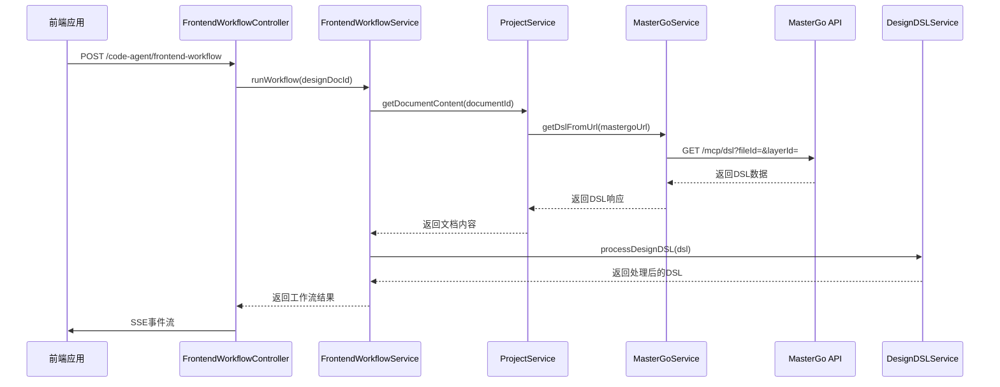
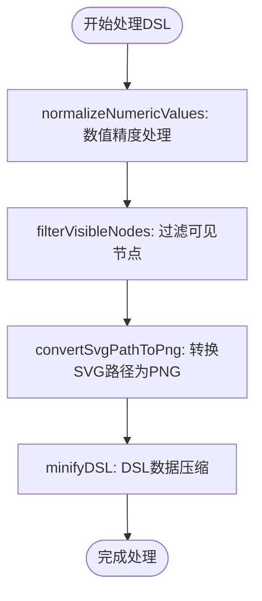
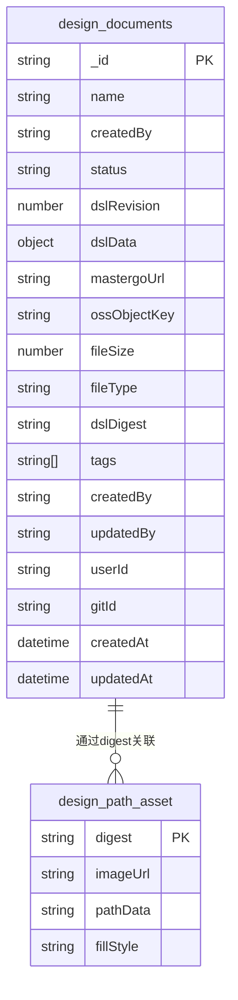
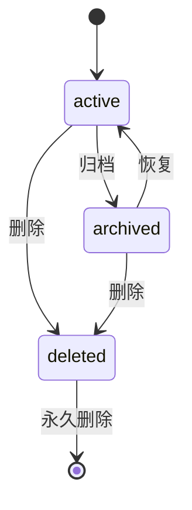
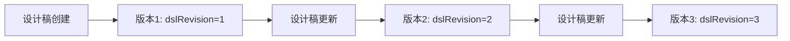
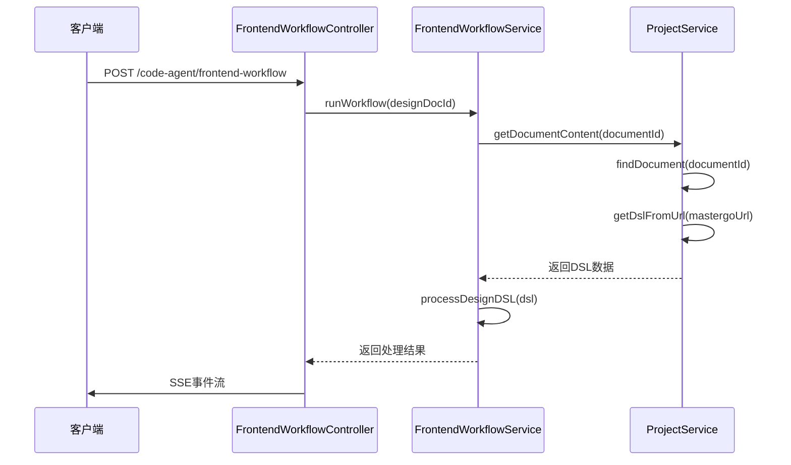
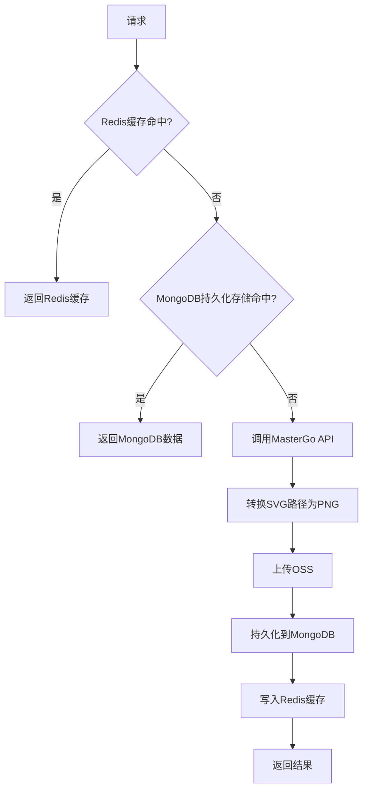
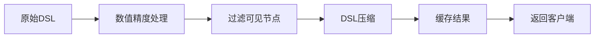

# 设计稿管理

<cite>
**本文档引用的文件**   
- [design-document.ts](file://code-agent-backend/src/entity/design/design-document.ts)
- [design-document.dto.ts](file://code-agent-backend/src/dto/design/design-document.dto.ts)
- [mastergo.service.ts](file://code-agent-backend/src/service/design/mastergo.service.ts)
- [frontend-workflow.service.ts](file://code-agent-backend/src/service/code-agent/frontend-workflow.ts)
- [design-dsl.ts](file://code-agent-backend/src/service/code-agent/design-dsl.ts)
- [frontend-workflow.controller.ts](file://code-agent-backend/src/controller/code-agent/frontend-workflow.ts)
- [dsl.ts](file://code-agent-backend/src/utils/design/dsl.ts)
- [MasterGoDSL.md](file://MasterGoDSL.md)
- [frontend-workflow-service-usage.md](file://code-agent-backend/docs/frontend-workflow-service-usage.md)
</cite>

## 目录
1. [简介](#简介)
2. [设计稿接入与解析](#设计稿接入与解析)
3. [DSL数据存储结构](#dsl数据存储结构)
4. [设计稿状态机与版本管理](#设计稿状态机与版本管理)
5. [设计稿上传与预览操作指南](#设计稿上传与预览操作指南)
6. [getDesignDsl方法实现解析](#getdesigndsl方法实现解析)
7. [API请求与响应示例](#api请求与响应示例)
8. [缓存策略与性能优化](#缓存策略与性能优化)

## 简介
本文档详细阐述了设计稿管理功能的完整流程，包括设计稿的接入、解析、存储和版本管理。系统通过MasterGo API获取设计稿并转换为内部DSL格式，该DSL数据存储在MongoDB的design_documents集合中。文档描述了设计稿的状态机（active/archived/deleted）和版本控制机制，为初学者提供操作指南，并为高级开发者深入解析核心实现细节。

## 设计稿接入与解析
设计稿的接入与解析是整个流程的起点。系统通过MasterGo API获取设计稿数据，并将其转换为内部使用的DSL（Domain Specific Language）格式。

### MasterGo API集成
系统通过`MasterGoService`类与MasterGo API进行交互。该服务提供了从MasterGo URL提取fileId和layerId的功能，并通过这些ID获取DSL数据。



**Diagram sources**
- [mastergo.service.ts](file://code-agent-backend/src/service/design/mastergo.service.ts#L109-L127)
- [frontend-workflow.service.ts](file://code-agent-backend/src/service/code-agent/frontend-workflow.ts#L100-L115)
- [frontend-workflow.controller.ts](file://code-agent-backend/src/controller/code-agent/frontend-workflow.ts#L142-L144)

### DSL数据处理流程
获取到原始DSL数据后，系统会对其进行一系列处理，包括数值精度处理和PATH节点转换。



**Diagram sources**
- [dsl.ts](file://code-agent-backend/src/utils/design/dsl.ts#L17-L43)
- [design-dsl.ts](file://code-agent-backend/src/service/code-agent/design-dsl.ts#L407-L417)
- [frontend-workflow.service.ts](file://code-agent-backend/src/service/code-agent/frontend-workflow.ts#L120-L123)

**Section sources**
- [design-dsl.ts](file://code-agent-backend/src/service/code-agent/design-dsl.ts#L332-L331)
- [dsl.ts](file://code-agent-backend/src/utils/design/dsl.ts#L6-L11)

## DSL数据存储结构
设计稿的DSL数据存储在MongoDB数据库的design_documents集合中，使用`DesignDocumentEntity`实体进行映射。

### design_documents集合结构
该集合存储了设计稿的所有元数据和DSL内容，其核心字段如下：

| 字段名 | 类型 | 描述 | 示例 |
|-------|------|------|------|
| `_id` | string | 文档唯一标识 | 652a1f77bcf86cd799439011 |
| `name` | string | 设计稿名称 | 用户登录页 |
| `description` | string | 描述信息 | 登录页交互稿 |
| `mastergoUrl` | string | MasterGo设计稿链接 | https://mastergo.com/goto/LhGgBAK |
| `dslData` | object | DSL原始数据 | {styles: {}, nodes: []} |
| `dslRevision` | number | DSL版本号，自增 | 1 |
| `status` | enum | 状态 | active/archived/deleted |
| `ossObjectKey` | string | 原始设计稿OSS对象Key | oss://bucket/path/to/file.json |
| `fileSize` | number | 设计稿文件大小（字节） | 102400 |
| `fileType` | string | 设计稿文件类型 | application/json |
| `dslDigest` | string | DSL摘要 | md5:abc123 |
| `tags` | array | 自定义标签信息 | ["登录", "业务"] |
| `createdBy` | string | 创建人JobId/UID | Y0001234 |
| `updatedBy` | string | 最后更新人JobId/UID | Y0005678 |
| `userId` | string | 所属用户ID | user_123 |
| `gitId` | string | Git仓库ID | git_123 |

**Section sources**
- [design-document.ts](file://code-agent-backend/src/entity/design/design-document.ts#L5-L107)

### MongoDB索引
为了优化查询性能，该集合定义了多个索引：



**Diagram sources**
- [design-document.ts](file://code-agent-backend/src/entity/design/design-document.ts#L16-L18)
- [path-asset.ts](file://code-agent-backend/src/entity/code-agent/design-dsl/path-asset.ts)

## 设计稿状态机与版本管理
系统通过状态机和版本控制机制来管理设计稿的生命周期。

### 设计稿状态机
设计稿有三种状态：active（活跃）、archived（归档）和deleted（删除）。状态转换如下：



**Diagram sources**
- [design-document.ts](file://code-agent-backend/src/entity/design/design-document.ts#L5-L6)

### 版本控制机制
系统通过`dslRevision`字段实现DSL数据的版本控制。每次更新设计稿时，版本号会自增，确保可以追踪历史变更。



**Section sources**
- [design-document.ts](file://code-agent-backend/src/entity/design/design-document.ts#L53-L55)
- [design-document.dto.ts](file://code-agent-backend/src/dto/design/design-document.dto.ts#L78-L79)

## 设计稿上传与预览操作指南
本节为初学者提供设计稿上传和预览的完整操作指南。

### 上传设计稿
1. 在前端界面点击"上传设计稿"按钮
2. 输入设计稿名称和描述
3. 粘贴MasterGo设计稿链接
4. 点击"确认"按钮
5. 系统将自动从MasterGo获取DSL数据并存储

### 预览设计稿
1. 在设计稿列表中选择目标设计稿
2. 点击"预览"按钮
3. 系统将通过API获取DSL数据
4. 前端渲染引擎将DSL转换为可视化界面
5. 用户可以在预览界面查看设计稿内容

**Section sources**
- [frontend-workflow-service-usage.md](file://code-agent-backend/docs/frontend-workflow-service-usage.md#L21-L39)
- [frontend-workflow-api.md](file://code-agent-backend/docs/frontend-workflow-api.md#L142-L175)

## getDesignDsl方法实现解析
本节为高级开发者深入解析`frontend-workflow.service.ts`中`getDesignDsl`方法的实现细节。

### 方法调用流程
`getDesignDsl`方法是获取设计稿DSL数据的核心入口，其调用流程如下：



**Diagram sources**
- [frontend-workflow.service.ts](file://code-agent-backend/src/service/code-agent/frontend-workflow.ts#L100-L117)
- [project.ts](file://code-agent-backend/src/service/code-agent/project.ts#L545-L556)

### 核心处理逻辑
`getDesignDsl`方法的核心逻辑包括：

1. **获取文档内容**：通过`projectService.getDocumentContent`获取设计稿内容
2. **处理DSL数据**：通过`designDSLService.processDesignDSL`处理DSL数据
3. **过滤可见节点**：移除隐藏节点和outline节点
4. **压缩DSL数据**：通过`minifyDSL`函数压缩DSL数据

```typescript
// 伪代码表示核心逻辑
async getDesignDsl(designDocId) {
  // 1. 获取文档内容
  const documentContent = await projectService.getDocumentContent({ documentId: designDocId });
  const { dsl, annotationData, pageId } = documentContent;
  
  // 2. 处理DSL数据
  const processedDSL = await designDSLService.processDesignDSL(dsl);
  
  // 3. 过滤可见节点
  const filteredDSL = {
    ...processedDSL,
    dsl: minifyDSL({
      ...processedDSL.dsl,
      nodes: filterVisibleNodes(processedDSL.dsl.nodes)
    })
  };
  
  return filteredDSL;
}
```

**Section sources**
- [frontend-workflow.service.ts](file://code-agent-backend/src/service/code-agent/frontend-workflow.ts#L100-L124)

## API请求与响应示例
本节提供通过API获取DSL数据的请求/响应格式示例。

### 请求格式
```json
POST /code-agent/frontend-workflow
Content-Type: application/json

{
  "designDocId": "507f1f77bcf86cd799439011",
  "productName": "MyApp",
  "sessionId": "unique-session-id"
}
```

### 响应格式
```json
{
  "success": true,
  "sessionId": "unique-session-id",
  "filesCount": 10,
  "files": [
    { "path": "src/App.tsx", "kind": "file" },
    { "path": "src/components", "kind": "directory" }
  ],
  "workflowLogPath": "/path/to/log"
}
```

### SSE事件流
系统使用SSE（Server-Sent Events）实时推送工作流状态：

```json
event: message
data: {"role": "assistant", "content": "I'll help you generate...", "uuid": "msg-uuid"}

event: text
data: {"text": "Complete output text"}

event: complete
data: {"success": true, "filesCount": 10}
```

**Section sources**
- [frontend-workflow-api.md](file://code-agent-backend/docs/frontend-workflow-api.md#L27-L127)
- [frontend-workflow.controller.ts](file://code-agent-backend/src/controller/code-agent/frontend-workflow.ts#L108-L111)

## 缓存策略与性能优化
系统采用了多层次的缓存策略来优化性能。

### 缓存层级
系统实现了Redis和MongoDB的双重缓存机制：



**Diagram sources**
- [design-dsl.ts](file://code-agent-backend/src/service/code-agent/design-dsl.ts#L206-L223)
- [design-dsl.ts](file://code-agent-backend/src/service/code-agent/design-dsl.ts#L248-L252)

### 性能优化措施
1. **数值精度处理**：通过`normalizeNumericValues`函数将数值保留两位小数，减少数据体积
2. **DSL压缩**：通过`minifyDSL`函数压缩DSL数据，减少传输量
3. **路径转换缓存**：将SVG路径转换为PNG的结果缓存12小时
4. **SSE流式传输**：使用SSE实时推送处理进度，提升用户体验



**Section sources**
- [dsl.ts](file://code-agent-backend/src/utils/design/dsl.ts#L17-L43)
- [design-dsl.ts](file://code-agent-backend/src/service/code-agent/design-dsl.ts#L70-L75)
- [index.ts](file://code-agent-backend/src/utils/minify/index.ts#L19-L46)