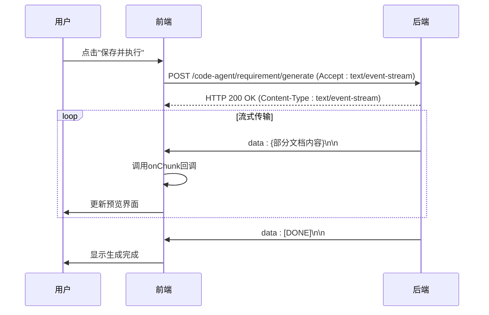
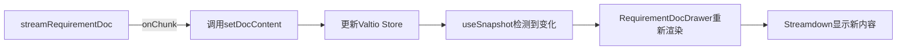
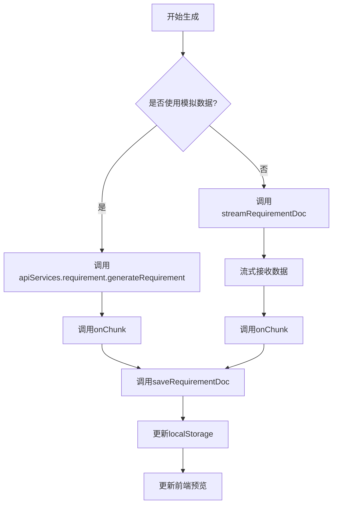

# 前端请求阶段

<cite>
**本文档中引用的文件**  
- [RequirementDocDrawer/index.tsx](file://fta-layout-design/src/pages/EditorPage/components/RequirementDocDrawer/index.tsx)
- [requirementDoc.ts](file://fta-layout-design/src/pages/EditorPage/utils/requirementDoc.ts)
- [RequirementDocContext.tsx](file://fta-layout-design/src/pages/EditorPage/contexts/RequirementDocContext.tsx)
- [api.ts](file://fta-layout-design/src/config/api.ts)
- [apiService.ts](file://fta-layout-design/src/utils/apiService.ts)
- [FrontendWorkflowScheduler.ts](file://fta-layout-design/src/pages/EditorPage/services/FrontendWorkflowScheduler.ts)
- [requirement-builder.ts](file://code-agent-backend/src/utils/design/requirement-builder.ts)
</cite>

## 目录
1. [UI交互与组件结构](#ui交互与组件结构)
2. [请求生成与参数封装](#请求生成与参数封装)
3. [流式响应处理机制](#流式响应处理机制)
4. [状态管理与内容同步](#状态管理与内容同步)
5. [缓存策略与协同工作](#缓存策略与协同工作)

## UI交互与组件结构

`RequirementDocDrawer` 组件是需求文档生成流程的前端入口，基于 Ant Design 的 `Drawer` 和 `Button` 组件构建了完整的用户交互界面。该组件通过 `open` 属性控制抽屉的展开与收起，当用户在工作台触发生成操作时，抽屉从右侧滑出，展示需求文档的实时预览。

组件的核心交互由两个按钮驱动：**保存** 和 **保存并执行**。保存按钮调用 `handleSave` 函数，将当前文档内容持久化到 `localStorage`；保存并执行按钮则调用 `handleSaveAndExecute` 函数，在保存后立即触发代码生成任务。抽屉的预览区域使用 `Streamdown` 组件渲染文档内容，当 `isGenerating` 属性为 `true` 时，会显示流式生成的动画效果，为用户提供实时反馈。

```mermaid
flowchart TD
A[用户点击生成按钮] --> B[打开RequirementDocDrawer]
B --> C[显示实时预览]
C --> D{用户操作}
D --> E[点击"保存"]
D --> F[点击"保存并执行"]
E --> G[调用handleSave]
F --> H[调用handleSaveAndExecute]
H --> I[保存文档]
I --> J[触发代码生成]
```

**Diagram sources**
- [RequirementDocDrawer/index.tsx](file://fta-layout-design/src/pages/EditorPage/components/RequirementDocDrawer/index.tsx#L61-L100)

**Section sources**
- [RequirementDocDrawer/index.tsx](file://fta-layout-design/src/pages/EditorPage/components/RequirementDocDrawer/index.tsx#L18-L81)

## 请求生成与参数封装

`generateRequirementDoc` 函数是前端请求的核心，负责封装参数并发起 POST 请求。该函数接收 `designId` 和 `rootAnnotation` 作为主要参数，其中 `designId` 是设计稿的唯一标识符，`rootAnnotation` 是从画布中提取的根标注节点数据，包含了整个页面的组件结构和属性信息。

函数通过 `RequirementDocGenerationOptions` 接口定义了可选的配置项，包括模板键（`templateKey`）、标注版本（`annotationVersion`）和流式回调（`onChunk`）。在构造请求体时，所有参数都被整合到一个 `payload` 对象中，并通过 `JSON.stringify` 序列化。请求的 URL 由 `buildApiUrl(API_ENDPOINTS.requirement.generate)` 动态生成，确保了环境配置的灵活性。

```mermaid
classDiagram
class generateRequirementDoc {
+designId : string
+rootAnnotation : AnnotationNode | null
+options : RequirementDocGenerationOptions
+execute() : Promise~string~
}
class RequirementDocGenerationOptions {
+templateKey? : string
+annotationVersion? : number
+annotationSchemaVersion? : string
+onChunk? : (chunk : string) => void
+signal? : AbortSignal
}
class streamRequirementDoc {
+payload : { designId, rootAnnotation, ... }
+options : RequirementDocGenerationOptions
+execute() : Promise~string~
}
generateRequirementDoc --> streamRequirementDoc : "委托执行"
generateRequirementDoc --> RequirementDocGenerationOptions : "使用配置"
```

**Diagram sources**
- [requirementDoc.ts](file://fta-layout-design/src/pages/EditorPage/utils/requirementDoc.ts#L145-L178)
- [api.ts](file://fta-layout-design/src/config/api.ts#L73-L78)

**Section sources**
- [requirementDoc.ts](file://fta-layout-design/src/pages/EditorPage/utils/requirementDoc.ts#L145-L160)

## 流式响应处理机制

`streamRequirementDoc` 函数实现了对服务端发送事件（SSE）流的完整处理。其核心在于 `fetch` 调用的配置：`Accept` 头被设置为 `text/event-stream`，明确告知后端需要流式响应。函数通过 `AbortSignal` 实现了请求的中断传播，允许用户在生成过程中取消操作。

响应处理流程如下：首先检查 `response.ok` 和 `Content-Type`，确保连接成功且为流式类型。然后通过 `response.body.getReader()` 获取读取器，并使用 `TextDecoder` 将二进制流解码为 UTF-8 字符串。数据被逐块读取并拼接，通过正则表达式 `/data:\\s*(.*?)\\n/g` 提取 `data:` 字段的内容。每当解析出一个数据块，就会调用 `onChunk` 回调函数，实现内容的渐进式渲染。当遇到 `[DONE]` 标记时，流式传输结束，函数返回完整的文档内容。



**Diagram sources**
- [requirementDoc.ts](file://fta-layout-design/src/pages/EditorPage/utils/requirementDoc.ts#L23-L135)
- [FrontendWorkflowScheduler.ts](file://fta-layout-design/src/pages/EditorPage/services/FrontendWorkflowScheduler.ts#L153-L165)

**Section sources**
- [requirementDoc.ts](file://fta-layout-design/src/pages/EditorPage/utils/requirementDoc.ts#L23-L58)

## 状态管理与内容同步

前端使用 Valtio 库进行状态管理，`RequirementDocContext` 定义了 `docContent` 状态和 `setDocContent` 操作。`RequirementDocDrawer` 组件通过 `useSnapshot(createRequirementDocStore())` 订阅该状态，实现了对文档内容的实时响应。

当 `streamRequirementDoc` 函数通过 `onChunk` 回调接收到新的数据块时，上层逻辑会调用 `setDocContent` 更新 Valtio store 中的 `docContent`。由于 `useSnapshot` 的自动订阅机制，`RequirementDocDrawer` 组件会立即重新渲染，将最新的内容通过 `Streamdown` 组件展示给用户。这种机制确保了状态的单一来源和视图的即时更新，为初学者提供了一个清晰的状态管理示例。



**Diagram sources**
- [RequirementDocContext.tsx](file://fta-layout-design/src/pages/EditorPage/contexts/RequirementDocContext.tsx#L13-L22)
- [requirementDoc.ts](file://fta-layout-design/src/pages/EditorPage/utils/requirementDoc.ts#L167)

**Section sources**
- [RequirementDocContext.tsx](file://fta-layout-design/src/pages/EditorPage/contexts/RequirementDocContext.tsx#L3-L9)

## 缓存策略与协同工作

`saveRequirementDoc` 函数实现了基于 `localStorage` 的客户端缓存策略。它将文档内容和保存时间封装成一个对象，并以 `fta-requirement-doc-${designId}` 为键名进行存储。这种策略确保了即使页面刷新或用户离开后返回，已生成的文档内容也不会丢失。

在流式响应的协同工作中，`generateRequirementDoc` 函数首先检查 `shouldUseMock()` 来判断是否使用模拟数据。在真实环境中，它调用 `streamRequirementDoc` 发起流式请求。`onChunk` 回调不仅用于更新前端预览，还可以在每次接收到数据块时调用 `saveRequirementDoc` 进行增量保存，实现生成与持久化的无缝协同。高级开发者可以利用此机制优化用户体验，例如在网络不稳定时提供断点续传功能。



**Diagram sources**
- [requirementDoc.ts](file://fta-layout-design/src/pages/EditorPage/utils/requirementDoc.ts#L206-L235)
- [requirement-builder.ts](file://code-agent-backend/src/utils/design/requirement-builder.ts#L78-L121)

**Section sources**
- [requirementDoc.ts](file://fta-layout-design/src/pages/EditorPage/utils/requirementDoc.ts#L206-L235)