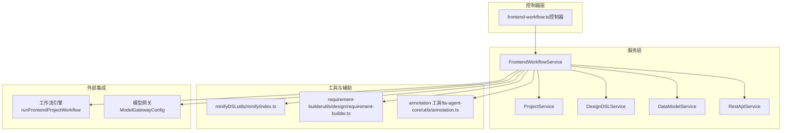
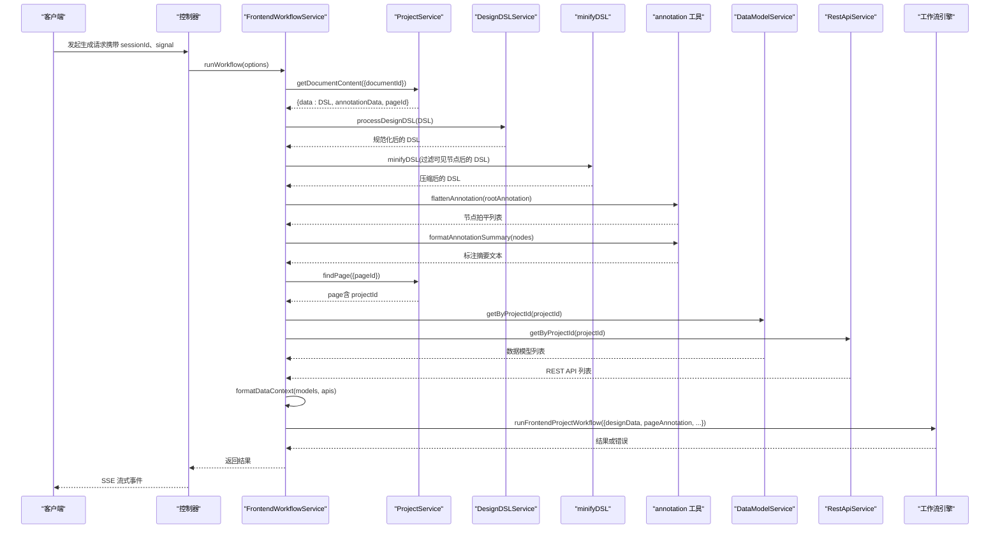
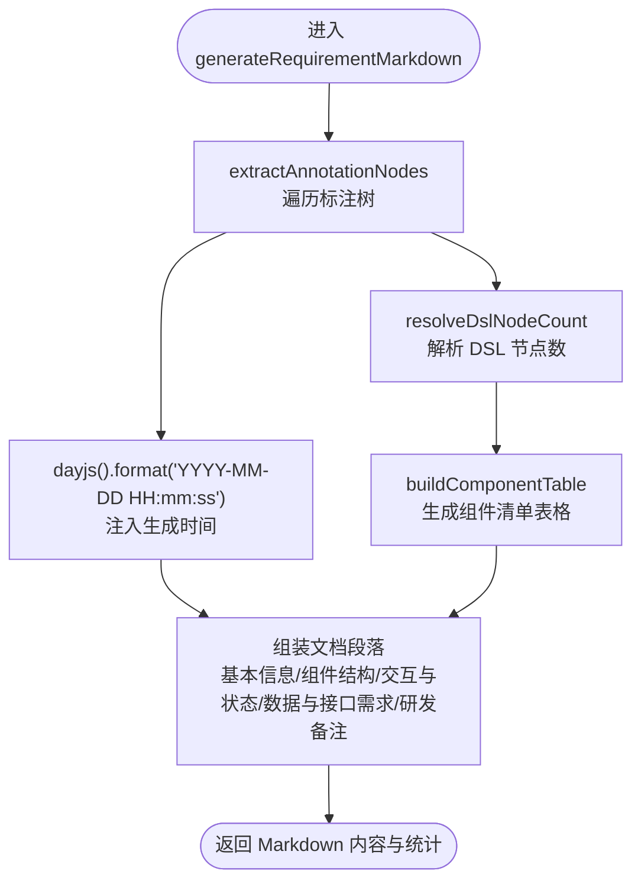
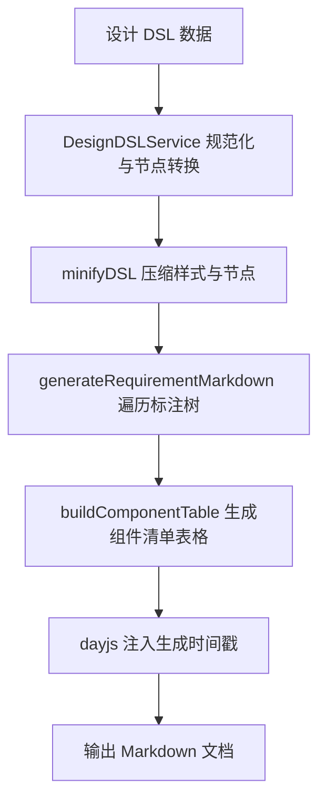
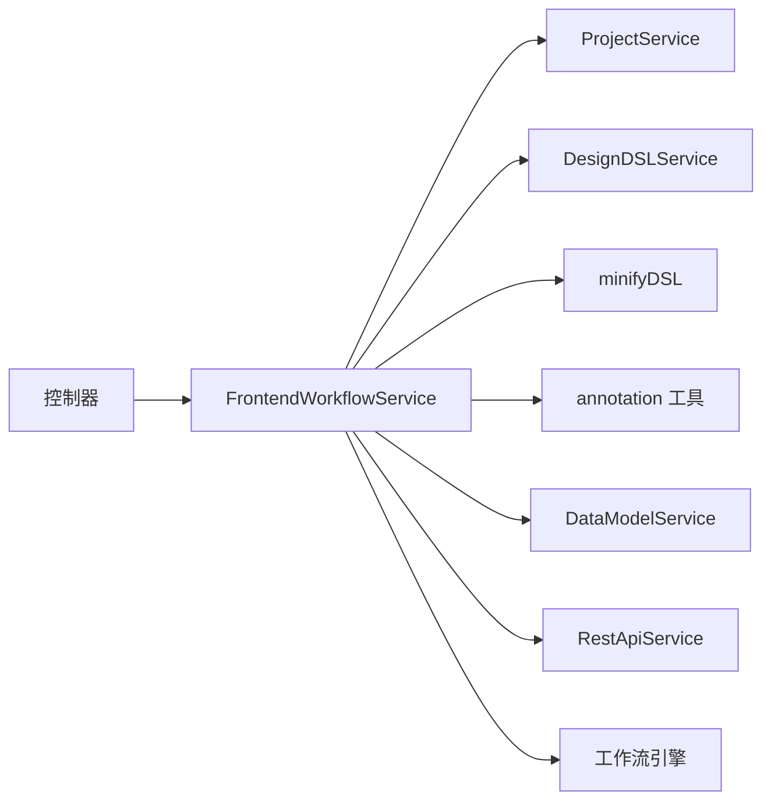

# 后端处理阶段

<cite>
**本文引用的文件**
- [frontend-workflow.ts](file://code-agent-backend/src/service/code-agent/frontend-workflow.ts)
- [project.ts](file://code-agent-backend/src/service/code-agent/project.ts)
- [design-dsl.ts](file://code-agent-backend/src/service/code-agent/design-dsl.ts)
- [requirement-builder.ts](file://code-agent-backend/src/utils/design/requirement-builder.ts)
- [annotation.ts](file://fta-agent-core/src/utils/annotation.ts)
- [frontend-workflow.ts（控制器）](file://code-agent-backend/src/controller/code-agent/frontend-workflow.ts)
- [frontend-workflow-api.md](file://code-agent-backend/docs/frontend-workflow-api.md)
- [frontend-workflow-service-usage.md](file://code-agent-backend/docs/frontend-workflow-service-usage.md)
- [index.ts（minify）](file://code-agent-backend/src/utils/minify/index.ts)
- [frontend-workflow.dto.ts](file://code-agent-backend/src/dto/code-agent/frontend-workflow.dto.ts)
- [component-annotation.service.ts](file://code-agent-backend/src/service/design/component-annotation.service.ts)
- [model.ts（合并信号）](file://fta-agent-core/src/model.ts)
</cite>

## 目录
1. [引言](#引言)
2. [项目结构](#项目结构)
3. [核心组件](#核心组件)
4. [架构总览](#架构总览)
5. [详细组件分析](#详细组件分析)
6. [依赖关系分析](#依赖关系分析)
7. [性能考量](#性能考量)
8. [故障排查指南](#故障排查指南)
9. [结论](#结论)
10. [附录](#附录)

## 引言
本文聚焦“需求文档生成流程”的后端处理阶段，系统梳理 FrontendWorkflowService 如何接收并处理生成请求，从 ProjectService 获取设计稿 DSL 数据，经由 designDSLService 进行预处理与 minifyDSL 压缩，再通过 generateRequirementMarkdown 对标注树进行遍历、构建组件清单表格，并结合 dayjs 注入时间戳。同时，文档详解工作流上下文构建过程（annotationSummary 与 dataContextSummary 的拼接），以及如何将数据模型与 REST API 信息注入文档生成上下文。最后提供从 DSL 到 Markdown 的转换流程图，并对错误处理机制（如 MissingModelConfigError）与信号中断（AbortError）的传播路径进行深入解析，帮助初学者理解整体流程，同时为高级开发者提供可操作的排障建议。

## 项目结构
后端处理阶段主要涉及以下模块：
- 控制器层：负责接收请求、建立 SSE 连接、转发回调与工具代理、处理中断信号。
- 服务层：FrontendWorkflowService 是核心，协调 ProjectService、DesignDSLService、DataModelService、RestApiService，并与工作流引擎交互。
- 工具与辅助：minifyDSL 压缩、requirement-builder 生成需求文档、annotation 工具格式化标注摘要。
- DTO 与文档：前端工作流 API 使用说明与服务使用指南。

图表来源
- [frontend-workflow.ts（控制器）](file://code-agent-backend/src/controller/code-agent/frontend-workflow.ts#L120-L159)
- [frontend-workflow.ts](file://code-agent-backend/src/service/code-agent/frontend-workflow.ts#L74-L222)
- [index.ts（minify）](file://code-agent-backend/src/utils/minify/index.ts#L19-L46)
- [requirement-builder.ts](file://code-agent-backend/src/utils/design/requirement-builder.ts#L78-L121)
- [annotation.ts](file://fta-agent-core/src/utils/annotation.ts#L18-L83)

章节来源
- [frontend-workflow.ts（控制器）](file://code-agent-backend/src/controller/code-agent/frontend-workflow.ts#L120-L159)
- [frontend-workflow.ts](file://code-agent-backend/src/service/code-agent/frontend-workflow.ts#L74-L222)
- [frontend-workflow-api.md](file://code-agent-backend/docs/frontend-workflow-api.md#L266-L280)

## 核心组件
- FrontendWorkflowService：封装前端项目生成的完整业务逻辑，负责 DSL 获取与预处理、标注摘要与数据上下文拼接、工作流引擎调用、回调包装与中断传播、结果汇总与错误处理。
- ProjectService：提供设计文档内容获取（含 DSL 与标注）、页面查询等能力。
- DesignDSLService：对 DSL 进行数值规范化与 PATH 节点转换（SVG 路径转 PNG 图像），并提供统计信息。
- requirement-builder：从标注树提取节点、构建组件清单表格、注入生成时间戳，输出 Markdown 文档。
- annotation 工具：将标注树拍平并格式化为摘要文本，供工作流上下文使用。
- minifyDSL：对 DSL 的样式与节点进行压缩，减少提示词体积与 token 消耗。
- 控制器：建立 SSE 连接、传递 AbortSignal、代理工具调用、发送中断与错误事件。

章节来源
- [frontend-workflow.ts](file://code-agent-backend/src/service/code-agent/frontend-workflow.ts#L46-L222)
- [project.ts](file://code-agent-backend/src/service/code-agent/project.ts#L604-L621)
- [design-dsl.ts](file://code-agent-backend/src/service/code-agent/design-dsl.ts#L407-L420)
- [requirement-builder.ts](file://code-agent-backend/src/utils/design/requirement-builder.ts#L25-L121)
- [annotation.ts](file://fta-agent-core/src/utils/annotation.ts#L18-L83)
- [index.ts（minify）](file://code-agent-backend/src/utils/minify/index.ts#L19-L46)
- [frontend-workflow.ts（控制器）](file://code-agent-backend/src/controller/code-agent/frontend-workflow.ts#L120-L159)

## 架构总览
后端处理阶段的关键流程如下：
- 控制器接收请求，建立 SSE 并创建 AbortController；将 signal 传递给服务层。
- FrontendWorkflowService 从 ProjectService 获取 DSL 与标注数据；若缺失则返回错误。
- 使用 DesignDSLService 对 DSL 进行预处理；随后通过 minifyDSL 压缩可见节点。
- 通过 annotation 工具拍平并格式化标注树为摘要文本；同时从 ProjectService 查询页面关联的数据模型与 REST API，并格式化为上下文文本。
- 将 annotation 摘要与数据上下文拼接为 fullPageContext，调用工作流引擎执行。
- 在回调中再次检查 AbortSignal，若中断则抛出 AbortError；最终汇总结果或错误返回。

图表来源
- [frontend-workflow.ts（控制器）](file://code-agent-backend/src/controller/code-agent/frontend-workflow.ts#L120-L159)
- [frontend-workflow.ts](file://code-agent-backend/src/service/code-agent/frontend-workflow.ts#L101-L173)
- [project.ts](file://code-agent-backend/src/service/code-agent/project.ts#L604-L621)
- [design-dsl.ts](file://code-agent-backend/src/service/code-agent/design-dsl.ts#L407-L420)
- [index.ts（minify）](file://code-agent-backend/src/utils/minify/index.ts#L19-L46)
- [annotation.ts](file://fta-agent-core/src/utils/annotation.ts#L18-L83)

## 详细组件分析

### FrontendWorkflowService.runWorkflow：从 ProjectService 获取 DSL 并预处理
- 输入参数：designDocId、productName、sessionId、signal、callbacks、srcTree、apiKey、baseURL、model、toolProxy。
- 模型配置优先级：入参 > 配置文件 > 报错（MissingModelConfigError）。
- 获取 DSL 与标注：通过 ProjectService.getDocumentContent 返回 DSL 与 annotationData，并校验 DSL 是否存在。
- DSL 预处理：DesignDSLService.processDesignDSL 先进行数值规范化，再将 PATH 节点转换为 LAYER（SVG 路径转 PNG 图像）。
- DSL 压缩：minifyDSL 压缩样式与节点，仅保留可见节点（隐藏与 outline 屏蔽的节点被过滤）。
- 标注摘要：flattenAnnotation + formatAnnotationSummary 生成摘要文本。
- 数据上下文：根据 pageId 获取 projectId，异步拉取数据模型与 REST API，格式化为 dataContextSummary。
- 上下文拼接：annotationSummary 与 dataContextSummary 以分隔线拼接为 fullPageContext。
- 回调包装：若存在 signal，则包装 onMessage/onText，在每次回调前检查中断，避免继续执行。
- 结果汇总：成功返回文件数量与文件列表，失败返回错误类型与消息。

章节来源
- [frontend-workflow.ts](file://code-agent-backend/src/service/code-agent/frontend-workflow.ts#L74-L222)
- [project.ts](file://code-agent-backend/src/service/code-agent/project.ts#L604-L621)
- [design-dsl.ts](file://code-agent-backend/src/service/code-agent/design-dsl.ts#L407-L420)
- [index.ts（minify）](file://code-agent-backend/src/utils/minify/index.ts#L19-L46)
- [annotation.ts](file://fta-agent-core/src/utils/annotation.ts#L18-L83)

### generateRequirementMarkdown：标注树遍历与组件清单表格
- extractAnnotationNodes：递归遍历标注树，收集节点 ID、名称、FTA 组件、深度与子节点数。
- buildComponentTable：将节点列表渲染为 Markdown 表格，若无节点则返回提示文本。
- resolveDslNodeCount：从设计文档实体中解析 DSL 节点数量。
- dayjs 注入：生成时间戳并写入文档头部信息。
- 输出：返回 Markdown 内容、可用格式列表与统计信息（组件数量、标注版本）。

图表来源
- [requirement-builder.ts](file://code-agent-backend/src/utils/design/requirement-builder.ts#L25-L121)

章节来源
- [requirement-builder.ts](file://code-agent-backend/src/utils/design/requirement-builder.ts#L25-L121)

### 工作流上下文构建：annotationSummary 与 dataContextSummary 的拼接
- annotationSummary：来自 flattenAnnotation + formatAnnotationSummary，包含节点 ID、名称、组件、尺寸、子节点数等信息。
- dataContextSummary：来自数据模型与 REST API 的格式化文本，二者以分隔线拼接。
- fullPageContext：annotationSummary 与 dataContextSummary 拼接，作为工作流引擎的页面标注输入。

章节来源
- [frontend-workflow.ts](file://code-agent-backend/src/service/code-agent/frontend-workflow.ts#L126-L173)
- [annotation.ts](file://fta-agent-core/src/utils/annotation.ts#L18-L83)
- [frontend-workflow.ts](file://code-agent-backend/src/service/code-agent/frontend-workflow.ts#L295-L371)

### 从 DSL 到 Markdown 的转换流程图（概念性）

图表来源
- [design-dsl.ts](file://code-agent-backend/src/service/code-agent/design-dsl.ts#L407-L420)
- [index.ts（minify）](file://code-agent-backend/src/utils/minify/index.ts#L19-L46)
- [requirement-builder.ts](file://code-agent-backend/src/utils/design/requirement-builder.ts#L25-L121)

### 错误处理机制与信号中断传播
- MissingModelConfigError：当 apiKey/baseURL 未在入参或配置中提供时，直接返回错误。
- AbortError：在 runWorkflow 启动前与回调中均检查 signal.aborted，若中断则抛出 AbortError 并终止后续执行。
- 控制器侧：捕获 AbortError 与其它错误，通过 SSE 发送 aborted/error 事件，并清理待处理工具调用，避免内存泄漏。
- 信号合并：工作流引擎内部可能使用 mergeAbortSignals 合并外部 AbortSignal，确保统一中断语义。

```mermaid
sequenceDiagram
participant Client as "客户端"
participant Controller as "控制器"
participant Service as "FrontendWorkflowService"
participant Engine as "工作流引擎"
Client->>Controller : 建立 SSE 并传入 AbortSignal
Controller->>Service : runWorkflow({signal})
alt 启动前中断
Service->>Service : 检查 signal.aborted
Service-->>Controller : 抛出 AbortError
else 正常执行
Service->>Engine : 调用工作流引擎
Engine-->>Service : 执行中
alt 回调中中断
Service->>Service : 包装回调检查 signal.aborted
Service-->>Controller : 抛出 AbortError
end
end
Controller-->>Client : 发送 aborted/error 事件并清理
```

图表来源
- [frontend-workflow.ts](file://code-agent-backend/src/service/code-agent/frontend-workflow.ts#L155-L218)
- [frontend-workflow.ts（控制器）](file://code-agent-backend/src/controller/code-agent/frontend-workflow.ts#L314-L367)
- [model.ts（合并信号）](file://fta-agent-core/src/model.ts#L89-L113)

章节来源
- [frontend-workflow.ts](file://code-agent-backend/src/service/code-agent/frontend-workflow.ts#L83-L115)
- [frontend-workflow.ts](file://code-agent-backend/src/service/code-agent/frontend-workflow.ts#L155-L218)
- [frontend-workflow.ts（控制器）](file://code-agent-backend/src/controller/code-agent/frontend-workflow.ts#L314-L367)
- [model.ts（合并信号）](file://fta-agent-core/src/model.ts#L89-L113)

## 依赖关系分析
- FrontendWorkflowService 依赖：
  - ProjectService：获取 DSL 与标注、查询页面与项目。
  - DesignDSLService：DSL 规范化与节点转换。
  - DataModelService/RestApiService：数据模型与 REST API 的格式化。
  - minifyDSL：DSL 压缩。
  - annotation 工具：标注树拍平与摘要格式化。
  - 工作流引擎：runFrontendProjectWorkflow。
- 控制器依赖：
  - FrontendWorkflowService：执行工作流。
  - AbortController：统一中断控制。
  - SSE：事件推送与清理。

图表来源
- [frontend-workflow.ts](file://code-agent-backend/src/service/code-agent/frontend-workflow.ts#L46-L222)
- [frontend-workflow.ts（控制器）](file://code-agent-backend/src/controller/code-agent/frontend-workflow.ts#L120-L159)

章节来源
- [frontend-workflow.ts](file://code-agent-backend/src/service/code-agent/frontend-workflow.ts#L46-L222)
- [frontend-workflow.ts（控制器）](file://code-agent-backend/src/controller/code-agent/frontend-workflow.ts#L120-L159)

## 性能考量
- DSL 压缩：minifyDSL 降低 token 使用量，缩短提示词长度，提升生成效率。
- 可见节点过滤：filterVisibleNodes 仅保留非隐藏与非 outline 的节点，进一步减小上下文规模。
- 异步并行：数据模型与 REST API 拉取采用 Promise.all，减少等待时间。
- 缓存与转换：DesignDSLService 对 SVG 路径转换结果进行 Redis/MongoDB 缓存，避免重复转换。
- 回调中断：在回调中快速检查中断信号，及时停止后续处理，避免无效计算。

章节来源
- [frontend-workflow.ts](file://code-agent-backend/src/service/code-agent/frontend-workflow.ts#L281-L371)
- [index.ts（minify）](file://code-agent-backend/src/utils/minify/index.ts#L19-L46)
- [design-dsl.ts](file://code-agent-backend/src/service/code-agent/design-dsl.ts#L203-L327)

## 故障排查指南
- 缺少模型配置参数
  - 现象：返回 MissingModelConfigError。
  - 处理：在请求参数或配置文件中提供 apiKey 与 baseURL。
- 设计文档缺失或 DSL 为空
  - 现象：返回 DesignNotFoundError。
  - 处理：确认 designDocId 正确且文档已同步。
- 中断信号导致工作流提前终止
  - 现象：抛出 AbortError，控制器发送 aborted 事件。
  - 处理：检查客户端连接状态与网络稳定性；必要时重新发起请求。
- 工作流执行失败
  - 现象：返回错误类型与消息；控制器发送 error 事件。
  - 处理：查看日志与 workflowLogPath，定位具体错误原因。
- 工具调用被取消
  - 现象：待处理工具调用被拒绝。
  - 处理：确认中断后清理流程已完成，避免残留任务。

章节来源
- [frontend-workflow.ts](file://code-agent-backend/src/service/code-agent/frontend-workflow.ts#L83-L115)
- [frontend-workflow.ts](file://code-agent-backend/src/service/code-agent/frontend-workflow.ts#L155-L218)
- [frontend-workflow.ts（控制器）](file://code-agent-backend/src/controller/code-agent/frontend-workflow.ts#L314-L367)

## 结论
后端处理阶段围绕 FrontendWorkflowService 展开，通过 ProjectService 获取 DSL 与标注，DesignDSLService 进行预处理与节点转换，minifyDSL 压缩上下文，annotation 工具与 requirement-builder 生成高质量的需求文档片段。工作流上下文由标注摘要与数据上下文拼接而成，并在回调中严格检查中断信号，确保资源与用户体验的平衡。对于初学者，建议先理解 runWorkflow 的关键步骤与上下文拼接逻辑；对于高级开发者，关注错误传播路径与信号合并策略，有助于优化稳定性与可观测性。

## 附录
- 使用指南与 API 文档参考：
  - [frontend-workflow-service-usage.md](file://code-agent-backend/docs/frontend-workflow-service-usage.md)
  - [frontend-workflow-api.md](file://code-agent-backend/docs/frontend-workflow-api.md)