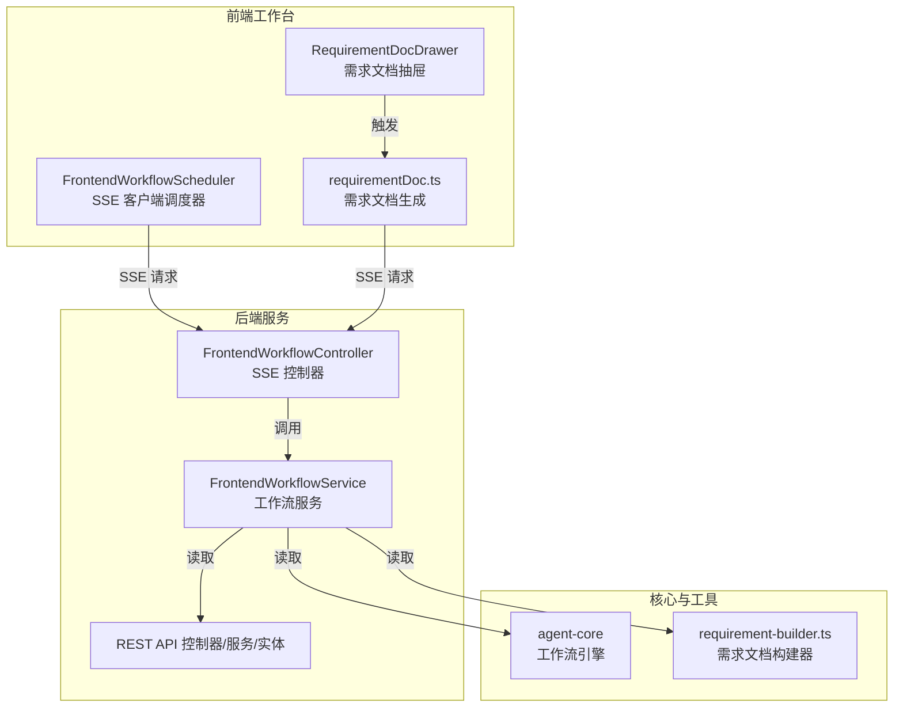
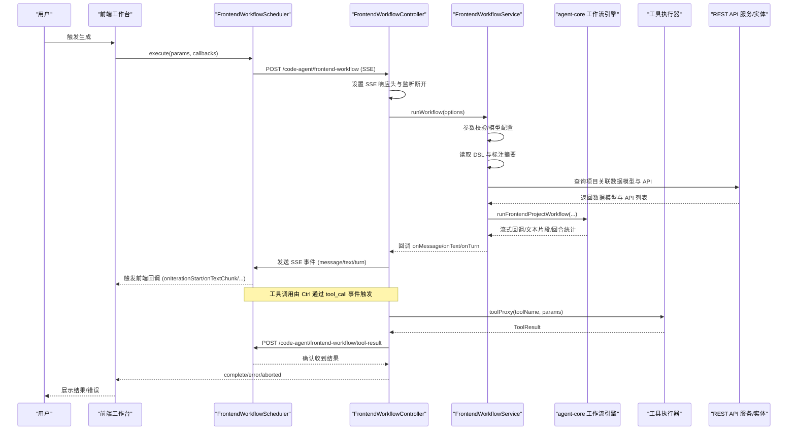
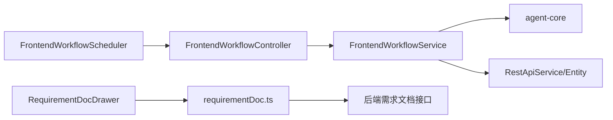

# 文档生成流程

<cite>
**本文引用的文件列表**
- [前端工作流控制器 frontend-workflow.ts](file://code-agent-backend/src/controller/code-agent/frontend-workflow.ts)
- [前端工作流服务 frontend-workflow.ts](file://code-agent-backend/src/service/code-agent/frontend-workflow.ts)
- [前端工作流 DTO 前端工作流 DTO](file://code-agent-backend/src/dto/code-agent/frontend-workflow.dto.ts)
- [前端工作流调度器 FrontendWorkflowScheduler.ts](file://fta-layout-design/src/pages/EditorPage/services/FrontendWorkflowScheduler.ts)
- [需求文档生成 utils/requirementDoc.ts](file://fta-layout-design/src/pages/EditorPage/utils/requirementDoc.ts)
- [需求文档构建器 requirement-builder.ts](file://code-agent-backend/src/utils/design/requirement-builder.ts)
- [需求文档抽屉组件 RequirementDocDrawer/index.tsx](file://fta-layout-design/src/pages/EditorPage/components/RequirementDocDrawer/index.tsx)
- [REST API 控制器 rest-api.ts](file://code-agent-backend/src/controller/code-agent/rest-api.ts)
- [REST API 服务 rest-api.ts](file://code-agent-backend/src/service/code-agent/rest-api.ts)
- [REST API 实体 rest-api.ts](file://code-agent-backend/src/entity/code-agent/rest-api.ts)
</cite>

## 目录
1. [引言](#引言)
2. [项目结构](#项目结构)
3. [核心组件](#核心组件)
4. [架构总览](#架构总览)
5. [详细组件分析](#详细组件分析)
6. [依赖关系分析](#依赖关系分析)
7. [性能考量](#性能考量)
8. [故障排查指南](#故障排查指南)
9. [结论](#结论)
10. [附录](#附录)

## 引言
本文件围绕“需求文档生成流程”进行系统化梳理，覆盖从前端工作台通过 SSE 流式请求触发后端工作流，到最终产出文档的完整生命周期。文档重点说明：
- 前端工作台如何通过 SSE 与后端通信，以及事件解析与中断传播机制
- generateRequirementDoc 函数的参数校验、流式响应处理与错误恢复
- FrontendWorkflowService 中 runWorkflow 方法的执行上下文构建过程（DSL 数据预处理、组件标注摘要生成、数据模型上下文注入）
- 大文档生成时的内存优化策略与最佳实践

## 项目结构
该仓库采用前后端分离的多模块组织方式：
- 后端（code-agent-backend）：提供工作流控制、服务编排、数据模型与 API 管理等能力
- 前端（fta-layout-design）：提供编辑器页面、工作流调度器、需求文档生成与展示组件
- 共享类型（shared-types）：跨模块共享的类型定义
- 核心代理（fta-agent-core）：工作流引擎与提示词规范

图表来源
- [前端工作流调度器 FrontendWorkflowScheduler.ts](file://fta-layout-design/src/pages/EditorPage/services/FrontendWorkflowScheduler.ts#L1-L120)
- [前端工作流控制器 frontend-workflow.ts](file://code-agent-backend/src/controller/code-agent/frontend-workflow.ts#L83-L120)
- [前端工作流服务 frontend-workflow.ts](file://code-agent-backend/src/service/code-agent/frontend-workflow.ts#L74-L120)
- [REST API 控制器 rest-api.ts](file://code-agent-backend/src/controller/code-agent/rest-api.ts#L1-L40)
- [REST API 服务 rest-api.ts](file://code-agent-backend/src/service/code-agent/rest-api.ts#L150-L200)
- [REST API 实体 rest-api.ts](file://code-agent-backend/src/entity/code-agent/rest-api.ts#L1-L40)
- [需求文档生成 utils/requirementDoc.ts](file://fta-layout-design/src/pages/EditorPage/utils/requirementDoc.ts#L1-L60)
- [需求文档构建器 requirement-builder.ts](file://code-agent-backend/src/utils/design/requirement-builder.ts#L78-L122)

章节来源
- [前端工作流控制器 frontend-workflow.ts](file://code-agent-backend/src/controller/code-agent/frontend-workflow.ts#L83-L120)
- [前端工作流服务 frontend-workflow.ts](file://code-agent-backend/src/service/code-agent/frontend-workflow.ts#L74-L120)
- [前端工作流调度器 FrontendWorkflowScheduler.ts](file://fta-layout-design/src/pages/EditorPage/services/FrontendWorkflowScheduler.ts#L1-L120)
- [需求文档生成 utils/requirementDoc.ts](file://fta-layout-design/src/pages/EditorPage/utils/requirementDoc.ts#L1-L60)

## 核心组件
- 前端工作流控制器（SSE 控制器）：负责建立 SSE 连接、转发工具调用、分发事件、处理中断与清理
- 前端工作流服务（工作流服务）：负责 DSL 预处理、标注摘要生成、数据模型与 API 上下文注入、调用核心引擎、回调包装与中断传播
- 前端工作流调度器（SSE 客户端）：负责发起 SSE 请求、解析事件、对接前端回调、处理工具调用与结果回传
- 需求文档生成工具：负责需求文档的流式生成、参数校验、错误恢复与本地缓存
- REST API 管理：提供项目级数据模型与 API 的查询与关联，作为工作流上下文的一部分

章节来源
- [前端工作流控制器 frontend-workflow.ts](file://code-agent-backend/src/controller/code-agent/frontend-workflow.ts#L83-L120)
- [前端工作流服务 frontend-workflow.ts](file://code-agent-backend/src/service/code-agent/frontend-workflow.ts#L74-L120)
- [前端工作流调度器 FrontendWorkflowScheduler.ts](file://fta-layout-design/src/pages/EditorPage/services/FrontendWorkflowScheduler.ts#L1-L120)
- [需求文档生成 utils/requirementDoc.ts](file://fta-layout-design/src/pages/EditorPage/utils/requirementDoc.ts#L1-L60)
- [REST API 控制器 rest-api.ts](file://code-agent-backend/src/controller/code-agent/rest-api.ts#L68-L110)
- [REST API 服务 rest-api.ts](file://code-agent-backend/src/service/code-agent/rest-api.ts#L150-L200)
- [REST API 实体 rest-api.ts](file://code-agent-backend/src/entity/code-agent/rest-api.ts#L1-L40)

## 架构总览
以下序列图展示了从用户触发到文档产出的关键交互链路，涵盖参数校验、SSE 事件分发、工具调用与结果回传、中断传播与清理。

图表来源
- [前端工作流控制器 frontend-workflow.ts](file://code-agent-backend/src/controller/code-agent/frontend-workflow.ts#L83-L120)
- [前端工作流服务 frontend-workflow.ts](file://code-agent-backend/src/service/code-agent/frontend-workflow.ts#L74-L120)
- [前端工作流调度器 FrontendWorkflowScheduler.ts](file://fta-layout-design/src/pages/EditorPage/services/FrontendWorkflowScheduler.ts#L120-L220)
- [REST API 服务 rest-api.ts](file://code-agent-backend/src/service/code-agent/rest-api.ts#L150-L200)

## 详细组件分析

### 1) 前端工作流控制器（SSE 控制器）
职责与关键点：
- 建立 SSE 连接并设置必要的响应头
- 监听客户端断开事件，基于 AbortController 传播中断信号
- 通过 toolProxy 将工具调用请求转化为 SSE 事件（tool_call），并维护 callId 映射
- 将工作流回调（onMessage/onText/onTurn/stream_result）转换为 SSE 事件（message/text/turn/stream_result）
- 在 finally 中清理事件监听器与待处理工具调用，防止内存泄漏

参数校验与错误处理：
- 对缺失的模型配置（apiKey/baseURL）进行校验并返回错误
- 对工作流执行中的异常进行捕获，区分 AbortError 与其它错误，分别发送 aborted 或 error 事件

中断传播：
- 使用 AbortController 与 AbortSignal，确保在客户端断开或调用方取消时，后端能感知并提前终止

章节来源
- [前端工作流控制器 frontend-workflow.ts](file://code-agent-backend/src/controller/code-agent/frontend-workflow.ts#L83-L120)
- [前端工作流控制器 frontend-workflow.ts](file://code-agent-backend/src/controller/code-agent/frontend-workflow.ts#L138-L210)
- [前端工作流控制器 frontend-workflow.ts](file://code-agent-backend/src/controller/code-agent/frontend-workflow.ts#L210-L310)
- [前端工作流控制器 frontend-workflow.ts](file://code-agent-backend/src/controller/code-agent/frontend-workflow.ts#L310-L368)

### 2) 前端工作流服务（工作流服务）
职责与关键点：
- runWorkflow 入参优先使用请求参数，否则回退到配置中心；若仍缺失则直接返回错误
- 读取设计文档 DSL 与标注数据，进行 DSL 过滤与最小化处理，生成页面标注摘要
- 查询项目关联的数据模型与 REST API，格式化为工作流可用的上下文文本
- 构建工作目录与回调包装，将 AbortSignal 注入回调，确保在回调阶段也能及时中断
- 调用核心工作流引擎，聚合结果并返回文件清单与日志路径

DSL 数据预处理：
- 过滤隐藏节点与 outline 掩码节点，仅保留可见节点
- 对 DSL 进行最小化处理，降低上下文体积

组件标注摘要生成：
- 扁平化根标注，生成摘要文本，作为页面上下文的一部分

数据模型上下文注入：
- 将数据模型（TS 接口）与 REST API（方法、URL、关联模型）格式化为纯文本，拼接到页面上下文中

中断与错误处理：
- 在启动前与回调阶段均检查 AbortSignal，抛出 AbortError 并终止后续流程
- 捕获异常并返回标准化错误对象

章节来源
- [前端工作流服务 frontend-workflow.ts](file://code-agent-backend/src/service/code-agent/frontend-workflow.ts#L74-L120)
- [前端工作流服务 frontend-workflow.ts](file://code-agent-backend/src/service/code-agent/frontend-workflow.ts#L120-L170)
- [前端工作流服务 frontend-workflow.ts](file://code-agent-backend/src/service/code-agent/frontend-workflow.ts#L170-L222)
- [前端工作流服务 frontend-workflow.ts](file://code-agent-backend/src/service/code-agent/frontend-workflow.ts#L222-L279)
- [前端工作流服务 frontend-workflow.ts](file://code-agent-backend/src/service/code-agent/frontend-workflow.ts#L281-L373)

### 3) 前端工作流调度器（SSE 客户端）
职责与关键点：
- 发起 SSE 请求，解析事件流（event: 与 data:），将不同事件映射到前端回调
- 处理工具调用：根据 toolName 分派到对应的工具执行器，构造 ToolResult 并通过 /code-agent/frontend-workflow/tool-result 回传
- 维护当前迭代次数与 TODO 列表，支持前端 UI 展示与交互
- 通过 AbortController 传播中断信号，确保前端侧也能及时停止

SSE 事件解析：
- 自定义解析逻辑，逐行读取缓冲区，匹配 event: 与 data: 行，解析 JSON 并分发到 handleSSEEvent
- 支持 complete、error、aborted、tool_call 等事件类型

工具调用处理：
- 对特殊工具（todoWrite/todoRead）返回特定格式的 ToolResult
- 对普通工具（read/write/ls/grep/glob/edit/rm/verify/bash 等）统一将执行结果序列化为字符串

章节来源
- [前端工作流调度器 FrontendWorkflowScheduler.ts](file://fta-layout-design/src/pages/EditorPage/services/FrontendWorkflowScheduler.ts#L120-L220)
- [前端工作流调度器 FrontendWorkflowScheduler.ts](file://fta-layout-design/src/pages/EditorPage/services/FrontendWorkflowScheduler.ts#L220-L320)
- [前端工作流调度器 FrontendWorkflowScheduler.ts](file://fta-layout-design/src/pages/EditorPage/services/FrontendWorkflowScheduler.ts#L320-L520)

### 4) 需求文档生成（generateRequirementDoc）
职责与关键点：
- generateRequirementDoc 负责参数校验（designId 必填）、构建请求负载、决定是否走 Mock 或流式生成
- 流式生成通过 streamRequirementDoc 发起 SSE 请求，解析事件流，将增量内容通过 onChunk 回调传递给调用方
- 支持 AbortSignal，允许调用方在任意时刻中断生成
- 生成完成后返回完整文档字符串，并可保存到本地缓存

流式响应处理：
- 自定义 SSE 解析逻辑，支持 [DONE] 与 done 事件标记完成
- 对非 JSON 的 data 行进行容错处理，保证增量内容也能被消费

错误恢复：
- 对非 SSE 响应（非 text/event-stream）进行降级处理，尝试解析 JSON 并将内容作为一次性 chunk 输出
- 对响应状态码异常与读取异常进行统一错误抛出

章节来源
- [需求文档生成 utils/requirementDoc.ts](file://fta-layout-design/src/pages/EditorPage/utils/requirementDoc.ts#L1-L60)
- [需求文档生成 utils/requirementDoc.ts](file://fta-layout-design/src/pages/EditorPage/utils/requirementDoc.ts#L60-L140)
- [需求文档生成 utils/requirementDoc.ts](file://fta-layout-design/src/pages/EditorPage/utils/requirementDoc.ts#L140-L178)
- [需求文档生成 utils/requirementDoc.ts](file://fta-layout-design/src/pages/EditorPage/utils/requirementDoc.ts#L178-L236)

### 5) 需求文档构建器（requirement-builder）
职责与关键点：
- 从设计文档与组件标注中抽取节点信息，生成组件表格
- 统计 DSL 节点数量与标注版本，填充生成元信息
- 生成 Markdown 结构化的初始需求文档草稿，供前端展示与二次编辑

章节来源
- [需求文档构建器 requirement-builder.ts](file://code-agent-backend/src/utils/design/requirement-builder.ts#L1-L50)
- [需求文档构建器 requirement-builder.ts](file://code-agent-backend/src/utils/design/requirement-builder.ts#L78-L122)

### 6) 需求文档抽屉组件（RequirementDocDrawer）
职责与关键点：
- 提供需求文档的预览与保存功能
- 与 requirementDoc 工具配合，支持“保存并执行”代码生成流程
- 使用动画渲染组件 Streamdown 展示实时预览

章节来源
- [需求文档抽屉组件 RequirementDocDrawer/index.tsx](file://fta-layout-design/src/pages/EditorPage/components/RequirementDocDrawer/index.tsx#L1-L105)

### 7) 数据模型与 API 上下文（REST API）
职责与关键点：
- 提供按项目查询 API 的能力，作为工作流上下文的一部分
- 与前端工作流服务协作，将数据模型与 API 关联信息注入到工作流提示词中

章节来源
- [REST API 控制器 rest-api.ts](file://code-agent-backend/src/controller/code-agent/rest-api.ts#L68-L110)
- [REST API 服务 rest-api.ts](file://code-agent-backend/src/service/code-agent/rest-api.ts#L150-L200)
- [REST API 实体 rest-api.ts](file://code-agent-backend/src/entity/code-agent/rest-api.ts#L1-L40)

## 依赖关系分析
- 前端工作流调度器依赖于后端控制器提供的 SSE 接口与工具结果回传接口
- 后端控制器依赖工作流服务进行业务编排，工作流服务依赖 agent-core 引擎与工具集
- 工作流服务依赖 REST API 服务/实体以获取项目上下文
- 需求文档生成工具与前端抽屉组件共同构成需求文档的前端体验闭环

图表来源
- [前端工作流调度器 FrontendWorkflowScheduler.ts](file://fta-layout-design/src/pages/EditorPage/services/FrontendWorkflowScheduler.ts#L1-L120)
- [前端工作流控制器 frontend-workflow.ts](file://code-agent-backend/src/controller/code-agent/frontend-workflow.ts#L83-L120)
- [前端工作流服务 frontend-workflow.ts](file://code-agent-backend/src/service/code-agent/frontend-workflow.ts#L74-L120)
- [REST API 服务 rest-api.ts](file://code-agent-backend/src/service/code-agent/rest-api.ts#L150-L200)
- [REST API 实体 rest-api.ts](file://code-agent-backend/src/entity/code-agent/rest-api.ts#L1-L40)
- [需求文档生成 utils/requirementDoc.ts](file://fta-layout-design/src/pages/EditorPage/utils/requirementDoc.ts#L1-L60)
- [需求文档抽屉组件 RequirementDocDrawer/index.tsx](file://fta-layout-design/src/pages/EditorPage/components/RequirementDocDrawer/index.tsx#L1-L105)

## 性能考量
- 流式传输与增量渲染
  - SSE 事件以增量形式推送，前端可边接收边渲染，降低首屏等待时间
  - 需求文档生成同样采用流式解析，避免一次性加载全部内容
- DSL 最小化与可见节点过滤
  - 工作流服务对 DSL 进行最小化与可见节点过滤，减少上下文大小，提升 LLM 推理效率
- 回调包装与中断传播
  - 在回调阶段检查 AbortSignal，避免在长耗时回调中浪费资源
- 内存优化建议
  - 对超大文档生成，建议前端按块累积并在 UI 中分页展示，避免一次性持有完整字符串
  - 后端在处理工具调用时，尽量返回轻量级结果或分片数据，必要时使用临时文件落盘
  - 对历史会话与待处理工具调用，确保 finally 中清理，防止内存泄漏

[本节为通用指导，无需列出具体文件来源]

## 故障排查指南
- SSE 连接异常
  - 检查后端是否正确设置 Content-Type 与缓存策略
  - 确认前端是否正确解析 event: 与 data: 行，避免因格式问题导致事件丢失
- 工具调用超时或未返回
  - 后端对 tool_call 事件设置了 60 秒超时，超时后会拒绝并清理待处理队列
  - 前端需确保在收到 tool_call 后尽快执行并回传 tool-result
- 中断信号未生效
  - 确保前端使用 AbortController 并将 signal 传入请求
  - 后端在 runWorkflow 启动前与回调阶段均检查 AbortSignal
- 模型配置缺失
  - 若请求参数与配置中心均未提供 apiKey/baseURL，工作流会直接返回错误
- 需求文档为空
  - 流式生成时若响应非 SSE，将尝试解析 JSON；若仍为空，需检查后端生成逻辑与网络状态

章节来源
- [前端工作流控制器 frontend-workflow.ts](file://code-agent-backend/src/controller/code-agent/frontend-workflow.ts#L138-L210)
- [前端工作流服务 frontend-workflow.ts](file://code-agent-backend/src/service/code-agent/frontend-workflow.ts#L74-L120)
- [前端工作流调度器 FrontendWorkflowScheduler.ts](file://fta-layout-design/src/pages/EditorPage/services/FrontendWorkflowScheduler.ts#L120-L220)
- [需求文档生成 utils/requirementDoc.ts](file://fta-layout-design/src/pages/EditorPage/utils/requirementDoc.ts#L1-L60)

## 结论
本文从系统架构、组件职责、数据流与处理逻辑、错误与中断处理、性能优化等多个维度，全面解析了需求文档生成与前端工作流的完整生命周期。通过 SSE 流式通信、工具调用与结果回传、上下文注入与中断传播，系统实现了高并发、低延迟、可中断的文档生成体验。对于初学者，建议先掌握 SSE 事件解析与工具调用流程；对于高级开发者，可重点关注 runWorkflow 的上下文构建与回调包装机制，以及大文档场景下的内存优化策略。

[本节为总结性内容，无需列出具体文件来源]

## 附录
- 术语说明
  - SSE：Server-Sent Events，服务器向浏览器推送事件的协议
  - DSL：设计语言结构，包含页面节点与布局信息
  - 标注：组件级别的语义与约束描述
  - 上下文：工作流所需的背景信息（DSL、标注、数据模型、API）

[本节为补充说明，无需列出具体文件来源]