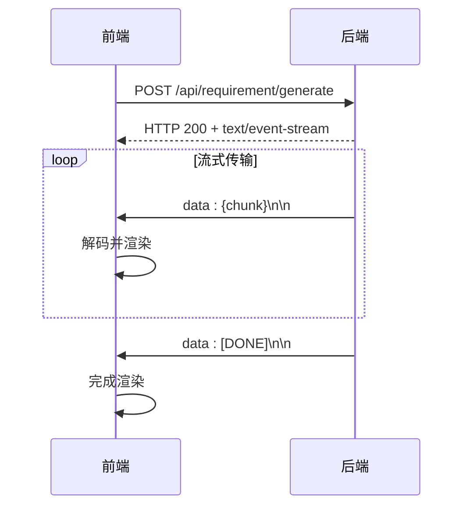
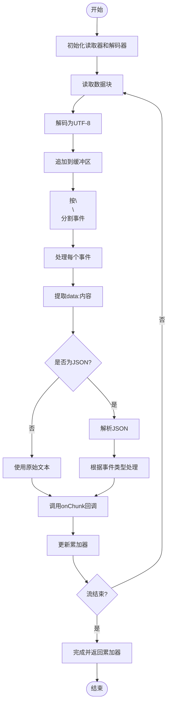
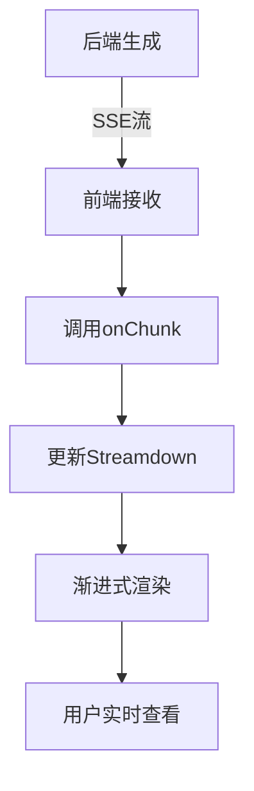

# 流式传输阶段

<cite>
**本文档中引用的文件**  
- [requirementDoc.ts](file://fta-layout-design/src/pages/EditorPage/utils/requirementDoc.ts)
- [apiService.ts](file://fta-layout-design/src/utils/apiService.ts)
- [FrontendWorkflowScheduler.ts](file://fta-layout-design/src/pages/EditorPage/services/FrontendWorkflowScheduler.ts)
- [model-gateway.ts](file://code-agent-backend/src/service/common/model-gateway.ts)
- [MarkdownPage.tsx](file://fta-layout-design/src/pages/MarkdownPage.tsx)
- [global.css](file://fta-layout-design/src/global.css)
</cite>

## 目录
1. [SSE协议在需求文档生成中的应用](#sse协议在需求文档生成中的应用)
2. [后端流式推送与前端接收机制](#后端流式推送与前端接收机制)
3. [streamRequirementDoc函数解析](#streamrequirementdoc函数解析)
4. [Streamdown组件与渐进式展示](#streamdown组件与渐进式展示)
5. [SSE连接管理与错误处理](#sse连接管理与错误处理)
6. [高级优化策略](#高级优化策略)

## SSE协议在需求文档生成中的应用

Server-Sent Events（SSE）是一种允许服务器向客户端浏览器单向推送数据的HTTP协议。在需求文档生成流程中，SSE被用于实现流式传输，使得大型Markdown文档可以分块生成并实时推送给前端，避免长时间等待完整响应。通过设置`Accept: text/event-stream`请求头，前端告知后端支持流式响应，后端则以`text/event-stream`内容类型持续发送数据帧。

SSE协议基于纯文本格式，每条消息以`data:`开头，以双换行符`\n\n`作为分隔符。这种简单而高效的协议特别适合需求文档这类顺序生成、逐步展示的场景。相比WebSocket，SSE无需复杂握手，兼容性更好；相比轮询，SSE显著降低了延迟和服务器负载。

**Section sources**
- [requirementDoc.ts](file://fta-layout-design/src/pages/EditorPage/utils/requirementDoc.ts#L23-L37)
- [apiService.ts](file://fta-layout-design/src/utils/apiService.ts#L174-L176)

## 后端流式推送与前端接收机制

后端通过HTTP响应流持续推送Markdown内容块，前端利用`ReadableStream`的`pipeTo`方法逐段接收并更新UI。在前端实现中，`fetch` API返回的`response.body`是一个`ReadableStream`，通过调用`getReader()`获取读取器，然后在循环中调用`read()`方法异步读取数据块。每个数据块为`Uint8Array`类型，需使用`TextDecoder`解码为UTF-8字符串。

前端通过`onChunk`回调函数接收每个数据块，并将其拼接到累加器中，同时实时更新UI显示。这种机制实现了文档内容的渐进式渲染，用户无需等待整个文档生成完毕即可开始阅读已生成的部分。当流结束时（`done: true`），前端完成最终处理并关闭读取器。

**Diagram sources**
- [requirementDoc.ts](file://fta-layout-design/src/pages/EditorPage/utils/requirementDoc.ts#L59-L135)
- [model-gateway.ts](file://code-agent-backend/src/service/common/model-gateway.ts#L382-L388)

**Section sources**
- [requirementDoc.ts](file://fta-layout-design/src/pages/EditorPage/utils/requirementDoc.ts#L59-L135)
- [apiService.ts](file://fta-layout-design/src/utils/apiService.ts#L234-L267)

## streamRequirementDoc函数解析

`streamRequirementDoc`函数是前端流式接收需求文档的核心实现。该函数首先发起POST请求，明确指定`Accept: text/event-stream`头部以启用流式响应。接收到响应后，函数检查`Content-Type`确保为`text/event-stream`，然后获取`response.body`的读取器和`TextDecoder`实例。

函数维护两个缓冲区：`buffer`用于暂存未完全解析的数据流，`accumulator`用于累积已解析的完整内容。通过`decoder.decode(value, { stream: !done })`方法解码数据块，`stream: true`选项确保多字节字符不会被错误截断。解码后的数据按`\n\n`分割成独立事件，每个事件再按行解析，提取以`data:`开头的数据行。

关键解析逻辑通过正则表达式`/^data: (.+)/`匹配SSE数据帧，提取实际内容。若内容为JSON格式，则解析为对象并根据`event`类型处理`chunk`、`error`或`done`事件；若为纯文本，则直接传递给`onChunk`回调。`[DONE]`标记表示流结束，触发完成逻辑。

**Diagram sources**
- [requirementDoc.ts](file://fta-layout-design/src/pages/EditorPage/utils/requirementDoc.ts#L60-L135)

**Section sources**
- [requirementDoc.ts](file://fta-layout-design/src/pages/EditorPage/utils/requirementDoc.ts#L13-L136)

## Streamdown组件与渐进式展示

Streamdown是一个专门用于流式渲染Markdown内容的React组件，通过`<Streamdown>{markdown}</Streamdown>`语法集成到UI中。该组件内部实现了内容的渐进式展示动画，当新内容块到达时，通过平滑的视觉效果（如淡入或滑动）将其添加到现有内容中，提升用户体验。

在项目中，`global.css`文件通过`@source`指令引用了Streamdown的样式文件，确保组件样式正确加载。`MarkdownPage.tsx`示例展示了Streamdown的典型用法：将静态或动态生成的Markdown字符串作为子元素传递给`Streamdown`组件，组件自动处理渲染和动画。

Streamdown组件与SSE流式传输完美配合，实现了从后端生成到前端展示的完整流水线。每当`onChunk`回调被触发，新内容即被送入Streamdown组件，立即呈现给用户，形成“边生成边阅读”的流畅体验。

**Diagram sources**
- [MarkdownPage.tsx](file://fta-layout-design/src/pages/MarkdownPage.tsx#L1-L100)
- [global.css](file://fta-layout-design/src/global.css#L2)

**Section sources**
- [MarkdownPage.tsx](file://fta-layout-design/src/pages/MarkdownPage.tsx#L1-L100)
- [global.css](file://fta-layout-design/src/global.css#L2)

## SSE连接管理与错误处理

SSE连接的建立依赖于标准的HTTP/HTTPS协议，前端通过`fetch`发起请求并保持连接打开。为防止连接长时间挂起，系统实现了超时控制和心跳检测机制。在`apiService.ts`中，`streamingRequest`函数创建`AbortController`并设置定时器，若在指定时间内无响应则自动中止请求。

错误重连机制通过`onError`回调实现。当网络中断或服务器返回错误时，前端捕获`ApiError`并根据错误类型决定是否重试。对于503服务不可用等临时性错误，可实现指数退避重试策略；对于400等客户端错误，则直接提示用户。`AbortSignal`的使用允许外部主动取消流式请求，例如用户导航离开页面时。

在`FrontendWorkflowScheduler`中，`executeWithCustomSSEHandling`方法展示了完整的错误处理流程：包括连接失败、流读取错误和解析异常的捕获与上报。通过`try...finally`块确保`reader.releaseLock()`被调用，防止资源泄漏。

**Section sources**
- [apiService.ts](file://fta-layout-design/src/utils/apiService.ts#L198-L219)
- [FrontendWorkflowScheduler.ts](file://fta-layout-design/src/pages/EditorPage/services/FrontendWorkflowScheduler.ts#L114-L125)

## 高级优化策略

对于大文档生成，内存优化至关重要。`streamRequirementDoc`函数通过`accumulator`累加器管理内存，避免在处理过程中保留过多中间状态。每次`onChunk`回调后，已处理的数据块从缓冲区清除，仅保留跨块的不完整行。这种增量处理方式将内存占用控制在常数级别，与文档总大小无关。

在网络异常处理方面，针对503错误的重试逻辑需谨慎设计。简单重试可能导致雪崩效应，因此应结合退避算法和熔断机制。后端`model-gateway.ts`中的`flushEvents`函数展示了如何在流处理中安全地处理错误：通过`cleanup()`函数释放资源，并在`reject(error)`前检查`finished`标志防止重复处理。

此外，可通过压缩传输内容（如Gzip）减少带宽消耗，或在前端实现内容去重和合并，避免频繁的DOM更新。对于超长文档，还可引入分页或虚拟滚动技术，仅渲染可视区域内容。

**Section sources**
- [requirementDoc.ts](file://fta-layout-design/src/pages/EditorPage/utils/requirementDoc.ts#L62-L64)
- [model-gateway.ts](file://code-agent-backend/src/service/common/model-gateway.ts#L335-L389)