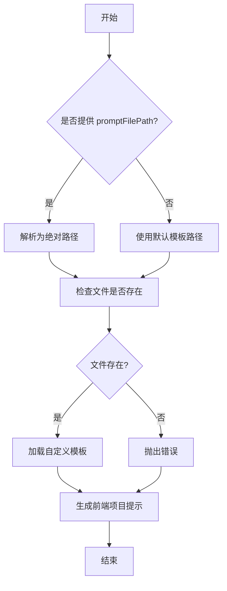
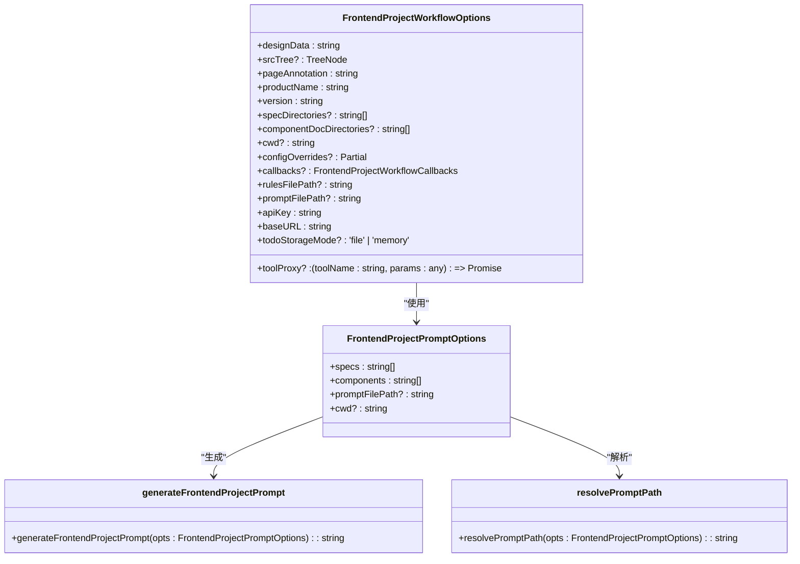
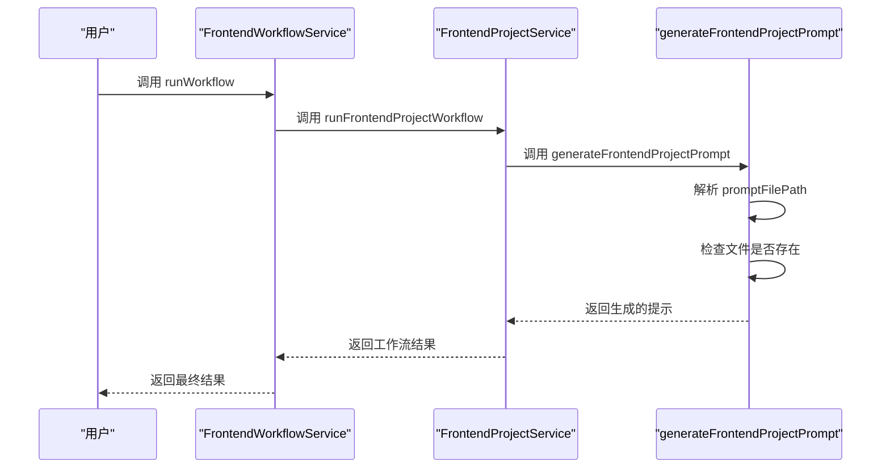
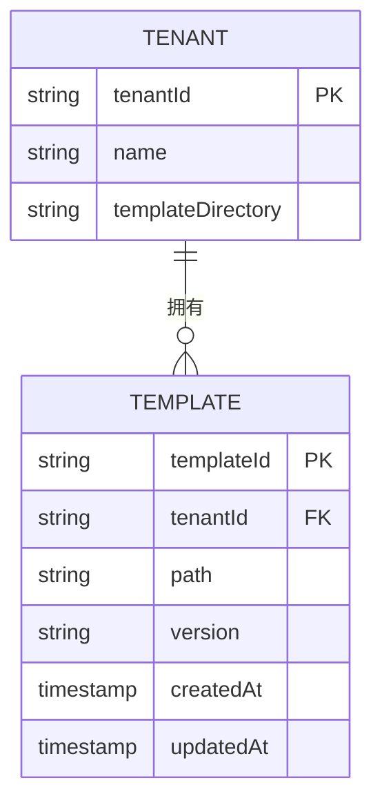

# 模板扩展

<cite>
**本文档中引用的文件**  
- [frontendProject.ts](file://fta-agent-core/src/prompts/frontendProject.ts)
- [frontendProjectService.ts](file://fta-agent-core/src/frontendProjectService.ts)
- [frontend-workflow.ts](file://code-agent-backend/src/service/code-agent/frontend-workflow.ts)
- [frontend-workflow.dto.ts](file://code-agent-backend/src/dto/code-agent/frontend-workflow.dto.ts)
- [frontend-workflow.controller.ts](file://code-agent-backend/src/controller/code-agent/frontend-workflow.ts)
- [frontend-project.md](file://fta-agent-core/src/prompts/frontend-project.md)
- [frontend-project-new.md](file://code-agent-backend/src/service/code-agent/fta-prompts/frontend-project-new.md)
</cite>

## 目录
1. [引言](#引言)
2. [自定义模板配置机制](#自定义模板配置机制)
3. [前端项目服务中的模板加载与安全检查](#前端项目服务中的模板加载与安全检查)
4. [高级用户最佳实践](#高级用户最佳实践)
5. [前端工作台中的UI配置](#前端工作台中的ui配置)
6. [多租户场景下的模板隔离方案](#多租户场景下的模板隔离方案)
7. [结论](#结论)

## 引言
本文档详细阐述了系统支持自定义需求文档模板的扩展机制。通过分析代码库，我们将深入探讨如何利用 `promptFilePath` 配置项来指定自定义模板路径，从而覆盖默认的 `frontend-project.md` 模板。文档还将描述在 `frontendProjectService` 中加载自定义模板时的安全性检查（如路径合法性验证）和回退机制。此外，为高级用户提供模板扩展的最佳实践，包括添加新的变量插值、集成项目特定的PRD规范要求，以及保持向后兼容性的版本管理策略。最后，结合代码示例展示在前端工作台中如何通过UI配置传递自定义模板路径，并讨论多租户场景下的模板隔离方案。

## 自定义模板配置机制
系统通过 `promptFilePath` 配置项实现对需求文档模板的自定义扩展。该机制允许用户指定一个自定义模板文件的路径，从而覆盖默认的 `frontend-project.md` 模板。

在 `frontendProjectService` 中，`FrontendProjectWorkflowOptions` 接口定义了 `promptFilePath` 作为可选参数。当调用 `runFrontendProjectWorkflow` 函数时，可以通过传入 `promptFilePath` 来指定自定义模板的路径。如果未提供此参数，则系统将使用默认模板。

**Diagram sources**
- [frontendProjectService.ts](file://fta-agent-core/src/frontendProjectService.ts#L32-L49)
- [frontendProject.ts](file://fta-agent-core/src/prompts/frontendProject.ts#L6-L11)

**Section sources**
- [frontendProjectService.ts](file://fta-agent-core/src/frontendProjectService.ts#L32-L49)
- [frontendProject.ts](file://fta-agent-core/src/prompts/frontendProject.ts#L6-L11)

## 前端项目服务中的模板加载与安全检查
在 `frontendProjectService` 中，模板的加载过程包含严格的安全性检查和回退机制。首先，`resolvePromptPath` 函数负责解析模板路径。如果提供了 `promptFilePath`，则将其转换为绝对路径；否则，使用默认的模板路径。

接下来，系统会检查指定路径的文件是否存在。如果文件不存在，将抛出一个错误，提示用户模板文件未找到。这种检查确保了只有有效的模板文件才能被加载，防止了潜在的安全风险。

此外，系统还实现了回退机制。如果用户提供的自定义模板路径无效或文件不存在，系统将自动回退到默认模板，确保工作流能够继续执行而不中断。

**Diagram sources**
- [frontendProjectService.ts](file://fta-agent-core/src/frontendProjectService.ts#L32-L49)
- [frontendProject.ts](file://fta-agent-core/src/prompts/frontendProject.ts#L6-L11)

**Section sources**
- [frontendProjectService.ts](file://fta-agent-core/src/frontendProjectService.ts#L32-L49)
- [frontendProject.ts](file://fta-agent-core/src/prompts/frontendProject.ts#L6-L11)

## 高级用户最佳实践
对于高级用户，模板扩展提供了极大的灵活性。以下是一些最佳实践：

1. **添加新的变量插值**：用户可以在自定义模板中添加新的变量插值，以便在生成需求文档时动态填充内容。例如，可以添加 `{{PROJECT_NAME}}` 和 `{{VERSION}}` 等变量，使模板更具通用性。

2. **集成项目特定的PRD规范要求**：通过自定义模板，用户可以将项目特定的PRD规范要求直接嵌入到模板中。这有助于确保生成的需求文档符合项目的具体标准和要求。

3. **保持向后兼容性的版本管理策略**：为了保持向后兼容性，建议采用版本管理策略。每次修改模板时，创建一个新的版本，并保留旧版本以供需要的项目使用。这样可以避免因模板更新而导致现有项目出现问题。

**Diagram sources**
- [frontend-workflow.ts](file://code-agent-backend/src/service/code-agent/frontend-workflow.ts#L74-L222)
- [frontendProjectService.ts](file://fta-agent-core/src/frontendProjectService.ts#L139-L348)
- [frontendProject.ts](file://fta-agent-core/src/prompts/frontendProject.ts#L24-L45)

**Section sources**
- [frontend-workflow.ts](file://code-agent-backend/src/service/code-agent/frontend-workflow.ts#L74-L222)
- [frontendProjectService.ts](file://fta-agent-core/src/frontendProjectService.ts#L139-L348)
- [frontendProject.ts](file://fta-agent-core/src/prompts/frontendProject.ts#L24-L45)

## 前端工作台中的UI配置
在前端工作台中，用户可以通过UI配置传递自定义模板路径。`FrontendWorkflowController` 提供了一个API端点 `/code-agent/frontend-workflow`，允许前端通过HTTP请求传递 `promptFilePath` 参数。

前端工作台的UI可以提供一个输入框，让用户输入自定义模板的路径。当用户提交请求时，前端将 `promptFilePath` 参数包含在请求体中发送给后端。后端接收到请求后，会根据提供的路径加载相应的模板，并执行后续的工作流。

**Diagram sources**
- [frontend-workflow.controller.ts](file://code-agent-backend/src/controller/code-agent/frontend-workflow.ts#L83-L367)
- [frontend-workflow.dto.ts](file://code-agent-backend/src/dto/code-agent/frontend-workflow.dto.ts#L21-L33)

**Section sources**
- [frontend-workflow.controller.ts](file://code-agent-backend/src/controller/code-agent/frontend-workflow.ts#L83-L367)
- [frontend-workflow.dto.ts](file://code-agent-backend/src/dto/code-agent/frontend-workflow.dto.ts#L21-L33)

## 多租户场景下的模板隔离方案
在多租户场景下，为了确保不同租户之间的模板隔离，系统可以为每个租户分配独立的模板存储目录。每个租户只能访问自己的模板目录，无法查看或修改其他租户的模板。

此外，系统可以在数据库中记录每个租户的模板配置信息，包括模板路径和版本号。当执行工作流时，系统会根据当前租户的身份信息查找对应的模板配置，并加载相应的模板。

通过这种方式，不仅可以实现模板的物理隔离，还可以方便地管理和追踪每个租户的模板使用情况，确保系统的安全性和稳定性。

**Diagram sources**
- [project.ts](file://code-agent-backend/src/entity/code-agent/project.ts#L115-L138)
- [frontend-workflow.dto.ts](file://code-agent-backend/src/dto/code-agent/frontend-workflow.dto.ts#L21-L33)

**Section sources**
- [project.ts](file://code-agent-backend/src/entity/code-agent/project.ts#L115-L138)
- [frontend-workflow.dto.ts](file://code-agent-backend/src/dto/code-agent/frontend-workflow.dto.ts#L21-L33)

## 结论
通过 `promptFilePath` 配置项，系统实现了对需求文档模板的灵活扩展。用户可以轻松指定自定义模板路径，覆盖默认模板，满足特定项目的需求。在 `frontendProjectService` 中，严格的路径合法性验证和回退机制确保了模板加载的安全性和可靠性。对于高级用户，提供了添加变量插值、集成PRD规范要求和版本管理的最佳实践。前端工作台通过UI配置支持自定义模板路径的传递，而多租户场景下的模板隔离方案则保证了不同租户之间的安全隔离。这些机制共同构成了一个强大且安全的模板扩展体系，为用户提供了一个高度可定制的需求文档生成环境。