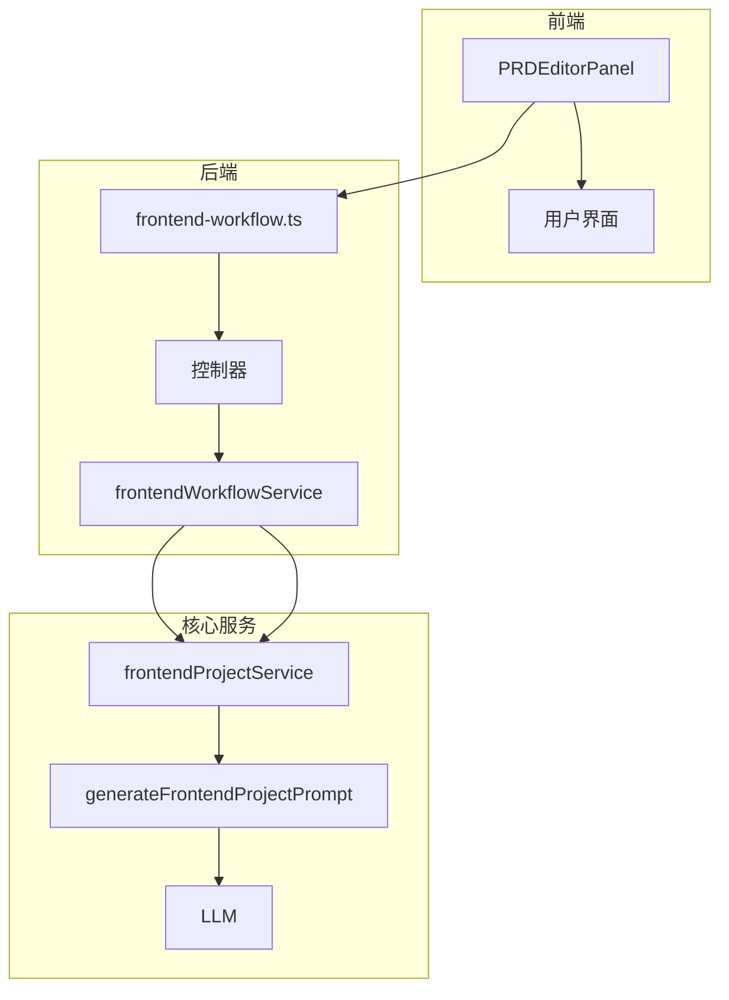
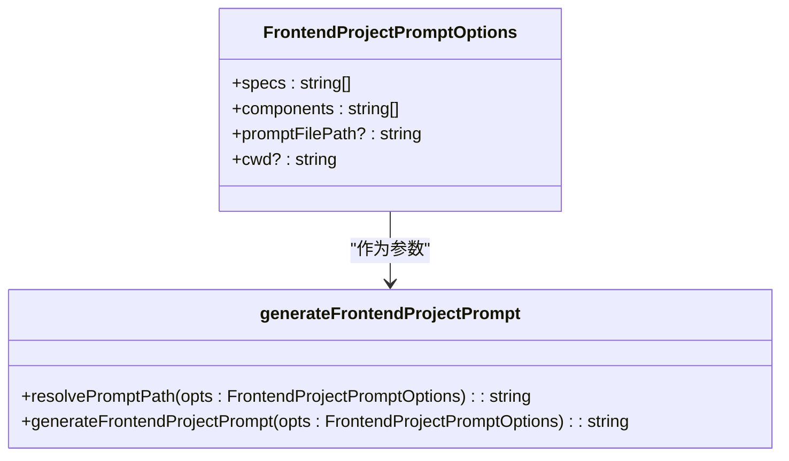
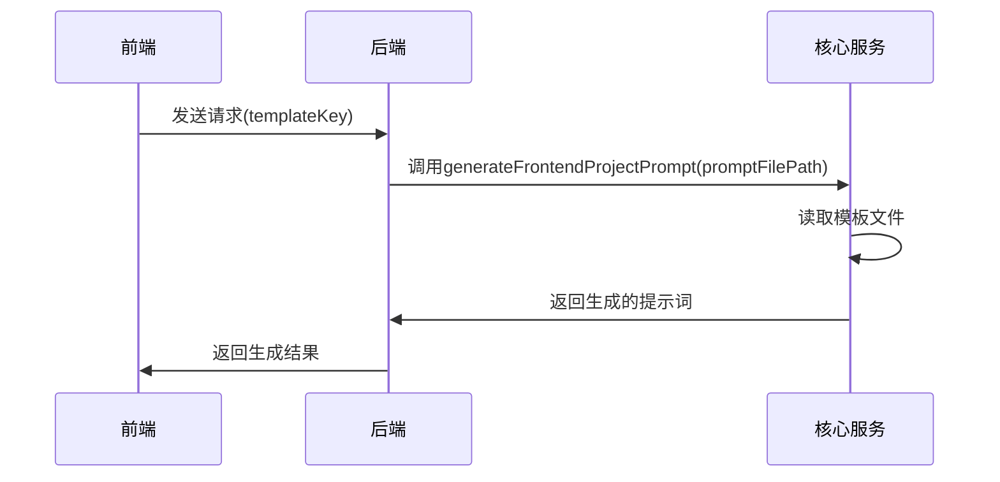
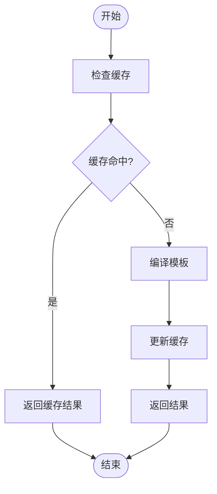
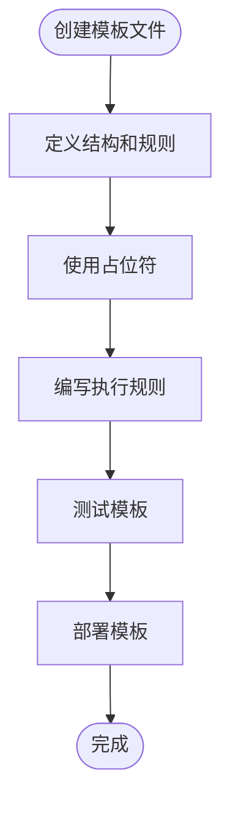
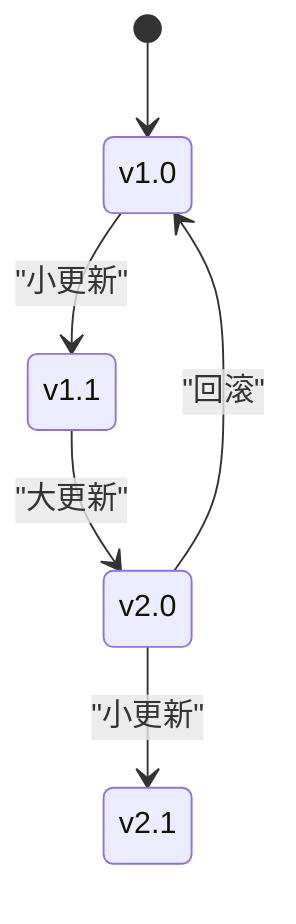
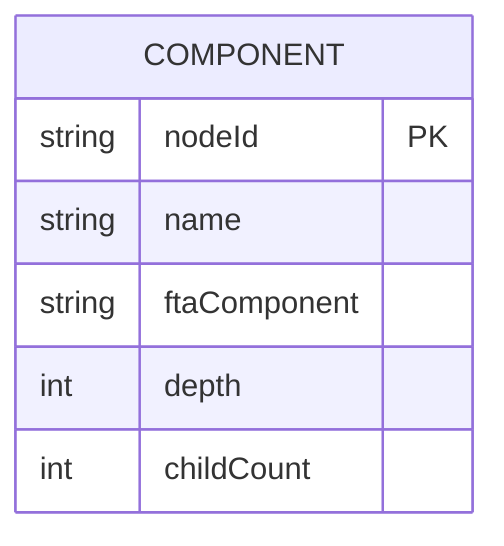

# 模板管理

<cite>
**本文档引用的文件**
- [frontendProject.ts](file://fta-agent-core/src/prompts/frontendProject.ts)
- [frontend-project.md](file://fta-agent-core/src/prompts/frontend-project.md)
- [frontend-project-new.md](file://code-agent-backend/src/service/code-agent/fta-prompts/frontend-project-new.md)
- [project.ts](file://code-agent-backend/src/service/code-agent/project.ts)
- [frontend-workflow.ts](file://code-agent-backend/src/service/code-agent/frontend-workflow.ts)
- [requirement-builder.ts](file://code-agent-backend/src/utils/design/requirement-builder.ts)
- [PRDEditorPanel.tsx](file://fta-layout-design/src/pages/EditorPage/components/PRDEditorPanel.tsx)
- [component-list.json](file://code-agent-backend/src/service/code-agent/fta-components/component-list.json)
- [style.md](file://code-agent-backend/src/service/code-agent/fta-specs/style.md)
- [directory.md](file://code-agent-backend/src/service/code-agent/fta-specs/directory.md)
</cite>

## 目录
1. [引言](#引言)
2. [模板引擎架构](#模板引擎架构)
3. [提示词模板结构设计](#提示词模板结构设计)
4. [模板选择与传递机制](#模板选择与传递机制)
5. [模板编译与缓存策略](#模板编译与缓存策略)
6. [自定义模板创建指南](#自定义模板创建指南)
7. [模板版本控制与向后兼容性](#模板版本控制与向后兼容性)
8. [实际应用示例](#实际应用示例)
9. [结论](#结论)

## 引言

本系统通过一个强大的模板引擎来支持多种产品需求文档（PRD）格式的输出。该引擎的核心是基于提示词（prompt）的模板系统，它能够将设计DSL（Domain Specific Language）和页面布局标注（Page Layout Annotation）转换为高质量的前端代码和需求文档。系统通过`frontendProject.ts`中的`generateFrontendProjectPrompt`函数实现模板的动态生成，利用变量插值、条件渲染和循环语法等机制，确保生成的文档和代码既符合企业规范又具有高度的灵活性。模板引擎不仅支持多种输出格式，还通过前后端的协同工作，实现了模板的动态选择和高效缓存，为开发者提供了强大的自定义能力。

## 模板引擎架构

系统模板引擎采用分层架构设计，由前端、后端和核心服务三部分组成。前端通过`PRDEditorPanel.tsx`组件提供用户界面，允许用户选择模板、编辑内容并触发文档生成。后端通过`frontend-workflow.ts`控制器接收前端请求，调用`frontendWorkflowService`执行工作流。核心服务`frontendProjectService.ts`负责模板的加载、编译和执行，通过`generateFrontendProjectPrompt`函数动态生成系统提示词，并调用LLM（大语言模型）生成最终的输出。整个流程通过SSE（Server-Sent Events）实现实时通信，确保用户能够及时获取生成进度和结果。



**图源**
- [PRDEditorPanel.tsx](file://fta-layout-design/src/pages/EditorPage/components/PRDEditorPanel.tsx)
- [frontend-workflow.ts](file://code-agent-backend/src/service/code-agent/frontend-workflow.ts)
- [frontendProjectService.ts](file://fta-agent-core/src/frontendProjectService.ts)

## 提示词模板结构设计

提示词模板的设计是系统的核心，它决定了生成文档和代码的质量。模板文件`frontend-project.md`和`frontend-project-new.md`定义了生成过程的规则和约束。模板通过`{{SPEC_LIST}}`和`{{FTA_COMPONENT_LIST}}`两个占位符实现变量插值，分别用于插入共享规范和可用组件列表。`generateFrontendProjectPrompt`函数读取模板文件，将占位符替换为实际内容，生成最终的系统提示词。

模板支持条件渲染和循环语法，通过JavaScript的`map`方法实现。例如，`opts.specs.map((spec) => `- ${spec}`).join('\n')`将规范列表转换为Markdown格式的列表项。如果规范列表为空，则显示默认提示。这种设计使得模板能够根据输入数据动态调整内容，确保生成的文档既完整又准确。



**图源**
- [frontendProject.ts](file://fta-agent-core/src/prompts/frontendProject.ts)
- [frontend-project.md](file://fta-agent-core/src/prompts/frontend-project.md)

## 模板选择与传递机制

模板选择和传递机制确保了系统能够根据不同的需求选择合适的模板。前端通过`templateKey`参数指定模板类型，该参数在`generateRequirementDoc`函数中被传递给后端。后端根据`templateKey`选择相应的模板文件，并将其路径传递给`generateFrontendProjectPrompt`函数。如果未指定`templateKey`，则使用默认模板`frontend-project.md`。

模板文件的路径通过`promptFilePath`参数传递，该参数可以是绝对路径或相对路径。`resolvePromptPath`函数负责解析路径，确保模板文件能够被正确加载。这种设计使得系统具有高度的灵活性，支持多种模板格式和自定义模板。



**图源**
- [requirement-builder.ts](file://code-agent-backend/src/utils/design/requirement-builder.ts)
- [frontendProject.ts](file://fta-agent-core/src/prompts/frontendProject.ts)

## 模板编译与缓存策略

系统采用高效的模板编译和缓存策略，以提高生成速度和性能。模板编译过程由`generateFrontendProjectPrompt`函数完成，该函数将模板文件中的占位符替换为实际内容，生成最终的系统提示词。编译后的提示词被缓存，避免重复编译相同的模板。

缓存策略基于模板文件的路径和内容。当模板文件被修改时，缓存将被清除，确保生成的文档始终基于最新的模板。此外，系统还支持内存缓存和文件缓存两种模式，开发者可以根据需要选择合适的缓存方式。



**图源**
- [frontendProject.ts](file://fta-agent-core/src/prompts/frontendProject.ts)
- [frontendProjectService.ts](file://fta-agent-core/src/frontendProjectService.ts)

## 自定义模板创建指南

为初学者提供自定义模板的创建指南，帮助他们快速上手。首先，创建一个新的模板文件，例如`custom-template.md`，并定义基本的结构和规则。然后，在模板中使用`{{SPEC_LIST}}`和`{{FTA_COMPONENT_LIST}}`占位符，以便动态插入规范和组件列表。接下来，编写详细的执行规则和输出期望，确保生成的文档符合企业标准。

在代码中，通过`templateKey`参数指定自定义模板，例如`templateKey: 'custom'`。系统将根据该参数选择相应的模板文件，并执行生成过程。开发者还可以通过`promptFilePath`参数指定模板文件的路径，实现更灵活的模板管理。



**图源**
- [frontend-project.md](file://fta-agent-core/src/prompts/frontend-project.md)
- [frontend-project-new.md](file://code-agent-backend/src/service/code-agent/fta-prompts/frontend-project-new.md)

## 模板版本控制与向后兼容性

模板版本控制是确保系统稳定性和向后兼容性的关键。每个模板文件都应包含版本信息，例如`version: 1.0`。当模板被修改时，版本号应相应更新。系统在加载模板时，会检查版本号，确保使用的是兼容的模板。

向后兼容性通过以下方式实现：首先，保留旧版本的模板文件，以便在需要时回滚。其次，新版本的模板应尽量保持与旧版本的兼容性，避免破坏现有功能。最后，提供详细的迁移指南，帮助开发者从旧版本迁移到新版本。



**图源**
- [frontend-project.md](file://fta-agent-core/src/prompts/frontend-project.md)
- [frontend-project-new.md](file://code-agent-backend/src/service/code-agent/fta-prompts/frontend-project-new.md)

## 实际应用示例

### 组件表格生成逻辑

在生成需求文档时，系统会自动创建组件表格，列出页面中使用的所有组件。`requirement-builder.ts`中的`extractAnnotationNodes`函数负责提取标注节点，生成组件列表。每个节点包含`nodeId`、`name`、`ftaComponent`、`depth`和`childCount`等信息。这些信息被格式化为Markdown表格，插入到文档中。



**图源**
- [requirement-builder.ts](file://code-agent-backend/src/utils/design/requirement-builder.ts)

### 数据模型引用渲染方式

系统支持在文档中引用数据模型和REST API。`frontend-workflow.ts`中的`formatDataContext`函数负责格式化数据上下文，将数据模型和API信息转换为文本格式。数据模型以TypeScript接口的形式展示，API则列出名称、描述、URL和关联的数据模型。这些信息被插入到文档中，帮助开发者理解数据结构和接口定义。

```mermaid
classDiagram
class DataModel {
+name : string
+description : string
+tsContent : string
}
class RestApi {
+name : string
+description : string
+url : string
+requestModelIds : string[]
+responseModelIds : string[]
}
DataModel ||--o{ RestApi : "引用"
```

**图源**
- [frontend-workflow.ts](file://code-agent-backend/src/service/code-agent/frontend-workflow.ts)

## 结论

本系统通过一个灵活且强大的模板引擎，实现了多种PRD文档格式的输出。`frontendProject.ts`中的提示词模板设计，结合变量插值、条件渲染和循环语法，确保了生成文档的高质量和一致性。模板选择和传递机制，以及编译和缓存策略，为开发者提供了高效的自定义能力。通过详细的版本控制和向后兼容性措施，系统能够稳定地支持不断变化的需求。未来，可以进一步优化模板引擎，支持更多格式和更复杂的逻辑，为开发者提供更强大的工具。