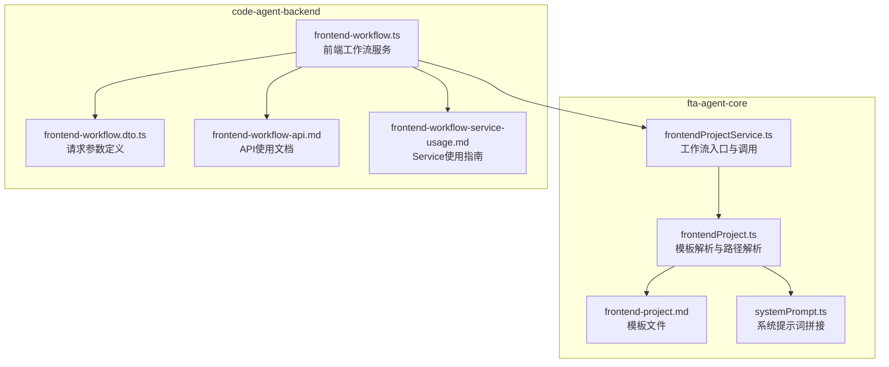
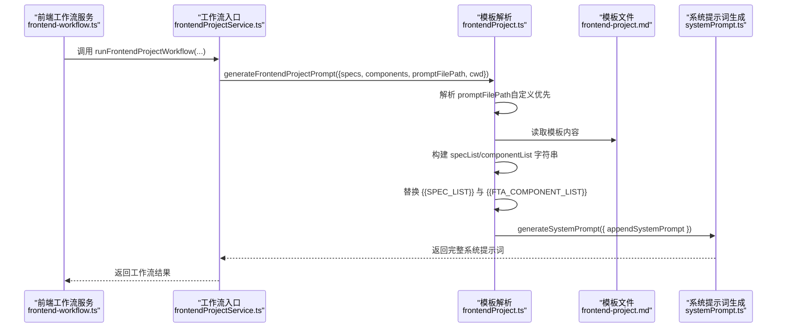
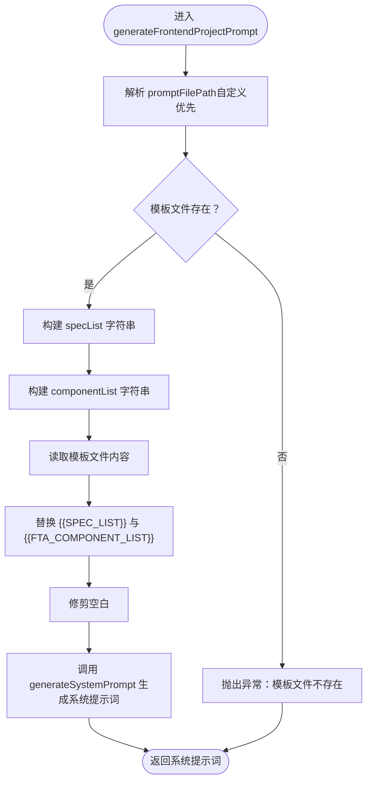
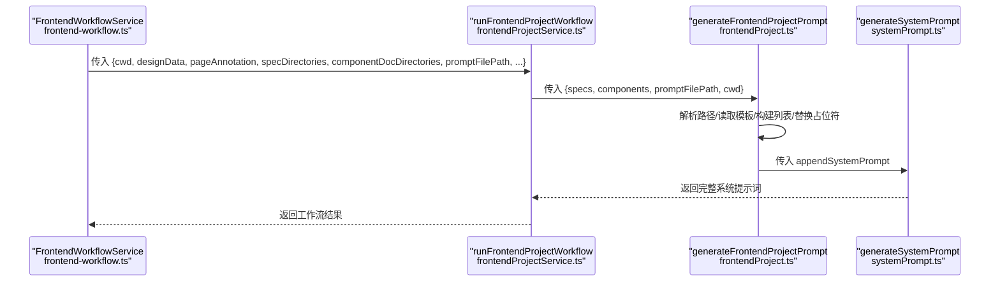
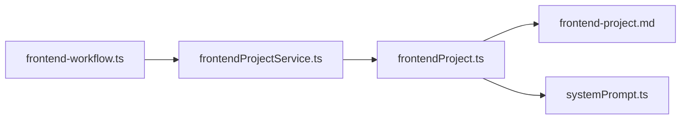

# 模板解析

<cite>
**本文引用的文件**
- [frontendProject.ts](file://fta-agent-core/src/prompts/frontendProject.ts)
- [frontend-project.md](file://fta-agent-core/src/prompts/frontend-project.md)
- [systemPrompt.ts](file://fta-agent-core/src/prompts/systemPrompt.ts)
- [frontendProjectService.ts](file://fta-agent-core/src/frontendProjectService.ts)
- [frontendProjectService.test.ts](file://fta-agent-core/src/frontendProjectService.test.ts)
- [frontend-workflow.ts](file://code-agent-backend/src/service/code-agent/frontend-workflow.ts)
- [frontend-workflow.dto.ts](file://code-agent-backend/src/dto/code-agent/frontend-workflow.dto.ts)
- [frontend-workflow-api.md](file://code-agent-backend/docs/frontend-workflow-api.md)
- [frontend-workflow-service-usage.md](file://code-agent-backend/docs/frontend-workflow-service-usage.md)
</cite>

## 目录
1. [简介](#简介)
2. [项目结构](#项目结构)
3. [核心组件](#核心组件)
4. [架构总览](#架构总览)
5. [详细组件分析](#详细组件分析)
6. [依赖关系分析](#依赖关系分析)
7. [性能考量](#性能考量)
8. [故障排查指南](#故障排查指南)
9. [结论](#结论)
10. [附录](#附录)

## 简介
本文围绕“需求文档模板解析机制”，深入解析 generateFrontendProjectPrompt 如何将原始模板与运行时数据结合，完成从接收 specs 和 components 参数，到构建 specList 和 componentList 字符串，再到通过字符串替换完成模板填充的全过程。同时说明 promptFilePath 参数在前后端协作中的传递路径与解析优先级（自定义路径优先于默认路径），并提供实际调用示例、错误处理机制（如模板文件不存在时的异常抛出），以及模板缓存策略的可能性与性能优化建议。

## 项目结构
本主题涉及的关键文件分布在两个子模块：
- fta-agent-core：模板解析与系统提示词生成的核心实现
- code-agent-backend：前端工作流服务，负责准备参数并触发模板生成

图表来源
- [frontendProject.ts](file://fta-agent-core/src/prompts/frontendProject.ts#L1-L47)
- [frontend-project.md](file://fta-agent-core/src/prompts/frontend-project.md#L1-L40)
- [systemPrompt.ts](file://fta-agent-core/src/prompts/systemPrompt.ts#L63-L117)
- [frontendProjectService.ts](file://fta-agent-core/src/frontendProjectService.ts#L139-L230)
- [frontend-workflow.ts](file://code-agent-backend/src/service/code-agent/frontend-workflow.ts#L74-L222)
- [frontend-workflow.dto.ts](file://code-agent-backend/src/dto/code-agent/frontend-workflow.dto.ts#L1-L60)
- [frontend-workflow-api.md](file://code-agent-backend/docs/frontend-workflow-api.md#L1-L280)
- [frontend-workflow-service-usage.md](file://code-agent-backend/docs/frontend-workflow-service-usage.md#L1-L244)

章节来源
- [frontendProject.ts](file://fta-agent-core/src/prompts/frontendProject.ts#L1-L47)
- [frontendProjectService.ts](file://fta-agent-core/src/frontendProjectService.ts#L139-L230)
- [frontend-workflow.ts](file://code-agent-backend/src/service/code-agent/frontend-workflow.ts#L74-L222)

## 核心组件
- 模板解析函数 generateFrontendProjectPrompt
  - 负责解析 promptFilePath（自定义优先），读取模板文件，构建 specList 与 componentList，并进行字符串替换，最终调用系统提示词生成器拼接完整系统提示词。
- 系统提示词生成器 generateSystemPrompt
  - 将模板片段与固定系统指令拼接，形成最终的系统提示词。
- 前端工作流服务 FrontendWorkflowService
  - 在后端侧准备工作目录、组装设计数据与标注摘要、调用核心工作流引擎，并将模板路径等参数传入。

章节来源
- [frontendProject.ts](file://fta-agent-core/src/prompts/frontendProject.ts#L1-L47)
- [systemPrompt.ts](file://fta-agent-core/src/prompts/systemPrompt.ts#L63-L117)
- [frontend-workflow.ts](file://code-agent-backend/src/service/code-agent/frontend-workflow.ts#L74-L222)

## 架构总览
从前端工作流服务到模板解析与系统提示词生成的整体流程如下：

图表来源
- [frontend-workflow.ts](file://code-agent-backend/src/service/code-agent/frontend-workflow.ts#L174-L222)
- [frontendProjectService.ts](file://fta-agent-core/src/frontendProjectService.ts#L139-L230)
- [frontendProject.ts](file://fta-agent-core/src/prompts/frontendProject.ts#L1-L47)
- [frontend-project.md](file://fta-agent-core/src/prompts/frontend-project.md#L1-L40)
- [systemPrompt.ts](file://fta-agent-core/src/prompts/systemPrompt.ts#L63-L117)

## 详细组件分析

### 模板解析流程详解：generateFrontendProjectPrompt
- 输入参数
  - specs：字符串数组，代表可用规范列表
  - components：字符串数组，代表可用组件列表
  - promptFilePath：可选，自定义模板文件路径；若提供则优先使用
  - cwd：可选，工作目录，用于解析相对路径
- 路径解析优先级
  - 若传入 promptFilePath：
    - 若为绝对路径，直接使用
    - 若为相对路径，则基于 cwd 解析为绝对路径
  - 若未传入 promptFilePath：使用内置模板文件 frontend-project.md 的相对路径
- 列表构建
  - specList：将 specs 数组逐项转为带前缀的条目，用换行拼接；若为空，使用占位提示
  - componentList：同上，针对 components
- 模板填充
  - 读取模板文件内容
  - 依次替换占位符：{{SPEC_LIST}} 与 {{FTA_COMPONENT_LIST}}
  - 对结果进行修剪
- 最终输出
  - 将填充后的模板作为 appendSystemPrompt，交由 generateSystemPrompt 生成完整系统提示词

图表来源
- [frontendProject.ts](file://fta-agent-core/src/prompts/frontendProject.ts#L1-L47)
- [frontend-project.md](file://fta-agent-core/src/prompts/frontend-project.md#L1-L40)
- [systemPrompt.ts](file://fta-agent-core/src/prompts/systemPrompt.ts#L63-L117)

章节来源
- [frontendProject.ts](file://fta-agent-core/src/prompts/frontendProject.ts#L1-L47)
- [frontend-project.md](file://fta-agent-core/src/prompts/frontend-project.md#L1-L40)

### 前端工作流服务如何准备参数并触发模板生成
- 前端工作流服务在 runWorkflow 中：
  - 获取设计 DSL 与标注摘要，组合为 pageAnnotation
  - 准备工作目录 cwd
  - 组装设计数据 designData
  - 调用 runFrontendProjectWorkflow，并传入：
    - specDirectories、componentDocDirectories、promptFilePath、rulesFilePath、configOverrides、callbacks、apiKey、baseURL 等
- 在工作流内部：
  - 通过 generateFrontendProjectPrompt 构造系统提示词
  - 之后进入循环执行与文件草稿生成

图表来源
- [frontend-workflow.ts](file://code-agent-backend/src/service/code-agent/frontend-workflow.ts#L174-L222)
- [frontendProjectService.ts](file://fta-agent-core/src/frontendProjectService.ts#L139-L230)
- [frontendProject.ts](file://fta-agent-core/src/prompts/frontendProject.ts#L1-L47)
- [systemPrompt.ts](file://fta-agent-core/src/prompts/systemPrompt.ts#L63-L117)

章节来源
- [frontend-workflow.ts](file://code-agent-backend/src/service/code-agent/frontend-workflow.ts#L174-L222)
- [frontendProjectService.ts](file://fta-agent-core/src/frontendProjectService.ts#L220-L230)

### 错误处理机制
- 模板文件不存在
  - 当 resolvePromptPath 解析出的路径对应的文件不存在时，抛出异常，提示“Prompt file not found”
  - 前端工作流服务在调用 runFrontendProjectWorkflow 时捕获异常并返回标准化错误结构
- 模型配置缺失
  - 前端工作流服务在 runWorkflow 中对 apiKey/baseURL 进行校验，缺失时报错并返回
- 中断信号
  - 前端工作流服务在多个回调中检查 signal.aborted，若检测到则抛出 AbortError

章节来源
- [frontendProject.ts](file://fta-agent-core/src/prompts/frontendProject.ts#L24-L28)
- [frontend-workflow.ts](file://code-agent-backend/src/service/code-agent/frontend-workflow.ts#L78-L95)
- [frontend-workflow.ts](file://code-agent-backend/src/service/code-agent/frontend-workflow.ts#L195-L218)

### 实际调用示例
- 前端工作流服务调用
  - 在 runWorkflow 中，通过 runFrontendProjectWorkflow 传入 promptFilePath、specDirectories、componentDocDirectories 等参数
  - 示例调用位置参考：[frontend-workflow.ts](file://code-agent-backend/src/service/code-agent/frontend-workflow.ts#L174-L222)
- 单元测试中的调用
  - 在测试中直接调用 runFrontendProjectWorkflow，并显式指定 promptFilePath
  - 示例调用位置参考：[frontendProjectService.test.ts](file://fta-agent-core/src/frontendProjectService.test.ts#L125-L147)

章节来源
- [frontend-workflow.ts](file://code-agent-backend/src/service/code-agent/frontend-workflow.ts#L174-L222)
- [frontendProjectService.test.ts](file://fta-agent-core/src/frontendProjectService.test.ts#L125-L147)

### 模板缓存策略与性能优化建议
- 缓存策略
  - 模板文件读取：当前实现每次都会读取模板文件，建议在高频场景下对模板内容进行内存缓存，避免重复 IO
  - 列表构建：specs 与 components 通常来自外部注册表，可在调用前进行去重与排序，减少模板替换开销
  - 路径解析：resolvePromptPath 可缓存 cwd 与绝对路径映射，降低路径解析成本
- 性能优化
  - 模板替换：当前使用多次字符串替换，建议在模板较大时采用更高效的替换策略（如正则预编译或一次性替换）
  - I/O 优化：模板文件尽量放置在本地磁盘且路径稳定，避免频繁跨盘符访问
  - 并发与批处理：在批量生成场景下，可并发读取多个模板文件并统一替换，减少等待时间

[本节为通用建议，不直接分析具体文件，故无章节来源]

## 依赖关系分析
- 模块间依赖
  - frontendProjectService.ts 依赖 generateFrontendProjectPrompt
  - generateFrontendProjectPrompt 依赖 systemPrompt.ts 生成最终系统提示词
  - code-agent-backend 的 frontend-workflow.ts 作为入口，调用 runFrontendProjectWorkflow 并传入 promptFilePath 等参数
- 关键耦合点
  - promptFilePath 的解析与传递链路清晰，自定义路径优先，避免硬编码
  - 系统提示词生成器仅负责拼接，职责单一，便于扩展

图表来源
- [frontend-workflow.ts](file://code-agent-backend/src/service/code-agent/frontend-workflow.ts#L174-L222)
- [frontendProjectService.ts](file://fta-agent-core/src/frontendProjectService.ts#L139-L230)
- [frontendProject.ts](file://fta-agent-core/src/prompts/frontendProject.ts#L1-L47)
- [systemPrompt.ts](file://fta-agent-core/src/prompts/systemPrompt.ts#L63-L117)

章节来源
- [frontendProjectService.ts](file://fta-agent-core/src/frontendProjectService.ts#L139-L230)
- [frontendProject.ts](file://fta-agent-core/src/prompts/frontendProject.ts#L1-L47)
- [systemPrompt.ts](file://fta-agent-core/src/prompts/systemPrompt.ts#L63-L117)
- [frontend-workflow.ts](file://code-agent-backend/src/service/code-agent/frontend-workflow.ts#L174-L222)

## 性能考量
- 模板大小与替换次数：模板越大、替换占位符越多，字符串替换成本越高
- 文件系统访问：频繁读取同一模板文件会产生 IO 压力，建议引入缓存
- 内存占用：大量列表拼接可能产生中间字符串，注意内存峰值控制
- 并发场景：多会话并发时，需考虑模板读取与替换的并发安全与资源竞争

[本节为通用指导，不直接分析具体文件，故无章节来源]

## 故障排查指南
- 模板文件不存在
  - 现象：抛出“Prompt file not found”异常
  - 排查：确认 promptFilePath 是否为绝对路径或相对于 cwd 的正确路径；检查文件是否存在
  - 参考位置：[frontendProject.ts](file://fta-agent-core/src/prompts/frontendProject.ts#L24-L28)
- 模型配置缺失
  - 现象：返回“缺少必需的模型配置参数”错误
  - 排查：确认请求参数或配置文件是否提供 apiKey 与 baseURL
  - 参考位置：[frontend-workflow.ts](file://code-agent-backend/src/service/code-agent/frontend-workflow.ts#L78-L95)
- 中断信号导致的 AbortError
  - 现象：在消息或文本回调中检测到中断信号，抛出 AbortError
  - 排查：检查调用方是否设置了 signal.aborted
  - 参考位置：[frontend-workflow.ts](file://code-agent-backend/src/service/code-agent/frontend-workflow.ts#L195-L218)

章节来源
- [frontendProject.ts](file://fta-agent-core/src/prompts/frontendProject.ts#L24-L28)
- [frontend-workflow.ts](file://code-agent-backend/src/service/code-agent/frontend-workflow.ts#L78-L95)
- [frontend-workflow.ts](file://code-agent-backend/src/service/code-agent/frontend-workflow.ts#L195-L218)

## 结论
generateFrontendProjectPrompt 通过明确的路径解析优先级（自定义路径优先）、稳定的列表构建与字符串替换流程，将原始模板与运行时数据无缝整合，最终生成系统提示词。前端工作流服务在后端侧负责参数准备与调用，保证了前后端协作的一致性与可控性。建议在高频场景下引入模板缓存与替换优化，以进一步提升性能与稳定性。

[本节为总结性内容，不直接分析具体文件，故无章节来源]

## 附录
- API 使用文档与 Service 使用指南
  - API 文档：[frontend-workflow-api.md](file://code-agent-backend/docs/frontend-workflow-api.md#L1-L280)
  - Service 使用指南：[frontend-workflow-service-usage.md](file://code-agent-backend/docs/frontend-workflow-service-usage.md#L1-L244)
- 请求参数定义
  - DTO 定义：[frontend-workflow.dto.ts](file://code-agent-backend/src/dto/code-agent/frontend-workflow.dto.ts#L1-L60)

章节来源
- [frontend-workflow-api.md](file://code-agent-backend/docs/frontend-workflow-api.md#L1-L280)
- [frontend-workflow-service-usage.md](file://code-agent-backend/docs/frontend-workflow-service-usage.md#L1-L244)
- [frontend-workflow.dto.ts](file://code-agent-backend/src/dto/code-agent/frontend-workflow.dto.ts#L1-L60)