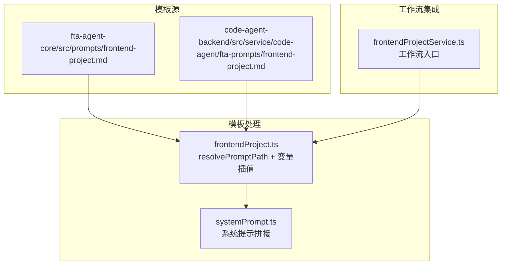
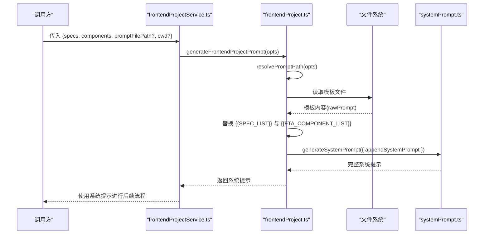
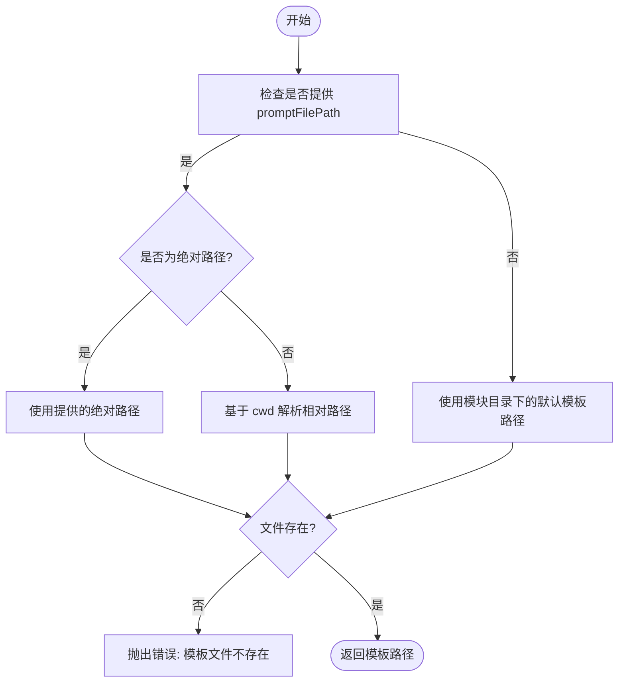
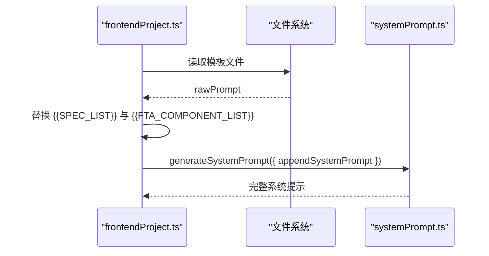
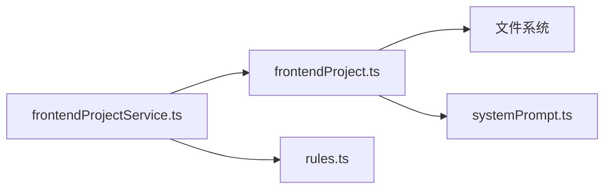

# 模板设计

<cite>
**本文引用的文件**
- [frontend-project.md（核心模板）](file://fta-agent-core/src/prompts/frontend-project.md)
- [frontend-project.md（后端模板）](file://code-agent-backend/src/service/code-agent/fta-prompts/frontend-project.md)
- [frontendProject.ts（模板加载与变量插值）](file://fta-agent-core/src/prompts/frontendProject.ts)
- [systemPrompt.ts（系统提示拼接）](file://fta-agent-core/src/prompts/systemPrompt.ts)
- [frontendProjectService.ts（工作流集成）](file://fta-agent-core/src/frontendProjectService.ts)
- [read.ts（安全读取工具）](file://fta-agent-core/src/tools/read.ts)
- [rules.ts（规则加载）](file://fta-agent-core/src/rules.ts)
- [requirement-builder.ts（需求文档生成）](file://code-agent-backend/src/utils/design/requirement-builder.ts)
</cite>

## 目录
1. [引言](#引言)
2. [项目结构](#项目结构)
3. [核心组件](#核心组件)
4. [架构总览](#架构总览)
5. [详细组件分析](#详细组件分析)
6. [依赖关系分析](#依赖关系分析)
7. [性能考量](#性能考量)
8. [故障排查指南](#故障排查指南)
9. [结论](#结论)
10. [附录](#附录)

## 引言
本文围绕需求文档模板设计展开，重点解析前端项目模板文件 frontend-project.md 的结构设计与变量插值机制，说明如何通过占位符实现动态内容注入，描述模板中条件渲染与列表循环的实现逻辑，并给出自定义模板的设计规范与最佳实践。同时结合代码示例展示模板文件的加载路径解析过程（resolvePromptPath）与默认模板 fallback 机制，并讨论模板安全性考虑，如防止路径遍历攻击的最佳实践。

## 项目结构
本仓库涉及两类前端项目模板：
- 核心模板：位于 fta-agent-core，作为默认模板，提供通用的前端项目生成指导与占位符。
- 后端模板：位于 code-agent-backend，面向具体业务场景，包含更丰富的项目结构、组件组织与样式规范。

图表来源
- [frontend-project.md（核心模板）](file://fta-agent-core/src/prompts/frontend-project.md#L1-L40)
- [frontend-project.md（后端模板）](file://code-agent-backend/src/service/code-agent/fta-prompts/frontend-project.md#L1-L185)
- [frontendProject.ts（模板加载与变量插值）](file://fta-agent-core/src/prompts/frontendProject.ts#L1-L46)
- [systemPrompt.ts（系统提示拼接）](file://fta-agent-core/src/prompts/systemPrompt.ts#L64-L116)
- [frontendProjectService.ts（工作流集成）](file://fta-agent-core/src/frontendProjectService.ts#L203-L230)

章节来源
- [frontend-project.md（核心模板）](file://fta-agent-core/src/prompts/frontend-project.md#L1-L40)
- [frontend-project.md（后端模板）](file://code-agent-backend/src/service/code-agent/fta-prompts/frontend-project.md#L1-L185)
- [frontendProject.ts（模板加载与变量插值）](file://fta-agent-core/src/prompts/frontendProject.ts#L1-L46)
- [systemPrompt.ts（系统提示拼接）](file://fta-agent-core/src/prompts/systemPrompt.ts#L64-L116)
- [frontendProjectService.ts（工作流集成）](file://fta-agent-core/src/frontendProjectService.ts#L203-L230)

## 核心组件
- 模板文件：包含占位符 {{SPEC_LIST}} 与 {{FTA_COMPONENT_LIST}}，用于动态注入规范列表与组件列表。
- 模板加载与插值：resolvePromptPath 解析模板路径；generateFrontendProjectPrompt 读取模板并进行变量替换。
- 系统提示拼接：generateSystemPrompt 将模板内容拼接到系统提示中。
- 工作流集成：frontendProjectService 调用模板生成函数，传入 specs 与 components 列表。

章节来源
- [frontend-project.md（核心模板）](file://fta-agent-core/src/prompts/frontend-project.md#L35-L40)
- [frontendProject.ts（模板加载与变量插值）](file://fta-agent-core/src/prompts/frontendProject.ts#L15-L46)
- [systemPrompt.ts（系统提示拼接）](file://fta-agent-core/src/prompts/systemPrompt.ts#L64-L116)
- [frontendProjectService.ts（工作流集成）](file://fta-agent-core/src/frontendProjectService.ts#L203-L230)

## 架构总览
模板从“加载路径解析”到“变量插值”，再到“系统提示拼接”的完整链路如下：

图表来源
- [frontendProject.ts（模板加载与变量插值）](file://fta-agent-core/src/prompts/frontendProject.ts#L15-L46)
- [systemPrompt.ts（系统提示拼接）](file://fta-agent-core/src/prompts/systemPrompt.ts#L64-L116)
- [frontendProjectService.ts（工作流集成）](file://fta-agent-core/src/frontendProjectService.ts#L203-L230)

## 详细组件分析

### 模板结构与占位符设计
- 占位符位置
  - 规范列表占位符：位于“Available Specs”区域，用于注入 specs 列表。
  - 组件列表占位符：位于“FTA Component List”区域，用于注入组件清单。
- 列表渲染策略
  - 当 specs 或 components 为空时，模板中提供默认占位语句，确保输出可读性。
  - 插值侧会将数组元素映射为带前缀的条目列表，便于 LLM 在提示中直接引用。
- 条件渲染
  - 通过判断数组长度决定是否输出默认占位语句，避免空列表导致的提示缺失。

章节来源
- [frontend-project.md（核心模板）](file://fta-agent-core/src/prompts/frontend-project.md#L35-L40)
- [frontend-project.md（后端模板）](file://code-agent-backend/src/service/code-agent/fta-prompts/frontend-project.md#L180-L185)
- [frontendProject.ts（模板加载与变量插值）](file://fta-agent-core/src/prompts/frontendProject.ts#L29-L43)

### 加载路径解析与默认模板 fallback
- resolvePromptPath 逻辑
  - 若显式传入 promptFilePath，则优先使用绝对路径；否则相对 cwd 解析。
  - 若未传入 promptFilePath，则回退到模块所在目录的默认模板路径。
- 错误处理
  - 若最终解析的路径不存在，抛出明确错误，便于定位问题。
- 默认模板
  - 核心模板作为默认 fallback，保证即使外部未指定模板路径也能正常运行。

图表来源
- [frontendProject.ts（模板加载与变量插值）](file://fta-agent-core/src/prompts/frontendProject.ts#L15-L28)

章节来源
- [frontendProject.ts（模板加载与变量插值）](file://fta-agent-core/src/prompts/frontendProject.ts#L15-L28)

### 变量插值与系统提示拼接
- 插值步骤
  - 读取模板内容后，按顺序替换两个占位符。
  - 对结果进行 trim，避免多余空白影响提示质量。
- 系统提示拼接
  - 将插值后的模板内容作为 appendSystemPrompt 传入 generateSystemPrompt，最终形成完整系统提示。

图表来源
- [frontendProject.ts（模板加载与变量插值）](file://fta-agent-core/src/prompts/frontendProject.ts#L39-L46)
- [systemPrompt.ts（系统提示拼接）](file://fta-agent-core/src/prompts/systemPrompt.ts#L64-L116)

章节来源
- [frontendProject.ts（模板加载与变量插值）](file://fta-agent-core/src/prompts/frontendProject.ts#L39-L46)
- [systemPrompt.ts（系统提示拼接）](file://fta-agent-core/src/prompts/systemPrompt.ts#L64-L116)

### 工作流集成与参数传递
- 前端项目工作流
  - 从 spec 目录与组件文档目录收集数据，生成 specs 与 components 列表。
  - 调用 generateFrontendProjectPrompt，传入 promptFilePath 与 cwd，确保模板路径可控。
- 规则加载
  - 通过 rules.ts 递归向上查找项目规则文件，支持全局与项目级规则叠加。

章节来源
- [frontendProjectService.ts（工作流集成）](file://fta-agent-core/src/frontendProjectService.ts#L203-L230)
- [rules.ts（规则加载）](file://fta-agent-core/src/rules.ts#L1-L32)

### 自定义模板设计规范
- 推荐章节结构
  - 项目概述与目标
  - 执行守则与工具策略
  - 输出期望与输入说明
  - 运行时输入与可用规范
  - 可用组件清单
- Markdown 语法约定
  - 使用清晰的标题层级与有序/无序列表，便于 LLM 结构化理解。
  - 在占位符前后添加必要的说明文字，提升上下文连贯性。
- 与 generateFrontendProjectPrompt 的集成
  - 显式传入 promptFilePath 与 cwd，确保模板路径解析可控。
  - 保持占位符命名一致（如 {{SPEC_LIST}}、{{FTA_COMPONENT_LIST}}），便于插值。
- 列表循环与条件渲染
  - 在模板中为列表留出固定区块，配合插值侧的数组映射策略，确保输出稳定。
  - 提供空列表的默认占位语句，避免提示缺失。

章节来源
- [frontend-project.md（核心模板）](file://fta-agent-core/src/prompts/frontend-project.md#L1-L40)
- [frontend-project.md（后端模板）](file://code-agent-backend/src/service/code-agent/fta-prompts/frontend-project.md#L1-L185)
- [frontendProject.ts（模板加载与变量插值）](file://fta-agent-core/src/prompts/frontendProject.ts#L29-L43)
- [frontendProjectService.ts（工作流集成）](file://fta-agent-core/src/frontendProjectService.ts#L203-L230)

### 模板安全性与路径遍历防护
- 路径解析安全
  - resolvePromptPath 仅在显式提供 promptFilePath 时进行路径解析；若未提供则使用模块内默认模板，避免外部输入直接参与路径拼接。
- 文件访问安全
  - read.ts 工具对文件路径进行严格校验，防止路径遍历攻击（例如通过绝对路径或相对路径穿越）。
  - 对图片与文本文件分别处理，限制最大读取行数与单行长度，降低内存与令牌消耗风险。
- 最佳实践建议
  - 模板路径尽量通过配置项显式传入，避免用户输入直接参与路径解析。
  - 对外部输入的路径进行白名单校验与规范化处理。
  - 在生产环境启用严格的权限控制与沙箱策略，限制模板文件的读取范围。

章节来源
- [frontendProject.ts（模板加载与变量插值）](file://fta-agent-core/src/prompts/frontendProject.ts#L15-L28)
- [read.ts（安全读取工具）](file://fta-agent-core/src/tools/read.ts#L132-L149)
- [read.ts（安全读取工具）](file://fta-agent-core/src/tools/read.ts#L151-L155)

## 依赖关系分析
- 模块耦合
  - frontendProject.ts 与 systemPrompt.ts 强耦合：前者负责模板与变量，后者负责系统提示拼接。
  - frontendProjectService.ts 与 frontendProject.ts 弱耦合：通过函数调用传递参数，便于测试与替换。
- 外部依赖
  - 文件系统读写：用于模板与规则文件的读取。
  - 规则加载：递归向上查找项目规则文件，支持全局与项目级规则叠加。

图表来源
- [frontendProjectService.ts（工作流集成）](file://fta-agent-core/src/frontendProjectService.ts#L203-L230)
- [frontendProject.ts（模板加载与变量插值）](file://fta-agent-core/src/prompts/frontendProject.ts#L15-L46)
- [systemPrompt.ts（系统提示拼接）](file://fta-agent-core/src/prompts/systemPrompt.ts#L64-L116)
- [rules.ts（规则加载）](file://fta-agent-core/src/rules.ts#L1-L32)

章节来源
- [frontendProjectService.ts（工作流集成）](file://fta-agent-core/src/frontendProjectService.ts#L203-L230)
- [frontendProject.ts（模板加载与变量插值）](file://fta-agent-core/src/prompts/frontendProject.ts#L15-L46)
- [systemPrompt.ts（系统提示拼接）](file://fta-agent-core/src/prompts/systemPrompt.ts#L64-L116)
- [rules.ts（规则加载）](file://fta-agent-core/src/rules.ts#L1-L32)

## 性能考量
- 模板读取与插值
  - 模板文件体积较小，读取与字符串替换开销极低，无需额外优化。
- LLM 输入长度控制
  - 通过限制列表长度与默认占位语句，避免过长提示导致 token 消耗过高。
- 规则加载
  - 递归向上查找规则文件，建议合理设置全局配置目录，减少不必要的磁盘扫描。

[本节为通用性能讨论，不直接分析具体文件]

## 故障排查指南
- 模板文件不存在
  - 现象：resolvePromptPath 解析后文件不存在，抛出错误。
  - 处理：确认 promptFilePath 是否正确，或移除该参数以使用默认模板。
- 占位符未被替换
  - 现象：模板中仍保留 {{SPEC_LIST}} 或 {{FTA_COMPONENT_LIST}}。
  - 处理：检查 generateFrontendProjectPrompt 的插值逻辑与数组是否为空。
- 路径遍历攻击
  - 现象：读取文件时报错“路径穿越”。
  - 处理：确保传入的文件路径在 cwd 内，避免使用 ../ 等相对路径穿越。

章节来源
- [frontendProject.ts（模板加载与变量插值）](file://fta-agent-core/src/prompts/frontendProject.ts#L25-L28)
- [read.ts（安全读取工具）](file://fta-agent-core/src/tools/read.ts#L132-L149)

## 结论
本文系统梳理了前端项目模板的设计与实现，明确了占位符插值、路径解析与系统提示拼接的关键流程，并给出了自定义模板的设计规范与安全实践建议。通过将模板路径显式传入与严格的路径校验，可在保证灵活性的同时有效规避安全风险。

[本节为总结性内容，不直接分析具体文件]

## 附录
- 需求文档模板参考
  - 后端模板中包含丰富的章节与规范，可作为自定义模板的参考结构。
- Markdown 生成工具
  - requirement-builder.ts 展示了如何生成结构化的 Markdown 内容，可借鉴其章节组织与表格生成思路。

章节来源
- [frontend-project.md（后端模板）](file://code-agent-backend/src/service/code-agent/fta-prompts/frontend-project.md#L1-L185)
- [requirement-builder.ts（需求文档生成）](file://code-agent-backend/src/utils/design/requirement-builder.ts#L83-L121)