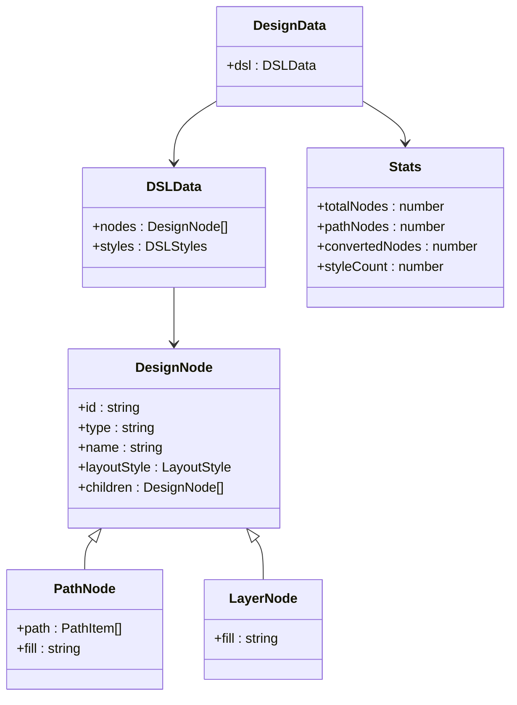
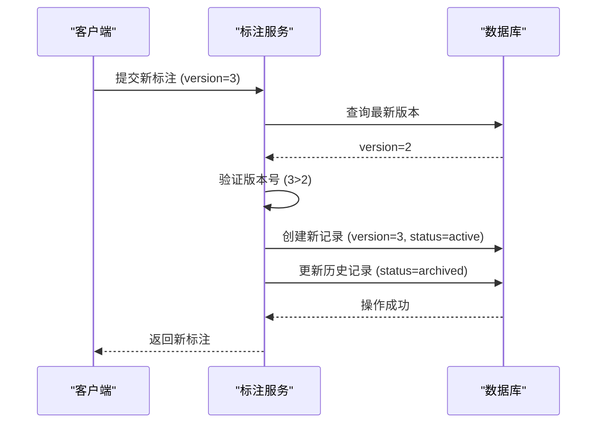
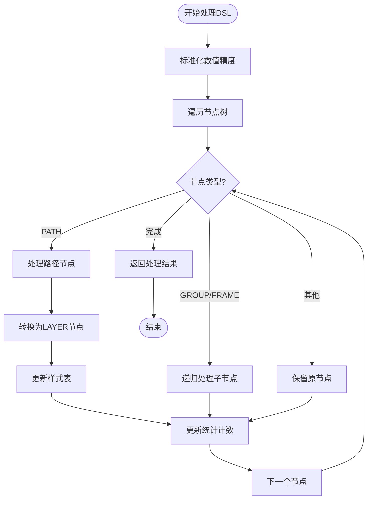
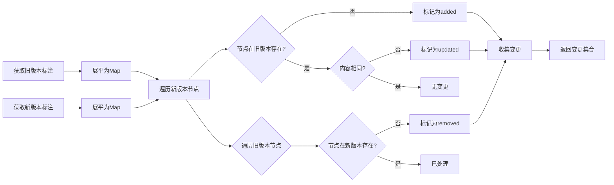

# 变更追踪

<cite>
**本文档引用文件**  
- [design-dsl.ts](file://shared-types/src/dsl.ts)
- [design-dsl.service.ts](file://code-agent-backend/src/service/code-agent/design-dsl.ts)
- [component-annotation.service.ts](file://code-agent-backend/src/service/design/component-annotation.service.ts)
- [component-annotation.dto.ts](file://code-agent-backend/src/dto/design/component-annotation.dto.ts)
- [component-annotation.ts](file://code-agent-backend/src/entity/design/component-annotation.ts)
- [requirement-builder.ts](file://code-agent-backend/src/utils/design/requirement-builder.ts)
- [requirement-builder.test.ts](file://code-agent-backend/test/utils/requirement-builder.test.ts)
- [requirementDoc.ts](file://fta-layout-design/src/pages/EditorPage/utils/requirementDoc.ts)
</cite>

## 目录
1. [变更追踪系统概述](#变更追踪系统概述)
2. [Stats统计对象的作用与结构](#stats统计对象的作用与结构)
3. [版本变更与标注协议](#版本变更与标注协议)
4. [变更数据的收集与聚合逻辑](#变更数据的收集与聚合逻辑)
5. [变更日志的结构设计与存储方式](#变更日志的结构设计与存储方式)
6. [变更差异计算算法解析](#变更差异计算算法解析)
7. [性能优化与内存控制策略](#性能优化与内存控制策略)
8. [测试用例中的变更验证](#测试用例中的变更验证)
9. [变更数据的应用与趋势分析](#变更数据的应用与趋势分析)

## 变更追踪系统概述

变更追踪系统是设计文档生命周期管理的核心组件，负责记录设计稿从创建到迭代的全过程。系统通过版本化标注（Annotation）机制，对设计文档的组件增删改进行精确追踪，并通过统计对象（stats）量化变更信息。该系统支持需求文档的自动生成、版本对比、变更审计等功能，为团队协作和研发流程提供数据支持。

系统主要由三个核心模块构成：设计DSL处理服务、组件标注服务和需求文档生成器。设计DSL处理服务负责解析和转换设计稿的底层数据结构；组件标注服务管理标注版本的创建、存储和查询；需求文档生成器则基于最新标注生成可读的需求规格文档。

**Section sources**
- [design-dsl.service.ts](file://code-agent-backend/src/service/code-agent/design-dsl.ts#L1-L474)
- [component-annotation.service.ts](file://code-agent-backend/src/service/design/component-annotation.service.ts#L1-L264)
- [requirement-builder.ts](file://code-agent-backend/src/utils/design/requirement-builder.ts#L1-L122)

## Stats统计对象的作用与结构

Stats统计对象是变更追踪系统中的核心数据聚合单元，用于记录和量化设计文档的变更信息。该对象在设计DSL处理过程中被创建和填充，包含节点数量、路径转换状态、样式使用情况等关键指标。

统计对象的主要字段包括：
- `totalNodes`：设计文档中所有节点的总数
- `pathNodes`：类型为PATH的节点数量
- `convertedNodes`：已成功转换为图片的PATH节点数量
- `styleCount`：文档中使用的样式总数

这些统计信息不仅用于监控设计稿的复杂度变化，还作为需求文档生成和代码骨架生成的重要依据。例如，在需求文档中会明确标注“DSL 修订号：${design.dslRevision} （节点数：${nodeCount}）”，为团队提供直观的演化趋势参考。



**Diagram sources**
- [design-dsl.ts](file://shared-types/src/dsl.ts#L141-L143)
- [design-dsl.service.ts](file://code-agent-backend/src/service/code-agent/design-dsl.ts#L437-L471)

**Section sources**
- [design-dsl.service.ts](file://code-agent-backend/src/service/code-agent/design-dsl.ts#L437-L471)
- [res.ts](file://code-agent-backend/src/dto/design-dsl/res.ts#L20-L25)

## 版本变更与标注协议

系统采用基于版本号的标注协议来管理设计文档的变更历史。每个标注记录包含一个自增的版本号（version）和一个协议版本号（schemaVersion），确保变更的可追溯性和兼容性。

版本号（version）是一个自增的整数，由服务端在创建新标注时自动生成。当用户提交新标注时，系统会检查是否存在同版本号的记录，若存在且未设置强制覆盖标志（force），则会拒绝请求以防止冲突。协议版本号（schemaVersion）则用于标识标注数据结构的版本，支持向后兼容的协议演进。

标注记录的状态分为“active”（活跃）和“archived”（归档）两种。每次创建新版本的标注时，系统会自动将历史版本标记为归档，确保任何时候只有一个活跃版本。这种设计简化了客户端的查询逻辑，使其无需处理多个活跃版本的复杂情况。



**Diagram sources**
- [component-annotation.service.ts](file://code-agent-backend/src/service/design/component-annotation.service.ts#L107-L185)
- [component-annotation.ts](file://code-agent-backend/src/entity/design/component-annotation.ts#L26-L28)

**Section sources**
- [component-annotation.service.ts](file://code-agent-backend/src/service/design/component-annotation.service.ts#L107-L185)
- [component-annotation.ts](file://code-agent-backend/src/entity/design/component-annotation.ts#L26-L41)

## 变更数据的收集与聚合逻辑

变更数据的收集始于设计DSL的处理过程。当系统接收到新的设计稿数据时，`DesignDSLService`会调用`processDesignDSL`方法进行处理。该方法首先对数值进行精度标准化，然后递归遍历所有节点，将PATH类型的节点转换为LAYER节点。

在节点遍历过程中，系统通过`getDSLStats`方法收集统计信息。该方法使用深度优先遍历算法，对每个节点进行分类计数。对于PATH节点，系统会检查其是否包含有效的路径数据（data），若有则计入`convertedNodes`计数。同时，系统还会统计样式表（styles）的大小，作为`styleCount`的值。

统计信息的聚合是实时完成的，与DSL处理过程同步进行。这意味着每次设计稿的变更都会立即生成最新的统计快照，确保数据的时效性。这些统计信息随后会被包含在API响应中，供前端展示或用于后续处理。



**Diagram sources**
- [design-dsl.service.ts](file://code-agent-backend/src/service/code-agent/design-dsl.ts#L407-L420)
- [design-dsl.service.ts](file://code-agent-backend/src/service/code-agent/design-dsl.ts#L437-L471)

**Section sources**
- [design-dsl.service.ts](file://code-agent-backend/src/service/code-agent/design-dsl.ts#L407-L471)

## 变更日志的结构设计与存储方式

变更日志以组件标注（Component Annotation）的形式存储，每个标注记录代表设计文档在某一时刻的完整状态快照。日志数据存储在MongoDB数据库中，集合名为`design_component_annotations`，并通过Redis进行缓存以提高查询性能。

每个标注记录的核心结构包括：
- `designId`：关联的设计稿ID
- `version`：自增版本号
- `rootAnnotation`：根节点标注树结构
- `expandedKeys`：展开的节点ID列表
- `schemaVersion`：标注协议版本号
- `status`：状态（active/archived）
- `createdBy/updatedBy`：创建/修改人
- `userId/gitId`：所属用户/Git仓库ID
- `createdAt/updatedAt`：创建/更新时间

系统采用两级缓存策略：首先将最新版本的标注缓存在Redis中，键名为`design:annotations:{designId}`；其次为每个版本号创建独立缓存，键名为`design:annotations:{designId}:{version}`。这种设计既保证了最新数据的快速访问，又支持历史版本的高效查询。

**Section sources**
- [component-annotation.service.ts](file://code-agent-backend/src/service/design/component-annotation.service.ts#L57-L74)
- [component-annotation.ts](file://code-agent-backend/src/entity/design/component-annotation.ts#L6-L72)

## 变更差异计算算法解析

系统提供`diffAnnotations`接口用于计算两个版本标注之间的差异。该算法采用基于节点ID的比较策略，通过以下步骤实现高效的变更检测：

1. 同时获取指定的两个版本标注
2. 使用`flattenAnnotation`方法将树形结构展平为以节点ID为键的Map
3. 遍历新版本的节点Map，与旧版本进行对比
4. 根据节点存在性和内容差异确定变更类型

算法的时间复杂度为O(n+m)，其中n和m分别为两个版本的节点总数。通过展平树结构，避免了复杂的递归比较，显著提升了性能。变更类型分为三种：
- `added`：在新版本中新增的节点
- `removed`：在新版本中删除的节点
- `updated`：在新版本中内容发生变化的节点

差异计算结果以`DiffChangeSetItem`数组的形式返回，每个条目包含节点ID、变更类型和详细变更信息，为用户提供精确的变更定位。



**Diagram sources**
- [component-annotation.service.ts](file://code-agent-backend/src/service/design/component-annotation.service.ts#L217-L261)
- [component-annotation.dto.ts](file://code-agent-backend/src/dto/design/component-annotation.dto.ts#L69-L82)

**Section sources**
- [component-annotation.service.ts](file://code-agent-backend/src/service/design/component-annotation.service.ts#L217-L261)

## 性能优化与内存控制策略

面对大规模设计文档的变更追踪需求，系统实施了多项性能优化和内存控制策略：

1. **缓存分层**：采用Redis+MongoDB的两级存储架构，热点数据存储在内存中，冷数据落盘，平衡性能与成本。
2. **数据展平**：在差异计算前将树形结构展平为Map，将查找时间从O(n)降低到O(1)，大幅提升比较效率。
3. **流式处理**：需求文档生成采用SSE（Server-Sent Events）流式传输，避免大文档生成时的内存堆积。
4. **版本归档**：自动将历史版本标记为归档，减少活跃数据集的大小，优化查询性能。
5. **TTL管理**：为Redis缓存设置合理的过期时间（默认30分钟），防止缓存无限增长。

对于超大规模变更场景，建议客户端采用分页查询和增量同步策略，避免一次性加载过多数据。同时，系统提供了统计信息API，允许客户端先获取摘要信息，再决定是否加载完整数据。

**Section sources**
- [component-annotation.service.ts](file://code-agent-backend/src/service/design/component-annotation.service.ts#L57-L74)
- [requirementDoc.ts](file://fta-layout-design/src/pages/EditorPage/utils/requirementDoc.ts#L13-L136)

## 测试用例中的变更验证

系统通过单元测试确保变更追踪功能的正确性。在`requirement-builder.test.ts`中，测试用例验证了需求文档生成器对变更数据的正确处理：

```typescript
it("should generate markdown with component table", () => {
  const design: any = {
    _id: "design-001",
    name: "登录页面",
    dslRevision: 2,
    dslData: { nodes: [{ id: "n1" }, { id: "n2" }] },
  };

  const annotation: any = {
    version: 3,
    rootAnnotation: {
      id: "root",
      children: [
        { id: "btn-1", name: "提交按钮", ftaComponent: "Button", children: [] },
      ],
    },
  };

  const result = generateRequirementMarkdown({ design, annotation });

  expect(result.stats.componentCount).toBe(2);
  expect(result.stats.annotationVersion).toBe(3);
});
```

该测试验证了统计对象中的`componentCount`和`annotationVersion`字段能够正确反映设计文档的变更状态。通过断言这些关键字段的值，确保系统在版本升级和组件变更时能够准确更新统计信息。

**Section sources**
- [requirement-builder.test.ts](file://code-agent-backend/test/utils/requirement-builder.test.ts#L1-L43)
- [requirement-builder.ts](file://code-agent-backend/src/utils/design/requirement-builder.ts#L78-L121)

## 变更数据的应用与趋势分析

变更数据不仅用于版本管理和差异对比，还可作为产品演化的分析依据。通过长期收集和分析`stats`对象中的指标，可以得出以下洞察：

1. **复杂度趋势**：`totalNodes`的增长曲线反映设计稿的复杂度演变，帮助团队识别过度设计的风险。
2. **技术债监控**：`convertedNodes/totalNodes`的比例显示向量化元素的处理进度，低比例可能意味着技术债积累。
3. **迭代频率**：版本号的递增速度体现团队的迭代节奏，结合`updatedAt`可分析开发效率。
4. **组件复用率**：通过分析`ftaComponent`字段的分布，评估组件库的复用效果。

这些分析结果可集成到项目管理仪表板中，为产品决策提供数据支持。例如，当发现某页面的节点数在短时间内急剧增加时，可及时组织设计评审，避免架构腐化。

**Section sources**
- [requirement-builder.ts](file://code-agent-backend/src/utils/design/requirement-builder.ts#L87-L110)
- [requirement-builder.test.ts](file://code-agent-backend/test/utils/requirement-builder.test.ts#L37-L38)