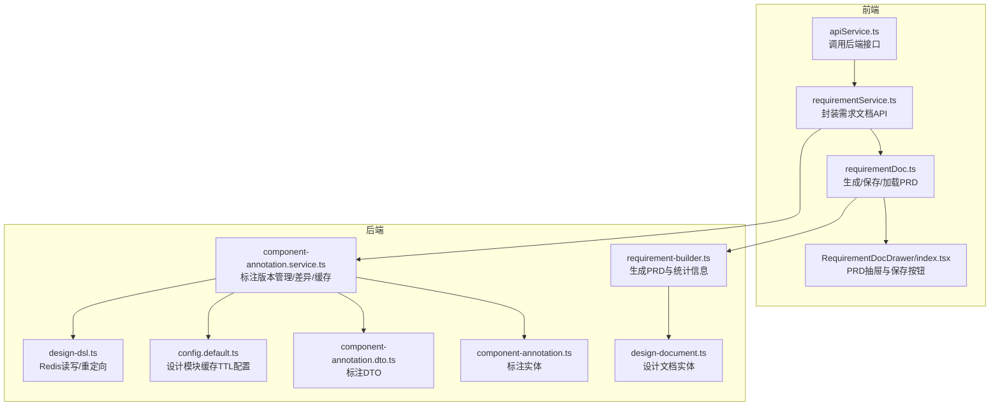
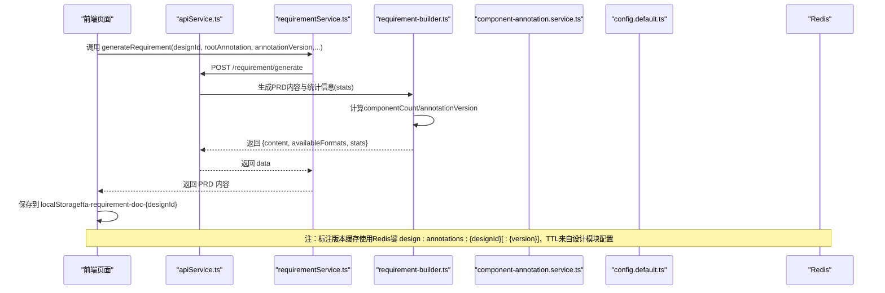
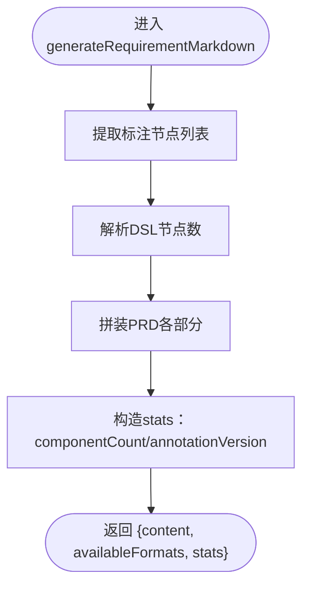
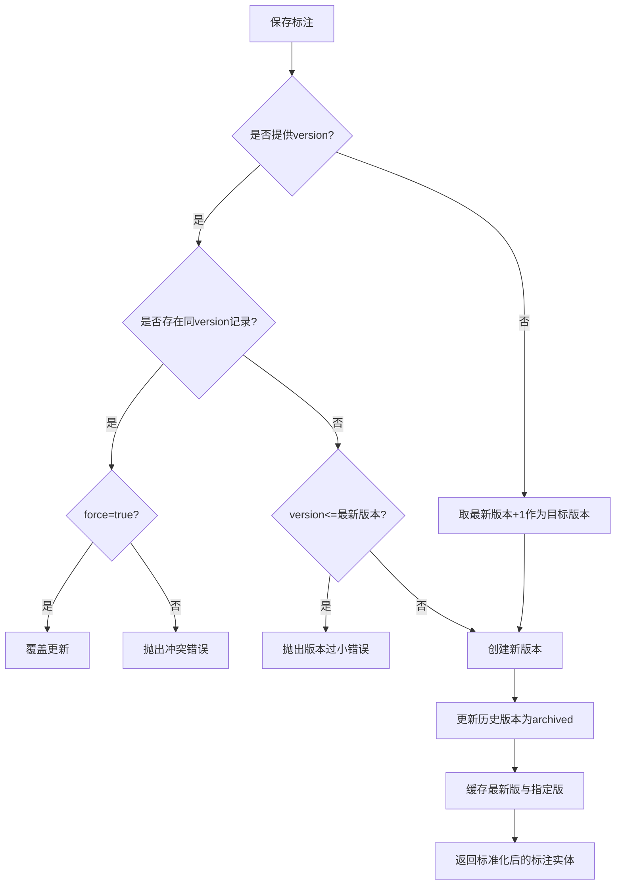
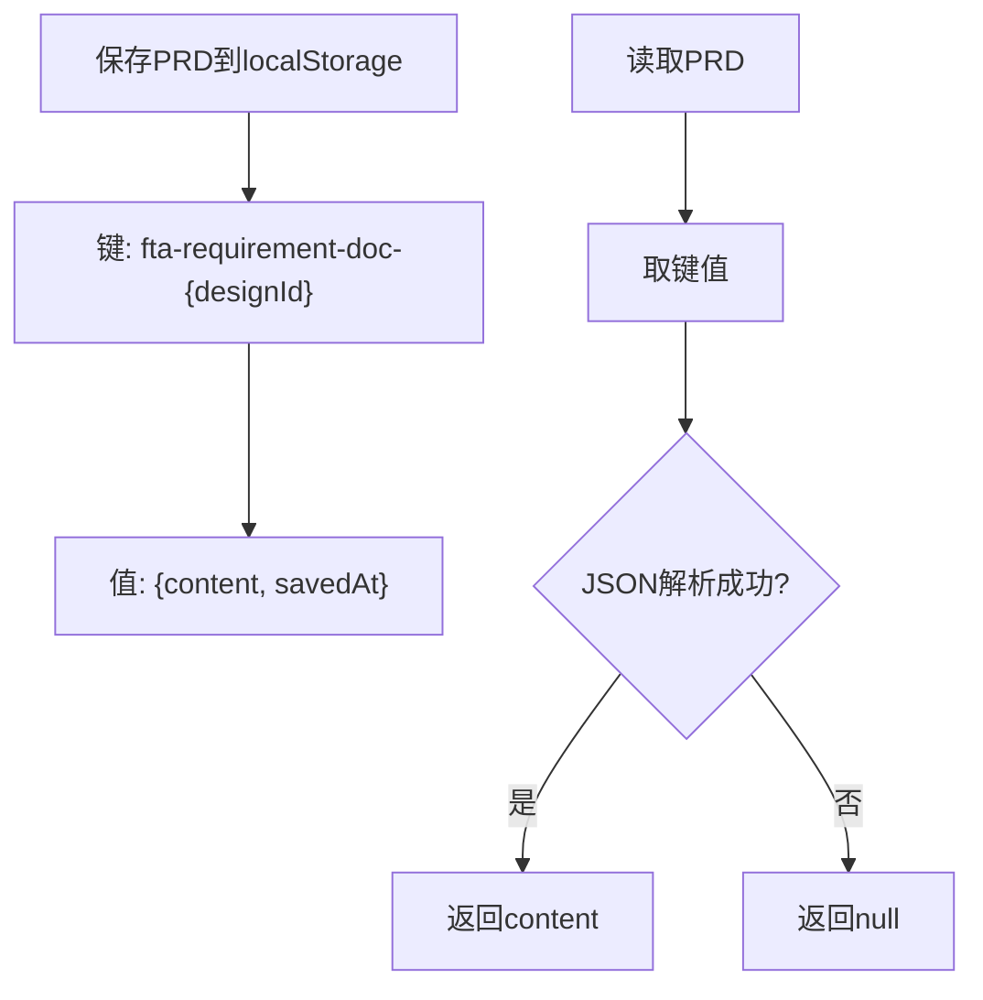
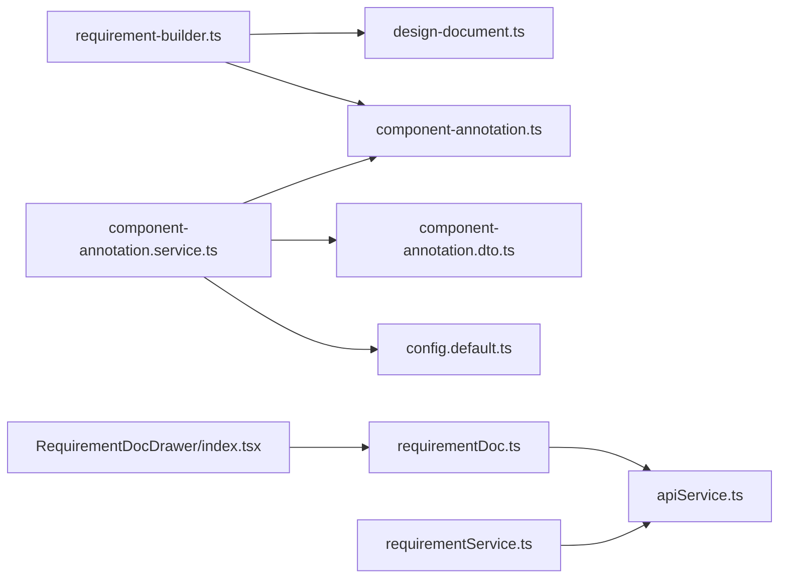

# 版本控制

<cite>
**本文引用的文件**
- [requirement-builder.ts](file://code-agent-backend/src/utils/design/requirement-builder.ts)
- [requirement-builder.test.ts](file://code-agent-backend/test/utils/requirement-builder.test.ts)
- [component-annotation.service.ts](file://code-agent-backend/src/service/design/component-annotation.service.ts)
- [component-annotation.ts](file://code-agent-backend/src/entity/design/component-annotation.ts)
- [design-document.ts](file://code-agent-backend/src/entity/design/design-document.ts)
- [component-annotation.dto.ts](file://code-agent-backend/src/dto/design/component-annotation.dto.ts)
- [config.default.ts](file://code-agent-backend/src/config/config.default.ts)
- [requirementDoc.ts](file://fta-layout-design/src/pages/EditorPage/utils/requirementDoc.ts)
- [RequirementDocDrawer/index.tsx](file://fta-layout-design/src/pages/EditorPage/components/RequirementDocDrawer/index.tsx)
- [requirementService.ts](file://fta-layout-design/src/services/requirementService.ts)
- [apiService.ts](file://fta-layout-design/src/utils/apiService.ts)
- [design-dsl.ts](file://code-agent-backend/src/service/code-agent/design-dsl.ts)
</cite>

## 目录
1. [引言](#引言)
2. [项目结构](#项目结构)
3. [核心组件](#核心组件)
4. [架构总览](#架构总览)
5. [详细组件分析](#详细组件分析)
6. [依赖关系分析](#依赖关系分析)
7. [性能考量](#性能考量)
8. [故障排查指南](#故障排查指南)
9. [结论](#结论)
10. [附录](#附录)

## 引言
本文件围绕需求文档版本控制进行系统性梳理，重点解释以下方面：
- 如何通过 requirement-builder.ts 生成 PRD 文档并产出统计信息（stats），其中包含标注版本与组件数量；
- 组件标注版本（annotationVersion）与文档版本的关系与映射；
- 前端 localStorage 的文档缓存结构与过期策略；
- 初学者操作指南：如何进行版本对比；
- 高级开发者视角：版本号生成规则、缓存键生成规则、分布式环境下版本同步与冲突处理；
- 结合测试用例中的断言与缓存键规则，给出实践参考。

## 项目结构
本项目涉及前后端协同：
- 后端负责设计文档与组件标注的持久化、版本控制、差异计算与缓存；
- 前端负责需求文档生成、渲染、保存到本地缓存以及触发代码生成。

图表来源
- [requirementDoc.ts](file://fta-layout-design/src/pages/EditorPage/utils/requirementDoc.ts#L1-L235)
- [RequirementDocDrawer/index.tsx](file://fta-layout-design/src/pages/EditorPage/components/RequirementDocDrawer/index.tsx#L1-L105)
- [requirementService.ts](file://fta-layout-design/src/services/requirementService.ts#L1-L88)
- [apiService.ts](file://fta-layout-design/src/utils/apiService.ts#L628-L678)
- [requirement-builder.ts](file://code-agent-backend/src/utils/design/requirement-builder.ts#L1-L122)
- [component-annotation.service.ts](file://code-agent-backend/src/service/design/component-annotation.service.ts#L1-L264)
- [component-annotation.ts](file://code-agent-backend/src/entity/design/component-annotation.ts#L1-L73)
- [design-document.ts](file://code-agent-backend/src/entity/design/design-document.ts#L1-L108)
- [component-annotation.dto.ts](file://code-agent-backend/src/dto/design/component-annotation.dto.ts#L1-L93)
- [config.default.ts](file://code-agent-backend/src/config/config.default.ts#L192-L204)
- [design-dsl.ts](file://code-agent-backend/src/service/code-agent/design-dsl.ts#L122-L211)

章节来源
- [requirement-builder.ts](file://code-agent-backend/src/utils/design/requirement-builder.ts#L1-L122)
- [component-annotation.service.ts](file://code-agent-backend/src/service/design/component-annotation.service.ts#L1-L264)
- [requirementDoc.ts](file://fta-layout-design/src/pages/EditorPage/utils/requirementDoc.ts#L1-L235)

## 核心组件
- 需求文档生成器（requirement-builder.ts）
  - 输入：设计文档实体与组件标注实体
  - 输出：PRD 内容、可用格式数组、统计信息（componentCount、annotationVersion）
  - 统计信息来源：遍历标注树节点，统计节点数量；标注版本来自标注实体
- 组件标注服务（component-annotation.service.ts）
  - 版本管理：自动生成或强制覆盖指定版本；历史版本归档；最新版本激活
  - 差异计算：按节点ID扁平化两版标注树，比较新增/删除/更新
  - 缓存策略：Redis 缓存最新版与指定版本；支持 TTL；失败降级
- 实体与DTO
  - DesignComponentAnnotationEntity：标注版本、状态、schemaVersion、expandedKeys 等
  - DesignDocumentEntity：设计文档基本信息、DSL 修订号、摘要等
  - SaveDesignAnnotationBody/DiffDesignAnnotationQuery：标注保存与差异查询参数
- 前端缓存与交互
  - requirementDoc.ts：生成PRD、保存到 localStorage、从 localStorage 加载
  - RequirementDocDrawer/index.tsx：保存按钮、保存并执行按钮
  - requirementService.ts 与 apiService.ts：封装后端接口调用

章节来源
- [requirement-builder.ts](file://code-agent-backend/src/utils/design/requirement-builder.ts#L1-L122)
- [component-annotation.service.ts](file://code-agent-backend/src/service/design/component-annotation.service.ts#L108-L263)
- [component-annotation.ts](file://code-agent-backend/src/entity/design/component-annotation.ts#L1-L73)
- [design-document.ts](file://code-agent-backend/src/entity/design/design-document.ts#L1-L108)
- [component-annotation.dto.ts](file://code-agent-backend/src/dto/design/component-annotation.dto.ts#L1-L93)
- [requirementDoc.ts](file://fta-layout-design/src/pages/EditorPage/utils/requirementDoc.ts#L1-L235)
- [RequirementDocDrawer/index.tsx](file://fta-layout-design/src/pages/EditorPage/components/RequirementDocDrawer/index.tsx#L1-L105)
- [requirementService.ts](file://fta-layout-design/src/services/requirementService.ts#L1-L88)
- [apiService.ts](file://fta-layout-design/src/utils/apiService.ts#L628-L678)

## 架构总览
下面以序列图展示“生成PRD并保存”的端到端流程，包括前端发起请求、后端生成PRD、返回统计信息、前端保存到本地缓存。

图表来源
- [requirementDoc.ts](file://fta-layout-design/src/pages/EditorPage/utils/requirementDoc.ts#L1-L235)
- [RequirementDocDrawer/index.tsx](file://fta-layout-design/src/pages/EditorPage/components/RequirementDocDrawer/index.tsx#L1-L105)
- [requirementService.ts](file://fta-layout-design/src/services/requirementService.ts#L1-L88)
- [apiService.ts](file://fta-layout-design/src/utils/apiService.ts#L628-L678)
- [requirement-builder.ts](file://code-agent-backend/src/utils/design/requirement-builder.ts#L1-L122)
- [component-annotation.service.ts](file://code-agent-backend/src/service/design/component-annotation.service.ts#L1-L264)
- [config.default.ts](file://code-agent-backend/src/config/config.default.ts#L192-L204)

## 详细组件分析

### 需求文档生成器（requirement-builder.ts）
- 统计信息（stats）构成
  - componentCount：基于标注树深度优先遍历，统计节点数量
  - annotationVersion：取自标注实体的 version 字段，若无则为 null
- DSL 节点数解析
  - 支持 dslData.nodes 或 dslData.dsl.nodes 两种形态，返回节点数量
- 生成内容
  - 包含设计基本信息、DSL 修订号与节点数、标注版本、生成时间、组件结构表格、交互与状态、数据与接口需求、研发备注等

图表来源
- [requirement-builder.ts](file://code-agent-backend/src/utils/design/requirement-builder.ts#L1-L122)

章节来源
- [requirement-builder.ts](file://code-agent-backend/src/utils/design/requirement-builder.ts#L1-L122)
- [requirement-builder.test.ts](file://code-agent-backend/test/utils/requirement-builder.test.ts#L1-L44)

### 组件标注版本管理与差异（component-annotation.service.ts）
- 版本生成规则
  - 若显式提供 version 且存在冲突，则可通过 force 覆盖；否则抛出冲突错误
  - 若未提供 version，则取当前最新版本并递增
  - 版本必须大于 0，否则报错
- 状态与归档
  - 新版本保存成功后，历史版本被标记为 archived
  - 当前最新版本或显式指定版本，状态为 active
- 缓存键与TTL
  - 缓存键：design:annotations:{designId}[:{version}]
  - TTL：来自设计模块配置 designModule.cacheTTL.annotation，默认 1800 秒
  - 同时缓存“最新版”与“指定版本”，便于快速读取
- 差异计算
  - 将两版标注树按节点ID扁平化，逐节点比较 JSON 字符串
  - 变更类型：added、removed、updated
  - 未找到版本时抛出 NOT_FOUND 错误

图表来源
- [component-annotation.service.ts](file://code-agent-backend/src/service/design/component-annotation.service.ts#L108-L186)
- [config.default.ts](file://code-agent-backend/src/config/config.default.ts#L192-L204)

章节来源
- [component-annotation.service.ts](file://code-agent-backend/src/service/design/component-annotation.service.ts#L108-L263)
- [component-annotation.ts](file://code-agent-backend/src/entity/design/component-annotation.ts#L1-L73)
- [component-annotation.dto.ts](file://code-agent-backend/src/dto/design/component-annotation.dto.ts#L1-L93)
- [config.default.ts](file://code-agent-backend/src/config/config.default.ts#L192-L204)

### 前端文档缓存（localStorage）与过期策略
- 存储结构
  - 键：fta-requirement-doc-{designId}
  - 值：对象包含 content 与 savedAt（毫秒时间戳）
- 读取与保存
  - 保存：将 content 与当前时间戳写入 localStorage
  - 读取：解析 JSON，返回 content；解析失败返回 null
- 过期策略
  - 代码中未实现过期清理逻辑；建议在业务侧增加定期清理或基于 savedAt 的主动过期判断

图表来源
- [requirementDoc.ts](file://fta-layout-design/src/pages/EditorPage/utils/requirementDoc.ts#L201-L235)

章节来源
- [requirementDoc.ts](file://fta-layout-design/src/pages/EditorPage/utils/requirementDoc.ts#L1-L235)
- [RequirementDocDrawer/index.tsx](file://fta-layout-design/src/pages/EditorPage/components/RequirementDocDrawer/index.tsx#L1-L105)

### 版本对比操作指南（初学者）
- 在前端界面打开“需求规格文档”抽屉
- 点击“保存并执行”，会先保存当前 PRD 到 localStorage，再触发代码生成任务
- 若需对比两个标注版本的差异，可在后端调用差异接口（fromVersion 与 toVersion），服务端会返回变更集合（added/removed/updated）

章节来源
- [RequirementDocDrawer/index.tsx](file://fta-layout-design/src/pages/EditorPage/components/RequirementDocDrawer/index.tsx#L1-L105)
- [component-annotation.dto.ts](file://code-agent-backend/src/dto/design/component-annotation.dto.ts#L61-L93)
- [component-annotation.service.ts](file://code-agent-backend/src/service/design/component-annotation.service.ts#L218-L263)

### 高级：标注版本与文档版本的关联机制
- 标注版本（annotationVersion）
  - 来源于 DesignComponentAnnotationEntity.version，用于标识组件标注的版本
  - requirement-builder.ts 的 stats.annotationVersion 即取自该字段
- 文档版本
  - 代码中未发现“需求文档实体”的版本字段；PRD 的“文档版本”通常由外部系统或业务约定管理
  - 但 PRD 内容会显示“标注版本”，从而建立与组件标注版本的直接关联
- 关联建议
  - 在 PRD 生成时，将 annotationVersion 一并写入文档元信息，便于后续检索与审计

章节来源
- [requirement-builder.ts](file://code-agent-backend/src/utils/design/requirement-builder.ts#L88-L121)
- [component-annotation.ts](file://code-agent-backend/src/entity/design/component-annotation.ts#L23-L33)
- [design-document.ts](file://code-agent-backend/src/entity/design/design-document.ts#L52-L56)

### 测试用例中的断言与缓存键规则
- 断言要点
  - 生成内容包含标题与关键字段（如“标注版本”）
  - stats.componentCount 应等于标注节点数量
  - stats.annotationVersion 应等于标注版本号
- 缓存键规则
  - design:annotations:{designId}[:{version}]
  - TTL 来自设计模块配置 designModule.cacheTTL.annotation，默认 1800 秒

章节来源
- [requirement-builder.test.ts](file://code-agent-backend/test/utils/requirement-builder.test.ts#L1-L44)
- [component-annotation.service.ts](file://code-agent-backend/src/service/design/component-annotation.service.ts#L25-L28)
- [config.default.ts](file://code-agent-backend/src/config/config.default.ts#L192-L204)

### 分布式环境下的版本同步问题
- Redis 缓存
  - 使用 EX 参数设置 TTL，保证缓存过期一致性
  - 提供 tryHandleRedisRedirect 以处理集群重定向，提升可用性
- 并发与一致性
  - 保存标注时，先检查版本冲突，必要时强制覆盖
  - 历史版本归档，避免并发读取到不一致状态
- 建议
  - 在分布式部署中，确保 Redis 集群配置正确，避免跨节点数据不一致
  - 对关键路径增加幂等与重试策略，结合 TTL 降低脏读风险

章节来源
- [design-dsl.ts](file://code-agent-backend/src/service/code-agent/design-dsl.ts#L122-L211)
- [component-annotation.service.ts](file://code-agent-backend/src/service/design/component-annotation.service.ts#L108-L186)

## 依赖关系分析
- requirement-builder.ts 依赖 DesignDocumentEntity 与 DesignComponentAnnotationEntity
- component-annotation.service.ts 依赖：
  - DesignComponentAnnotationEntity（持久化）
  - RedisService（缓存）
  - SaveDesignAnnotationBody/DiffDesignAnnotationQuery（输入参数）
  - 设计模块配置（TTL）
- 前端依赖：
  - apiService.ts 与 requirementService.ts 封装后端接口
  - requirementDoc.ts 负责生成与本地缓存

图表来源
- [requirement-builder.ts](file://code-agent-backend/src/utils/design/requirement-builder.ts#L1-L122)
- [design-document.ts](file://code-agent-backend/src/entity/design/design-document.ts#L1-L108)
- [component-annotation.ts](file://code-agent-backend/src/entity/design/component-annotation.ts#L1-L73)
- [component-annotation.service.ts](file://code-agent-backend/src/service/design/component-annotation.service.ts#L1-L264)
- [component-annotation.dto.ts](file://code-agent-backend/src/dto/design/component-annotation.dto.ts#L1-L93)
- [config.default.ts](file://code-agent-backend/src/config/config.default.ts#L192-L204)
- [requirementDoc.ts](file://fta-layout-design/src/pages/EditorPage/utils/requirementDoc.ts#L1-L235)
- [RequirementDocDrawer/index.tsx](file://fta-layout-design/src/pages/EditorPage/components/RequirementDocDrawer/index.tsx#L1-L105)
- [requirementService.ts](file://fta-layout-design/src/services/requirementService.ts#L1-L88)
- [apiService.ts](file://fta-layout-design/src/utils/apiService.ts#L628-L678)

## 性能考量
- 缓存命中
  - 通过 design:annotations:{designId}[:{version}] 键快速命中，减少数据库查询
  - TTL 默认 1800 秒，平衡命中率与新鲜度
- 差异计算复杂度
  - 扁平化两版标注树，按节点ID映射，整体复杂度近似 O(N+M)，N/M 为两版节点数
- 前端渲染
  - PRD 以流式方式生成，前端可边接收边渲染，改善用户体验

[本节为一般性指导，无需具体文件分析]

## 故障排查指南
- 生成 PRD 后 stats 为 null
  - 检查标注实体是否传入，annotationVersion 仅在有标注时才非空
- 版本冲突
  - 保存标注时报冲突：确认是否提供了 version 且已存在；或未提供 version 但小于等于最新版本
- 缓存未命中
  - 检查 Redis 是否可用；确认 TTL 是否过期；核对缓存键是否正确
- 前端无法读取本地缓存
  - 检查 localStorage 中键名是否为 fta-requirement-doc-{designId}
  - 注意未实现过期清理，如出现异常数据需手动清理

章节来源
- [component-annotation.service.ts](file://code-agent-backend/src/service/design/component-annotation.service.ts#L108-L186)
- [requirementDoc.ts](file://fta-layout-design/src/pages/EditorPage/utils/requirementDoc.ts#L201-L235)

## 结论
- requirement-builder.ts 将组件标注版本与组件数量纳入 PRD 统计信息，便于追溯与审计
- component-annotation.service.ts 提供完善的版本生成、归档、缓存与差异计算能力
- 前端通过 localStorage 保存 PRD，便于离线查看与二次处理
- 在分布式环境中，Redis 缓存与 TTL 保障了版本数据的一致性与可用性
- 建议在后续迭代中引入“需求文档实体版本”字段，以实现与标注版本的双向关联与统一管理

[本节为总结性内容，无需具体文件分析]

## 附录
- 缓存键生成规则
  - design:annotations:{designId}
  - design:annotations:{designId}:{version}
- TTL 来源
  - 设计模块配置 designModule.cacheTTL.annotation，默认 1800 秒
- 前端缓存键
  - fta-requirement-doc-{designId}

章节来源
- [component-annotation.service.ts](file://code-agent-backend/src/service/design/component-annotation.service.ts#L25-L28)
- [config.default.ts](file://code-agent-backend/src/config/config.default.ts#L192-L204)
- [requirementDoc.ts](file://fta-layout-design/src/pages/EditorPage/utils/requirementDoc.ts#L201-L235)