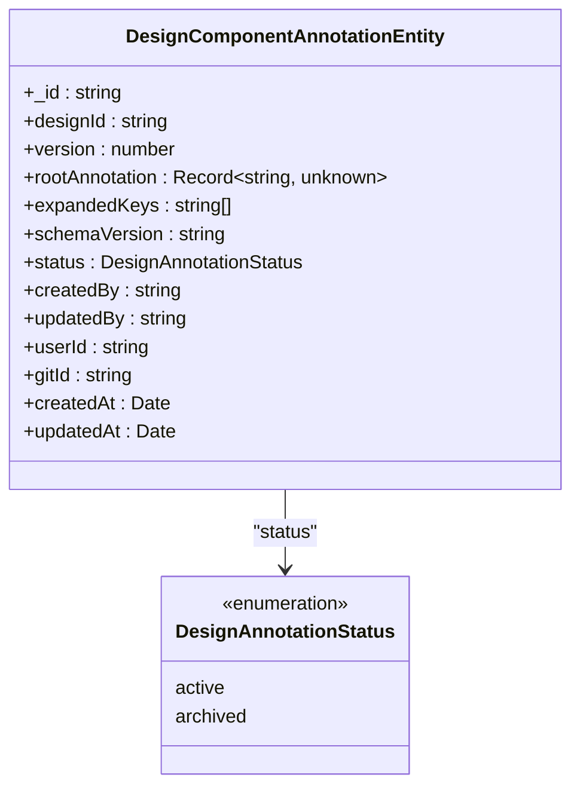
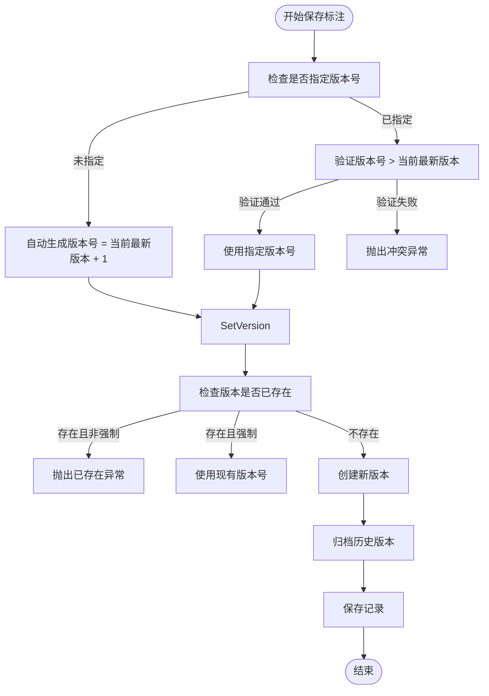
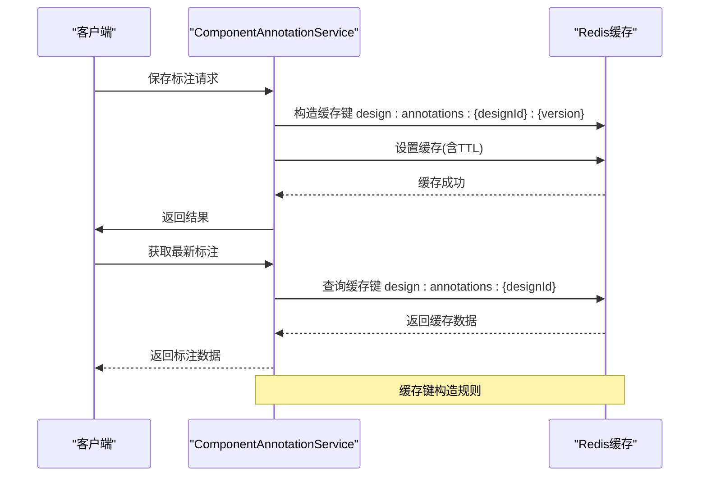
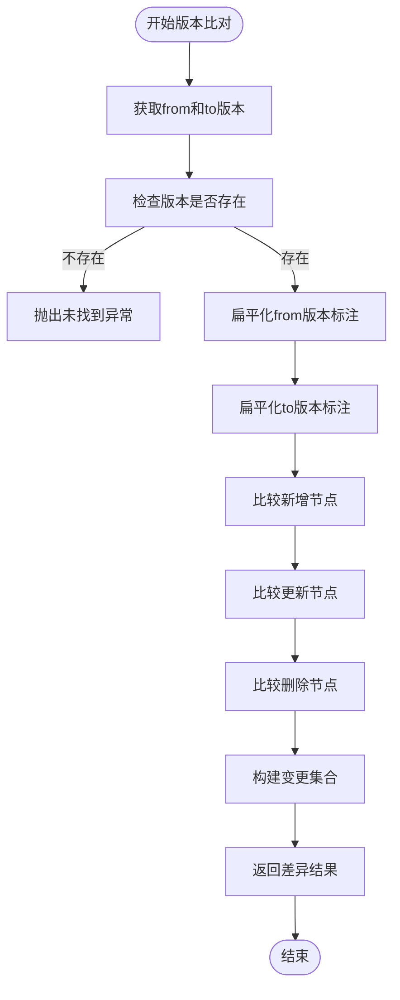
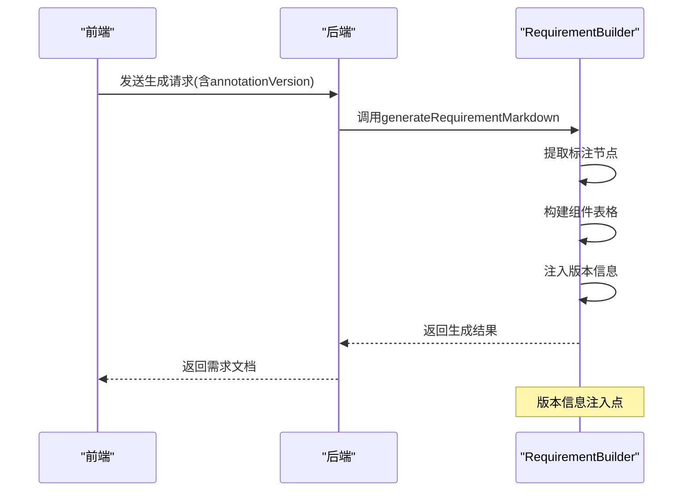
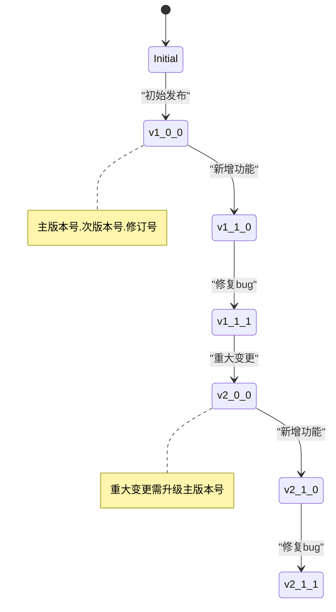
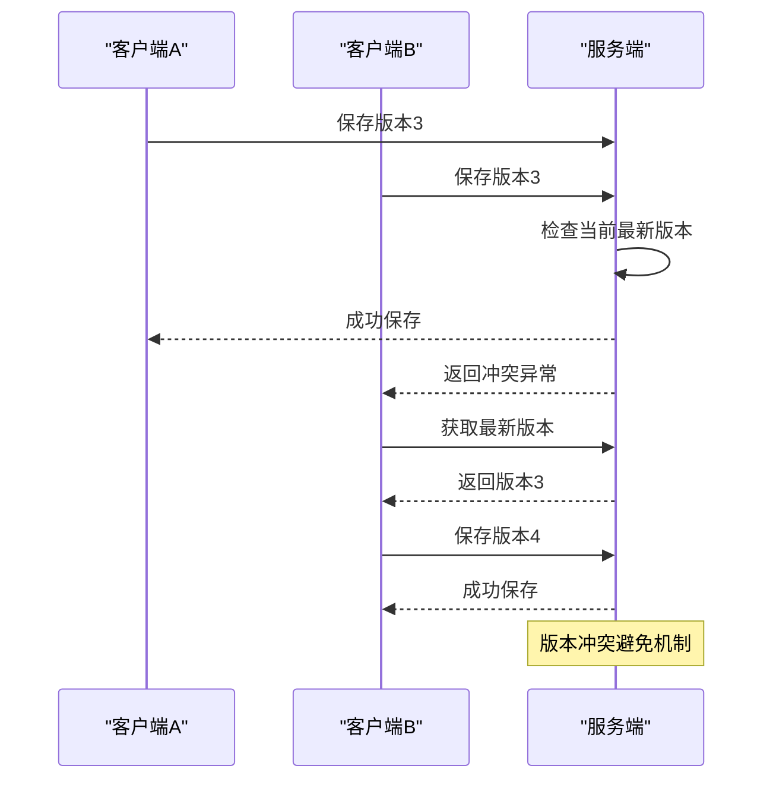

# 版本标识

<cite>
**本文档引用文件**  
- [component-annotation.service.ts](file://code-agent-backend/src/service/design/component-annotation.service.ts)
- [requirement-builder.ts](file://code-agent-backend/src/utils/design/requirement-builder.ts)
- [requirementDoc.ts](file://fta-layout-design/src/pages/EditorPage/utils/requirementDoc.ts)
- [component-annotation.dto.ts](file://code-agent-backend/src/dto/design/component-annotation.dto.ts)
- [component-annotation.ts](file://code-agent-backend/src/entity/design/component-annotation.ts)
</cite>

## 目录
1. [引言](#引言)
2. [版本标识核心机制](#版本标识核心机制)
3. [annotationVersion字段解析](#annotationversion字段解析)
4. [版本号生成规则](#版本号生成规则)
5. [缓存键构造与应用](#缓存键构造与应用)
6. [版本比对与差异分析](#版本比对与差异分析)
7. [前端版本标识注入流程](#前端版本标识注入流程)
8. [语义化命名与升级策略](#语义化命名与升级策略)
9. [分布式环境冲突避免](#分布式环境冲突避免)
10. [操作指引](#操作指引)

## 引言
本文档详细解析需求文档版本标识机制，重点阐述annotationVersion字段在组件标注与文档版本之间的关联。通过唯一版本号追踪PRD文档迭代历史，说明versionId生成规则及其在缓存键构造中的应用。为初学者提供版本号查看和比对操作指引，为高级开发者深入分析分布式环境下版本标识的冲突避免策略。

## 版本标识核心机制
系统通过版本标识实现需求文档的迭代追踪和状态管理。每个组件标注都关联一个唯一的版本号，用于标识该标注的迭代状态。版本标识机制确保了需求文档的可追溯性和一致性，支持多版本并存和历史回溯。

**Section sources**
- [component-annotation.service.ts](file://code-agent-backend/src/service/design/component-annotation.service.ts#L1-L264)
- [component-annotation.ts](file://code-agent-backend/src/entity/design/component-annotation.ts#L1-L73)

## annotationVersion字段解析
annotationVersion字段是组件标注与文档版本关联的核心标识。该字段在`DesignComponentAnnotationEntity`实体中定义为version属性，是一个自增的数字类型，用于标识标注的版本序列。

**Diagram sources**
- [component-annotation.ts](file://code-agent-backend/src/entity/design/component-annotation.ts#L1-L73)

**Section sources**
- [component-annotation.ts](file://code-agent-backend/src/entity/design/component-annotation.ts#L27-L29)
- [component-annotation.dto.ts](file://code-agent-backend/src/dto/design/component-annotation.dto.ts#L9-L12)

## 版本号生成规则
版本号生成遵循严格的自增规则，确保每个新版本的版本号都大于当前最新版本。系统在保存标注时自动处理版本号生成：

1. 当未指定版本号时，系统自动计算下一个版本号（当前最新版本号+1）
2. 当指定版本号时，必须大于当前最新版本号，否则抛出冲突异常
3. 支持强制覆盖现有版本的特殊模式

**Diagram sources**
- [component-annotation.service.ts](file://code-agent-backend/src/service/design/component-annotation.service.ts#L123-L139)

**Section sources**
- [component-annotation.service.ts](file://code-agent-backend/src/service/design/component-annotation.service.ts#L123-L139)
- [component-annotation.dto.ts](file://code-agent-backend/src/dto/design/component-annotation.dto.ts#L7-L12)

## 缓存键构造与应用
系统采用Redis缓存机制优化版本标识的访问性能。缓存键的构造遵循特定规则，确保版本标识的高效检索：

**Diagram sources**
- [component-annotation.service.ts](file://code-agent-backend/src/service/design/component-annotation.service.ts#L25-L27)
- [component-annotation.service.ts](file://code-agent-backend/src/service/design/component-annotation.service.ts#L58-L75)

**Section sources**
- [component-annotation.service.ts](file://code-agent-backend/src/service/design/component-annotation.service.ts#L25-L27)
- [component-annotation.service.ts](file://code-agent-backend/src/service/design/component-annotation.service.ts#L58-L75)

## 版本比对与差异分析
系统提供版本比对功能，支持不同版本间的差异分析。通过diffAnnotations方法，可以获取两个版本之间的变更集合，包括新增、删除和更新的节点。

**Diagram sources**
- [component-annotation.service.ts](file://code-agent-backend/src/service/design/component-annotation.service.ts#L218-L263)

**Section sources**
- [component-annotation.service.ts](file://code-agent-backend/src/service/design/component-annotation.service.ts#L218-L263)
- [component-annotation.dto.ts](file://code-agent-backend/src/dto/design/component-annotation.dto.ts#L61-L67)

## 前端版本标识注入流程
前端在生成需求文档时，将版本标识注入到文档生成流程中。通过requirement-builder.ts工具类，将标注版本信息整合到生成的文档中。

**Diagram sources**
- [requirement-builder.ts](file://code-agent-backend/src/utils/design/requirement-builder.ts#L78-L122)
- [requirementDoc.ts](file://fta-layout-design/src/pages/EditorPage/utils/requirementDoc.ts#L13-L37)

**Section sources**
- [requirement-builder.ts](file://code-agent-backend/src/utils/design/requirement-builder.ts#L78-L122)
- [requirementDoc.ts](file://fta-layout-design/src/pages/EditorPage/utils/requirementDoc.ts#L13-L37)

## 语义化命名与升级策略
系统采用语义化版本命名策略，结合主版本号、次版本号和修订号来管理标注协议的演进。升级策略确保向后兼容性，同时支持重大变更的平滑过渡。

**Diagram sources**
- [component-annotation.ts](file://code-agent-backend/src/entity/design/component-annotation.ts#L39-L41)
- [component-annotation.dto.ts](file://code-agent-backend/src/dto/design/component-annotation.dto.ts#L28-L33)

**Section sources**
- [component-annotation.ts](file://code-agent-backend/src/entity/design/component-annotation.ts#L39-L41)
- [component-annotation.dto.ts](file://code-agent-backend/src/dto/design/component-annotation.dto.ts#L28-L33)

## 分布式环境冲突避免
在分布式环境下，系统通过版本号验证和状态标记机制避免并发冲突。当多个客户端同时修改同一设计时，系统通过版本号比较确保数据一致性。

**Diagram sources**
- [component-annotation.service.ts](file://code-agent-backend/src/service/design/component-annotation.service.ts#L125-L128)
- [component-annotation.service.ts](file://code-agent-backend/src/service/design/component-annotation.service.ts#L131-L135)

**Section sources**
- [component-annotation.service.ts](file://code-agent-backend/src/service/design/component-annotation.service.ts#L125-L135)

## 操作指引
### 初学者操作指引
1. **查看版本号**：在需求文档生成时，查看文档中的"标注版本"字段
2. **指定版本生成**：在API请求中通过annotationVersion参数指定要生成的版本
3. **比对版本差异**：使用diffAnnotations接口比较两个版本的差异

### 高级开发者操作指引
1. **理解版本生成逻辑**：掌握自动版本生成和手动版本指定的规则
2. **处理版本冲突**：在并发场景下，正确处理版本冲突异常
3. **优化缓存策略**：了解缓存键构造规则，优化缓存命中率
4. **实施语义化版本**：遵循语义化版本命名规范，确保协议兼容性

**Section sources**
- [requirement-builder.ts](file://code-agent-backend/src/utils/design/requirement-builder.ts#L94-L95)
- [requirementDoc.ts](file://fta-layout-design/src/pages/EditorPage/utils/requirementDoc.ts#L7-L8)
- [component-annotation.service.ts](file://code-agent-backend/src/service/design/component-annotation.service.ts#L123-L139)