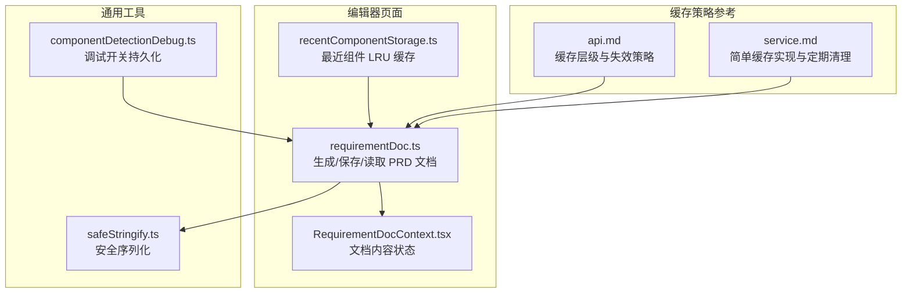
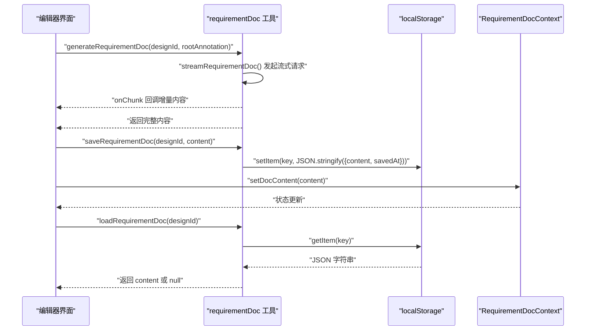
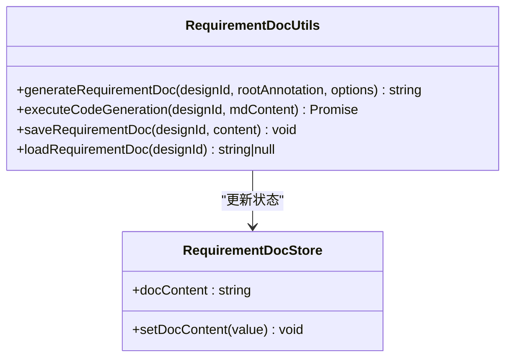
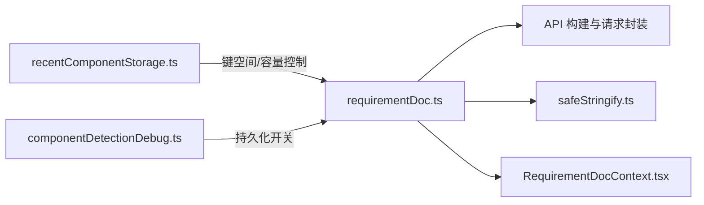

# 缓存管理

<cite>
**本文引用的文件**
- [requirementDoc.ts](file://fta-layout-design/src/pages/EditorPage/utils/requirementDoc.ts)
- [RequirementDocContext.tsx](file://fta-layout-design/src/pages/EditorPage/contexts/RequirementDocContext.tsx)
- [recentComponentStorage.ts](file://fta-layout-design/src/pages/EditorPage/utils/recentComponentStorage.ts)
- [componentDetectionDebug.ts](file://fta-layout-design/src/utils/componentDetectionDebug.ts)
- [api.md](file://fta-agent-core/mock-specs/api.md)
- [service.md](file://fta-agent-core/mock-specs/service.md)
- [safeStringify.ts](file://fta-agent-core/src/utils/safeStringify.ts)
</cite>

## 目录
1. [简介](#简介)
2. [项目结构](#项目结构)
3. [核心组件](#核心组件)
4. [架构总览](#架构总览)
5. [详细组件分析](#详细组件分析)
6. [依赖关系分析](#依赖关系分析)
7. [性能考量](#性能考量)
8. [故障排查指南](#故障排查指南)
9. [结论](#结论)
10. [附录](#附录)

## 简介
本文件围绕前端编辑器中的需求文档（PRD）缓存管理进行系统性梳理，重点覆盖以下方面：
- localStorage 中 PRD 文档缓存的存储结构与键命名规则
- 过期策略与同步机制（含多标签页一致性）
- 写入、读取与失效的触发条件
- 初学者与高级开发者的清理与调试操作步骤
- 结合代码示例说明 requirementDoc.ts 的缓存实现
- 缓存容量限制、序列化异常处理与离线场景降级策略

## 项目结构
与 PRD 文档缓存直接相关的模块主要位于编辑器页面工具层与上下文层：
- 编辑器页面工具层：负责生成、保存与读取 PRD 文档内容
- 上下文层：维护当前文档内容的状态
- 其他存储辅助：最近组件 LRU 缓存、调试开关持久化等

图表来源
- [requirementDoc.ts](file://fta-layout-design/src/pages/EditorPage/utils/requirementDoc.ts#L1-L236)
- [RequirementDocContext.tsx](file://fta-layout-design/src/pages/EditorPage/contexts/RequirementDocContext.tsx#L1-L22)
- [recentComponentStorage.ts](file://fta-layout-design/src/pages/EditorPage/utils/recentComponentStorage.ts#L1-L66)
- [componentDetectionDebug.ts](file://fta-layout-design/src/utils/componentDetectionDebug.ts#L1-L92)
- [api.md](file://fta-agent-core/mock-specs/api.md#L176-L230)
- [service.md](file://fta-agent-core/mock-specs/service.md#L557-L654)
- [safeStringify.ts](file://fta-agent-core/src/utils/safeStringify.ts#L1-L7)

章节来源
- [requirementDoc.ts](file://fta-layout-design/src/pages/EditorPage/utils/requirementDoc.ts#L1-L236)
- [RequirementDocContext.tsx](file://fta-layout-design/src/pages/EditorPage/contexts/RequirementDocContext.tsx#L1-L22)
- [recentComponentStorage.ts](file://fta-layout-design/src/pages/EditorPage/utils/recentComponentStorage.ts#L1-L66)
- [componentDetectionDebug.ts](file://fta-layout-design/src/utils/componentDetectionDebug.ts#L1-L92)
- [api.md](file://fta-agent-core/mock-specs/api.md#L176-L230)
- [service.md](file://fta-agent-core/mock-specs/service.md#L557-L654)
- [safeStringify.ts](file://fta-agent-core/src/utils/safeStringify.ts#L1-L7)

## 核心组件
- PRD 文档缓存工具：提供生成、保存、读取 PRD 文档内容的能力，并以 localStorage 作为持久化介质
- 文档内容状态上下文：通过代理对象维护当前文档内容，便于组件消费与更新
- 最近组件 LRU 缓存：演示了基于 localStorage 的键值存储与容量控制思路
- 调试开关持久化：演示了如何将用户开关状态持久化到 localStorage
- 缓存策略参考：提供了缓存层级、失效策略与定期清理的实现范式

章节来源
- [requirementDoc.ts](file://fta-layout-design/src/pages/EditorPage/utils/requirementDoc.ts#L1-L236)
- [RequirementDocContext.tsx](file://fta-layout-design/src/pages/EditorPage/contexts/RequirementDocContext.tsx#L1-L22)
- [recentComponentStorage.ts](file://fta-layout-design/src/pages/EditorPage/utils/recentComponentStorage.ts#L1-L66)
- [componentDetectionDebug.ts](file://fta-layout-design/src/utils/componentDetectionDebug.ts#L1-L92)
- [api.md](file://fta-agent-core/mock-specs/api.md#L176-L230)
- [service.md](file://fta-agent-core/mock-specs/service.md#L557-L654)

## 架构总览
PRD 文档缓存的调用链路如下：
- 生成阶段：通过流式接口生成 PRD 文档内容，支持分片回调
- 持久化阶段：将完整内容写入 localStorage，键名包含设计稿标识
- 读取阶段：按设计稿标识从 localStorage 读取并返回
- 同步阶段：多标签页环境下，可通过监听 storage 事件实现跨标签页同步（本仓库未实现，但提供了参考）

图表来源
- [requirementDoc.ts](file://fta-layout-design/src/pages/EditorPage/utils/requirementDoc.ts#L1-L236)
- [RequirementDocContext.tsx](file://fta-layout-design/src/pages/EditorPage/contexts/RequirementDocContext.tsx#L1-L22)

## 详细组件分析

### 缓存键构成与防冲突设计
- 键名规则：采用统一前缀与设计稿标识拼接的方式，确保不同设计稿之间的键空间隔离
- 防冲突策略：
  - 使用明确的命名前缀，避免与其他业务键冲突
  - 仅使用设计稿标识参与键名组成，简化键空间并降低碰撞概率
- 当前实现未包含版本号或文档类型字段，若未来需要区分同一设计稿的不同版本或类型，可在键名中追加相应片段

章节来源
- [requirementDoc.ts](file://fta-layout-design/src/pages/EditorPage/utils/requirementDoc.ts#L200-L236)

### 存储结构与序列化
- 存储结构：将内容与写入时间戳一起序列化后存入 localStorage
- 序列化异常处理：读取时对 JSON 解析进行 try-catch 包裹，解析失败时返回 null 并记录错误日志
- 安全序列化参考：提供安全字符串化工具，用于在其他场景避免序列化异常导致的崩溃

章节来源
- [requirementDoc.ts](file://fta-layout-design/src/pages/EditorPage/utils/requirementDoc.ts#L200-L236)
- [safeStringify.ts](file://fta-agent-core/src/utils/safeStringify.ts#L1-L7)

### 过期策略
- 当前实现未内置 TTL 过期时间；读取时不做过期判断
- 若需要引入过期策略，可参考仓库中的简单缓存实现与定期清理范式，将过期时间与清理逻辑迁移到 PRD 文档缓存中

章节来源
- [requirementDoc.ts](file://fta-layout-design/src/pages/EditorPage/utils/requirementDoc.ts#L200-L236)
- [service.md](file://fta-agent-core/mock-specs/service.md#L557-L654)
- [api.md](file://fta-agent-core/mock-specs/api.md#L176-L230)

### 同步机制与多标签页一致性
- 当前实现未监听 storage 事件，因此无法自动感知其他标签页对同一键的修改
- 若需实现跨标签页同步，建议：
  - 在窗口级监听 storage 事件，当目标键发生变化时触发刷新
  - 对于频繁写入的场景，可考虑引入版本号或 ETag 机制，避免不必要的重绘
- 本仓库提供了“简单缓存实现”与“定期清理”的参考，可借鉴其键空间组织与清理策略

章节来源
- [requirementDoc.ts](file://fta-layout-design/src/pages/EditorPage/utils/requirementDoc.ts#L200-L236)
- [service.md](file://fta-agent-core/mock-specs/service.md#L557-L654)

### 写入、读取与失效的触发条件
- 写入触发条件：
  - 明确传入设计稿标识与完整内容
  - 写入时同时记录保存时间戳
- 读取触发条件：
  - 提供设计稿标识即可读取
  - 读取失败或解析失败返回 null
- 失效触发条件：
  - 当前实现未内置过期失效逻辑
  - 可通过外部策略（如版本切换、手动清理）实现失效

章节来源
- [requirementDoc.ts](file://fta-layout-design/src/pages/EditorPage/utils/requirementDoc.ts#L200-L236)

### 与上下文层的协作
- 文档内容状态由上下文代理对象维护，便于组件订阅与渲染
- 保存与读取 PRD 文档后，应同步更新上下文状态，保证 UI 与缓存一致

章节来源
- [RequirementDocContext.tsx](file://fta-layout-design/src/pages/EditorPage/contexts/RequirementDocContext.tsx#L1-L22)
- [requirementDoc.ts](file://fta-layout-design/src/pages/EditorPage/utils/requirementDoc.ts#L1-L236)

### 类图（代码级）

图表来源
- [requirementDoc.ts](file://fta-layout-design/src/pages/EditorPage/utils/requirementDoc.ts#L1-L236)
- [RequirementDocContext.tsx](file://fta-layout-design/src/pages/EditorPage/contexts/RequirementDocContext.tsx#L1-L22)

## 依赖关系分析
- requirementDoc.ts 依赖：
  - API 构建与请求封装（用于流式生成）
  - 安全序列化工具（用于其他场景的健壮性）
  - 上下文层（用于状态同步）
- 其他存储辅助：
  - recentComponentStorage.ts 展示了基于 localStorage 的键空间与容量控制思路
  - componentDetectionDebug.ts 展示了开关状态持久化的做法

图表来源
- [requirementDoc.ts](file://fta-layout-design/src/pages/EditorPage/utils/requirementDoc.ts#L1-L236)
- [RequirementDocContext.tsx](file://fta-layout-design/src/pages/EditorPage/contexts/RequirementDocContext.tsx#L1-L22)
- [recentComponentStorage.ts](file://fta-layout-design/src/pages/EditorPage/utils/recentComponentStorage.ts#L1-L66)
- [componentDetectionDebug.ts](file://fta-layout-design/src/utils/componentDetectionDebug.ts#L1-L92)
- [safeStringify.ts](file://fta-agent-core/src/utils/safeStringify.ts#L1-L7)

## 性能考量
- 写入性能：localStorage 为同步 API，大体量内容写入可能阻塞主线程；建议：
  - 控制单次写入大小，必要时拆分或延迟写入
  - 对超大文档采用分块落盘或异步队列
- 读取性能：读取为 O(1) 操作，但需注意 JSON 解析成本；建议：
  - 对频繁读取的内容在内存中做一层轻量缓存
- 清理策略：可参考“简单缓存实现”，引入过期时间与定期清理，避免无限增长

章节来源
- [service.md](file://fta-agent-core/mock-specs/service.md#L557-L654)
- [api.md](file://fta-agent-core/mock-specs/api.md#L176-L230)

## 故障排查指南
- 常见问题与定位步骤：
  - 写入失败：检查 localStorage 是否可用、容量是否不足、序列化是否抛错
  - 读取失败：确认键名是否正确、是否存在跨域或同源限制导致读取不到
  - 解析失败：查看 JSON 解析异常日志，确认存储格式是否被篡改
  - 多标签页不一致：确认是否监听 storage 事件并执行刷新
- 调试操作步骤（面向初学者）：
  - 打开浏览器开发者工具，切换到 Application/存储/LocalStorage
  - 查找以统一前缀开头的 PRD 文档键
  - 手动删除或修改键值，观察 UI 行为变化
  - 使用调试开关持久化功能，验证开关状态是否正确持久化
- 高级开发者建议：
  - 引入版本号或 ETag，避免无差别刷新
  - 对频繁写入的场景增加节流/去抖
  - 在生产环境增加更完善的异常上报与回退策略

章节来源
- [requirementDoc.ts](file://fta-layout-design/src/pages/EditorPage/utils/requirementDoc.ts#L200-L236)
- [componentDetectionDebug.ts](file://fta-layout-design/src/utils/componentDetectionDebug.ts#L1-L92)

## 结论
- 本仓库的 PRD 文档缓存以 localStorage 为基础，采用简洁的键名与结构，具备良好的可读性与易用性
- 当前未内置过期策略与跨标签页同步，建议结合仓库提供的缓存策略参考进行增强
- 对于大体量文档与高并发场景，应关注写入阻塞、容量限制与清理策略，确保用户体验与稳定性

## 附录

### 缓存容量限制与序列化异常处理
- 容量限制：localStorage 容量有限，建议对单条文档大小进行上限控制，并在写入前进行长度校验
- 序列化异常：读取时对 JSON 解析进行容错处理，解析失败返回 null 并记录日志
- 安全序列化：提供安全字符串化工具，避免异常导致的崩溃

章节来源
- [requirementDoc.ts](file://fta-layout-design/src/pages/EditorPage/utils/requirementDoc.ts#L200-L236)
- [safeStringify.ts](file://fta-agent-core/src/utils/safeStringify.ts#L1-L7)

### 离线场景降级策略
- 读取优先：优先从 localStorage 读取，失败则回退到空状态或默认提示
- 写入降级：在不可用时记录日志并提示用户，后续再尝试恢复
- 同步降级：未监听 storage 事件时，可提示用户手动刷新以获取最新内容

章节来源
- [requirementDoc.ts](file://fta-layout-design/src/pages/EditorPage/utils/requirementDoc.ts#L200-L236)

### 多标签页一致性问题
- 当前未实现 storage 事件监听与跨标签页同步
- 参考仓库中的“简单缓存实现”与“定期清理”策略，可迁移至 PRD 文档缓存中，实现键空间隔离、过期控制与定时清理

章节来源
- [service.md](file://fta-agent-core/mock-specs/service.md#L557-L654)