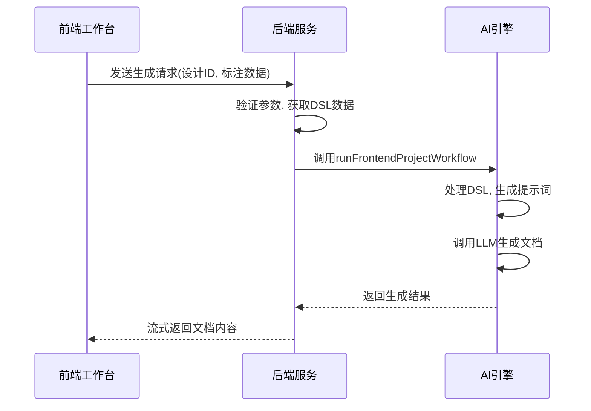
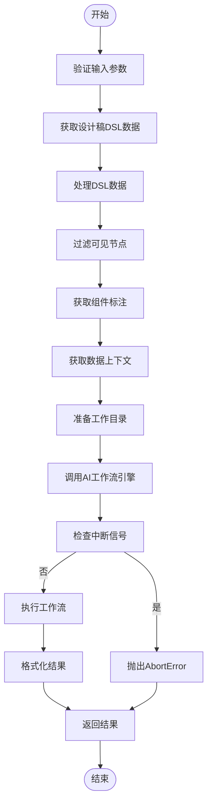
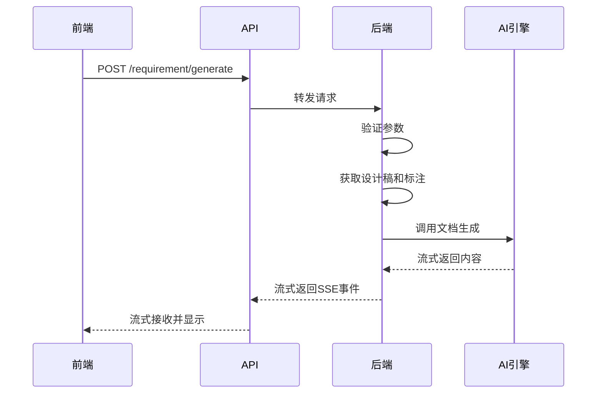
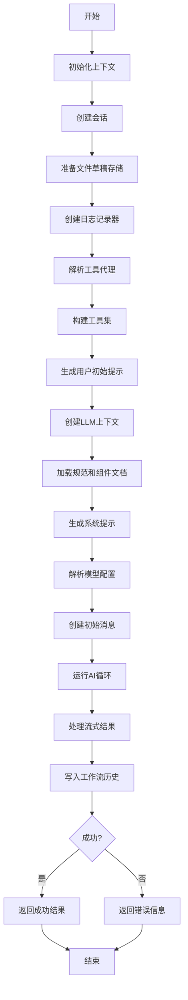
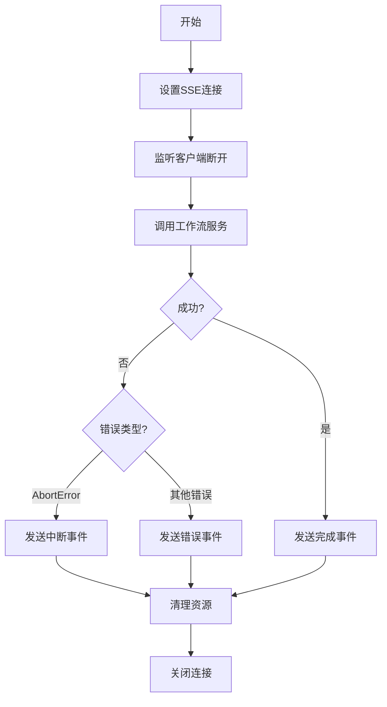

# 需求文档生成

<cite>
**本文档引用的文件**  
- [requirement-builder.ts](file://code-agent-backend/src/utils/design/requirement-builder.ts)
- [frontendProjectService.ts](file://fta-agent-core/src/frontendProjectService.ts)
- [frontend-workflow.ts](file://code-agent-backend/src/controller/code-agent/frontend-workflow.ts)
- [frontend-workflow.ts](file://code-agent-backend/src/service/code-agent/frontend-workflow.ts)
- [requirementService.ts](file://fta-layout-design/src/services/requirementService.ts)
- [requirementDoc.ts](file://fta-layout-design/src/pages/EditorPage/utils/requirementDoc.ts)
- [design-document.dto.ts](file://code-agent-backend/src/dto/design/design-document.dto.ts)
- [component-annotation.dto.ts](file://code-agent-backend/src/dto/design/component-annotation.dto.ts)
- [design-document.ts](file://code-agent-backend/src/entity/design/design-document.ts)
- [component-annotation.ts](file://code-agent-backend/src/entity/design/component-annotation.ts)
</cite>

## 目录
1. [简介](#简介)
2. [系统架构与流程](#系统架构与流程)
3. [核心组件分析](#核心组件分析)
4. [需求文档生成API调用](#需求文档生成api调用)
5. [前端工作台操作流程](#前端工作台操作流程)
6. [文档版本与缓存策略](#文档版本与缓存策略)
7. [错误处理与日志](#错误处理与日志)
8. [结论](#结论)

## 简介

需求文档生成功能是本系统的核心能力之一，它能够基于设计稿和组件标注自动生成结构化的产品需求文档（PRD）。该功能通过结合DSL（领域特定语言）结构和组件语义信息，利用大语言模型（LLM）生成高质量的文档内容。系统支持模板选择、流式响应处理和文档版本管理，为前端开发提供从设计到代码的完整自动化工作流。

## 系统架构与流程

需求文档生成涉及前端工作台、后端服务和核心AI引擎的协同工作。整个流程从用户在前端触发生成请求开始，经过后端服务协调，最终由AI引擎生成文档内容并返回给前端。



**Diagram sources**
- [frontendProjectService.ts](file://fta-agent-core/src/frontendProjectService.ts#L139-L348)
- [frontend-workflow.ts](file://code-agent-backend/src/service/code-agent/frontend-workflow.ts#L74-L278)
- [frontend-workflow.ts](file://code-agent-backend/src/controller/code-agent/frontend-workflow.ts#L83-L367)

**Section sources**
- [frontendProjectService.ts](file://fta-agent-core/src/frontendProjectService.ts#L139-L348)
- [frontend-workflow.ts](file://code-agent-backend/src/service/code-agent/frontend-workflow.ts#L74-L278)
- [frontend-workflow.ts](file://code-agent-backend/src/controller/code-agent/frontend-workflow.ts#L83-L367)

## 核心组件分析

### 需求文档生成器

需求文档生成的核心逻辑位于`requirement-builder.ts`文件中，该模块负责将设计稿DSL和组件标注转换为结构化的需求文档。

```mermaid
classDiagram
class RequirementBuilderOptions {
+templateKey? : string
}
class AnnotationNodeSummary {
+nodeId : string
+name? : string
+ftaComponent? : string
+depth : number
+childCount : number
}
class RequirementGenerationResult {
+content : string
+availableFormats : string[]
+stats : {
componentCount : number
annotationVersion : number | null
}
}
class DesignDocumentEntity {
+_id? : string
+name : string
+description? : string
+dslData? : Record<string, unknown>
+dslRevision : number
+status : DesignDocumentStatus
}
class DesignComponentAnnotationEntity {
+_id? : string
+designId : string
+version : number
+rootAnnotation : Record<string, unknown>
+expandedKeys : string[]
+schemaVersion? : string
+status : DesignAnnotationStatus
}
generateRequirementMarkdown() --> RequirementGenerationResult
extractAnnotationNodes() --> AnnotationNodeSummary[]
buildComponentTable() --> string
resolveDslNodeCount() --> number
DesignDocumentEntity --> generateRequirementMarkdown : "作为输入"
DesignComponentAnnotationEntity --> extractAnnotationNodes : "作为输入"
```

**Diagram sources**
- [requirement-builder.ts](file://code-agent-backend/src/utils/design/requirement-builder.ts#L4-L121)

**Section sources**
- [requirement-builder.ts](file://code-agent-backend/src/utils/design/requirement-builder.ts#L4-L121)

### 前端工作流服务

`frontend-workflow.ts`服务是连接前端请求和AI引擎的核心桥梁，负责协调整个文档生成过程。



**Diagram sources**
- [frontend-workflow.ts](file://code-agent-backend/src/service/code-agent/frontend-workflow.ts#L74-L278)

**Section sources**
- [frontend-workflow.ts](file://code-agent-backend/src/service/code-agent/frontend-workflow.ts#L74-L278)

## 需求文档生成API调用

### API请求参数

需求文档生成API接受以下参数：

| 参数名 | 类型 | 必需 | 描述 |
|-------|------|------|------|
| designId | string | 是 | 设计稿唯一标识 |
| rootAnnotation | any | 否 | 组件标注根节点数据 |
| templateKey | string | 否 | 模板标识符 |
| annotationVersion | number | 否 | 标注版本号 |
| annotationSchemaVersion | string | 否 | 标注协议版本 |

### API响应格式

API返回流式响应，包含以下事件类型：

| 事件类型 | 数据结构 | 描述 |
|---------|---------|------|
| chunk | {content: string} | 文档内容片段 |
| error | {message: string} | 错误信息 |
| done | {} | 生成完成 |

### 前端调用示例



**Diagram sources**
- [requirementService.ts](file://fta-layout-design/src/services/requirementService.ts#L16-L30)
- [requirementDoc.ts](file://fta-layout-design/src/pages/EditorPage/utils/requirementDoc.ts#L13-L135)
- [frontend-workflow.ts](file://code-agent-backend/src/controller/code-agent/frontend-workflow.ts#L83-L367)

**Section sources**
- [requirementService.ts](file://fta-layout-design/src/services/requirementService.ts#L16-L30)
- [requirementDoc.ts](file://fta-layout-design/src/pages/EditorPage/utils/requirementDoc.ts#L13-L135)

## 前端工作台操作流程

### 初学者操作步骤

1. **打开设计稿**：在前端工作台中选择需要生成需求文档的设计稿
2. **添加组件标注**：使用标注工具为设计稿中的组件添加语义信息
3. **生成需求文档**：点击"生成PRD"按钮，系统将自动开始文档生成
4. **查看和编辑**：在文档编辑器中查看生成的内容，进行必要的修改
5. **保存文档**：将最终版本的需求文档保存到项目中

### 高级开发者解析

`frontendProjectService.ts`中的核心逻辑实现了从设计稿到需求文档的完整转换流程：



**Diagram sources**
- [frontendProjectService.ts](file://fta-agent-core/src/frontendProjectService.ts#L139-L348)

**Section sources**
- [frontendProjectService.ts](file://fta-agent-core/src/frontendProjectService.ts#L139-L348)

## 文档版本与缓存策略

### 版本管理

系统通过以下方式管理需求文档版本：

1. **设计稿版本**：每个设计稿有`dslRevision`字段记录DSL版本
2. **标注版本**：每个组件标注有`version`字段记录标注版本
3. **文档版本**：生成的需求文档会关联到特定的设计稿和标注版本

### 内容缓存

前端实现了本地缓存策略，提高用户体验：

```mermaid
classDiagram
class requirementDoc {
+saveRequirementDoc(designId : string, content : string)
+loadRequirementDoc(designId : string) : string | null
+generateRequirementDoc(designId : string, rootAnnotation : AnnotationNode | null, options? : RequirementDocGenerationOptions) : Promise<string>
+executeCodeGeneration(designId : string, mdContent : string) : Promise<{ success : boolean; message : string }>
}
class localStorage {
+setItem(key : string, value : string)
+getItem(key : string) : string | null
}
requirementDoc --> localStorage : "使用"
```

**Diagram sources**
- [requirementDoc.ts](file://fta-layout-design/src/pages/EditorPage/utils/requirementDoc.ts#L206-L235)

**Section sources**
- [requirementDoc.ts](file://fta-layout-design/src/pages/EditorPage/utils/requirementDoc.ts#L206-L235)

## 错误处理与日志

系统实现了完善的错误处理和日志记录机制：



**Diagram sources**
- [frontend-workflow.ts](file://code-agent-backend/src/controller/code-agent/frontend-workflow.ts#L139-L367)

**Section sources**
- [frontend-workflow.ts](file://code-agent-backend/src/controller/code-agent/frontend-workflow.ts#L139-L367)

## 结论

需求文档生成功能通过整合设计稿DSL、组件标注和大语言模型，实现了从设计到需求文档的自动化转换。系统采用流式响应机制，提供实时的文档生成体验。通过完善的版本管理和缓存策略，确保了文档的一致性和性能。前端工作台为初学者提供了简单易用的操作界面，同时为高级开发者提供了可扩展的核心逻辑，满足不同层次用户的需求。