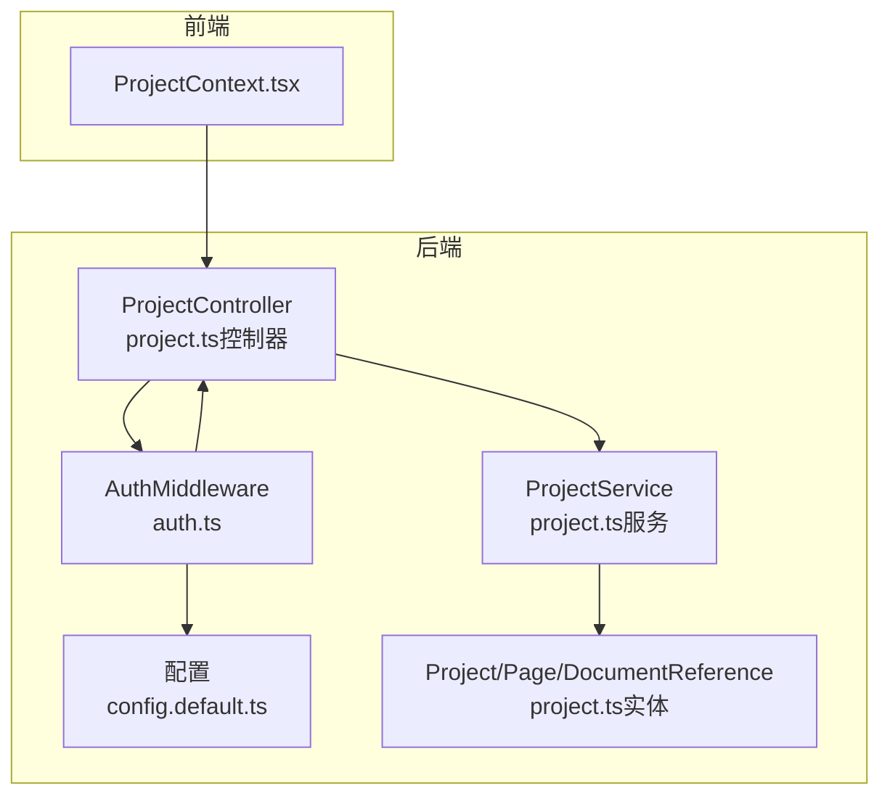
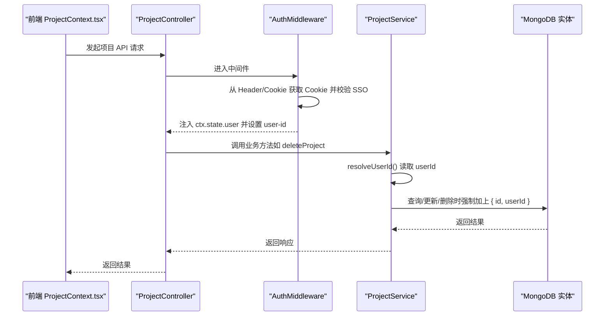
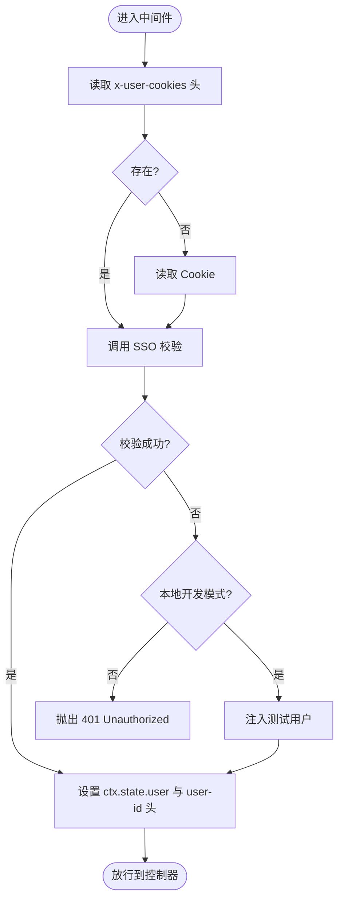
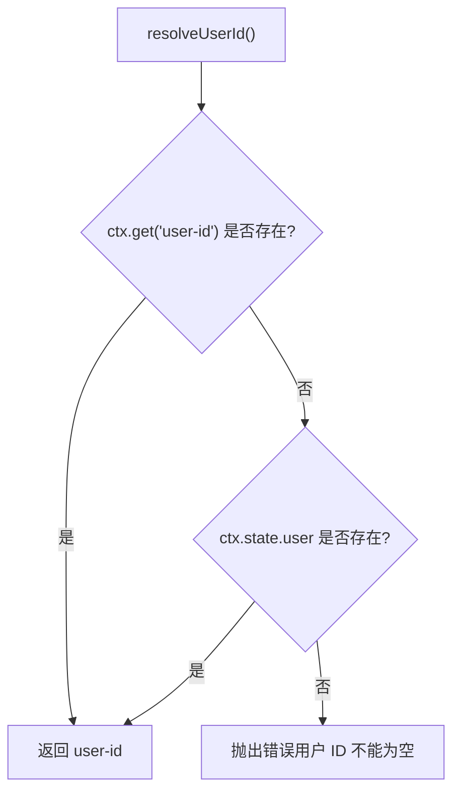
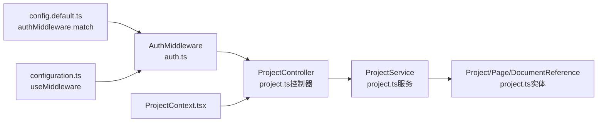

# 权限控制

<cite>
**本文引用的文件**
- [auth.ts](file://code-agent-backend/src/middleware/auth.ts)
- [configuration.ts](file://code-agent-backend/src/configuration.ts)
- [config.default.ts](file://code-agent-backend/src/config/config.default.ts)
- [project.ts（控制器）](file://code-agent-backend/src/controller/code-agent/project.ts)
- [project.ts（服务）](file://code-agent-backend/src/service/code-agent/project.ts)
- [project.ts（实体）](file://code-agent-backend/src/entity/code-agent/project.ts)
- [ProjectContext.tsx](file://fta-layout-design/src/contexts/ProjectContext.tsx)
- [req.ts](file://code-agent-backend/src/dto/code-agent/req.ts)
- [res.ts](file://code-agent-backend/src/dto/code-agent/res.ts)
- [user-context.ts](file://code-agent-backend/src/dto/common/user-context.ts)
</cite>

## 目录
1. [简介](#简介)
2. [项目结构](#项目结构)
3. [核心组件](#核心组件)
4. [架构总览](#架构总览)
5. [详细组件分析](#详细组件分析)
6. [依赖关系分析](#依赖关系分析)
7. [性能考量](#性能考量)
8. [故障排查指南](#故障排查指南)
9. [结论](#结论)
10. [附录](#附录)

## 简介
本文件系统性阐述项目基于用户身份的权限控制机制，重点围绕以下目标展开：
- 解析 resolveUserId 如何从请求上下文提取用户标识，并在所有项目操作中作为过滤条件（id, userId），确保数据隔离。
- 为初学者解释为何普通用户只能访问自己创建的项目，以及如何通过中间件 auth.ts 实现基于 Cookie/SSO 的认证。
- 为高级开发者深入分析权限控制的实现细节，包括在 findOneAndUpdate、deleteOne 等数据库操作中强制添加 userId 过滤条件，防止越权访问。
- 提供实际代码示例路径，如 deleteProject 方法中通过 { id: params.id, userId } 复合条件删除项目。
- 讨论权限控制的边界情况（如团队协作场景下的共享项目权限）。
- 说明前端 ProjectContext 在调用 API 前如何确保用户已认证。

## 项目结构
后端采用 MidwayJS 分层架构，权限控制贯穿于中间件、控制器与服务层：
- 中间件层：AuthMiddleware 负责认证与上下文注入。
- 控制器层：ProjectController 提供项目相关 API。
- 服务层：ProjectService 封装业务逻辑，统一注入 resolveUserId 并在数据库操作中强制带 userId 过滤。
- 实体层：Project、Page、DocumentReference 等实体定义数据模型与字段约束。
- 前端：ProjectContext.tsx 负责项目状态管理与 API 调用。

图表来源
- [auth.ts](file://code-agent-backend/src/middleware/auth.ts#L162-L193)
- [config.default.ts](file://code-agent-backend/src/config/config.default.ts#L123-L128)
- [project.ts（控制器）](file://code-agent-backend/src/controller/code-agent/project.ts#L1-L256)
- [project.ts（服务）](file://code-agent-backend/src/service/code-agent/project.ts#L1-L767)
- [project.ts（实体）](file://code-agent-backend/src/entity/code-agent/project.ts#L1-L167)

章节来源
- [auth.ts](file://code-agent-backend/src/middleware/auth.ts#L162-L193)
- [config.default.ts](file://code-agent-backend/src/config/config.default.ts#L123-L128)
- [project.ts（控制器）](file://code-agent-backend/src/controller/code-agent/project.ts#L1-L256)
- [project.ts（服务）](file://code-agent-backend/src/service/code-agent/project.ts#L1-L767)
- [project.ts（实体）](file://code-agent-backend/src/entity/code-agent/project.ts#L1-L167)

## 核心组件
- 认证中间件 AuthMiddleware：负责从请求头或 Cookie 中提取用户信息，调用 SSO 校验，将用户信息写入 ctx.state.user，并设置 user-id 响应头，供后续服务层读取。
- 服务层 ProjectService：提供 resolveUserId 统一从 ctx.state.user 或 ctx.get('user-id') 获取 userId；在所有数据库查询/更新/删除操作中强制带上 userId 过滤条件，实现“按用户隔离”的数据访问控制。
- 实体 Project：包含 userId 字段，确保每个项目都绑定到创建者。
- 前端 ProjectContext：在调用后端 API 前，确保用户已认证（由中间件保障），并在 UI 层维护项目状态。

章节来源
- [auth.ts](file://code-agent-backend/src/middleware/auth.ts#L125-L160)
- [project.ts（服务）](file://code-agent-backend/src/service/code-agent/project.ts#L45-L55)
- [project.ts（实体）](file://code-agent-backend/src/entity/code-agent/project.ts#L151-L166)
- [ProjectContext.tsx](file://fta-layout-design/src/contexts/ProjectContext.tsx#L1-L375)

## 架构总览
下图展示从前端到后端的认证与授权流程，以及服务层如何强制带 userId 过滤：

图表来源
- [auth.ts](file://code-agent-backend/src/middleware/auth.ts#L125-L160)
- [project.ts（控制器）](file://code-agent-backend/src/controller/code-agent/project.ts#L119-L128)
- [project.ts（服务）](file://code-agent-backend/src/service/code-agent/project.ts#L331-L343)
- [project.ts（实体）](file://code-agent-backend/src/entity/code-agent/project.ts#L151-L166)

## 详细组件分析

### 认证中间件 AuthMiddleware
- 功能要点
  - 从 x-user-cookies 自定义头或 Cookie 中提取 ymmoa_passport（或 dev_passport/qa_passport）。
  - 通过 SSO 接口校验 passport，成功后将用户信息写入 ctx.state.user，并设置 user-id 响应头。
  - 若本地开发模式（NODE_ENV=local），直接注入测试用户。
  - 未通过认证时抛出 401。
- 匹配规则
  - 通过配置项 authMiddleware.match 对路径进行匹配，支持正则数组，当前配置对 /api/、/custom/ 与全路径生效。

图表来源
- [auth.ts](file://code-agent-backend/src/middleware/auth.ts#L47-L160)
- [config.default.ts](file://code-agent-backend/src/config/config.default.ts#L123-L128)

章节来源
- [auth.ts](file://code-agent-backend/src/middleware/auth.ts#L125-L160)
- [config.default.ts](file://code-agent-backend/src/config/config.default.ts#L123-L128)

### 服务层 resolveUserId 与数据隔离
- resolveUserId 优先从 ctx.get('user-id') 获取，其次从 ctx.state.user.id 获取；若为空则抛错。
- 在所有数据库操作中，均以 { id, userId } 作为查询/更新/删除条件，确保“仅能访问自己的项目”。
- 典型实现位置
  - 列表查询：getProjects 使用 { userId } 过滤。
  - 详情查询：findProject 使用 { id, userId }。
  - 更新：updateProject 使用 { id, userId }。
  - 删除：deleteProject 使用 { id, userId }。
  - 页面相关：createPage/updatePage/deletePage 等均先 findProject 再在更新时带上 userId。
  - 文档状态与内容：updateDocumentStatus/updateDocument 等在服务层同样遵循 userId 隔离。

图表来源
- [project.ts（服务）](file://code-agent-backend/src/service/code-agent/project.ts#L45-L55)

章节来源
- [project.ts（服务）](file://code-agent-backend/src/service/code-agent/project.ts#L247-L267)
- [project.ts（服务）](file://code-agent-backend/src/service/code-agent/project.ts#L304-L326)
- [project.ts（服务）](file://code-agent-backend/src/service/code-agent/project.ts#L331-L343)
- [project.ts（服务）](file://code-agent-backend/src/service/code-agent/project.ts#L396-L409)
- [project.ts（服务）](file://code-agent-backend/src/service/code-agent/project.ts#L466-L491)
- [project.ts（服务）](file://code-agent-backend/src/service/code-agent/project.ts#L514-L523)

### 控制器层 API 与权限
- 控制器方法如 createProject、updateProject、deleteProject、getProjectDetail、createPage、updatePage、deletePage、updateDocumentStatus、syncDocument、updateDocument、getDocumentContent 等，均由 ProjectService 统一封装权限逻辑。
- 控制器本身不直接处理 userId 过滤，而是委托给服务层，保证一致性与可维护性。

章节来源
- [project.ts（控制器）](file://code-agent-backend/src/controller/code-agent/project.ts#L91-L128)
- [project.ts（控制器）](file://code-agent-backend/src/controller/code-agent/project.ts#L147-L184)
- [project.ts（控制器）](file://code-agent-backend/src/controller/code-agent/project.ts#L201-L255)

### 实体层与字段约束
- Project 实体包含 userId 字段，确保每个项目都与用户绑定。
- Page/DocumentReference 等实体亦有 userId 字段，配合服务层过滤实现细粒度隔离。

章节来源
- [project.ts（实体）](file://code-agent-backend/src/entity/code-agent/project.ts#L151-L166)

### 前端 ProjectContext 与认证
- 前端 ProjectContext.tsx 在发起 API 调用前，依赖后端中间件的认证保障；只要后端中间件生效，前端即可安全地调用受保护的项目 API。
- 前端通过 apiServices.project.* 方法调用后端接口，无需自行携带认证头，因为中间件会在请求到达控制器前完成认证并注入 user-id。

章节来源
- [ProjectContext.tsx](file://fta-layout-design/src/contexts/ProjectContext.tsx#L1-L375)

## 依赖关系分析
- 中间件注册与生命周期
  - configuration.ts 在 onReady 阶段注册 AuthMiddleware，使其对应用生效。
  - config.default.ts 中配置 authMiddleware.match，决定哪些路径需要认证。
- 控制器与服务
  - ProjectController 依赖 ProjectService；ProjectService 依赖 Typegoose 实体与上下文。
- 前后端交互
  - 前端通过 ProjectContext.tsx 调用后端 API；后端中间件在控制器前完成认证，服务层统一注入 userId 过滤。

图表来源
- [configuration.ts](file://code-agent-backend/src/configuration.ts#L47-L51)
- [config.default.ts](file://code-agent-backend/src/config/config.default.ts#L123-L128)
- [auth.ts](file://code-agent-backend/src/middleware/auth.ts#L162-L193)
- [project.ts（控制器）](file://code-agent-backend/src/controller/code-agent/project.ts#L1-L256)
- [project.ts（服务）](file://code-agent-backend/src/service/code-agent/project.ts#L1-L767)
- [project.ts（实体）](file://code-agent-backend/src/entity/code-agent/project.ts#L1-L167)

章节来源
- [configuration.ts](file://code-agent-backend/src/configuration.ts#L47-L51)
- [config.default.ts](file://code-agent-backend/src/config/config.default.ts#L123-L128)

## 性能考量
- 中间件认证成本低：仅在进入控制器前进行一次校验，随后通过 ctx.state.user 和 user-id 头复用用户信息，避免重复网络调用。
- 数据库过滤开销可控：所有查询/更新/删除均带 userId，索引建议在 userId 上建立，以降低查询成本。
- 建议
  - 为 userId 建立索引，提升 getProjects/findProject 等查询性能。
  - 对高频接口（如 getProjects）考虑分页与排序优化，减少一次性返回大量数据。

[本节为通用指导，不涉及具体文件分析]

## 故障排查指南
- 401 未授权
  - 检查 x-user-cookies 或 Cookie 是否正确传递；确认 SSO 校验是否成功。
  - 确认 NODE_ENV=local 时是否期望注入测试用户。
- 项目不存在或无权限
  - 服务层在找不到匹配的 { id, userId } 时会抛错；检查请求参数 id 与当前用户是否一致。
- 跨域与头部
  - 确认 CORS 配置允许 x-user-cookies、Authorization 等必要头部。

章节来源
- [auth.ts](file://code-agent-backend/src/middleware/auth.ts#L125-L160)
- [project.ts（服务）](file://code-agent-backend/src/service/code-agent/project.ts#L304-L326)
- [config.default.ts](file://code-agent-backend/src/config/config.default.ts#L20-L39)

## 结论
本项目通过“中间件认证 + 服务层统一过滤”的双层设计，实现了严格的基于用户的身份隔离：
- 中间件负责认证与上下文注入，确保每个请求都带有用户标识。
- 服务层通过 resolveUserId 统一读取用户标识，并在所有数据库操作中强制带上 userId 过滤，从而保证普通用户只能访问自己创建的项目。
- 前端通过 ProjectContext.tsx 调用 API，无需关心认证细节，只需依赖后端中间件的保障。
- 对于团队协作场景，当前实现以 userId 为唯一隔离维度；若需支持共享项目，可在实体与服务层引入共享关系字段与权限判定逻辑，但需谨慎评估复杂度与风险。

[本节为总结性内容，不涉及具体文件分析]

## 附录

### 关键实现路径参考
- 中间件认证与上下文注入
  - [auth.ts](file://code-agent-backend/src/middleware/auth.ts#L125-L160)
- 服务层 resolveUserId
  - [project.ts（服务）](file://code-agent-backend/src/service/code-agent/project.ts#L45-L55)
- 删除项目（复合条件）
  - [project.ts（服务）](file://code-agent-backend/src/service/code-agent/project.ts#L331-L343)
- 列表查询（按用户过滤）
  - [project.ts（服务）](file://code-agent-backend/src/service/code-agent/project.ts#L247-L267)
- 详情查询（按用户过滤）
  - [project.ts（服务）](file://code-agent-backend/src/service/code-agent/project.ts#L348-L354)
- 更新项目（按用户过滤）
  - [project.ts（服务）](file://code-agent-backend/src/service/code-agent/project.ts#L304-L326)
- 页面创建/更新/删除（按用户过滤）
  - [project.ts（服务）](file://code-agent-backend/src/service/code-agent/project.ts#L396-L409)
  - [project.ts（服务）](file://code-agent-backend/src/service/code-agent/project.ts#L466-L491)
- 文档状态与内容（按用户过滤）
  - [project.ts（服务）](file://code-agent-backend/src/service/code-agent/project.ts#L514-L523)
  - [project.ts（服务）](file://code-agent-backend/src/service/code-agent/project.ts#L644-L650)
- 实体字段（用户隔离）
  - [project.ts（实体）](file://code-agent-backend/src/entity/code-agent/project.ts#L151-L166)
- 前端调用入口
  - [ProjectContext.tsx](file://fta-layout-design/src/contexts/ProjectContext.tsx#L1-L375)
- DTO 与响应类型
  - [req.ts](file://code-agent-backend/src/dto/code-agent/req.ts#L1-L580)
  - [res.ts](file://code-agent-backend/src/dto/code-agent/res.ts#L1-L436)
- 用户上下文 DTO
  - [user-context.ts](file://code-agent-backend/src/dto/common/user-context.ts#L1-L21)