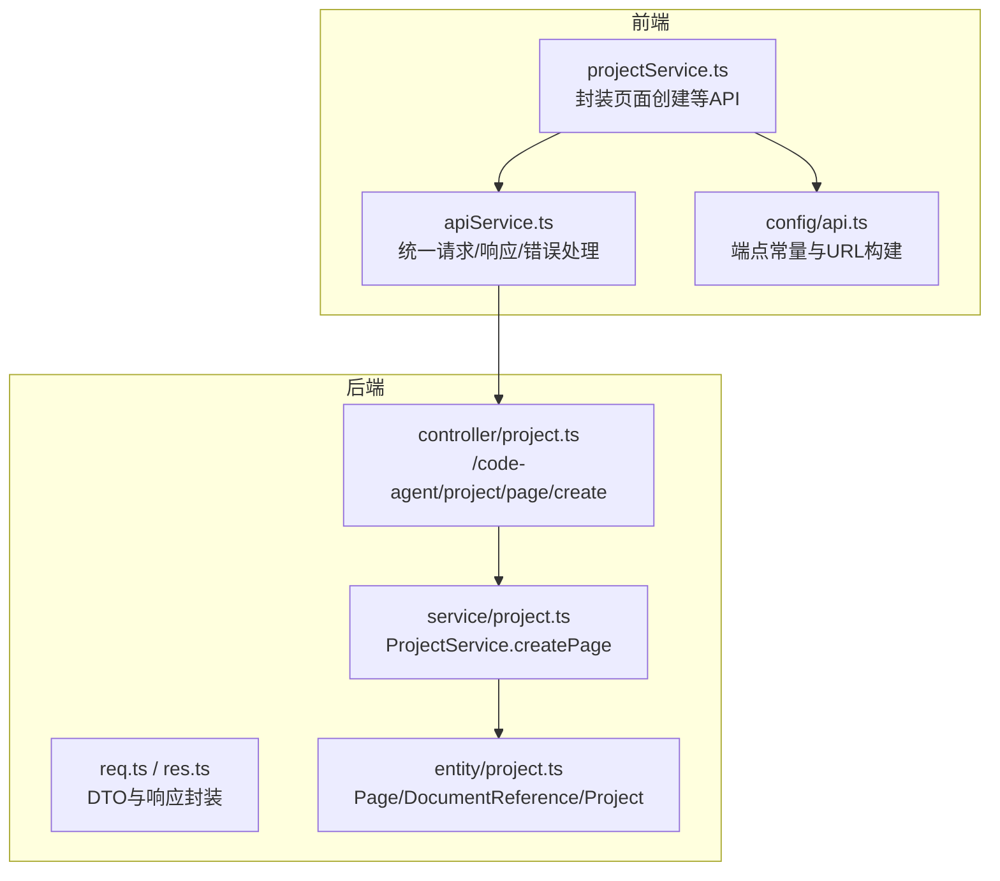
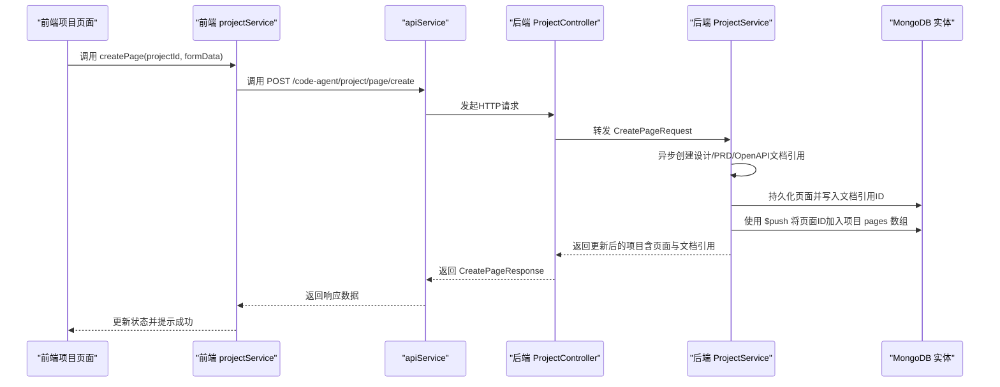
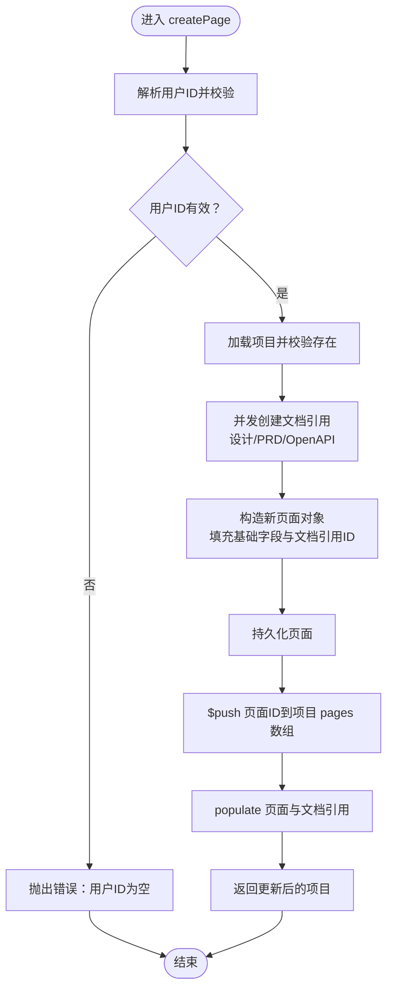
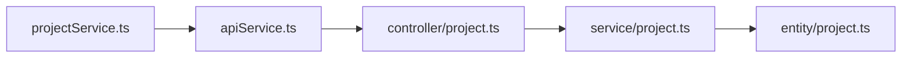

# 创建页面

<cite>
**本文引用的文件**
- [code-agent-backend/src/dto/code-agent/req.ts](file://code-agent-backend/src/dto/code-agent/req.ts)
- [code-agent-backend/src/dto/code-agent/res.ts](file://code-agent-backend/src/dto/code-agent/res.ts)
- [code-agent-backend/src/controller/code-agent/project.ts](file://code-agent-backend/src/controller/code-agent/project.ts)
- [code-agent-backend/src/service/code-agent/project.ts](file://code-agent-backend/src/service/code-agent/project.ts)
- [code-agent-backend/src/entity/code-agent/project.ts](file://code-agent-backend/src/entity/code-agent/project.ts)
- [fta-layout-design/src/services/projectService.ts](file://fta-layout-design/src/services/projectService.ts)
- [fta-layout-design/src/utils/apiService.ts](file://fta-layout-design/src/utils/apiService.ts)
- [fta-layout-design/src/config/api.ts](file://fta-layout-design/src/config/api.ts)
- [fta-layout-design/src/types/project.ts](file://fta-layout-design/src/types/project.ts)
</cite>

## 目录
1. [简介](#简介)
2. [项目结构](#项目结构)
3. [核心组件](#核心组件)
4. [架构总览](#架构总览)
5. [详细组件分析](#详细组件分析)
6. [依赖分析](#依赖分析)
7. [性能考虑](#性能考虑)
8. [故障排查指南](#故障排查指南)
9. [结论](#结论)
10. [附录](#附录)

## 简介
本章节围绕“创建页面”能力进行系统性说明，重点解析 CreatePageRequest 数据结构及其在后端 ProjectService 的实现细节，覆盖以下关键点：
- CreatePageRequest 字段：项目ID、页面名称、路由路径、描述、设计稿URL、PRD文档URL、OpenAPI文档URL
- 前端通过 POST /code-agent/project/page/create 接口调用创建页面
- 后端 ProjectService.createPage 的实现要点：异步创建文档引用、$push 维护项目-页面关系、数据一致性与错误处理
- 设计文档、PRD文档、OpenAPI文档引用的创建流程与状态初始化为'pending'的设计考量
- 页面ID生成策略（generateId 方法）与时间戳处理
- 前端 projectService.createPage 如何封装 API 调用并与后端交互

## 项目结构
该功能横跨后端 DTO/Controller/Service/MongoDB 实体层与前端 Service/API 封装层，形成清晰的分层职责：
- 后端
  - DTO：定义 CreatePageRequest 等请求/响应结构
  - Controller：暴露 /code-agent/project/page/create 接口
  - Service：实现 createPage 逻辑，包含文档引用创建、页面持久化、项目-页面关联
  - Entity：Page/DocumentReference/Project 等实体定义
- 前端
  - projectService.ts：封装项目/页面相关 API 调用
  - apiService.ts：统一请求/响应处理、错误处理
  - config/api.ts：API 端点常量与 URL 构建

图表来源
- [fta-layout-design/src/services/projectService.ts](file://fta-layout-design/src/services/projectService.ts#L142-L154)
- [fta-layout-design/src/utils/apiService.ts](file://fta-layout-design/src/utils/apiService.ts#L461-L565)
- [fta-layout-design/src/config/api.ts](file://fta-layout-design/src/config/api.ts#L33-L57)
- [code-agent-backend/src/controller/code-agent/project.ts](file://code-agent-backend/src/controller/code-agent/project.ts#L144-L156)
- [code-agent-backend/src/service/code-agent/project.ts](file://code-agent-backend/src/service/code-agent/project.ts#L356-L409)
- [code-agent-backend/src/entity/code-agent/project.ts](file://code-agent-backend/src/entity/code-agent/project.ts#L1-L167)

章节来源
- [code-agent-backend/src/dto/code-agent/req.ts](file://code-agent-backend/src/dto/code-agent/req.ts#L136-L174)
- [code-agent-backend/src/controller/code-agent/project.ts](file://code-agent-backend/src/controller/code-agent/project.ts#L144-L156)
- [code-agent-backend/src/service/code-agent/project.ts](file://code-agent-backend/src/service/code-agent/project.ts#L356-L409)
- [code-agent-backend/src/entity/code-agent/project.ts](file://code-agent-backend/src/entity/code-agent/project.ts#L1-L167)
- [fta-layout-design/src/services/projectService.ts](file://fta-layout-design/src/services/projectService.ts#L142-L154)
- [fta-layout-design/src/utils/apiService.ts](file://fta-layout-design/src/utils/apiService.ts#L461-L565)
- [fta-layout-design/src/config/api.ts](file://fta-layout-design/src/config/api.ts#L33-L57)

## 核心组件
- CreatePageRequest 数据结构
  - 字段说明
    - projectId：项目ID（必填）
    - name：页面名称（必填）
    - routePath：路由路径（必填）
    - description：页面描述（可选）
    - designUrls：设计稿URL数组（可选）
    - prdUrls：PRD文档URL数组（可选）
    - openapiUrls：OpenAPI文档URL数组（可选）
  - 字段来源与示例参考：[CreatePageRequest](file://code-agent-backend/src/dto/code-agent/req.ts#L136-L174)

- 响应结构
  - CreatePageResponse：封装成功标志与返回的项目对象
  - SimpleProject/简单页面类型用于 Swagger 展示
  - 参考：[CreatePageResponse](file://code-agent-backend/src/dto/code-agent/res.ts#L112-L116)、[SimplePage](file://code-agent-backend/src/dto/code-agent/res.ts#L131-L145)

- 前端调用封装
  - projectService.createPage：统一走 api.project.page.create
  - 参考：[projectService.createPage](file://fta-layout-design/src/services/projectService.ts#L142-L154)

章节来源
- [code-agent-backend/src/dto/code-agent/req.ts](file://code-agent-backend/src/dto/code-agent/req.ts#L136-L174)
- [code-agent-backend/src/dto/code-agent/res.ts](file://code-agent-backend/src/dto/code-agent/res.ts#L112-L145)
- [fta-layout-design/src/services/projectService.ts](file://fta-layout-design/src/services/projectService.ts#L142-L154)

## 架构总览
从前端到后端的完整调用链路如下：

图表来源
- [fta-layout-design/src/services/projectService.ts](file://fta-layout-design/src/services/projectService.ts#L142-L154)
- [fta-layout-design/src/utils/apiService.ts](file://fta-layout-design/src/utils/apiService.ts#L461-L565)
- [fta-layout-design/src/config/api.ts](file://fta-layout-design/src/config/api.ts#L33-L57)
- [code-agent-backend/src/controller/code-agent/project.ts](file://code-agent-backend/src/controller/code-agent/project.ts#L144-L156)
- [code-agent-backend/src/service/code-agent/project.ts](file://code-agent-backend/src/service/code-agent/project.ts#L356-L409)
- [code-agent-backend/src/entity/code-agent/project.ts](file://code-agent-backend/src/entity/code-agent/project.ts#L63-L105)

## 详细组件分析

### CreatePageRequest 数据结构与字段语义
- 字段定义与约束
  - 必填字段：projectId、name、routePath
  - 可选字段：description、designUrls、prdUrls、openapiUrls
- 字段来源与示例参考
  - [CreatePageRequest](file://code-agent-backend/src/dto/code-agent/req.ts#L136-L174)
- 字段在前端类型中的体现
  - 前端 Page 类型包含 designDocuments、prdDocuments、openapiDocuments 字段，用于统一管理文档引用
  - [Page 类型定义](file://fta-layout-design/src/types/project.ts#L48-L65)

章节来源
- [code-agent-backend/src/dto/code-agent/req.ts](file://code-agent-backend/src/dto/code-agent/req.ts#L136-L174)
- [fta-layout-design/src/types/project.ts](file://fta-layout-design/src/types/project.ts#L48-L65)

### 后端接口：POST /code-agent/project/page/create
- 控制器入口
  - 在 ProjectController 中定义 /code-agent/project/page/create，接收 CreatePageRequest，调用 ProjectService.createPage 并返回 CreatePageResponse
  - 参考：[ProjectController.createPage](file://code-agent-backend/src/controller/code-agent/project.ts#L144-L156)
- 前端端点映射
  - 前端 apiService 中将 project.page.create 映射到 /code-agent/project/page/create
  - 参考：[API_ENDPOINTS.project.page.create](file://fta-layout-design/src/config/api.ts#L45-L50)、[api.project.page.create](file://fta-layout-design/src/utils/apiService.ts#L506-L507)

章节来源
- [code-agent-backend/src/controller/code-agent/project.ts](file://code-agent-backend/src/controller/code-agent/project.ts#L144-L156)
- [fta-layout-design/src/config/api.ts](file://fta-layout-design/src/config/api.ts#L45-L50)
- [fta-layout-design/src/utils/apiService.ts](file://fta-layout-design/src/utils/apiService.ts#L506-L507)

### 后端实现：ProjectService.createPage
- 关键流程
  - 解析用户ID并校验存在性
  - 异步创建三类文档引用：设计稿、PRD、OpenAPI（Promise.all 并行）
  - 构造新页面对象，填充基础字段与文档引用ID数组
  - 持久化页面（Page）
  - 使用 $push 将页面ID加入项目 pages 数组，并 populate 页面与文档引用
  - 返回更新后的项目对象
- 重要实现细节
  - 异步创建文档引用：createDocumentReferences
    - 为每个URL生成文档ID、派生文档名称、初始化状态为'pending'、进度为0
    - 批量插入 DocumentReference
    - 参考：[createDocumentReferences](file://code-agent-backend/src/service/code-agent/project.ts#L107-L138)
  - 页面ID生成策略：generateId('page')
    - 使用随机字符串+时间戳组合，确保唯一性
    - 参考：[generateId](file://code-agent-backend/src/service/code-agent/project.ts#L87-L92)
  - 时间戳处理：createdAt/updatedAt
    - 统一使用 new Date()，并在更新/同步场景中复用
    - 参考：[createPage 时间戳](file://code-agent-backend/src/service/code-agent/project.ts#L359-L383)
  - 项目-页面关系维护：$push
    - 使用 findOneAndUpdate 并 $push 将页面ID加入项目 pages 数组
    - 参考：[$push 维护关系](file://code-agent-backend/src/service/code-agent/project.ts#L396-L402)
  - 数据一致性与错误处理
    - 若找不到项目或用户ID为空，抛出错误
    - populate 页面与文档引用，避免循环引用问题
    - 参考：[findProject/populate](file://code-agent-backend/src/service/code-agent/project.ts#L188-L201)

图表来源
- [code-agent-backend/src/service/code-agent/project.ts](file://code-agent-backend/src/service/code-agent/project.ts#L356-L409)
- [code-agent-backend/src/entity/code-agent/project.ts](file://code-agent-backend/src/entity/code-agent/project.ts#L63-L105)

章节来源
- [code-agent-backend/src/service/code-agent/project.ts](file://code-agent-backend/src/service/code-agent/project.ts#L87-L92)
- [code-agent-backend/src/service/code-agent/project.ts](file://code-agent-backend/src/service/code-agent/project.ts#L107-L138)
- [code-agent-backend/src/service/code-agent/project.ts](file://code-agent-backend/src/service/code-agent/project.ts#L356-L409)
- [code-agent-backend/src/entity/code-agent/project.ts](file://code-agent-backend/src/entity/code-agent/project.ts#L63-L105)

### 文档引用创建流程与状态初始化
- 文档引用创建
  - 依据 URL 数组批量创建 DocumentReference，包含 id、url、name、status、progress、createdAt、updatedAt、pageId、userId、gitId
  - 初始化 status 为 'pending'，progress 为 0
  - 参考：[createDocumentReferences](file://code-agent-backend/src/service/code-agent/project.ts#L107-L138)
- 文档状态初始化为'pending'的设计考量
  - 表示文档已录入但尚未完成同步/解析，便于前端展示“待处理”状态
  - 后续可通过 updateDocumentStatus 或 syncDocument 进行状态流转
  - 参考：[DocumentReference.status 枚举](file://code-agent-backend/src/entity/code-agent/project.ts#L1-L54)

章节来源
- [code-agent-backend/src/service/code-agent/project.ts](file://code-agent-backend/src/service/code-agent/project.ts#L107-L138)
- [code-agent-backend/src/entity/code-agent/project.ts](file://code-agent-backend/src/entity/code-agent/project.ts#L1-L54)

### 页面ID生成策略与时间戳处理
- 页面ID生成
  - generateId('page')：前缀+随机字符串+时间戳，保证全局唯一
  - 参考：[generateId](file://code-agent-backend/src/service/code-agent/project.ts#L87-L92)
- 时间戳处理
  - 创建/更新/同步均使用 new Date()，并统一更新 updatedAt
  - 参考：[createPage 时间戳](file://code-agent-backend/src/service/code-agent/project.ts#L359-L383)、[updateDocumentStatus 时间戳](file://code-agent-backend/src/service/code-agent/project.ts#L496-L523)

章节来源
- [code-agent-backend/src/service/code-agent/project.ts](file://code-agent-backend/src/service/code-agent/project.ts#L87-L92)
- [code-agent-backend/src/service/code-agent/project.ts](file://code-agent-backend/src/service/code-agent/project.ts#L359-L383)
- [code-agent-backend/src/service/code-agent/project.ts](file://code-agent-backend/src/service/code-agent/project.ts#L496-L523)

### 前端 projectService.createPage 与后端交互
- 前端封装
  - projectService.createPage：统一走 api.project.page.create，返回响应数据
  - 参考：[projectService.createPage](file://fta-layout-design/src/services/projectService.ts#L142-L154)
- API 封装
  - apiService：统一请求/响应/错误处理，支持超时、Cookies 注入、SSE 等
  - 参考：[api.project.page.create](file://fta-layout-design/src/utils/apiService.ts#L506-L507)、[ApiService](file://fta-layout-design/src/utils/apiService.ts#L299-L456)
- 端点映射
  - config/api.ts 定义 /code-agent/project/page/create
  - 参考：[API_ENDPOINTS.project.page.create](file://fta-layout-design/src/config/api.ts#L45-L50)

章节来源
- [fta-layout-design/src/services/projectService.ts](file://fta-layout-design/src/services/projectService.ts#L142-L154)
- [fta-layout-design/src/utils/apiService.ts](file://fta-layout-design/src/utils/apiService.ts#L299-L456)
- [fta-layout-design/src/config/api.ts](file://fta-layout-design/src/config/api.ts#L45-L50)

## 依赖分析
- 组件耦合与内聚
  - Controller 仅负责路由与参数转发，内聚度高
  - Service 聚合业务逻辑，包含文档引用创建、页面持久化、项目-页面关系维护
  - Entity 定义数据模型与关系，避免循环引用
- 外部依赖
  - MongoDB Typegoose：实体模型与查询
  - 前端 fetch：apiService 统一封装 HTTP 请求
- 潜在循环依赖
  - 当前结构清晰，无明显循环依赖迹象

图表来源
- [code-agent-backend/src/controller/code-agent/project.ts](file://code-agent-backend/src/controller/code-agent/project.ts#L144-L156)
- [code-agent-backend/src/service/code-agent/project.ts](file://code-agent-backend/src/service/code-agent/project.ts#L356-L409)
- [code-agent-backend/src/entity/code-agent/project.ts](file://code-agent-backend/src/entity/code-agent/project.ts#L63-L105)
- [fta-layout-design/src/services/projectService.ts](file://fta-layout-design/src/services/projectService.ts#L142-L154)
- [fta-layout-design/src/utils/apiService.ts](file://fta-layout-design/src/utils/apiService.ts#L299-L456)

章节来源
- [code-agent-backend/src/controller/code-agent/project.ts](file://code-agent-backend/src/controller/code-agent/project.ts#L144-L156)
- [code-agent-backend/src/service/code-agent/project.ts](file://code-agent-backend/src/service/code-agent/project.ts#L356-L409)
- [code-agent-backend/src/entity/code-agent/project.ts](file://code-agent-backend/src/entity/code-agent/project.ts#L63-L105)
- [fta-layout-design/src/services/projectService.ts](file://fta-layout-design/src/services/projectService.ts#L142-L154)
- [fta-layout-design/src/utils/apiService.ts](file://fta-layout-design/src/utils/apiService.ts#L299-L456)

## 性能考虑
- 并发优化
  - createPage 中对三类文档引用创建采用 Promise.all 并行执行，缩短整体耗时
  - 参考：[并发创建文档引用](file://code-agent-backend/src/service/code-agent/project.ts#L369-L374)
- 数据一致性
  - 使用 findOneAndUpdate + $push 原子性地维护项目-页面关系，避免竞态
  - populate 页面与文档引用，减少后续查询次数
  - 参考：[$push 维护关系](file://code-agent-backend/src/service/code-agent/project.ts#L396-L402)
- 建议
  - 对 URL 数组进行去重与清洗，减少无效文档引用
  - 在高并发场景下，可考虑引入幂等键与重试策略

[本节为通用建议，无需特定文件来源]

## 故障排查指南
- 常见错误与定位
  - 用户ID为空：resolveUserId 未找到用户，抛出错误
    - 参考：[resolveUserId](file://code-agent-backend/src/service/code-agent/project.ts#L45-L55)
  - 项目不存在：findProject/findPageInProject 抛出错误
    - 参考：[findProject](file://code-agent-backend/src/service/code-agent/project.ts#L188-L201)、[findPageInProject](file://code-agent-backend/src/service/code-agent/project.ts#L203-L211)
  - 文档不存在：syncDocument/getDocumentContent
    - 参考：[syncDocument](file://code-agent-backend/src/service/code-agent/project.ts#L530-L598)、[getDocumentContent](file://code-agent-backend/src/service/code-agent/project.ts#L600-L622)
- 前端错误处理
  - apiService 统一捕获 HTTP 错误与业务错误，支持超时与 Abort
  - 参考：[ApiError/错误处理](file://fta-layout-design/src/utils/apiService.ts#L61-L149)

章节来源
- [code-agent-backend/src/service/code-agent/project.ts](file://code-agent-backend/src/service/code-agent/project.ts#L45-L55)
- [code-agent-backend/src/service/code-agent/project.ts](file://code-agent-backend/src/service/code-agent/project.ts#L188-L201)
- [code-agent-backend/src/service/code-agent/project.ts](file://code-agent-backend/src/service/code-agent/project.ts#L530-L598)
- [code-agent-backend/src/service/code-agent/project.ts](file://code-agent-backend/src/service/code-agent/project.ts#L600-L622)
- [fta-layout-design/src/utils/apiService.ts](file://fta-layout-design/src/utils/apiService.ts#L61-L149)

## 结论
- CreatePageRequest 提供了创建页面所需的最小必要字段，并通过可选的文档URL数组扩展页面与设计/需求/接口文档的关联
- 后端通过 ProjectService.createPage 实现了高内聚的业务逻辑：异步创建文档引用、原子性维护项目-页面关系、统一时间戳与状态初始化
- 前端通过 projectService 与 apiService 封装，简化了调用复杂度，统一了错误处理与超时控制
- 设计文档、PRD文档、OpenAPI文档引用的状态初始化为'pending'，为后续同步与状态流转提供了清晰的起点

[本节为总结性内容，无需特定文件来源]

## 附录

### API 调用示例（请求体与响应）
- 请求
  - 方法：POST
  - 路径：/code-agent/project/page/create
  - 请求体字段：projectId、name、routePath、description（可选）、designUrls（可选）、prdUrls（可选）、openapiUrls（可选）
  - 参考：[CreatePageRequest](file://code-agent-backend/src/dto/code-agent/req.ts#L136-L174)
- 响应
  - 成功：CreatePageResponse，data 为项目对象（包含新增页面与文档引用）
  - 参考：[CreatePageResponse](file://code-agent-backend/src/dto/code-agent/res.ts#L112-L116)

章节来源
- [code-agent-backend/src/dto/code-agent/req.ts](file://code-agent-backend/src/dto/code-agent/req.ts#L136-L174)
- [code-agent-backend/src/dto/code-agent/res.ts](file://code-agent-backend/src/dto/code-agent/res.ts#L112-L116)