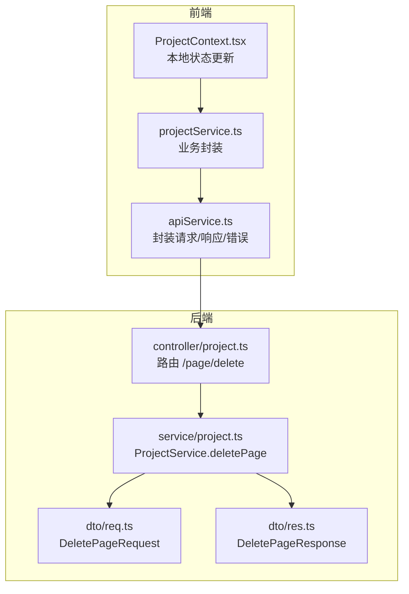
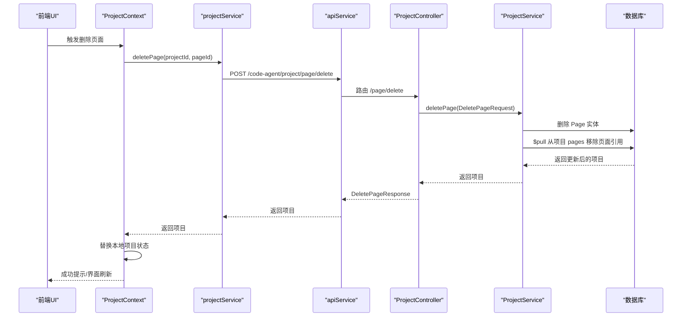
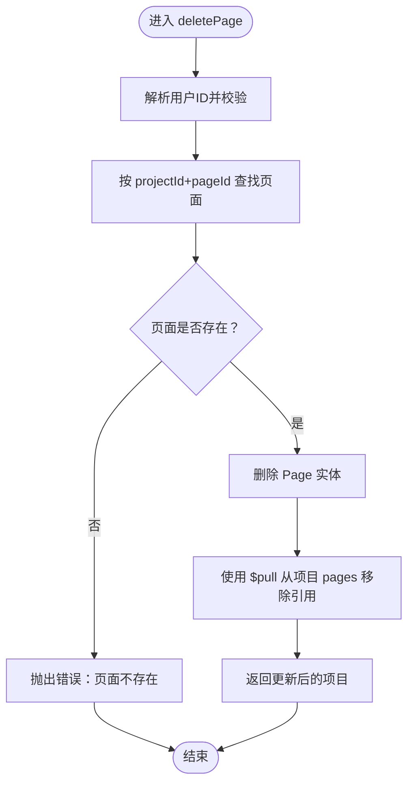
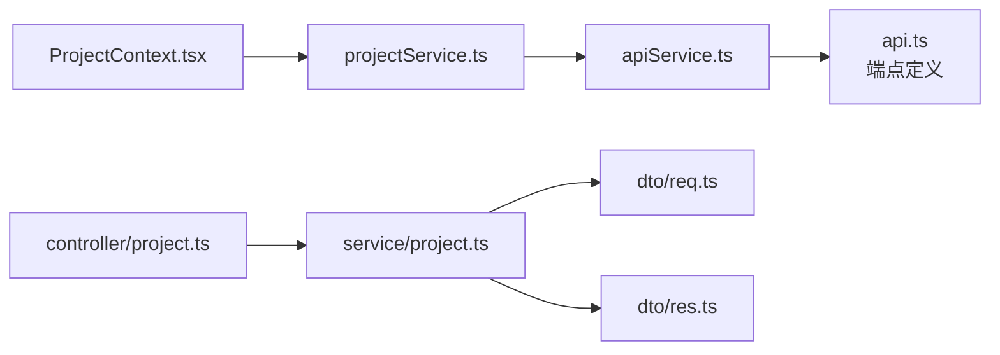

# 删除页面

<cite>
**本文引用的文件**
- [code-agent-backend/src/dto/code-agent/req.ts](file://code-agent-backend/src/dto/code-agent/req.ts)
- [code-agent-backend/src/dto/code-agent/res.ts](file://code-agent-backend/src/dto/code-agent/res.ts)
- [code-agent-backend/src/controller/code-agent/project.ts](file://code-agent-backend/src/controller/code-agent/project.ts)
- [code-agent-backend/src/service/code-agent/project.ts](file://code-agent-backend/src/service/code-agent/project.ts)
- [fta-layout-design/src/config/api.ts](file://fta-layout-design/src/config/api.ts)
- [fta-layout-design/src/utils/apiService.ts](file://fta-layout-design/src/utils/apiService.ts)
- [fta-layout-design/src/services/projectService.ts](file://fta-layout-design/src/services/projectService.ts)
- [fta-layout-design/src/contexts/ProjectContext.tsx](file://fta-layout-design/src/contexts/ProjectContext.tsx)
</cite>

## 目录
1. [简介](#简介)
2. [项目结构](#项目结构)
3. [核心组件](#核心组件)
4. [架构总览](#架构总览)
5. [详细组件分析](#详细组件分析)
6. [依赖分析](#依赖分析)
7. [性能考虑](#性能考虑)
8. [故障排查指南](#故障排查指南)
9. [结论](#结论)
10. [附录](#附录)

## 简介
本章节围绕“删除页面”功能展开，系统性阐述从请求到响应、从前端调用到后端实现、再到数据库与项目关系一致性的完整流程。重点包括：
- DeletePageRequest 数据结构：项目ID与页面ID两个字段的语义与约束
- 前端操作指南：在项目管理界面安全删除页面的步骤与交互提示
- 后端实现细节：ProjectService.deletePage 的事务性操作与一致性保障
- 数据一致性机制：先删除 Page 实体，再使用 $pull 从项目 pages 字段移除引用
- 删除后处理策略：当前代码未自动清理相关文档引用，建议的后续改进方向
- 前端 projectService.deletePage 的调用链路、错误处理与本地状态更新

## 项目结构
删除页面涉及前后端协作的关键文件如下：
- 后端
  - 控制器：接收请求并返回统一响应
  - 服务层：执行删除逻辑，维护项目与页面的关系一致性
  - DTO：定义 DeletePageRequest/DeletePageResponse 的结构
- 前端
  - API 配置：定义 /code-agent/project/page/delete 端点
  - API 工具：封装请求、响应与错误处理
  - 服务层：对 API 调用进行统一封装，供业务组件使用
  - 上下文：负责本地状态更新与错误提示

图表来源
- [code-agent-backend/src/controller/code-agent/project.ts](file://code-agent-backend/src/controller/code-agent/project.ts#L174-L184)
- [code-agent-backend/src/service/code-agent/project.ts](file://code-agent-backend/src/service/code-agent/project.ts#L465-L490)
- [code-agent-backend/src/dto/code-agent/req.ts](file://code-agent-backend/src/dto/code-agent/req.ts#L218-L228)
- [code-agent-backend/src/dto/code-agent/res.ts](file://code-agent-backend/src/dto/code-agent/res.ts#L123-L128)
- [fta-layout-design/src/utils/apiService.ts](file://fta-layout-design/src/utils/apiService.ts#L510-L526)
- [fta-layout-design/src/services/projectService.ts](file://fta-layout-design/src/services/projectService.ts#L174-L186)
- [fta-layout-design/src/contexts/ProjectContext.tsx](file://fta-layout-design/src/contexts/ProjectContext.tsx#L171-L184)

章节来源
- [code-agent-backend/src/controller/code-agent/project.ts](file://code-agent-backend/src/controller/code-agent/project.ts#L174-L184)
- [code-agent-backend/src/service/code-agent/project.ts](file://code-agent-backend/src/service/code-agent/project.ts#L465-L490)
- [code-agent-backend/src/dto/code-agent/req.ts](file://code-agent-backend/src/dto/code-agent/req.ts#L218-L228)
- [code-agent-backend/src/dto/code-agent/res.ts](file://code-agent-backend/src/dto/code-agent/res.ts#L123-L128)
- [fta-layout-design/src/utils/apiService.ts](file://fta-layout-design/src/utils/apiService.ts#L510-L526)
- [fta-layout-design/src/services/projectService.ts](file://fta-layout-design/src/services/projectService.ts#L174-L186)
- [fta-layout-design/src/contexts/ProjectContext.tsx](file://fta-layout-design/src/contexts/ProjectContext.tsx#L171-L184)

## 核心组件
- DeletePageRequest：删除页面的请求体，包含页面ID（必填），以及可选的项目ID
- DeletePageResponse：删除页面的响应体，返回更新后的项目对象
- ProjectController.deletePage：接收前端请求，调用服务层并返回统一响应
- ProjectService.deletePage：核心业务逻辑，先删除 Page 实体，再从项目 pages 引用中移除该页面
- 前端 apiService.project.page.delete：封装删除页面的 API 调用
- 前端 projectService.deletePage：业务封装，统一错误处理与响应数据
- 前端 ProjectContext.deletePage：触发删除并更新本地状态

章节来源
- [code-agent-backend/src/dto/code-agent/req.ts](file://code-agent-backend/src/dto/code-agent/req.ts#L218-L228)
- [code-agent-backend/src/dto/code-agent/res.ts](file://code-agent-backend/src/dto/code-agent/res.ts#L123-L128)
- [code-agent-backend/src/controller/code-agent/project.ts](file://code-agent-backend/src/controller/code-agent/project.ts#L174-L184)
- [code-agent-backend/src/service/code-agent/project.ts](file://code-agent-backend/src/service/code-agent/project.ts#L465-L490)
- [fta-layout-design/src/utils/apiService.ts](file://fta-layout-design/src/utils/apiService.ts#L510-L526)
- [fta-layout-design/src/services/projectService.ts](file://fta-layout-design/src/services/projectService.ts#L174-L186)
- [fta-layout-design/src/contexts/ProjectContext.tsx](file://fta-layout-design/src/contexts/ProjectContext.tsx#L171-L184)

## 架构总览
删除页面的端到端流程如下：
- 前端点击删除按钮，调用 projectService.deletePage
- projectService 通过 apiService 调用后端 /code-agent/project/page/delete
- 控制器 ProjectController 接收请求，调用 ProjectService.deletePage
- 服务层执行删除逻辑：先删除 Page 实体，再使用 $pull 从项目 pages 引用中移除该页面
- 返回 DeletePageResponse，前端更新本地状态并提示成功

图表来源
- [code-agent-backend/src/controller/code-agent/project.ts](file://code-agent-backend/src/controller/code-agent/project.ts#L174-L184)
- [code-agent-backend/src/service/code-agent/project.ts](file://code-agent-backend/src/service/code-agent/project.ts#L465-L490)
- [fta-layout-design/src/services/projectService.ts](file://fta-layout-design/src/services/projectService.ts#L174-L186)
- [fta-layout-design/src/utils/apiService.ts](file://fta-layout-design/src/utils/apiService.ts#L510-L526)
- [fta-layout-design/src/contexts/ProjectContext.tsx](file://fta-layout-design/src/contexts/ProjectContext.tsx#L171-L184)

## 详细组件分析

### DeletePageRequest 数据结构
- 字段说明
  - projectId：可选。用于限定页面所属项目，便于校验与定位
  - pageId：必填。待删除页面的唯一标识
- 约束与验证
  - 后端在服务层会根据 projectId 与 pageId 查找页面，若不存在将抛出异常
  - 用户维度校验：服务层会解析当前用户ID，确保删除操作仅限于当前用户可见的资源

章节来源
- [code-agent-backend/src/dto/code-agent/req.ts](file://code-agent-backend/src/dto/code-agent/req.ts#L218-L228)
- [code-agent-backend/src/service/code-agent/project.ts](file://code-agent-backend/src/service/code-agent/project.ts#L465-L490)

### 后端控制器与服务层
- 控制器 ProjectController.deletePage
  - 路由：POST /code-agent/project/page/delete
  - 行为：接收 DeletePageRequest，调用 ProjectService.deletePage，并返回 DeletePageResponse
- 服务层 ProjectService.deletePage
  - 校验用户身份
  - 校验页面存在性（findPageInProject）
  - 删除 Page 实体（deleteOne）
  - 使用 $pull 从项目 pages 引用中移除该页面
  - 返回更新后的项目对象

图表来源
- [code-agent-backend/src/controller/code-agent/project.ts](file://code-agent-backend/src/controller/code-agent/project.ts#L174-L184)
- [code-agent-backend/src/service/code-agent/project.ts](file://code-agent-backend/src/service/code-agent/project.ts#L465-L490)

章节来源
- [code-agent-backend/src/controller/code-agent/project.ts](file://code-agent-backend/src/controller/code-agent/project.ts#L174-L184)
- [code-agent-backend/src/service/code-agent/project.ts](file://code-agent-backend/src/service/code-agent/project.ts#L465-L490)

### 前端调用链与本地状态更新
- API 配置
  - 端点：/code-agent/project/page/delete
- API 工具
  - 封装请求、响应与错误处理，支持超时与 Cookie 透传
- 业务封装
  - projectService.deletePage：统一调用 apiService.project.page.delete，并返回响应数据
- 本地状态更新
  - ProjectContext.deletePage：调用 projectService.deletePage，成功后替换本地项目状态，清空错误

章节来源
- [fta-layout-design/src/config/api.ts](file://fta-layout-design/src/config/api.ts#L33-L57)
- [fta-layout-design/src/utils/apiService.ts](file://fta-layout-design/src/utils/apiService.ts#L1-L200)
- [fta-layout-design/src/services/projectService.ts](file://fta-layout-design/src/services/projectService.ts#L174-L186)
- [fta-layout-design/src/contexts/ProjectContext.tsx](file://fta-layout-design/src/contexts/ProjectContext.tsx#L171-L184)

### 删除后的数据一致性与级联操作
- 一致性保障
  - 先删除 Page 实体，再从项目 pages 引用中移除，避免悬挂引用
  - 使用 $pull 操作确保项目 pages 字段与实际页面记录保持一致
- 级联操作
  - 当前实现仅移除页面实体与项目中的引用，未自动清理页面关联的文档引用（designDocuments、prdDocuments、openapiDocuments）
  - 若需彻底清理，可在服务层扩展：在删除 Page 前，先查询并删除或断开这些文档引用；或在删除后异步清理

章节来源
- [code-agent-backend/src/service/code-agent/project.ts](file://code-agent-backend/src/service/code-agent/project.ts#L465-L490)

### 前端操作指南（初学者）
- 在项目管理界面找到目标页面
- 点击“删除”按钮，弹出确认提示
- 确认后，前端调用删除接口，成功后界面自动刷新，页面从列表中消失
- 若出现错误，前端会显示错误提示并保留页面不变

章节来源
- [fta-layout-design/src/contexts/ProjectContext.tsx](file://fta-layout-design/src/contexts/ProjectContext.tsx#L171-L184)
- [fta-layout-design/src/services/projectService.ts](file://fta-layout-design/src/services/projectService.ts#L174-L186)

### 高级开发者要点（事务性与一致性）
- 事务性建议
  - 当前实现为两条独立数据库操作：删除 Page 与 $pull 项目引用
  - 若希望更强的一致性，可在同一事务中执行（取决于数据库与驱动支持）
- 错误处理
  - 服务层对“页面不存在”“项目不存在”等场景抛出明确错误
  - 控制器捕获错误并返回 400
- 响应结构
  - DeletePageResponse 返回更新后的项目对象，前端据此更新本地状态

章节来源
- [code-agent-backend/src/service/code-agent/project.ts](file://code-agent-backend/src/service/code-agent/project.ts#L465-L490)
- [code-agent-backend/src/controller/code-agent/project.ts](file://code-agent-backend/src/controller/code-agent/project.ts#L174-L184)
- [code-agent-backend/src/dto/code-agent/res.ts](file://code-agent-backend/src/dto/code-agent/res.ts#L123-L128)

## 依赖分析
- 前端依赖
  - apiService 依赖 API_ENDPOINTS（/code-agent/project/page/delete）
  - projectService 依赖 apiService
  - ProjectContext 依赖 projectService
- 后端依赖
  - ProjectController 依赖 ProjectService
  - ProjectService 依赖 DTO（DeletePageRequest/DeletePageResponse）、数据库实体与上下文（用户ID）

图表来源
- [fta-layout-design/src/contexts/ProjectContext.tsx](file://fta-layout-design/src/contexts/ProjectContext.tsx#L171-L184)
- [fta-layout-design/src/services/projectService.ts](file://fta-layout-design/src/services/projectService.ts#L174-L186)
- [fta-layout-design/src/utils/apiService.ts](file://fta-layout-design/src/utils/apiService.ts#L510-L526)
- [fta-layout-design/src/config/api.ts](file://fta-layout-design/src/config/api.ts#L33-L57)
- [code-agent-backend/src/controller/code-agent/project.ts](file://code-agent-backend/src/controller/code-agent/project.ts#L174-L184)
- [code-agent-backend/src/service/code-agent/project.ts](file://code-agent-backend/src/service/code-agent/project.ts#L465-L490)
- [code-agent-backend/src/dto/code-agent/req.ts](file://code-agent-backend/src/dto/code-agent/req.ts#L218-L228)
- [code-agent-backend/src/dto/code-agent/res.ts](file://code-agent-backend/src/dto/code-agent/res.ts#L123-L128)

章节来源
- [fta-layout-design/src/config/api.ts](file://fta-layout-design/src/config/api.ts#L33-L57)
- [fta-layout-design/src/utils/apiService.ts](file://fta-layout-design/src/utils/apiService.ts#L510-L526)
- [fta-layout-design/src/services/projectService.ts](file://fta-layout-design/src/services/projectService.ts#L174-L186)
- [fta-layout-design/src/contexts/ProjectContext.tsx](file://fta-layout-design/src/contexts/ProjectContext.tsx#L171-L184)
- [code-agent-backend/src/controller/code-agent/project.ts](file://code-agent-backend/src/controller/code-agent/project.ts#L174-L184)
- [code-agent-backend/src/service/code-agent/project.ts](file://code-agent-backend/src/service/code-agent/project.ts#L465-L490)
- [code-agent-backend/src/dto/code-agent/req.ts](file://code-agent-backend/src/dto/code-agent/req.ts#L218-L228)
- [code-agent-backend/src/dto/code-agent/res.ts](file://code-agent-backend/src/dto/code-agent/res.ts#L123-L128)

## 性能考虑
- 删除操作为单条记录删除与一次数组更新，复杂度较低
- 建议
  - 对频繁删除的场景，可在项目 pages 字段上建立索引以优化 $pull 性能
  - 若页面数量庞大，可考虑分批或异步清理相关文档引用，避免阻塞主流程

## 故障排查指南
- 常见错误
  - 页面不存在：服务层抛错并由控制器返回 400
  - 项目不存在：服务层抛错并由控制器返回 400
  - 用户ID为空：服务层抛错
- 前端处理
  - projectService 与 ProjectContext 对错误进行捕获与提示
  - 删除失败时，本地状态不会变更，界面保持原状

章节来源
- [code-agent-backend/src/service/code-agent/project.ts](file://code-agent-backend/src/service/code-agent/project.ts#L465-L490)
- [code-agent-backend/src/controller/code-agent/project.ts](file://code-agent-backend/src/controller/code-agent/project.ts#L174-L184)
- [fta-layout-design/src/services/projectService.ts](file://fta-layout-design/src/services/projectService.ts#L174-L186)
- [fta-layout-design/src/contexts/ProjectContext.tsx](file://fta-layout-design/src/contexts/ProjectContext.tsx#L171-L184)

## 结论
删除页面功能在前后端协同下实现了清晰的职责分离与一致的用户体验。后端通过先删实体再移除引用的方式，确保项目与页面关系的完整性；前端通过统一的服务封装与本地状态更新，提供了流畅的交互体验。当前实现未自动清理页面关联的文档引用，建议在后续迭代中补充清理策略，以进一步提升数据一致性与可维护性。

## 附录

### API 请求与响应示例（路径引用）
- 请求
  - 端点：/code-agent/project/page/delete
  - 方法：POST
  - 请求体字段：pageId（必填）、projectId（可选）
- 响应
  - 成功：DeletePageResponse，data 为更新后的项目对象
  - 失败：控制器返回 400，前端捕获并提示错误

章节来源
- [code-agent-backend/src/dto/code-agent/req.ts](file://code-agent-backend/src/dto/code-agent/req.ts#L218-L228)
- [code-agent-backend/src/dto/code-agent/res.ts](file://code-agent-backend/src/dto/code-agent/res.ts#L123-L128)
- [code-agent-backend/src/controller/code-agent/project.ts](file://code-agent-backend/src/controller/code-agent/project.ts#L174-L184)
- [fta-layout-design/src/config/api.ts](file://fta-layout-design/src/config/api.ts#L33-L57)
- [fta-layout-design/src/utils/apiService.ts](file://fta-layout-design/src/utils/apiService.ts#L510-L526)