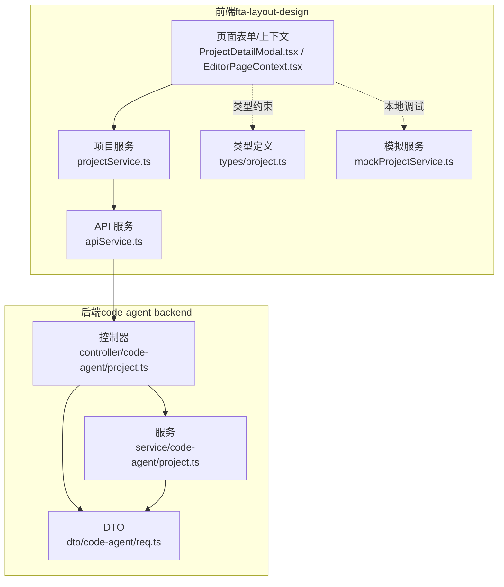
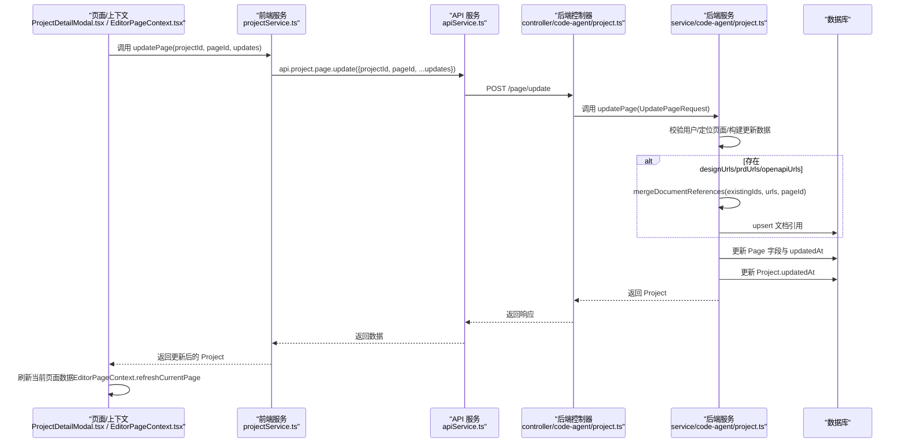
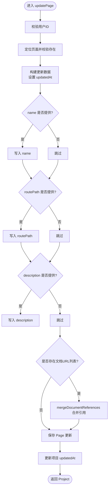
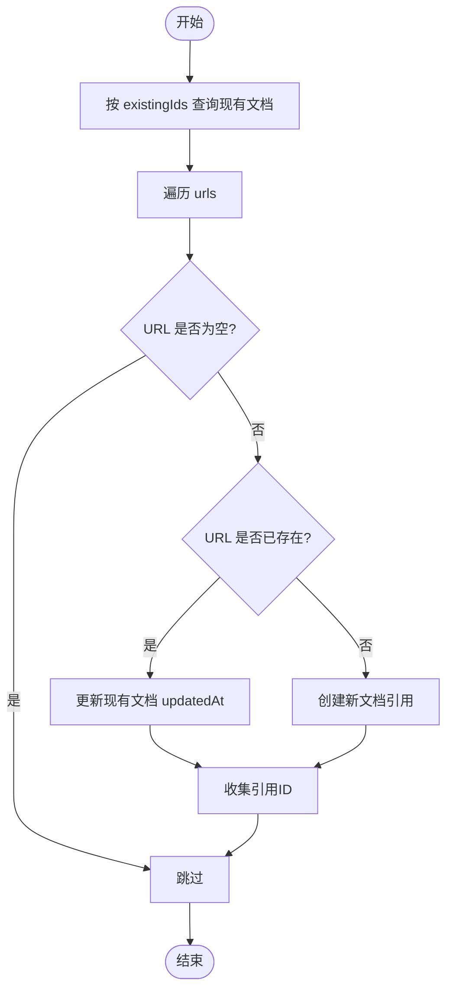
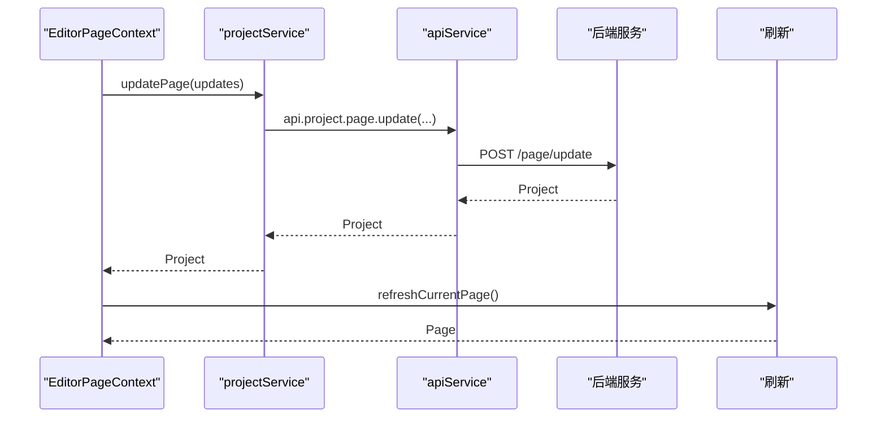
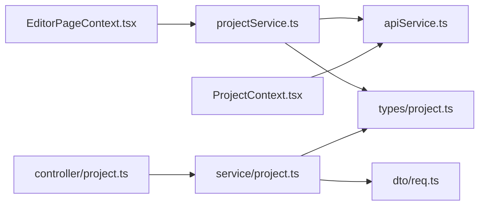

# 更新页面

<cite>
**本文引用的文件**
- [code-agent-backend/src/dto/code-agent/req.ts](file://code-agent-backend/src/dto/code-agent/req.ts)
- [code-agent-backend/src/controller/code-agent/project.ts](file://code-agent-backend/src/controller/code-agent/project.ts)
- [code-agent-backend/src/service/code-agent/project.ts](file://code-agent-backend/src/service/code-agent/project.ts)
- [fta-layout-design/src/services/projectService.ts](file://fta-layout-design/src/services/projectService.ts)
- [fta-layout-design/src/utils/apiService.ts](file://fta-layout-design/src/utils/apiService.ts)
- [fta-layout-design/src/contexts/ProjectContext.tsx](file://fta-layout-design/src/contexts/ProjectContext.tsx)
- [fta-layout-design/src/pages/EditorPage/contexts/EditorPageContext.tsx](file://fta-layout-design/src/pages/EditorPage/contexts/EditorPageContext.tsx)
- [fta-layout-design/src/components/ProjectDetailModal.tsx](file://fta-layout-design/src/components/ProjectDetailModal.tsx)
- [fta-layout-design/src/services/mockProjectService.ts](file://fta-layout-design/src/services/mockProjectService.ts)
- [fta-layout-design/src/types/project.ts](file://fta-layout-design/src/types/project.ts)
</cite>

## 目录
1. [简介](#简介)
2. [项目结构](#项目结构)
3. [核心组件](#核心组件)
4. [架构总览](#架构总览)
5. [详细组件分析](#详细组件分析)
6. [依赖分析](#依赖分析)
7. [性能考虑](#性能考虑)
8. [故障排查指南](#故障排查指南)
9. [结论](#结论)
10. [附录](#附录)

## 简介
本章节面向“更新页面”功能，系统性阐述页面信息修改的完整链路：从前端交互、API 请求参数与响应格式、后端服务实现，到文档引用的智能合并与一致性维护。文档特别聚焦以下要点：
- UpdatePageRequest 数据结构：可选的页面名称、路由路径、描述，以及设计稿、PRD、OpenAPI 文档URL列表。
- 字段更新策略：仅更新提供的字段，避免对未提供字段产生副作用。
- 文档引用合并策略：mergeDocumentReferences 如何在新增、更新、去重之间保持引用关系一致。
- 前端交互：ProjectContext 与 EditorPageContext 的 updatePage 流程，以及成功更新后的状态刷新机制。

## 项目结构
更新页面涉及前后端协作的关键模块如下：
- 前端（fta-layout-design）
  - 服务层：projectService.ts 将页面更新请求转发至 apiService
  - API 层：apiService.ts 提供统一的 HTTP 请求封装与端点映射
  - 上下文层：ProjectContext.tsx 与 EditorPageContext.tsx 负责状态管理与交互
  - 类型定义：types/project.ts 定义 Page、DocumentReference 等数据模型
  - 模拟服务：mockProjectService.ts 提供本地模拟实现，便于调试与演示
- 后端（code-agent-backend）
  - 控制器：controller/code-agent/project.ts 暴露 /page/update 接口
  - DTO：dto/code-agent/req.ts 定义 UpdatePageRequest 结构
  - 服务：service/code-agent/project.ts 实现 updatePage 与 mergeDocumentReferences

图表来源
- [fta-layout-design/src/services/projectService.ts](file://fta-layout-design/src/services/projectService.ts#L156-L172)
- [fta-layout-design/src/utils/apiService.ts](file://fta-layout-design/src/utils/apiService.ts#L500-L528)
- [code-agent-backend/src/controller/code-agent/project.ts](file://code-agent-backend/src/controller/code-agent/project.ts#L161-L169)
- [code-agent-backend/src/dto/code-agent/req.ts](file://code-agent-backend/src/dto/code-agent/req.ts#L176-L216)
- [code-agent-backend/src/service/code-agent/project.ts](file://code-agent-backend/src/service/code-agent/project.ts#L414-L461)

章节来源
- [fta-layout-design/src/services/projectService.ts](file://fta-layout-design/src/services/projectService.ts#L156-L172)
- [fta-layout-design/src/utils/apiService.ts](file://fta-layout-design/src/utils/apiService.ts#L500-L528)
- [code-agent-backend/src/controller/code-agent/project.ts](file://code-agent-backend/src/controller/code-agent/project.ts#L161-L169)
- [code-agent-backend/src/dto/code-agent/req.ts](file://code-agent-backend/src/dto/code-agent/req.ts#L176-L216)
- [code-agent-backend/src/service/code-agent/project.ts](file://code-agent-backend/src/service/code-agent/project.ts#L414-L461)

## 核心组件
- UpdatePageRequest（后端 DTO）
  - 字段：projectId、pageId、name（可选）、routePath（可选）、description（可选）、designUrls（可选）、prdUrls（可选）、openapiUrls（可选）
  - 作用：作为 /page/update 的请求体，承载页面属性与文档URL列表的更新请求
- ProjectService.updatePage（前端服务）
  - 参数：projectId、pageId、Partial<Page> & { designUrls?, prdUrls?, openapiUrls? }
  - 行为：将请求体透传给 api.project.page.update，返回更新后的 Project
- ProjectContext.updatePage / EditorPageContext.updatePage（前端上下文）
  - 参数：updates（同上）
  - 行为：调用 projectService.updatePage，成功后刷新当前页面数据
- ProjectService.updatePage（后端服务）
  - 行为：校验用户身份、定位页面、按需更新 name/routePath/description；对文档URL列表调用 mergeDocumentReferences 合并引用；更新页面与项目时间戳；返回最新 Project
- mergeDocumentReferences（后端服务私有方法）
  - 输入：现有文档引用ID列表、待合并URL列表、pageId
  - 输出：新的文档引用ID列表
  - 策略：若URL已存在则更新其updatedAt；否则创建新文档引用并入库

章节来源
- [code-agent-backend/src/dto/code-agent/req.ts](file://code-agent-backend/src/dto/code-agent/req.ts#L176-L216)
- [fta-layout-design/src/services/projectService.ts](file://fta-layout-design/src/services/projectService.ts#L156-L172)
- [fta-layout-design/src/contexts/ProjectContext.tsx](file://fta-layout-design/src/contexts/ProjectContext.tsx#L152-L169)
- [fta-layout-design/src/pages/EditorPage/contexts/EditorPageContext.tsx](file://fta-layout-design/src/pages/EditorPage/contexts/EditorPageContext.tsx#L140-L158)
- [code-agent-backend/src/service/code-agent/project.ts](file://code-agent-backend/src/service/code-agent/project.ts#L414-L461)
- [code-agent-backend/src/service/code-agent/project.ts](file://code-agent-backend/src/service/code-agent/project.ts#L144-L186)

## 架构总览
更新页面的端到端流程如下：

图表来源
- [fta-layout-design/src/contexts/ProjectContext.tsx](file://fta-layout-design/src/contexts/ProjectContext.tsx#L152-L169)
- [fta-layout-design/src/pages/EditorPage/contexts/EditorPageContext.tsx](file://fta-layout-design/src/pages/EditorPage/contexts/EditorPageContext.tsx#L140-L158)
- [fta-layout-design/src/services/projectService.ts](file://fta-layout-design/src/services/projectService.ts#L156-L172)
- [fta-layout-design/src/utils/apiService.ts](file://fta-layout-design/src/utils/apiService.ts#L500-L528)
- [code-agent-backend/src/controller/code-agent/project.ts](file://code-agent-backend/src/controller/code-agent/project.ts#L161-L169)
- [code-agent-backend/src/service/code-agent/project.ts](file://code-agent-backend/src/service/code-agent/project.ts#L414-L461)

## 详细组件分析

### UpdatePageRequest 数据结构与字段更新策略
- 字段说明
  - projectId：所属项目ID
  - pageId：页面ID
  - name：页面名称（可选）
  - routePath：路由路径（可选）
  - description：页面描述（可选）
  - designUrls：设计稿URL列表（可选）
  - prdUrls：PRD文档URL列表（可选）
  - openapiUrls：OpenAPI文档URL列表（可选）
- 字段更新策略
  - 仅当对应字段存在时才写入 Page 更新对象，未提供的字段保持不变
  - 文档URL列表通过 mergeDocumentReferences 合并，保证引用关系一致性

章节来源
- [code-agent-backend/src/dto/code-agent/req.ts](file://code-agent-backend/src/dto/code-agent/req.ts#L176-L216)
- [code-agent-backend/src/service/code-agent/project.ts](file://code-agent-backend/src/service/code-agent/project.ts#L422-L446)

### 后端 ProjectService.updatePage 实现细节
- 用户校验与页面定位
  - resolveUserId 校验用户身份
  - findPageInProject 定位页面，不存在则抛错
- 更新数据构建
  - 设置 updatedAt
  - 条件更新 name、routePath、description
- 文档引用合并
  - 对 designUrls、prdUrls、openapiUrls 分别调用 mergeDocumentReferences
  - mergeDocumentReferences 逻辑：根据URL匹配现有文档，存在则更新updatedAt，不存在则创建新文档并入库
- 数据持久化
  - pageEntity.updateOne 写入 Page 更新
  - projectEntity.findOneAndUpdate 更新项目 updatedAt
- 返回值
  - 返回最新 Project，并自动 populate 页面文档引用

图表来源
- [code-agent-backend/src/service/code-agent/project.ts](file://code-agent-backend/src/service/code-agent/project.ts#L414-L461)
- [code-agent-backend/src/service/code-agent/project.ts](file://code-agent-backend/src/service/code-agent/project.ts#L144-L186)

章节来源
- [code-agent-backend/src/service/code-agent/project.ts](file://code-agent-backend/src/service/code-agent/project.ts#L414-L461)
- [code-agent-backend/src/service/code-agent/project.ts](file://code-agent-backend/src/service/code-agent/project.ts#L144-L186)

### mergeDocumentReferences 合并策略与一致性
- 输入输出
  - 输入：existingIds（现有文档引用ID列表）、urls（待合并URL列表）、pageId
  - 输出：新的文档引用ID列表
- 合并策略
  - 遍历 urls，过滤空URL
  - 若URL已存在于现有文档中：更新该文档的 updatedAt
  - 若URL不存在：创建新文档引用（含默认状态、时间戳等），并入库
  - 最终返回合并后的文档引用ID列表
- 一致性保障
  - 通过数据库唯一性与URL匹配，避免重复引用
  - 更新时仅更新 updatedAt，不改变其他字段，确保最小化副作用

图表来源
- [code-agent-backend/src/service/code-agent/project.ts](file://code-agent-backend/src/service/code-agent/project.ts#L144-L186)

章节来源
- [code-agent-backend/src/service/code-agent/project.ts](file://code-agent-backend/src/service/code-agent/project.ts#L144-L186)

### 前端交互与状态刷新机制
- ProjectContext.updatePage
  - 调用 apiServices.project.updatePage，成功后替换全局项目状态
- EditorPageContext.updatePage
  - 调用 projectService.updatePage，成功后调用 refreshCurrentPage 刷新当前页面数据
- 删除文档引用（辅助流程）
  - EditorPageContext.deleteDocument 会基于当前页面的文档集合构造新的URL列表并调用 updatePage
  - 成功后刷新页面数据，必要时清空当前选中的文档

图表来源
- [fta-layout-design/src/pages/EditorPage/contexts/EditorPageContext.tsx](file://fta-layout-design/src/pages/EditorPage/contexts/EditorPageContext.tsx#L140-L158)
- [fta-layout-design/src/services/projectService.ts](file://fta-layout-design/src/services/projectService.ts#L156-L172)
- [fta-layout-design/src/utils/apiService.ts](file://fta-layout-design/src/utils/apiService.ts#L500-L528)

章节来源
- [fta-layout-design/src/contexts/ProjectContext.tsx](file://fta-layout-design/src/contexts/ProjectContext.tsx#L152-L169)
- [fta-layout-design/src/pages/EditorPage/contexts/EditorPageContext.tsx](file://fta-layout-design/src/pages/EditorPage/contexts/EditorPageContext.tsx#L140-L158)
- [fta-layout-design/src/services/projectService.ts](file://fta-layout-design/src/services/projectService.ts#L156-L172)

### 文档引用增删改逻辑与数据一致性
- 增加（新增URL）
  - mergeDocumentReferences 为不存在的URL创建新文档引用并入库
- 更新（URL已存在）
  - 仅更新 updatedAt，不改变其他字段
- 删除（URL被移除）
  - 通过 EditorPageContext.deleteDocument 构造新的URL列表并调用 updatePage
  - 后端仅保留列表中存在的URL对应的文档引用，未在列表中的引用不会被删除，但也不会被新增
  - 由于URL列表是“全量替换”的方式，删除即不再出现在列表中，从而达到“删除引用”的效果

章节来源
- [code-agent-backend/src/service/code-agent/project.ts](file://code-agent-backend/src/service/code-agent/project.ts#L144-L186)
- [fta-layout-design/src/pages/EditorPage/contexts/EditorPageContext.tsx](file://fta-layout-design/src/pages/EditorPage/contexts/EditorPageContext.tsx#L160-L193)

### 初学者操作流程（项目详情中修改页面属性）
- 打开项目详情页面，找到目标页面
- 点击“编辑页面”，填写或修改页面名称、路由路径、描述
- 在“设计稿/PRD/OpenAPI”区域，输入或修改URL列表
- 点击“更新页面”，等待提示成功
- 页面数据将自动刷新，显示最新的页面属性与文档引用

章节来源
- [fta-layout-design/src/components/ProjectDetailModal.tsx](file://fta-layout-design/src/components/ProjectDetailModal.tsx#L211-L252)
- [fta-layout-design/src/contexts/ProjectContext.tsx](file://fta-layout-design/src/contexts/ProjectContext.tsx#L152-L169)

## 依赖分析
- 前端依赖
  - projectService 依赖 apiService 的端点映射
  - EditorPageContext 依赖 projectService 进行页面更新与刷新
  - 类型定义 types/project.ts 为 Page、DocumentReference 等提供强类型约束
- 后端依赖
  - controller 依赖 service 实现业务逻辑
  - service 依赖 DTO 校验请求参数，依赖实体进行数据库操作
- 数据一致性
  - mergeDocumentReferences 通过URL匹配与数据库操作保证引用一致性
  - 更新页面时仅更新提供的字段，避免覆盖未提供字段

图表来源
- [fta-layout-design/src/services/projectService.ts](file://fta-layout-design/src/services/projectService.ts#L156-L172)
- [fta-layout-design/src/utils/apiService.ts](file://fta-layout-design/src/utils/apiService.ts#L500-L528)
- [fta-layout-design/src/pages/EditorPage/contexts/EditorPageContext.tsx](file://fta-layout-design/src/pages/EditorPage/contexts/EditorPageContext.tsx#L140-L158)
- [fta-layout-design/src/contexts/ProjectContext.tsx](file://fta-layout-design/src/contexts/ProjectContext.tsx#L152-L169)
- [code-agent-backend/src/controller/code-agent/project.ts](file://code-agent-backend/src/controller/code-agent/project.ts#L161-L169)
- [code-agent-backend/src/service/code-agent/project.ts](file://code-agent-backend/src/service/code-agent/project.ts#L414-L461)
- [code-agent-backend/src/dto/code-agent/req.ts](file://code-agent-backend/src/dto/code-agent/req.ts#L176-L216)

章节来源
- [fta-layout-design/src/services/projectService.ts](file://fta-layout-design/src/services/projectService.ts#L156-L172)
- [fta-layout-design/src/utils/apiService.ts](file://fta-layout-design/src/utils/apiService.ts#L500-L528)
- [code-agent-backend/src/controller/code-agent/project.ts](file://code-agent-backend/src/controller/code-agent/project.ts#L161-L169)
- [code-agent-backend/src/service/code-agent/project.ts](file://code-agent-backend/src/service/code-agent/project.ts#L414-L461)
- [code-agent-backend/src/dto/code-agent/req.ts](file://code-agent-backend/src/dto/code-agent/req.ts#L176-L216)

## 性能考虑
- 文档引用合并
  - mergeDocumentReferences 采用一次批量查询 existingDocs，再逐URL比对，复杂度近似 O(n+m)，其中 n 为URL数量，m 为现有文档数量
  - 对于大量URL的场景，建议分批提交或限制单次URL数量，以减少数据库往返
- 数据库写入
  - 合并过程中可能涉及多次 upsert 或 create，建议在数据库层面启用索引（如按URL唯一索引）以提升匹配与插入效率
- 前端渲染
  - 更新完成后统一刷新页面数据，避免多次重渲染；EditorPageContext.refreshCurrentPage 仅在成功后触发，减少不必要的刷新

## 故障排查指南
- 常见错误
  - 用户ID为空：后端 resolveUserId 校验失败，抛出异常
  - 项目或页面不存在：定位失败抛出异常
  - HTTP错误或业务状态码非成功：apiService 统一抛出 ApiError
- 建议排查步骤
  - 检查请求体是否包含必需字段（projectId、pageId）
  - 确认 URL 列表无空值且格式正确
  - 查看后端日志定位 resolveUserId/findPageInProject 抛错位置
  - 前端捕获 ApiError 并提示具体错误信息

章节来源
- [code-agent-backend/src/service/code-agent/project.ts](file://code-agent-backend/src/service/code-agent/project.ts#L414-L461)
- [code-agent-backend/src/service/code-agent/project.ts](file://code-agent-backend/src/service/code-agent/project.ts#L188-L211)
- [fta-layout-design/src/utils/apiService.ts](file://fta-layout-design/src/utils/apiService.ts#L118-L149)

## 结论
更新页面功能通过“仅更新提供字段”的策略与“智能合并文档引用”的机制，实现了对页面属性与文档关系的精细化管理。前端通过 ProjectContext 与 EditorPageContext 提供直观的交互体验，后端通过 DTO 校验与 mergeDocumentReferences 保障数据一致性与性能。整体方案具备良好的扩展性与可维护性。

## 附录
- API 请求参数与响应格式
  - 请求端点：POST /page/update
  - 请求体字段：projectId、pageId、name（可选）、routePath（可选）、description（可选）、designUrls（可选）、prdUrls（可选）、openapiUrls（可选）
  - 响应体：返回更新后的 Project
- 类型定义参考
  - Page、DocumentReference 等类型定义位于 types/project.ts

章节来源
- [code-agent-backend/src/controller/code-agent/project.ts](file://code-agent-backend/src/controller/code-agent/project.ts#L161-L169)
- [code-agent-backend/src/dto/code-agent/req.ts](file://code-agent-backend/src/dto/code-agent/req.ts#L176-L216)
- [fta-layout-design/src/types/project.ts](file://fta-layout-design/src/types/project.ts#L48-L157)