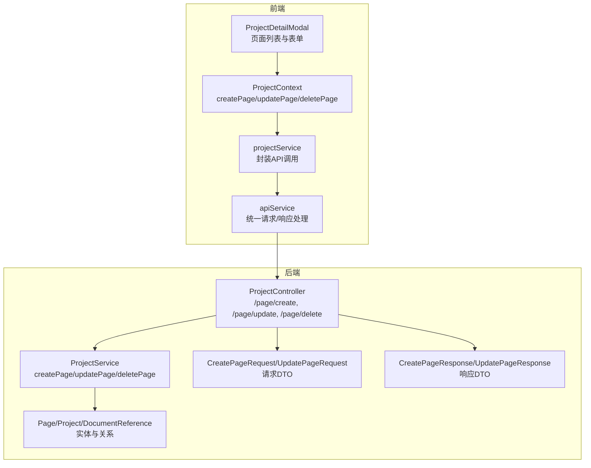
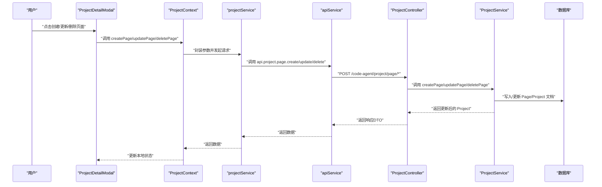
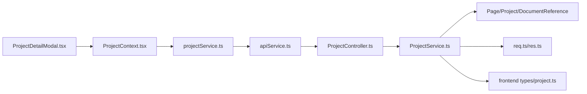

# 页面管理

<cite>
**本文引用的文件**
- [ProjectContext.tsx](file://fta-layout-design/src/contexts/ProjectContext.tsx)
- [projectService.ts](file://fta-layout-design/src/services/projectService.ts)
- [apiService.ts](file://fta-layout-design/src/utils/apiService.ts)
- [ProjectDetailModal.tsx](file://fta-layout-design/src/components/ProjectDetailModal.tsx)
- [project.ts（后端控制器）](file://code-agent-backend/src/controller/code-agent/project.ts)
- [project.ts（后端服务）](file://code-agent-backend/src/service/code-agent/project.ts)
- [project.ts（后端实体）](file://code-agent-backend/src/entity/code-agent/project.ts)
- [req.ts（后端DTO请求）](file://code-agent-backend/src/dto/code-agent/req.ts)
- [res.ts（后端DTO响应）](file://code-agent-backend/src/dto/code-agent/res.ts)
- [mockProjectService.ts](file://fta-layout-design/src/services/mockProjectService.ts)
- [project.ts（前端类型定义）](file://fta-layout-design/src/types/project.ts)
</cite>

## 目录
1. [简介](#简介)
2. [项目结构](#项目结构)
3. [核心组件](#核心组件)
4. [架构总览](#架构总览)
5. [详细组件分析](#详细组件分析)
6. [依赖分析](#依赖分析)
7. [性能考虑](#性能考虑)
8. [故障排查指南](#故障排查指南)
9. [结论](#结论)
10. [附录](#附录)

## 简介
本章节围绕“页面管理”能力进行系统性说明，覆盖页面的创建、更新、删除与关联管理。重点解析 Page 实体的数据结构（页面名称、路由路径、设计文档、PRD 文档、OpenAPI 文档等），并给出面向初学者的“项目详情模态框中创建和管理页面”的完整操作流程；面向高级开发者的实现细节包括：
- 异步创建文档引用（设计稿、PRD、OpenAPI）
- 使用 $push/$pull 维护项目-页面关系
- 数据一致性保障策略
- 前端 ProjectContext 中 createPage、updatePage 等方法通过 apiService 与后端交互的链路

## 项目结构
页面管理涉及前后端协作：前端负责 UI 交互与状态管理，后端负责数据持久化与一致性校验。

图表来源
- [ProjectDetailModal.tsx](file://fta-layout-design/src/components/ProjectDetailModal.tsx#L1-L316)
- [ProjectContext.tsx](file://fta-layout-design/src/contexts/ProjectContext.tsx#L137-L184)
- [projectService.ts](file://fta-layout-design/src/services/projectService.ts#L142-L186)
- [apiService.ts](file://fta-layout-design/src/utils/apiService.ts#L461-L565)
- [project.ts（后端控制器）](file://code-agent-backend/src/controller/code-agent/project.ts#L144-L198)
- [project.ts（后端服务）](file://code-agent-backend/src/service/code-agent/project.ts#L359-L491)
- [project.ts（后端实体）](file://code-agent-backend/src/entity/code-agent/project.ts#L63-L105)
- [req.ts（后端DTO请求）](file://code-agent-backend/src/dto/code-agent/req.ts#L136-L216)
- [res.ts（后端DTO响应）](file://code-agent-backend/src/dto/code-agent/res.ts#L112-L128)

章节来源
- [ProjectDetailModal.tsx](file://fta-layout-design/src/components/ProjectDetailModal.tsx#L1-L316)
- [ProjectContext.tsx](file://fta-layout-design/src/contexts/ProjectContext.tsx#L137-L184)
- [projectService.ts](file://fta-layout-design/src/services/projectService.ts#L142-L186)
- [apiService.ts](file://fta-layout-design/src/utils/apiService.ts#L461-L565)
- [project.ts（后端控制器）](file://code-agent-backend/src/controller/code-agent/project.ts#L144-L198)
- [project.ts（后端服务）](file://code-agent-backend/src/service/code-agent/project.ts#L359-L491)
- [project.ts（后端实体）](file://code-agent-backend/src/entity/code-agent/project.ts#L63-L105)
- [req.ts（后端DTO请求）](file://code-agent-backend/src/dto/code-agent/req.ts#L136-L216)
- [res.ts（后端DTO响应）](file://code-agent-backend/src/dto/code-agent/res.ts#L112-L128)

## 核心组件
- 前端 ProjectContext：封装 createPage、updatePage、deletePage 等方法，负责与后端交互并更新本地状态。
- 前端 projectService：对 apiService 的二次封装，屏蔽环境差异（mock/真实），统一返回格式。
- 前端 apiService：统一请求构建、超时控制、错误处理与响应校验。
- 后端 ProjectController：暴露 /page/create、/page/update、/page/delete 等接口。
- 后端 ProjectService：实现 createPage、updatePage、deletePage 的业务逻辑，含文档引用创建与合并、$push/$pull 维护项目-页面关系、一致性校验。
- 后端实体 Page/Project/DocumentReference：定义页面、项目与文档引用的字段与关系。
- 前端类型定义 project.ts：Page、DocumentReference 等类型，明确字段与默认值。

章节来源
- [ProjectContext.tsx](file://fta-layout-design/src/contexts/ProjectContext.tsx#L137-L184)
- [projectService.ts](file://fta-layout-design/src/services/projectService.ts#L142-L186)
- [apiService.ts](file://fta-layout-design/src/utils/apiService.ts#L461-L565)
- [project.ts（后端控制器）](file://code-agent-backend/src/controller/code-agent/project.ts#L144-L198)
- [project.ts（后端服务）](file://code-agent-backend/src/service/code-agent/project.ts#L359-L491)
- [project.ts（后端实体）](file://code-agent-backend/src/entity/code-agent/project.ts#L63-L105)
- [project.ts（前端类型定义）](file://fta-layout-design/src/types/project.ts#L48-L167)

## 架构总览
从前端到后端的页面管理调用链如下：

图表来源
- [ProjectDetailModal.tsx](file://fta-layout-design/src/components/ProjectDetailModal.tsx#L83-L101)
- [ProjectContext.tsx](file://fta-layout-design/src/contexts/ProjectContext.tsx#L137-L184)
- [projectService.ts](file://fta-layout-design/src/services/projectService.ts#L142-L186)
- [apiService.ts](file://fta-layout-design/src/utils/apiService.ts#L500-L521)
- [project.ts（后端控制器）](file://code-agent-backend/src/controller/code-agent/project.ts#L144-L198)
- [project.ts（后端服务）](file://code-agent-backend/src/service/code-agent/project.ts#L359-L491)

## 详细组件分析

### Page 实体与数据结构
- 字段概览（来自前端类型与后端实体）：
  - 基本信息：id、projectId、name、routePath、description、createdAt、updatedAt、userId、gitId
  - 文档关联：designDocuments、prdDocuments、openapiDocuments（均为 DocumentReference 数组）
  - 其他：designSpecs、prds、components（字符串数组或对象数组，视类型而定）

- 关系说明：
  - Page 属于 Project，Project.pages 通过引用维护一对多关系。
  - Page 的文档关联字段指向 DocumentReference，后端通过 ref 定义与 populate 支持跨集合查询。

- 默认值与约束：
  - 前端类型定义中，文档字段默认为空数组，便于直接渲染。
  - 后端实体中，文档字段使用 ref 指向 DocumentReference，且默认空数组。

章节来源
- [project.ts（前端类型定义）](file://fta-layout-design/src/types/project.ts#L48-L167)
- [project.ts（后端实体）](file://code-agent-backend/src/entity/code-agent/project.ts#L63-L105)

### 前端操作流程：项目详情模态框中创建与管理页面
- 创建页面
  - 打开“添加页面”弹窗，填写名称、路由路径、描述。
  - 提交后调用 ProjectContext.createPage，经 projectService 封装，最终通过 apiService 发送到后端。
  - 成功后刷新当前项目，显示新增页面。

- 更新页面
  - 在页面列表点击“编辑”，打开“编辑页面”弹窗。
  - 修改名称、路由路径、描述后提交，调用 ProjectContext.updatePage，后端返回最新项目数据，前端替换状态。

- 删除页面
  - 点击“删除”，弹出确认对话框，确认后调用 ProjectContext.deletePage，后端返回最新项目数据，前端移除对应页面。

- 页面跳转
  - 点击页面卡片，跳转至编辑器页面，携带 projectId 与 pageId 参数。

章节来源
- [ProjectDetailModal.tsx](file://fta-layout-design/src/components/ProjectDetailModal.tsx#L83-L101)
- [ProjectDetailModal.tsx](file://fta-layout-design/src/components/ProjectDetailModal.tsx#L103-L169)
- [ProjectDetailModal.tsx](file://fta-layout-design/src/components/ProjectDetailModal.tsx#L171-L250)
- [ProjectContext.tsx](file://fta-layout-design/src/contexts/ProjectContext.tsx#L137-L184)

### 后端实现细节：createPage
- 关键步骤
  - 校验用户上下文与项目存在性。
  - 并行异步创建设计稿、PRD、OpenAPI 文档引用（createDocumentReferences），每个 URL 对应一条 DocumentReference 记录。
  - 构造 Page 文档，填充基础字段与文档引用数组。
  - 将新建 Page 的 _id 通过 $push 追加到 Project.pages 中，同时更新项目 updatedAt。
  - 返回更新后的 Project，并 populate 页面与文档引用。

- 并发与一致性
  - 使用 Promise.all 并行创建文档引用，提升性能。
  - 通过 findOneAndUpdate + $push 保证项目-页面关系的一致性。

- 文档引用创建规则
  - 从 URL 衍生文档名，设置初始状态为 pending，进度为 0。
  - 保存后返回 DocumentReference 列表，供 Page.designDocuments/prdDocuments/openapiDocuments 使用。

章节来源
- [project.ts（后端服务）](file://code-agent-backend/src/service/code-agent/project.ts#L359-L409)
- [project.ts（后端服务）](file://code-agent-backend/src/service/code-agent/project.ts#L107-L138)

### 后端实现细节：updatePage
- 关键步骤
  - 校验用户上下文与页面存在性。
  - 仅更新 name、routePath、description 等基本信息。
  - 若传入 designUrls/prdUrls/openapiUrls，则通过 mergeDocumentReferences 合并：
    - 已存在的 URL 对应的文档引用保持不变并更新 updatedAt；
    - 新增 URL 创建新的 DocumentReference；
    - 最终将合并后的 _id 数组写回 Page 对应字段。
  - 更新 Page.updatedAt 与 Project.updatedAt，保证时间线一致。

- $push/$pull 维护项目-页面关系
  - 删除页面时使用 $pull 从 Project.pages 中移除 Page 的 _id。
  - 创建页面时使用 $push 将 Page 的 _id 追加到 Project.pages。

章节来源
- [project.ts（后端服务）](file://code-agent-backend/src/service/code-agent/project.ts#L411-L461)
- [project.ts（后端服务）](file://code-agent-backend/src/service/code-agent/project.ts#L463-L491)

### 后端实现细节：mergeDocumentReferences
- 输入：existingIds（已有文档引用 _id）、urls（待绑定的 URL 列表）、pageId
- 处理：
  - 读取 existingDocs（按 _id 过滤）。
  - 遍历 urls：
    - 若 URL 已存在，仅更新 updatedAt；
    - 若不存在，创建新的 DocumentReference。
- 输出：返回合并后的 DocumentReference._id 列表，用于写回 Page 的 designDocuments/prdDocuments/openapiDocuments。

复杂度分析
- 时间复杂度：O(n + m)，其中 n 为 urls 长度，m 为 existingDocs 数量（查询一次）。
- 空间复杂度：O(n)（返回的新数组）。

章节来源
- [project.ts（后端服务）](file://code-agent-backend/src/service/code-agent/project.ts#L140-L186)

### 文档状态同步机制：updateDocumentStatus
- 功能：更新指定文档的状态（如 pending/syncing/synced/failed/completed），并根据状态自动设置进度与最后同步时间。
- 影响范围：
  - 更新 DocumentReference 的 status/progress/lastSyncAt/updatedAt；
  - 更新 Page.updatedAt；
  - 更新 Project.updatedAt。

章节来源
- [project.ts（后端服务）](file://code-agent-backend/src/service/code-agent/project.ts#L493-L523)

### 前端 ProjectContext 与 apiService 交互
- ProjectContext.createPage/updatePage/deletePage
  - 调用 apiServices.project 对应方法（create/update/delete），并在成功后调用 replaceProjectInState 替换本地项目数据。
- projectService
  - 对 api.project.page.* 的封装，支持 mock 与真实环境切换。
- apiService
  - 统一请求构建、超时控制、错误处理与响应校验（兼容 code/success 双格式）。

章节来源
- [ProjectContext.tsx](file://fta-layout-design/src/contexts/ProjectContext.tsx#L137-L184)
- [projectService.ts](file://fta-layout-design/src/services/projectService.ts#L142-L186)
- [apiService.ts](file://fta-layout-design/src/utils/apiService.ts#L461-L565)

### API 请求与响应要点
- 创建页面
  - 请求：POST /code-agent/project/page/create
  - 请求体：CreatePageRequest（projectId、name、routePath、description、designUrls、prdUrls、openapiUrls）
  - 响应：CreatePageResponse（包含更新后的 Project）
- 更新页面
  - 请求：POST /code-agent/project/page/update
  - 请求体：UpdatePageRequest（projectId、pageId、name、routePath、description、designUrls、prdUrls、openapiUrls）
  - 响应：UpdatePageResponse（包含更新后的 Project）
- 删除页面
  - 请求：POST /code-agent/project/page/delete
  - 请求体：DeletePageRequest（projectId、pageId）
  - 响应：DeletePageResponse（包含更新后的 Project）

章节来源
- [project.ts（后端控制器）](file://code-agent-backend/src/controller/code-agent/project.ts#L144-L198)
- [req.ts（后端DTO请求）](file://code-agent-backend/src/dto/code-agent/req.ts#L136-L216)
- [res.ts（后端DTO响应）](file://code-agent-backend/src/dto/code-agent/res.ts#L112-L128)

## 依赖分析
- 前端依赖关系
  - ProjectDetailModal 依赖 ProjectContext，负责展示与交互。
  - ProjectContext 依赖 projectService，负责 API 调用。
  - projectService 依赖 apiService，负责网络层。
  - 类型定义 project.ts 为前后端共享，确保字段与默认值一致。

- 后端依赖关系
  - ProjectController 依赖 ProjectService。
  - ProjectService 依赖 Page/Project/DocumentReference 实体与 DTO。
  - 文档引用创建依赖 MasterGo/Gitlab 等外部服务（在后端服务中预留扩展点）。

图表来源
- [ProjectDetailModal.tsx](file://fta-layout-design/src/components/ProjectDetailModal.tsx#L1-L316)
- [ProjectContext.tsx](file://fta-layout-design/src/contexts/ProjectContext.tsx#L137-L184)
- [projectService.ts](file://fta-layout-design/src/services/projectService.ts#L142-L186)
- [apiService.ts](file://fta-layout-design/src/utils/apiService.ts#L461-L565)
- [project.ts（后端控制器）](file://code-agent-backend/src/controller/code-agent/project.ts#L144-L198)
- [project.ts（后端服务）](file://code-agent-backend/src/service/code-agent/project.ts#L359-L491)
- [project.ts（后端实体）](file://code-agent-backend/src/entity/code-agent/project.ts#L63-L105)
- [req.ts（后端DTO请求）](file://code-agent-backend/src/dto/code-agent/req.ts#L136-L216)
- [res.ts（后端DTO响应）](file://code-agent-backend/src/dto/code-agent/res.ts#L112-L128)
- [project.ts（前端类型定义）](file://fta-layout-design/src/types/project.ts#L48-L167)

## 性能考虑
- 并发创建文档引用：后端在创建页面时对三种文档引用采用 Promise.all 并行创建，减少总耗时。
- 局部更新：更新页面时仅更新必要字段，避免全量写入。
- 关系维护原子性：使用 $push/$pull 一次性更新项目-页面关系，降低并发冲突风险。
- 前端状态更新：ProjectContext 使用浅层替换策略，避免深层拷贝带来的性能损耗。

## 故障排查指南
- 常见错误与定位
  - 用户上下文缺失：resolveUserId 返回空，导致“用户 ID 不能为空”错误。检查登录态与中间件注入。
  - 项目不存在：findProject/findPageInProject 抛错，检查 projectId/pageId 是否正确。
  - 文档不存在：updateDocumentStatus/syncDocument/getDocumentContent 抛错，检查 documentId 与类型。
- 前端错误处理
  - apiService 统一捕获 HTTP 错误与业务错误，返回 ApiError；projectService 与 ProjectContext 捕获并提示用户。
  - mockProjectService 提供离线调试能力，便于快速定位问题。

章节来源
- [project.ts（后端服务）](file://code-agent-backend/src/service/code-agent/project.ts#L45-L55)
- [project.ts（后端服务）](file://code-agent-backend/src/service/code-agent/project.ts#L188-L201)
- [apiService.ts](file://fta-layout-design/src/utils/apiService.ts#L118-L149)
- [projectService.ts](file://fta-layout-design/src/services/projectService.ts#L142-L186)
- [ProjectContext.tsx](file://fta-layout-design/src/contexts/ProjectContext.tsx#L137-L184)

## 结论
页面管理在本项目中实现了清晰的前后端分工：前端负责交互与状态，后端负责数据一致性与关系维护。通过并发创建文档引用、$push/$pull 维护项目-页面关系以及完善的错误处理，系统在可用性与性能上取得平衡。建议在后续迭代中完善 PRD/OpenAPI 文档同步逻辑与状态机，进一步提升文档生命周期管理体验。

## 附录

### 页面删除的级联操作
- 删除页面时，后端先删除 Page 文档，再使用 $pull 从 Project.pages 中移除该页面的 _id，确保项目-页面关系一致性。

章节来源
- [project.ts（后端服务）](file://code-agent-backend/src/service/code-agent/project.ts#L463-L491)

### 文档状态同步机制（updateDocumentStatus）
- 根据传入状态自动设置 progress 与 lastSyncAt，并更新 Page 与 Project 的 updatedAt，保证时间线一致。

章节来源
- [project.ts（后端服务）](file://code-agent-backend/src/service/code-agent/project.ts#L493-L523)

### 前端 ProjectContext 方法与后端 API 的映射
- createPage -> POST /code-agent/project/page/create
- updatePage -> POST /code-agent/project/page/update
- deletePage -> POST /code-agent/project/page/delete

章节来源
- [ProjectContext.tsx](file://fta-layout-design/src/contexts/ProjectContext.tsx#L137-L184)
- [project.ts（后端控制器）](file://code-agent-backend/src/controller/code-agent/project.ts#L144-L198)
- [apiService.ts](file://fta-layout-design/src/utils/apiService.ts#L500-L521)