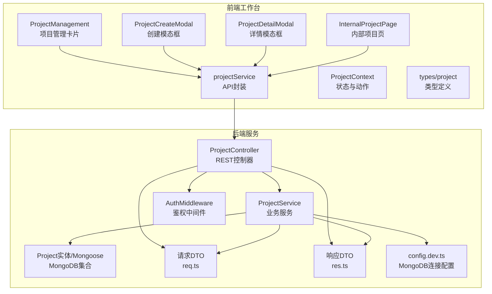
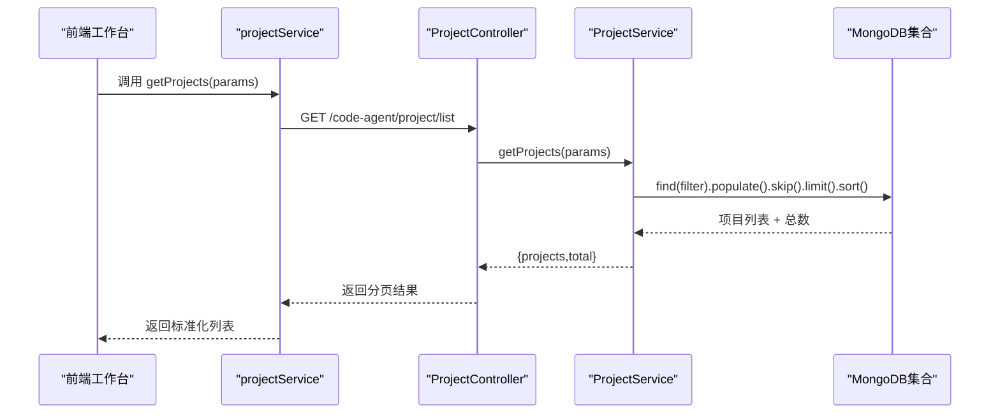
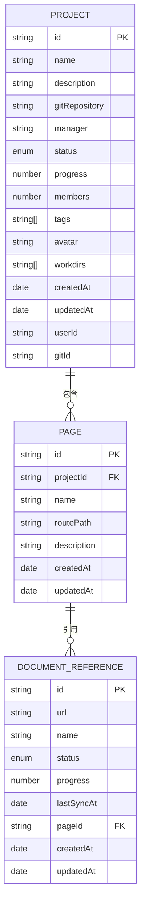
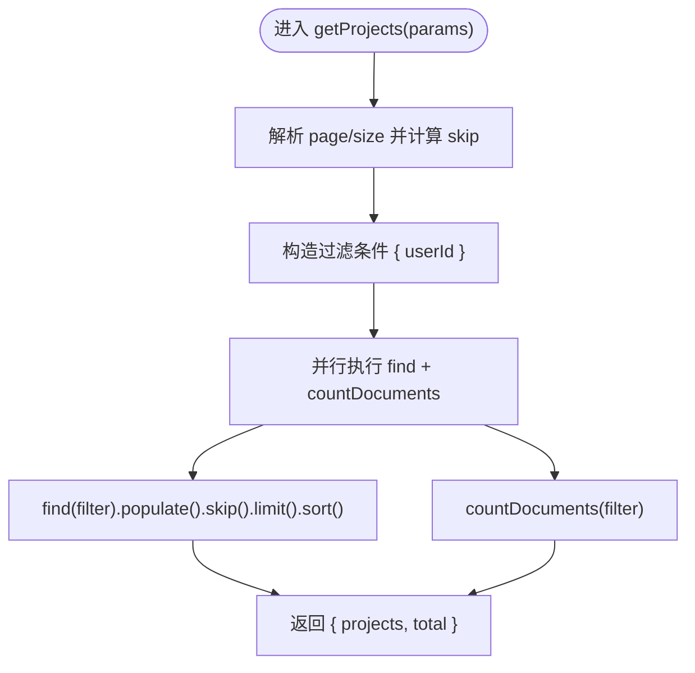
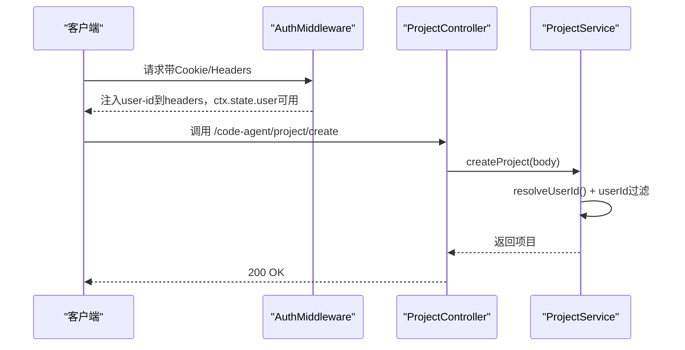
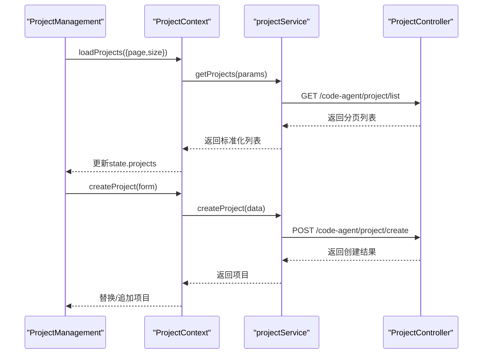
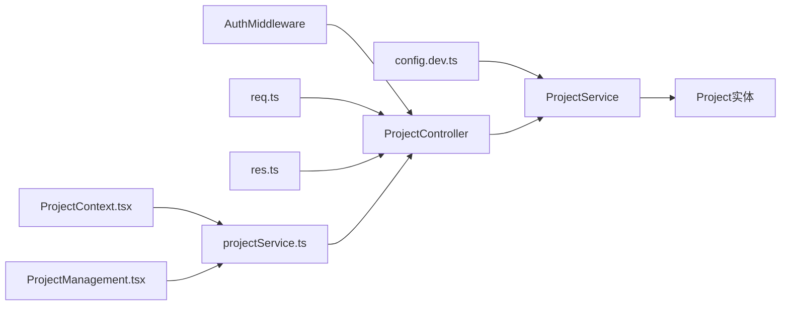

# 项目CRUD操作

<cite>
**本文引用的文件**
- [项目控制器 project.ts](file://code-agent-backend/src/controller/code-agent/project.ts)
- [项目服务 project.ts](file://code-agent-backend/src/service/code-agent/project.ts)
- [项目实体 project.ts](file://code-agent-backend/src/entity/code-agent/project.ts)
- [请求DTO req.ts](file://code-agent-backend/src/dto/code-agent/req.ts)
- [响应DTO res.ts](file://code-agent-backend/src/dto/code-agent/res.ts)
- [用户上下文 DTO user-context.ts](file://code-agent-backend/src/dto/common/user-context.ts)
- [认证中间件 auth.ts](file://code-agent-backend/src/middleware/auth.ts)
- [开发环境配置 config.dev.ts](file://code-agent-backend/src/config/config.dev.ts)
- [前端工作台项目管理 ProjectManagement.tsx](file://fta-layout-design/src/pages/HomePage/ProjectManagement.tsx)
- [前端工作台项目创建模态框 ProjectCreateModal.tsx](file://fta-layout-design/src/components/ProjectCreateModal.tsx)
- [前端工作台项目详情模态框 ProjectDetailModal.tsx](file://fta-layout-design/src/components/ProjectDetailModal.tsx)
- [前端工作台内部项目页 InternalProjectPage.tsx](file://fta-layout-design/src/pages/InternalProjectPage.tsx)
- [前端项目服务 projectService.ts](file://fta-layout-design/src/services/projectService.ts)
- [前端项目类型定义 types/project.ts](file://fta-layout-design/src/types/project.ts)
- [前端项目上下文 ProjectContext.tsx](file://fta-layout-design/src/contexts/ProjectContext.tsx)
- [前端项目Mock服务 mockProjectService.ts](file://fta-layout-design/src/services/mockProjectService.ts)
</cite>

## 目录
1. [简介](#简介)
2. [项目结构](#项目结构)
3. [核心组件](#核心组件)
4. [架构总览](#架构总览)
5. [详细组件分析](#详细组件分析)
6. [依赖关系分析](#依赖关系分析)
7. [性能考量](#性能考量)
8. [故障排查指南](#故障排查指南)
9. [结论](#结论)
10. [附录](#附录)

## 简介
本文件围绕项目CRUD操作展开，系统性梳理后端Midway框架下的项目实体、控制器、服务层实现，以及前端工作台通过Ant Design组件完成的项目管理流程。重点覆盖：
- 项目实体在MongoDB中的数据结构与索引/约束
- 分页查询的skip/limit实现与populate关联加载
- 基于userId的权限控制与访问校验
- 前端通过ProjectManagement组件进行创建、读取、更新、删除的完整操作流程
- 数据一致性与事务处理、软删除策略的现状与建议

## 项目结构
后端采用“控制器-服务-实体”三层结构，前端采用“页面-组件-上下文-服务”的组织方式，二者通过REST API交互。

图表来源
- [项目控制器 project.ts](file://code-agent-backend/src/controller/code-agent/project.ts#L1-L256)
- [项目服务 project.ts](file://code-agent-backend/src/service/code-agent/project.ts#L244-L645)
- [项目实体 project.ts](file://code-agent-backend/src/entity/code-agent/project.ts#L115-L167)
- [请求DTO req.ts](file://code-agent-backend/src/dto/code-agent/req.ts#L1-L116)
- [响应DTO res.ts](file://code-agent-backend/src/dto/code-agent/res.ts#L62-L110)
- [认证中间件 auth.ts](file://code-agent-backend/src/middleware/auth.ts#L1-L194)
- [开发环境配置 config.dev.ts](file://code-agent-backend/src/config/config.dev.ts#L1-L13)
- [前端工作台项目管理 ProjectManagement.tsx](file://fta-layout-design/src/pages/HomePage/ProjectManagement.tsx#L1-L168)
- [前端工作台项目创建模态框 ProjectCreateModal.tsx](file://fta-layout-design/src/components/ProjectCreateModal.tsx#L1-L161)
- [前端工作台项目详情模态框 ProjectDetailModal.tsx](file://fta-layout-design/src/components/ProjectDetailModal.tsx#L1-L28)
- [前端工作台内部项目页 InternalProjectPage.tsx](file://fta-layout-design/src/pages/InternalProjectPage.tsx#L23-L405)
- [前端项目服务 projectService.ts](file://fta-layout-design/src/services/projectService.ts#L1-L284)
- [前端项目类型定义 types/project.ts](file://fta-layout-design/src/types/project.ts#L1-L167)
- [前端项目上下文 ProjectContext.tsx](file://fta-layout-design/src/contexts/ProjectContext.tsx#L100-L150)

章节来源
- [项目控制器 project.ts](file://code-agent-backend/src/controller/code-agent/project.ts#L1-L256)
- [项目服务 project.ts](file://code-agent-backend/src/service/code-agent/project.ts#L244-L645)
- [项目实体 project.ts](file://code-agent-backend/src/entity/code-agent/project.ts#L115-L167)
- [请求DTO req.ts](file://code-agent-backend/src/dto/code-agent/req.ts#L1-L116)
- [响应DTO res.ts](file://code-agent-backend/src/dto/code-agent/res.ts#L62-L110)
- [认证中间件 auth.ts](file://code-agent-backend/src/middleware/auth.ts#L1-L194)
- [开发环境配置 config.dev.ts](file://code-agent-backend/src/config/config.dev.ts#L1-L13)
- [前端工作台项目管理 ProjectManagement.tsx](file://fta-layout-design/src/pages/HomePage/ProjectManagement.tsx#L1-L168)
- [前端工作台项目创建模态框 ProjectCreateModal.tsx](file://fta-layout-design/src/components/ProjectCreateModal.tsx#L1-L161)
- [前端工作台项目详情模态框 ProjectDetailModal.tsx](file://fta-layout-design/src/components/ProjectDetailModal.tsx#L1-L28)
- [前端工作台内部项目页 InternalProjectPage.tsx](file://fta-layout-design/src/pages/InternalProjectPage.tsx#L23-L405)
- [前端项目服务 projectService.ts](file://fta-layout-design/src/services/projectService.ts#L1-L284)
- [前端项目类型定义 types/project.ts](file://fta-layout-design/src/types/project.ts#L1-L167)
- [前端项目上下文 ProjectContext.tsx](file://fta-layout-design/src/contexts/ProjectContext.tsx#L100-L150)

## 核心组件
- 后端控制器：提供REST接口，负责参数接收、调用服务、返回响应。
- 服务层：实现CRUD、分页、populate关联、文档状态同步等业务逻辑。
- 实体层：Mongoose模型定义，含Project、Page、DocumentReference等集合。
- 前端工作台：通过Ant Design组件构建卡片式项目管理界面，封装API调用。
- 鉴权中间件：统一从请求头/Cookie中解析用户信息，注入userId。

章节来源
- [项目控制器 project.ts](file://code-agent-backend/src/controller/code-agent/project.ts#L1-L256)
- [项目服务 project.ts](file://code-agent-backend/src/service/code-agent/project.ts#L244-L645)
- [项目实体 project.ts](file://code-agent-backend/src/entity/code-agent/project.ts#L115-L167)
- [认证中间件 auth.ts](file://code-agent-backend/src/middleware/auth.ts#L1-L194)

## 架构总览
后端通过控制器暴露REST接口，服务层对MongoDB进行CRUD操作；前端通过projectService封装调用，ProjectContext集中管理状态与动作，Ant Design组件负责UI交互。

图表来源
- [项目控制器 project.ts](file://code-agent-backend/src/controller/code-agent/project.ts#L48-L70)
- [项目服务 project.ts](file://code-agent-backend/src/service/code-agent/project.ts#L244-L267)
- [前端项目服务 projectService.ts](file://fta-layout-design/src/services/projectService.ts#L61-L69)

## 详细组件分析

### 项目实体与MongoDB数据结构
- Project集合
  - 字段要点：id唯一、name、description、gitRepository、manager、status枚举(active/paused/completed/archived)、progress百分比(0-100)、members、tags、avatar、pages引用、workdirs、createdAt/updatedAt、userId、gitId。
  - 索引/约束：id唯一；status枚举；progress范围；members最小值；pages引用Page。
- Page集合
  - 字段要点：id、projectId、name、routePath、description、designDocuments/prdDocuments/openapiDocuments引用DocumentReference、createdAt/updatedAt。
- DocumentReference集合
  - 字段要点：id、url、name、status枚举(sync状态)、progress、lastSyncAt、data/annotationData、pageId、createdAt/updatedAt。

图表来源
- [项目实体 project.ts](file://code-agent-backend/src/entity/code-agent/project.ts#L115-L167)
- [项目实体 project.ts](file://code-agent-backend/src/entity/code-agent/project.ts#L63-L105)
- [项目实体 project.ts](file://code-agent-backend/src/entity/code-agent/project.ts#L1-L54)

章节来源
- [项目实体 project.ts](file://code-agent-backend/src/entity/code-agent/project.ts#L115-L167)
- [项目实体 project.ts](file://code-agent-backend/src/entity/code-agent/project.ts#L63-L105)
- [项目实体 project.ts](file://code-agent-backend/src/entity/code-agent/project.ts#L1-L54)

### 分页查询与populate机制
- 分页：getProjects使用page/size计算skip=(page-1)*size，并按updatedAt倒序排序。
- 关联：populate加载Page及各Page下的DocumentReference数组，避免N+1查询。
- 并发：countDocuments与find并行执行，提升性能。

图表来源
- [项目服务 project.ts](file://code-agent-backend/src/service/code-agent/project.ts#L244-L267)

章节来源
- [项目服务 project.ts](file://code-agent-backend/src/service/code-agent/project.ts#L244-L267)

### 权限控制与访问校验
- 鉴权中间件：从X-User-Cookies或Cookie中解析用户信息，调用SSO验证，将user-id写入headers，注入ctx.state.user。
- 服务层：resolveUserId解析userId，所有CRUD均以{ id, userId }作为查询/更新/删除条件，确保数据隔离。
- 用户上下文DTO：提供userId/gitId的标准化结构。

图表来源
- [认证中间件 auth.ts](file://code-agent-backend/src/middleware/auth.ts#L125-L160)
- [项目控制器 project.ts](file://code-agent-backend/src/controller/code-agent/project.ts#L91-L100)
- [项目服务 project.ts](file://code-agent-backend/src/service/code-agent/project.ts#L272-L299)
- [用户上下文 DTO user-context.ts](file://code-agent-backend/src/dto/common/user-context.ts#L1-L21)

章节来源
- [认证中间件 auth.ts](file://code-agent-backend/src/middleware/auth.ts#L125-L160)
- [项目控制器 project.ts](file://code-agent-backend/src/controller/code-agent/project.ts#L91-L100)
- [项目服务 project.ts](file://code-agent-backend/src/service/code-agent/project.ts#L272-L299)
- [用户上下文 DTO user-context.ts](file://code-agent-backend/src/dto/common/user-context.ts#L1-L21)

### 前端工作台操作流程（创建/读取/更新/删除）
- 读取：ProjectManagement展示卡片，支持搜索与状态筛选；点击卡片打开ProjectDetailModal查看详情。
- 创建：ProjectCreateModal收集表单数据，提交至ProjectContext.createProject，调用projectService.createProject，最终调用后端接口。
- 更新：ProjectContext.updateProject调用projectService.updateProject，更新后替换状态中的项目对象。
- 删除：ProjectContext.deleteProject调用projectService.deleteProject，删除成功后从状态中移除。

图表来源
- [前端工作台项目管理 ProjectManagement.tsx](file://fta-layout-design/src/pages/HomePage/ProjectManagement.tsx#L37-L168)
- [前端项目上下文 ProjectContext.tsx](file://fta-layout-design/src/contexts/ProjectContext.tsx#L100-L150)
- [前端项目服务 projectService.ts](file://fta-layout-design/src/services/projectService.ts#L61-L84)
- [项目控制器 project.ts](file://code-agent-backend/src/controller/code-agent/project.ts#L48-L70)

章节来源
- [前端工作台项目管理 ProjectManagement.tsx](file://fta-layout-design/src/pages/HomePage/ProjectManagement.tsx#L37-L168)
- [前端工作台项目创建模态框 ProjectCreateModal.tsx](file://fta-layout-design/src/components/ProjectCreateModal.tsx#L1-L161)
- [前端工作台项目详情模态框 ProjectDetailModal.tsx](file://fta-layout-design/src/components/ProjectDetailModal.tsx#L1-L28)
- [前端工作台内部项目页 InternalProjectPage.tsx](file://fta-layout-design/src/pages/InternalProjectPage.tsx#L23-L405)
- [前端项目上下文 ProjectContext.tsx](file://fta-layout-design/src/contexts/ProjectContext.tsx#L100-L150)
- [前端项目服务 projectService.ts](file://fta-layout-design/src/services/projectService.ts#L61-L112)
- [项目控制器 project.ts](file://code-agent-backend/src/controller/code-agent/project.ts#L48-L70)

### API请求参数与响应格式
- 创建项目
  - 请求：CreateProjectRequest（名称、描述、Git仓库、负责人、状态、进度、成员、标签、头像、工作目录映射）
  - 响应：CreateProjectResponse（包含项目详情）
- 更新项目
  - 请求：UpdateProjectRequest（同上，部分字段可选）
  - 响应：UpdateProjectResponse
- 删除项目
  - 请求：DeleteProjectRequest（id）
  - 响应：DeleteProjectResponse
- 列表/详情
  - 列表：ProjectListRequest（page/size），返回ProjectListResponse
  - 详情：GetProjectDetailRequest（id），返回ProjectDetailResponse

章节来源
- [请求DTO req.ts](file://code-agent-backend/src/dto/code-agent/req.ts#L1-L116)
- [响应DTO res.ts](file://code-agent-backend/src/dto/code-agent/res.ts#L62-L110)

### 页面与文档管理（扩展CRUD）
- 页面CRUD：createPage/updatePage/deletePage，均基于projectId与userId过滤，支持批量创建/更新/删除文档引用。
- 文档状态同步：updateDocumentStatus根据状态自动计算progress并更新updatedAt；syncDocument根据类型拉取数据并更新。

章节来源
- [项目服务 project.ts](file://code-agent-backend/src/service/code-agent/project.ts#L359-L491)
- [项目服务 project.ts](file://code-agent-backend/src/service/code-agent/project.ts#L494-L598)

## 依赖关系分析
- 控制器依赖服务；服务依赖实体与DTO；控制器与服务依赖鉴权中间件提供的userId。
- 前端projectService封装API调用，ProjectContext集中管理状态与动作，Ant Design组件负责UI交互。
- MongoDB连接配置位于config.dev.ts，使用useNewUrlParser/useUnifiedTopology/useCreateIndex等选项。

图表来源
- [认证中间件 auth.ts](file://code-agent-backend/src/middleware/auth.ts#L1-L194)
- [项目控制器 project.ts](file://code-agent-backend/src/controller/code-agent/project.ts#L1-L256)
- [项目服务 project.ts](file://code-agent-backend/src/service/code-agent/project.ts#L244-L645)
- [开发环境配置 config.dev.ts](file://code-agent-backend/src/config/config.dev.ts#L1-L13)
- [前端项目服务 projectService.ts](file://fta-layout-design/src/services/projectService.ts#L1-L284)
- [前端项目上下文 ProjectContext.tsx](file://fta-layout-design/src/contexts/ProjectContext.tsx#L100-L150)
- [前端工作台项目管理 ProjectManagement.tsx](file://fta-layout-design/src/pages/HomePage/ProjectManagement.tsx#L1-L168)

章节来源
- [认证中间件 auth.ts](file://code-agent-backend/src/middleware/auth.ts#L1-L194)
- [项目控制器 project.ts](file://code-agent-backend/src/controller/code-agent/project.ts#L1-L256)
- [项目服务 project.ts](file://code-agent-backend/src/service/code-agent/project.ts#L244-L645)
- [开发环境配置 config.dev.ts](file://code-agent-backend/src/config/config.dev.ts#L1-L13)
- [前端项目服务 projectService.ts](file://fta-layout-design/src/services/projectService.ts#L1-L284)
- [前端项目上下文 ProjectContext.tsx](file://fta-layout-design/src/contexts/ProjectContext.tsx#L100-L150)
- [前端工作台项目管理 ProjectManagement.tsx](file://fta-layout-design/src/pages/HomePage/ProjectManagement.tsx#L1-L168)

## 性能考量
- 分页与排序：使用skip/limit与updatedAt倒序，适合大列表场景；建议在userId与updatedAt上建立复合索引以优化查询。
- 关联加载：populate一次性加载Page与DocumentReference，减少多次查询；注意避免深层嵌套导致的文档过大。
- 并发查询：countDocuments与find并行执行，降低延迟。
- 连接配置：useNewUrlParser/useUnifiedTopology/useCreateIndex等选项已在配置中启用，有助于稳定连接与索引创建。

章节来源
- [项目服务 project.ts](file://code-agent-backend/src/service/code-agent/project.ts#L244-L267)
- [开发环境配置 config.dev.ts](file://code-agent-backend/src/config/config.dev.ts#L1-L13)

## 故障排查指南
- 400错误（创建/更新/删除失败）：检查请求DTO字段是否符合约束（必填、枚举、范围），确认userId是否正确注入。
- 404错误（详情不存在）：确认id与userId组合是否存在。
- 无数据或权限问题：确认鉴权中间件是否生效，headers中user-id是否正确传递。
- 前端异常：ProjectContext在更新/删除时捕获错误并抛出，可在UI层提示用户；projectService对mock与真实API做了统一处理。

章节来源
- [项目控制器 project.ts](file://code-agent-backend/src/controller/code-agent/project.ts#L91-L142)
- [项目服务 project.ts](file://code-agent-backend/src/service/code-agent/project.ts#L304-L343)
- [前端项目上下文 ProjectContext.tsx](file://fta-layout-design/src/contexts/ProjectContext.tsx#L100-L150)
- [前端项目服务 projectService.ts](file://fta-layout-design/src/services/projectService.ts#L75-L112)

## 结论
本项目在后端实现了清晰的CRUD分层与权限控制，在前端提供了直观的卡片式管理体验。分页查询与populate机制有效提升了读取性能；基于userId的访问控制确保了数据隔离。建议后续完善软删除策略、引入事务处理以保障复杂业务的一致性，并在MongoDB层面增加必要的索引以进一步优化查询性能。

## 附录
- 前端类型定义：Project、Page、DocumentReference、CreateProjectForm、CreatePageForm等，用于前后端契约一致。
- Mock服务：前端提供mockProjectService，便于离线调试与演示。

章节来源
- [前端项目类型定义 types/project.ts](file://fta-layout-design/src/types/project.ts#L1-L167)
- [前端项目Mock服务 mockProjectService.ts](file://fta-layout-design/src/services/mockProjectService.ts#L209-L257)