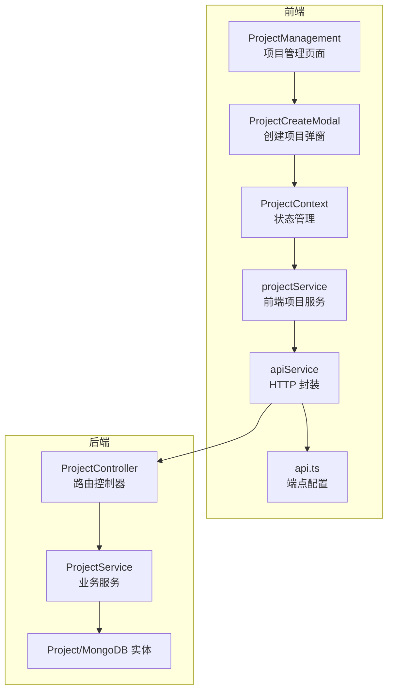
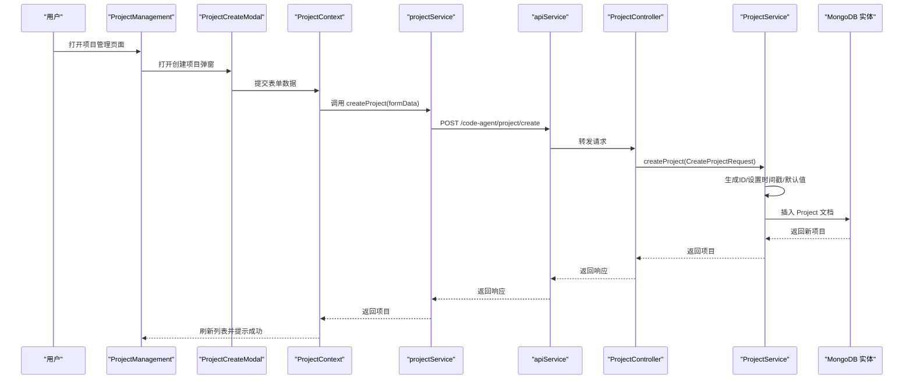
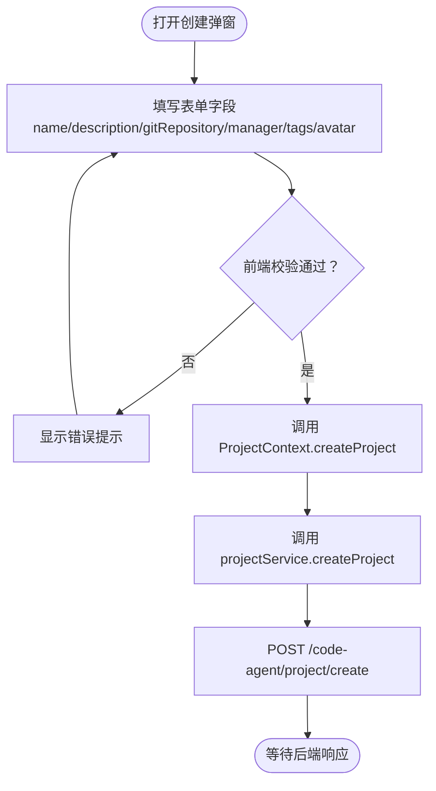
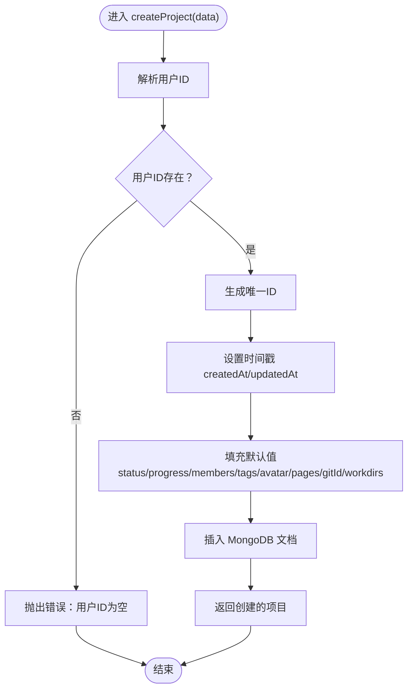
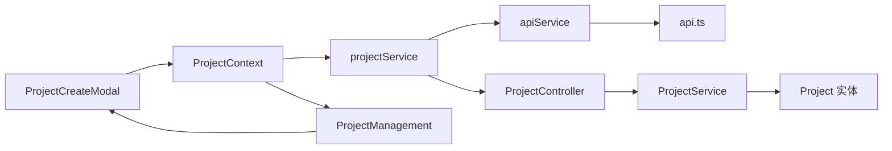

# 项目创建

<cite>
**本文引用的文件**
- [fta-layout-design/src/components/ProjectCreateModal.tsx](file://fta-layout-design/src/components/ProjectCreateModal.tsx)
- [fta-layout-design/src/pages/HomePage/ProjectManagement.tsx](file://fta-layout-design/src/pages/HomePage/ProjectManagement.tsx)
- [fta-layout-design/src/services/projectService.ts](file://fta-layout-design/src/services/projectService.ts)
- [fta-layout-design/src/contexts/ProjectContext.tsx](file://fta-layout-design/src/contexts/ProjectContext.tsx)
- [fta-layout-design/src/utils/apiService.ts](file://fta-layout-design/src/utils/apiService.ts)
- [fta-layout-design/src/config/api.ts](file://fta-layout-design/src/config/api.ts)
- [fta-layout-design/src/types/project.ts](file://fta-layout-design/src/types/project.ts)
- [code-agent-backend/src/controller/code-agent/project.ts](file://code-agent-backend/src/controller/code-agent/project.ts)
- [code-agent-backend/src/service/code-agent/project.ts](file://code-agent-backend/src/service/code-agent/project.ts)
- [code-agent-backend/src/dto/code-agent/req.ts](file://code-agent-backend/src/dto/code-agent/req.ts)
- [code-agent-backend/src/dto/code-agent/res.ts](file://code-agent-backend/src/dto/code-agent/res.ts)
- [code-agent-backend/src/entity/code-agent/project.ts](file://code-agent-backend/src/entity/code-agent/project.ts)
</cite>

## 目录
1. [简介](#简介)
2. [项目结构](#项目结构)
3. [核心组件](#核心组件)
4. [架构总览](#架构总览)
5. [详细组件分析](#详细组件分析)
6. [依赖关系分析](#依赖关系分析)
7. [性能考量](#性能考量)
8. [故障排查指南](#故障排查指南)
9. [结论](#结论)
10. [附录](#附录)

## 简介
本章节围绕“项目创建”功能，系统性梳理从前端表单到后端持久化的完整链路，重点说明：
- CreateProjectRequest 请求参数结构（必填与可选项）
- 前端 ProjectManagement 与 ProjectCreateModal 的表单实现与交互
- 后端 ProjectController 与 ProjectService 的处理流程（ID 生成、时间戳、MongoDB 持久化）
- 数据验证、用户 ID 绑定、错误处理机制
- 默认状态与工作目录初始化策略
- 从表单填写到项目创建成功的完整操作示例

## 项目结构
项目采用前后端分离架构：
- 前端位于 fta-layout-design，负责用户界面与交互
- 后端位于 code-agent-backend，负责业务逻辑与数据库访问
- 通过统一的 API 配置与封装，前后端通过 HTTP 协议通信

图表来源
- [fta-layout-design/src/pages/HomePage/ProjectManagement.tsx](file://fta-layout-design/src/pages/HomePage/ProjectManagement.tsx#L1-L294)
- [fta-layout-design/src/components/ProjectCreateModal.tsx](file://fta-layout-design/src/components/ProjectCreateModal.tsx#L1-L161)
- [fta-layout-design/src/services/projectService.ts](file://fta-layout-design/src/services/projectService.ts#L72-L84)
- [fta-layout-design/src/contexts/ProjectContext.tsx](file://fta-layout-design/src/contexts/ProjectContext.tsx#L85-L98)
- [fta-layout-design/src/utils/apiService.ts](file://fta-layout-design/src/utils/apiService.ts#L461-L565)
- [fta-layout-design/src/config/api.ts](file://fta-layout-design/src/config/api.ts#L33-L57)
- [code-agent-backend/src/controller/code-agent/project.ts](file://code-agent-backend/src/controller/code-agent/project.ts#L88-L100)
- [code-agent-backend/src/service/code-agent/project.ts](file://code-agent-backend/src/service/code-agent/project.ts#L272-L299)
- [code-agent-backend/src/entity/code-agent/project.ts](file://code-agent-backend/src/entity/code-agent/project.ts#L115-L167)

章节来源
- [fta-layout-design/src/pages/HomePage/ProjectManagement.tsx](file://fta-layout-design/src/pages/HomePage/ProjectManagement.tsx#L1-L294)
- [code-agent-backend/src/controller/code-agent/project.ts](file://code-agent-backend/src/controller/code-agent/project.ts#L88-L100)

## 核心组件
- CreateProjectRequest 请求参数
  - 必填：name、manager
  - 可选：description、gitRepository、status、progress、members、tags、avatar、workdirs
- 前端表单组件
  - ProjectCreateModal：Ant Design 表单、校验规则、标签与头像选择
  - ProjectManagement：触发创建弹窗、展示项目卡片
- 前端服务层
  - projectService：封装 createProject 请求
  - ProjectContext：状态管理与错误提示
  - apiService：统一 HTTP 请求与错误处理
  - api.ts：端点常量
- 后端控制器与服务
  - ProjectController：接收请求并返回响应
  - ProjectService：生成 ID、设置时间戳、写入 MongoDB、默认状态与工作目录处理
  - Project 实体：MongoDB Schema 映射

章节来源
- [code-agent-backend/src/dto/code-agent/req.ts](file://code-agent-backend/src/dto/code-agent/req.ts#L12-L63)
- [fta-layout-design/src/components/ProjectCreateModal.tsx](file://fta-layout-design/src/components/ProjectCreateModal.tsx#L85-L116)
- [fta-layout-design/src/services/projectService.ts](file://fta-layout-design/src/services/projectService.ts#L72-L84)
- [fta-layout-design/src/contexts/ProjectContext.tsx](file://fta-layout-design/src/contexts/ProjectContext.tsx#L85-L98)
- [fta-layout-design/src/utils/apiService.ts](file://fta-layout-design/src/utils/apiService.ts#L461-L565)
- [code-agent-backend/src/controller/code-agent/project.ts](file://code-agent-backend/src/controller/code-agent/project.ts#L88-L100)
- [code-agent-backend/src/service/code-agent/project.ts](file://code-agent-backend/src/service/code-agent/project.ts#L272-L299)
- [code-agent-backend/src/entity/code-agent/project.ts](file://code-agent-backend/src/entity/code-agent/project.ts#L115-L167)

## 架构总览
从前端到后端的调用序列如下：

图表来源
- [fta-layout-design/src/pages/HomePage/ProjectManagement.tsx](file://fta-layout-design/src/pages/HomePage/ProjectManagement.tsx#L272-L289)
- [fta-layout-design/src/components/ProjectCreateModal.tsx](file://fta-layout-design/src/components/ProjectCreateModal.tsx#L25-L41)
- [fta-layout-design/src/contexts/ProjectContext.tsx](file://fta-layout-design/src/contexts/ProjectContext.tsx#L85-L98)
- [fta-layout-design/src/services/projectService.ts](file://fta-layout-design/src/services/projectService.ts#L72-L84)
- [fta-layout-design/src/utils/apiService.ts](file://fta-layout-design/src/utils/apiService.ts#L461-L565)
- [code-agent-backend/src/controller/code-agent/project.ts](file://code-agent-backend/src/controller/code-agent/project.ts#L88-L100)
- [code-agent-backend/src/service/code-agent/project.ts](file://code-agent-backend/src/service/code-agent/project.ts#L272-L299)
- [code-agent-backend/src/entity/code-agent/project.ts](file://code-agent-backend/src/entity/code-agent/project.ts#L115-L167)

## 详细组件分析

### CreateProjectRequest 请求参数结构
- 字段说明
  - name：必填，项目名称
  - description：可选，项目描述
  - gitRepository：可选，Git 仓库地址
  - manager：必填，项目经理
  - status：可选，默认 active
  - progress：可选，默认 0
  - members：可选，默认 1
  - tags：可选，字符串数组
  - avatar：可选，默认📁
  - workdirs：可选，字符串数组，用于工作目录映射
- 参数来源
  - DTO 定义：见后端 DTO
  - 前端表单：ProjectCreateModal 中 name、description、gitRepository、manager、tags、avatar 等字段
  - 前端类型：CreateProjectForm 与 Project 类型

章节来源
- [code-agent-backend/src/dto/code-agent/req.ts](file://code-agent-backend/src/dto/code-agent/req.ts#L12-L63)
- [fta-layout-design/src/components/ProjectCreateModal.tsx](file://fta-layout-design/src/components/ProjectCreateModal.tsx#L85-L116)
- [fta-layout-design/src/types/project.ts](file://fta-layout-design/src/types/project.ts#L107-L117)

### 前端 ProjectManagement 组件与 ProjectCreateModal 表单实现
- ProjectManagement
  - 触发创建弹窗：点击“创建新项目”按钮
  - 展示项目卡片：名称、负责人、进度、标签、状态等
  - 刷新列表：创建成功后重新加载项目列表
- ProjectCreateModal
  - Ant Design 表单：必填与长度限制、正则校验（Git 地址）、标签输入与移除、头像选择
  - 提交流程：收集表单数据，附加 avatar 与 tags，调用 ProjectContext.createProject
  - 成功/失败提示：消息提示与表单重置

图表来源
- [fta-layout-design/src/pages/HomePage/ProjectManagement.tsx](file://fta-layout-design/src/pages/HomePage/ProjectManagement.tsx#L272-L289)
- [fta-layout-design/src/components/ProjectCreateModal.tsx](file://fta-layout-design/src/components/ProjectCreateModal.tsx#L25-L41)
- [fta-layout-design/src/services/projectService.ts](file://fta-layout-design/src/services/projectService.ts#L72-L84)
- [fta-layout-design/src/utils/apiService.ts](file://fta-layout-design/src/utils/apiService.ts#L461-L565)
- [fta-layout-design/src/config/api.ts](file://fta-layout-design/src/config/api.ts#L33-L57)

章节来源
- [fta-layout-design/src/pages/HomePage/ProjectManagement.tsx](file://fta-layout-design/src/pages/HomePage/ProjectManagement.tsx#L1-L294)
- [fta-layout-design/src/components/ProjectCreateModal.tsx](file://fta-layout-design/src/components/ProjectCreateModal.tsx#L1-L161)
- [fta-layout-design/src/contexts/ProjectContext.tsx](file://fta-layout-design/src/contexts/ProjectContext.tsx#L85-L98)
- [fta-layout-design/src/services/projectService.ts](file://fta-layout-design/src/services/projectService.ts#L72-L84)
- [fta-layout-design/src/utils/apiService.ts](file://fta-layout-design/src/utils/apiService.ts#L461-L565)
- [fta-layout-design/src/config/api.ts](file://fta-layout-design/src/config/api.ts#L33-L57)

### 后端 ProjectController 与 ProjectService 处理流程
- ProjectController
  - 路由：POST /code-agent/project/create
  - 参数：CreateProjectRequest
  - 返回：CreateProjectResponse（包含 SimpleProject）
- ProjectService
  - 用户 ID 绑定：从上下文解析 user-id 或 state.user.id
  - ID 生成：generateId 前缀 + 随机串 + 时间戳
  - 时间戳：createdAt/updatedAt 设置为当前时间
  - 默认值：status 默认 active，progress 默认 0，members 默认 1，tags 默认空数组，avatar 默认📁，pages 默认空数组，userId 绑定，gitId 默认 empty，workdirs 清洗去重
  - MongoDB 持久化：使用 Typegoose ORM 插入 Project 文档

图表来源
- [code-agent-backend/src/controller/code-agent/project.ts](file://code-agent-backend/src/controller/code-agent/project.ts#L88-L100)
- [code-agent-backend/src/service/code-agent/project.ts](file://code-agent-backend/src/service/code-agent/project.ts#L272-L299)
- [code-agent-backend/src/entity/code-agent/project.ts](file://code-agent-backend/src/entity/code-agent/project.ts#L115-L167)

章节来源
- [code-agent-backend/src/controller/code-agent/project.ts](file://code-agent-backend/src/controller/code-agent/project.ts#L88-L100)
- [code-agent-backend/src/service/code-agent/project.ts](file://code-agent-backend/src/service/code-agent/project.ts#L45-L55)
- [code-agent-backend/src/service/code-agent/project.ts](file://code-agent-backend/src/service/code-agent/project.ts#L66-L85)
- [code-agent-backend/src/service/code-agent/project.ts](file://code-agent-backend/src/service/code-agent/project.ts#L87-L92)
- [code-agent-backend/src/service/code-agent/project.ts](file://code-agent-backend/src/service/code-agent/project.ts#L272-L299)
- [code-agent-backend/src/entity/code-agent/project.ts](file://code-agent-backend/src/entity/code-agent/project.ts#L115-L167)

### 数据验证、用户 ID 绑定与错误处理
- 前端
  - 表单校验：必填、长度、正则（Git 地址）
  - 错误提示：消息提示与异常抛出
- 后端
  - 用户 ID 绑定：优先 ctx.get('user-id')，否则取 ctx.state.user.id
  - 错误处理：用户 ID 为空、项目不存在、页面不存在等场景抛出错误
  - 控制器层：捕获异常并设置 HTTP 状态码（400/404）

章节来源
- [fta-layout-design/src/components/ProjectCreateModal.tsx](file://fta-layout-design/src/components/ProjectCreateModal.tsx#L85-L116)
- [code-agent-backend/src/service/code-agent/project.ts](file://code-agent-backend/src/service/code-agent/project.ts#L45-L55)
- [code-agent-backend/src/controller/code-agent/project.ts](file://code-agent-backend/src/controller/code-agent/project.ts#L91-L100)
- [code-agent-backend/src/controller/code-agent/project.ts](file://code-agent-backend/src/controller/code-agent/project.ts#L130-L142)

### 默认状态与工作目录初始化
- 默认状态：status 默认 active
- 进度与成员：progress 默认 0，members 默认 1
- 头像与标签：avatar 默认📁，tags 默认空数组
- 工作目录：workdirs 通过 sanitizeWorkdirs 去重与清洗，若为空则为 []
- gitId：默认 empty

章节来源
- [code-agent-backend/src/service/code-agent/project.ts](file://code-agent-backend/src/service/code-agent/project.ts#L272-L299)
- [code-agent-backend/src/entity/code-agent/project.ts](file://code-agent-backend/src/entity/code-agent/project.ts#L115-L167)

### API 请求与响应示例
- 请求端点
  - POST /code-agent/project/create
- 请求体（JSON）
  - 字段：name、description、gitRepository、manager、status、progress、members、tags、avatar、workdirs
- 响应体（JSON）
  - 字段：code、message、data（包含 SimpleProject），其中 SimpleProject 结构与后端 DTO 对应

章节来源
- [fta-layout-design/src/config/api.ts](file://fta-layout-design/src/config/api.ts#L33-L57)
- [fta-layout-design/src/utils/apiService.ts](file://fta-layout-design/src/utils/apiService.ts#L461-L565)
- [code-agent-backend/src/dto/code-agent/res.ts](file://code-agent-backend/src/dto/code-agent/res.ts#L62-L110)

## 依赖关系分析
- 前端依赖
  - ProjectManagement 依赖 ProjectContext 与 ProjectCreateModal
  - ProjectContext 依赖 projectService
  - projectService 依赖 apiService 与 api.ts 端点
- 后端依赖
  - ProjectController 依赖 ProjectService
  - ProjectService 依赖 Typegoose ORM 与 MongoDB
  - DTO 与实体定义清晰，便于前后端契约一致

图表来源
- [fta-layout-design/src/components/ProjectCreateModal.tsx](file://fta-layout-design/src/components/ProjectCreateModal.tsx#L1-L161)
- [fta-layout-design/src/contexts/ProjectContext.tsx](file://fta-layout-design/src/contexts/ProjectContext.tsx#L85-L98)
- [fta-layout-design/src/services/projectService.ts](file://fta-layout-design/src/services/projectService.ts#L72-L84)
- [fta-layout-design/src/utils/apiService.ts](file://fta-layout-design/src/utils/apiService.ts#L461-L565)
- [fta-layout-design/src/config/api.ts](file://fta-layout-design/src/config/api.ts#L33-L57)
- [code-agent-backend/src/controller/code-agent/project.ts](file://code-agent-backend/src/controller/code-agent/project.ts#L88-L100)
- [code-agent-backend/src/service/code-agent/project.ts](file://code-agent-backend/src/service/code-agent/project.ts#L272-L299)
- [code-agent-backend/src/entity/code-agent/project.ts](file://code-agent-backend/src/entity/code-agent/project.ts#L115-L167)

章节来源
- [fta-layout-design/src/pages/HomePage/ProjectManagement.tsx](file://fta-layout-design/src/pages/HomePage/ProjectManagement.tsx#L1-L294)
- [code-agent-backend/src/controller/code-agent/project.ts](file://code-agent-backend/src/controller/code-agent/project.ts#L88-L100)

## 性能考量
- 前端
  - 表单提交前进行本地校验，减少无效请求
  - 使用状态管理避免重复渲染
- 后端
  - 仅在必要字段上设置默认值，避免冗余写入
  - 使用 Typegoose ORM 的批量写入与索引优化（如 id 唯一索引）
- 网络
  - 统一的超时与错误处理，避免阻塞 UI

[本节为通用指导，无需特定文件引用]

## 故障排查指南
- 常见错误
  - 用户 ID 为空：检查登录态与中间件注入
  - 项目不存在：检查 id 与 userId 组合查询
  - 请求参数非法：检查 DTO 字段与前端校验规则
- 前端
  - 查看消息提示与控制台错误
  - 确认端点与基础 URL 配置正确
- 后端
  - 控制器层捕获异常并返回 400/404
  - 日志记录与上下文信息有助于定位问题

章节来源
- [code-agent-backend/src/service/code-agent/project.ts](file://code-agent-backend/src/service/code-agent/project.ts#L45-L55)
- [code-agent-backend/src/controller/code-agent/project.ts](file://code-agent-backend/src/controller/code-agent/project.ts#L91-L100)
- [code-agent-backend/src/controller/code-agent/project.ts](file://code-agent-backend/src/controller/code-agent/project.ts#L130-L142)
- [fta-layout-design/src/utils/apiService.ts](file://fta-layout-design/src/utils/apiService.ts#L1-L150)

## 结论
项目创建功能从前端表单到后端持久化形成闭环，具备完善的参数结构、校验与默认值策略。通过统一的 API 封装与状态管理，实现了良好的用户体验与可维护性。建议在后续迭代中：
- 增强前端校验与国际化提示
- 在后端增加更细粒度的字段校验与日志
- 优化工作目录映射与 Git 上下文绑定的默认行为

[本节为总结性内容，无需特定文件引用]

## 附录

### 从表单填写到项目创建成功的完整操作示例
- 步骤
  1) 打开项目管理页面，点击“创建新项目”
  2) 在弹窗中填写项目名称、描述、Git 仓库地址、负责人等
  3) 选择头像与标签，点击“创建项目”
  4) 前端调用 projectService.createProject，发送 POST /code-agent/project/create
  5) 后端解析用户 ID、生成 ID 与时间戳、设置默认值并写入数据库
  6) 返回创建成功的项目信息，前端刷新列表并提示成功

章节来源
- [fta-layout-design/src/pages/HomePage/ProjectManagement.tsx](file://fta-layout-design/src/pages/HomePage/ProjectManagement.tsx#L272-L289)
- [fta-layout-design/src/components/ProjectCreateModal.tsx](file://fta-layout-design/src/components/ProjectCreateModal.tsx#L25-L41)
- [code-agent-backend/src/controller/code-agent/project.ts](file://code-agent-backend/src/controller/code-agent/project.ts#L88-L100)
- [code-agent-backend/src/service/code-agent/project.ts](file://code-agent-backend/src/service/code-agent/project.ts#L272-L299)