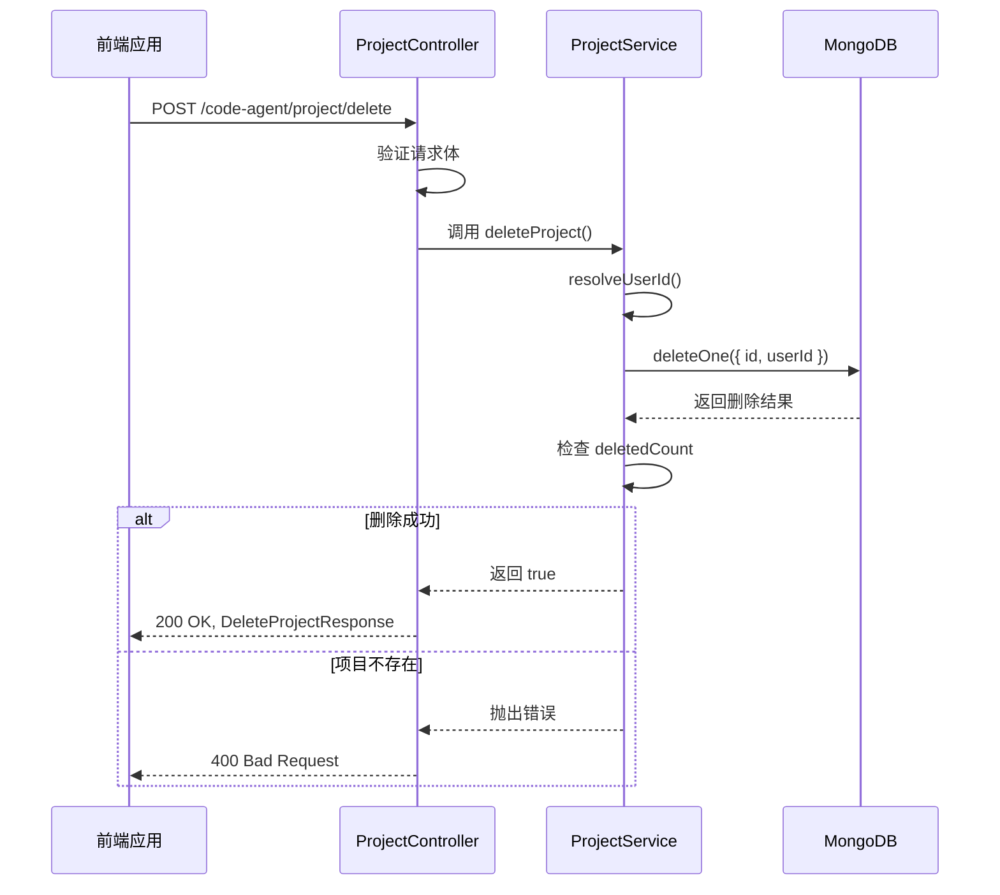

# 项目删除

<cite>
**本文档引用的文件**   
- [project.ts](file://code-agent-backend/src/service/code-agent/project.ts#L331-L343)
- [req.ts](file://code-agent-backend/src/dto/code-agent/req.ts#L127-L134)
- [res.ts](file://code-agent-backend/src/dto/code-agent/res.ts#L106-L110)
- [projectService.ts](file://fta-layout-design/src/services/projectService.ts#L103-L112)
- [ProjectContext.tsx](file://fta-layout-design/src/contexts/ProjectContext.tsx#L115-L131)
- [ProjectManagement.tsx](file://fta-layout-design/src/pages/HomePage/ProjectManagement.tsx#L84-L101)
- [ProjectDetailModal.tsx](file://fta-layout-design/src/components/ProjectDetailModal.tsx#L64-L81)
</cite>

## 目录
1. [请求参数与删除策略](#请求参数与删除策略)
2. [后端删除操作实现](#后端删除操作实现)
3. [前端删除交互流程](#前端删除交互流程)
4. [级联删除机制与数据完整性](#级联删除机制与数据完整性)
5. [回收站与审计日志](#回收站与审计日志)

## 请求参数与删除策略

项目删除功能通过 `DeleteProjectRequest` 请求对象接收删除指令。该请求对象定义在 `code-agent-backend/src/dto/code-agent/req.ts` 文件中，其核心参数为 `id`，表示待删除项目的唯一标识符。该参数是必需的，且在 API 文档中被明确标注为必填项。

```typescript
export class DeleteProjectRequest {
  @ApiProperty({
    description: '项目ID',
    example: 'project_123',
    required: true,
  })
  id: string;
}
```

目前的实现采用**硬删除（Hard Delete）**策略。当用户发起删除请求时，系统会直接从数据库中永久移除该项目及其所有关联数据。这种策略确保了数据的彻底清除，避免了软删除（Soft Delete）可能带来的数据冗余和状态管理复杂性。系统没有实现将项目标记为“已删除”状态的软删除机制，而是直接执行物理删除操作。

**Section sources**
- [req.ts](file://code-agent-backend/src/dto/code-agent/req.ts#L127-L134)

## 后端删除操作实现

后端删除操作的核心逻辑位于 `ProjectService` 类的 `deleteProject` 方法中，该方法定义在 `code-agent-backend/src/service/code-agent/project.ts` 文件中。



**Diagram sources **
- [project.ts](file://code-agent-backend/src/service/code-agent/project.ts#L331-L343)
- [project.ts](file://code-agent-backend/src/controller/code-agent/project.ts#L119-L127)

**Section sources**
- [project.ts](file://code-agent-backend/src/service/code-agent/project.ts#L331-L343)

该方法的实现包含两个关键的安全与完整性验证步骤：

1.  **用户ID双重验证**：在执行删除操作前，系统会通过 `resolveUserId()` 方法从请求上下文（`ctx`）中获取当前登录用户的ID。然后，在数据库查询条件中同时指定 `id`（项目ID）和 `userId`。这意味着一个用户只能删除自己创建或拥有的项目，从而防止了越权删除其他用户的项目。这是确保数据安全的核心机制。

2.  **deletedCount结果检查**：`deleteOne` 操作执行后，会返回一个包含 `deletedCount` 字段的结果对象。该方法会检查 `deletedCount` 是否为0。如果为0，说明没有找到匹配的项目（可能是因为项目ID不存在，或者该项目不属于当前用户），此时会抛出一个“项目不存在”的错误。这一步骤确保了操作的原子性和结果的明确性，避免了对不存在的资源进行操作。

## 前端删除交互流程

前端的删除功能为不同层次的开发者提供了清晰的交互流程。对于初学者，系统通过直观的UI组件引导用户完成安全的删除操作。

删除操作主要在两个前端组件中触发：项目管理列表页和项目详情模态框。

1.  **触发删除**：用户在 `ProjectManagement.tsx` 或 `ProjectDetailModal.tsx` 组件中点击“删除”按钮。
2.  **确认对话框**：点击后，系统会弹出一个由 `Modal.confirm` 创建的确认对话框。该对话框明确提示用户“确定要删除这个项目吗？此操作不可恢复。”，并提供“确认删除”和“取消”两个选项。这种设计强制用户进行二次确认，有效防止了误操作。
3.  **执行删除**：用户点击“确认删除”后，前端会调用 `useProject` Hook 中的 `deleteProject` 函数。
4.  **状态更新与反馈**：`deleteProject` 函数会通过 `projectService` 发起API调用。成功后，它会更新 `projectStore` 状态，将该项目从本地状态列表中移除，并通过 `message.success` 显示“项目删除成功”的提示。如果失败，则捕获错误并显示“项目删除失败，请重试”的错误信息。

```mermaid
flowchart TD
A[用户点击删除按钮] --> B{弹出确认对话框}
B --> C[用户点击"取消"]
C --> D[操作取消，无变化]
B --> E[用户点击"确认删除"]
E --> F[调用 deleteProject API]
F --> G{API调用成功?}
G --> |是| H[从状态中移除项目]
H --> I[显示成功消息]
G --> |否| J[捕获错误]
J --> K[显示错误消息]
```

**Diagram sources **
- [ProjectManagement.tsx](file://fta-layout-design/src/pages/HomePage/ProjectManagement.tsx#L84-L101)
- [ProjectDetailModal.tsx](file://fta-layout-design/src/components/ProjectDetailModal.tsx#L64-L81)
- [ProjectContext.tsx](file://fta-layout-design/src/contexts/ProjectContext.tsx#L115-L131)

**Section sources**
- [ProjectManagement.tsx](file://fta-layout-design/src/pages/HomePage/ProjectManagement.tsx#L84-L101)
- [ProjectDetailModal.tsx](file://fta-layout-design/src/components/ProjectDetailModal.tsx#L64-L81)

## 级联删除机制与数据完整性

根据代码分析，当前的项目删除机制是**直接的硬删除**，但其数据完整性保证是通过数据库的**引用关系**和**事务性操作**来实现的，而非显式的级联删除逻辑。

1.  **数据模型关系**：在 `Project` 实体中，`pages` 字段是一个对 `Page` 实体的引用数组（`@prop({ ref: () => Page, default: () => [] })`）。这意味着一个项目可以包含多个页面，页面是项目的子资源。

2.  **删除流程**：当 `ProjectService.deleteProject` 被调用时，它只执行了一次 `deleteOne` 操作来删除 `Project` 文档。然而，`Page` 文档的删除是通过 `deletePage` 方法独立完成的。在 `ProjectService.deletePage` 方法中，除了删除 `Page` 文档本身，还会通过 `$pull` 操作从 `Project` 文档的 `pages` 数组中移除该页面的引用。

3.  **完整性保证**：虽然项目删除时没有自动删除其所有页面，但系统的业务逻辑确保了数据的一致性。因为 `Page` 文档的 `projectId` 字段是必需的，当一个项目被删除后，任何试图访问或操作其子页面的请求都会因为找不到父项目而失败。此外，前端状态管理（`projectStore`）在删除项目时会将其从列表中移除，使得其子页面在UI上也不再可见。

4.  **错误处理**：对于“项目不存在”的错误场景，后端在 `deleteProject` 方法中通过检查 `deletedCount` 来处理。如果为0，则抛出“项目不存在”的错误，前端捕获此错误并给出相应提示。这是一种清晰的错误处理机制，帮助用户理解操作失败的原因。

## 回收站功能的扩展可能性和审计日志记录

### 回收站功能扩展

当前系统采用硬删除，但可以通过以下方式扩展回收站功能：

1.  **引入软删除字段**：在 `Project` 和 `Page` 实体中添加一个 `isDeleted` 布尔字段和一个 `deletedAt` 时间戳字段。
2.  **修改删除逻辑**：将 `deleteProject` 方法改为更新操作，将 `isDeleted` 设为 `true` 并记录 `deletedAt` 时间，而不是物理删除。
3.  **修改查询逻辑**：在 `getProjects` 等查询方法中，默认过滤掉 `isDeleted: true` 的项目。
4.  **创建回收站视图**：开发一个新的API端点（如 `/project/trash`）来查询所有 `isDeleted: true` 的项目，并在前端创建一个“回收站”页面来展示这些项目。
5.  **实现恢复功能**：添加 `restoreProject` 方法，将 `isDeleted` 重新设为 `false`。

### 审计日志记录

为了增强系统的可追溯性和安全性，可以引入审计日志记录：

1.  **日志实体**：创建一个新的 `AuditLog` 实体，包含字段如 `action`（如 "DELETE_PROJECT"）、`targetId`、`targetType`、`userId`、`timestamp` 和 `details`（JSON格式的额外信息）。
2.  **日志记录**：在 `deleteProject` 方法成功执行后，创建一条新的 `AuditLog` 记录并保存到数据库。
3.  **日志查询**：提供API来查询审计日志，例如按用户、时间范围或操作类型进行筛选。
4.  **前端展示**：在项目详情或系统管理页面中，增加一个“操作日志”标签页来展示与该项目相关的所有审计记录。

这些扩展功能可以显著提升系统的数据安全性和用户体验。