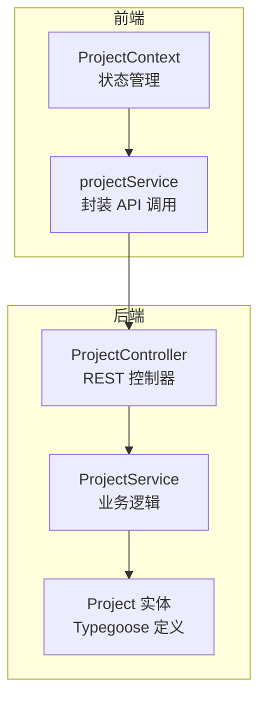
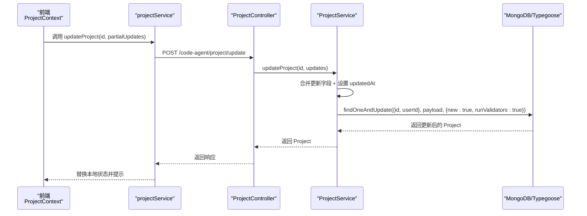
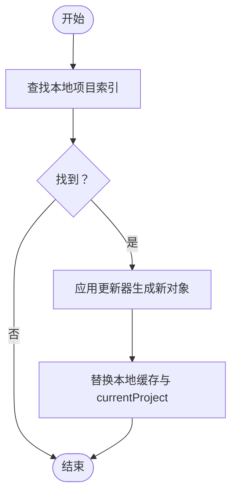
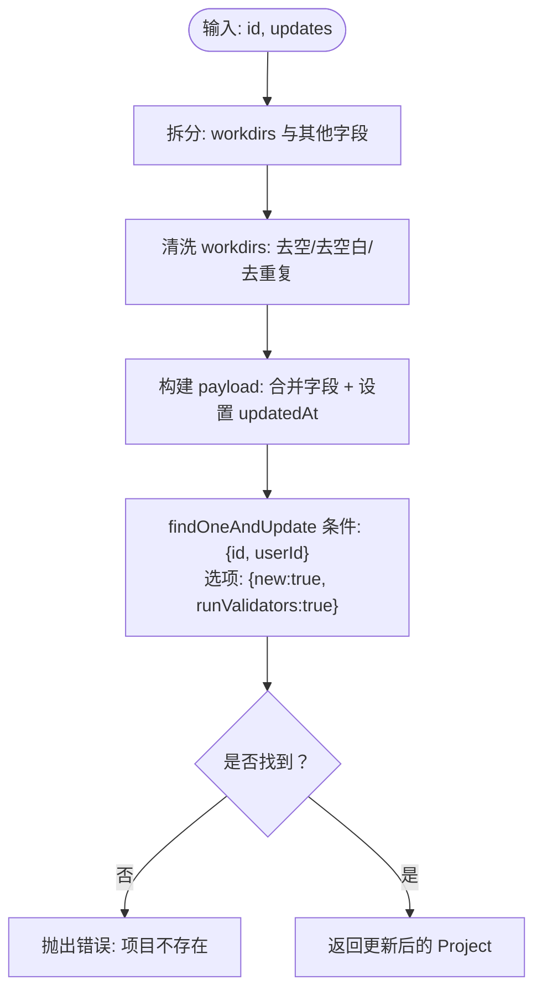
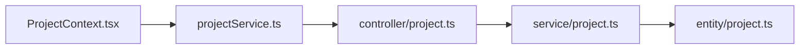

# 项目更新

<cite>
**本文引用的文件**
- [code-agent-backend/src/dto/code-agent/req.ts](file://code-agent-backend/src/dto/code-agent/req.ts)
- [code-agent-backend/src/service/code-agent/project.ts](file://code-agent-backend/src/service/code-agent/project.ts)
- [code-agent-backend/src/controller/code-agent/project.ts](file://code-agent-backend/src/controller/code-agent/project.ts)
- [code-agent-backend/src/entity/code-agent/project.ts](file://code-agent-backend/src/entity/code-agent/project.ts)
- [fta-layout-design/src/contexts/ProjectContext.tsx](file://fta-layout-design/src/contexts/ProjectContext.tsx)
- [fta-layout-design/src/services/projectService.ts](file://fta-layout-design/src/services/projectService.ts)
- [fta-layout-design/src/types/project.ts](file://fta-layout-design/src/types/project.ts)
</cite>

## 目录
1. [简介](#简介)
2. [项目结构](#项目结构)
3. [核心组件](#核心组件)
4. [架构总览](#架构总览)
5. [详细组件分析](#详细组件分析)
6. [依赖关系分析](#依赖关系分析)
7. [性能与并发特性](#性能与并发特性)
8. [故障排查指南](#故障排查指南)
9. [结论](#结论)
10. [附录：常见用法与最佳实践](#附录常见用法与最佳实践)

## 简介
本篇文档围绕“项目更新”能力进行系统性说明，重点覆盖：
- UpdateProjectRequest 请求参数的可选字段与语义（如 name、status、progress、members、tags、avatar、workdirs 等）
- 前端 ProjectContext 中 mutateProjectState 的状态更新机制
- 后端 findOneAndUpdate 原子更新策略与 updatedAt 时间戳自动更新
- PATCH 式更新请求与 workdirs 数组字段的特殊处理
- 并发更新冲突的预防与软更新策略建议

目标读者包括初学者与高级开发者：初学者可按“完整流程”快速上手；高级开发者可参考“并发与软更新”“数据验证”等章节深入理解实现细节。

## 项目结构
项目采用前后端分离架构：
- 前端（fta-layout-design）通过 ProjectContext 管理项目状态，调用 projectService 发起更新请求
- 后端（code-agent-backend）提供 REST 控制器与服务层，负责校验、清洗与持久化更新

图表来源
- [fta-layout-design/src/contexts/ProjectContext.tsx](file://fta-layout-design/src/contexts/ProjectContext.tsx#L1-L120)
- [fta-layout-design/src/services/projectService.ts](file://fta-layout-design/src/services/projectService.ts#L86-L112)
- [code-agent-backend/src/controller/code-agent/project.ts](file://code-agent-backend/src/controller/code-agent/project.ts#L102-L114)
- [code-agent-backend/src/service/code-agent/project.ts](file://code-agent-backend/src/service/code-agent/project.ts#L301-L326)
- [code-agent-backend/src/entity/code-agent/project.ts](file://code-agent-backend/src/entity/code-agent/project.ts#L115-L166)

章节来源
- [fta-layout-design/src/contexts/ProjectContext.tsx](file://fta-layout-design/src/contexts/ProjectContext.tsx#L1-L120)
- [fta-layout-design/src/services/projectService.ts](file://fta-layout-design/src/services/projectService.ts#L86-L112)
- [code-agent-backend/src/controller/code-agent/project.ts](file://code-agent-backend/src/controller/code-agent/project.ts#L102-L114)
- [code-agent-backend/src/service/code-agent/project.ts](file://code-agent-backend/src/service/code-agent/project.ts#L301-L326)
- [code-agent-backend/src/entity/code-agent/project.ts](file://code-agent-backend/src/entity/code-agent/project.ts#L115-L166)

## 核心组件
- UpdateProjectRequest（后端 DTO）：定义可选更新字段，用于接收前端 PATCH 风格的增量更新
- ProjectController.updateProject：接收并转发更新请求
- ProjectService.updateProject：执行 findOneAndUpdate 原子更新，自动更新 updatedAt
- ProjectContext.updateProject：前端发起更新，替换本地状态
- Project 实体：定义数据库字段（含 workdirs 数组）

章节来源
- [code-agent-backend/src/dto/code-agent/req.ts](file://code-agent-backend/src/dto/code-agent/req.ts#L65-L116)
- [code-agent-backend/src/controller/code-agent/project.ts](file://code-agent-backend/src/controller/code-agent/project.ts#L102-L114)
- [code-agent-backend/src/service/code-agent/project.ts](file://code-agent-backend/src/service/code-agent/project.ts#L301-L326)
- [fta-layout-design/src/contexts/ProjectContext.tsx](file://fta-layout-design/src/contexts/ProjectContext.tsx#L100-L113)
- [code-agent-backend/src/entity/code-agent/project.ts](file://code-agent-backend/src/entity/code-agent/project.ts#L115-L166)

## 架构总览
从前端到后端的更新链路如下：

图表来源
- [fta-layout-design/src/contexts/ProjectContext.tsx](file://fta-layout-design/src/contexts/ProjectContext.tsx#L100-L113)
- [fta-layout-design/src/services/projectService.ts](file://fta-layout-design/src/services/projectService.ts#L86-L112)
- [code-agent-backend/src/controller/code-agent/project.ts](file://code-agent-backend/src/controller/code-agent/project.ts#L102-L114)
- [code-agent-backend/src/service/code-agent/project.ts](file://code-agent-backend/src/service/code-agent/project.ts#L301-L326)

## 详细组件分析

### UpdateProjectRequest 请求参数与可选字段
- 字段清单（均为可选）：
  - name：项目名称
  - description：项目描述
  - gitRepository：Git 仓库地址
  - manager：项目经理
  - status：项目状态（枚举 active/paused/completed/archived）
  - progress：项目进度（0~100）
  - members：团队成员数量（最小值 1）
  - tags：项目标签（字符串数组）
  - avatar：项目头像
  - workdirs：工作目录映射（字符串数组，后端会做去重与清洗）
- 语义要点：
  - 所有字段均为“部分更新”，未提供的字段保持不变
  - progress 与 status 存在业务联动（例如 status=completed 时 progress 自动置为 100），但该联动在文档状态更新场景中体现，项目级更新由后端统一设置 updatedAt

章节来源
- [code-agent-backend/src/dto/code-agent/req.ts](file://code-agent-backend/src/dto/code-agent/req.ts#L65-L116)
- [code-agent-backend/src/entity/code-agent/project.ts](file://code-agent-backend/src/entity/code-agent/project.ts#L115-L166)

### 前端 ProjectContext 中 mutateProjectState 状态更新机制
- mutateProjectState：根据 projectId 查找本地项目，应用传入的纯函数式更新器，生成新对象并替换本地缓存；若当前项目匹配，也同步更新 currentProject
- updateProject：发起后端更新，成功后以 replaceProjectInState 将远端返回的最新项目替换到本地
- 典型用法：前端以 Partial<Project> 形式提交更新，后端仅更新提供的字段，避免全量覆盖

图表来源
- [fta-layout-design/src/contexts/ProjectContext.tsx](file://fta-layout-design/src/contexts/ProjectContext.tsx#L73-L83)
- [fta-layout-design/src/contexts/ProjectContext.tsx](file://fta-layout-design/src/contexts/ProjectContext.tsx#L60-L71)
- [fta-layout-design/src/contexts/ProjectContext.tsx](file://fta-layout-design/src/contexts/ProjectContext.tsx#L100-L113)

章节来源
- [fta-layout-design/src/contexts/ProjectContext.tsx](file://fta-layout-design/src/contexts/ProjectContext.tsx#L60-L113)

### 后端 findOneAndUpdate 原子操作与 updatedAt 自动更新
- ProjectService.updateProject：
  - 提取 workdirs 并进行去重与清洗（去空、去空白、去重复）
  - 将其他字段合并到更新载荷，并统一设置 updatedAt
  - 使用 findOneAndUpdate({id, userId}, payload, {new:true, runValidators:true}) 执行原子更新
  - 若未找到记录，抛出“项目不存在”
- 该模式确保：
  - 仅更新提供的字段，避免覆盖未传字段
  - 始终更新 updatedAt，便于前端排序与审计
  - runValidators=true 开启 Schema 校验，保证数据一致性

图表来源
- [code-agent-backend/src/service/code-agent/project.ts](file://code-agent-backend/src/service/code-agent/project.ts#L301-L326)
- [code-agent-backend/src/service/code-agent/project.ts](file://code-agent-backend/src/service/code-agent/project.ts#L66-L85)

章节来源
- [code-agent-backend/src/service/code-agent/project.ts](file://code-agent-backend/src/service/code-agent/project.ts#L301-L326)
- [code-agent-backend/src/service/code-agent/project.ts](file://code-agent-backend/src/service/code-agent/project.ts#L66-L85)

### PATCH 式更新请求与 workdirs 数组字段的特殊处理
- PATCH 风格：前端以 Partial<Project> 提交，后端仅更新提供的字段
- workdirs 特殊处理：
  - 后端对 workdirs 进行去重与清洗（去空、去空白、去重复），避免脏数据进入集合
  - 前端类型层面，workdirs 为 string[]，后端将其转换为去重后的数组再写入
- 该策略既满足“部分更新”的需求，又保证了集合内数据质量

章节来源
- [code-agent-backend/src/dto/code-agent/req.ts](file://code-agent-backend/src/dto/code-agent/req.ts#L65-L116)
- [code-agent-backend/src/service/code-agent/project.ts](file://code-agent-backend/src/service/code-agent/project.ts#L66-L85)
- [code-agent-backend/src/entity/code-agent/project.ts](file://code-agent-backend/src/entity/code-agent/project.ts#L152-L153)
- [fta-layout-design/src/types/project.ts](file://fta-layout-design/src/types/project.ts#L1-L22)

### 数据验证与约束
- 后端通过 Typegoose Schema 约束：
  - progress 默认 0，范围 0~100
  - members 默认 1，最小值 1
  - status 枚举限定
  - workdirs 类型为字符串数组
- 前端类型定义与后端 DTO 对齐，减少类型不一致导致的错误

章节来源
- [code-agent-backend/src/entity/code-agent/project.ts](file://code-agent-backend/src/entity/code-agent/project.ts#L137-L166)
- [code-agent-backend/src/dto/code-agent/req.ts](file://code-agent-backend/src/dto/code-agent/req.ts#L65-L116)
- [fta-layout-design/src/types/project.ts](file://fta-layout-design/src/types/project.ts#L1-L22)

## 依赖关系分析
- 前端依赖：
  - ProjectContext 提供状态管理与更新入口
  - projectService 封装 API 调用，统一错误处理与提示
- 后端依赖：
  - ProjectController 作为入口，将请求转交给 ProjectService
  - ProjectService 依赖 Typegoose 实体与 MongoDB，执行 findOneAndUpdate
  - DTO 与实体共同定义字段与约束

图表来源
- [fta-layout-design/src/contexts/ProjectContext.tsx](file://fta-layout-design/src/contexts/ProjectContext.tsx#L100-L113)
- [fta-layout-design/src/services/projectService.ts](file://fta-layout-design/src/services/projectService.ts#L86-L112)
- [code-agent-backend/src/controller/code-agent/project.ts](file://code-agent-backend/src/controller/code-agent/project.ts#L102-L114)
- [code-agent-backend/src/service/code-agent/project.ts](file://code-agent-backend/src/service/code-agent/project.ts#L301-L326)
- [code-agent-backend/src/entity/code-agent/project.ts](file://code-agent-backend/src/entity/code-agent/project.ts#L115-L166)

章节来源
- [fta-layout-design/src/contexts/ProjectContext.tsx](file://fta-layout-design/src/contexts/ProjectContext.tsx#L100-L113)
- [fta-layout-design/src/services/projectService.ts](file://fta-layout-design/src/services/projectService.ts#L86-L112)
- [code-agent-backend/src/controller/code-agent/project.ts](file://code-agent-backend/src/controller/code-agent/project.ts#L102-L114)
- [code-agent-backend/src/service/code-agent/project.ts](file://code-agent-backend/src/service/code-agent/project.ts#L301-L326)
- [code-agent-backend/src/entity/code-agent/project.ts](file://code-agent-backend/src/entity/code-agent/project.ts#L115-L166)

## 性能与并发特性
- 原子更新与一致性
  - findOneAndUpdate 在数据库层面保证“读改写”的原子性，避免竞态条件
  - runValidators=true 在更新前执行 Schema 校验，降低脏数据风险
- 时间戳与排序
  - updatedAt 统一在服务层设置，便于前端按时间排序与展示
- 前端乐观更新
  - ProjectContext.updateProject 采用乐观更新策略：先替换本地状态，再等待后端返回；若后端失败，可通过错误提示回滚或重试
- 并发冲突预防与软更新建议
  - 建议引入“版本号/ETag”或“最后修改时间”字段，在更新时携带条件（如仅当 updatedAt 未变化时才允许更新），从而避免覆盖式更新引发的冲突
  - 对于 workdirs 等数组字段，建议采用“去重+增量合并”策略（后端已实现），并在前端提交前进行本地去重，减少无效网络往返
  - 对高频更新场景，可在前端增加防抖/节流，减少不必要的更新请求

[本节为通用性能与并发建议，不直接分析具体文件，故无章节来源]

## 故障排查指南
- “项目不存在”错误
  - 触发点：后端 findOneAndUpdate 未匹配到记录
  - 排查：确认 id 与 userId 是否正确；检查前端是否使用了正确的项目标识
- 类型不一致导致的更新失败
  - 触发点：前端传入类型与后端 DTO/Schema 不一致
  - 排查：核对前端 types 与后端 DTO/Entity 的字段定义
- workdirs 重复或为空
  - 触发点：前端传入包含重复或空白项
  - 排查：确认前端在提交前已做去重与清洗；后端也会二次清洗，但仍建议前端先行处理
- 更新未生效
  - 触发点：仅传入未变更字段，或字段被过滤
  - 排查：确认传入字段是否为可更新字段；确认后端 DTO 中对应字段为可选

章节来源
- [code-agent-backend/src/service/code-agent/project.ts](file://code-agent-backend/src/service/code-agent/project.ts#L301-L326)
- [code-agent-backend/src/dto/code-agent/req.ts](file://code-agent-backend/src/dto/code-agent/req.ts#L65-L116)
- [code-agent-backend/src/entity/code-agent/project.ts](file://code-agent-backend/src/entity/code-agent/project.ts#L115-L166)
- [fta-layout-design/src/contexts/ProjectContext.tsx](file://fta-layout-design/src/contexts/ProjectContext.tsx#L100-L113)

## 结论
- 项目更新采用 PATCH 风格的部分更新，结合后端 findOneAndUpdate 原子更新与 updatedAt 自动更新，确保一致性与可观测性
- 前端通过 ProjectContext 实现乐观更新与本地状态替换，提升交互体验
- workdirs 等数组字段在后端实现了去重与清洗，建议前端配合本地去重，进一步优化网络与存储
- 高并发场景建议引入版本控制或条件更新策略，以避免覆盖式更新带来的冲突

[本节为总结性内容，不直接分析具体文件，故无章节来源]

## 附录：常见用法与最佳实践

- 前端更新流程（初学者）
  - 使用 ProjectContext.updateProject(id, partialUpdates) 发起更新
  - 本地乐观替换后，等待后端返回；若失败，显示错误并提示重试
  - 参考路径：
    - [fta-layout-design/src/contexts/ProjectContext.tsx](file://fta-layout-design/src/contexts/ProjectContext.tsx#L100-L113)
    - [fta-layout-design/src/services/projectService.ts](file://fta-layout-design/src/services/projectService.ts#L86-L112)

- 后端更新流程（高级）
  - 控制器接收 {id, ...UpdateProjectRequest}，服务层拆分 workdirs 并清洗，合并其他字段，统一设置 updatedAt
  - 使用 findOneAndUpdate 原子更新，开启 runValidators
  - 参考路径：
    - [code-agent-backend/src/controller/code-agent/project.ts](file://code-agent-backend/src/controller/code-agent/project.ts#L102-L114)
    - [code-agent-backend/src/service/code-agent/project.ts](file://code-agent-backend/src/service/code-agent/project.ts#L301-L326)
    - [code-agent-backend/src/service/code-agent/project.ts](file://code-agent-backend/src/service/code-agent/project.ts#L66-L85)

- PATCH 请求示例（概念示意）
  - 请求方法：POST
  - 路径：/code-agent/project/update
  - 载荷：包含 id 与若干可选字段（如 name、status、progress、workdirs 等）
  - 参考路径：
    - [code-agent-backend/src/controller/code-agent/project.ts](file://code-agent-backend/src/controller/code-agent/project.ts#L102-L114)
    - [code-agent-backend/src/dto/code-agent/req.ts](file://code-agent-backend/src/dto/code-agent/req.ts#L65-L116)

- workdirs 数组字段处理（概念示意）
  - 前端：提交前去重与清洗
  - 后端：再次去重与清洗，写入数据库
  - 参考路径：
    - [code-agent-backend/src/service/code-agent/project.ts](file://code-agent-backend/src/service/code-agent/project.ts#L66-L85)
    - [code-agent-backend/src/entity/code-agent/project.ts](file://code-agent-backend/src/entity/code-agent/project.ts#L152-L153)

- 并发更新冲突预防（建议）
  - 引入版本号/ETag 或基于 updatedAt 的条件更新
  - 前端在提交时携带上次获取到的 updatedAt，后端仅当未变化时允许更新
  - 对高频更新加防抖/节流
  - 参考路径：
    - [code-agent-backend/src/service/code-agent/project.ts](file://code-agent-backend/src/service/code-agent/project.ts#L301-L326)