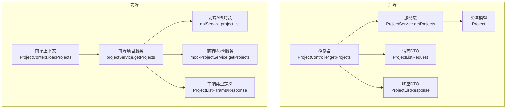
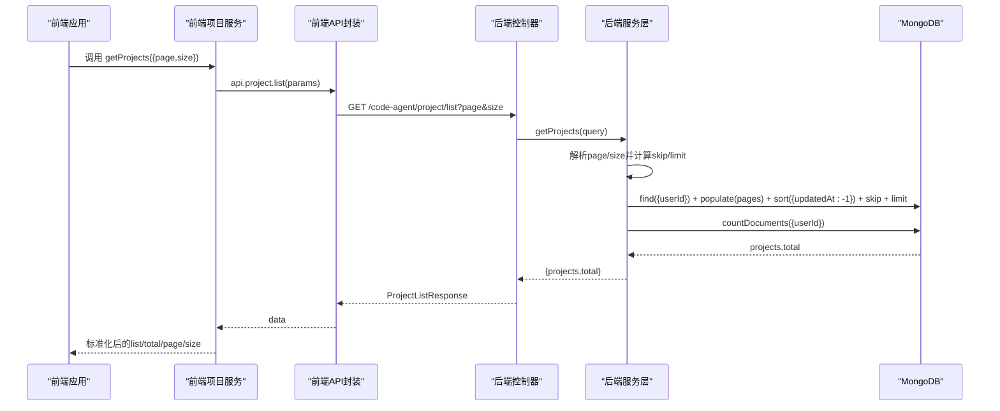
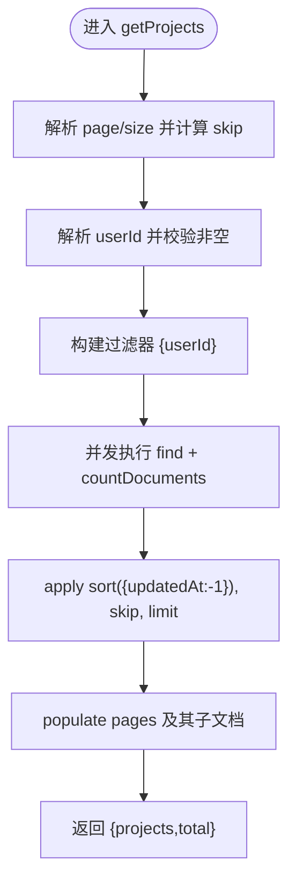
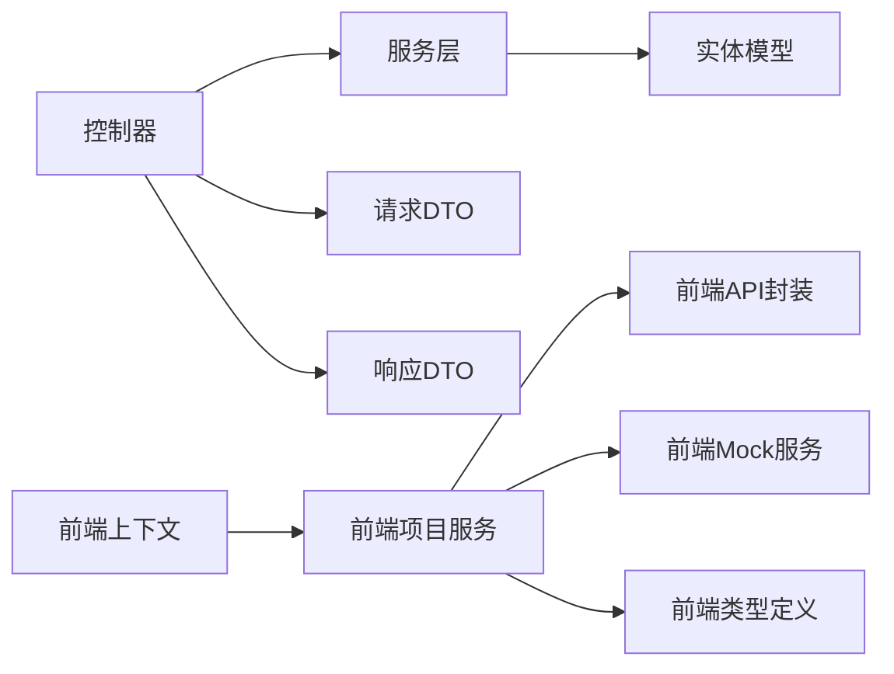

# 项目列表查询

<cite>
**本文引用的文件**
- [项目控制器](file://code-agent-backend/src/controller/code-agent/project.ts)
- [项目服务](file://code-agent-backend/src/service/code-agent/project.ts)
- [项目请求DTO](file://code-agent-backend/src/dto/code-agent/req.ts)
- [项目响应DTO](file://code-agent-backend/src/dto/code-agent/res.ts)
- [项目实体](file://code-agent-backend/src/entity/code-agent/project.ts)
- [前端项目服务](file://fta-layout-design/src/services/projectService.ts)
- [前端项目Mock服务](file://fta-layout-design/src/services/mockProjectService.ts)
- [前端API封装](file://fta-layout-design/src/utils/apiService.ts)
- [前端项目上下文](file://fta-layout-design/src/contexts/ProjectContext.tsx)
- [前端项目类型定义](file://fta-layout-design/src/types/project.ts)
</cite>

## 目录
1. [简介](#简介)
2. [项目结构](#项目结构)
3. [核心组件](#核心组件)
4. [架构总览](#架构总览)
5. [详细组件分析](#详细组件分析)
6. [依赖关系分析](#依赖关系分析)
7. [性能考量](#性能考量)
8. [故障排查指南](#故障排查指南)
9. [结论](#结论)
10. [附录](#附录)

## 简介
本篇文档围绕“项目列表查询”功能展开，重点解析后端 getProjects 方法的实现机制，涵盖分页参数处理（page/size）、skip/limit 计算、total 总数返回策略，以及 MongoDB 查询中的用户ID过滤、updatedAt 降序排序、populate 关联查询的使用场景。同时面向不同层次读者提供：
- 初学者：前端分页控件与数据渲染的集成示例思路
- 高级开发者：查询性能优化（索引设计、Promise.all 并发 countDocuments 与 find 的优化策略）
- 实战参考：请求参数结构、响应数据格式、mock 数据与真实 API 切换机制

## 项目结构
该项目采用前后端分离架构，后端基于 MidwayJS + TypeORM/TypeGoose（MongoDB），前端基于 React + Vite。项目列表查询涉及以下关键文件：
- 后端：控制器负责接收请求、调用服务层；服务层封装业务逻辑与数据库访问；DTO 定义请求/响应结构；实体定义 MongoDB Schema。
- 前端：服务层统一封装 API 调用；Mock 服务提供本地调试能力；上下文管理全局状态与分页信息；类型定义约束前后端契约。

图表来源
- [项目控制器](file://code-agent-backend/src/controller/code-agent/project.ts#L49-L58)
- [项目服务](file://code-agent-backend/src/service/code-agent/project.ts#L244-L266)
- [项目实体](file://code-agent-backend/src/entity/code-agent/project.ts#L106-L165)
- [项目请求DTO](file://code-agent-backend/src/dto/code-agent/req.ts#L3-L10)
- [项目响应DTO](file://code-agent-backend/src/dto/code-agent/res.ts#L81-L86)
- [前端项目服务](file://fta-layout-design/src/services/projectService.ts#L61-L69)
- [前端API封装](file://fta-layout-design/src/utils/apiService.ts#L468-L470)
- [前端项目Mock服务](file://fta-layout-design/src/services/mockProjectService.ts#L193-L206)
- [前端项目上下文](file://fta-layout-design/src/contexts/ProjectContext.tsx#L335-L353)
- [前端项目类型定义](file://fta-layout-design/src/types/project.ts#L23-L36)

章节来源
- [项目控制器](file://code-agent-backend/src/controller/code-agent/project.ts#L49-L58)
- [项目服务](file://code-agent-backend/src/service/code-agent/project.ts#L244-L266)
- [前端项目服务](file://fta-layout-design/src/services/projectService.ts#L61-L69)
- [前端项目上下文](file://fta-layout-design/src/contexts/ProjectContext.tsx#L335-L353)

## 核心组件
- 后端控制器：暴露 /code-agent/project/list 接口，接收分页参数，调用服务层并构造分页响应。
- 服务层 getProjects：解析分页参数、构建用户过滤条件、并发执行 countDocuments 与 find，按 updatedAt 降序返回。
- 实体模型：定义项目 Schema，包含 userId、createdAt、updatedAt 等字段，以及 pages 引用。
- 前端项目服务：统一调用后端或 Mock，标准化响应格式，供上下文消费。
- 前端上下文：维护分页状态（total/page/size），在加载完成后写入 store。

章节来源
- [项目控制器](file://code-agent-backend/src/controller/code-agent/project.ts#L49-L58)
- [项目服务](file://code-agent-backend/src/service/code-agent/project.ts#L244-L266)
- [项目实体](file://code-agent-backend/src/entity/code-agent/project.ts#L106-L165)
- [前端项目服务](file://fta-layout-design/src/services/projectService.ts#L61-L69)
- [前端项目上下文](file://fta-layout-design/src/contexts/ProjectContext.tsx#L335-L353)

## 架构总览
下面以序列图展示“项目列表查询”的端到端流程，从前端发起请求到后端数据库查询再到响应返回。

图表来源
- [前端项目服务](file://fta-layout-design/src/services/projectService.ts#L61-L69)
- [前端API封装](file://fta-layout-design/src/utils/apiService.ts#L468-L470)
- [项目控制器](file://code-agent-backend/src/controller/code-agent/project.ts#L49-L58)
- [项目服务](file://code-agent-backend/src/service/code-agent/project.ts#L244-L266)

## 详细组件分析

### getProjects 方法实现机制
- 分页参数处理
  - page 默认值：若未传或无效，默认为 1
  - size 默认值：若未传或无效，默认为 10
  - skip 计算：skip = (page - 1) × size
  - limit：直接使用 size
- 用户ID过滤
  - 通过上下文解析 userId，作为查询条件 { userId }
- 查询与排序
  - find(filter).populate(populateOptions).skip(skip).limit(size).sort({ updatedAt: -1 })
  - populateOptions：对 pages 字段进行 populate，进一步 populate designDocuments/prdDocuments/openapiDocuments
- 并发统计总数
  - 使用 Promise.all 并发执行 find 和 countDocuments，避免串行导致的延迟
  - 返回 { projects, total }

图表来源
- [项目服务](file://code-agent-backend/src/service/code-agent/project.ts#L244-L266)

章节来源
- [项目服务](file://code-agent-backend/src/service/code-agent/project.ts#L244-L266)

### 响应结构与分页策略
- 控制器返回分页响应对象，包含 list、total、page、size
- 前端项目服务对后端响应进行标准化，确保即使后端返回结构变化也能保持一致的 list/total/page/size 结构
- 前端上下文将 total/page/size 写入 store，供分页控件渲染

章节来源
- [项目控制器](file://code-agent-backend/src/controller/code-agent/project.ts#L49-L58)
- [项目响应DTO](file://code-agent-backend/src/dto/code-agent/res.ts#L81-L86)
- [前端项目服务](file://fta-layout-design/src/services/projectService.ts#L24-L52)
- [前端项目上下文](file://fta-layout-design/src/contexts/ProjectContext.tsx#L335-L353)

### 前端分页控件与数据渲染（初学者指南）
- 发起请求
  - 在组件挂载或分页变更时，调用项目服务的 getProjects({ page, size })
  - 示例路径：[前端项目上下文](file://fta-layout-design/src/contexts/ProjectContext.tsx#L335-L353)
- 渲染数据
  - 将返回的 list 渲染为卡片/表格
  - 使用 total/page/size 更新分页控件（如 Ant Design Pagination）
- 错误处理
  - 捕获异常并提示用户，参考：[前端项目上下文](file://fta-layout-design/src/contexts/ProjectContext.tsx#L346-L350)

章节来源
- [前端项目上下文](file://fta-layout-design/src/contexts/ProjectContext.tsx#L335-L353)
- [前端项目类型定义](file://fta-layout-design/src/types/project.ts#L23-L36)

### 前端 Mock 与真实 API 切换（高级）
- 切换机制
  - 通过 shouldUseMock() 判断是否走 Mock
  - 若启用 Mock，则调用 mockProjectService.getProjects；否则调用 api.project.list
  - 示例路径：[前端项目服务](file://fta-layout-design/src/services/projectService.ts#L61-L69)
- Mock 行为
  - 模拟分页：根据 page/size 计算 startIndex 并截取切片
  - 示例路径：[前端项目Mock服务](file://fta-layout-design/src/services/mockProjectService.ts#L193-L206)
- 真实 API
  - 通过 apiService.project.list 发起 GET 请求，自动拼接查询参数
  - 示例路径：[前端API封装](file://fta-layout-design/src/utils/apiService.ts#L468-L470)

章节来源
- [前端项目服务](file://fta-layout-design/src/services/projectService.ts#L61-L69)
- [前端项目Mock服务](file://fta-layout-design/src/services/mockProjectService.ts#L193-L206)
- [前端API封装](file://fta-layout-design/src/utils/apiService.ts#L468-L470)

### 请求参数与响应数据格式
- 请求参数
  - page?: number（默认 1）
  - size?: number（默认 10）
  - 参考：[项目请求DTO](file://code-agent-backend/src/dto/code-agent/req.ts#L3-L10)
- 响应数据
  - list: Project[]
  - total: number
  - page: number
  - size: number
  - 参考：[项目响应DTO](file://code-agent-backend/src/dto/code-agent/res.ts#L81-L86)，[前端类型定义](file://fta-layout-design/src/types/project.ts#L23-L36)

章节来源
- [项目请求DTO](file://code-agent-backend/src/dto/code-agent/req.ts#L3-L10)
- [项目响应DTO](file://code-agent-backend/src/dto/code-agent/res.ts#L81-L86)
- [前端项目类型定义](file://fta-layout-design/src/types/project.ts#L23-L36)

## 依赖关系分析
- 后端
  - 控制器依赖服务层
  - 服务层依赖实体模型与上下文（解析 userId）
  - DTO 作为请求/响应契约
- 前端
  - 项目服务依赖 API 封装与 Mock 服务
  - 上下文依赖项目服务与类型定义

图表来源
- [项目控制器](file://code-agent-backend/src/controller/code-agent/project.ts#L49-L58)
- [项目服务](file://code-agent-backend/src/service/code-agent/project.ts#L244-L266)
- [项目实体](file://code-agent-backend/src/entity/code-agent/project.ts#L106-L165)
- [前端项目服务](file://fta-layout-design/src/services/projectService.ts#L61-L69)
- [前端API封装](file://fta-layout-design/src/utils/apiService.ts#L468-L470)
- [前端项目Mock服务](file://fta-layout-design/src/services/mockProjectService.ts#L193-L206)
- [前端项目上下文](file://fta-layout-design/src/contexts/ProjectContext.tsx#L335-L353)
- [前端项目类型定义](file://fta-layout-design/src/types/project.ts#L23-L36)

章节来源
- [项目控制器](file://code-agent-backend/src/controller/code-agent/project.ts#L49-L58)
- [项目服务](file://code-agent-backend/src/service/code-agent/project.ts#L244-L266)
- [前端项目服务](file://fta-layout-design/src/services/projectService.ts#L61-L69)

## 性能考量
- 分页与排序
  - 使用 skip/limit 进行分页，sort({ updatedAt: -1 }) 保证最新项目优先展示
  - 对 userId 字段建立索引可显著提升过滤效率
- 并发优化
  - 使用 Promise.all 并发执行 find 与 countDocuments，减少往返时间
  - populate 多层级字段时建议评估网络与内存开销，必要时按需选择 populate 字段
- 索引设计建议
  - 常用查询组合：userId + updatedAt（降序）
  - 可考虑复合索引：{ userId: 1, updatedAt: -1 }
  - 参考实现位置：[项目服务](file://code-agent-backend/src/service/code-agent/project.ts#L244-L266)
- 前端渲染优化
  - 使用虚拟滚动（如虚拟列表）处理大量项目
  - 分页控件仅在 total 变化时重渲染
  - 参考实现位置：[前端项目上下文](file://fta-layout-design/src/contexts/ProjectContext.tsx#L335-L353)

章节来源
- [项目服务](file://code-agent-backend/src/service/code-agent/project.ts#L244-L266)
- [前端项目上下文](file://fta-layout-design/src/contexts/ProjectContext.tsx#L335-L353)

## 故障排查指南
- 常见问题
  - 用户ID为空：服务层会抛错，检查鉴权中间件或上下文注入
    - 参考：[项目服务](file://code-agent-backend/src/service/code-agent/project.ts#L244-L266)
  - 分页参数非法：默认回退到 page=1、size=10
    - 参考：[项目请求DTO](file://code-agent-backend/src/dto/code-agent/req.ts#L3-L10)
  - 前端分页不更新：确认上下文是否正确写入 pagination
    - 参考：[前端项目上下文](file://fta-layout-design/src/contexts/ProjectContext.tsx#L335-L353)
  - Mock 与真实 API 切换异常：检查 shouldUseMock 与 resolveRequest
    - 参考：[前端项目服务](file://fta-layout-design/src/services/projectService.ts#L61-L69)

章节来源
- [项目服务](file://code-agent-backend/src/service/code-agent/project.ts#L244-L266)
- [项目请求DTO](file://code-agent-backend/src/dto/code-agent/req.ts#L3-L10)
- [前端项目上下文](file://fta-layout-design/src/contexts/ProjectContext.tsx#L335-L353)
- [前端项目服务](file://fta-layout-design/src/services/projectService.ts#L61-L69)

## 结论
- getProjects 的实现以“分页参数解析 + 用户过滤 + 并发查询 + populate 关联 + updatedAt 降序”为核心，兼顾易用性与性能。
- 前后端通过 DTO 与类型定义形成清晰契约，配合 Mock 与真实 API 的切换机制，便于开发与测试。
- 建议在生产环境完善索引与缓存策略，并结合前端虚拟滚动与懒加载进一步优化大列表体验。

## 附录
- 请求参数结构
  - page?: number（默认 1）
  - size?: number（默认 10）
  - 参考：[项目请求DTO](file://code-agent-backend/src/dto/code-agent/req.ts#L3-L10)
- 响应数据格式
  - list: Project[]
  - total: number
  - page: number
  - size: number
  - 参考：[项目响应DTO](file://code-agent-backend/src/dto/code-agent/res.ts#L81-L86)，[前端类型定义](file://fta-layout-design/src/types/project.ts#L23-L36)
- 前端集成要点
  - 使用项目服务统一发起请求
  - 使用上下文管理分页状态
  - 参考：[前端项目服务](file://fta-layout-design/src/services/projectService.ts#L61-L69)，[前端项目上下文](file://fta-layout-design/src/contexts/ProjectContext.tsx#L335-L353)