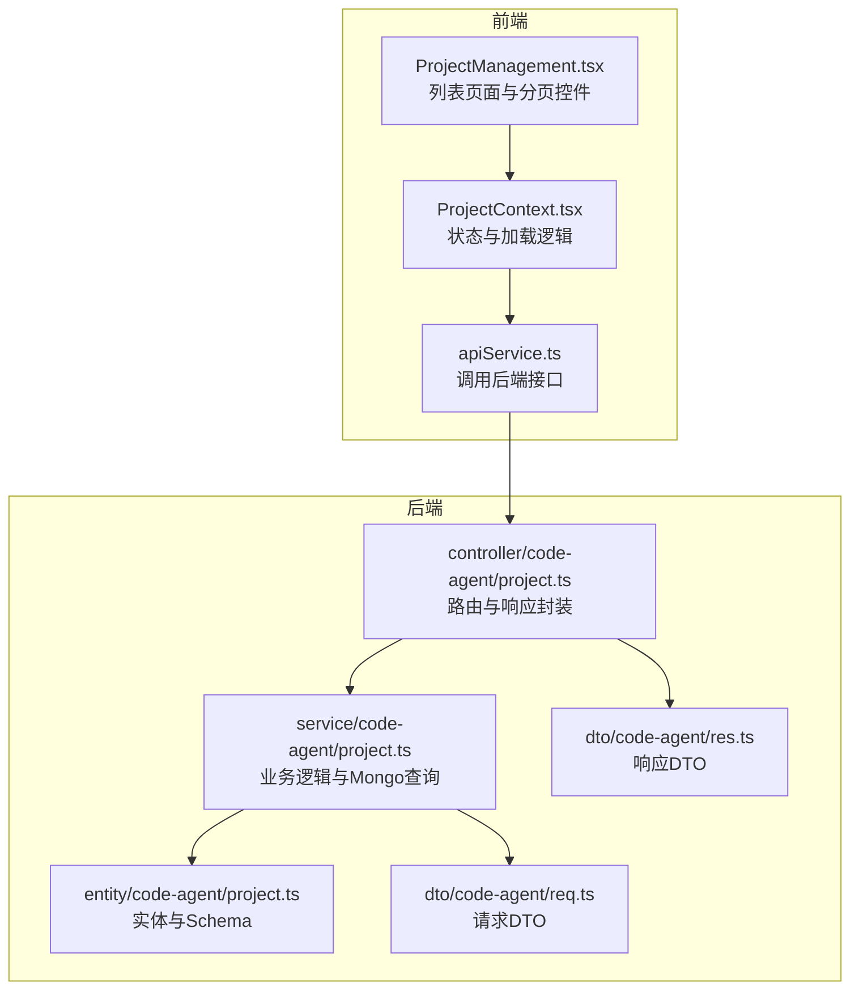
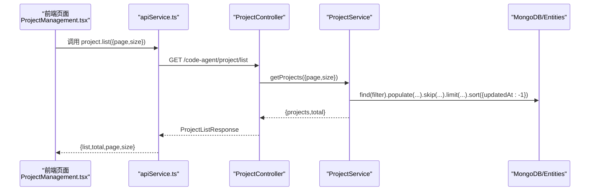
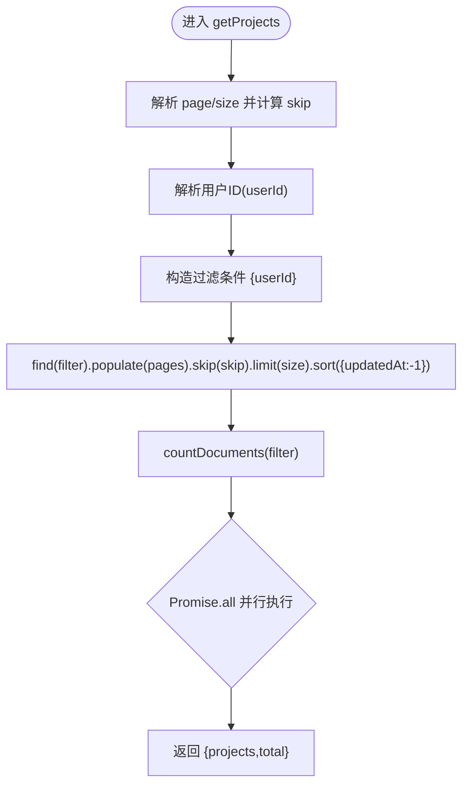
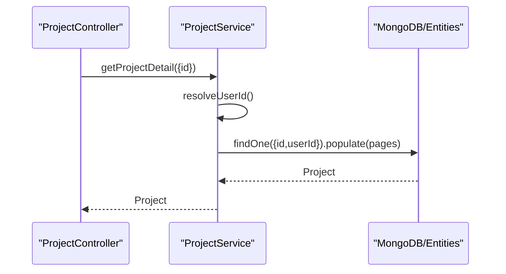
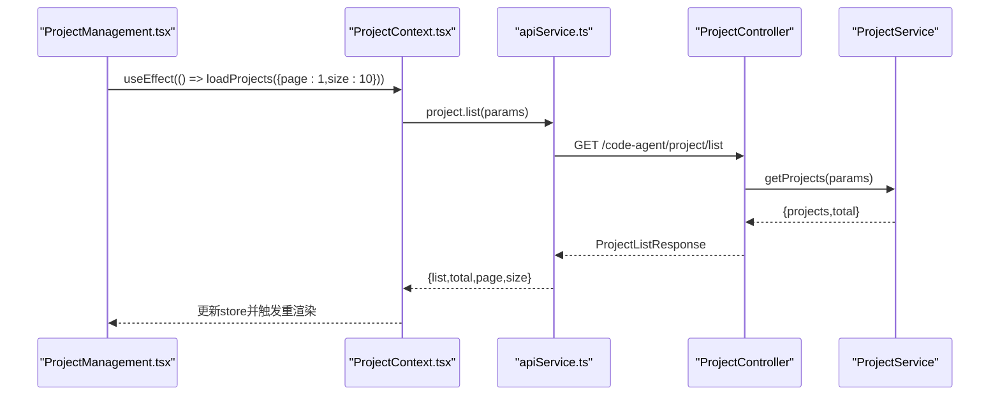
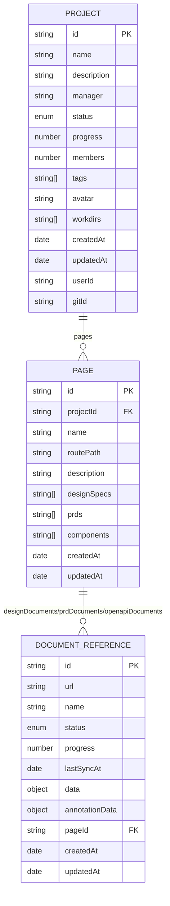
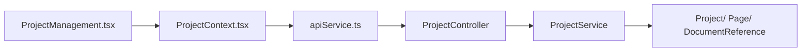

# 项目查询

<cite>
**本文引用的文件**
- [code-agent-backend/src/service/code-agent/project.ts](file://code-agent-backend/src/service/code-agent/project.ts)
- [code-agent-backend/src/controller/code-agent/project.ts](file://code-agent-backend/src/controller/code-agent/project.ts)
- [code-agent-backend/src/entity/code-agent/project.ts](file://code-agent-backend/src/entity/code-agent/project.ts)
- [code-agent-backend/src/dto/code-agent/req.ts](file://code-agent-backend/src/dto/code-agent/req.ts)
- [code-agent-backend/src/dto/code-agent/res.ts](file://code-agent-backend/src/dto/code-agent/res.ts)
- [fta-layout-design/src/services/projectService.ts](file://fta-layout-design/src/services/projectService.ts)
- [fta-layout-design/src/utils/apiService.ts](file://fta-layout-design/src/utils/apiService.ts)
- [fta-layout-design/src/types/project.ts](file://fta-layout-design/src/types/project.ts)
- [fta-layout-design/src/contexts/ProjectContext.tsx](file://fta-layout-design/src/contexts/ProjectContext.tsx)
- [fta-layout-design/src/pages/HomePage/ProjectManagement.tsx](file://fta-layout-design/src/pages/HomePage/ProjectManagement.tsx)
</cite>

## 目录
1. [简介](#简介)
2. [项目结构](#项目结构)
3. [核心组件](#核心组件)
4. [架构总览](#架构总览)
5. [详细组件分析](#详细组件分析)
6. [依赖关系分析](#依赖关系分析)
7. [性能考量](#性能考量)
8. [故障排查指南](#故障排查指南)
9. [结论](#结论)
10. [附录](#附录)

## 简介
本文件围绕项目查询功能展开，重点解析后端 getProjects 与 getProjectDetail 两个核心查询方法，系统阐述：
- 分页查询的实现机制：page/size 参数处理、skip/limit 计算、total 总数返回
- MongoDB 查询中的 populate 关联查询与 updatedAt 排序策略
- 前端项目列表页面的数据加载流程（分页控件与数据渲染）
- 高级开发者视角下的查询性能优化（索引建议、过滤策略）
- 用户 ID 权限过滤与数据缓存策略建议
- 实际代码示例路径（以“代码片段路径”形式给出）

## 项目结构
后端采用 MidwayJS + TypeORM/TypeGoose + MongoDB 的技术栈，前端基于 React + Ant Design。查询链路从前端通过 apiService 发起请求，经由控制器（Controller）进入服务层（Service），最终落到实体（Entity）与数据库交互。

图表来源
- [code-agent-backend/src/controller/code-agent/project.ts](file://code-agent-backend/src/controller/code-agent/project.ts#L49-L141)
- [code-agent-backend/src/service/code-agent/project.ts](file://code-agent-backend/src/service/code-agent/project.ts#L246-L354)
- [code-agent-backend/src/entity/code-agent/project.ts](file://code-agent-backend/src/entity/code-agent/project.ts#L107-L166)
- [code-agent-backend/src/dto/code-agent/req.ts](file://code-agent-backend/src/dto/code-agent/req.ts#L3-L10)
- [code-agent-backend/src/dto/code-agent/res.ts](file://code-agent-backend/src/dto/code-agent/res.ts#L81-L91)
- [fta-layout-design/src/utils/apiService.ts](file://fta-layout-design/src/utils/apiService.ts#L460-L500)
- [fta-layout-design/src/contexts/ProjectContext.tsx](file://fta-layout-design/src/contexts/ProjectContext.tsx#L335-L354)
- [fta-layout-design/src/pages/HomePage/ProjectManagement.tsx](file://fta-layout-design/src/pages/HomePage/ProjectManagement.tsx#L46-L48)

章节来源
- [code-agent-backend/src/controller/code-agent/project.ts](file://code-agent-backend/src/controller/code-agent/project.ts#L49-L141)
- [code-agent-backend/src/service/code-agent/project.ts](file://code-agent-backend/src/service/code-agent/project.ts#L246-L354)
- [code-agent-backend/src/entity/code-agent/project.ts](file://code-agent-backend/src/entity/code-agent/project.ts#L107-L166)
- [code-agent-backend/src/dto/code-agent/req.ts](file://code-agent-backend/src/dto/code-agent/req.ts#L3-L10)
- [code-agent-backend/src/dto/code-agent/res.ts](file://code-agent-backend/src/dto/code-agent/res.ts#L81-L91)
- [fta-layout-design/src/utils/apiService.ts](file://fta-layout-design/src/utils/apiService.ts#L460-L500)
- [fta-layout-design/src/contexts/ProjectContext.tsx](file://fta-layout-design/src/contexts/ProjectContext.tsx#L335-L354)
- [fta-layout-design/src/pages/HomePage/ProjectManagement.tsx](file://fta-layout-design/src/pages/HomePage/ProjectManagement.tsx#L46-L48)

## 核心组件
- 控制器（Controller）
  - 提供 /code-agent/project/list 与 /code-agent/project/detail 两个接口，分别对应 getProjects 与 getProjectDetail 的入口。
  - 对异常进行统一捕获并设置 HTTP 状态码。
- 服务层（Service）
  - getProjects：实现分页、权限过滤、populate 关联查询与 updatedAt 排序。
  - getProjectDetail：按用户维度校验并返回项目详情。
- 实体（Entity）
  - Project、Page、DocumentReference 三个实体构成项目-页面-文档三层嵌套结构。
- DTO（请求/响应）
  - 请求：ProjectListRequest、GetProjectDetailRequest
  - 响应：ProjectListResponse、ProjectDetailResponse

章节来源
- [code-agent-backend/src/controller/code-agent/project.ts](file://code-agent-backend/src/controller/code-agent/project.ts#L49-L141)
- [code-agent-backend/src/service/code-agent/project.ts](file://code-agent-backend/src/service/code-agent/project.ts#L246-L354)
- [code-agent-backend/src/entity/code-agent/project.ts](file://code-agent-backend/src/entity/code-agent/project.ts#L107-L166)
- [code-agent-backend/src/dto/code-agent/req.ts](file://code-agent-backend/src/dto/code-agent/req.ts#L3-L10)
- [code-agent-backend/src/dto/code-agent/res.ts](file://code-agent-backend/src/dto/code-agent/res.ts#L81-L91)

## 架构总览
后端查询链路的关键步骤如下：
- 前端通过 apiService 调用后端接口
- 控制器接收参数并调用服务层
- 服务层解析分页参数、构造用户权限过滤条件、执行 MongoDB 查询
- 返回标准化响应对象

图表来源
- [fta-layout-design/src/pages/HomePage/ProjectManagement.tsx](file://fta-layout-design/src/pages/HomePage/ProjectManagement.tsx#L46-L48)
- [fta-layout-design/src/utils/apiService.ts](file://fta-layout-design/src/utils/apiService.ts#L460-L500)
- [code-agent-backend/src/controller/code-agent/project.ts](file://code-agent-backend/src/controller/code-agent/project.ts#L49-L58)
- [code-agent-backend/src/service/code-agent/project.ts](file://code-agent-backend/src/service/code-agent/project.ts#L246-L266)

## 详细组件分析

### getProjects：分页查询与 populate 关联
- 分页参数处理
  - page 默认值为 1，size 默认值为 10
  - skip = (page - 1) × size
- 权限过滤
  - 通过 resolveUserId 获取当前用户 ID，查询条件为 { userId }
- 关联查询
  - 使用 populate 配置对 Project 的 pages 字段进行深度 populate，pages 下再对 designDocuments、prdDocuments、openapiDocuments 进行 populate
- 排序策略
  - 按 updatedAt 降序排序，确保最新项目优先展示
- 并发统计
  - 使用 Promise.all 并行执行 find(...) 与 countDocuments(...)，提升整体查询效率

图表来源
- [code-agent-backend/src/service/code-agent/project.ts](file://code-agent-backend/src/service/code-agent/project.ts#L246-L266)

章节来源
- [code-agent-backend/src/service/code-agent/project.ts](file://code-agent-backend/src/service/code-agent/project.ts#L246-L266)

### getProjectDetail：按用户维度的权限校验
- 通过 resolveUserId 获取当前用户 ID
- 在 findProject 中以 { id, userId } 进行精确查询，并对 pages 进行 populate
- 若未找到项目，抛出错误

图表来源
- [code-agent-backend/src/controller/code-agent/project.ts](file://code-agent-backend/src/controller/code-agent/project.ts#L132-L141)
- [code-agent-backend/src/service/code-agent/project.ts](file://code-agent-backend/src/service/code-agent/project.ts#L347-L354)

章节来源
- [code-agent-backend/src/controller/code-agent/project.ts](file://code-agent-backend/src/controller/code-agent/project.ts#L132-L141)
- [code-agent-backend/src/service/code-agent/project.ts](file://code-agent-backend/src/service/code-agent/project.ts#L347-L354)

### 前端数据加载流程（列表页面）
- 初始化加载
  - 首次挂载时调用 loadProjects({ page: 1, size: 10 })
- 加载逻辑
  - 调用 apiServices.project.getProjects(params)，将返回的 list、total、page、size 写入全局状态 store
- 渲染与筛选
  - 基于 store 中的 projects 进行本地筛选（名称/描述、状态）
  - 使用 Ant Design 的 Grid/Row/Col/Card/Progress 等组件渲染项目卡片

图表来源
- [fta-layout-design/src/pages/HomePage/ProjectManagement.tsx](file://fta-layout-design/src/pages/HomePage/ProjectManagement.tsx#L46-L48)
- [fta-layout-design/src/contexts/ProjectContext.tsx](file://fta-layout-design/src/contexts/ProjectContext.tsx#L335-L354)
- [fta-layout-design/src/utils/apiService.ts](file://fta-layout-design/src/utils/apiService.ts#L460-L500)
- [code-agent-backend/src/controller/code-agent/project.ts](file://code-agent-backend/src/controller/code-agent/project.ts#L49-L58)
- [code-agent-backend/src/service/code-agent/project.ts](file://code-agent-backend/src/service/code-agent/project.ts#L246-L266)

章节来源
- [fta-layout-design/src/pages/HomePage/ProjectManagement.tsx](file://fta-layout-design/src/pages/HomePage/ProjectManagement.tsx#L46-L48)
- [fta-layout-design/src/contexts/ProjectContext.tsx](file://fta-layout-design/src/contexts/ProjectContext.tsx#L335-L354)
- [fta-layout-design/src/utils/apiService.ts](file://fta-layout-design/src/utils/apiService.ts#L460-L500)

### 数据模型与关联关系
- Project
  - 字段：id、name、description、manager、status、progress、members、tags、avatar、pages、workdirs、createdAt、updatedAt、userId、gitId
  - pages 引用 Page
- Page
  - 字段：id、projectId、name、routePath、description、designDocuments、prdDocuments、openapiDocuments、designSpecs、prds、components、createdAt、updatedAt
  - designDocuments/prdDocuments/openapiDocuments 引用 DocumentReference
- DocumentReference
  - 字段：id、url、name、status、progress、lastSyncAt、data、annotationData、createdAt、updatedAt、pageId

图表来源
- [code-agent-backend/src/entity/code-agent/project.ts](file://code-agent-backend/src/entity/code-agent/project.ts#L107-L166)

章节来源
- [code-agent-backend/src/entity/code-agent/project.ts](file://code-agent-backend/src/entity/code-agent/project.ts#L107-L166)

## 依赖关系分析
- 控制器依赖服务层
  - /code-agent/project/list -> getProjects
  - /code-agent/project/detail -> getProjectDetail
- 服务层依赖实体与上下文
  - getProjects/getProjectDetail 依赖 resolveUserId 获取用户 ID
  - getProjects 使用 projectPagesPopulateOptions 进行 populate
- 前端依赖 apiService
  - project.list / project.detail 作为统一入口
  - ProjectContext 将后端返回的 list/total/page/size 写入全局状态

图表来源
- [code-agent-backend/src/controller/code-agent/project.ts](file://code-agent-backend/src/controller/code-agent/project.ts#L49-L141)
- [code-agent-backend/src/service/code-agent/project.ts](file://code-agent-backend/src/service/code-agent/project.ts#L246-L354)
- [code-agent-backend/src/entity/code-agent/project.ts](file://code-agent-backend/src/entity/code-agent/project.ts#L107-L166)
- [fta-layout-design/src/utils/apiService.ts](file://fta-layout-design/src/utils/apiService.ts#L460-L500)
- [fta-layout-design/src/contexts/ProjectContext.tsx](file://fta-layout-design/src/contexts/ProjectContext.tsx#L335-L354)
- [fta-layout-design/src/pages/HomePage/ProjectManagement.tsx](file://fta-layout-design/src/pages/HomePage/ProjectManagement.tsx#L46-L48)

章节来源
- [code-agent-backend/src/controller/code-agent/project.ts](file://code-agent-backend/src/controller/code-agent/project.ts#L49-L141)
- [code-agent-backend/src/service/code-agent/project.ts](file://code-agent-backend/src/service/code-agent/project.ts#L246-L354)
- [code-agent-backend/src/entity/code-agent/project.ts](file://code-agent-backend/src/entity/code-agent/project.ts#L107-L166)
- [fta-layout-design/src/utils/apiService.ts](file://fta-layout-design/src/utils/apiService.ts#L460-L500)
- [fta-layout-design/src/contexts/ProjectContext.tsx](file://fta-layout-design/src/contexts/ProjectContext.tsx#L335-L354)
- [fta-layout-design/src/pages/HomePage/ProjectManagement.tsx](file://fta-layout-design/src/pages/HomePage/ProjectManagement.tsx#L46-L48)

## 性能考量
- 分页与并发
  - 使用 Promise.all 并行执行 find(...) 与 countDocuments(...)，减少往返时间
- 排序与索引
  - updatedAt 降序排序是常见策略，建议在 userId 与 updatedAt 上建立复合索引以加速查询
- populate 展开层级
  - pages 与 pages 下的多层文档引用会增加查询成本，建议仅在必要时展开，或在前端做懒加载
- 缓存策略
  - 对高频访问的项目列表，可在应用层引入缓存（如 Redis），结合 TTL 与失效策略
  - 对详情页可做短期缓存，结合 ETag/Last-Modified 或版本号控制
- 过滤与投影
  - 如仅需部分字段，可在 find(...) 中使用 projection 减少传输量
- 分页参数默认值
  - 合理的默认 page/size 可避免超大页码导致的性能问题

[本节为通用指导，无需列出具体代码来源]

## 故障排查指南
- 用户 ID 为空
  - 服务层 resolveUserId 无法解析到用户 ID 时会抛错，检查中间件注入的 user-id 或 ctx.state.user 是否正确传递
- 项目不存在
  - findProject/findPageInProject 未命中时抛出错误，检查 id 与 userId 组合是否正确
- 分页参数非法
  - page/size 非法或过大可能导致 skip 越界，建议在控制器层增加参数校验与边界保护
- populate 展开过多
  - pages 下的文档引用较多时，populate 会显著增加查询时间，建议分页或延迟加载

章节来源
- [code-agent-backend/src/service/code-agent/project.ts](file://code-agent-backend/src/service/code-agent/project.ts#L45-L54)
- [code-agent-backend/src/service/code-agent/project.ts](file://code-agent-backend/src/service/code-agent/project.ts#L187-L200)
- [code-agent-backend/src/controller/code-agent/project.ts](file://code-agent-backend/src/controller/code-agent/project.ts#L50-L58)
- [code-agent-backend/src/controller/code-agent/project.ts](file://code-agent-backend/src/controller/code-agent/project.ts#L132-L141)

## 结论
- getProjects 与 getProjectDetail 已完整实现分页、权限过滤、populate 关联与 updatedAt 排序
- 前端通过 apiService 与 ProjectContext 完成数据加载与状态管理
- 高级优化方向集中在索引、缓存与懒加载上，以平衡查询性能与用户体验

[本节为总结性内容，无需列出具体代码来源]

## 附录

### API 定义与示例路径
- 列表接口
  - 请求参数：page、size
  - 响应结构：list、total、page、size
  - 示例路径：
    - [请求 DTO：ProjectListRequest](file://code-agent-backend/src/dto/code-agent/req.ts#L3-L10)
    - [响应 DTO：ProjectListResponse](file://code-agent-backend/src/dto/code-agent/res.ts#L81-L91)
    - [控制器：getProjects](file://code-agent-backend/src/controller/code-agent/project.ts#L49-L58)
    - [服务层：getProjects](file://code-agent-backend/src/service/code-agent/project.ts#L246-L266)
    - [前端调用：api.project.list](file://fta-layout-design/src/utils/apiService.ts#L460-L500)
    - [前端加载：useEffect 调用 loadProjects](file://fta-layout-design/src/pages/HomePage/ProjectManagement.tsx#L46-L48)
- 详情接口
  - 请求参数：id
  - 响应结构：单个项目对象（包含 pages 与文档引用）
  - 示例路径：
    - [请求 DTO：GetProjectDetailRequest](file://code-agent-backend/src/dto/code-agent/req.ts#L118-L124)
    - [响应 DTO：ProjectDetailResponse](file://code-agent-backend/src/dto/code-agent/res.ts#L87-L91)
    - [控制器：getProjectDetail](file://code-agent-backend/src/controller/code-agent/project.ts#L132-L141)
    - [服务层：getProjectDetail](file://code-agent-backend/src/service/code-agent/project.ts#L347-L354)
    - [前端调用：api.project.detail](file://fta-layout-design/src/utils/apiService.ts#L490-L496)

### 前端项目列表页面数据加载要点
- 初始化加载：首次加载时传入 { page: 1, size: 10 }
- 状态写入：将 list、total、page、size 写入全局状态 store
- 渲染与筛选：基于 store 中的 projects 进行本地筛选与 UI 渲染

章节来源
- [fta-layout-design/src/pages/HomePage/ProjectManagement.tsx](file://fta-layout-design/src/pages/HomePage/ProjectManagement.tsx#L46-L48)
- [fta-layout-design/src/contexts/ProjectContext.tsx](file://fta-layout-design/src/contexts/ProjectContext.tsx#L335-L354)
- [fta-layout-design/src/types/project.ts](file://fta-layout-design/src/types/project.ts#L24-L36)