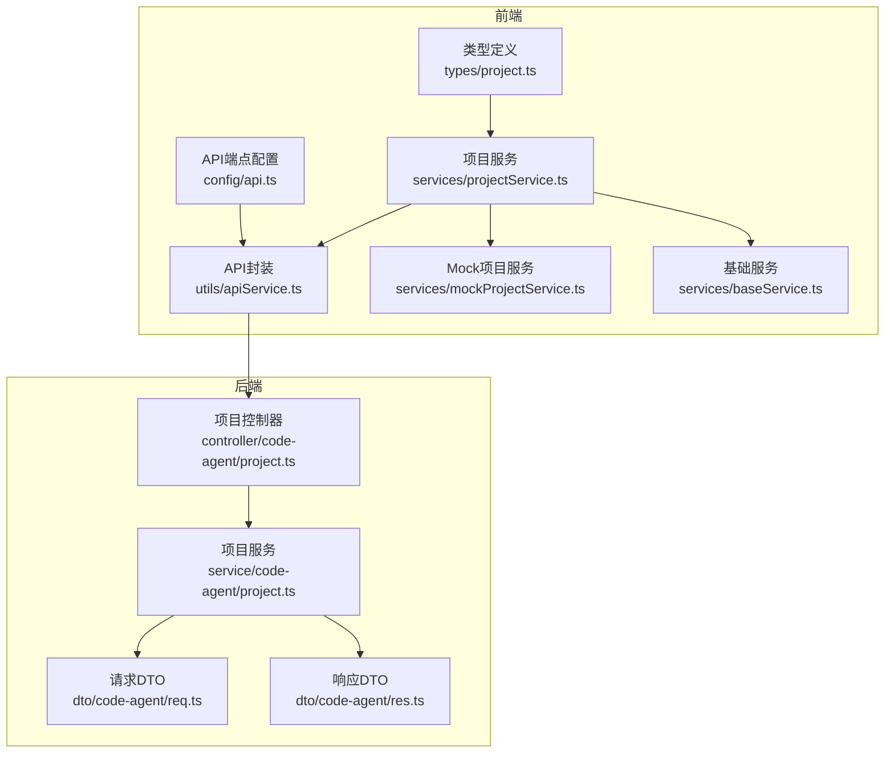
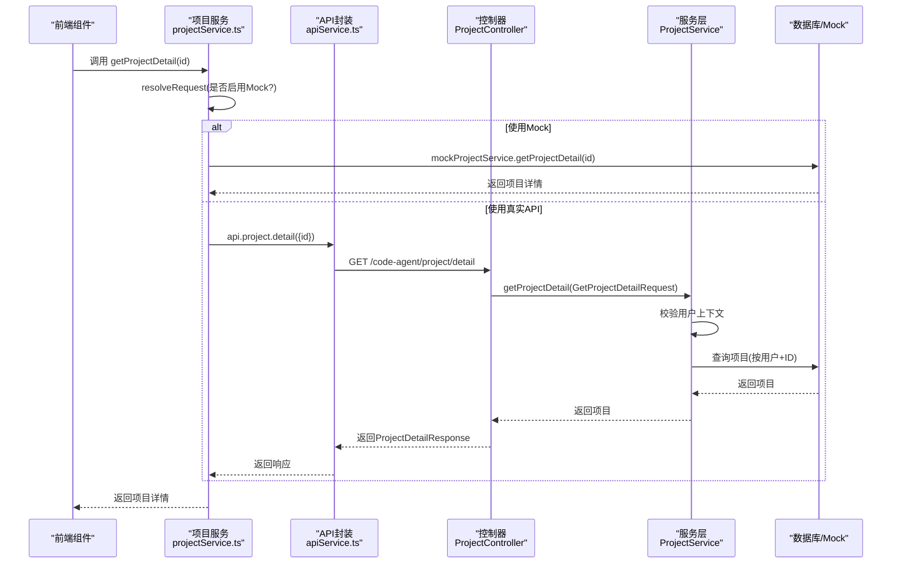
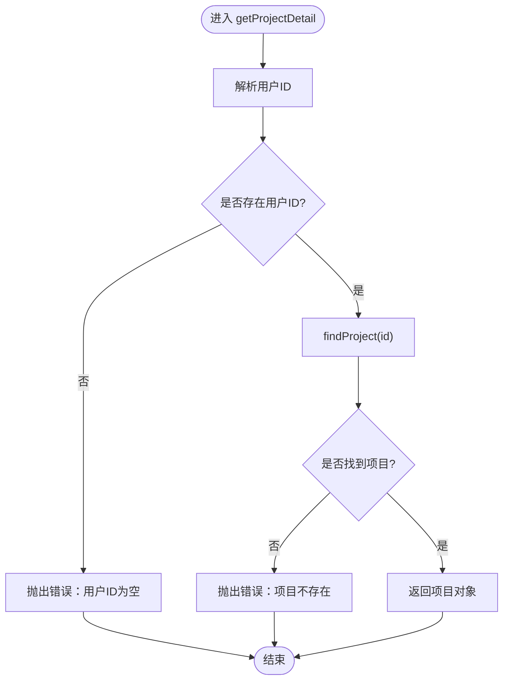
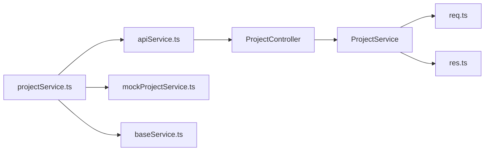

# 项目详情查询

<cite>
**本文引用的文件**
- [项目控制器（后端）](file://code-agent-backend/src/controller/code-agent/project.ts)
- [项目服务（后端）](file://code-agent-backend/src/service/code-agent/project.ts)
- [请求DTO（后端）](file://code-agent-backend/src/dto/code-agent/req.ts)
- [响应DTO（后端）](file://code-agent-backend/src/dto/code-agent/res.ts)
- [项目服务（前端）](file://fta-layout-design/src/services/projectService.ts)
- [Mock项目服务（前端）](file://fta-layout-design/src/services/mockProjectService.ts)
- [API封装（前端）](file://fta-layout-design/src/utils/apiService.ts)
- [API端点配置（前端）](file://fta-layout-design/src/config/api.ts)
- [基础服务（前端）](file://fta-layout-design/src/services/baseService.ts)
- [项目类型定义（前端）](file://fta-layout-design/src/types/project.ts)
</cite>

## 目录
1. [简介](#简介)
2. [项目结构](#项目结构)
3. [核心组件](#核心组件)
4. [架构总览](#架构总览)
5. [详细组件分析](#详细组件分析)
6. [依赖关系分析](#依赖关系分析)
7. [性能考量](#性能考量)
8. [故障排查指南](#故障排查指南)
9. [结论](#结论)
10. [附录](#附录)

## 简介
本篇文档围绕“项目详情查询”功能展开，系统性梳理从API请求到响应处理的完整链路，重点解析后端控制器与服务层的调用关系、前端通过projectService获取数据的流程、用户身份验证与ID参数校验、异常处理策略（尤其是404状态码设置）、以及mock服务中的延迟模拟实现。同时给出数据结构定义、权限控制扩展点与缓存可能性讨论，帮助初学者快速上手，也为高级开发者提供深入的技术细节。

## 项目结构
该项目采用前后端分离架构：
- 前端（fta-layout-design）：负责UI交互、API封装、Mock数据与业务服务编排。
- 后端（code-agent-backend）：提供REST接口、业务逻辑与数据访问。

图表来源
- [项目控制器（后端）](file://code-agent-backend/src/controller/code-agent/project.ts#L133-L141)
- [项目服务（后端）](file://code-agent-backend/src/service/code-agent/project.ts#L347-L353)
- [请求DTO（后端）](file://code-agent-backend/src/dto/code-agent/req.ts#L117-L124)
- [响应DTO（后端）](file://code-agent-backend/src/dto/code-agent/res.ts#L87-L91)
- [项目服务（前端）](file://fta-layout-design/src/services/projectService.ts#L114-L125)
- [Mock项目服务（前端）](file://fta-layout-design/src/services/mockProjectService.ts#L253-L257)
- [API封装（前端）](file://fta-layout-design/src/utils/apiService.ts#L490-L500)
- [API端点配置（前端）](file://fta-layout-design/src/config/api.ts#L35-L41)
- [基础服务（前端）](file://fta-layout-design/src/services/baseService.ts#L1-L26)
- [项目类型定义（前端）](file://fta-layout-design/src/types/project.ts#L4-L22)

章节来源
- [项目控制器（后端）](file://code-agent-backend/src/controller/code-agent/project.ts#L133-L141)
- [项目服务（后端）](file://code-agent-backend/src/service/code-agent/project.ts#L347-L353)
- [项目服务（前端）](file://fta-layout-design/src/services/projectService.ts#L114-L125)

## 核心组件
- 后端控制器：提供GET /code-agent/project/detail接口，接收GetProjectDetailRequest参数，调用服务层获取项目详情并返回ProjectDetailResponse。
- 后端服务层：校验用户上下文、按用户维度与项目ID查询项目，若未找到则抛出错误。
- 前端项目服务：统一入口，根据是否启用Mock决定走Mock或真实API；内部调用API封装与Mock服务。
- 前端API封装：基于端点配置，发起HTTP请求；支持分页、内部接口与文档相关接口。
- 前端Mock服务：在开发环境下模拟延迟与数据，便于联调与测试。
- 类型与DTO：前后端对请求参数与响应结构进行约束，保证契约一致。

章节来源
- [项目控制器（后端）](file://code-agent-backend/src/controller/code-agent/project.ts#L133-L141)
- [项目服务（后端）](file://code-agent-backend/src/service/code-agent/project.ts#L347-L353)
- [请求DTO（后端）](file://code-agent-backend/src/dto/code-agent/req.ts#L117-L124)
- [响应DTO（后端）](file://code-agent-backend/src/dto/code-agent/res.ts#L87-L91)
- [项目服务（前端）](file://fta-layout-design/src/services/projectService.ts#L114-L125)
- [API封装（前端）](file://fta-layout-design/src/utils/apiService.ts#L490-L500)
- [Mock项目服务（前端）](file://fta-layout-design/src/services/mockProjectService.ts#L253-L257)

## 架构总览
下面以序列图展示从前端到后端的完整调用链路，以及错误处理与Mock切换机制。

图表来源
- [项目服务（前端）](file://fta-layout-design/src/services/projectService.ts#L114-L125)
- [API封装（前端）](file://fta-layout-design/src/utils/apiService.ts#L490-L500)
- [项目控制器（后端）](file://code-agent-backend/src/controller/code-agent/project.ts#L133-L141)
- [项目服务（后端）](file://code-agent-backend/src/service/code-agent/project.ts#L347-L353)
- [请求DTO（后端）](file://code-agent-backend/src/dto/code-agent/req.ts#L117-L124)
- [响应DTO（后端）](file://code-agent-backend/src/dto/code-agent/res.ts#L87-L91)

## 详细组件分析

### 后端控制器：getProjectDetail
- 路由：GET /code-agent/project/detail
- 参数：GetProjectDetailRequest（包含id）
- 流程：
  1) 调用服务层getProjectDetail(query)
  2) 成功时返回ProjectDetailResponse
  3) 异常时设置ctx.status为404并抛出错误
- 错误处理：明确的404状态码设置，便于前端区分“资源不存在”。

章节来源
- [项目控制器（后端）](file://code-agent-backend/src/controller/code-agent/project.ts#L133-L141)
- [请求DTO（后端）](file://code-agent-backend/src/dto/code-agent/req.ts#L117-L124)
- [响应DTO（后端）](file://code-agent-backend/src/dto/code-agent/res.ts#L87-L91)

### 后端服务层：getProjectDetail
- 用户身份验证：
  - 通过ctx.get('user-id')或ctx.state?.user获取用户ID
  - 若无用户ID，直接抛错
- 查询逻辑：
  - findProject(params.id)：按用户维度与项目ID查询
  - 若未找到，抛出“项目不存在”
- 返回值：完整的项目对象（包含pages及其文档引用）

图表来源
- [项目服务（后端）](file://code-agent-backend/src/service/code-agent/project.ts#L347-L353)
- [项目服务（后端）](file://code-agent-backend/src/service/code-agent/project.ts#L188-L201)

章节来源
- [项目服务（后端）](file://code-agent-backend/src/service/code-agent/project.ts#L347-L353)
- [项目服务（后端）](file://code-agent-backend/src/service/code-agent/project.ts#L188-L201)

### 前端项目服务：getProjectDetail
- 统一入口：resolveRequest(shouldUseMock(), mockHandler, apiHandler)
- 当启用Mock时：调用projectMockService.getProjectDetail(id)，并带有延迟模拟
- 当关闭Mock时：调用api.project.detail({id})，再由API封装转发至后端

章节来源
- [项目服务（前端）](file://fta-layout-design/src/services/projectService.ts#L114-L125)
- [基础服务（前端）](file://fta-layout-design/src/services/baseService.ts#L1-L26)
- [API封装（前端）](file://fta-layout-design/src/utils/apiService.ts#L490-L500)
- [Mock项目服务（前端）](file://fta-layout-design/src/services/mockProjectService.ts#L253-L257)

### 前端API封装与端点配置
- 端点：/code-agent/project/detail
- 封装：api.project.detail(params) -> ApiService.get(...)
- 端点配置：API_ENDPOINTS.project.detail

章节来源
- [API端点配置（前端）](file://fta-layout-design/src/config/api.ts#L35-L41)
- [API封装（前端）](file://fta-layout-design/src/utils/apiService.ts#L490-L500)

### 前端Mock服务：getProjectDetail
- 延迟模拟：delay() 默认200ms，提升联调体验
- 数据来源：内存中的mockProjects，按id查找并深拷贝返回
- 异常：找不到项目时抛错，触发前端统一错误处理

章节来源
- [Mock项目服务（前端）](file://fta-layout-design/src/services/mockProjectService.ts#L12-L16)
- [Mock项目服务（前端）](file://fta-layout-design/src/services/mockProjectService.ts#L253-L257)

### 请求参数与响应数据结构
- 请求参数（后端）：GetProjectDetailRequest.id（必填）
- 响应结构（后端）：ProjectDetailResponse（包含项目对象）
- 前端类型：Project接口（包含id、name、status、progress、members、tags、avatar、pages、userId、gitId、workdirs等）

章节来源
- [请求DTO（后端）](file://code-agent-backend/src/dto/code-agent/req.ts#L117-L124)
- [响应DTO（后端）](file://code-agent-backend/src/dto/code-agent/res.ts#L87-L91)
- [项目类型定义（前端）](file://fta-layout-design/src/types/project.ts#L4-L22)

### 权限控制与ID参数校验
- 权限控制：
  - 后端通过resolveUserId()强制要求存在用户上下文
  - 查询时限定为“当前用户”的项目（userId匹配）
- ID参数校验：
  - 后端GetProjectDetailRequest.id为必填
  - 未找到项目时抛错，控制器设置404
- 前端Mock：
  - 仅在开发环境启用，不参与生产权限校验

章节来源
- [项目服务（后端）](file://code-agent-backend/src/service/code-agent/project.ts#L44-L54)
- [项目服务（后端）](file://code-agent-backend/src/service/code-agent/project.ts#L188-L201)
- [请求DTO（后端）](file://code-agent-backend/src/dto/code-agent/req.ts#L117-L124)
- [项目控制器（后端）](file://code-agent-backend/src/controller/code-agent/project.ts#L133-L141)

### 错误处理策略（404状态码）
- 后端：
  - 业务异常（用户ID为空、项目不存在）会抛出错误
  - 控制器捕获异常并将ctx.status设为404
- 前端：
  - 通过resolveRequest统一处理Mock与真实API
  - 可结合UI提示与重试策略

章节来源
- [项目控制器（后端）](file://code-agent-backend/src/controller/code-agent/project.ts#L133-L141)
- [项目服务（后端）](file://code-agent-backend/src/service/code-agent/project.ts#L347-L353)

### Mock服务中的延迟模拟实现
- 前端：
  - delay(ms=200) -> setTimeout包装Promise
  - 在getProjectDetail等方法中await delay()，模拟网络延迟
- 后端：
  - 无Mock层，直接查询数据库；若需模拟可引入中间件或装饰器（本仓库未实现）

章节来源
- [Mock项目服务（前端）](file://fta-layout-design/src/services/mockProjectService.ts#L12-L16)
- [Mock项目服务（前端）](file://fta-layout-design/src/services/mockProjectService.ts#L253-L257)

### 数据缓存可能性与建议
- 现状：
  - 后端直接查询数据库，未见显式缓存
  - 前端Mock服务为内存态，重启即丢失
- 建议：
  - 后端：对热点项目详情增加Redis缓存，设置合理TTL；命中缓存时减少DB压力
  - 前端：在项目详情页增加本地缓存（localStorage/sessionStorage），避免重复请求；结合ETag/Last-Modified做条件请求
  - 注意：缓存需考虑用户维度隔离与失效策略

[本节为通用建议，不直接分析具体文件]

## 依赖关系分析
- 前端依赖链：
  - projectService -> apiService -> API_ENDPOINTS -> 后端控制器
  - projectService -> mockProjectService（开发环境）
  - projectService -> baseService（Mock开关）
- 后端依赖链：
  - ProjectController -> ProjectService -> MongoDB（Typegoose）
  - DTO约束请求与响应结构

图表来源
- [项目服务（前端）](file://fta-layout-design/src/services/projectService.ts#L114-L125)
- [API封装（前端）](file://fta-layout-design/src/utils/apiService.ts#L490-L500)
- [Mock项目服务（前端）](file://fta-layout-design/src/services/mockProjectService.ts#L253-L257)
- [基础服务（前端）](file://fta-layout-design/src/services/baseService.ts#L1-L26)
- [项目控制器（后端）](file://code-agent-backend/src/controller/code-agent/project.ts#L133-L141)
- [项目服务（后端）](file://code-agent-backend/src/service/code-agent/project.ts#L347-L353)
- [请求DTO（后端）](file://code-agent-backend/src/dto/code-agent/req.ts#L117-L124)
- [响应DTO（后端）](file://code-agent-backend/src/dto/code-agent/res.ts#L87-L91)

章节来源
- [项目服务（前端）](file://fta-layout-design/src/services/projectService.ts#L114-L125)
- [项目控制器（后端）](file://code-agent-backend/src/controller/code-agent/project.ts#L133-L141)

## 性能考量
- 前端：
  - Mock延迟模拟有助于观察加载态与错误分支，但应避免在生产环境开启过长延迟
  - 可在详情页加入骨架屏与防抖，减少重复请求
- 后端：
  - 查询时按userId过滤，避免跨用户数据泄露
  - 对高频查询可引入缓存与索引优化
- 网络：
  - 合理设置超时与重试策略，避免长时间阻塞UI

[本节为通用指导，不直接分析具体文件]

## 故障排查指南
- 常见问题与定位：
  - 404：项目不存在或用户无权限查看
    - 检查GetProjectDetailRequest.id是否正确传递
    - 确认用户上下文（user-id）是否注入
  - 500：服务内部异常
    - 查看后端日志与堆栈
- 前端Mock：
  - 若启用Mock且未返回数据，检查mockProjects中是否存在对应id
  - 确认VITE_ENABLE_MOCK环境变量是否正确

章节来源
- [项目控制器（后端）](file://code-agent-backend/src/controller/code-agent/project.ts#L133-L141)
- [项目服务（后端）](file://code-agent-backend/src/service/code-agent/project.ts#L347-L353)
- [基础服务（前端）](file://fta-layout-design/src/services/baseService.ts#L1-L26)
- [Mock项目服务（前端）](file://fta-layout-design/src/services/mockProjectService.ts#L253-L257)

## 结论
“项目详情查询”功能在本项目中实现了清晰的前后端职责划分：前端通过projectService统一封装请求与Mock切换，后端严格校验用户上下文并按用户维度查询项目。错误处理方面，后端明确设置404状态码，便于前端区分资源不存在场景。整体流程简洁可靠，具备良好的扩展性，可在后续引入缓存与更细粒度的权限控制。

[本节为总结，不直接分析具体文件]

## 附录
- 关键路径参考：
  - 前端调用：services/projectService.ts#L114-L125
  - 前端API封装：utils/apiService.ts#L490-L500
  - 后端控制器：controller/code-agent/project.ts#L133-L141
  - 后端服务：service/code-agent/project.ts#L347-L353
  - 请求DTO：dto/code-agent/req.ts#L117-L124
  - 响应DTO：dto/code-agent/res.ts#L87-L91
  - Mock服务：services/mockProjectService.ts#L253-L257
  - 端点配置：config/api.ts#L35-L41
  - 基础服务：services/baseService.ts#L1-L26
  - 类型定义：types/project.ts#L4-L22