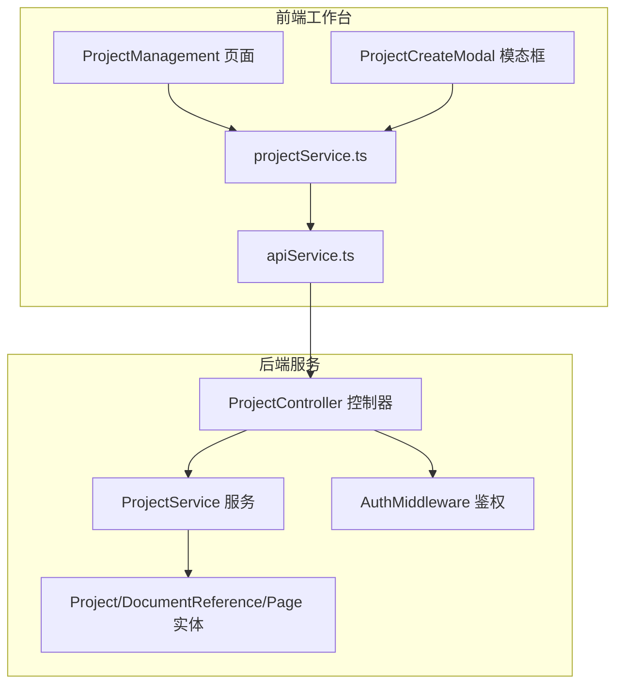
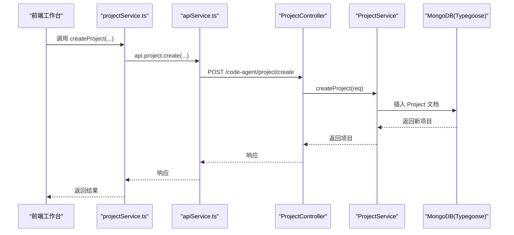
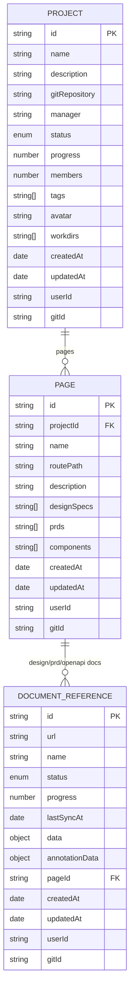
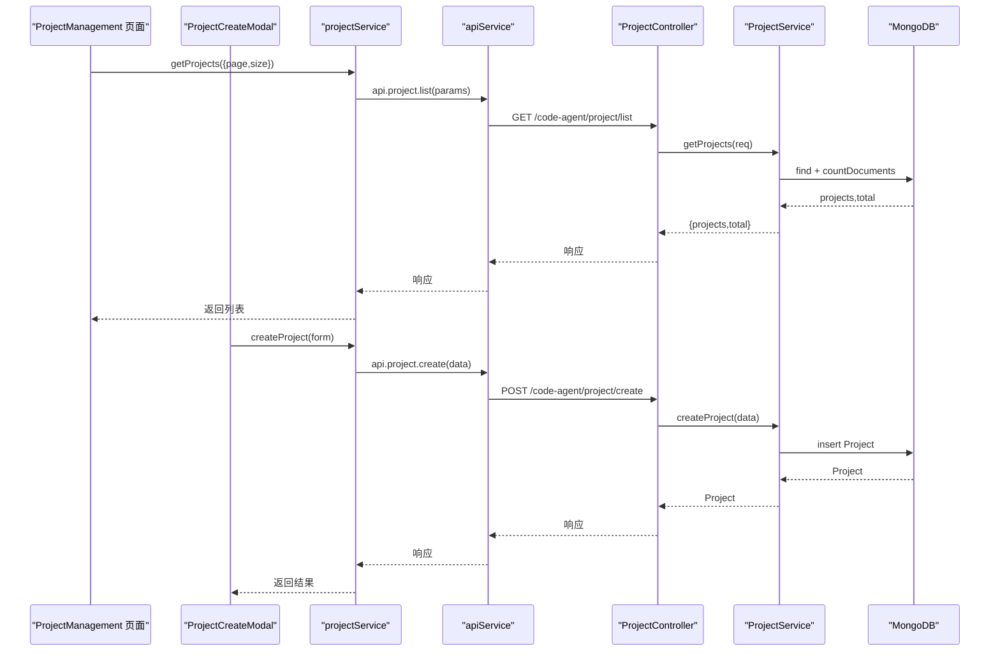
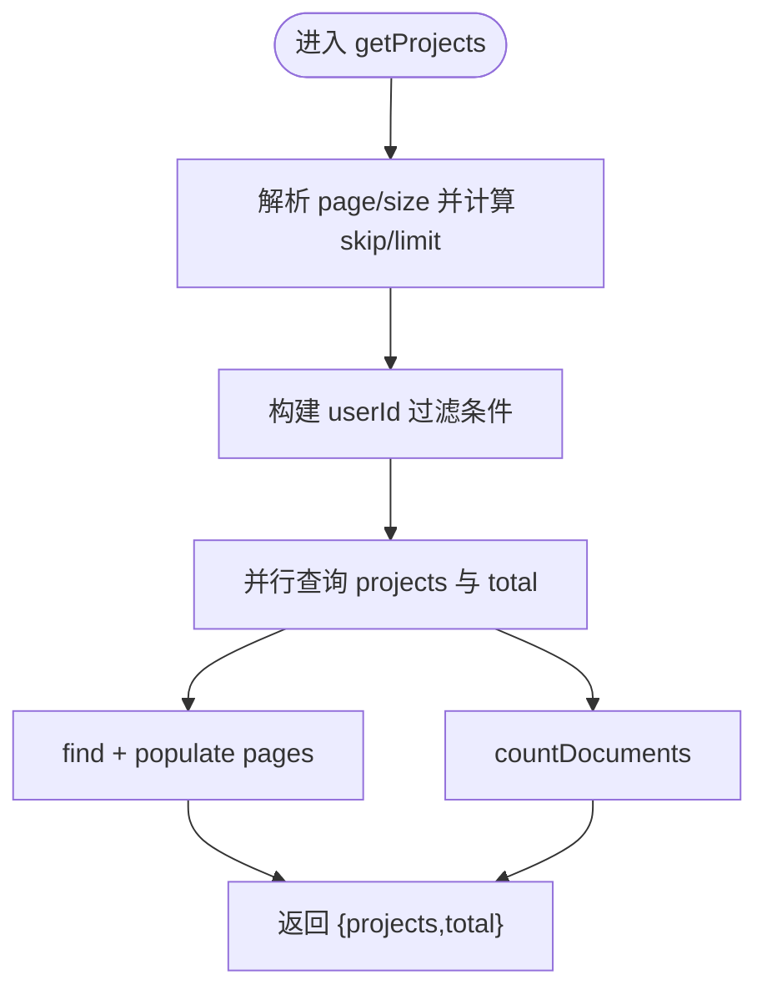
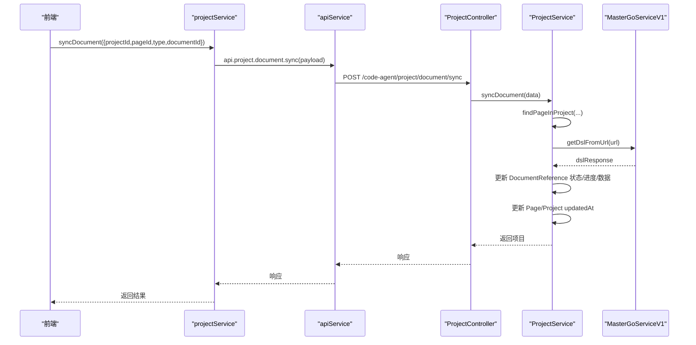
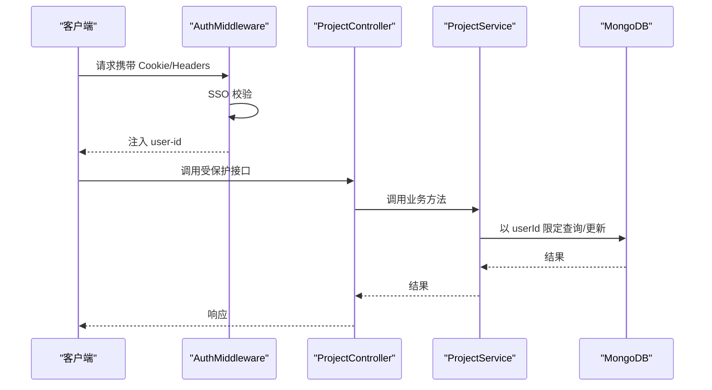
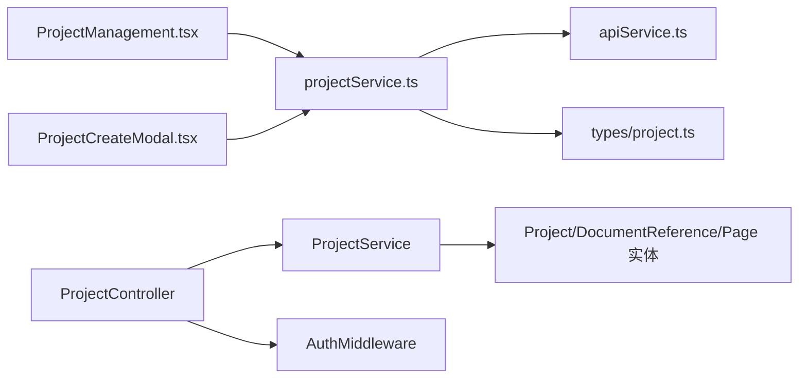

# 项目管理

<cite>
**本文引用的文件**
- [code-agent-backend/src/entity/code-agent/project.ts](file://code-agent-backend/src/entity/code-agent/project.ts)
- [code-agent-backend/src/controller/code-agent/project.ts](file://code-agent-backend/src/controller/code-agent/project.ts)
- [code-agent-backend/src/service/code-agent/project.ts](file://code-agent-backend/src/service/code-agent/project.ts)
- [code-agent-backend/src/dto/code-agent/req.ts](file://code-agent-backend/src/dto/code-agent/req.ts)
- [code-agent-backend/src/dto/code-agent/res.ts](file://code-agent-backend/src/dto/code-agent/res.ts)
- [code-agent-backend/src/middleware/auth.ts](file://code-agent-backend/src/middleware/auth.ts)
- [code-agent-backend/src/configuration.ts](file://code-agent-backend/src/configuration.ts)
- [code-agent-backend/README.md](file://code-agent-backend/README.md)
- [fta-layout-design/src/services/projectService.ts](file://fta-layout-design/src/services/projectService.ts)
- [fta-layout-design/src/types/project.ts](file://fta-layout-design/src/types/project.ts)
- [fta-layout-design/src/pages/HomePage/ProjectManagement.tsx](file://fta-layout-design/src/pages/HomePage/ProjectManagement.tsx)
- [fta-layout-design/src/components/ProjectCreateModal.tsx](file://fta-layout-design/src/components/ProjectCreateModal.tsx)
- [fta-layout-design/src/utils/apiService.ts](file://fta-layout-design/src/utils/apiService.ts)
- [fta-layout-design/README.md](file://fta-layout-design/README.md)
</cite>

## 目录
1. [简介](#简介)
2. [项目结构](#项目结构)
3. [核心组件](#核心组件)
4. [架构总览](#架构总览)
5. [详细组件分析](#详细组件分析)
6. [依赖关系分析](#依赖关系分析)
7. [性能考量](#性能考量)
8. [故障排查指南](#故障排查指南)
9. [结论](#结论)
10. [附录](#附录)

## 简介
本章节面向两类读者：初学者与高级开发者。初学者可通过前端工作台的“项目管理”页面与“创建项目”模态框，快速上手创建与管理项目；高级开发者可深入后端的 Project 实体、控制器与服务层，掌握 CRUD、分页查询、文档关联与状态机管理的实现细节，并结合权限中间件与 API 文档，理解端到端的项目生命周期管理。

## 项目结构
项目管理功能横跨前端与后端两大侧：
- 前端（fta-layout-design）：提供项目列表、创建、详情弹窗等 UI；通过统一的 API 服务封装调用后端接口。
- 后端（code-agent-backend）：提供项目与页面的 CRUD、文档同步与状态更新、上下文绑定与解析等能力；以 Typegoose 定义 MongoDB 数据模型。

图表来源
- [fta-layout-design/src/pages/HomePage/ProjectManagement.tsx](file://fta-layout-design/src/pages/HomePage/ProjectManagement.tsx#L1-L294)
- [fta-layout-design/src/components/ProjectCreateModal.tsx](file://fta-layout-design/src/components/ProjectCreateModal.tsx#L1-L161)
- [fta-layout-design/src/services/projectService.ts](file://fta-layout-design/src/services/projectService.ts#L1-L284)
- [fta-layout-design/src/utils/apiService.ts](file://fta-layout-design/src/utils/apiService.ts#L1-L800)
- [code-agent-backend/src/controller/code-agent/project.ts](file://code-agent-backend/src/controller/code-agent/project.ts#L1-L256)
- [code-agent-backend/src/service/code-agent/project.ts](file://code-agent-backend/src/service/code-agent/project.ts#L1-L767)
- [code-agent-backend/src/entity/code-agent/project.ts](file://code-agent-backend/src/entity/code-agent/project.ts#L1-L167)
- [code-agent-backend/src/middleware/auth.ts](file://code-agent-backend/src/middleware/auth.ts#L1-L194)

章节来源
- [fta-layout-design/README.md](file://fta-layout-design/README.md#L1-L515)
- [code-agent-backend/README.md](file://code-agent-backend/README.md#L1-L800)

## 核心组件
- 后端实体（MongoDB）：Project、Page、DocumentReference，分别对应项目、页面与文档引用。
- 控制器：提供项目列表、详情、创建、更新、删除、页面创建/更新/删除、文档状态更新/同步/内容获取等接口。
- 服务层：实现鉴权上下文解析、分页查询、文档引用创建与合并、页面与文档关联更新、上下文解析与绑定等。
- 前端服务：对后端接口进行统一封装，提供 getProjects、createProject、updateProject、deleteProject、getPageDetail、createPage、updatePage、deletePage、updateDocumentStatus、syncDocument、getDocumentContent、updateDocument、resolveProjectContext、bindProjectContext 等方法。
- 类型定义：前后端共享的 Project、Page、DocumentReference 等类型，以及 DTO 请求/响应。

章节来源
- [code-agent-backend/src/entity/code-agent/project.ts](file://code-agent-backend/src/entity/code-agent/project.ts#L1-L167)
- [code-agent-backend/src/controller/code-agent/project.ts](file://code-agent-backend/src/controller/code-agent/project.ts#L1-L256)
- [code-agent-backend/src/service/code-agent/project.ts](file://code-agent-backend/src/service/code-agent/project.ts#L1-L767)
- [code-agent-backend/src/dto/code-agent/req.ts](file://code-agent-backend/src/dto/code-agent/req.ts#L1-L580)
- [code-agent-backend/src/dto/code-agent/res.ts](file://code-agent-backend/src/dto/code-agent/res.ts#L1-L436)
- [fta-layout-design/src/services/projectService.ts](file://fta-layout-design/src/services/projectService.ts#L1-L284)
- [fta-layout-design/src/types/project.ts](file://fta-layout-design/src/types/project.ts#L1-L167)

## 架构总览
后端采用 Midway.js + Typegoose + Swagger + Redis/Bull 等技术栈，前端采用 React + Ant Design + Vite。鉴权中间件统一从请求头或 Cookie 中提取用户信息并注入上下文，服务层通过用户 ID 限定项目操作范围，确保数据隔离与权限控制。

图表来源
- [fta-layout-design/src/services/projectService.ts](file://fta-layout-design/src/services/projectService.ts#L70-L112)
- [fta-layout-design/src/utils/apiService.ts](file://fta-layout-design/src/utils/apiService.ts#L461-L500)
- [code-agent-backend/src/controller/code-agent/project.ts](file://code-agent-backend/src/controller/code-agent/project.ts#L88-L114)
- [code-agent-backend/src/service/code-agent/project.ts](file://code-agent-backend/src/service/code-agent/project.ts#L272-L300)

章节来源
- [code-agent-backend/src/configuration.ts](file://code-agent-backend/src/configuration.ts#L1-L55)
- [code-agent-backend/src/middleware/auth.ts](file://code-agent-backend/src/middleware/auth.ts#L1-L194)

## 详细组件分析

### 1) 数据模型与状态机（MongoDB）
- Project 实体
  - 字段要点：唯一 id、名称、描述、Git 仓库、负责人、状态（active/paused/completed/archived）、进度（0~100）、成员数、标签、头像、页面集合、工作目录映射、时间戳、用户标识、Git 项目标识。
  - 关键约束：id 唯一；状态枚举；进度范围校验；页面引用为 Page 集合。
- Page 实体
  - 字段要点：页面 id、所属项目 id、名称、路由路径、描述、设计文档/PRD/OpenAPI 文档引用列表、规格/PRD/组件清单、时间戳、用户标识、Git 项目标识。
  - 关键约束：设计文档/PRD/OpenAPI 文档引用为 DocumentReference 集合。
- DocumentReference 实体
  - 字段要点：文档 id、URL、名称、状态（pending/syncing/synced/failed/completed/editing）、进度、最后同步时间、数据快照、注解数据、页面 id、时间戳、用户标识、Git 项目标识。
  - 关键约束：状态枚举；进度范围；与 Page 通过 pageId 关联。

图表来源
- [code-agent-backend/src/entity/code-agent/project.ts](file://code-agent-backend/src/entity/code-agent/project.ts#L1-L167)

章节来源
- [code-agent-backend/src/entity/code-agent/project.ts](file://code-agent-backend/src/entity/code-agent/project.ts#L1-L167)

### 2) 前端工作台：创建与管理项目
- 项目管理页面（ProjectManagement）
  - 功能：分页展示项目卡片、搜索与筛选、查看详情、分享、删除；调用项目服务加载列表。
  - 交互：点击“创建新项目”打开创建模态框；点击“查看详情”打开详情弹窗。
- 创建项目模态框（ProjectCreateModal）
  - 功能：表单收集项目头像、名称、描述、Git 仓库、负责人、标签；提交后刷新列表。
- 项目服务（projectService）
  - 功能：封装后端接口，提供 getProjects、createProject、updateProject、deleteProject、getPageDetail、createPage、updatePage、deletePage、updateDocumentStatus、syncDocument、getDocumentContent、updateDocument、resolveProjectContext、bindProjectContext 等方法。
- API 服务（apiService）
  - 功能：统一请求/响应处理、错误拦截、超时控制、携带用户 Cookie 到后端（X-User-Cookies）。

图表来源
- [fta-layout-design/src/pages/HomePage/ProjectManagement.tsx](file://fta-layout-design/src/pages/HomePage/ProjectManagement.tsx#L1-L294)
- [fta-layout-design/src/components/ProjectCreateModal.tsx](file://fta-layout-design/src/components/ProjectCreateModal.tsx#L1-L161)
- [fta-layout-design/src/services/projectService.ts](file://fta-layout-design/src/services/projectService.ts#L61-L112)
- [fta-layout-design/src/utils/apiService.ts](file://fta-layout-design/src/utils/apiService.ts#L461-L500)
- [code-agent-backend/src/controller/code-agent/project.ts](file://code-agent-backend/src/controller/code-agent/project.ts#L48-L75)
- [code-agent-backend/src/service/code-agent/project.ts](file://code-agent-backend/src/service/code-agent/project.ts#L247-L267)

章节来源
- [fta-layout-design/src/pages/HomePage/ProjectManagement.tsx](file://fta-layout-design/src/pages/HomePage/ProjectManagement.tsx#L1-L294)
- [fta-layout-design/src/components/ProjectCreateModal.tsx](file://fta-layout-design/src/components/ProjectCreateModal.tsx#L1-L161)
- [fta-layout-design/src/services/projectService.ts](file://fta-layout-design/src/services/projectService.ts#L1-L284)
- [fta-layout-design/src/utils/apiService.ts](file://fta-layout-design/src/utils/apiService.ts#L1-L800)

### 3) 后端服务：CRUD 与分页查询
- 分页查询
  - 服务层通过 skip/limit + sort(-updatedAt) 实现分页；并并行 countDocuments 统计总数。
  - 控制器接收 page/size 参数，返回分页响应包装。
- 项目 CRUD
  - 创建：生成唯一 id，填充默认值（状态 active、进度 0、成员 1、头像、工作目录清洗），插入数据库。
  - 更新：根据用户 id 限定更新范围，支持 workdirs 清洗与字段选择性更新。
  - 删除：按 id+userId 删除，不存在时抛错。
  - 详情：按 id+userId 查询并 populate 页面与文档引用。
- 页面 CRUD
  - 创建页面：异步创建设计/PRD/OpenAPI 文档引用，插入 Page，再将 _id 追加到 Project.pages。
  - 更新页面：支持 name/routePath/description 与文档 URL 合并（存在则更新时间，不存在则新建）。
  - 删除页面：删除 Page，同时从 Project.pages 中 $pull。
- 文档管理
  - 文档状态更新：根据状态自动设置进度与最后同步时间，更新 Page/Project 时间戳。
  - 文档同步：根据类型调用第三方服务获取 DSL/数据，更新 DocumentReference 状态与数据。
  - 文档内容获取/更新：读取/更新 DocumentReference 字段，返回最新文档。

图表来源
- [code-agent-backend/src/service/code-agent/project.ts](file://code-agent-backend/src/service/code-agent/project.ts#L247-L267)
- [code-agent-backend/src/controller/code-agent/project.ts](file://code-agent-backend/src/controller/code-agent/project.ts#L50-L59)

章节来源
- [code-agent-backend/src/service/code-agent/project.ts](file://code-agent-backend/src/service/code-agent/project.ts#L247-L343)
- [code-agent-backend/src/controller/code-agent/project.ts](file://code-agent-backend/src/controller/code-agent/project.ts#L48-L114)

### 4) 文档同步与状态机
- 状态机
  - 文档状态：pending/syncing/synced/failed/completed/editing
  - 状态更新策略：syncing -> 50；synced/completed -> 100；failed -> 0；并记录 lastSyncAt。
- 同步流程
  - 根据 type 调用第三方服务（如 MasterGo）获取 DSL/数据，更新 DocumentReference.data 与状态。
  - 更新 Page/Project 的 updatedAt，保持时间线一致。

图表来源
- [code-agent-backend/src/service/code-agent/project.ts](file://code-agent-backend/src/service/code-agent/project.ts#L526-L598)
- [code-agent-backend/src/controller/code-agent/project.ts](file://code-agent-backend/src/controller/code-agent/project.ts#L214-L226)

章节来源
- [code-agent-backend/src/service/code-agent/project.ts](file://code-agent-backend/src/service/code-agent/project.ts#L493-L598)
- [code-agent-backend/src/controller/code-agent/project.ts](file://code-agent-backend/src/controller/code-agent/project.ts#L200-L226)

### 5) 权限控制与数据一致性
- 鉴权中间件
  - 从 X-User-Cookies 或 Cookie 中解析用户凭证，调用 SSO 校验，失败抛出 Unauthorized。
  - 将用户信息注入 ctx.state 与 ctx.headers('user-id')，供服务层解析。
- 服务层约束
  - 所有项目操作均以 userId 作为过滤条件，避免越权访问。
  - 文档引用创建/合并均携带 userId，确保归属正确。
  - Page/DocumentReference 的 populate 与更新链路保证引用完整性。
- 数据一致性
  - 页面创建时，先插入 Page 再更新 Project.pages，使用事务/原子更新保障一致性（此处为单次更新，若需强一致可在复杂场景引入事务）。
  - 文档状态更新与 Page/Project 时间戳更新在同一流程内，避免时间线不一致。

图表来源
- [code-agent-backend/src/middleware/auth.ts](file://code-agent-backend/src/middleware/auth.ts#L1-L194)
- [code-agent-backend/src/service/code-agent/project.ts](file://code-agent-backend/src/service/code-agent/project.ts#L45-L55)

章节来源
- [code-agent-backend/src/middleware/auth.ts](file://code-agent-backend/src/middleware/auth.ts#L1-L194)
- [code-agent-backend/src/service/code-agent/project.ts](file://code-agent-backend/src/service/code-agent/project.ts#L188-L201)

### 6) API 定义与示例
- 项目列表
  - 方法：GET /code-agent/project/list
  - 查询参数：page、size
  - 响应：分页包装的项目列表
- 创建项目
  - 方法：POST /code-agent/project/create
  - 请求体：名称、描述、Git 仓库、负责人、状态、进度、成员、标签、头像、工作目录映射
  - 响应：创建成功的项目
- 更新项目
  - 方法：POST /code-agent/project/update
  - 请求体：id + 可选字段（名称、描述、Git 仓库、负责人、状态、进度、成员、标签、头像、工作目录映射）
  - 响应：更新后的项目
- 删除项目
  - 方法：POST /code-agent/project/delete
  - 请求体：id
  - 响应：布尔成功标记
- 项目详情
  - 方法：GET /code-agent/project/detail
  - 查询参数：id
  - 响应：项目详情
- 页面 CRUD
  - 创建页面：POST /code-agent/project/page/create
  - 更新页面：POST /code-agent/project/page/update
  - 删除页面：POST /code-agent/project/page/delete
  - 页面详情：GET /code-agent/project/page/detail
- 文档管理
  - 更新文档状态：POST /code-agent/project/document/status
  - 同步文档：POST /code-agent/project/document/sync
  - 获取文档内容：GET /code-agent/project/document/content
  - 更新文档：POST /code-agent/project/document/update

章节来源
- [code-agent-backend/src/controller/code-agent/project.ts](file://code-agent-backend/src/controller/code-agent/project.ts#L48-L255)
- [code-agent-backend/src/dto/code-agent/req.ts](file://code-agent-backend/src/dto/code-agent/req.ts#L1-L580)
- [code-agent-backend/src/dto/code-agent/res.ts](file://code-agent-backend/src/dto/code-agent/res.ts#L1-L200)
- [code-agent-backend/README.md](file://code-agent-backend/README.md#L385-L418)

## 依赖关系分析
- 前端
  - projectService.ts 依赖 apiService.ts 与 types/project.ts
  - ProjectManagement 与 ProjectCreateModal 依赖 projectService 与 types
- 后端
  - ProjectController 依赖 ProjectService 与 DTO
  - ProjectService 依赖 Typegoose Model、Gitlab/MasterGo 服务、上下文
  - AuthMiddleware 注册为全局中间件，作用于匹配路径

图表来源
- [fta-layout-design/src/services/projectService.ts](file://fta-layout-design/src/services/projectService.ts#L1-L284)
- [fta-layout-design/src/utils/apiService.ts](file://fta-layout-design/src/utils/apiService.ts#L1-L800)
- [fta-layout-design/src/types/project.ts](file://fta-layout-design/src/types/project.ts#L1-L167)
- [code-agent-backend/src/controller/code-agent/project.ts](file://code-agent-backend/src/controller/code-agent/project.ts#L1-L256)
- [code-agent-backend/src/service/code-agent/project.ts](file://code-agent-backend/src/service/code-agent/project.ts#L1-L767)
- [code-agent-backend/src/middleware/auth.ts](file://code-agent-backend/src/middleware/auth.ts#L1-L194)

章节来源
- [code-agent-backend/src/configuration.ts](file://code-agent-backend/src/configuration.ts#L1-L55)

## 性能考量
- 分页查询
  - 使用 skip/limit + sort(-updatedAt)，并行 countDocuments，避免一次性加载全量数据。
- 引用查询
  - 通过 populate 预加载页面与文档引用，减少 N+1 查询风险。
- 文档同步
  - 异步创建/合并文档引用，避免阻塞主流程；同步时仅更新必要字段并记录时间戳。
- 前端
  - 使用统一的 API 服务封装，集中处理错误与超时；组件层面按需渲染与懒加载，降低首屏压力。

[本节为通用指导，无需特定文件引用]

## 故障排查指南
- 401 未授权
  - 检查请求头是否携带正确的 Cookie 或 X-User-Cookies；确认 SSO 校验是否通过。
- 400/404
  - 控制器对异常进行状态码设置与错误抛出，前端应捕获并提示；常见原因：项目不存在、页面不存在、文档不存在。
- 文档同步失败
  - 检查第三方服务可用性与 URL 是否有效；失败时会将文档状态置为 failed 并清零进度。
- 数据不一致
  - 页面创建后未出现在项目中：确认 Page 插入与 Project.pages 追加是否在同一事务或顺序正确；建议在复杂场景引入事务。

章节来源
- [code-agent-backend/src/controller/code-agent/project.ts](file://code-agent-backend/src/controller/code-agent/project.ts#L50-L114)
- [code-agent-backend/src/service/code-agent/project.ts](file://code-agent-backend/src/service/code-agent/project.ts#L526-L598)
- [code-agent-backend/src/middleware/auth.ts](file://code-agent-backend/src/middleware/auth.ts#L1-L194)

## 结论
项目管理功能在前后端协同下实现了从创建、更新、查询到生命周期管理的闭环。后端通过 Typegoose 定义清晰的数据模型与状态机，结合鉴权中间件与分页查询，保障了安全性与性能；前端通过统一的服务层封装，提供了直观的工作台体验。对于高级开发者，可在此基础上扩展权限矩阵、审计日志与更复杂的事务一致性保障。

[本节为总结性内容，无需特定文件引用]

## 附录
- 前端项目管理页面与创建模态框
  - 页面：ProjectManagement.tsx
  - 模态框：ProjectCreateModal.tsx
  - 服务：projectService.ts
  - 类型：types/project.ts
- 后端控制器与服务
  - 控制器：controller/code-agent/project.ts
  - 服务：service/code-agent/project.ts
  - 实体：entity/code-agent/project.ts
  - DTO：dto/code-agent/req.ts、dto/code-agent/res.ts
  - 鉴权：middleware/auth.ts
  - 配置：configuration.ts
- 项目文档
  - 后端 README.md
  - 前端 README.md

章节来源
- [fta-layout-design/src/pages/HomePage/ProjectManagement.tsx](file://fta-layout-design/src/pages/HomePage/ProjectManagement.tsx#L1-L294)
- [fta-layout-design/src/components/ProjectCreateModal.tsx](file://fta-layout-design/src/components/ProjectCreateModal.tsx#L1-L161)
- [fta-layout-design/src/services/projectService.ts](file://fta-layout-design/src/services/projectService.ts#L1-L284)
- [fta-layout-design/src/types/project.ts](file://fta-layout-design/src/types/project.ts#L1-L167)
- [code-agent-backend/src/controller/code-agent/project.ts](file://code-agent-backend/src/controller/code-agent/project.ts#L1-L256)
- [code-agent-backend/src/service/code-agent/project.ts](file://code-agent-backend/src/service/code-agent/project.ts#L1-L767)
- [code-agent-backend/src/entity/code-agent/project.ts](file://code-agent-backend/src/entity/code-agent/project.ts#L1-L167)
- [code-agent-backend/src/dto/code-agent/req.ts](file://code-agent-backend/src/dto/code-agent/req.ts#L1-L580)
- [code-agent-backend/src/dto/code-agent/res.ts](file://code-agent-backend/src/dto/code-agent/res.ts#L1-L436)
- [code-agent-backend/src/middleware/auth.ts](file://code-agent-backend/src/middleware/auth.ts#L1-L194)
- [code-agent-backend/src/configuration.ts](file://code-agent-backend/src/configuration.ts#L1-L55)
- [code-agent-backend/README.md](file://code-agent-backend/README.md#L385-L418)
- [fta-layout-design/README.md](file://fta-layout-design/README.md#L1-L515)