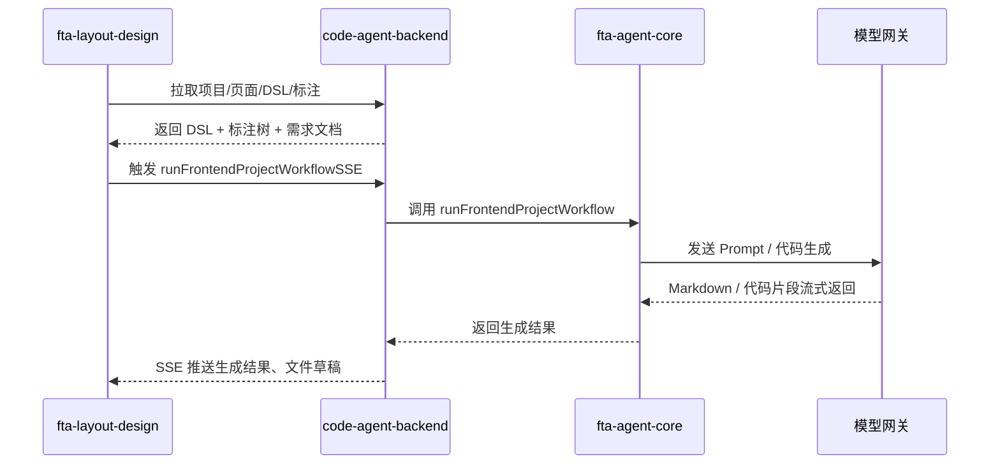
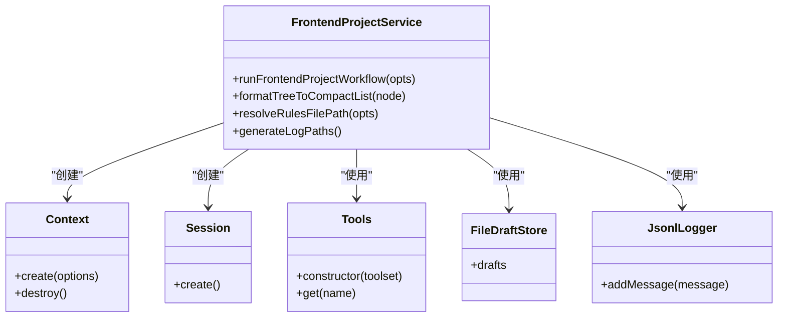
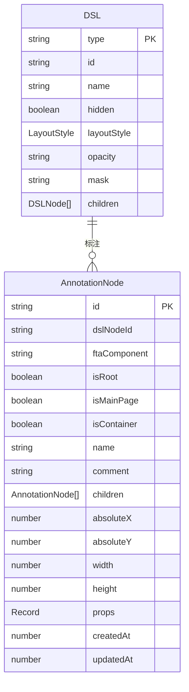
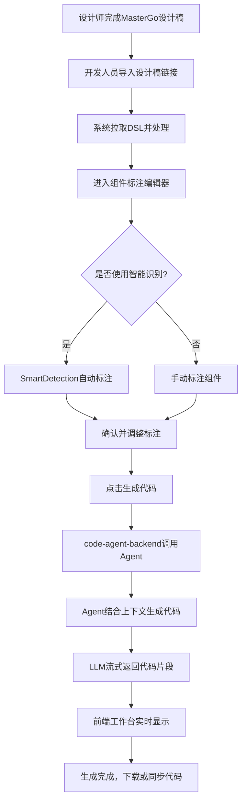

# 系统概述

<cite>
**本文档引用的文件**   
- [README.md](file://README.md)
- [package.json](file://package.json)
- [code-agent-backend/package.json](file://code-agent-backend/package.json)
- [fta-layout-design/package.json](file://fta-layout-design/package.json)
- [fta-agent-core/package.json](file://fta-agent-core/package.json)
- [shared-types/package.json](file://shared-types/package.json)
- [code-agent-backend/src/configuration.ts](file://code-agent-backend/src/configuration.ts)
- [fta-layout-design/src/App.tsx](file://fta-layout-design/src/App.tsx)
- [fta-agent-core/src/index.ts](file://fta-agent-core/src/index.ts)
- [shared-types/src/index.ts](file://shared-types/src/index.ts)
- [code-agent-backend/src/controller/code-agent/frontend-workflow.ts](file://code-agent-backend/src/controller/code-agent/frontend-workflow.ts)
- [fta-layout-design/src/pages/EditorPage/EditorPageComponentDetect.tsx](file://fta-layout-design/src/pages/EditorPage/EditorPageComponentDetect.tsx)
- [code-agent-backend/src/service/code-agent/frontend-workflow.ts](file://code-agent-backend/src/service/code-agent/frontend-workflow.ts)
- [fta-agent-core/src/frontendProjectService.ts](file://fta-agent-core/src/frontendProjectService.ts)
- [shared-types/src/dsl.ts](file://shared-types/src/dsl.ts)
- [shared-types/src/annotation.ts](file://shared-types/src/annotation.ts)
- [code-agent-backend/src/entity/design/design-document.ts](file://code-agent-backend/src/entity/design/design-document.ts)
- [fta-layout-design/src/pages/EditorPage/services/FrontendWorkflowScheduler.ts](file://fta-layout-design/src/pages/EditorPage/services/FrontendWorkflowScheduler.ts)
</cite>

## 目录

1. [项目概览](#项目概览)
2. [核心架构](#核心架构)
3. [技术愿景与核心问题](#技术愿景与核心问题)
4. [组件职责与协作](#组件职责与协作)
5. [集成机制](#集成机制)
6. [关键技术决策](#关键技术决策)
7. [典型使用场景](#典型使用场景)

## 项目概览

amh_code_agent 项目是一个面向企业的「设计稿 → 代码」一体化自动化转换平台。该项目旨在通过智能化手段，将设计师在 MasterGo 等工具中创建的设计稿，高效、准确地转化为可运行的前端代码，从而大幅提升前端开发效率，缩短产品从设计到上线的周期。

该平台由四个核心组件构成：`code-agent-backend`、`fta-layout-design`、`fta-agent-core`和`shared-types`。它们通过 Yarn Workspaces 进行统一管理，形成一个紧密协作的生态系统。平台的核心流程是：设计师上传设计稿后，系统通过智能标注和分析，生成需求文档和代码结构，最终由 AI 驱动的 Agent 生成完整的前端组件代码。

**Section sources**

- [README.md](file://README.md#L1-L194)

## 核心架构

amh_code_agent 平台采用前后端分离的微服务架构，各组件分工明确，通过清晰的 API 和事件流进行通信。其整体架构可以概括为一个以`code-agent-backend`为中心的星型拓扑。

```mermaid
graph TD
MG[MasterGo 设计稿] --> |DSL / PATH| Backend[code-agent-backend]
Backend --> |模型网关调用<br/>SSE| LLM[LLM / OpenAI 兼容端点]
Backend --> |项目/DSL/标注 API| Frontend[fta-layout-design 工作台]
Backend --> |Agent 工具| Agent[@fta/agent-core]
Backend --> |缓存/指标| Redis[(Redis)]
Backend --> |持久化| Mongo[(MongoDB)]
Backend --> |PNG/ZIP 输出| OSS[OSS / files-cache]
Frontend --> |SSE / HTTP| Backend
CLI[messages-replayer] --> |回放| LLM
Shared[[shared-types]] --> Backend
Shared --> Frontend
Shared --> Agent
```

**Diagram sources**

- [README.md](file://README.md#L17-L31)

如上图所示，整个系统的工作流始于 MasterGo 设计稿。`code-agent-backend`作为核心服务，负责拉取设计稿的 DSL（领域特定语言）数据，并将其进行归一化处理。处理后的数据通过 API 提供给`fta-layout-design`前端工作台，供用户进行可视化编辑和智能标注。当用户触发代码生成时，前端通过 SSE（Server-Sent Events）调用后端的`frontend-workflow`接口，该接口会调用`fta-agent-core`中的`runFrontendProjectWorkflow`函数。`fta-agent-core`作为智能 Agent 的运行时，利用 LLM（大语言模型）生成代码，并通过 SSE 流式返回结果。`shared-types`包则作为类型桥梁，确保了所有组件之间数据结构的一致性。

**Section sources**

- [README.md](file://README.md#L15-L31)
- [package.json](file://package.json#L1-L31)

## 技术愿景与核心问题

amh_code_agent 平台的技术愿景是构建一个智能化、自动化的前端开发流水线，解决传统开发模式中效率低下、沟通成本高、易出错等核心痛点。

其解决的核心问题包括：

1.  **提升前端开发效率**：传统的前端开发需要开发人员手动将设计稿“翻译”成代码，这是一个耗时且重复性高的过程。amh_code_agent 通过 AI 自动化生成代码，极大地减少了手动编码的工作量，使开发人员能够专注于更复杂的业务逻辑和性能优化。
2.  **实现智能标注与代码生成**：平台不仅仅是简单的代码模板填充，而是通过`fta-agent-core`中的智能 Agent，理解设计稿的语义和上下文，生成符合项目规范和最佳实践的高质量代码。这包括对组件的识别、布局的还原以及交互逻辑的实现。
3.  **降低设计与开发的沟通成本**：设计稿和代码之间的鸿沟是导致项目延期和 bug 频发的主要原因。该平台通过提供一个共享的、可视化的编辑环境（`fta-layout-design`），让设计师和开发者可以在同一个平台上协作，确保设计意图被准确无误地传达和实现。
4.  **保证代码一致性与可维护性**：通过使用统一的`shared-types`定义和`fta-agent-core`的规范生成，确保了生成的代码风格统一，结构清晰，易于维护和扩展。

**Section sources**

- [README.md](file://README.md#L55-L63)

## 组件职责与协作

amh_code_agent 平台的四大核心组件各司其职，共同完成从设计到代码的转换。

### code-agent-backend

`code-agent-backend`是整个平台的后端服务，基于 Midway.js 框架构建。它承担着数据处理、业务逻辑和系统集成的核心职责。

- **数据处理**：负责从 MasterGo 拉取设计稿的 DSL 数据，并执行`PATH→PNG→LAYER`的转换，将复杂的矢量图形转换为更适合 AI 处理的位图和图层信息。
- **业务逻辑**：提供项目、页面、设计文档的 CRUD（创建、读取、更新、删除）API，管理设计稿的版本和状态流转。
- **系统集成**：作为连接前端工作台和 AI Agent 的桥梁，它通过`frontend-workflow`控制器接收前端的代码生成请求，并调用`fta-agent-core`的服务。同时，它还负责与 Redis、MongoDB 和 OSS 等外部服务进行交互，实现数据的缓存、持久化和文件输出。
- **模型网关**：封装了对 LLM 的调用，提供流式（SSE）和非流式两种模式，确保与 AI 模型的高效通信。

```mermaid
classDiagram
class FrontendWorkflowController {
+handleToolResult(body)
+startFrontendWorkflow(body)
}
class FrontendWorkflowService {
+runWorkflow(options)
+formatDataContext(dataModels, restApis)
+filterVisibleNodes(nodes)
}
class DesignDSLService {
+processDesignDSL(dsl)
}
class ProjectService {
+getDocumentContent()
+findPage()
}
class DataModelService {
+getByProjectId()
}
class RestApiService {
+getByProjectId()
}
FrontendWorkflowController --> FrontendWorkflowService : "调用"
FrontendWorkflowService --> DesignDSLService : "调用"
FrontendWorkflowService --> ProjectService : "调用"
FrontendWorkflowService --> DataModelService : "调用"
FrontendWorkflowService --> RestApiService : "调用"
FrontendWorkflowService --> "@fta/agent-core" : "导入"
```

**Diagram sources**

- [code-agent-backend/src/controller/code-agent/frontend-workflow.ts](file://code-agent-backend/src/controller/code-agent/frontend-workflow.ts#L1-L368)
- [code-agent-backend/src/service/code-agent/frontend-workflow.ts](file://code-agent-backend/src/service/code-agent/frontend-workflow.ts#L1-L373)
- [code-agent-backend/src/configuration.ts](file://code-agent-backend/src/configuration.ts#L1-L55)

### fta-layout-design

`fta-layout-design`是平台的前端工作台，基于 React 19 和 Vite 构建。它为用户提供了一个直观、交互式的界面来操作设计稿和生成代码。

- **项目绑定**：支持与 VSCode 等开发环境的连接，实现本地项目与平台的同步。
- **可视化编辑**：提供组件检测编辑器，用户可以在画布上直接对设计稿进行标注，指定每个区域对应的前端组件（如 Button、Card 等）。
- **智能功能**：内置智能识别（Smart Detection）功能，可以自动分析设计稿的结构，辅助用户进行标注。
- **代码生成**：提供代码生成抽屉（Code Generation Drawer），用户可以一键触发代码生成流程，并实时查看 AI 生成的思维链和代码片段。
- **数据管理**：集成了 PRD（产品需求文档）和 OpenAPI 的管理面板，方便用户管理项目相关的数据模型和接口。



**Diagram sources**

- [README.md](file://README.md#L35-L51)
- [fta-layout-design/src/pages/EditorPage/EditorPageComponentDetect.tsx](file://fta-layout-design/src/pages/EditorPage/EditorPageComponentDetect.tsx#L1-L645)
- [fta-layout-design/src/App.tsx](file://fta-layout-design/src/App.tsx#L1-L114)

### fta-agent-core

`fta-agent-core`是平台的智能核心，一个可复用的 TypeScript Agent 运行时。它封装了 AI 驱动代码生成的核心逻辑。

- **Agent 运行时**：提供了`createAgentService`和`runFrontendProjectWorkflow`等核心 API，使得代码生成能力可以被`code-agent-backend`或其他项目轻松集成。
- **工具集**：内置了`todo`、`file-draft`、`component-doc`、`bash`、`ls`、`grep`等一系列工具，为 AI Agent 提供了操作文件系统、读取文档、执行命令等能力。
- **工作流引擎**：实现了`runFrontendProjectWorkflow`函数，该函数结合了项目上下文、提示词（Prompt）和规则，驱动 AI 完成从理解需求到生成代码的完整工作流。
- **日志与调试**：生成 JSONL 格式的日志，便于对 AI 的决策过程进行回放和调试。



**Diagram sources**

- [fta-agent-core/src/frontendProjectService.ts](file://fta-agent-core/src/frontendProjectService.ts#L1-L349)
- [fta-agent-core/src/index.ts](file://fta-agent-core/src/index.ts#L1-L13)

### shared-types

`shared-types`是一个共享类型定义包，被`code-agent-backend`、`fta-layout-design`和`fta-agent-core`共同依赖。

- **类型一致性**：定义了 DSL、标注、模型指标等关键数据结构的 TypeScript 接口，确保了整个平台的数据在传输和处理过程中类型安全，避免了因类型不一致导致的错误。
- **解耦与复用**：通过将共享类型独立成包，实现了业务逻辑与数据结构的解耦，提高了代码的可维护性和复用性。



**Diagram sources**

- [shared-types/src/dsl.ts](file://shared-types/src/dsl.ts#L1-L163)
- [shared-types/src/annotation.ts](file://shared-types/src/annotation.ts#L1-L25)
- [shared-types/src/index.ts](file://shared-types/src/index.ts#L1-L6)

## 集成机制

amh_code_agent 平台通过两种主要机制实现组件间的无缝集成：Yarn Workspaces 多包管理和共享类型定义同步。

### Yarn Workspaces 多包管理

项目根目录下的`package.json`文件通过`workspaces`字段定义了四个工作区包：`shared-types`、`code-agent-backend`、`fta-layout-design`和`fta-agent-core`。

```json
{
  "workspaces": {
    "packages": ["shared-types", "code-agent-backend", "fta-layout-design", "fta-agent-core"],
    "nohoist": ["**/fta-layout-design/**"]
  }
}
```

这种配置使得所有工作区包可以共享同一个`node_modules`目录，极大地减少了依赖的重复安装和磁盘占用。更重要的是，它允许工作区包之间通过`package.json`中定义的版本号（如`@fta/agent-core": "0.0.4"`）进行直接引用，实现了包与包之间的本地依赖，无需发布到 npm 仓库即可进行开发和测试。

**Section sources**

- [package.json](file://package.json#L1-L31)
- [code-agent-backend/package.json](file://code-agent-backend/package.json#L1-L133)
- [fta-layout-design/package.json](file://fta-layout-design/package.json#L1-L75)
- [fta-agent-core/package.json](file://fta-agent-core/package.json#L1-L58)
- [shared-types/package.json](file://shared-types/package.json#L1-L23)

### 共享类型定义同步

`shared-types`包是整个平台的类型基石。`code-agent-backend`、`fta-layout-design`和`fta-agent-core`都在各自的`package.json`中将其作为依赖。

```json
// 以 fta-layout-design 为例
{
  "dependencies": {
    "@fta/shared": "0.0.1"
  }
}
```

当`shared-types`中的类型定义发生变更时，所有依赖它的包都能立即感知到。这种机制确保了：

- **数据结构统一**：例如，`DesignDocumentEntity`在后端数据库中的结构与前端工作台中使用的`DesignData`接口完全一致。
- **编译时检查**：TypeScript 编译器可以在开发阶段就捕获因类型不匹配导致的错误，提高了开发效率和代码质量。
- **API 契约清晰**：前后端之间的 API 接口契约通过共享类型明确定义，减少了沟通成本。

**Section sources**

- [shared-types/package.json](file://shared-types/package.json#L1-L23)
- [shared-types/src/index.ts](file://shared-types/src/index.ts#L1-L6)

## 关键技术决策

amh_code_agent 平台在技术选型上做出了深思熟虑的决策，这些决策支撑了其高性能和可扩展性。

### 选择 Midway.js 的原因

`code-agent-backend`选择 Midway.js 作为后端框架，主要基于以下几点：

1.  **企业级特性**：Midway.js 提供了完整的依赖注入（DI）、AOP（面向切面编程）和模块化能力，非常适合构建复杂的、可维护的企业级应用。
2.  **多协议支持**：除了传统的 HTTP，Midway.js 还支持 WebSocket、gRPC 等协议，为未来扩展实时通信功能提供了便利。
3.  **强大的插件生态**：如`@midwayjs/bull`用于任务队列，`@midwayjs/redis`用于 Redis 客户端，这些官方插件大大简化了与外部服务的集成。
4.  **与 Node.js 生态兼容**：Midway.js 基于 Koa 和 Egg.js，可以无缝使用庞大的 Node.js 生态库。

**Section sources**

- [code-agent-backend/package.json](file://code-agent-backend/package.json#L19-L43)
- [code-agent-backend/src/configuration.ts](file://code-agent-backend/src/configuration.ts#L23-L39)

### 选择 React 19 的原因

`fta-layout-design`选择 React 19 作为前端框架，主要考虑了：

1.  **性能提升**：React 19 引入了新的编译器和优化，显著提升了应用的渲染性能，这对于处理复杂设计稿的可视化编辑至关重要。
2.  **现代化的开发体验**：React 19 进一步简化了组件开发，使得代码更加简洁和可读。
3.  **生态系统成熟**：React 拥有庞大的社区和丰富的 UI 组件库（如 Ant Design），可以快速构建出专业级的用户界面。
4.  **与 Vite 的完美结合**：Vite 提供了闪电般的开发服务器启动速度和热更新，极大地提升了开发效率。

**Section sources**

- [fta-layout-design/package.json](file://fta-layout-design/package.json#L39-L40)

## 典型使用场景

以下是一个从 MasterGo 设计稿生成 React 组件的完整流程示例。

### 从 MasterGo 设计稿生成 React 组件

1.  **准备设计稿**：设计师在 MasterGo 中完成一个登录页面的设计，并生成一个分享链接。
2.  **导入平台**：前端开发人员打开`fta-layout-design`工作台，将 MasterGo 链接粘贴到项目创建流程中。`code-agent-backend`会自动拉取该设计稿的 DSL 数据并进行处理。
3.  **智能标注**：开发人员进入“组件标注编辑器”页面。此时，`SmartDetection`功能可能会自动识别出“用户名输入框”、“密码输入框”和“登录按钮”等区域，并生成初步的标注。开发人员可以手动调整这些标注，确保每个区域都正确地映射到对应的前端组件（如`<Input />`、`<Button type="primary" />`）。
4.  **触发生成**：确认标注无误后，开发人员点击“智能识别”或“生成代码”按钮。前端工作台会通过 SSE 调用`code-agent-backend`的`/code-agent/frontend-workflow`接口。
5.  **AI 生成代码**：`code-agent-backend`调用`fta-agent-core`的`runFrontendProjectWorkflow`函数。该函数结合设计稿的 DSL、用户的标注、项目规范（specs）和组件文档（component-doc），向 LLM 发送一个复杂的 Prompt。LLM 理解需求后，开始流式生成代码。
6.  **实时反馈**：生成的代码片段和 AI 的思维链会通过 SSE 实时推送到前端工作台的“代码生成抽屉”中。开发人员可以实时查看生成进度和内容。
7.  **获取结果**：生成完成后，开发人员可以在工作台中下载生成的代码 ZIP 包，或者通过 VSCode 插件直接将代码同步到本地项目中。



**Diagram sources**

- [README.md](file://README.md#L35-L51)
- [fta-layout-design/src/pages/EditorPage/EditorPageComponentDetect.tsx](file://fta-layout-design/src/pages/EditorPage/EditorPageComponentDetect.tsx#L1-L645)
- [fta-layout-design/src/pages/EditorPage/services/FrontendWorkflowScheduler.ts](file://fta-layout-design/src/pages/EditorPage/services/FrontendWorkflowScheduler.ts)
