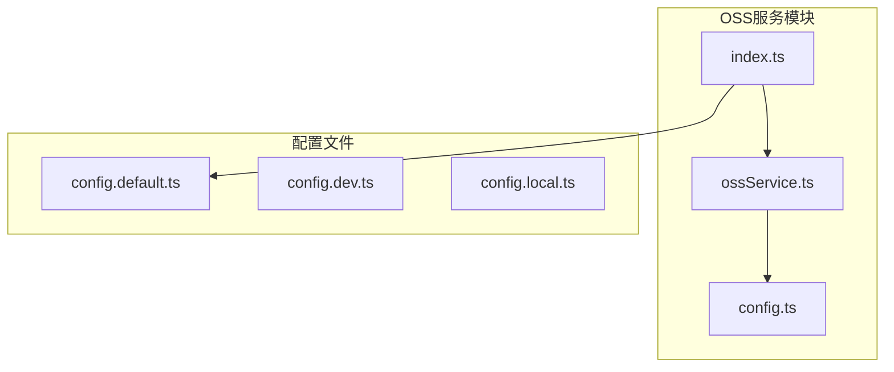
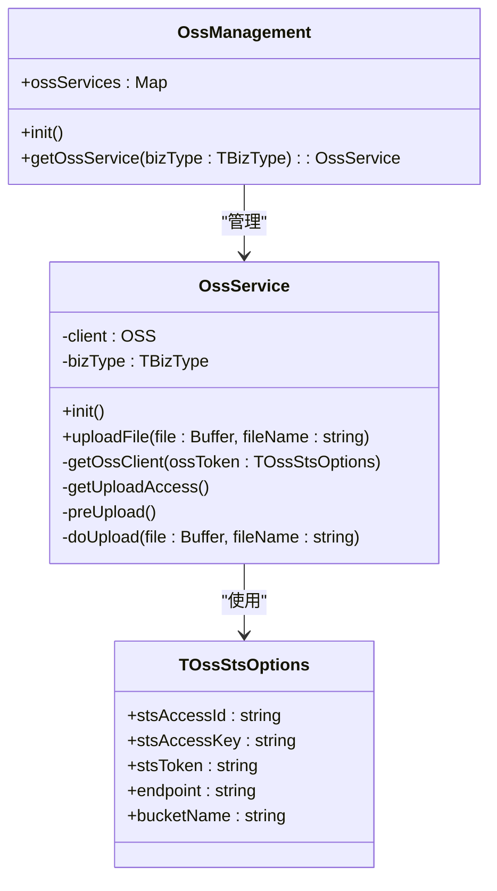
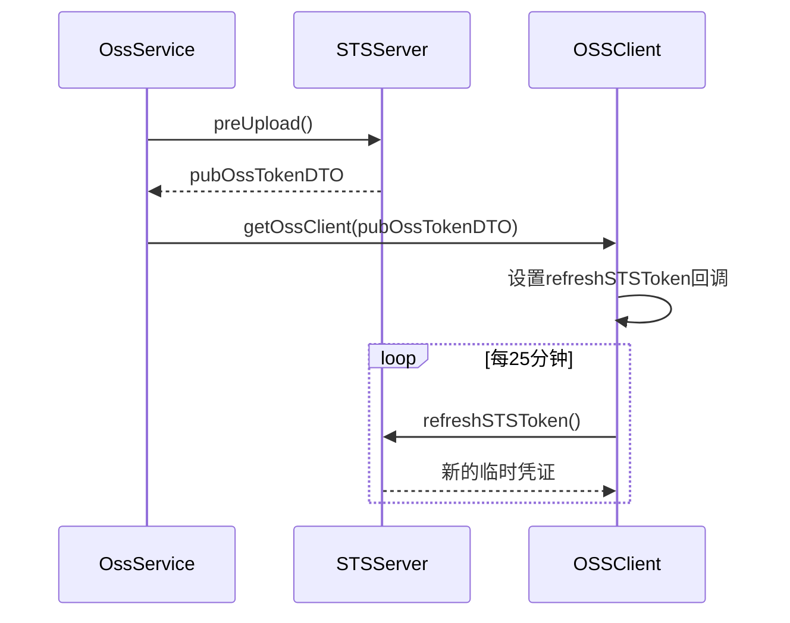
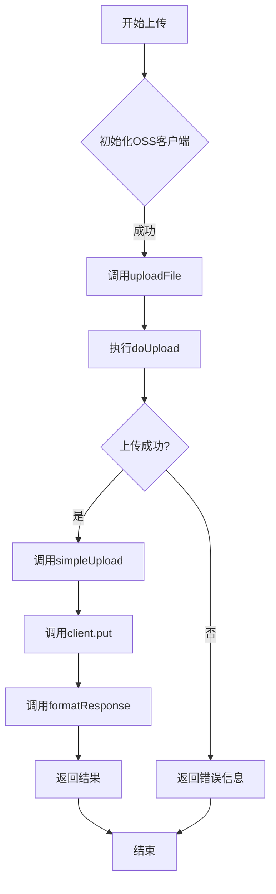
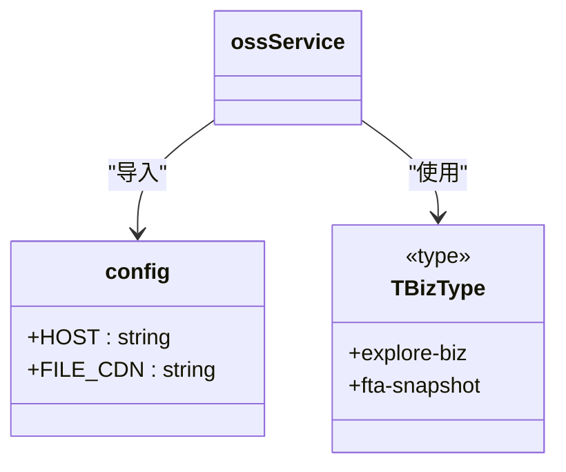
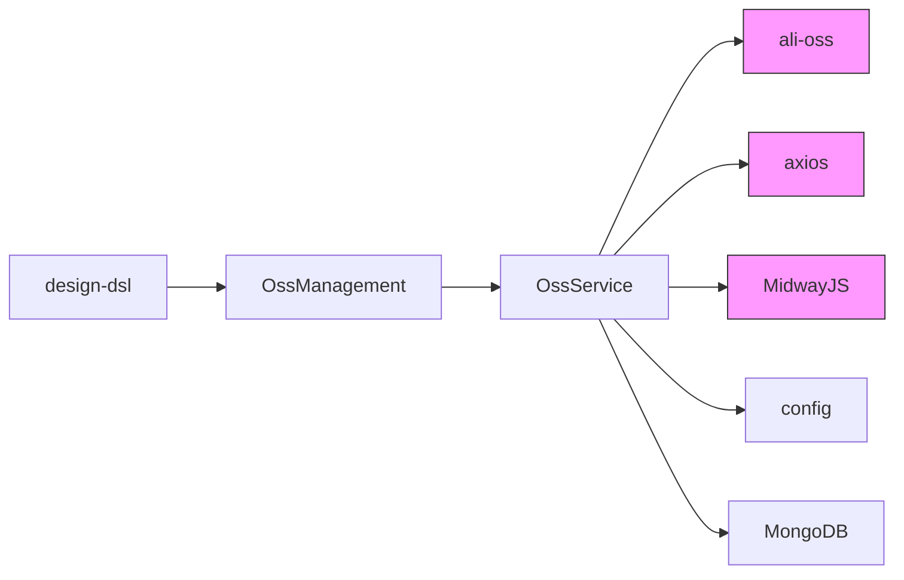

# OSS服务配置

<cite>
**本文档引用的文件**   
- [config.ts](file://code-agent-backend/src/service/oss/config.ts)
- [ossService.ts](file://code-agent-backend/src/service/oss/ossService.ts)
- [index.ts](file://code-agent-backend/src/service/oss/index.ts)
- [config.default.ts](file://code-agent-backend/src/config/config.default.ts)
- [design-dsl.ts](file://code-agent-backend/src/service/code-agent/design-dsl.ts)
</cite>

## 目录
1. [项目结构](#项目结构)
2. [核心组件](#核心组件)
3. [架构概述](#架构概述)
4. [详细组件分析](#详细组件分析)
5. [依赖分析](#依赖分析)
6. [性能考虑](#性能考虑)
7. [故障排除指南](#故障排除指南)

## 项目结构

项目中OSS相关功能主要位于`code-agent-backend/src/service/oss/`目录下，包含配置文件、服务实现和管理器。OSS服务通过MidwayJS框架集成，采用装饰器模式实现自动加载和单例管理。

**图示来源**
- [config.ts](file://code-agent-backend/src/service/oss/config.ts)
- [ossService.ts](file://code-agent-backend/src/service/oss/ossService.ts)
- [index.ts](file://code-agent-backend/src/service/oss/index.ts)
- [config.default.ts](file://code-agent-backend/src/config/config.default.ts)

**本节来源**
- [config.ts](file://code-agent-backend/src/service/oss/config.ts)
- [ossService.ts](file://code-agent-backend/src/service/oss/ossService.ts)
- [index.ts](file://code-agent-backend/src/service/oss/index.ts)

## 核心组件

OSS服务的核心组件包括配置管理、客户端初始化、临时凭证获取和文件上传功能。系统通过STS临时安全令牌机制实现安全访问，避免长期凭证泄露风险。配置中定义了CDN地址和业务类型，服务通过预上传接口获取临时访问凭证。

**本节来源**
- [config.ts](file://code-agent-backend/src/service/oss/config.ts)
- [ossService.ts](file://code-agent-backend/src/service/oss/ossService.ts)

## 架构概述

OSS服务采用分层架构设计，包含配置层、服务管理层和客户端层。OssManagement类负责管理不同业务类型的OSS服务实例，OssService类封装了具体的OSS操作逻辑，包括客户端初始化、凭证刷新和文件上传。

**图示来源**
- [ossService.ts](file://code-agent-backend/src/service/oss/ossService.ts)
- [index.ts](file://code-agent-backend/src/service/oss/index.ts)

**本节来源**
- [ossService.ts](file://code-agent-backend/src/service/oss/ossService.ts)
- [index.ts](file://code-agent-backend/src/service/oss/index.ts)

## 详细组件分析

### OSS服务初始化分析

OSS服务在构造函数中自动调用init方法进行初始化，通过预上传接口获取临时安全令牌(STS)来初始化OSS客户端。系统采用自动刷新机制，在令牌即将过期前25分钟自动获取新的临时凭证。

**图示来源**
- [ossService.ts](file://code-agent-backend/src/service/oss/ossService.ts#L30-L35)
- [ossService.ts](file://code-agent-backend/src/service/oss/ossService.ts#L42-L63)

**本节来源**
- [ossService.ts](file://code-agent-backend/src/service/oss/ossService.ts)

### 文件上传流程分析

文件上传流程包括准备、上传和响应格式化三个阶段。系统首先通过getUploadAccess接口获取上传权限，然后使用OSS客户端执行实际的文件上传操作，最后格式化返回结果包含URL、路径和文件名。

**图示来源**
- [ossService.ts](file://code-agent-backend/src/service/oss/ossService.ts#L132-L138)
- [ossService.ts](file://code-agent-backend/src/service/oss/ossService.ts#L120-L129)

**本节来源**
- [ossService.ts](file://code-agent-backend/src/service/oss/ossService.ts)

### 配置管理分析

配置管理模块定义了OSS服务所需的常量和业务类型。系统通过环境变量和配置文件分离敏感信息，确保生产环境的安全性。FILE_CDN常量用于生成上传文件的访问URL。

**图示来源**
- [config.ts](file://code-agent-backend/src/service/oss/config.ts)
- [ossService.ts](file://code-agent-backend/src/service/oss/ossService.ts#L24)

**本节来源**
- [config.ts](file://code-agent-backend/src/service/oss/config.ts)
- [ossService.ts](file://code-agent-backend/src/service/oss/ossService.ts)

## 依赖分析

OSS服务依赖于多个外部组件和内部服务。主要依赖包括ali-oss SDK、axios HTTP客户端、MidwayJS框架装饰器以及项目内部的配置系统。服务通过依赖注入方式获取配置，并通过HTTP请求与STS服务器通信。

**图示来源**
- [ossService.ts](file://code-agent-backend/src/service/oss/ossService.ts#L1-L3)
- [index.ts](file://code-agent-backend/src/service/oss/index.ts#L1-L2)
- [design-dsl.ts](file://code-agent-backend/src/service/code-agent/design-dsl.ts#L11)

**本节来源**
- [ossService.ts](file://code-agent-backend/src/service/oss/ossService.ts)
- [index.ts](file://code-agent-backend/src/service/oss/index.ts)
- [design-dsl.ts](file://code-agent-backend/src/service/code-agent/design-dsl.ts)

## 性能考虑

OSS服务在性能方面进行了多项优化。通过Redis缓存机制减少重复的OSS操作，采用连接池管理OSS客户端实例，设置合理的凭证刷新间隔（25分钟）以平衡安全性和性能。文件上传采用流式处理模式，避免大文件占用过多内存。

## 故障排除指南

常见问题包括签名失败、跨域错误和上传超时。签名失败通常由临时凭证过期或权限不足引起，可通过检查凭证有效期和STS服务器配置解决。跨域错误需要检查OSS bucket的CORS配置，确保允许来自应用域名的请求。上传超时问题可通过调整客户端超时设置和网络优化解决。

**本节来源**
- [ossService.ts](file://code-agent-backend/src/service/oss/ossService.ts)
- [config.default.ts](file://code-agent-backend/src/config/config.default.ts)