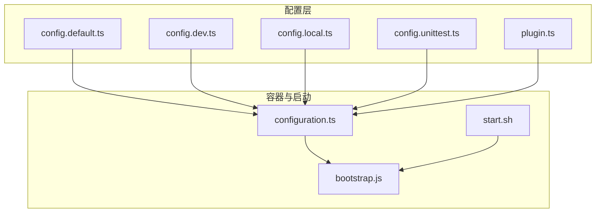
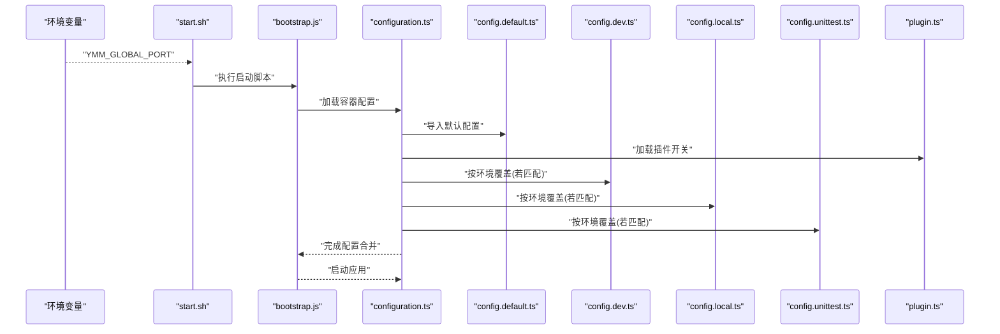
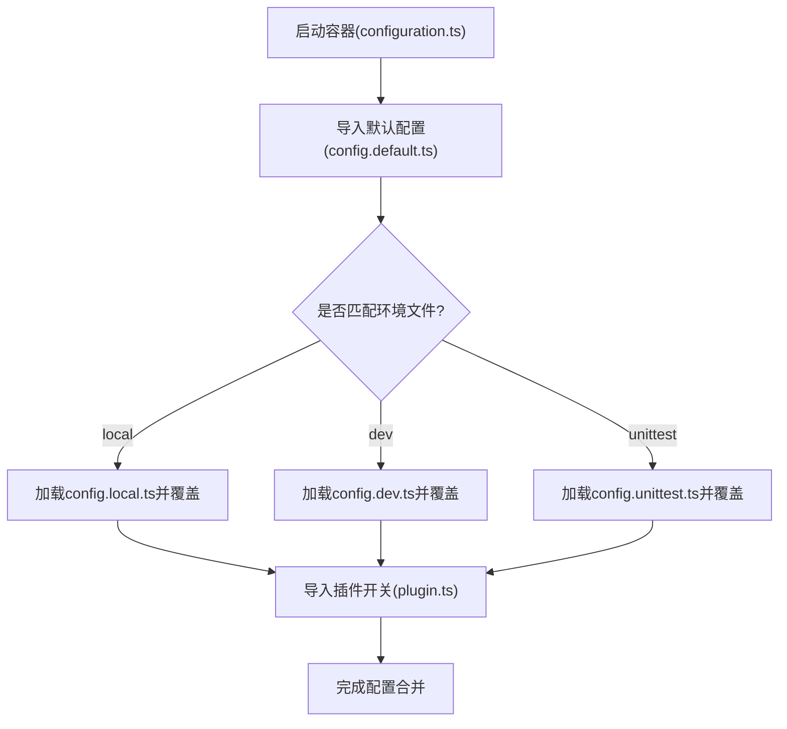
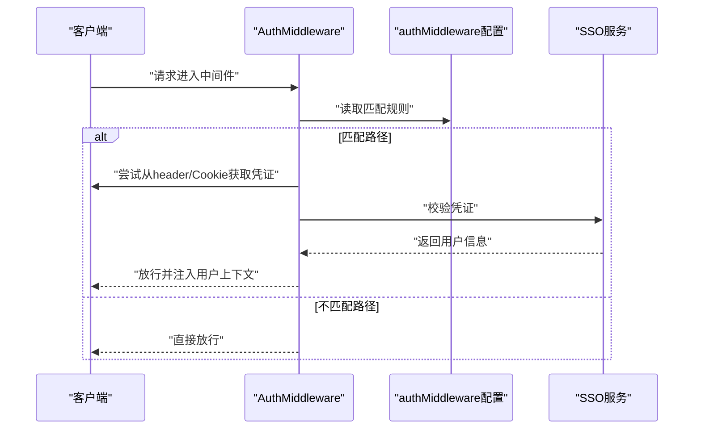
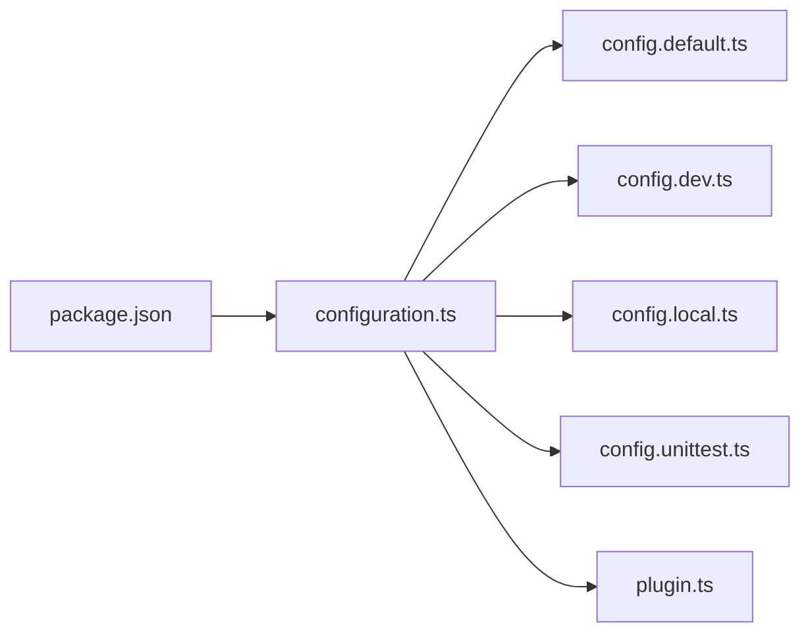

# 后端服务配置

<cite>
**本文引用的文件**
- [config.default.ts](file://code-agent-backend/src/config/config.default.ts)
- [config.dev.ts](file://code-agent-backend/src/config/config.dev.ts)
- [config.local.ts](file://code-agent-backend/src/config/config.local.ts)
- [config.unittest.ts](file://code-agent-backend/src/config/config.unittest.ts)
- [plugin.ts](file://code-agent-backend/src/config/plugin.ts)
- [configuration.ts](file://code-agent-backend/src/configuration.ts)
- [bootstrap.js](file://code-agent-backend/bootstrap.js)
- [start.sh](file://code-agent-backend/start.sh)
- [package.json](file://code-agent-backend/package.json)
- [auth.ts](file://code-agent-backend/src/middleware/auth.ts)
</cite>

## 目录
1. [简介](#简介)
2. [项目结构](#项目结构)
3. [核心组件](#核心组件)
4. [架构总览](#架构总览)
5. [详细组件分析](#详细组件分析)
6. [依赖关系分析](#依赖关系分析)
7. [性能考量](#性能考量)
8. [故障排查指南](#故障排查指南)
9. [结论](#结论)
10. [附录](#附录)

## 简介
本文件面向Midway.js框架下的后端服务配置体系，系统性说明：
- config.default.ts中的核心配置项：数据库(MongoDB)、缓存(Redis)、日志级别、服务端口、CORS、安全策略、队列(Bull)、设计模块、MasterGo集成、模型网关、配置中心(lion)等。
- 不同环境配置文件(dev/local/unittest)的加载优先级与覆盖机制。
- 插件(plugin.ts)启用方式与对运行行为的影响。
- 配置示例与常见问题排查（连接失败、端口冲突等）。
- 如何通过重启服务使配置生效，并建议使用环境变量替代硬编码敏感信息。

## 项目结构
后端服务采用Midway.js标准工程结构，配置集中在src/config目录下，按环境拆分；主容器生命周期在configuration.ts中注册，启动入口由bootstrap.js与start.sh配合完成。

图表来源
- [config.default.ts](file://code-agent-backend/src/config/config.default.ts#L1-L241)
- [config.dev.ts](file://code-agent-backend/src/config/config.dev.ts#L1-L14)
- [config.local.ts](file://code-agent-backend/src/config/config.local.ts#L1-L20)
- [config.unittest.ts](file://code-agent-backend/src/config/config.unittest.ts#L1-L4)
- [plugin.ts](file://code-agent-backend/src/config/plugin.ts#L1-L6)
- [configuration.ts](file://code-agent-backend/src/configuration.ts#L20-L54)
- [bootstrap.js](file://code-agent-backend/bootstrap.js#L1-L5)
- [start.sh](file://code-agent-backend/start.sh#L1-L3)

章节来源
- [configuration.ts](file://code-agent-backend/src/configuration.ts#L20-L54)
- [bootstrap.js](file://code-agent-backend/bootstrap.js#L1-L5)
- [start.sh](file://code-agent-backend/start.sh#L1-L3)

## 核心组件
本节聚焦config.default.ts中的关键配置项及其作用、默认值与适用场景。

- 应用密钥(keys)
  - 作用：用于签名Cookie等安全用途，需在生产环境替换为强随机密钥。
  - 默认值：基于应用名生成的字符串。
  - 适用场景：本地/开发环境默认启用，生产环境务必替换。

- CORS跨域配置(cors)
  - 作用：允许跨域请求，支持自定义头部与方法。
  - 默认值：允许POST/GET/PUT/DELETE/OPTIONS，暴露所有头，保持错误头。
  - 适用场景：前端跨域访问后端API时的统一策略。

- 日志配置(midwayLogger)
  - 作用：统一日志输出格式与级别，支持控制台与文件输出。
  - 默认值：默认warn级别，appLogger/info级别且可选控制台输出，errorLogger/error级别写文件，coreLogger/warn级别写文件。
  - 适用场景：生产环境建议开启文件输出，便于集中收集与分析。

- 服务端口(egg.port)
  - 作用：HTTP监听端口。
  - 默认值：读取环境变量YMM_GLOBAL_PORT，未设置时默认7001。
  - 适用场景：容器部署或多实例部署时通过环境变量动态指定端口。

- MongoDB连接(mongoose.client)
  - 作用：数据库连接字符串与认证信息。
  - 默认值：阿里云MongoDB集群地址、用户名、密码、读偏好等。
  - 适用场景：生产环境使用集群地址，开发/本地使用config.dev.ts或config.local.ts覆盖。

- Swagger文档(swagger)
  - 作用：启用API文档界面。
  - 默认值：标题为项目名。
  - 适用场景：仅在local环境启用，避免在非开发环境暴露。

- 鉴权中间件(authMiddleware)
  - 作用：匹配路径范围，启用统一鉴权。
  - 默认值：匹配/api/、/custom/等路径。
  - 适用场景：保护业务接口免受未授权访问。

- 文件上传(upload)
  - 作用：上传模式(stream)与最大文件大小。
  - 默认值：mode为stream，fileSize为10MB。
  - 适用场景：流式上传减少磁盘占用，适合大文件处理。

- CSRF安全策略(security.csrf)
  - 作用：关闭CSRF防护。
  - 默认值：开发/单测环境默认关闭，生产环境应谨慎开启。
  - 适用场景：快速开发与测试，生产环境建议开启并正确配置令牌。

- Redis缓存(redis.client)
  - 作用：Redis连接参数。
  - 默认值：host/port/db来自默认常量。
  - 适用场景：生产环境使用高可用Redis集群，开发/本地可覆盖。

- Bull队列(bull)
  - 作用：队列前缀、任务清理策略、Redis连接、并发数、启动清理重复任务。
  - 默认值：prefix为fta:design，removeOnComplete/RemoveOnFail分别保留20/50条，defaultConcurrency为2，clearRepeatJobWhenStart为true。
  - 适用场景：后台任务调度与去重，生产环境建议结合Redis集群与持久化。

- 设计模块(designModule)
  - 作用：DSL与注解缓存TTL、代码生成并发与结果过期时间。
  - 默认值：DSL缓存1小时，注解缓存30分钟，生成并发2，结果过期7天。
  - 适用场景：平衡缓存命中率与内存占用。

- MasterGo集成(mastergo)
  - 作用：基础URL与访问令牌。
  - 默认值：开发/测试环境令牌。
  - 适用场景：对接MasterGo平台进行设计数据同步。

- 模型网关(modelGateway)
  - 作用：模型网关默认配置，支持从环境变量读取baseURL、apiKey、model、timeout、temperature。
  - 默认值：从OPENAI_*系列环境变量读取。
  - 适用场景：多供应商接入与参数动态化。

- 配置中心(lion)
  - 作用：部署环境、ZK地址、元数据服务地址。
  - 默认值：QA环境、开发ZK集群、元数据服务地址。
  - 适用场景：统一配置下发与动态更新。

章节来源
- [config.default.ts](file://code-agent-backend/src/config/config.default.ts#L1-L241)

## 架构总览
下图展示配置加载与组件初始化的关系，以及环境变量对运行时的影响。

图表来源
- [start.sh](file://code-agent-backend/start.sh#L1-L3)
- [bootstrap.js](file://code-agent-backend/bootstrap.js#L1-L5)
- [configuration.ts](file://code-agent-backend/src/configuration.ts#L20-L54)
- [config.default.ts](file://code-agent-backend/src/config/config.default.ts#L1-L241)
- [config.dev.ts](file://code-agent-backend/src/config/config.dev.ts#L1-L14)
- [config.local.ts](file://code-agent-backend/src/config/config.local.ts#L1-L20)
- [config.unittest.ts](file://code-agent-backend/src/config/config.unittest.ts#L1-L4)
- [plugin.ts](file://code-agent-backend/src/config/plugin.ts#L1-L6)

## 详细组件分析

### 配置加载与覆盖机制
- 加载顺序与优先级
  - 默认配置：config.default.ts作为基线。
  - 环境覆盖：按环境文件逐个覆盖，最终以最新覆盖为准。
  - 插件开关：plugin.ts控制内置Egg插件启用状态。
- 环境匹配
  - 开发环境：NODE_ENV=local时加载config.local.ts；NODE_ENV=dev时加载config.dev.ts；unittest时加载config.unittest.ts。
  - 覆盖策略：后加载的环境配置会覆盖默认配置中的同名键。
- 关键点
  - 端口：默认从YMM_GLOBAL_PORT读取，未设置时回退到7001。
  - MongoDB：默认使用阿里云集群地址，开发/本地可通过环境文件覆盖。
  - Swagger：仅在local环境启用。
  - CSRF：开发/单测默认关闭，生产环境建议开启。

图表来源
- [configuration.ts](file://code-agent-backend/src/configuration.ts#L20-L54)
- [config.default.ts](file://code-agent-backend/src/config/config.default.ts#L1-L241)
- [config.dev.ts](file://code-agent-backend/src/config/config.dev.ts#L1-L14)
- [config.local.ts](file://code-agent-backend/src/config/config.local.ts#L1-L20)
- [config.unittest.ts](file://code-agent-backend/src/config/config.unittest.ts#L1-L4)
- [plugin.ts](file://code-agent-backend/src/config/plugin.ts#L1-L6)

章节来源
- [configuration.ts](file://code-agent-backend/src/configuration.ts#L20-L54)
- [config.default.ts](file://code-agent-backend/src/config/config.default.ts#L1-L241)
- [config.dev.ts](file://code-agent-backend/src/config/config.dev.ts#L1-L14)
- [config.local.ts](file://code-agent-backend/src/config/config.local.ts#L1-L20)
- [config.unittest.ts](file://code-agent-backend/src/config/config.unittest.ts#L1-L4)
- [plugin.ts](file://code-agent-backend/src/config/plugin.ts#L1-L6)

### 插件启用与影响
- 插件开关(plugin.ts)
  - logrotator: 关闭，因为使用@midwayjs/logger统一输出。
  - static: 关闭，静态文件由其他组件或Nginx处理。
- 影响
  - 减少冗余日志轮转组件，避免与Midway日志冲突。
  - 避免不必要的静态文件服务，降低耦合度。

章节来源
- [plugin.ts](file://code-agent-backend/src/config/plugin.ts#L1-L6)

### 鉴权中间件与配置联动
- 鉴权中间件(auth.ts)
  - 依据环境变量选择不同SSO域名与Cookie名称。
  - 支持从X-User-Cookies、Authorization、Cookie三种来源获取凭证。
  - 在local环境允许本地开发模式绕过鉴权。
- 与配置联动
  - authMiddleware.match决定中间件生效的路径范围。
  - 中间件通过@Config('authMiddleware')读取配置。

图表来源
- [auth.ts](file://code-agent-backend/src/middleware/auth.ts#L1-L194)
- [config.default.ts](file://code-agent-backend/src/config/config.default.ts#L120-L130)

章节来源
- [auth.ts](file://code-agent-backend/src/middleware/auth.ts#L1-L194)
- [config.default.ts](file://code-agent-backend/src/config/config.default.ts#L120-L130)

### 环境变量与启动流程
- 环境变量
  - YMM_GLOBAL_PORT：服务端口，默认7001。
  - OPENAI_BASE_URL、OPENAI_API_KEY、OPENAI_MODEL、MODEL_TIMEOUT、MODEL_TEMPERATURE：模型网关相关参数。
  - HOSTNAME：用于鉴权中间件选择SSO域名。
- 启动流程
  - start.sh接收端口参数并设置YMM_GLOBAL_PORT后启动bootstrap.js。
  - bootstrap.js调用@midwayjs/bootstrap启动容器，加载configuration.ts完成配置合并。

章节来源
- [config.default.ts](file://code-agent-backend/src/config/config.default.ts#L96-L100)
- [config.default.ts](file://code-agent-backend/src/config/config.default.ts#L214-L228)
- [auth.ts](file://code-agent-backend/src/middleware/auth.ts#L21-L45)
- [start.sh](file://code-agent-backend/start.sh#L1-L3)
- [bootstrap.js](file://code-agent-backend/bootstrap.js#L1-L5)

## 依赖关系分析
- 组件依赖
  - configuration.ts导入Egg、Swagger、跨域、Redis、Bull、上传等组件，并统一导入config目录。
  - package.json声明了@midwayjs/*系列依赖，确保各组件版本兼容。
- 配置依赖
  - config.default.ts依赖环境变量与默认常量。
  - 不同环境配置文件仅覆盖特定键，避免全量复制。

图表来源
- [package.json](file://code-agent-backend/package.json#L1-L133)
- [configuration.ts](file://code-agent-backend/src/configuration.ts#L20-L54)
- [config.default.ts](file://code-agent-backend/src/config/config.default.ts#L1-L241)
- [config.dev.ts](file://code-agent-backend/src/config/config.dev.ts#L1-L14)
- [config.local.ts](file://code-agent-backend/src/config/config.local.ts#L1-L20)
- [config.unittest.ts](file://code-agent-backend/src/config/config.unittest.ts#L1-L4)
- [plugin.ts](file://code-agent-backend/src/config/plugin.ts#L1-L6)

章节来源
- [package.json](file://code-agent-backend/package.json#L1-L133)
- [configuration.ts](file://code-agent-backend/src/configuration.ts#L20-L54)

## 性能考量
- 日志级别与输出
  - 生产环境建议将默认级别提升至warn，appLogger/info级别写文件，减少控制台输出压力。
- 队列并发与清理
  - defaultConcurrency=2，可根据CPU核数与任务特性调整。
  - removeOnComplete/removeOnFail控制历史任务清理，避免Redis存储膨胀。
- 缓存TTL
  - 设计模块的DSL与注解缓存TTL需根据热点数据特征调整，避免频繁回源。
- 端口与并发
  - 使用YMM_GLOBAL_PORT动态端口，结合容器编排实现水平扩展。

[本节为通用建议，无需列出章节来源]

## 故障排查指南
- 数据库连接失败
  - 检查MongoDB集群地址与认证信息是否正确。
  - 开发/本地环境可参考config.dev.ts或config.local.ts覆盖URI与凭据。
  - 确认网络连通性与防火墙策略。
- Redis连接失败
  - 核对host/port/db是否与实际部署一致。
  - 确认Redis服务可用与账号权限。
- 端口冲突
  - 通过YMM_GLOBAL_PORT指定端口，或在start.sh中传参。
  - 确保容器/宿主机端口映射正确。
- CSRF错误
  - 开发/单测默认关闭，生产环境请开启并正确配置令牌。
- Swagger不可见
  - 仅local环境启用，确认NODE_ENV=local。
- 鉴权失败
  - 检查X-User-Cookies、Authorization或Cookie是否正确传递。
  - 确认HOSTNAME与SSO域名匹配。

章节来源
- [config.dev.ts](file://code-agent-backend/src/config/config.dev.ts#L1-L14)
- [config.local.ts](file://code-agent-backend/src/config/config.local.ts#L1-L20)
- [config.default.ts](file://code-agent-backend/src/config/config.default.ts#L96-L100)
- [config.default.ts](file://code-agent-backend/src/config/config.default.ts#L146-L148)
- [auth.ts](file://code-agent-backend/src/middleware/auth.ts#L125-L160)
- [start.sh](file://code-agent-backend/start.sh#L1-L3)

## 结论
- config.default.ts提供了生产级默认配置，同时通过环境文件实现灵活覆盖。
- plugin.ts精简了不必要的Egg插件，避免与Midway组件冲突。
- 鉴权中间件与配置联动，确保在不同环境下具备合适的访问控制策略。
- 建议使用环境变量管理敏感信息与可变参数，避免硬编码。

[本节为总结，无需列出章节来源]

## 附录
- 配置修改生效方式
  - 修改config.*.ts后，重启服务即可生效。
  - 若涉及环境变量，需确保启动脚本已正确设置并传递给进程。
- 环境变量清单
  - YMM_GLOBAL_PORT：服务端口
  - OPENAI_BASE_URL、OPENAI_API_KEY、OPENAI_MODEL、MODEL_TIMEOUT、MODEL_TEMPERATURE：模型网关参数
  - HOSTNAME：用于鉴权中间件选择SSO域名

章节来源
- [config.default.ts](file://code-agent-backend/src/config/config.default.ts#L96-L100)
- [config.default.ts](file://code-agent-backend/src/config/config.default.ts#L214-L228)
- [auth.ts](file://code-agent-backend/src/middleware/auth.ts#L21-L45)
- [start.sh](file://code-agent-backend/start.sh#L1-L3)