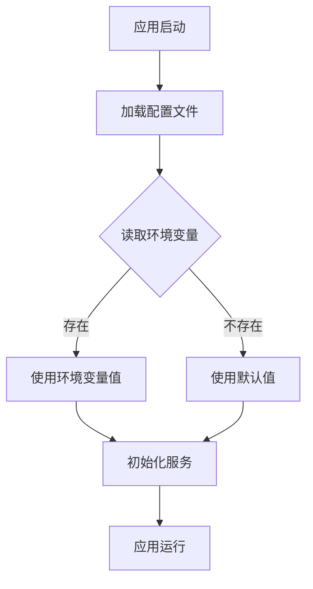
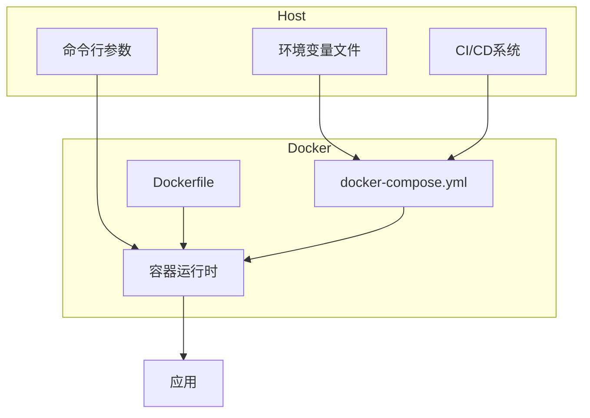
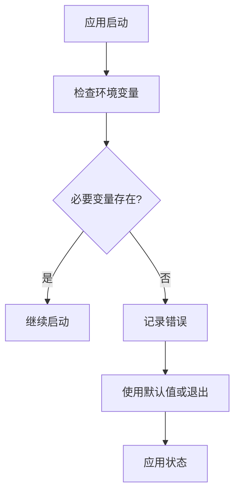

# 环境变量管理

<cite>
**本文档引用的文件**  
- [config.default.ts](file://code-agent-backend/src/config/config.default.ts)
- [.env.example](file://fta-layout-design/.env.example)
- [README.md](file://README.md)
- [ossService.ts](file://code-agent-backend/src/service/oss/ossService.ts)
- [Dockerfile](file://Dockerfile)
</cite>

## 目录
1. [简介](#简介)
2. [核心环境变量说明](#核心环境变量说明)
3. [TypeScript配置文件中的环境变量读取](#typescript配置文件中的环境变量读取)
4. [生产环境中使用环境变量的重要性](#生产环境中使用环境变量的重要性)
5. [Docker部署中的环境变量注入](#docker部署中的环境变量注入)
6. [生产环境.env文件示例](#生产环境env文件示例)
7. [环境变量未加载时的调试策略](#环境变量未加载时的调试策略)
8. [总结](#总结)

## 简介
本指南系统阐述了项目中环境变量的使用规范，重点说明关键环境变量的用途和设置方法。通过分析代码库中的配置文件和实际用例，提供完整的环境变量管理方案，包括开发、测试和生产环境的最佳实践。

**Section sources**
- [README.md](file://README.md#L125-L139)

## 核心环境变量说明
项目中使用了多个关键环境变量来配置不同组件的行为。以下是主要环境变量的详细说明：

### 数据库配置
- **MONGODB_URI**: MongoDB数据库连接字符串，包含主机地址、端口、数据库名称以及认证信息。在生产环境中应指向高可用的MongoDB集群。
- **REDIS_URL**: Redis服务的连接URL，格式为`redis://host:port`，用于缓存和消息队列功能。

### 对象存储配置
- **OSS_ACCESS_KEY_ID**: 阿里云OSS访问密钥ID，用于身份验证。
- **OSS_SECRET_ACCESS_KEY**: 阿里云OSS访问密钥，与Access Key ID配对使用，具有很高的安全敏感性。
- **OSS_REGION**: OSS存储区域，如`oss-cn-hangzhou`。
- **OSS_BUCKET**: OSS存储桶名称。

### 模型服务配置
- **OPENAI_BASE_URL**: 大模型API的基础URL，支持多种提供商。
- **OPENAI_API_KEY**: 大模型API的认证密钥。
- **OPENAI_MODEL**: 使用的模型名称。
- **MODEL_TIMEOUT**: 模型请求超时时间（毫秒）。
- **MODEL_TEMPERATURE**: 模型生成的随机性参数。

### 其他配置
- **YMM_GLOBAL_PORT**: 服务监听端口，默认为7001。
- **VITE_API_BASE_URL**: 前端应用的API基础URL。

**Section sources**
- [README.md](file://README.md#L127-L131)
- [code-agent-backend/README.md](file://code-agent-backend/README.md#L818-L839)

## TypeScript配置文件中的环境变量读取
TypeScript配置文件通过`process.env`对象读取环境变量，实现了配置的动态化和环境隔离。



**Diagram sources**
- [config.default.ts](file://code-agent-backend/src/config/config.default.ts#L218-L227)

在`config.default.ts`文件中，模型网关配置通过以下方式读取环境变量：

```typescript
config.modelGateway = {
  default: {
    baseURL: process.env.OPENAI_BASE_URL,
    apiKey: process.env.OPENAI_API_KEY,
    model: process.env.OPENAI_MODEL,
    timeout: process.env.MODEL_TIMEOUT ? Number(process.env.MODEL_TIMEOUT) : undefined,
    temperature: process.env.MODEL_TEMPERATURE ? Number(process.env.MODEL_TEMPERATURE) : undefined,
  },
};
```

这种模式确保了配置的灵活性，允许在不同环境中使用不同的值而无需修改代码。

**Section sources**
- [config.default.ts](file://code-agent-backend/src/config/config.default.ts#L214-L228)

## 生产环境中使用环境变量的重要性
在生产环境中使用环境变量而非配置文件存储敏感信息具有重要的安全和运维意义。

### 安全性
- **避免敏感信息泄露**: 将数据库密码、API密钥等敏感信息存储在环境变量中，可以防止它们被意外提交到版本控制系统中。
- **权限控制**: 环境变量的访问可以通过操作系统级别的权限控制来管理，比文件系统更安全。
- **动态更新**: 可以在不重启应用的情况下更新某些配置（取决于具体实现）。

### 运维灵活性
- **环境隔离**: 不同环境（开发、测试、生产）可以使用相同的代码库但不同的环境变量配置。
- **配置管理**: 可以使用配置管理工具集中管理环境变量，便于审计和变更追踪。
- **容器化支持**: 与Docker等容器技术天然集成，便于在云环境中部署和扩展。

### 实际应用
在OSS服务实现中，虽然当前使用了STS临时令牌机制，但长期凭证仍然通过环境变量传递，确保了基本的安全性要求。

**Section sources**
- [ossService.ts](file://code-agent-backend/src/service/oss/ossService.ts#L46-L58)
- [config.default.ts](file://code-agent-backend/src/config/config.default.ts#L218-L227)

## Docker部署中的环境变量注入
Docker部署通过多种方式注入环境变量，确保应用在容器化环境中正确运行。



**Diagram sources**
- [Dockerfile](file://Dockerfile#L1-L4)
- [code-agent-backend/README.md](file://code-agent-backend/README.md#L780-L813)

### Docker Compose配置
在`docker-compose.yml`文件中，环境变量通过`environment`字段注入：

```yaml
services:
  app:
    environment:
      - NODE_ENV=production
      - MONGODB_URI=mongodb://mongo:27017/fta
      - REDIS_URL=redis://redis:6379
```

### 构建时注入
Dockerfile中通过COPY指令将环境配置脚本复制到容器中：

```dockerfile
COPY ymm_env.sh /etc/profile.d
```

这种方式确保了环境变量在容器启动时就已准备就绪。

**Section sources**
- [Dockerfile](file://Dockerfile#L1-L4)
- [code-agent-backend/README.md](file://code-agent-backend/README.md#L780-L813)

## 生产环境.env文件示例
以下是生产环境推荐的.env文件内容：

```env
# 生产环境配置
NODE_ENV=production
PORT=7001

# 数据库配置
MONGODB_URI=mongodb://prod-mongo-cluster:27017/fta?replicaSet=rs0
REDIS_URL=redis://prod-redis-cluster:6379

# 认证配置
JWT_SECRET=your-secure-jwt-secret-key-change-in-production
TOKEN_EXPIRES_IN=7d

# 文件存储配置
OSS_REGION=oss-cn-hangzhou
OSS_BUCKET=fta-production-bucket
OSS_ACCESS_KEY_ID=your-production-access-key
OSS_SECRET_ACCESS_KEY=your-production-secret-key

# 模型服务配置
OPENAI_BASE_URL=https://api.openai.com/v1
OPENAI_API_KEY=sk-your-production-api-key
OPENAI_MODEL=gpt-4-turbo
MODEL_TIMEOUT=30000
MODEL_TEMPERATURE=0.7

# 日志配置
LOG_LEVEL=info
LOG_FILE_PATH=/var/log/fta/app.log

# 前端API配置
VITE_API_BASE_URL=https://api.yourdomain.com
VITE_REQUEST_TIMEOUT=30000
```

**Section sources**
- [code-agent-backend/README.md](file://code-agent-backend/README.md#L818-L839)

## 环境变量未加载时的调试策略
当环境变量未正确加载时，可以采用以下调试策略：

### 检查清单
1. **确认.env文件存在**: 检查项目根目录下是否存在.env文件。
2. **验证文件权限**: 确保应用有读取.env文件的权限。
3. **检查变量名称**: 确认环境变量名称拼写正确，与代码中引用的一致。
4. **查看加载顺序**: 确认环境变量加载的优先级顺序。

### 调试方法
- **打印调试信息**: 在应用启动时打印关键环境变量的值（注意不要在生产日志中输出敏感信息）。
- **使用默认值**: 在代码中为关键配置设置合理的默认值，避免因环境变量缺失导致应用崩溃。
- **配置验证**: 在应用启动时验证必要环境变量的存在性，如果缺失则抛出明确的错误信息。



**Diagram sources**
- [config.default.ts](file://code-agent-backend/src/config/config.default.ts#L218-L227)

在实际代码中，可以通过以下方式实现基本的环境变量验证：

```typescript
if (!process.env.OPENAI_API_KEY) {
  console.warn('OPENAI_API_KEY未设置，部分功能将不可用');
}
```

**Section sources**
- [config.default.ts](file://code-agent-backend/src/config/config.default.ts#L218-L227)

## 总结
环境变量管理是现代应用开发和部署的关键环节。通过合理使用环境变量，不仅可以提高应用的安全性，还能增强配置的灵活性和可维护性。本指南详细介绍了项目中环境变量的使用规范，包括核心变量说明、TypeScript配置读取、生产环境重要性、Docker部署注入方式以及调试策略，为开发者提供了完整的环境变量管理方案。

在实际应用中，应始终遵循最小权限原则，仅暴露必要的环境变量，并定期审查和更新敏感信息。同时，建议使用配置管理工具来集中管理环境变量，提高运维效率和安全性。